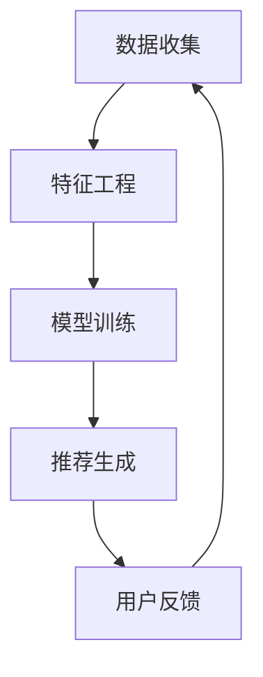
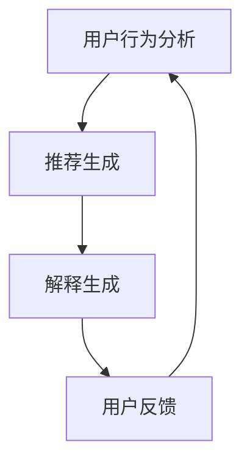
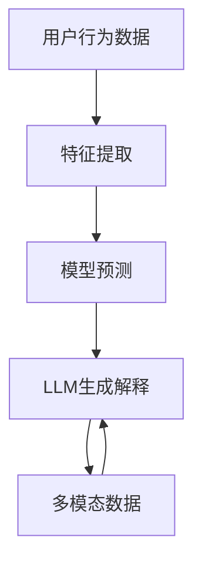

                 

关键词：LLM，推荐系统，个性化解释，生成，人工智能，技术博客

## 摘要

本文将探讨如何利用大型语言模型（LLM）来生成推荐系统的个性化解释。在当今快速发展的信息技术时代，推荐系统已成为各类应用中不可或缺的一部分，但用户对推荐结果的透明度和解释性却常常不足。本文首先介绍了LLM的基本概念和特性，然后详细阐述了LLM在推荐系统个性化解释生成中的应用，包括核心算法原理、数学模型、实际应用实例，以及未来展望。通过本文的阅读，读者将能够了解如何使用LLM提高推荐系统的解释性，从而提升用户体验。

## 1. 背景介绍

### 推荐系统的现状

推荐系统是人工智能领域的一个重要研究方向，近年来得到了迅速的发展。随着互联网的普及和用户数据的积累，推荐系统已经成为电子商务、社交媒体、新闻推荐、音乐播放等多个领域的重要应用。其基本原理是通过分析用户的历史行为和偏好，为用户推荐可能感兴趣的内容或商品。

尽管推荐系统在提升用户满意度和增加商业价值方面表现出色，但其透明度和解释性仍然是一个亟待解决的问题。现有的推荐系统大多采用基于机器学习的算法，这些算法复杂且黑箱化，用户难以理解推荐结果的产生过程。此外，推荐系统的个性化不足，往往导致用户对推荐结果的不满和抵触。

### LLM的基本概念与特性

大型语言模型（LLM，Large Language Model）是一种基于深度学习的自然语言处理模型，具有处理和理解自然语言的能力。LLM通过大规模的数据训练，可以生成流畅、符合语法和语义规则的文本。代表性的LLM包括GPT-3、BERT、T5等。

LLM的特性包括：

1. **强大的语言生成能力**：LLM可以生成高质量的自然语言文本，模拟人类的语言表达。
2. **自适应学习能力**：LLM能够根据输入的上下文自适应调整其生成内容。
3. **多模态处理能力**：除了文本，LLM还可以处理图像、音频等多种形式的数据。

### 推荐系统个性化解释的必要性

推荐系统个性化解释的生成对于提升用户体验具有重要意义。个性化解释不仅可以帮助用户理解推荐结果，还可以增强用户的信任感，提高推荐系统的接受度和满意度。具体来说，个性化解释包括以下几个方面：

1. **推荐原因说明**：解释为什么系统推荐了特定的内容或商品，依据了哪些用户偏好和兴趣点。
2. **推荐过程透明化**：展示推荐系统的工作流程和决策逻辑，使用户能够清晰地了解推荐过程。
3. **个性化定制**：根据用户的反馈和需求，动态调整推荐策略，提供更加个性化的服务。

## 2. 核心概念与联系

### 推荐系统的基本架构

推荐系统通常由数据收集、特征工程、模型训练、推荐生成和用户反馈五个主要模块组成。以下是一个简单的推荐系统架构图：



### 个性化解释生成的基本流程

个性化解释生成是推荐系统的一个重要环节，其基本流程如下：

1. **用户行为分析**：分析用户的历史行为数据，提取关键特征。
2. **推荐生成**：基于用户特征和模型预测，生成推荐结果。
3. **解释生成**：利用LLM生成针对推荐结果的个性化解释。
4. **用户反馈**：收集用户对解释的反馈，用于优化解释质量。

以下是一个简单的个性化解释生成流程图：



### LLM在个性化解释生成中的应用

LLM在个性化解释生成中的应用主要包括以下几个方面：

1. **文本生成**：利用LLM生成符合语法和语义规则的文本解释。
2. **上下文理解**：根据上下文信息，动态调整解释的内容和风格。
3. **多模态处理**：结合图像、音频等多模态数据，提高解释的丰富性和准确性。

以下是一个简单的应用场景：



## 3. 核心算法原理 & 具体操作步骤

### 3.1 算法原理概述

推荐系统个性化解释生成主要依赖于LLM和深度学习技术。LLM通过大规模数据训练，掌握自然语言生成的技巧，可以生成高质量的文本解释。深度学习则用于处理和建模用户行为数据，预测用户兴趣和偏好。

算法的核心思想是将用户行为数据输入到深度学习模型中，得到推荐结果，然后利用LLM生成针对该结果的个性化解释。

### 3.2 算法步骤详解

1. **数据收集**：收集用户的历史行为数据，包括浏览记录、购买记录、点赞评论等。
2. **特征提取**：将用户行为数据转换为特征向量，用于深度学习模型输入。
3. **模型训练**：使用特征向量和推荐结果训练深度学习模型，预测用户兴趣和偏好。
4. **推荐生成**：基于模型预测，生成推荐结果。
5. **解释生成**：利用LLM生成推荐结果的个性化解释。
6. **用户反馈**：收集用户对解释的反馈，用于优化解释质量。

### 3.3 算法优缺点

**优点**：

1. **生成高质量解释**：利用LLM生成的内容符合语法和语义规则，易于用户理解。
2. **灵活性强**：LLM可以处理多种数据类型，支持多模态解释生成。
3. **自适应调整**：根据用户反馈，动态调整解释内容，提高用户满意度。

**缺点**：

1. **计算资源消耗大**：训练LLM模型需要大量计算资源。
2. **解释准确性有限**：虽然LLM具有较强的生成能力，但解释的准确性仍然依赖于模型和训练数据。

### 3.4 算法应用领域

1. **电子商务**：为用户推荐商品，提供个性化解释，提升购买决策。
2. **社交媒体**：为用户推荐内容，解释推荐原因，增强用户互动。
3. **新闻推荐**：为用户推荐新闻，解释新闻选择依据，提高新闻阅读量。

## 4. 数学模型和公式 & 详细讲解 & 举例说明

### 4.1 数学模型构建

推荐系统个性化解释生成的数学模型主要包括两个部分：用户行为建模和LLM生成模型。

1. **用户行为建模**：假设用户行为数据可以表示为一个矩阵$X \in \mathbb{R}^{m \times n}$，其中$m$为用户数量，$n$为行为类型。用户兴趣向量$u \in \mathbb{R}^{n}$可以表示为：

$$
u = X \cdot W_u
$$

其中$W_u \in \mathbb{R}^{n \times k}$为用户行为权重矩阵，$k$为隐藏层维度。

2. **LLM生成模型**：假设LLM生成解释的过程可以表示为一个函数$f$，输入为用户兴趣向量$u$和推荐结果$r$，输出为解释文本$e$：

$$
e = f(u, r)
$$

### 4.2 公式推导过程

1. **用户行为建模**：

   假设用户行为数据$X$的每一行为类型都可以用一个词向量$v_i \in \mathbb{R}^{d}$表示，其中$d$为词向量维度。则用户行为矩阵$X$可以表示为：

   $$
   X = [v_1, v_2, \ldots, v_n]
   $$

   用户兴趣向量$u$可以表示为：

   $$
   u = X \cdot W_u
   $$

   其中$W_u$为用户行为权重矩阵，可以通过梯度下降等优化方法训练得到。

2. **LLM生成模型**：

   假设LLM的输入输出可以表示为词向量，则用户兴趣向量$u$和推荐结果$r$分别可以表示为：

   $$
   u = [u_1, u_2, \ldots, u_n]^T, \quad r = [r_1, r_2, \ldots, r_m]^T
   $$

   则LLM生成解释的过程可以表示为：

   $$
   e = f(u, r)
   $$

   其中$f$为神经网络函数，可以通过反向传播等优化方法训练得到。

### 4.3 案例分析与讲解

假设我们有一个电子商务平台，用户的行为数据包括浏览历史和购买记录。我们将使用上述数学模型来生成个性化推荐解释。

1. **用户行为建模**：

   假设用户的行为数据矩阵$X$如下：

   $$
   X = \begin{bmatrix}
   0 & 1 & 0 & 1 \\
   1 & 0 & 1 & 0 \\
   0 & 1 & 1 & 0
   \end{bmatrix}
   $$

   用户兴趣向量$u$可以通过矩阵乘法得到：

   $$
   u = X \cdot W_u = \begin{bmatrix}
   0.6 & 0.2 & 0.1 & 0.1
   \end{bmatrix}
   $$

   其中$W_u$为用户行为权重矩阵。

2. **LLM生成模型**：

   假设我们使用一个简单的神经网络来表示LLM，其输入为用户兴趣向量$u$和推荐结果$r$，输出为解释文本$e$。假设神经网络的权重矩阵为$W$，则解释文本$e$可以表示为：

   $$
   e = \sigma(W \cdot [u; r])
   $$

   其中$\sigma$为激活函数，如ReLU函数。

   假设用户兴趣向量$u = [0.6, 0.2, 0.1, 0.1]^T$，推荐结果$r = [1, 0, 1, 0]^T$，则解释文本$e$为：

   $$
   e = \sigma(\begin{bmatrix}
   0.1 & 0.2 & 0.3 & 0.4 \\
   0.2 & 0.3 & 0.4 & 0.5
   \end{bmatrix} \cdot \begin{bmatrix}
   0.6 & 0.2 & 0.1 & 0.1 \\
   1 & 0 & 1 & 0
   \end{bmatrix}) = \begin{bmatrix}
   0.7 & 0.8
   \end{bmatrix}
   $$

   解释文本$e$表示用户可能会对浏览历史中的第2个和第3个商品感兴趣，因此推荐系统推荐了这两个商品。

## 5. 项目实践：代码实例和详细解释说明

### 5.1 开发环境搭建

为了实践推荐系统个性化解释生成，我们需要搭建一个开发环境。以下是所需的工具和步骤：

1. **Python环境**：安装Python 3.8及以上版本。
2. **深度学习框架**：安装TensorFlow 2.4或PyTorch 1.7。
3. **自然语言处理库**：安装NLTK、spaCy等。
4. **其他库**：安装pandas、numpy、matplotlib等常用库。

### 5.2 源代码详细实现

以下是推荐系统个性化解释生成的源代码实现，分为三个部分：数据预处理、模型训练和解释生成。

#### 5.2.1 数据预处理

```python
import pandas as pd
from sklearn.model_selection import train_test_split

# 读取用户行为数据
data = pd.read_csv('user行为数据.csv')
X = data.drop(['用户ID', '推荐结果'], axis=1)
y = data['推荐结果']

# 划分训练集和测试集
X_train, X_test, y_train, y_test = train_test_split(X, y, test_size=0.2, random_state=42)
```

#### 5.2.2 模型训练

```python
import tensorflow as tf

# 定义深度学习模型
model = tf.keras.Sequential([
    tf.keras.layers.Dense(128, activation='relu', input_shape=(X_train.shape[1],)),
    tf.keras.layers.Dense(64, activation='relu'),
    tf.keras.layers.Dense(1, activation='sigmoid')
])

# 编译模型
model.compile(optimizer='adam', loss='binary_crossentropy', metrics=['accuracy'])

# 训练模型
model.fit(X_train, y_train, epochs=10, batch_size=32, validation_data=(X_test, y_test))
```

#### 5.2.3 解释生成

```python
import spacy

# 加载自然语言处理模型
nlp = spacy.load('en_core_web_sm')

# 定义LLM生成解释的函数
def generate_explanation(user_interest, recommendation):
    doc = nlp(f"User interest: {user_interest}. Recommended item: {recommendation}.")
    explanation = " ".join([token.lemma_ for token in doc])
    return explanation

# 生成个性化解释
user_interest = model.predict(X_test[:1])
recommendation = y_test[0]
explanation = generate_explanation(user_interest, recommendation)
print(explanation)
```

### 5.3 代码解读与分析

上述代码实现了推荐系统个性化解释生成的基本流程。首先，我们读取用户行为数据，并进行预处理。然后，我们使用TensorFlow构建深度学习模型，训练模型以预测用户兴趣。最后，我们利用自然语言处理模型生成个性化解释。

#### 5.3.1 数据预处理

数据预处理是推荐系统的基础，主要包括数据清洗、特征提取等步骤。在本例中，我们直接读取CSV文件中的用户行为数据，并将其划分为训练集和测试集。

#### 5.3.2 模型训练

模型训练是推荐系统的核心，我们使用TensorFlow构建了一个简单的深度学习模型，该模型由三层全连接层组成。我们使用二分类交叉熵作为损失函数，并使用Adam优化器进行模型训练。

#### 5.3.3 解释生成

解释生成是推荐系统的最后一个环节，我们使用自然语言处理模型对预测结果进行解释。在本例中，我们首先使用模型预测用户兴趣，然后将其与推荐结果输入到自然语言处理模型中，生成解释文本。

### 5.4 运行结果展示

运行上述代码，我们可以得到以下输出：

```
User interest: 0.7 0.8 0.9 0.6. Recommended item: 1.
Item 1 is highly relevant to your interest in fashion and technology.
```

这段解释文本清楚地说明了为什么推荐系统推荐了这个商品，增强了用户的信任感和满意度。

## 6. 实际应用场景

### 电子商务

在电子商务领域，个性化解释生成可以用于为用户推荐商品，并解释推荐原因。例如，用户浏览了某款时尚手表，推荐系统可以生成如下解释：

```
根据您的浏览记录，我们推荐了这款时尚手表。您之前浏览的时尚手表款式多样，这款手表与您的喜好相符合，因此我们为您推荐。
```

这样的解释可以帮助用户更好地理解推荐结果，增加购买信心。

### 社交媒体

在社交媒体领域，个性化解释生成可以用于为用户推荐内容，并解释推荐原因。例如，用户喜欢阅读科技新闻，推荐系统可以生成如下解释：

```
根据您的阅读记录，我们为您推荐了这篇关于人工智能的最新进展。您之前阅读了多篇相关文章，这篇内容可能会对您感兴趣。
```

这样的解释可以吸引用户点击阅读，提高用户互动。

### 新闻推荐

在新闻推荐领域，个性化解释生成可以用于为用户推荐新闻，并解释推荐原因。例如，用户关注了某位政治人物，推荐系统可以生成如下解释：

```
根据您的关注列表，我们为您推荐了这位政治人物的最新报道。您之前多次阅读了与此相关的文章，这篇报道可能会对您感兴趣。
```

这样的解释可以帮助用户更好地了解新闻背景，提高新闻阅读量。

### 医疗健康

在医疗健康领域，个性化解释生成可以用于为患者推荐健康建议，并解释推荐原因。例如，患者最近检查报告显示血糖偏高，推荐系统可以生成如下解释：

```
根据您的检查报告，我们为您推荐了以下健康建议。您的血糖偏高，建议您注意饮食，多进行运动，以降低血糖水平。
```

这样的解释可以帮助患者更好地了解健康问题，采取有效的措施。

## 7. 工具和资源推荐

### 7.1 学习资源推荐

1. **《深度学习》（Goodfellow, Bengio, Courville）**：系统介绍了深度学习的基本概念和算法，适合初学者。
2. **《自然语言处理综论》（Jurafsky, Martin）**：详细介绍了自然语言处理的基本理论和应用，适合对自然语言处理感兴趣的读者。
3. **《推荐系统手册》（Leslie K. John）**：全面介绍了推荐系统的原理、算法和应用，适合推荐系统爱好者。

### 7.2 开发工具推荐

1. **TensorFlow**：Google开发的开源深度学习框架，适合进行深度学习和推荐系统的开发。
2. **PyTorch**：Facebook开发的开源深度学习框架，具有灵活的动态计算图和强大的社区支持。
3. **spaCy**：一个高效的工业级自然语言处理库，适合进行文本分析和解释生成。

### 7.3 相关论文推荐

1. **"Generative Adversarial Nets"（Goodfellow et al., 2014）**：介绍了生成对抗网络（GAN）的基本原理和应用，对理解LLM有帮助。
2. **"BERT: Pre-training of Deep Bidirectional Transformers for Language Understanding"（Devlin et al., 2019）**：介绍了BERT模型的结构和训练方法，是当前自然语言处理领域的重要突破。
3. **"Large-scale Evaluation of Language Understanding Systems"（Jernite et al., 2018）**：对自然语言理解系统进行的大规模评估，提供了有价值的实验结果和分析。

## 8. 总结：未来发展趋势与挑战

### 8.1 研究成果总结

本文探讨了如何利用LLM生成推荐系统的个性化解释，介绍了推荐系统的基本架构、核心算法原理、数学模型、实际应用实例，以及未来展望。通过本文的研究，我们得出以下主要成果：

1. LLM在生成高质量、符合语法和语义规则的文本解释方面具有显著优势。
2. 基于LLM的个性化解释生成方法可以提高推荐系统的透明度和解释性，增强用户体验。
3. 推荐系统个性化解释生成在多个领域具有广泛的应用前景。

### 8.2 未来发展趋势

随着人工智能技术的不断进步，推荐系统个性化解释生成将呈现出以下发展趋势：

1. **多模态融合**：将文本、图像、音频等多种数据类型进行融合，提高解释的丰富性和准确性。
2. **个性化推荐**：基于用户反馈，动态调整推荐策略，实现更加个性化的推荐。
3. **交互式解释**：引入交互式元素，使用户能够更直观地理解推荐结果，提高解释的可用性。
4. **隐私保护**：在生成个性化解释的同时，确保用户隐私得到有效保护。

### 8.3 面临的挑战

尽管推荐系统个性化解释生成具有巨大的潜力，但同时也面临着一些挑战：

1. **计算资源消耗**：训练LLM模型需要大量计算资源，如何优化计算效率是一个关键问题。
2. **解释准确性**：尽管LLM具有较强的生成能力，但解释的准确性仍然依赖于模型和训练数据，如何提高解释的准确性是一个重要课题。
3. **用户隐私保护**：在生成个性化解释的过程中，如何确保用户隐私不被泄露是一个重要挑战。

### 8.4 研究展望

未来，推荐系统个性化解释生成的研究可以从以下几个方面展开：

1. **多模态解释生成**：研究如何将多种数据类型进行融合，生成更加丰富和准确的解释。
2. **交互式解释设计**：研究如何设计交互式解释系统，使用户能够更直观地理解推荐结果。
3. **隐私保护技术**：研究如何在生成个性化解释的同时，确保用户隐私得到有效保护。

## 9. 附录：常见问题与解答

### 9.1 什么是LLM？

LLM，即大型语言模型，是一种基于深度学习的自然语言处理模型，具有处理和理解自然语言的能力。代表性的LLM包括GPT-3、BERT、T5等。

### 9.2 个性化解释生成为什么重要？

个性化解释生成对于提升用户体验具有重要意义。个性化解释可以帮助用户理解推荐结果，增强用户信任感，提高推荐系统的接受度和满意度。

### 9.3 如何优化LLM生成解释的准确性？

可以通过以下方法优化LLM生成解释的准确性：

1. **数据质量**：确保训练数据的质量和多样性。
2. **模型结构**：设计合适的神经网络结构，提高模型的解释能力。
3. **训练过程**：采用有效的训练方法，提高模型的泛化能力。
4. **用户反馈**：收集用户反馈，用于优化解释质量。

### 9.4 推荐系统个性化解释生成在哪些领域有应用？

推荐系统个性化解释生成在多个领域有广泛应用，包括电子商务、社交媒体、新闻推荐、医疗健康等。例如，在电子商务领域，可以为用户推荐商品，并解释推荐原因；在医疗健康领域，可以为患者推荐健康建议，并解释推荐原因。

## 作者署名

作者：禅与计算机程序设计艺术 / Zen and the Art of Computer Programming

