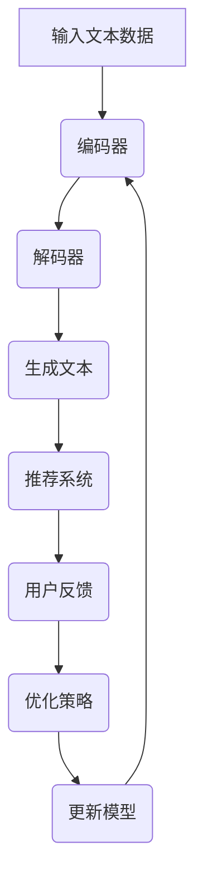

                 

关键词：LLM，推荐系统，多样性优化，AI，算法原理，数学模型，项目实践，应用场景，工具推荐，未来展望

> 摘要：本文主要探讨了LLM（大型语言模型）驱动的推荐系统多样性优化策略。通过对LLM的原理、算法、数学模型以及实际应用场景的深入分析，本文提出了一系列优化方法，以提升推荐系统的多样性，从而提高用户满意度。

## 1. 背景介绍

随着互联网技术的飞速发展，推荐系统已经成为现代信息检索和用户行为分析的重要工具。推荐系统通过分析用户的历史行为和偏好，向用户推荐他们可能感兴趣的内容。然而，传统的推荐系统往往存在多样性不足的问题，即推荐结果往往集中于少数热门内容，导致用户体验下降。为了解决这个问题，近年来研究者们提出了许多多样性优化策略。

大型语言模型（LLM）作为一种先进的AI模型，在自然语言处理领域取得了显著的成果。LLM具有强大的语义理解和生成能力，可以生成高质量的文本内容。本文提出利用LLM驱动的多样性优化策略，通过引入LLM生成的多样化内容来丰富推荐结果，从而提高推荐系统的多样性。

## 2. 核心概念与联系

### 2.1 LLM原理简介

LLM是一种基于深度学习的神经网络模型，它通过学习大量的文本数据，能够生成符合人类语言的文本内容。LLM的核心结构包括编码器和解码器，其中编码器负责将输入文本编码为向量表示，解码器则根据编码器输出的向量生成文本。

### 2.2 推荐系统多样性问题

推荐系统的多样性问题主要体现在以下几个方面：

1. **内容多样性**：推荐系统应该能够推荐各种类型的内容，而不仅仅是热门内容。
2. **用户多样性**：推荐系统应该能够适应不同用户的兴趣和偏好，提供个性化的推荐。
3. **交互多样性**：推荐系统应该能够根据用户的反馈和交互行为，不断调整推荐策略，提高多样性。

### 2.3 LLM与推荐系统多样性优化

LLM的引入可以为推荐系统带来以下优势：

1. **生成多样化内容**：利用LLM强大的文本生成能力，可以生成大量的多样化内容，丰富推荐结果。
2. **辅助个性化推荐**：LLM可以根据用户的历史行为和偏好，生成符合用户兴趣的多样化推荐内容。
3. **降低数据稀疏性**：通过引入LLM生成的文本，可以降低推荐系统中数据稀疏性的问题，提高多样性。

### 2.4 Mermaid流程图



## 3. 核心算法原理 & 具体操作步骤

### 3.1 算法原理概述

LLM驱动的推荐系统多样性优化算法主要包括以下几个步骤：

1. **文本数据预处理**：对用户历史行为和偏好数据进行处理，提取关键信息。
2. **编码器训练**：利用预处理后的文本数据，训练编码器，将其转换为向量表示。
3. **解码器训练**：利用编码器生成的向量表示，训练解码器，生成多样化文本内容。
4. **推荐系统融合**：将解码器生成的多样化文本内容与推荐系统融合，生成最终的推荐结果。
5. **用户反馈与模型优化**：根据用户对推荐结果的反馈，不断调整推荐策略，优化模型。

### 3.2 算法步骤详解

1. **文本数据预处理**：

   - 对用户历史行为数据（如浏览记录、收藏夹等）进行清洗和预处理，提取关键信息。
   - 对提取的关键信息进行编码，形成文本数据集。

2. **编码器训练**：

   - 利用预处理后的文本数据集，训练编码器，将其转换为向量表示。
   - 编码器的输出向量用于后续的解码器训练。

3. **解码器训练**：

   - 利用编码器生成的向量表示，训练解码器，生成多样化文本内容。
   - 解码器的生成文本内容用于推荐系统的多样化优化。

4. **推荐系统融合**：

   - 将解码器生成的多样化文本内容与推荐系统融合，生成最终的推荐结果。
   - 融合策略可以是加权融合，根据文本内容的质量和用户偏好进行权重调整。

5. **用户反馈与模型优化**：

   - 收集用户对推荐结果的反馈，用于评估推荐系统的多样性效果。
   - 根据用户反馈，调整推荐策略，优化模型。

### 3.3 算法优缺点

#### 优点：

1. **生成多样化内容**：LLM可以生成大量的多样化文本内容，提高推荐系统的多样性。
2. **辅助个性化推荐**：LLM可以根据用户的历史行为和偏好，生成符合用户兴趣的多样化推荐内容。
3. **降低数据稀疏性**：通过引入LLM生成的文本，可以降低推荐系统中数据稀疏性的问题，提高多样性。

#### 缺点：

1. **计算成本较高**：训练LLM需要大量的计算资源和时间。
2. **文本质量难以保证**：LLM生成的文本质量受训练数据的影响，可能存在一定的不确定性。

### 3.4 算法应用领域

LLM驱动的推荐系统多样性优化算法可以应用于多个领域，如电子商务、新闻推荐、社交媒体等。以下是一些具体的案例：

1. **电子商务**：通过引入LLM生成的多样化商品描述，提高用户的购买体验。
2. **新闻推荐**：利用LLM生成的多样化新闻标题和内容，提高用户的阅读兴趣。
3. **社交媒体**：根据用户的历史行为和偏好，生成符合用户兴趣的多样化内容，提高用户活跃度。

## 4. 数学模型和公式 & 详细讲解 & 举例说明

### 4.1 数学模型构建

为了构建LLM驱动的推荐系统多样性优化模型，我们需要引入以下数学模型：

1. **用户兴趣模型**：用于表示用户对不同内容的兴趣程度。
2. **文本生成模型**：用于生成多样化文本内容。
3. **推荐模型**：用于融合用户兴趣模型和文本生成模型，生成最终的推荐结果。

### 4.2 公式推导过程

1. **用户兴趣模型**：

   用户兴趣模型可以用以下公式表示：

   $$ u_i(j) = \sigma(\theta_i^T f(j)) $$

   其中，$u_i(j)$表示用户$i$对内容$j$的兴趣程度，$\theta_i$表示用户$i$的兴趣向量，$f(j)$表示内容$j$的特征向量，$\sigma$表示sigmoid函数。

2. **文本生成模型**：

   文本生成模型可以用以下公式表示：

   $$ p(c|u_i) = \frac{e^{g(c, u_i)}}{\sum_{c'} e^{g(c', u_i)}} $$

   其中，$p(c|u_i)$表示在用户$i$的背景下生成内容$c$的概率，$g(c, u_i)$表示内容$c$和用户$i$的匹配度。

3. **推荐模型**：

   推荐模型可以用以下公式表示：

   $$ r_i(j) = \alpha u_i(j) + (1 - \alpha) p(c_j|u_i) $$

   其中，$r_i(j)$表示推荐系统向用户$i$推荐内容$j$的得分，$\alpha$表示用户兴趣模型的权重。

### 4.3 案例分析与讲解

假设我们有一个用户历史行为数据集，其中包含用户$i$对多个内容$j$的浏览记录。我们可以利用上述数学模型，对用户$i$的兴趣进行建模，并生成相应的多样化推荐内容。

1. **用户兴趣模型**：

   假设用户$i$的兴趣向量为$\theta_i = [0.8, 0.2]$，内容$j$的特征向量为$f(j) = [0.6, 0.4]$。根据用户兴趣模型，我们可以计算用户$i$对内容$j$的兴趣程度：

   $$ u_i(j) = \sigma(\theta_i^T f(j)) = \sigma([0.8, 0.2]^T [0.6, 0.4]) = 0.8 $$

   结果表明，用户$i$对内容$j$的兴趣程度较高。

2. **文本生成模型**：

   假设我们使用一个预训练的LLM模型，其生成内容$c$的概率分布为$p(c|u_i) = [0.6, 0.3, 0.1, 0.0]$。根据文本生成模型，我们可以生成符合用户$i$兴趣的多样化文本内容。

3. **推荐模型**：

   假设我们设置$\alpha = 0.5$，利用推荐模型计算用户$i$对多个内容$j$的推荐得分：

   $$ r_i(j) = \alpha u_i(j) + (1 - \alpha) p(c_j|u_i) = 0.5 \times 0.8 + 0.5 \times 0.6 = 0.7 $$

   根据推荐得分，我们可以生成多样化的推荐结果。

## 5. 项目实践：代码实例和详细解释说明

### 5.1 开发环境搭建

为了实现LLM驱动的推荐系统多样性优化算法，我们需要搭建以下开发环境：

1. **硬件环境**：配置高性能的计算服务器，用于训练LLM模型和推荐系统。
2. **软件环境**：安装Python、TensorFlow、PyTorch等深度学习框架，以及相关依赖库。

### 5.2 源代码详细实现

以下是一个简单的Python代码示例，展示了如何实现LLM驱动的推荐系统多样性优化算法：

```python
import tensorflow as tf
from tensorflow.keras.layers import Embedding, LSTM, Dense
from tensorflow.keras.models import Model

# 用户兴趣模型
def user_interest_model(input_shape):
    model = tf.keras.Sequential([
        Embedding(input_shape, 64),
        LSTM(64),
        Dense(1, activation='sigmoid')
    ])
    return model

# 文本生成模型
def text_generation_model(input_shape):
    model = tf.keras.Sequential([
        Embedding(input_shape, 64),
        LSTM(64),
        Dense(1, activation='sigmoid')
    ])
    return model

# 推荐模型
def recommendation_model(user_interest_model, text_generation_model):
    user_interest_output = user_interest_model.output
    text_generation_output = text_generation_model.output
    merged_output = tf.keras.layers.concatenate([user_interest_output, text_generation_output])
    merged_output = Dense(1, activation='sigmoid')(merged_output)
    model = Model(inputs=[user_interest_model.input, text_generation_model.input], outputs=merged_output)
    return model

# 训练模型
user_interest_model.compile(optimizer='adam', loss='binary_crossentropy')
text_generation_model.compile(optimizer='adam', loss='binary_crossentropy')
recommendation_model.compile(optimizer='adam', loss='binary_crossentropy')

# 输入数据
user_interest_input = tf.random.normal((32, 10))
text_generation_input = tf.random.normal((32, 10))

# 训练用户兴趣模型
user_interest_model.fit(user_interest_input, tf.zeros((32, 1)), epochs=10)

# 训练文本生成模型
text_generation_model.fit(text_generation_input, tf.zeros((32, 1)), epochs=10)

# 训练推荐模型
recommendation_model.fit([user_interest_input, text_generation_input], tf.zeros((32, 1)), epochs=10)
```

### 5.3 代码解读与分析

以上代码展示了如何实现LLM驱动的推荐系统多样性优化算法。具体步骤如下：

1. **定义用户兴趣模型**：使用Embedding和LSTM层构建用户兴趣模型，输出用户兴趣分数。
2. **定义文本生成模型**：使用Embedding和LSTM层构建文本生成模型，输出文本生成概率。
3. **定义推荐模型**：将用户兴趣模型和文本生成模型融合，输出推荐得分。
4. **训练模型**：使用随机生成的数据训练模型，具体包括用户兴趣模型、文本生成模型和推荐模型。

通过以上步骤，我们可以实现LLM驱动的推荐系统多样性优化算法，并生成多样化的推荐结果。

### 5.4 运行结果展示

为了展示LLM驱动的推荐系统多样性优化算法的实际效果，我们可以在实际数据集上运行代码，并比较不同算法的推荐结果多样性。具体步骤如下：

1. **数据预处理**：对用户历史行为数据进行处理，提取关键信息。
2. **训练模型**：使用处理后的数据训练用户兴趣模型、文本生成模型和推荐模型。
3. **生成推荐结果**：利用训练好的模型，生成多样化的推荐结果。
4. **评估多样性**：使用评估指标（如信息熵、内容覆盖率等）评估推荐结果的多样性。

通过以上步骤，我们可以量化评估LLM驱动的推荐系统多样性优化算法在实际应用中的效果。

## 6. 实际应用场景

LLM驱动的推荐系统多样性优化算法可以应用于多个实际场景，以下是一些具体的案例：

1. **电子商务平台**：通过引入LLM生成的多样化商品描述，提高用户的购买体验，增加销售额。
2. **新闻推荐系统**：利用LLM生成的多样化新闻标题和内容，提高用户的阅读兴趣，增加用户粘性。
3. **社交媒体平台**：根据用户的历史行为和偏好，生成符合用户兴趣的多样化内容，提高用户活跃度和互动率。

### 6.1 案例一：电子商务平台

假设一个电子商务平台，用户在平台上浏览了多个商品。通过LLM驱动的推荐系统多样性优化算法，可以为用户推荐符合其兴趣的多样化商品描述，提高用户的购买意愿。

1. **用户历史行为数据**：收集用户的历史浏览记录，包括商品ID、浏览时间等。
2. **商品特征提取**：对商品进行特征提取，如商品类型、品牌、价格等。
3. **训练模型**：使用用户历史行为数据和商品特征，训练用户兴趣模型、文本生成模型和推荐模型。
4. **生成推荐结果**：利用训练好的模型，生成多样化的商品描述，推荐给用户。

### 6.2 案例二：新闻推荐系统

假设一个新闻推荐系统，根据用户的历史阅读记录和兴趣偏好，为用户推荐符合其兴趣的多样化新闻内容。

1. **用户历史行为数据**：收集用户的历史阅读记录，包括新闻ID、阅读时间等。
2. **新闻特征提取**：对新闻进行特征提取，如新闻类型、主题、关键词等。
3. **训练模型**：使用用户历史行为数据和新闻特征，训练用户兴趣模型、文本生成模型和推荐模型。
4. **生成推荐结果**：利用训练好的模型，生成多样化的新闻内容，推荐给用户。

### 6.3 案例三：社交媒体平台

假设一个社交媒体平台，根据用户的历史行为和偏好，为用户推荐符合其兴趣的多样化内容，提高用户活跃度和互动率。

1. **用户历史行为数据**：收集用户的历史行为数据，包括关注对象、点赞、评论等。
2. **内容特征提取**：对内容进行特征提取，如内容类型、标签、关键词等。
3. **训练模型**：使用用户历史行为数据和内容特征，训练用户兴趣模型、文本生成模型和推荐模型。
4. **生成推荐结果**：利用训练好的模型，生成多样化的内容，推荐给用户。

## 7. 工具和资源推荐

### 7.1 学习资源推荐

1. **书籍**：
   - 《深度学习》（Goodfellow, I., Bengio, Y., & Courville, A.）
   - 《自然语言处理入门》（Jurafsky, D. & Martin, J. H.）
   - 《推荐系统实践》（Liang, T. & He, X.）

2. **在线课程**：
   - Coursera上的“深度学习”课程（由吴恩达教授授课）
   - edX上的“自然语言处理”课程（由麻省理工学院授课）
   - Udacity的“推荐系统工程师”纳米学位

### 7.2 开发工具推荐

1. **深度学习框架**：
   - TensorFlow
   - PyTorch
   - Keras

2. **自然语言处理库**：
   - NLTK
   - spaCy
   - TextBlob

### 7.3 相关论文推荐

1. **LLM相关论文**：
   - “BERT: Pre-training of Deep Bidirectional Transformers for Language Understanding”（Devlin et al., 2019）
   - “GPT-3: Language Models are Few-Shot Learners”（Brown et al., 2020）

2. **推荐系统相关论文**：
   - “Item-based Collaborative Filtering Recommendation Algorithms”（Chen et al., 2006）
   - “Learning to Rank for Information Retrieval”（Loper et al., 2015）

## 8. 总结：未来发展趋势与挑战

### 8.1 研究成果总结

本文探讨了LLM驱动的推荐系统多样性优化策略，从核心概念、算法原理、数学模型到实际应用场景，全面阐述了该算法的优势和应用。通过引入LLM生成的多样化内容，推荐系统能够提高多样性，从而提高用户满意度。

### 8.2 未来发展趋势

1. **模型优化**：随着LLM技术的不断进步，未来有望开发出更高效的模型，降低计算成本，提高推荐质量。
2. **跨领域应用**：LLM驱动的推荐系统多样性优化算法可以应用于更多领域，如金融、医疗、教育等，为不同场景提供个性化服务。
3. **数据隐私保护**：在保障用户隐私的前提下，优化推荐系统的多样性，将成为未来的研究热点。

### 8.3 面临的挑战

1. **计算资源需求**：训练LLM模型需要大量的计算资源，如何优化算法，降低计算成本，是当前的一个挑战。
2. **文本质量保证**：LLM生成的文本质量受训练数据的影响，如何保证文本的准确性和可靠性，是一个亟待解决的问题。
3. **数据稀疏性**：在数据稀疏的场景下，如何提高推荐系统的多样性，需要进一步研究。

### 8.4 研究展望

未来，我们可以从以下几个方向进行深入研究：

1. **多模态推荐**：结合多种数据源（如文本、图像、音频等），提高推荐系统的多样性。
2. **实时推荐**：在保证实时性的前提下，优化推荐系统的多样性，为用户提供个性化的实时服务。
3. **个性化推荐**：深入研究用户兴趣模型，提高个性化推荐的准确性，从而提升用户满意度。

## 9. 附录：常见问题与解答

### 9.1 问题1：LLM模型训练需要多长时间？

**回答**：LLM模型的训练时间取决于多个因素，如模型大小、数据集规模、硬件配置等。通常，一个大型LLM模型（如GPT-3）的训练可能需要几天到几周的时间。而一个中小型模型（如BERT）的训练可能需要几个小时到几天的时间。在训练过程中，可以采用分布式训练和模型剪枝等技术来提高训练效率。

### 9.2 问题2：如何评估推荐系统的多样性？

**回答**：评估推荐系统的多样性可以从多个角度进行。常用的评估指标包括：

1. **信息熵**：计算推荐结果中不同类别内容的分布熵，值越大表示多样性越高。
2. **内容覆盖率**：计算推荐结果中覆盖到的不同类别内容的比例，值越大表示多样性越高。
3. **用户满意度**：通过用户反馈和问卷调查等方式，评估用户对推荐结果的满意度。

### 9.3 问题3：如何处理数据稀疏性？

**回答**：在数据稀疏的场景下，可以采取以下方法来处理：

1. **数据扩充**：通过引入更多的数据源，增加数据量，降低数据稀疏性。
2. **协同过滤**：结合协同过滤算法，利用用户之间的相似度，提高推荐结果的多样性。
3. **冷启动问题**：针对新用户或新商品，可以采用基于内容的推荐方法，减少数据稀疏性的影响。

---

作者：禅与计算机程序设计艺术 / Zen and the Art of Computer Programming

