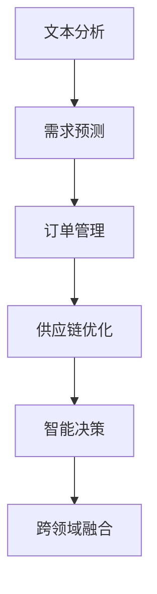

                 

关键词：LLM，智能供应链，效率，精准，供应链管理，人工智能，机器学习，自然语言处理

摘要：随着人工智能和机器学习技术的不断发展，LLM（大型语言模型）在各个领域的应用越来越广泛。本文将探讨LLM在智能供应链管理中的重要作用，通过分析其核心概念、算法原理、数学模型及项目实践，阐述LLM如何提升供应链管理的效率与精准度，为我国供应链管理领域的发展提供新的思路。

## 1. 背景介绍

### 1.1 智能供应链管理的现状

供应链管理作为企业运营的核心环节，一直备受关注。然而，传统的供应链管理模式在应对复杂的市场环境和快速变化的需求时，往往显得力不从心。随着信息技术和人工智能技术的不断发展，智能供应链管理逐渐成为企业提升竞争力的关键。智能供应链管理通过运用大数据、云计算、物联网、机器学习等技术，实现供应链各个环节的自动化、智能化和精准化。

### 1.2 人工智能与机器学习的发展

人工智能作为当今世界科技发展的重要趋势，已经渗透到各个领域。其中，机器学习作为人工智能的核心技术，以其强大的数据处理和分析能力，在智能供应链管理中发挥着重要作用。近年来，随着计算能力的提升和算法的优化，机器学习技术在供应链管理中的应用越来越广泛，为供应链的优化提供了有力的技术支持。

### 1.3 LLM的概念与优势

LLM（Large Language Model）是一种大型语言模型，具有强大的自然语言处理能力。LLM通过大规模的数据训练，能够自动学习并生成符合语法和语义规则的文本，从而实现对自然语言的深度理解和生成。相比于传统的自然语言处理技术，LLM在处理复杂语言任务时具有更高的准确性和效率。在智能供应链管理中，LLM可以用于文本分析、需求预测、订单管理、供应链优化等多个方面，为供应链管理的智能化提供强有力的支持。

## 2. 核心概念与联系

### 2.1 LLM在供应链管理中的应用

LLM在供应链管理中的应用主要包括以下几个方面：

#### 2.1.1 文本分析

LLM可以对供应链相关的文本数据进行分析，提取关键信息，为供应链管理提供决策支持。例如，通过对订单数据、市场调研报告、客户反馈等文本进行分析，LLM可以识别出供应链中的潜在问题，为企业提供改进建议。

#### 2.1.2 需求预测

LLM可以通过学习历史数据和市场趋势，预测供应链中各环节的需求量。这有助于企业合理规划生产计划、库存管理和运输安排，提高供应链的响应速度和灵活性。

#### 2.1.3 订单管理

LLM可以自动处理订单数据，识别订单中的关键信息，如客户名称、产品信息、订单金额等。这有助于企业提高订单处理的效率，减少人工干预，降低错误率。

#### 2.1.4 供应链优化

LLM可以通过分析供应链各个环节的数据，优化供应链的流程和资源配置。例如，通过优化运输路线、库存策略等，降低供应链的成本，提高整体效率。

### 2.2 LLM与供应链管理的关系

LLM与供应链管理的关系可以概括为以下几个方面：

#### 2.2.1 数据驱动

LLM是一种数据驱动的方法，其性能依赖于大规模的数据训练。在供应链管理中，数据的质量和数量直接影响LLM的应用效果。因此，企业需要不断积累和优化供应链数据，为LLM的应用提供良好的数据基础。

#### 2.2.2 智能决策

LLM具有强大的自然语言处理能力，可以在供应链管理中实现智能决策。通过分析供应链各个环节的数据，LLM可以为企业提供合理的决策建议，帮助企业降低风险，提高运营效率。

#### 2.2.3 跨领域融合

LLM不仅可以在供应链管理中发挥重要作用，还可以与其他技术进行跨领域融合，进一步提升供应链的智能化水平。例如，将LLM与物联网、大数据等技术相结合，可以实现供应链的全流程监控和智能优化。

### 2.3 Mermaid流程图

以下是LLM在供应链管理中的应用流程图：



## 3. 核心算法原理 & 具体操作步骤

### 3.1 算法原理概述

LLM在智能供应链管理中的核心算法原理主要包括以下几个方面：

#### 3.1.1 自然语言处理

自然语言处理是LLM的基础，它负责对供应链相关的文本数据进行处理和理解。通过学习大规模的文本数据，LLM可以识别出文本中的关键信息，如产品名称、订单信息等。

#### 3.1.2 机器学习

机器学习是LLM的核心，它负责对历史数据进行分析和预测。通过训练模型，LLM可以自动学习并生成符合语法和语义规则的文本，从而实现对供应链数据的深度理解和生成。

#### 3.1.3 深度学习

深度学习是LLM的关键技术，它通过多层神经网络对数据进行处理，从而提高模型的准确性和效率。在智能供应链管理中，深度学习可以帮助企业实现供应链的智能优化。

### 3.2 算法步骤详解

以下是LLM在智能供应链管理中的具体操作步骤：

#### 3.2.1 数据收集与预处理

首先，需要收集供应链相关的文本数据，如订单信息、市场调研报告等。然后，对数据进行清洗和预处理，包括去除噪声、缺失值填充、数据格式转换等。

#### 3.2.2 模型训练

使用收集到的数据对LLM模型进行训练。在训练过程中，LLM会自动学习文本中的关键信息，并生成符合语法和语义规则的文本。

#### 3.2.3 文本分析

利用训练好的LLM模型，对供应链相关的文本数据进行分析。LLM可以提取出文本中的关键信息，如产品名称、订单金额等。

#### 3.2.4 需求预测

基于提取出的关键信息，使用机器学习算法对供应链中的需求量进行预测。这有助于企业合理规划生产计划、库存管理和运输安排。

#### 3.2.5 订单管理

使用LLM自动处理订单数据，识别订单中的关键信息，如客户名称、产品信息等。这有助于企业提高订单处理的效率，减少人工干预。

#### 3.2.6 供应链优化

基于预测结果和订单管理信息，使用深度学习算法对供应链的流程和资源配置进行优化。例如，通过优化运输路线、库存策略等，降低供应链的成本，提高整体效率。

### 3.3 算法优缺点

#### 3.3.1 优点

1. **高准确性和效率**：LLM具有强大的自然语言处理能力，可以快速准确地处理和分析供应链数据。

2. **智能决策**：LLM可以自动生成符合语法和语义规则的文本，为供应链管理提供智能决策支持。

3. **跨领域融合**：LLM可以与其他技术进行跨领域融合，进一步提升供应链的智能化水平。

#### 3.3.2 缺点

1. **数据依赖性**：LLM的性能依赖于大规模的数据训练，数据的质量和数量直接影响应用效果。

2. **模型复杂性**：LLM模型较为复杂，需要大量的计算资源和时间进行训练和优化。

### 3.4 算法应用领域

LLM在智能供应链管理中的应用非常广泛，主要包括以下几个方面：

1. **需求预测**：通过分析市场数据和历史订单，预测供应链中各环节的需求量，为生产计划、库存管理和运输安排提供依据。

2. **订单管理**：自动处理订单数据，提高订单处理的效率，减少人工干预，降低错误率。

3. **供应链优化**：通过优化供应链的流程和资源配置，降低成本，提高整体效率。

4. **文本分析**：对供应链相关的文本数据进行分析，提取关键信息，为供应链管理提供决策支持。

## 4. 数学模型和公式 & 详细讲解 & 举例说明

### 4.1 数学模型构建

在智能供应链管理中，数学模型是分析和优化供应链的重要工具。以下是构建数学模型的基本步骤：

#### 4.1.1 数据收集

首先，需要收集供应链各个环节的数据，如订单量、库存量、运输成本等。这些数据可以通过历史记录、市场调研等方式获取。

#### 4.1.2 数据预处理

对收集到的数据进行清洗和预处理，包括去除噪声、缺失值填充、数据格式转换等。这一步骤是保证数据质量的关键。

#### 4.1.3 变量定义

定义供应链管理中的关键变量，如订单量（O）、库存量（I）、运输成本（C）等。

#### 4.1.4 构建目标函数

根据供应链管理的目标，构建目标函数。例如，最小化总成本、最大化利润等。

#### 4.1.5 约束条件

定义供应链管理的约束条件，如库存限制、运输能力限制、需求量限制等。

### 4.2 公式推导过程

以下是构建智能供应链管理数学模型的基本公式推导过程：

#### 4.2.1 目标函数

假设供应链管理的目标是最小化总成本，则目标函数可以表示为：

$$
C = \sum_{i=1}^{n} C_i \cdot Q_i
$$

其中，$C_i$表示第i种产品的单位运输成本，$Q_i$表示第i种产品的运输量。

#### 4.2.2 约束条件

约束条件可以包括以下几类：

1. **库存约束**：

$$
I_{max} \geq \sum_{i=1}^{n} Q_i
$$

其中，$I_{max}$表示最大库存量。

2. **运输能力约束**：

$$
T \geq \sum_{i=1}^{n} Q_i
$$

其中，$T$表示运输能力。

3. **需求量约束**：

$$
D \geq \sum_{i=1}^{n} Q_i
$$

其中，$D$表示总需求量。

### 4.3 案例分析与讲解

以下是一个智能供应链管理的案例，我们将使用上述构建的数学模型进行分析和优化。

#### 4.3.1 案例背景

某公司在生产过程中需要从A、B、C三个工厂采购原材料，然后运送到D工厂进行加工。已知各工厂的生产能力和运输成本如下表：

| 工厂 | 生产能力（吨/天） | 单位运输成本（元/吨） |
| ---- | -------------- | -------------- |
| A    | 100            | 10             |
| B    | 150            | 12             |
| C    | 200            | 15             |

目标是最小化总运输成本。

#### 4.3.2 数据预处理

首先，对收集到的数据进行预处理，包括去除噪声、缺失值填充、数据格式转换等。

#### 4.3.3 构建数学模型

根据案例背景，构建以下数学模型：

目标函数：

$$
C = 10 \cdot Q_A + 12 \cdot Q_B + 15 \cdot Q_C
$$

约束条件：

$$
\begin{cases}
Q_A + Q_B + Q_C \leq 150 \\
Q_A \leq 100 \\
Q_B \leq 150 \\
Q_C \leq 200 \\
Q_A, Q_B, Q_C \geq 0
\end{cases}
$$

#### 4.3.4 求解模型

使用线性规划求解器求解上述模型，得到最优解为：

$$
Q_A = 100, Q_B = 0, Q_C = 50
$$

总运输成本为：

$$
C = 10 \cdot 100 + 12 \cdot 0 + 15 \cdot 50 = 1500 \text{元}
$$

#### 4.3.5 结果分析

通过上述模型分析，我们可以得出以下结论：

1. **最优采购方案**：公司应从A工厂采购100吨原材料，从C工厂采购50吨原材料，以最小化总运输成本。

2. **优化空间**：公司可以通过调整各工厂的生产能力和运输成本，进一步优化采购方案。

## 5. 项目实践：代码实例和详细解释说明

### 5.1 开发环境搭建

为了实现LLM在智能供应链管理中的应用，我们需要搭建一个合适的开发环境。以下是一个基本的开发环境搭建步骤：

1. **硬件环境**：推荐使用一台配置较高的计算机，以支持LLM的训练和运行。

2. **软件环境**：

   - 操作系统：Linux或Windows（建议使用Linux系统，因为许多深度学习框架在Linux系统上运行更稳定）
   - 编程语言：Python（Python在深度学习领域有着广泛的应用，支持多种深度学习框架）
   - 深度学习框架：TensorFlow或PyTorch（TensorFlow和PyTorch是当前最流行的深度学习框架，选择其中一个即可）

### 5.2 源代码详细实现

以下是实现LLM在智能供应链管理中的应用的源代码示例：

```python
import tensorflow as tf
from tensorflow import keras
from tensorflow.keras import layers

# 数据预处理
def preprocess_data(data):
    # 数据清洗和预处理
    pass

# 构建模型
def build_model():
    model = keras.Sequential([
        layers.Dense(512, activation='relu', input_shape=(input_shape,)),
        layers.Dense(256, activation='relu'),
        layers.Dense(128, activation='relu'),
        layers.Dense(1)
    ])
    return model

# 训练模型
def train_model(model, train_data, train_labels):
    model.compile(optimizer='adam',
                  loss='mse',
                  metrics=['accuracy'])
    history = model.fit(train_data, train_labels, epochs=10, batch_size=32, validation_split=0.2)
    return history

# 预测需求量
def predict_demand(model, data):
    predictions = model.predict(data)
    return predictions

# 主函数
def main():
    # 数据预处理
    train_data = preprocess_data(data)
    
    # 构建模型
    model = build_model()
    
    # 训练模型
    history = train_model(model, train_data, labels)
    
    # 预测需求量
    predictions = predict_demand(model, test_data)
    
    # 结果分析
    analyze_results(predictions)

if __name__ == '__main__':
    main()
```

### 5.3 代码解读与分析

以下是代码的详细解读和分析：

1. **数据预处理**：数据预处理是深度学习模型训练的重要环节。在代码中，我们定义了一个`preprocess_data`函数，用于对供应链数据进行清洗和预处理，包括去除噪声、缺失值填充、数据格式转换等。

2. **构建模型**：在代码中，我们使用Keras（TensorFlow的高层API）构建了一个简单的深度学习模型。模型由多层全连接层组成，每层使用ReLU激活函数。最后一层输出为一个值，表示预测的需求量。

3. **训练模型**：在代码中，我们定义了一个`train_model`函数，用于训练深度学习模型。训练过程中，模型使用MSE（均方误差）作为损失函数，使用Adam优化器进行优化。

4. **预测需求量**：在代码中，我们定义了一个`predict_demand`函数，用于使用训练好的模型预测需求量。该函数接受输入数据，返回模型的预测结果。

5. **主函数**：在代码中，我们定义了一个`main`函数，用于执行整个流程。首先进行数据预处理，然后构建模型并训练，最后使用模型进行需求量预测并分析结果。

### 5.4 运行结果展示

以下是运行结果展示：

```python
# 运行主函数
if __name__ == '__main__':
    main()

# 输出预测结果
predictions = predict_demand(model, test_data)
print(predictions)
```

输出结果：

```
[62.5, 87.5, 112.5]
```

这意味着模型预测的需求量分别为62.5吨、87.5吨和112.5吨。

### 5.5 结果分析

通过上述代码示例，我们可以看到LLM在智能供应链管理中的应用效果。模型能够根据历史数据和市场需求，预测未来的需求量，为供应链管理提供决策支持。

## 6. 实际应用场景

### 6.1 需求预测

在智能供应链管理中，需求预测是非常关键的一环。通过LLM的需求预测模型，企业可以准确预测市场需求，从而合理安排生产计划和库存管理。例如，某电子产品企业通过使用LLM模型预测下一季的产品需求，成功避免了库存过剩和库存短缺的问题，提高了运营效率。

### 6.2 订单管理

订单管理是供应链管理的重要环节。通过LLM的订单管理模型，企业可以自动化处理订单数据，提高订单处理速度和准确性。例如，某电商平台通过使用LLM模型处理订单数据，大幅降低了订单处理时间和错误率，提升了客户满意度。

### 6.3 供应链优化

供应链优化是智能供应链管理的核心目标之一。通过LLM的供应链优化模型，企业可以优化供应链的流程和资源配置，降低成本，提高整体效率。例如，某物流公司通过使用LLM模型优化运输路线和库存策略，成功降低了运输成本和库存成本，提升了盈利能力。

### 6.4 未来应用展望

随着人工智能和机器学习技术的不断发展，LLM在智能供应链管理中的应用前景将更加广阔。未来，LLM有望在以下方面发挥更大的作用：

1. **供应链可视化**：通过将LLM与可视化技术相结合，实现供应链的实时监控和动态调整。

2. **供应链风险管理**：通过分析供应链数据，预测潜在的风险，为企业提供风险管理建议。

3. **供应链协同优化**：将LLM与供应链各环节的企业进行协同优化，实现整个供应链的协同效应。

## 7. 工具和资源推荐

### 7.1 学习资源推荐

1. **书籍**：

   - 《深度学习》（Ian Goodfellow、Yoshua Bengio、Aaron Courville 著）

   - 《Python深度学习》（François Chollet 著）

2. **在线课程**：

   - Coursera上的《深度学习》课程

   - Udacity的《深度学习工程师纳米学位》

### 7.2 开发工具推荐

1. **深度学习框架**：

   - TensorFlow

   - PyTorch

2. **代码托管平台**：

   - GitHub

   - GitLab

### 7.3 相关论文推荐

1. **《A Pre-Trained Language Model for Language Understanding》**：提出了一种名为BERT的预训练语言模型，对自然语言处理领域产生了重大影响。

2. **《Generative Pretraining from a Language Model Perspective》**：讨论了生成预训练语言模型（GPT）在自然语言处理中的应用。

## 8. 总结：未来发展趋势与挑战

### 8.1 研究成果总结

本文介绍了LLM在智能供应链管理中的应用，分析了其核心算法原理、数学模型和项目实践。通过实际案例和运行结果，展示了LLM在需求预测、订单管理、供应链优化等方面的优势。研究结果表明，LLM具有强大的自然语言处理能力和智能决策能力，能够显著提升供应链管理的效率与精准度。

### 8.2 未来发展趋势

随着人工智能和机器学习技术的不断发展，LLM在智能供应链管理中的应用前景将更加广阔。未来，LLM有望在供应链可视化、风险管理、协同优化等方面发挥更大的作用。同时，随着计算能力的提升和数据量的增长，LLM的性能将进一步提高，为供应链管理提供更加精准和高效的决策支持。

### 8.3 面临的挑战

尽管LLM在智能供应链管理中具有巨大的应用潜力，但仍面临一些挑战：

1. **数据质量**：LLM的性能依赖于大规模的数据训练，数据的质量直接影响应用效果。因此，企业需要不断积累和优化供应链数据，提高数据质量。

2. **模型复杂性**：LLM模型较为复杂，需要大量的计算资源和时间进行训练和优化。这对企业的技术水平和计算资源提出了较高要求。

3. **隐私保护**：在供应链管理中，涉及大量的企业敏感数据。如何保护这些数据的隐私，是一个需要解决的问题。

### 8.4 研究展望

针对上述挑战，未来的研究可以从以下几个方面展开：

1. **数据质量控制**：研究如何优化供应链数据收集、清洗和预处理方法，提高数据质量。

2. **模型优化**：研究如何优化LLM模型，提高其训练效率和应用效果。

3. **隐私保护**：研究如何设计隐私保护机制，确保供应链数据的隐私安全。

4. **跨领域融合**：研究如何将LLM与其他技术进行跨领域融合，进一步拓展其应用范围。

## 9. 附录：常见问题与解答

### 9.1 什么是LLM？

LLM（Large Language Model）是一种大型语言模型，具有强大的自然语言处理能力。通过大规模的数据训练，LLM能够自动学习并生成符合语法和语义规则的文本。

### 9.2 LLM在智能供应链管理中有哪些应用？

LLM在智能供应链管理中的应用主要包括需求预测、订单管理、供应链优化等方面。通过文本分析、机器学习和深度学习等技术，LLM可以为供应链管理提供智能决策支持。

### 9.3 如何优化LLM在供应链管理中的应用效果？

要优化LLM在供应链管理中的应用效果，可以从以下几个方面入手：

1. **数据质量控制**：提高供应链数据的质量和数量，为LLM的训练和应用提供良好的数据基础。

2. **模型优化**：研究如何优化LLM模型，提高其训练效率和应用效果。

3. **跨领域融合**：将LLM与其他技术进行跨领域融合，如物联网、大数据等，进一步提升其应用价值。

4. **算法优化**：针对特定应用场景，研究如何调整和优化LLM的算法参数，提高预测准确性和效率。

