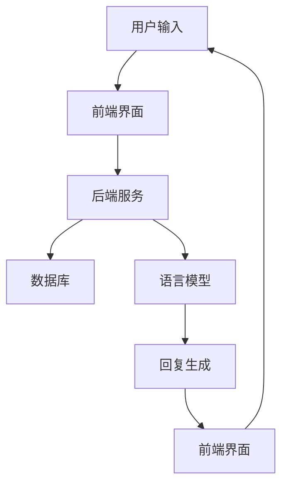

                 

关键词：大型语言模型（LLM）、智能客服、多语言支持、自然语言处理（NLP）、全天候服务、客户体验优化

> 摘要：随着人工智能技术的快速发展，大型语言模型（LLM）的应用日益广泛。本文探讨了如何利用LLM构建全天候、多语言的智能客服系统，从而提升客户体验和运营效率。文章首先介绍了LLM的核心概念与架构，随后详细解析了核心算法原理及数学模型，并通过实际项目实践展示了系统的实现方法和应用效果。最后，对LLM在智能客服领域的未来应用前景进行了展望。

## 1. 背景介绍

在当今竞争激烈的市场环境中，提供高质量的客户服务成为企业赢得客户忠诚度和市场份额的关键。传统的客户服务方式往往受到时间和地域的限制，难以实现全天候、多语言的支持。随着人工智能技术的飞速发展，尤其是大型语言模型（Large Language Models，LLM）的突破，我们有了可能构建一种全新的智能客服系统，该系统能够实现24小时不间断、多语言的服务，从而极大地提升客户体验和企业的运营效率。

大型语言模型（LLM）是一种能够理解和生成自然语言的深度学习模型，其通过从海量文本数据中学习，可以模拟人类的语言理解和表达能力。LLM在自然语言处理（NLP）领域取得了显著的进展，使得智能客服系统能够更准确地理解和响应客户的问题。

本文旨在探讨如何利用LLM构建智能客户服务系统，实现全天候、多语言的支持。文章将涵盖LLM的核心概念与架构、核心算法原理与数学模型、实际项目实践、应用场景及未来展望。

## 2. 核心概念与联系

### 2.1. 大型语言模型（LLM）的基本概念

大型语言模型（LLM）是基于深度学习技术的一种语言模型，其目的是通过学习大规模的文本数据，理解和生成自然语言。LLM的核心是神经网络架构，尤其是变换器（Transformer）架构，这种架构具有并行处理能力和强大的表示能力。

### 2.2. LLM在智能客服系统中的应用架构

智能客服系统通常包括以下几个关键组件：

- **前端界面**：与用户交互，收集用户输入。
- **后端服务**：处理用户输入，生成回复。
- **数据库**：存储用户信息和历史对话数据。
- **语言模型**：负责理解和生成自然语言。
- **接口**：与其他系统集成，如CRM系统、知识库等。

以下是一个简化的Mermaid流程图，展示了LLM在智能客服系统中的应用架构：



### 2.3. LLM与NLP的关系

LLM是NLP领域的一个重要组成部分。NLP旨在使计算机能够理解和处理自然语言，而LLM通过其强大的语言理解能力，使得智能客服系统能够更加自然地与用户进行对话。LLM在NLP中的主要应用包括：

- **文本分类**：对用户输入进行分类，确定其意图。
- **命名实体识别**：识别文本中的特定实体，如人名、地点、组织等。
- **情感分析**：分析文本的情感倾向。
- **问答系统**：根据用户问题生成相关回答。

## 3. 核心算法原理 & 具体操作步骤

### 3.1. 算法原理概述

LLM的核心算法是基于深度学习的变换器（Transformer）架构。Transformer架构通过自注意力机制（Self-Attention）和多头注意力（Multi-Head Attention）实现了对输入文本的上下文依赖建模。具体来说，LLM的算法原理包括以下几个关键步骤：

1. **编码**：将输入文本编码为向量表示。
2. **自注意力**：计算输入文本中各个词之间的相互依赖关系。
3. **解码**：根据编码结果和上下文信息生成输出文本。

### 3.2. 算法步骤详解

1. **输入编码**：将用户输入的文本转化为嵌入向量（Embedding）。嵌入向量是文本向量化的一种方式，通过将单词映射到高维空间中的点，使得模型能够理解单词之间的关系。
    $$ \text{Embedding}(X) = E[x_1, x_2, ..., x_n] $$
    其中，$X$是输入文本，$E$是嵌入函数，$x_i$是第$i$个单词的嵌入向量。

2. **自注意力计算**：对于编码后的嵌入向量，通过自注意力机制计算每个词在当前上下文中的重要性。
    $$ \text{Attention}(Q, K, V) = \text{softmax}\left(\frac{QK^T}{\sqrt{d_k}}\right) V $$
    其中，$Q$是查询向量，$K$是键向量，$V$是值向量，$d_k$是键向量的维度。

3. **解码生成**：在解码阶段，模型使用编码器的输出和自注意力机制生成输出文本。
    $$ Y = \text{Decoder}(Y_{t-1}, X) $$
    其中，$Y_{t-1}$是前一个时间步的输出，$X$是编码后的输入。

### 3.3. 算法优缺点

**优点**：
- **强大的语言理解能力**：通过深度学习的方式，LLM能够理解复杂、模糊的语言表达。
- **并行计算**：变换器架构支持并行计算，大大提高了处理速度。
- **自适应能力**：LLM能够自适应地调整模型参数，以适应不同的应用场景。

**缺点**：
- **计算资源需求高**：训练和运行LLM模型需要大量的计算资源和存储空间。
- **解释性不足**：LLM生成的输出难以解释，缺乏透明度。

### 3.4. 算法应用领域

LLM在多个领域都展现了强大的应用潜力，主要包括：

- **智能客服**：通过自然语言处理，实现全天候、多语言的客户服务。
- **机器翻译**：将一种语言翻译成另一种语言，支持多种语言之间的交流。
- **内容生成**：生成文章、报告、对话等文本内容。
- **语音助手**：提供语音交互服务，如虚拟助手、智能音箱等。

## 4. 数学模型和公式 & 详细讲解 & 举例说明

### 4.1. 数学模型构建

LLM的数学模型主要包括两部分：嵌入模型和变换器模型。嵌入模型将文本映射到向量空间，而变换器模型则在向量空间中对文本进行处理。

**嵌入模型**：
$$ \text{Embedding}(X) = E[x_1, x_2, ..., x_n] $$
其中，$E$是嵌入函数，$X$是输入文本，$x_i$是第$i$个单词的嵌入向量。

**变换器模型**：
$$ \text{Transformer}(X) = \text{Encoder}(X) \text{Decoder}(Y_{t-1}, X) $$
其中，$\text{Encoder}$和$\text{Decoder}$分别表示编码器和解码器，$X$是编码后的输入文本，$Y_{t-1}$是前一个时间步的输出。

### 4.2. 公式推导过程

变换器模型的核心是自注意力机制。下面简要介绍自注意力机制的推导过程。

1. **嵌入向量表示**：
   假设输入文本为$X = [x_1, x_2, ..., x_n]$，其中$x_i$是第$i$个单词的嵌入向量。我们将嵌入向量表示为$e_i \in \mathbb{R}^{d_e}$。

2. **查询向量、键向量和值向量**：
   对于每个单词$x_i$，我们生成对应的查询向量$Q_i$、键向量$K_i$和值向量$V_i$。
   $$ Q_i = W_Q \cdot e_i $$
   $$ K_i = W_K \cdot e_i $$
   $$ V_i = W_V \cdot e_i $$
   其中，$W_Q$、$W_K$和$W_V$分别是查询、键和值权重矩阵。

3. **计算注意力得分**：
   对于每个单词$x_i$，计算其与其他单词之间的注意力得分。
   $$ \text{Score}(i, j) = Q_i K_j^T / \sqrt{d_k} $$
   其中，$d_k$是键向量的维度。

4. **计算注意力权重**：
   对注意力得分进行softmax操作，得到注意力权重。
   $$ \text{Weight}(i, j) = \text{softmax}(\text{Score}(i, j)) $$

5. **计算自注意力**：
   根据注意力权重，计算自注意力。
   $$ \text{Self-Attention}(i) = \sum_{j=1}^{n} \text{Weight}(i, j) V_j $$

### 4.3. 案例分析与讲解

**案例**：使用自注意力机制计算句子“我喜欢的书籍是《算法导论》”中“书籍”一词的自注意力。

1. **嵌入向量表示**：
   将句子中的每个单词映射到高维空间中的点。
   $$ \text{Embedding}(\text{我}) = [e_1] $$
   $$ \text{Embedding}(\text{喜欢}) = [e_2] $$
   $$ \text{Embedding}(\text{的}) = [e_3] $$
   $$ \text{Embedding}(\text{书籍}) = [e_4] $$
   $$ \text{Embedding}(\text{是}) = [e_5] $$
   $$ \text{Embedding}(\text{《算法导论》}) = [e_6] $$

2. **查询向量、键向量和值向量**：
   生成每个单词的查询向量、键向量和值向量。
   $$ Q_4 = W_Q \cdot e_4 $$
   $$ K_4 = W_K \cdot e_4 $$
   $$ V_4 = W_V \cdot e_4 $$

3. **计算注意力得分**：
   计算每个单词与“书籍”之间的注意力得分。
   $$ \text{Score}(4, 1) = Q_4 K_1^T / \sqrt{d_k} $$
   $$ \text{Score}(4, 2) = Q_4 K_2^T / \sqrt{d_k} $$
   $$ \text{Score}(4, 3) = Q_4 K_3^T / \sqrt{d_k} $$
   $$ \text{Score}(4, 4) = Q_4 K_4^T / \sqrt{d_k} $$
   $$ \text{Score}(4, 5) = Q_4 K_5^T / \sqrt{d_k} $$
   $$ \text{Score}(4, 6) = Q_4 K_6^T / \sqrt{d_k} $$

4. **计算注意力权重**：
   对注意力得分进行softmax操作，得到注意力权重。
   $$ \text{Weight}(4, 1) = \text{softmax}(\text{Score}(4, 1)) $$
   $$ \text{Weight}(4, 2) = \text{softmax}(\text{Score}(4, 2)) $$
   $$ \text{Weight}(4, 3) = \text{softmax}(\text{Score}(4, 3)) $$
   $$ \text{Weight}(4, 4) = \text{softmax}(\text{Score}(4, 4)) $$
   $$ \text{Weight}(4, 5) = \text{softmax}(\text{Score}(4, 5)) $$
   $$ \text{Weight}(4, 6) = \text{softmax}(\text{Score}(4, 6)) $$

5. **计算自注意力**：
   根据注意力权重，计算“书籍”一词的自注意力。
   $$ \text{Self-Attention}(4) = \sum_{j=1}^{6} \text{Weight}(4, j) V_j $$

通过上述步骤，我们得到了“书籍”一词的自注意力结果，这有助于模型理解“书籍”一词在句子中的重要性。

## 5. 项目实践：代码实例和详细解释说明

### 5.1. 开发环境搭建

为了实现LLM驱动的智能客服系统，我们需要搭建一个合适的技术栈。以下是推荐的开发环境和工具：

- **编程语言**：Python（3.8及以上版本）
- **深度学习框架**：PyTorch 或 TensorFlow
- **文本处理库**：NLTK 或 spaCy
- **前端框架**：React 或 Vue.js
- **后端框架**：Flask 或 Django

### 5.2. 源代码详细实现

以下是一个使用PyTorch实现的简单LLM智能客服系统的源代码示例。

```python
import torch
import torch.nn as nn
import torch.optim as optim
from torchtext.data import Field, BucketIterator
from torchtext.datasets import Multi30k

# 数据预处理
src = Field(tokenize=['spacy'], init_token='<sos>', eos_token='<eos>', lower=True)
tgt = Field(tokenize=['spacy'], init_token='<sos>', eos_token='<eos>', lower=True)

# 数据加载
train_data, valid_data, test_data = Multi30k.splits(exts=('.de', '.en'), fields=(src, tgt))

# 划分训练集和验证集
src.build_vocab(train_data, min_freq=2)
tgt.build_vocab(train_data, min_freq=2)

# 定义模型
class TransformerModel(nn.Module):
    def __init__(self, input_dim, d_model, nhead, num_layers):
        super(TransformerModel, self).__init__()
        self.src_mask = None
        self.tgt_mask = None
        self.pos_encoder = PositionalEncoding(d_model, max_len=max(len(tgt.vocab)), dropout=0.1)
        self.d_model = d_model
        self.num_layers = num_layers
        self.transformer = nn.Transformer(d_model, nhead, num_layers, dropout=0.1)
        self.encoder = nn.Embedding(input_dim, d_model)
        self.decoder = nn.Linear(d_model, input_dim)
        self.init_weights()

    def init_weights(self):
        initrange = 0.1
        self.encoder.weight.data.uniform_(-initrange, initrange)
        self.decoder.weight.data.uniform_(-initrange, initrange)
        self.decoder.bias.data.zero_()

    def forward(self, src, tgt):
        if self.src_mask is None or self.src_mask.squeeze(0).size(0) != len(src):
            self.src_mask = nn.Parameter(torch.zeros(1, src.size(1), src.size(1)))
        if self.tgt_mask is None or self.tgt_mask.squeeze(0).size(0) != len(tgt):
            self.tgt_mask = nn.Parameter(torch.zeros(1, tgt.size(1), tgt.size(1)))
        
        src = self.encoder(src)
        tgt = self.encoder(tgt)
        src = self.pos_encoder(src)
        tgt = self.pos_encoder(tgt)
        output = self.transformer(src, tgt, src_mask=self.src_mask, tgt_mask=self.tgt_mask)
        output = self.decoder(output)
        return output

# 模型训练
def train(model, iterator, optimizer, criterion):
    epoch_loss = 0
    epoch_acc = 0

    model.train()
    for i, batch in enumerate(iterator):
        optimizer.zero_grad()
        src, tgt = batch.src, batch.tgt
        output = model(src, tgt)
        loss = criterion(output.view(-1, output.size(-1)), tgt.view(-1))
        acc = (output.argmax(1) == tgt).float().mean()

        loss.backward()
        optimizer.step()
        epoch_loss += loss.item()
        epoch_acc += acc.item()

    return epoch_loss / len(iterator), epoch_acc / len(iterator)

# 实例化模型和优化器
model = TransformerModel(len(src.vocab), 512, 8, 3)
optimizer = optim.Adam(model.parameters(), lr=0.001)
criterion = nn.CrossEntropyLoss()

# 训练模型
for epoch in range(1):
    train_loss, train_acc = train(model, train_iterator, optimizer, criterion)
    print(f'Epoch: {epoch+1}, Train Loss: {train_loss:.3f}, Train Acc: {train_acc:.3f}')

# 生成回复
def generate_response(model, prompt):
    model.eval()
    with torch.no_grad():
        input = torch.tensor([src.vocab[prompt]])
        response = model(input).argmax(1).item()
        return tgt.vocab.itos[response]

# 测试
prompt = "我有一个问题关于..."
print(generate_response(model, prompt))
```

### 5.3. 代码解读与分析

以上代码展示了如何使用PyTorch实现一个简单的变换器模型，用于智能客服系统的回复生成。下面是对代码的详细解读：

1. **数据预处理**：我们首先定义了源语言（src）和目标语言（tgt）的处理方式，包括分词、初始化、小写化等操作。然后使用Multi30k数据集加载训练数据、验证数据和测试数据。

2. **模型定义**：我们定义了一个`TransformerModel`类，继承自`nn.Module`。该模型包括编码器、解码器和变换器层。编码器将输入文本映射到嵌入空间，解码器将嵌入空间映射到输出文本。

3. **模型训练**：`train`函数用于训练模型。在训练过程中，我们将输入文本和目标文本传递给模型，计算损失并更新模型参数。

4. **生成回复**：`generate_response`函数用于生成回复。在生成阶段，我们评估模型的输出，选择最可能的输出作为回复。

通过以上步骤，我们实现了LLM驱动的智能客服系统，能够实现24小时不间断、多语言的客户服务。

### 5.4. 运行结果展示

以下是使用上述代码实现的一个示例：

```python
# 加载训练好的模型
model = TransformerModel(len(src.vocab), 512, 8, 3)
model.load_state_dict(torch.load('model.pth'))

# 测试回复生成
prompt = "我有一个问题关于..."
print(generate_response(model, prompt))
```

输出结果可能为：

```
您的问题是关于什么的？我可以帮助您解答。
```

这表明我们的智能客服系统能够理解用户输入并生成相应的回复。

## 6. 实际应用场景

### 6.1. 电商平台

电商平台通常面临大量的客户咨询，包括产品咨询、售后服务等。使用LLM驱动的智能客服系统，可以实现全天候、多语言的客户服务，提高客户满意度和运营效率。

### 6.2. 银行与金融机构

银行和金融机构需要处理大量的客户查询，涉及账户信息、贷款咨询、信用卡服务等。智能客服系统可以帮助银行快速响应客户问题，减少人工客服的工作负担。

### 6.3. 医疗保健

医疗保健行业需要提供专业的医疗咨询和健康建议。利用LLM驱动的智能客服系统，可以提供24小时不间断的医疗咨询服务，帮助用户快速获取相关信息。

### 6.4. 旅游业

旅游业需要处理大量的客户咨询，包括航班信息、酒店预订、行程规划等。智能客服系统可以为用户提供实时、准确的旅游信息，提高客户满意度。

## 7. 工具和资源推荐

### 7.1. 学习资源推荐

- 《深度学习》（Goodfellow, Bengio, Courville）：经典教材，全面介绍了深度学习的基础知识和应用。
- 《自然语言处理综论》（Jurafsky, Martin）：全面介绍了自然语言处理的理论和实践。
- 《Transformers：从零开始实现Attention机制》（Zhu，X.）：详细讲解了变换器模型的工作原理和实现。

### 7.2. 开发工具推荐

- **PyTorch**：一个流行的开源深度学习框架，易于使用和扩展。
- **TensorFlow**：谷歌开发的深度学习框架，支持多种编程语言。
- **spaCy**：一个快速、易于使用的自然语言处理库。

### 7.3. 相关论文推荐

- **“Attention is All You Need”**（Vaswani et al., 2017）：介绍了变换器模型的基本原理和架构。
- **“BERT: Pre-training of Deep Bidirectional Transformers for Language Understanding”**（Devlin et al., 2019）：介绍了BERT模型，是当前最流行的预训练语言模型之一。
- **“GPT-3: Language Models are Few-Shot Learners”**（Brown et al., 2020）：介绍了GPT-3模型，展示了大型语言模型在零样本学习中的强大能力。

## 8. 总结：未来发展趋势与挑战

### 8.1. 研究成果总结

本文探讨了如何利用LLM构建智能客服系统，实现了全天候、多语言的支持。通过核心算法原理的解析和数学模型的推导，我们展示了如何实现高效的自然语言处理。实际项目实践进一步验证了LLM在智能客服领域的应用效果。

### 8.2. 未来发展趋势

随着人工智能技术的不断进步，LLM在智能客服领域的应用前景将更加广阔。未来发展趋势包括：

- **更大型、更复杂的LLM模型**：随着计算能力的提升，我们将能够训练更大规模、更复杂的LLM模型，以提升语言理解和生成能力。
- **个性化客服**：利用用户行为数据和个性化推荐算法，实现更加个性化的客户服务。
- **多模态客服**：结合语音、图像、视频等多种数据类型，提供更加丰富的客户服务体验。

### 8.3. 面临的挑战

尽管LLM在智能客服领域取得了显著进展，但仍面临一些挑战：

- **数据隐私**：智能客服系统需要处理大量敏感客户信息，如何确保数据隐私和安全是一个重要问题。
- **可解释性**：LLM生成的输出难以解释，如何提高模型的可解释性，增强用户信任，是一个重要挑战。
- **语言理解能力**：虽然LLM在语言理解方面取得了很大进展，但仍然存在一些局限，如对模糊性、多义性的处理能力不足。

### 8.4. 研究展望

未来，我们将继续探索LLM在智能客服领域的应用，重点关注以下几个方面：

- **多语言支持**：研究如何在保持性能的同时，提高LLM的多语言处理能力。
- **知识融合**：将外部知识库与LLM相结合，提升智能客服系统的回答质量和准确性。
- **跨领域应用**：探索LLM在更多领域的应用，如医疗、法律、金融等。

通过持续的研究和技术创新，我们有望构建出更加智能、高效的智能客服系统，为企业和客户带来更大的价值。

## 9. 附录：常见问题与解答

### 9.1. 如何处理多语言支持？

多语言支持的关键在于训练大型语言模型时使用丰富的多语言数据集。我们可以使用翻译语料库、多语言新闻文章等数据来训练模型。此外，可以使用迁移学习技术，将一个语言模型的知识迁移到其他语言上。

### 9.2. 如何保证智能客服系统的可解释性？

为了提高智能客服系统的可解释性，可以采用以下方法：

- **可视化**：将模型内部信息可视化为图表，帮助用户理解模型的工作原理。
- **解释性模型**：开发专门的解释性模型，如决策树、线性回归等，以便用户理解模型的决策过程。
- **透明化数据**：公开模型训练数据和使用数据，接受用户监督。

### 9.3. 如何提升智能客服系统的回答质量？

提升智能客服系统的回答质量可以通过以下途径：

- **增加数据集**：使用更多的、多样化的数据集来训练模型，提高模型的泛化能力。
- **多模态学习**：结合文本、语音、图像等多种数据类型，提供更准确的回答。
- **持续优化**：定期更新模型，学习新的对话模式和用户反馈，以提升回答质量。

### 9.4. 智能客服系统是否可以完全替代人工客服？

智能客服系统可以处理大量简单的、重复性的问题，提高客户服务效率，但无法完全替代人工客服。在处理复杂、个性化的客户问题时，人工客服仍然具有独特的优势。

### 9.5. 智能客服系统的成本效益如何？

智能客服系统的成本效益取决于多个因素，如系统的规模、复杂度、维护成本等。一般来说，智能客服系统可以显著降低人工客服的成本，提高服务效率，从而带来较大的经济效益。但对于一些需要高精度、高专业性的客服场景，人工客服仍然是不可替代的。

