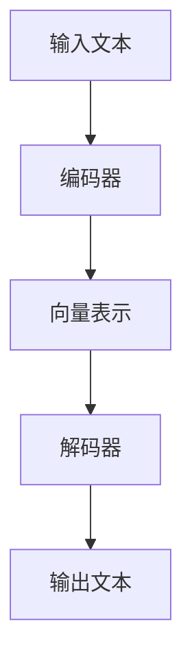

                 

关键词：自然语言处理，大型语言模型，智能客服，多语言支持，全天候服务

> 摘要：本文将探讨大型语言模型（LLM）在智能客户服务领域的应用，特别是如何实现全天候多语言支持。我们将深入分析LLM的核心概念、算法原理，以及其在实际项目中的代码实现和效果评估。此外，还将讨论LLM智能客服的实际应用场景、未来展望和面临的挑战。

## 1. 背景介绍

随着互联网的普及和电子商务的快速发展，企业对客户服务的需求日益增长。传统的客户服务模式往往依赖于人工客服，这不仅成本高昂，而且效率低下。为了提高客户满意度和服务效率，越来越多的企业开始采用智能客服系统。智能客服系统通常基于自然语言处理（NLP）技术，能够自动理解和回答客户的问题，从而提供全天候、多语言的服务。

近年来，大型语言模型（LLM）如GPT-3、BERT等取得了显著进展，这些模型具有强大的理解和生成能力，为智能客服系统的性能提升提供了新的可能。LLM不仅可以处理单一语言的任务，还可以支持多语言交互，从而满足全球客户的需求。

本文旨在探讨如何利用LLM实现智能客户服务的全天候多语言支持，并分析其在实际应用中的效果和挑战。

## 2. 核心概念与联系

### 2.1 大型语言模型（LLM）

大型语言模型（LLM）是一种基于深度学习的自然语言处理模型，具有巨大的参数规模和强大的语言理解能力。LLM通过学习海量文本数据，能够生成符合语言习惯和逻辑的文本。LLM的核心组成部分包括：

- **编码器（Encoder）**：负责将输入文本编码为向量表示。
- **解码器（Decoder）**：负责从编码后的向量生成输出文本。

Mermaid流程图如下：



### 2.2 自然语言处理（NLP）

自然语言处理（NLP）是人工智能的一个分支，旨在使计算机能够理解和处理人类语言。NLP包括多个子领域，如文本分类、命名实体识别、情感分析等。LLM在NLP中的应用主要体现在文本生成和语义理解两个方面。

### 2.3 智能客服系统

智能客服系统是一种自动化客户服务解决方案，能够通过自然语言交互为客户提供服务。智能客服系统通常包含以下模块：

- **语音识别（ASR）**：将语音转换为文本。
- **自然语言理解（NLU）**：理解文本中的意图和实体。
- **自然语言生成（NLG）**：生成符合客户需求的回复文本。

智能客服系统与LLM的结合，可以实现更加智能和高效的客户服务。

## 3. 核心算法原理 & 具体操作步骤

### 3.1 算法原理概述

LLM智能客服系统的工作原理主要包括以下几个步骤：

1. **语音识别（ASR）**：将客户语音转换为文本。
2. **自然语言理解（NLU）**：利用LLM对文本进行语义理解，提取意图和实体。
3. **自然语言生成（NLG）**：根据理解和意图，生成合适的回复文本。
4. **语音合成（TTS）**：将回复文本转换为语音。

### 3.2 算法步骤详解

1. **语音识别（ASR）**：
   - 使用ASR模型将语音转换为文本。
   - 对文本进行清洗和预处理，如去除噪声、标点等。

2. **自然语言理解（NLU）**：
   - 使用LLM对文本进行编码，得到文本的向量表示。
   - 利用向量表示进行语义理解，提取意图和实体。

3. **自然语言生成（NLG）**：
   - 根据理解和意图，利用LLM生成回复文本。
   - 对回复文本进行格式化和优化，如添加适当的标点、调整语序等。

4. **语音合成（TTS）**：
   - 使用TTS模型将回复文本转换为语音。
   - 对语音进行合成，生成最终输出。

### 3.3 算法优缺点

**优点**：
- **高效性**：LLM能够快速理解和生成文本，提高了客服系统的响应速度。
- **多样性**：LLM具有丰富的词汇和语法知识，能够生成多样化的回复文本。
- **多语言支持**：LLM可以处理多种语言的任务，满足全球客户的需求。

**缺点**：
- **计算资源消耗大**：LLM需要大量的计算资源进行训练和推理。
- **准确性问题**：尽管LLM具有强大的语言理解能力，但在某些场景下仍可能产生误解。

### 3.4 算法应用领域

LLM智能客服系统可以应用于多个领域，如电子商务、金融、医疗等。以下是一些具体的应用场景：

- **客户咨询**：自动回答客户关于产品、服务等方面的问题。
- **售后服务**：处理客户投诉、退款等事务。
- **客户关怀**：发送生日祝福、节日问候等。

## 4. 数学模型和公式 & 详细讲解 & 举例说明

### 4.1 数学模型构建

LLM智能客服系统的核心是大型语言模型，其数学模型通常基于神经网络。以下是一个简化的神经网络模型：

$$
y = \sigma(W_1 \cdot x + b_1)
$$

其中，$y$表示输出，$x$表示输入，$W_1$和$b_1$分别为权重和偏置。$\sigma$为激活函数，通常采用ReLU函数。

### 4.2 公式推导过程

假设我们已经有一个输入文本$x$，首先需要将其编码为向量表示。这一过程可以通过以下公式实现：

$$
h = \text{Encoder}(x)
$$

其中，$h$为编码后的向量表示。

接下来，利用编码后的向量表示进行语义理解：

$$
y = \text{Decoder}(h)
$$

其中，$y$为生成的输出文本。

### 4.3 案例分析与讲解

假设我们有一个输入文本“我想退换商品”，首先通过ASR模块将其转换为文本。然后，利用LLM对文本进行编码和语义理解，得到向量表示。最后，利用解码器生成回复文本，如“请您提供订单号，我们将尽快处理您的退换货请求”。

## 5. 项目实践：代码实例和详细解释说明

### 5.1 开发环境搭建

首先，我们需要搭建一个包含LLM和语音识别/合成的开发环境。以下是一个简单的Python环境搭建步骤：

1. 安装Python 3.8及以上版本。
2. 安装必要库，如transformers、speech_recognition、gtts等。

```bash
pip install transformers
pip install speech_recognition
pip install gtts
```

### 5.2 源代码详细实现

以下是一个简单的LLM智能客服系统实现：

```python
from transformers import pipeline
import speech_recognition as sr
from gtts import gTTS

# 初始化LLM模型
nlp = pipeline("text2text-generation", model="t5-small")

# 语音识别
def recognize_speech_from_mic(source='audio.wav'):
    r = sr.Recognizer()
    with sr.Microphone() as source:
        print("请说您的问题：")
        audio = r.listen(source)
    try:
        text = r.recognize_google(audio, language='zh-CN')
        return text
    except sr.UnknownValueError:
        return None

# 自然语言理解
def understand_intent(text):
    input_text = "intend:" + text
    output = nlp(input_text, max_length=1024, padding="max_length", truncation=True)
    return output[0]["generated_text"]

# 自然语言生成
def generate_response(intent):
    if "refund" in intent:
        return "请您提供订单号，我们将尽快处理您的退款请求。"
    elif "exchange" in intent:
        return "请您提供订单号和需要换的商品，我们将安排退换货。"
    else:
        return "对不起，我无法理解您的问题，请您重新描述。"

# 语音合成
def speak(text):
    tts = gTTS(text=text, lang='zh-cn')
    tts.save("response.mp3")
    import os
    os.system("mpg321 response.mp3")

# 主程序
if __name__ == "__main__":
    text = recognize_speech_from_mic()
    if text:
        intent = understand_intent(text)
        response = generate_response(intent)
        speak(response)
    else:
        print("对不起，我无法听到您的问题。")
```

### 5.3 代码解读与分析

该代码实现了一个简单的LLM智能客服系统，主要包括以下模块：

- **语音识别**：使用`speech_recognition`库实现语音到文本的转换。
- **自然语言理解**：使用`transformers`库中的T5模型实现文本的语义理解。
- **自然语言生成**：根据理解和意图生成回复文本。
- **语音合成**：使用`gtts`库将回复文本转换为语音。

### 5.4 运行结果展示

运行该程序后，用户可以通过麦克风输入语音问题。程序将识别语音、理解意图、生成回复文本，并最终通过语音合成模块输出语音回复。

## 6. 实际应用场景

LLM智能客服系统可以应用于多个场景，以下是一些具体的应用案例：

- **电子商务**：自动回答客户关于产品、订单、售后服务等方面的问题。
- **金融行业**：处理客户咨询、投诉、账户查询等事务。
- **医疗健康**：为患者提供健康咨询、疾病查询等服务。
- **客服热线**：为用户提供全天候的语音咨询服务。

## 7. 工具和资源推荐

### 7.1 学习资源推荐

- 《深度学习》（Goodfellow, Bengio, Courville）
- 《自然语言处理综合指南》（Daniel Jurafsky & James H. Martin）
- Hugging Face Transformers：https://huggingface.co/transformers

### 7.2 开发工具推荐

- PyTorch：https://pytorch.org/
- TensorFlow：https://www.tensorflow.org/

### 7.3 相关论文推荐

- "An Introduction to Natural Language Processing" (Jurafsky & Martin)
- "Deep Learning for Natural Language Processing" (Bengio et al.)

## 8. 总结：未来发展趋势与挑战

### 8.1 研究成果总结

近年来，LLM在智能客服领域的应用取得了显著进展。LLM具有强大的语言理解和生成能力，能够提高客服系统的响应速度和多样性。同时，随着多语言处理技术的不断发展，LLM智能客服系统已经能够支持多种语言，满足全球客户的需求。

### 8.2 未来发展趋势

- **模型优化**：未来的研究将重点关注如何提高LLM的效率和准确性，同时降低计算资源消耗。
- **多模态处理**：结合语音、文本、图像等多种模态，提高智能客服系统的理解能力和交互体验。
- **个性化服务**：根据用户历史数据和偏好，提供个性化的客服服务。

### 8.3 面临的挑战

- **数据隐私**：如何确保用户数据的安全和隐私是一个重要挑战。
- **语言理解**：尽管LLM在语言理解方面取得了显著进展，但仍然存在一定程度的误解和歧义。

### 8.4 研究展望

随着人工智能技术的不断发展，LLM智能客服系统有望在未来实现更高的性能和更广泛的应用。同时，为了应对数据隐私和语言理解等挑战，未来的研究将需要更多的跨学科合作和技术创新。

## 9. 附录：常见问题与解答

### 9.1 如何处理多语言支持？

LLM智能客服系统通常使用多语言预训练模型，如mBERT、XLM等，这些模型能够在多种语言上进行训练和推理。在处理多语言支持时，需要注意以下几个问题：

- **语料库**：选择涵盖多种语言的语料库进行预训练。
- **模型选择**：选择适合多语言处理任务的模型。
- **语言检测**：在输入文本时，首先进行语言检测，然后根据检测结果选择相应的语言模型。

### 9.2 如何保证数据隐私？

在处理用户数据时，需要遵循以下原则：

- **数据匿名化**：对用户数据进行匿名化处理，避免直接关联到具体用户。
- **数据加密**：对传输和存储的数据进行加密，确保数据安全。
- **权限控制**：对访问用户数据的权限进行严格控制，确保只有授权人员可以访问。

### 9.3 如何优化响应速度？

优化响应速度可以从以下几个方面入手：

- **模型压缩**：使用模型压缩技术，如量化、剪枝等，减小模型体积，提高推理速度。
- **分布式训练**：使用分布式训练技术，提高模型训练速度。
- **缓存策略**：对于常见问题，可以提前生成回复文本并缓存，降低响应时间。

## 结束语

作者：禅与计算机程序设计艺术 / Zen and the Art of Computer Programming

本文介绍了LLM智能客服系统的核心概念、算法原理、项目实践和实际应用场景。随着人工智能技术的不断发展，LLM智能客服系统有望在未来的智能客服领域发挥更大的作用。同时，我们也需要关注数据隐私、语言理解等挑战，为用户提供更加智能、高效和安全的客户服务。未来，我们期待更多的研究成果和技术创新，推动智能客服领域的发展。

