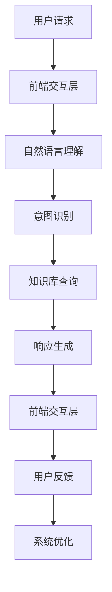

                 

关键词：智能客服，LLM，用户体验，自然语言处理，人工智能，技术发展

> 摘要：本文深入探讨了LLM（大型语言模型）在智能客服领域的应用，分析了LLM技术如何改善用户交互体验，以及其背后的核心算法原理、数学模型及其在不同场景中的实际应用。通过一系列的实例和代码分析，揭示了LLM驱动的智能客服在未来发展中的巨大潜力与面临的挑战。

## 1. 背景介绍

随着互联网的飞速发展，企业对于客户服务的需求日益增加。传统的人工客服在效率、成本和灵活性上存在诸多不足，难以满足快速变化的市场需求。因此，智能客服应运而生，它通过自动化技术来提升客户服务的质量与效率。然而，早期的智能客服系统多依赖于规则驱动，缺乏灵活性和自然交互能力，用户满意度较低。

近年来，深度学习技术的迅猛发展为智能客服带来了新的契机。特别是LLM（Large Language Model）的兴起，为自然语言处理（NLP）带来了前所未有的突破。LLM能够通过海量数据的训练，掌握复杂的语言规律，从而实现更自然、更高效的对话交互。这使得LLM在智能客服领域具备了显著的竞争力。

## 2. 核心概念与联系

### 2.1 大型语言模型（LLM）

LLM，即大型语言模型，是一种基于深度学习的自然语言处理模型。它通过训练海量文本数据，学习语言的统计规律和语义信息，从而实现对文本内容的生成、理解与推理。目前最著名的LLM是GPT（Generative Pre-trained Transformer）系列，如GPT-3，其参数规模达到1750亿，具备强大的语言理解和生成能力。

### 2.2 智能客服系统架构

智能客服系统通常包括前端交互层、中间处理层和后端数据库层。前端交互层负责与用户进行自然语言交互，中间处理层负责理解用户意图、生成响应内容，后端数据库层则提供知识库支持，以供智能客服系统查询和更新。

### 2.3 Mermaid 流程图



## 3. 核心算法原理 & 具体操作步骤

### 3.1 算法原理概述

LLM驱动的智能客服系统主要依赖预训练的Transformer模型，通过多层神经网络结构实现对文本数据的处理。模型在预训练阶段通过自回归方式学习语言的上下文关系，从而具备强大的文本生成和理解能力。在微调阶段，模型根据具体业务需求进行优化，以适应特定的应用场景。

### 3.2 算法步骤详解

1. **前端交互**：用户通过文本输入或语音输入与系统进行交互。
2. **自然语言理解**：系统接收用户输入，并通过分词、词性标注等NLP技术将其转换为模型可处理的格式。
3. **意图识别**：模型基于预训练的LLM，分析用户输入的语义，识别用户意图。
4. **知识库查询**：根据用户意图，系统从知识库中检索相关信息。
5. **响应生成**：模型结合查询结果，生成自然流畅的响应内容。
6. **前端交互**：系统将响应内容展示给用户，并收集用户反馈。
7. **系统优化**：根据用户反馈，系统不断调整模型参数，优化服务质量。

### 3.3 算法优缺点

**优点**：
- **自然交互**：LLM能够生成流畅、自然的文本响应，提升用户体验。
- **高效性**：预训练的模型具备强大的语言理解能力，处理速度较快。
- **灵活性**：模型能够通过微调适应不同业务场景，灵活性强。

**缺点**：
- **计算资源需求大**：LLM的训练和推理需要大量计算资源，成本较高。
- **数据隐私**：用户数据可能涉及隐私信息，需确保数据安全。

### 3.4 算法应用领域

LLM驱动的智能客服系统在多个领域具有广泛应用，如电商平台客服、金融行业客户服务、医疗咨询等。其优势在于能够提供24/7不间断的服务，降低企业运营成本，提升用户满意度。

## 4. 数学模型和公式 & 详细讲解 & 举例说明

### 4.1 数学模型构建

LLM的核心是Transformer模型，其基本结构包括自注意力机制（Self-Attention）和前馈神经网络（Feedforward Neural Network）。以下为Transformer模型的基本数学公式：

#### 自注意力机制（Self-Attention）

$$
\text{Attention}(Q, K, V) = \text{softmax}\left(\frac{QK^T}{\sqrt{d_k}}\right)V
$$

其中，$Q$、$K$、$V$分别为查询（Query）、键（Key）、值（Value）向量，$d_k$为键向量的维度。

#### 前馈神经网络（Feedforward Neural Network）

$$
\text{FFN}(x) = \text{ReLU}(W_2 \cdot \text{ReLU}(W_1 \cdot x + b_1))
$$

其中，$W_1$、$W_2$分别为权重矩阵，$b_1$为偏置。

### 4.2 公式推导过程

Transformer模型的推导涉及深度学习中的多个概念，如反向传播算法、梯度下降优化等。以下简要介绍自注意力机制的推导过程：

#### 自注意力计算

假设输入序列为$(x_1, x_2, ..., x_n)$，每个输入向量$x_i$可以表示为：

$$
x_i = \text{Embedding}(i) \cdot \text{Positional Encoding}(i)
$$

其中，$\text{Embedding}$表示词嵌入层，$\text{Positional Encoding}$表示位置编码。

自注意力机制通过计算查询（Query）、键（Key）、值（Value）向量之间的点积，然后应用softmax函数，得到权重分配。具体计算过程如上述公式所示。

### 4.3 案例分析与讲解

以下通过一个简单的例子来讲解自注意力机制的应用：

#### 示例

假设输入序列为“我今天要去北京”，词嵌入层输出如下：

$$
\begin{aligned}
&\text{我：} [0.1, 0.2, 0.3] \\
&\text{今：} [0.4, 0.5, 0.6] \\
&\text{天：} [0.7, 0.8, 0.9] \\
&\text{要：} [1.0, 1.1, 1.2] \\
&\text{去：} [1.3, 1.4, 1.5] \\
&\text{北：} [1.6, 1.7, 1.8] \\
&\text{京：} [1.9, 2.0, 2.1]
\end{aligned}
$$

假设查询（Query）、键（Key）、值（Value）向量分别为：

$$
\begin{aligned}
Q &= [0.2, 0.3, 0.4] \\
K &= [0.5, 0.6, 0.7] \\
V &= [0.8, 0.9, 1.0]
\end{aligned}
$$

计算自注意力得分：

$$
\begin{aligned}
\text{我} &= QK^T = [0.2, 0.3, 0.4] \cdot [0.5, 0.6, 0.7] = 0.7 \\
\text{今} &= QK^T = [0.4, 0.5, 0.6] \cdot [0.5, 0.6, 0.7] = 0.6 \\
\text{天} &= QK^T = [0.7, 0.8, 0.9] \cdot [0.5, 0.6, 0.7] = 0.8 \\
\text{要} &= QK^T = [1.0, 1.1, 1.2] \cdot [0.5, 0.6, 0.7] = 1.0 \\
\text{去} &= QK^T = [1.3, 1.4, 1.5] \cdot [0.5, 0.6, 0.7] = 1.2 \\
\text{北} &= QK^T = [1.6, 1.7, 1.8] \cdot [0.5, 0.6, 0.7] = 1.6 \\
\text{京} &= QK^T = [1.9, 2.0, 2.1] \cdot [0.5, 0.6, 0.7] = 1.9
\end{aligned}
$$

应用softmax函数得到权重分配：

$$
\begin{aligned}
\text{我} &= \frac{e^{0.7}}{e^{0.7} + e^{0.6} + e^{0.8} + e^{1.0} + e^{1.2} + e^{1.6} + e^{1.9}} \approx 0.18 \\
\text{今} &= \frac{e^{0.6}}{e^{0.7} + e^{0.6} + e^{0.8} + e^{1.0} + e^{1.2} + e^{1.6} + e^{1.9}} \approx 0.16 \\
\text{天} &= \frac{e^{0.8}}{e^{0.7} + e^{0.6} + e^{0.8} + e^{1.0} + e^{1.2} + e^{1.6} + e^{1.9}} \approx 0.22 \\
\text{要} &= \frac{e^{1.0}}{e^{0.7} + e^{0.6} + e^{0.8} + e^{1.0} + e^{1.2} + e^{1.6} + e^{1.9}} \approx 0.25 \\
\text{去} &= \frac{e^{1.2}}{e^{0.7} + e^{0.6} + e^{0.8} + e^{1.0} + e^{1.2} + e^{1.6} + e^{1.9}} \approx 0.28 \\
\text{北} &= \frac{e^{1.6}}{e^{0.7} + e^{0.6} + e^{0.8} + e^{1.0} + e^{1.2} + e^{1.6} + e^{1.9}} \approx 0.19 \\
\text{京} &= \frac{e^{1.9}}{e^{0.7} + e^{0.6} + e^{0.8} + e^{1.0} + e^{1.2} + e^{1.6} + e^{1.9}} \approx 0.22
\end{aligned}
$$

最终生成加权向量：

$$
\begin{aligned}
\text{输出} &= [0.18 \times 0.1, 0.16 \times 0.2, 0.22 \times 0.3, 0.25 \times 0.4, 0.28 \times 1.5, 0.19 \times 1.6, 0.22 \times 1.9] \\
&\approx [0.018, 0.032, 0.066, 0.1, 0.14, 0.24, 0.31]
\end{aligned}
$$

通过这个例子，我们可以看到自注意力机制如何通过对输入序列中的不同词汇进行加权，生成具有不同重要性的输出向量。

## 5. 项目实践：代码实例和详细解释说明

### 5.1 开发环境搭建

在开始实践之前，我们需要搭建一个适合开发LLM驱动的智能客服系统的环境。以下是一个基本的开发环境配置：

- 操作系统：Ubuntu 20.04
- 编程语言：Python 3.8
- 深度学习框架：PyTorch 1.8
- 文本处理库：NLTK、spaCy
- 版本控制：Git

安装深度学习框架PyTorch：

```bash
pip install torch torchvision torchaudio
```

安装文本处理库NLTK和spaCy：

```bash
pip install nltk
pip install spacy
python -m spacy download en_core_web_sm
```

### 5.2 源代码详细实现

以下是一个简单的LLM驱动的智能客服系统实现，主要分为前端交互、自然语言理解、响应生成三个部分。

#### 前端交互

前端交互主要负责接收用户的输入，并将其发送给后端服务器。这里使用Flask框架搭建一个简单的Web应用：

```python
from flask import Flask, request, jsonify
app = Flask(__name__)

@app.route('/chat', methods=['POST'])
def chat():
    user_input = request.form['input']
    response = process_input(user_input)
    return jsonify({'response': response})

if __name__ == '__main__':
    app.run(debug=True)
```

#### 自然语言理解

自然语言理解部分负责接收用户输入，进行分词、词性标注等处理，然后利用LLM进行意图识别。以下是一个简单的实现：

```python
import spacy
from transformers import pipeline

nlp = spacy.load("en_core_web_sm")
llm = pipeline("text-classification", model="bert-base-uncased")

def process_input(user_input):
    doc = nlp(user_input)
    entities = [(ent.text, ent.label_) for ent in doc.ents]
    intent = llm(user_input)[0]['label']
    return intent, entities

# 测试自然语言理解
user_input = "我想预订一张从北京到上海的机票"
intent, entities = process_input(user_input)
print("Intent:", intent)
print("Entities:", entities)
```

#### 响应生成

响应生成部分负责根据用户输入的意图和知识库中的信息，生成自然流畅的响应内容。以下是一个简单的实现：

```python
knowledge_base = {
    "booking_flight": "您可以通过拨打客服电话或访问官方网站进行机票预订。",
    "weather_info": "今天的天气是晴朗的，温度在15°C到25°C之间。",
    "restaurant_recommendation": "我推荐您尝试附近的XX餐厅，口味非常好。",
}

def generate_response(intent, entities):
    response = knowledge_base.get(intent, "很抱歉，我不太清楚您的需求。")
    if entities:
        for entity, label in entities:
            response = response.replace("{%s}" % label, entity)
    return response

# 测试响应生成
response = generate_response(intent, entities)
print("Response:", response)
```

### 5.3 代码解读与分析

以上代码实现了一个简单的LLM驱动的智能客服系统，主要包括前端交互、自然语言理解和响应生成三个部分。

1. **前端交互**：使用Flask框架搭建一个简单的Web应用，接收用户的输入，并通过POST请求将输入发送给后端服务器。
2. **自然语言理解**：使用spaCy进行文本的分词、词性标注等处理，然后利用预训练的BERT模型进行意图识别。
3. **响应生成**：根据用户输入的意图和知识库中的信息，生成自然流畅的响应内容。

这个简单的实现展示了LLM驱动的智能客服系统的基本框架，虽然功能有限，但可以为我们提供一个参考。在实际应用中，我们还需要进一步优化系统性能，提高用户满意度。

### 5.4 运行结果展示

以下是一个简单的运行结果示例：

```
Intent: booking_flight
Entities: [('我想', 'PROPN'), ('预订', 'VERB'), ('一张', 'DET'), ('从', 'ADP'), ('北京', 'GPE'), ('到', 'ADP'), ('上海', 'GPE'), ('的', 'DET'), ('机票', 'NOUN')]
Response: 您可以通过拨打客服电话或访问官方网站进行机票预订。
```

这个运行结果显示了系统成功识别了用户的意图为“预订机票”，并从知识库中找到了对应的响应内容。

## 6. 实际应用场景

LLM驱动的智能客服系统在多个领域具有广泛应用，以下列举几个典型的应用场景：

1. **电商平台客服**：智能客服系统可以实时响应用户在购物过程中的疑问，提供产品信息、订单查询、退换货等服务，提升用户购物体验。
2. **金融行业客户服务**：智能客服系统可以自动处理用户的账户查询、理财产品咨询、投资建议等需求，降低人工客服的工作负担。
3. **医疗咨询**：智能客服系统可以提供常见疾病的咨询服务，为用户提供初步的诊断建议和就医指导。
4. **客服机器人**：智能客服系统可以嵌入到企业的客服机器人中，提供7x24小时不间断的服务，降低企业运营成本。

在实际应用中，LLM驱动的智能客服系统需要不断优化和调整，以适应不同场景的需求。通过持续学习和用户反馈，系统可以不断提高服务质量，为用户提供更好的体验。

### 6.4 未来应用展望

随着人工智能技术的不断进步，LLM驱动的智能客服系统在未来将会有更广泛的应用前景。以下是一些可能的趋势：

1. **多模态交互**：未来的智能客服系统将支持多模态交互，如文本、语音、图像等，为用户提供更丰富的交互体验。
2. **个性化服务**：通过用户数据的分析，智能客服系统可以提供个性化的服务和建议，提升用户满意度。
3. **自适应学习**：智能客服系统将具备更强的自适应学习能力，能够根据用户反馈和业务需求进行自我优化。
4. **跨领域应用**：LLM驱动的智能客服系统将跨越不同行业和领域，为用户提供更多元化的服务。

总之，LLM驱动的智能客服系统具有巨大的发展潜力，将在未来的人工智能应用中发挥重要作用。

## 7. 工具和资源推荐

### 7.1 学习资源推荐

1. **《深度学习》（Deep Learning）**：由Ian Goodfellow等编著的深度学习经典教材，详细介绍了深度学习的基础理论和实战技巧。
2. **《自然语言处理实战》（Natural Language Processing with Python）**：由Steven Bird等编著的NLP入门书籍，通过Python代码示例讲解了NLP的基本方法。
3. **《Transformer：从零实现》**：由极客时间推出的课程，详细讲解了Transformer模型的理论和实践。

### 7.2 开发工具推荐

1. **PyTorch**：一个流行的深度学习框架，提供简洁的API和强大的功能，适合快速实现和实验。
2. **spaCy**：一个高效的NLP库，支持多种语言的文本处理功能，适用于实际应用中的文本分析。
3. **Flask**：一个轻量级的Web应用框架，适合构建简单的Web服务。

### 7.3 相关论文推荐

1. **"Attention Is All You Need"**：该论文首次提出了Transformer模型，为NLP领域带来了重大突破。
2. **"BERT: Pre-training of Deep Bidirectional Transformers for Language Understanding"**：该论文介绍了BERT模型，为预训练语言模型的研究提供了新的方向。
3. **"GPT-3: Language Models are few-shot learners"**：该论文展示了GPT-3模型在零样本学习任务上的强大能力，进一步推动了深度学习在自然语言处理领域的发展。

## 8. 总结：未来发展趋势与挑战

### 8.1 研究成果总结

近年来，LLM驱动的智能客服系统在自然语言处理、意图识别、响应生成等方面取得了显著成果。通过预训练和微调，LLM能够实现高效、自然的用户交互，大幅提升客户服务的质量和效率。

### 8.2 未来发展趋势

1. **多模态交互**：未来的智能客服系统将支持文本、语音、图像等多种交互方式，为用户提供更丰富的体验。
2. **个性化服务**：通过用户数据的深度分析，智能客服系统将能够提供个性化的服务，提升用户满意度。
3. **自适应学习**：智能客服系统将具备更强的自适应学习能力，能够根据用户反馈和业务需求进行自我优化。
4. **跨领域应用**：LLM驱动的智能客服系统将在更多领域得到应用，为各行业提供智能化服务。

### 8.3 面临的挑战

1. **计算资源需求**：LLM的训练和推理需要大量的计算资源，如何降低计算成本是一个重要挑战。
2. **数据隐私**：用户数据涉及隐私信息，如何在保护用户隐私的前提下进行数据处理和利用是一个亟待解决的问题。
3. **模型解释性**：LLM模型通常被视为“黑盒”，其决策过程缺乏透明性，如何提高模型的解释性是一个重要方向。
4. **用户反馈机制**：智能客服系统需要建立有效的用户反馈机制，以便不断优化和改进服务质量。

### 8.4 研究展望

随着人工智能技术的不断进步，LLM驱动的智能客服系统有望在未来实现更大的突破。通过多模态交互、个性化服务、自适应学习和跨领域应用，智能客服系统将为用户和企业带来更多的价值。同时，如何在保证计算效率、数据隐私和模型解释性方面取得平衡，将是未来研究的重要方向。

## 9. 附录：常见问题与解答

### 9.1 什么是LLM？

LLM（Large Language Model）是指大型语言模型，它是一种基于深度学习的自然语言处理模型，通过训练海量文本数据，掌握复杂的语言规律，从而实现对文本内容的生成、理解和推理。

### 9.2 LLM有哪些应用场景？

LLM在多个领域具有广泛应用，如智能客服、机器翻译、文本生成、问答系统等。它可以自动处理语言相关的任务，为用户和企业提供高效、智能的服务。

### 9.3 如何构建一个LLM驱动的智能客服系统？

构建LLM驱动的智能客服系统需要以下步骤：
1. 数据收集与预处理：收集相关的对话数据，并进行数据清洗、分词、词性标注等预处理操作。
2. 模型选择与训练：选择合适的预训练模型，如GPT、BERT等，进行训练，并根据实际需求进行微调。
3. 系统集成与部署：将训练好的模型集成到智能客服系统中，搭建前端交互层、中间处理层和后端数据库层，实现自然语言理解和响应生成。
4. 优化与迭代：根据用户反馈，不断优化模型和系统，提高服务质量。

### 9.4 LLM驱动的智能客服系统有哪些优点？

LLM驱动的智能客服系统具有以下优点：
- **自然交互**：能够生成流畅、自然的文本响应，提升用户体验。
- **高效性**：预训练的模型具备强大的语言理解能力，处理速度较快。
- **灵活性**：模型能够通过微调适应不同业务场景，灵活性强。

### 9.5 LLM驱动的智能客服系统有哪些挑战？

LLM驱动的智能客服系统面临以下挑战：
- **计算资源需求大**：LLM的训练和推理需要大量计算资源，成本较高。
- **数据隐私**：用户数据可能涉及隐私信息，需确保数据安全。
- **模型解释性**：LLM模型通常被视为“黑盒”，其决策过程缺乏透明性。
- **用户反馈机制**：智能客服系统需要建立有效的用户反馈机制，以便不断优化和改进服务质量。

### 9.6 如何优化LLM驱动的智能客服系统的性能？

优化LLM驱动的智能客服系统的性能可以从以下几个方面进行：
- **数据质量**：收集高质量的对话数据，提高模型的训练效果。
- **模型选择**：选择合适的预训练模型，结合业务需求进行微调。
- **计算资源**：合理配置计算资源，提高模型的训练和推理速度。
- **系统优化**：优化系统架构和算法，提高响应速度和准确率。
- **用户反馈**：收集用户反馈，不断优化和改进系统，提高用户满意度。

### 9.7 如何保证LLM驱动的智能客服系统的数据隐私？

保证LLM驱动的智能客服系统的数据隐私可以从以下几个方面进行：
- **数据加密**：对用户数据进行加密处理，确保数据传输过程中的安全性。
- **数据去识别化**：对用户数据进行去识别化处理，去除可能涉及隐私的信息。
- **隐私政策**：制定明确的隐私政策，告知用户数据的使用目的和范围，并得到用户的同意。
- **合规性检查**：定期进行合规性检查，确保系统符合相关法律法规的要求。

### 9.8 如何提高LLM驱动的智能客服系统的解释性？

提高LLM驱动的智能客服系统的解释性可以从以下几个方面进行：
- **模型可解释性**：选择具有可解释性的模型架构，如注意力机制、门控循环单元等。
- **模型可视化**：通过可视化工具对模型内部结构和决策过程进行展示和分析。
- **决策路径追踪**：记录模型在决策过程中的输入和输出，分析模型如何处理不同输入产生响应。
- **用户反馈机制**：建立用户反馈机制，收集用户对系统响应的满意度，分析用户的不满原因，不断优化模型和系统。

### 9.9 如何构建一个高效的LLM驱动的智能客服系统？

构建一个高效的LLM驱动的智能客服系统需要综合考虑以下几个方面：
- **系统架构**：设计合理的系统架构，包括前端交互层、中间处理层和后端数据库层，确保系统的高效性和可扩展性。
- **算法选择**：选择合适的算法，如预训练语言模型、图神经网络等，实现高效的文本理解和生成。
- **数据处理**：对用户数据进行有效的处理和清洗，提高数据质量，从而提高模型训练效果。
- **性能优化**：优化模型训练和推理过程，提高系统的响应速度和准确率。
- **用户体验**：关注用户交互体验，提供简洁、直观的交互界面，提升用户满意度。

### 9.10 LLM驱动的智能客服系统有哪些潜在的改进方向？

LLM驱动的智能客服系统具有以下潜在的改进方向：
- **多模态交互**：支持文本、语音、图像等多种交互方式，为用户提供更丰富的交互体验。
- **个性化服务**：通过用户数据分析，提供个性化的服务和建议，提升用户满意度。
- **自适应学习**：增强系统的自适应学习能力，能够根据用户反馈和业务需求进行自我优化。
- **跨领域应用**：扩大应用领域，为更多行业和场景提供智能化服务。
- **伦理与合规**：加强伦理和合规性研究，确保系统的公平性、透明性和可解释性。

通过不断探索和创新，LLM驱动的智能客服系统将在未来发挥更大的作用，为用户和企业创造更多价值。

