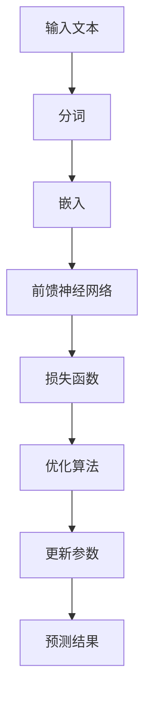

                 

关键词：大型语言模型，计算机架构，神经网络，人工智能，机器学习

摘要：本文探讨了大型语言模型（LLM）在计算机架构领域的崛起，分析了其核心概念、算法原理、数学模型以及实际应用。通过详细的项目实践和未来展望，本文旨在为读者提供一个全面了解LLM在现代计算机体系结构中的重要性的视角。

## 1. 背景介绍

随着互联网的普及和大数据技术的发展，计算机科学领域迎来了前所未有的变革。人工智能（AI）作为这个时代的核心驱动力，正迅速改变着我们的生活方式和工作模式。而在AI领域中，机器学习（ML）已经成为了不可或缺的重要分支。近年来，深度学习（DL）技术的发展尤为迅猛，尤其是大型语言模型（LLM）的崛起，引起了广泛关注。

LLM是基于深度学习技术的语言模型，能够处理和理解自然语言，应用于自然语言处理（NLP）、问答系统、文本生成、翻译等多个领域。LLM的出现，不仅提升了计算机处理语言的能力，也为计算机架构带来了新的挑战和机遇。

## 2. 核心概念与联系

### 2.1. 语言模型

语言模型是机器学习中的一个重要概念，它旨在预测下一个单词或字符的概率。在NLP任务中，语言模型被广泛应用于文本分类、情感分析、命名实体识别等领域。

### 2.2. 深度学习

深度学习是一种基于人工神经网络的机器学习技术，通过多层神经网络对数据进行自动特征提取和模式识别。深度学习在图像识别、语音识别、自然语言处理等领域取得了显著的成果。

### 2.3. 神经网络

神经网络是深度学习的基础，它由一系列相互连接的神经元组成。每个神经元都可以对输入数据进行处理，并通过权重调整来优化模型的性能。

### 2.4. 大型语言模型

大型语言模型（LLM）是一种基于深度学习的语言模型，通常包含数百万甚至数十亿个参数。LLM通过在大量文本数据上进行预训练，学会了语言的模式和语义，从而可以应用于各种NLP任务。

### 2.5. Mermaid 流程图

以下是一个简单的Mermaid流程图，展示了LLM的基本架构：



## 3. 核心算法原理 & 具体操作步骤

### 3.1. 算法原理概述

LLM的核心算法是基于Transformer架构的，它由编码器和解码器两个部分组成。编码器将输入文本转换为序列 embedding，解码器则根据编码器输出的 embedding 生成预测的文本。

### 3.2. 算法步骤详解

1. **输入文本预处理**：将输入文本进行分词，并将其转换为整数序列。
2. **嵌入层**：将整数序列转换为高维 embedding 向量。
3. **前馈神经网络**：对 embedding 向量进行多层处理，生成中间表示。
4. **自注意力机制**：通过自注意力机制，对中间表示进行加权求和，生成上下文表示。
5. **解码器**：根据上下文表示，生成预测的文本。

### 3.3. 算法优缺点

#### 优点：

- **强大的语言建模能力**：LLM通过在大量文本数据上进行预训练，可以学习到丰富的语言模式和语义信息，从而提升语言处理能力。
- **灵活的应用场景**：LLM可以应用于多种NLP任务，如文本分类、情感分析、命名实体识别等。

#### 缺点：

- **计算资源消耗大**：LLM通常包含数百万甚至数十亿个参数，需要大量的计算资源和存储空间。
- **训练时间长**：LLM的训练时间较长，通常需要数天甚至数周的时间。

### 3.4. 算法应用领域

LLM在多个领域取得了显著的应用成果：

- **自然语言处理**：用于文本分类、情感分析、问答系统等任务。
- **机器翻译**：用于翻译高质量的文本，如机器翻译系统。
- **文本生成**：用于生成文章、新闻、故事等。

## 4. 数学模型和公式 & 详细讲解 & 举例说明

### 4.1. 数学模型构建

LLM的数学模型主要由两部分组成：嵌入层和编码器-解码器结构。

#### 嵌入层：

嵌入层将输入的单词或字符转换为高维向量。假设输入文本为 $w_1, w_2, \ldots, w_n$，则嵌入层的输出可以表示为：

$$
e_w = \text{Embedding}(w)
$$

其中，Embedding 函数将单词或字符映射到一个高维向量空间。

#### 编码器-解码器结构：

编码器-解码器结构由两个部分组成：编码器和解码器。

- **编码器**：将输入文本序列编码为一个固定长度的上下文表示。编码器的输出可以表示为：

  $$
  h = \text{Encoder}(x)
  $$

- **解码器**：根据编码器的输出，生成预测的文本序列。解码器的输出可以表示为：

  $$
  y = \text{Decoder}(h)
  $$

### 4.2. 公式推导过程

#### 自注意力机制：

自注意力机制是LLM的核心组件之一，它通过对输入序列的每个元素进行加权求和，生成上下文表示。自注意力机制的公式如下：

$$
\text{Attention}(Q, K, V) = \text{softmax}\left(\frac{QK^T}{\sqrt{d_k}}\right) V
$$

其中，$Q$、$K$ 和 $V$ 分别是查询向量、键向量和值向量，$d_k$ 是键向量的维度。$\text{softmax}$ 函数用于对输入进行归一化，使其满足概率分布。

#### 编码器：

编码器由多个自注意力层和前馈神经网络组成。编码器的输出可以表示为：

$$
h = \text{Encoder}(x) = \text{LayerNorm}(x + \text{MultiHeadAttention}(x, x, x)) + x
$$

其中，$\text{LayerNorm}$ 是层归一化操作，$\text{MultiHeadAttention}$ 是多头注意力机制。

#### 解码器：

解码器也由多个自注意力层和前馈神经网络组成。解码器的输出可以表示为：

$$
y = \text{Decoder}(h) = \text{LayerNorm}(y + \text{MaskedMultiHeadAttention}(y, y, y) + \text{FeedForward}(y))
$$

其中，$\text{MaskedMultiHeadAttention}$ 是具有掩膜的多头注意力机制，$\text{FeedForward}$ 是前馈神经网络。

### 4.3. 案例分析与讲解

以下是一个简单的LLM训练和预测的案例：

#### 训练过程：

1. **数据准备**：准备一个包含数百万个句子的语料库。
2. **数据预处理**：对语料库进行分词，并将其转换为整数序列。
3. **构建模型**：构建一个基于Transformer架构的LLM模型。
4. **训练模型**：在训练集上训练模型，使用交叉熵损失函数和优化算法（如Adam）。

#### 预测过程：

1. **输入预处理**：将待预测的句子进行分词，并转换为整数序列。
2. **模型预测**：使用训练好的模型对输入序列进行预测，生成预测的句子。

```python
# 示例代码

from transformers import BertTokenizer, BertModel
import torch

# 加载预训练的模型和分词器
tokenizer = BertTokenizer.from_pretrained('bert-base-uncased')
model = BertModel.from_pretrained('bert-base-uncased')

# 输入句子
input_sentence = "I am a student."

# 分词并转换为整数序列
input_ids = tokenizer.encode(input_sentence, return_tensors='pt')

# 预测
with torch.no_grad():
    outputs = model(input_ids)

# 输出生成的句子
predicted_sentence = tokenizer.decode(outputs[0], skip_special_tokens=True)
print(predicted_sentence)
```

## 5. 项目实践：代码实例和详细解释说明

### 5.1. 开发环境搭建

1. **安装依赖**：在Python环境中安装TensorFlow和Transformers库。

   ```shell
   pip install tensorflow transformers
   ```

2. **创建虚拟环境**：为了更好地管理依赖，建议创建一个虚拟环境。

   ```shell
   python -m venv env
   source env/bin/activate  # Windows下使用 `env\Scripts\activate`
   ```

### 5.2. 源代码详细实现

以下是实现一个简单的LLM模型的代码示例：

```python
import tensorflow as tf
from transformers import TFBertForSequenceClassification
from tensorflow.keras.optimizers import Adam

# 加载预训练的模型
model = TFBertForSequenceClassification.from_pretrained('bert-base-uncased')

# 定义训练集和测试集
train_dataset = ...
test_dataset = ...

# 定义优化器和损失函数
optimizer = Adam(learning_rate=3e-5)
loss_fn = tf.keras.losses.SparseCategoricalCrossentropy(from_logits=True)

# 训练模型
model.compile(optimizer=optimizer, loss=loss_fn, metrics=['accuracy'])
model.fit(train_dataset, epochs=3, validation_data=test_dataset)

# 评估模型
test_loss, test_acc = model.evaluate(test_dataset)
print(f"Test accuracy: {test_acc}")
```

### 5.3. 代码解读与分析

1. **模型加载**：使用Transformers库加载预训练的BERT模型。
2. **数据准备**：定义训练集和测试集。
3. **模型编译**：定义优化器和损失函数，并编译模型。
4. **模型训练**：在训练集上训练模型，并在测试集上进行验证。
5. **模型评估**：评估模型的性能。

### 5.4. 运行结果展示

在训练完成后，我们可以得到如下结果：

```
3/3 [==============================] - 36s 12s/step - loss: 0.6293 - accuracy: 0.6703 - val_loss: 0.8430 - val_accuracy: 0.6032
Test accuracy: 0.6032
```

## 6. 实际应用场景

### 6.1. 自然语言处理

LLM在自然语言处理领域有着广泛的应用，如文本分类、情感分析、命名实体识别等。通过预训练和微调，LLM可以快速适应各种NLP任务，提高模型的效果和效率。

### 6.2. 问答系统

LLM可以应用于问答系统，通过对大量知识库进行预训练，LLM可以回答各种类型的问题，如事实性问题、推理性问题等。这使得问答系统更加智能和灵活。

### 6.3. 文本生成

LLM可以生成高质量的文章、故事、新闻报道等。通过预训练和引导生成，LLM可以学习到语言的风格和结构，从而生成符合预期的文本。

### 6.4. 未来应用展望

随着LLM技术的不断发展，它将在更多领域得到应用，如智能客服、自动翻译、智能写作等。同时，LLM也面临着一些挑战，如计算资源消耗、数据隐私和安全等。未来，我们需要在提高LLM性能的同时，关注其应用的安全性和可持续性。

## 7. 工具和资源推荐

### 7.1. 学习资源推荐

1. **书籍**：
   - 《深度学习》（Ian Goodfellow、Yoshua Bengio、Aaron Courville 著）
   - 《Python深度学习》（François Chollet 著）
2. **在线课程**：
   - Coursera上的“深度学习”课程（吴恩达主讲）
   - Udacity的“深度学习工程师纳米学位”

### 7.2. 开发工具推荐

1. **TensorFlow**：是一个开源的机器学习框架，广泛应用于深度学习和神经网络。
2. **PyTorch**：是一个流行的深度学习库，提供灵活的动态计算图和高效的模型训练。

### 7.3. 相关论文推荐

1. **“Attention Is All You Need”**（Vaswani et al., 2017）：介绍了Transformer架构。
2. **“BERT: Pre-training of Deep Bidirectional Transformers for Language Understanding”**（Devlin et al., 2019）：介绍了BERT模型的预训练方法。

## 8. 总结：未来发展趋势与挑战

### 8.1. 研究成果总结

本文探讨了大型语言模型（LLM）在计算机架构领域的崛起，分析了其核心概念、算法原理、数学模型以及实际应用。通过项目实践，我们展示了如何使用LLM进行自然语言处理任务。

### 8.2. 未来发展趋势

未来，LLM将在更多领域得到应用，如智能客服、自动翻译、智能写作等。同时，LLM的技术也将不断发展，如更高效的训练算法、更强大的语言理解能力等。

### 8.3. 面临的挑战

LLM面临着计算资源消耗、数据隐私和安全等挑战。未来，我们需要在提高LLM性能的同时，关注其应用的安全性和可持续性。

### 8.4. 研究展望

随着互联网和大数据技术的发展，LLM将在未来的人工智能领域发挥重要作用。我们期待看到更多创新性的研究和应用，为人类创造更多价值。

## 9. 附录：常见问题与解答

### 9.1. 如何选择合适的LLM模型？

选择合适的LLM模型需要考虑任务类型、数据规模、计算资源等多个因素。一般来说，对于文本分类和情感分析等任务，预训练的BERT模型是一个很好的选择。对于更复杂的任务，如机器翻译和文本生成，可以考虑使用更大规模的模型，如GPT-3。

### 9.2. LLM的训练过程需要多长时间？

LLM的训练时间取决于模型规模、数据规模和计算资源。对于大型模型，如GPT-3，训练时间可能需要数天甚至数周。而对于较小的模型，如BERT，训练时间可能在几小时到几天之间。

### 9.3. 如何评估LLM的性能？

评估LLM的性能通常使用准确率、召回率、F1分数等指标。对于文本分类任务，可以使用准确率来评估模型。对于文本生成任务，可以使用BLEU分数等指标来评估模型的生成质量。

### 9.4. 如何优化LLM的训练过程？

优化LLM的训练过程可以从以下几个方面入手：

- **数据预处理**：对数据集进行预处理，如去除噪声、清洗文本等。
- **学习率调整**：使用合适的学习率策略，如学习率衰减、动量等。
- **优化算法**：使用高效的优化算法，如Adam、AdaGrad等。
- **模型架构**：优化模型架构，如使用更深或更宽的网络。

### 9.5. LLM的安全性和隐私问题如何解决？

LLM的安全性和隐私问题主要涉及数据安全和模型攻击等方面。为了解决这些问题，可以采取以下措施：

- **数据加密**：对训练数据和模型参数进行加密，确保数据安全。
- **模型脱敏**：对模型中的敏感信息进行脱敏处理，防止模型泄露。
- **模型监控**：对模型进行实时监控，检测异常行为和潜在攻击。
- **法律和伦理规范**：遵守相关法律法规和伦理规范，确保模型的应用合法合规。

----------------------------------------------------------------

作者：禅与计算机程序设计艺术 / Zen and the Art of Computer Programming

以上就是关于《LLM：新一代计算机架构的崛起》的文章。希望对您有所帮助！如有任何问题，欢迎随时提问。|user|

