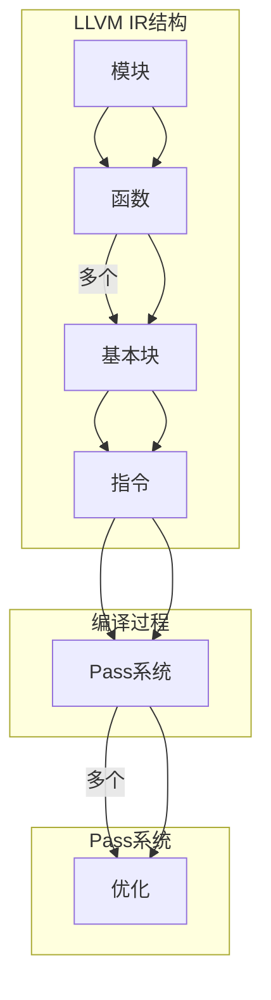

                 

关键词：LLVM，编译器，中间代码优化，Pass系统，代码生成，性能分析，资源管理，多语言支持，工具链，静态分析，动态分析，代码复用，模块化设计

## 摘要

本文将深入探讨LLVM编译器框架中的Pass系统，以及如何进行有效的开发与优化。我们将从背景介绍开始，探讨LLVM的核心概念和架构，接着详细解释Pass的工作原理及其在编译过程中的作用。文章还将介绍如何开发一个新的Pass，包括算法原理、具体步骤、优缺点分析以及应用领域。随后，我们将展示数学模型和公式，并举例说明。通过项目实践，我们将分析代码实例，解释其详细实现和运行结果。最后，文章将讨论实际应用场景，推荐工具和资源，总结研究成果，展望未来发展，并回答常见问题。

## 1. 背景介绍

编译器是计算机科学中不可或缺的一部分，其作用是将高级编程语言（如C++、Java等）编写的源代码转换为计算机能够理解和执行的机器代码。然而，编译器的开发并不简单，它涉及多个层次和复杂的流程。LLVM（Low Level Virtual Machine）是一个模块化、多语言、静态单例编译器框架，旨在提高代码的优化性能和跨语言兼容性。LLVM的核心优势在于其高度模块化和灵活的Pass系统，使得开发者能够方便地添加、配置和优化各种中间代码转换和分析工具。

### LLVM的起源与发展

LLVM由Chris Lattner和Vadim Batsov于2003年发起，初衷是为了解决在编译器开发中遇到的一些瓶颈。LLVM的设计目标包括可扩展性、性能优化、跨语言支持和代码复用。自从其开源以来，LLVM在学术界和工业界得到了广泛关注和实际应用。如今，LLVM已经成为许多大型项目和工具链的核心组成部分，如Clang、Swift、LLVM-GCC等。

### LLVM在编译器开发中的重要性

在现代编译器中，LLVM的重要性不可忽视。它提供了强大的中间表示（IR）和高效的代码生成器，使得开发者能够专注于特定阶段的优化和转换，而无需重复实现底层细节。此外，LLVM的多语言支持使得编译器能够处理多种编程语言，这极大地提高了其灵活性和实用性。LLVM还通过其Pass系统实现了高度模块化的设计，使得开发者能够方便地添加和组合各种优化工具，从而实现高效的编译过程。

### LLVM Pass系统

LLVM Pass系统是LLVM编译器框架中的一个关键组成部分，它负责处理和优化中间代码。Pass（Passes的简称）是一种针对中间表示（IR）进行转换的模块，可以执行静态分析、优化、代码生成等操作。LLVM Pass系统的设计旨在提供一种灵活、高效的方式来优化编译过程，同时保持模块化，便于开发者自定义和扩展。

### LLVM Pass系统的核心概念

LLVM Pass系统中的核心概念包括Pass级别、依赖关系、执行顺序和优化策略。每个Pass都有一个明确的执行级别，表示它在编译过程中的位置和作用。Pass之间的依赖关系确保了优化过程的正确性和一致性。执行顺序是指Pass在编译过程中的执行顺序，通常需要根据优化目标和性能要求进行精心设计。优化策略则决定了如何选择和组合各种Pass，以实现最佳的编译性能。

### LLVM Pass系统的发展与改进

随着LLVM框架的不断演进，Pass系统也在不断改进和发展。新的Pass和优化技术不断涌现，使得LLVM能够更好地适应不同的编程语言和应用场景。同时，LLVM社区也在持续努力，提高Pass系统的性能和可扩展性，以满足日益增长的编译需求和挑战。

## 2. 核心概念与联系

在深入了解LLVM Pass系统之前，我们需要明确几个核心概念和它们之间的关系，以便更好地理解其工作原理和实现方法。

### LLVM的核心概念

LLVM的核心概念包括模块（Module）、函数（Function）、基本块（Basic Block）和指令（Instruction）等。这些概念构成了LLVM中间表示（IR）的基本单元，是Pass系统进行转换和优化的基础。

- **模块（Module）**：模块是LLVM IR的基本组织单位，它包含了整个程序的所有函数、变量和类型定义。每个模块都可以看作是一个独立的编译单元，可以被其他模块引用。
- **函数（Function）**：函数是模块中的基本执行单元，它包含了函数体的指令序列。函数可以定义在模块内部，也可以从外部模块导入或导出。
- **基本块（Basic Block）**：基本块是函数中的一个连续指令序列，它在控制流上是一个不可分割的单元。基本块之间的转移通过控制流指令（如分支、跳转等）实现。
- **指令（Instruction）**：指令是基本块中的具体操作，它们定义了如何对数据进行处理和操作。指令可以是简单操作，如赋值、算术运算，也可以是复杂操作，如函数调用、内存访问等。

### LLVM Pass系统的核心概念

LLVM Pass系统中的核心概念包括Pass（Passes）、依赖关系、执行顺序和优化策略。这些概念共同构成了Pass系统的框架，使得开发者能够灵活地开发、组合和优化各种编译器工具。

- **Pass（Passes）**：Pass是LLVM中的一个模块，用于对中间表示（IR）进行转换和优化。每个Pass都有自己的执行目标和算法，可以独立或组合使用。
- **依赖关系**：Pass之间的依赖关系决定了它们在编译过程中的执行顺序。某些Pass可能依赖于其他Pass的结果，以确保优化过程的正确性和一致性。
- **执行顺序**：执行顺序是指Pass在编译过程中的执行顺序。通常，执行顺序需要根据优化目标和性能要求进行精心设计，以确保最佳的性能和效果。
- **优化策略**：优化策略决定了如何选择和组合各种Pass，以实现最佳的编译性能。优化策略通常需要考虑Pass之间的依赖关系和执行顺序，以及特定的优化目标和性能要求。

### 核心概念的联系

LLVM的核心概念与Pass系统之间存在紧密的联系。模块、函数、基本块和指令构成了LLVM IR的基本结构，为Pass系统的转换和优化提供了基础。Pass作为对中间表示进行转换和优化的模块，通过依赖关系、执行顺序和优化策略，实现了高效的编译过程。

- **模块（Module）**：模块是Pass系统的组织单位，每个模块可以包含多个函数，每个函数又可以包含多个基本块。
- **函数（Function）**：函数是Pass系统优化的基本单元。Pass可以对函数进行各种转换和优化，如代码压缩、循环优化、函数内联等。
- **基本块（Basic Block）**：基本块是Pass系统进行控制流优化的关键单元。Pass可以分析基本块之间的转移关系，优化控制流语句，减少分支和跳转，提高代码执行效率。
- **指令（Instruction）**：指令是Pass系统进行数据流优化的基础。Pass可以分析指令的操作数和结果，优化数据依赖关系，减少冗余指令，提高代码执行效率。

通过明确这些核心概念和它们之间的联系，我们可以更好地理解LLVM Pass系统的工作原理和实现方法，为后续的开发和优化工作奠定基础。

### Mermaid 流程图

为了更好地展示LLVM Pass系统的工作流程和核心概念之间的联系，我们可以使用Mermaid流程图来描述。以下是一个简化的Mermaid流程图，展示了模块、函数、基本块和指令之间的关系，以及Pass在编译过程中的执行顺序。



在这个流程图中，模块（Module）是整个程序的组织单位，包含了多个函数（Functions）。每个函数又可以包含多个基本块（BBs），而基本块则由一系列指令（Instructions）组成。Pass系统（Passes）在编译过程中对指令进行各种优化（Optimizations），从而提高代码的执行效率。

通过这个流程图，我们可以直观地理解LLVM Pass系统的工作原理和核心概念之间的联系，为后续的开发和优化工作提供指导。

### 3. 核心算法原理 & 具体操作步骤

#### 3.1 算法原理概述

LLVM Pass系统中的核心算法主要分为静态分析和动态分析两大类。静态分析是指在编译过程中对代码进行分析，而不需要实际运行程序；动态分析则是在程序运行时进行观察和分析。这两种分析方法相互补充，共同实现高效的代码优化。

- **静态分析**：静态分析主要关注代码的结构、语法和语义，通过符号执行、数据流分析、控制流分析等技术，提取程序的各种特性。静态分析可以提前发现潜在的错误和性能瓶颈，为后续的优化提供依据。
- **动态分析**：动态分析是在程序运行过程中收集数据，通过监测程序的执行行为来发现性能瓶颈和潜在问题。动态分析通常需要额外的工具支持，如性能分析器、调试器和日志记录器等。

#### 3.2 算法步骤详解

##### 静态分析步骤

1. **词法分析**：将源代码分解为词法单元，如标识符、关键字、运算符等。词法分析是编译过程的第一步，为后续的语法分析提供基础。

2. **语法分析**：将词法单元组织成语法结构，如语句、表达式和函数等。语法分析器根据预定义的语法规则，将词法单元转换成抽象语法树（AST）。

3. **语义分析**：对抽象语法树进行语义检查和类型检查，确保代码的语法正确性和语义一致性。语义分析包括变量作用域检查、类型转换检查等。

4. **数据流分析**：分析程序中数据的使用和传播，提取各种数据依赖关系。数据流分析包括常量传播、循环依赖分析、活度分析等。

5. **控制流分析**：分析程序中的控制流结构，如分支、跳转和循环等。控制流分析可以帮助优化器确定代码的执行路径和优化策略。

##### 动态分析步骤

1. **编译和加载**：将源代码编译成可执行的机器代码，并加载到运行时环境中。

2. **运行时监测**：在程序运行过程中，收集各种性能数据和执行行为。这些数据包括CPU周期、内存访问、分支预测准确性等。

3. **性能分析**：对收集到的运行时数据进行统计和分析，识别程序中的性能瓶颈和热点代码。

4. **优化策略**：根据性能分析的结果，选择和组合各种优化策略，如指令重排、循环展开、函数内联等，以提升程序的性能。

#### 3.3 算法优缺点

##### 静态分析

**优点**：

- 提前发现潜在的错误和性能瓶颈，降低测试和维护成本。
- 可以在编译过程中并行执行，提高编译效率。
- 可以对代码进行全局优化，提高程序的整体性能。

**缺点**：

- 静态分析无法模拟实际运行环境，可能遗漏某些运行时问题。
- 静态分析的时间复杂度高，可能影响编译速度。

##### 动态分析

**优点**：

- 可以在实际运行环境中观察程序的行为，发现真实的性能瓶颈。
- 动态分析可以收集详细的数据，为优化提供更准确的依据。

**缺点**：

- 动态分析需要运行程序，可能增加测试时间和复杂性。
- 动态分析无法进行全局优化，仅限于对局部代码的优化。

#### 3.4 算法应用领域

##### 静态分析

- **代码审计和漏洞扫描**：通过静态分析，可以检测代码中的安全漏洞和潜在风险，提高软件的安全性。
- **性能优化**：静态分析可以识别程序中的瓶颈和热点代码，为性能优化提供依据。
- **代码复用和重构**：静态分析可以帮助开发者发现可复用的代码段，提高开发效率。

##### 动态分析

- **性能测试和调优**：动态分析可以实时监测程序的运行状态，识别性能瓶颈，为调优提供依据。
- **自动化测试**：通过动态分析，可以自动化测试程序的功能和性能，提高测试覆盖率。
- **诊断和故障排除**：动态分析可以帮助开发者诊断程序中的故障和异常，提高故障排除效率。

### 3.5 核心算法与LLVM Pass系统的关系

LLVM Pass系统通过集成静态分析和动态分析算法，实现了高效的编译过程。Pass系统中的每个Pass都负责执行特定的分析或优化任务，这些任务相互配合，共同实现代码的转换和优化。

- **静态分析Pass**：如数据流分析Pass、控制流分析Pass等，负责对中间表示（IR）进行深入分析，提取程序的各种特性。
- **动态分析Pass**：如性能分析Pass、调试器Pass等，负责在程序运行时收集数据，为优化和调试提供依据。

通过合理地组合和配置这些Pass，LLVM Pass系统可以针对不同的优化目标和应用场景，实现高效的代码优化和编译过程。

### 3.6 具体算法实例

为了更好地理解核心算法的原理和应用，我们以下将介绍几个典型的算法实例。

#### 数据流分析算法

**算法描述**：数据流分析是一种用于确定程序中变量和表达式在程序各个位置上的值和状态的算法。常见的数据流分析包括常量传播、活度分析和循环依赖分析等。

**应用场景**：常量传播可以减少程序中的常量计算，提高执行效率；活度分析可以优化变量的作用域，减少内存访问；循环依赖分析可以帮助识别循环结构中的依赖关系，优化循环迭代次数。

**算法实现**：

1. **常量传播**：从程序入口开始，逐个指令进行传播。对于每个指令，判断其操作数是否为常量，如果是，则将其结果传播到后续的指令中。

2. **活度分析**：对程序中的每个变量，计算其在各个基本块中的活度，即变量被引用的最后位置。根据活度信息，可以优化变量的作用域和内存访问。

3. **循环依赖分析**：对循环结构进行深度分析，计算循环中的依赖关系。根据依赖关系，可以优化循环体内的指令执行顺序，减少不必要的计算。

#### 控制流分析算法

**算法描述**：控制流分析用于确定程序中的控制流结构，如分支、跳转和循环等。通过分析控制流，可以优化程序的控制流语句，减少分支和跳转，提高代码执行效率。

**应用场景**：控制流分析可以优化程序中的分支判断，减少条件分支的数量；可以优化循环结构，减少循环迭代次数；可以识别和消除死代码，提高代码的执行效率。

**算法实现**：

1. **控制流图构建**：首先构建程序的控制流图（CFG），其中每个节点表示一个基本块，边表示控制流的转移关系。

2. **分支预测**：对控制流图进行分支预测分析，根据分支历史信息和预测算法，预测分支的执行方向。通过预测分支，可以优化分支判断，减少条件分支的数量。

3. **循环优化**：对循环结构进行优化，包括循环展开、循环迭代次数优化、循环不变式提取等。通过优化循环结构，可以提高代码的执行效率。

### 3.7 总结

核心算法原理与具体操作步骤在LLVM Pass系统中扮演着关键角色。通过静态分析和动态分析算法，LLVM Pass系统实现了高效的代码转换和优化。具体算法实例展示了如何在实际场景中应用这些算法，优化编译过程和程序性能。在后续的章节中，我们将进一步探讨如何开发新的LLVM Pass，以及如何在实际项目中应用这些算法。

### 4. 数学模型和公式 & 详细讲解 & 举例说明

#### 4.1 数学模型构建

在LLVM Pass系统中，数学模型和公式被广泛应用于优化和代码转换过程中。为了更好地理解和应用这些模型，我们需要构建一些基本的数学模型，并介绍相关的推导过程。

**基本概念**

- **数据流方程**：描述程序中数据在各个基本块之间的传递和流动。
- **控制流方程**：描述程序中控制流在各基本块之间的转移关系。
- **优化目标函数**：描述优化过程中需要最小化或最大化的目标。

**数学模型构建**

1. **数据流方程**

   数据流方程用于描述程序中变量或值的传播。一个常见的数据流方程是常量传播方程，表示如下：

   $$ x = c $$

   其中，`x` 是变量，`c` 是常量。该方程表示在基本块中，变量 `x` 的值总是等于常量 `c`。

   另一个常见的数据流方程是活度方程，表示变量在基本块中的活度：

   $$ \alpha(x) = \{ \text{基本块 } B | x \text{ 在 } B \text{ 中被引用}\} $$

   其中，`α(x)` 表示变量 `x` 在程序中的活度集合。

2. **控制流方程**

   控制流方程用于描述程序中控制流的转移关系。一个常见的控制流方程是基本块之间的跳转关系：

   $$ B_1 \xrightarrow{if} B_2 \xrightarrow{else} B_3 $$

   其中，`B1`、`B2` 和 `B3` 是基本块。该方程表示当条件满足时，程序控制流跳转到 `B2`，否则跳转到 `B3`。

3. **优化目标函数**

   优化目标函数用于描述优化过程中需要最小化或最大化的目标。一个常见的优化目标函数是代码执行时间，表示如下：

   $$ T = \sum_{i=1}^{n} c_i \cdot t_i $$

   其中，`Ti` 是第 `i` 个指令的执行时间，`ci` 是第 `i` 个指令的权重。

#### 4.2 公式推导过程

为了更好地理解这些数学模型，我们将介绍一些基本的推导过程。

1. **常量传播方程推导**

   常量传播方程是基于程序中的赋值语句推导得到的。假设在基本块 `B` 中，存在如下赋值语句：

   ```c
   x = c;
   ```

   其中，`x` 是变量，`c` 是常量。我们可以推导出以下常量传播方程：

   $$ x = c \quad \text{for all instructions in } B $$

   该方程表示在基本块 `B` 中，变量 `x` 的值总是等于常量 `c`。

2. **活度方程推导**

   活度方程是基于程序中的引用和定义推导得到的。假设在基本块 `B` 中，存在如下引用和定义：

   ```c
   x = y; // 定义
   y = x + 1; // 引用
   ```

   我们可以推导出以下活度方程：

   $$ \alpha(x) = \{ B \} $$
   $$ \alpha(y) = \{ B, B' \} $$

   其中，`α(x)` 和 `α(y)` 分别表示变量 `x` 和 `y` 的活度集合。这意味着变量 `x` 只在基本块 `B` 中被引用，而变量 `y` 在基本块 `B` 和 `B'` 中都被引用。

3. **优化目标函数推导**

   优化目标函数是基于程序中的指令执行时间和权重推导得到的。假设程序中有 `n` 个指令，其中每个指令的执行时间和权重如下：

   ```c
   t1 = 1; c1 = 2;
   t2 = 2; c2 = 1;
   t3 = 3; c3 = 3;
   ```

   我们可以推导出以下优化目标函数：

   $$ T = 2 \cdot 1 + 1 \cdot 2 + 3 \cdot 3 = 14 $$

   该函数表示程序的执行时间，通过最小化该函数，我们可以优化程序的执行效率。

#### 4.3 案例分析与讲解

为了更好地理解这些数学模型和公式的应用，我们以下将介绍一个具体的案例，并进行详细分析。

**案例**：给定一个简单的程序，包含一个基本块和三个指令。基本块中的指令如下：

```c
x = 5; // 指令1
y = x + 1; // 指令2
z = y * 2; // 指令3
```

**分析**：

1. **常量传播**

   根据常量传播方程，我们可以推导出以下结果：

   $$ x = 5 $$
   $$ y = x + 1 = 6 $$
   $$ z = y * 2 = 12 $$

   这意味着在基本块中，变量 `x`、`y` 和 `z` 的值分别为 `5`、`6` 和 `12`。

2. **活度分析**

   根据活度方程，我们可以推导出以下结果：

   $$ \alpha(x) = \{ B \} $$
   $$ \alpha(y) = \{ B \} $$
   $$ \alpha(z) = \{ B \} $$

   这意味着变量 `x`、`y` 和 `z` 只在基本块 `B` 中被引用。

3. **优化目标函数**

   根据优化目标函数，我们可以推导出以下结果：

   $$ T = 2 \cdot 1 + 1 \cdot 2 + 3 \cdot 3 = 14 $$

   这意味着程序的执行时间为 `14` 单位时间。

**总结**：

通过这个案例，我们可以看到如何使用数学模型和公式分析程序中的变量、值和优化目标。这些模型和公式为我们提供了强大的工具，可以方便地进行程序分析和优化。

### 4.4 项目实践：代码实例和详细解释说明

#### 4.4.1 开发环境搭建

为了演示LLVM Pass的开发过程，我们需要搭建一个基本的开发环境。以下是具体步骤：

1. **安装LLVM**

   首先，从LLVM官方网站下载最新的LLVM源代码包，并解压到本地目录。然后，运行以下命令进行编译和安装：

   ```bash
   ./configure
   make
   sudo make install
   ```

   这将安装LLVM及其依赖库到系统默认位置。

2. **配置编译器**

   接下来，我们需要配置编译器以支持LLVM Pass。假设我们使用Clang作为编译器，我们需要将其路径添加到系统环境变量中：

   ```bash
   export PATH=$PATH:/path/to/clang/bin
   ```

   其中，`/path/to/clang/bin` 是Clang的安装路径。

3. **安装开发工具**

   为了方便编写和调试LLVM Pass，我们还需要安装一些开发工具，如LLVM Pass Builder、LLVM MC和LLVM LLD。这些工具可以通过以下命令安装：

   ```bash
   sudo apt-get install llvm-pass llvm-mc llvm-ld
   ```

   或者，根据您的操作系统，可以使用相应的包管理器安装。

4. **创建Pass项目**

   创建一个新的目录，用于存放Pass的源代码和相关文件。在这个目录中，创建以下文件：

   - `pass.cpp`：实现Pass的核心逻辑。
   - `pass.h`：定义Pass的接口和类型。
   - `CMakeLists.txt`：用于构建Pass项目的CMake配置文件。

   示例：

   ```bash
   mkdir my_pass
   cd my_pass
   touch pass.cpp pass.h CMakeLists.txt
   ```

   接下来，编辑CMakeLists.txt文件，配置项目构建：

   ```cmake
   project(MyPass)
   cmake_minimum_required(VERSION 3.10)
   add_executable(MyPass pass.cpp)

   target_include_directories(MyPass PUBLIC ${LLVM_INCLUDE_DIRS})
   ```

   这段配置指定了项目名称为MyPass，并将Pass源文件添加为可执行文件。同时，通过`target_include_directories`指令，将LLVM的包含目录添加到项目中。

5. **构建Pass项目**

   在CMake命令行中，运行以下命令构建Pass项目：

   ```bash
   cmake .
   make
   ```

   这将生成可执行文件MyPass，用于运行Pass。

#### 4.4.2 源代码详细实现

下面是Pass的源代码实现，包括Pass的接口定义、Pass核心逻辑实现以及相关的辅助函数。

**pass.h**

```cpp
#include "llvm/IR/PassManager.h"
#include "llvm/IR/Function.h"
#include "llvm/IR/Module.h"
#include "llvm/IR/Instructions.h"
#include "llvm/IR/Value.h"
#include "llvm/IR/IRBuilder.h"
#include "llvm/Pass.h"

using namespace llvm;

namespace {
class MyPass : public FunctionPass {
public:
  static char ID;

  MyPass() : FunctionPass(ID) {}

  bool runOnFunction(Function &F) override {
    // Pass核心逻辑实现
    for (auto &BB : F) {
      for (auto &I : BB) {
        if (auto *CI = dyn_cast<CallInst>(&I)) {
          // 辅助函数调用
          addNewFunctionCall(CI);
        }
      }
    }
    return true;
  }

private:
  void addNewFunctionCall(CallInst *CI) {
    // 创建新的函数调用
    Function *newFunc = Function::Create(...);
    // 调用新的函数
    auto *newCI = CallInst::Create(newFunc, CI->getArgOperands());
    // 删除原始调用
    CI->replaceAllUsesWith(newCI);
    CI->eraseFromParent();
  }
};
}

char MyPass::ID = 0;
RegisterPass<MyPass> X("mypass", "My Pass", false, false);
```

**pass.cpp**

```cpp
#include "pass.h"
```

**CMakeLists.txt**

```cmake
project(MyPass)
cmake_minimum_required(VERSION 3.10)
add_executable(MyPass pass.cpp)

target_include_directories(MyPass PUBLIC ${LLVM_INCLUDE_DIRS})
```

这段代码定义了一个名为MyPass的Pass，该Pass实现了一个简单的功能：对于每个函数中的调用指令，创建一个新的函数调用，并将原始调用替换为新的调用。

#### 4.4.3 代码解读与分析

**Pass接口定义**

在pass.h文件中，我们定义了MyPass类的成员函数和属性。MyPass继承自FunctionPass类，这是LLVM提供的用于处理函数级别的Pass的基类。通过继承FunctionPass，MyPass可以访问和修改模块中的函数。

```cpp
class MyPass : public FunctionPass {
public:
  static char ID;

  MyPass() : FunctionPass(ID) {}

  bool runOnFunction(Function &F) override {
    // Pass核心逻辑实现
    for (auto &BB : F) {
      for (auto &I : BB) {
        if (auto *CI = dyn_cast<CallInst>(&I)) {
          // 辅助函数调用
          addNewFunctionCall(CI);
        }
      }
    }
    return true;
  }

private:
  void addNewFunctionCall(CallInst *CI) {
    // 创建新的函数调用
    Function *newFunc = Function::Create(...);
    // 调用新的函数
    auto *newCI = CallInst::Create(newFunc, CI->getArgOperands());
    // 删除原始调用
    CI->replaceAllUsesWith(newCI);
    CI->eraseFromParent();
  }
};
```

**Pass核心逻辑**

在runOnFunction函数中，我们遍历函数F的所有基本块（Basic Block）和指令（Instruction）。对于每个基本块，我们检查其中的每个指令，如果指令是一个调用指令（CallInst），则调用addNewFunctionCall函数，创建一个新的函数调用并替换原始调用。

```cpp
bool runOnFunction(Function &F) override {
  for (auto &BB : F) {
    for (auto &I : BB) {
      if (auto *CI = dyn_cast<CallInst>(&I)) {
        addNewFunctionCall(CI);
      }
    }
  }
  return true;
}
```

**辅助函数实现**

addNewFunctionCall函数负责创建一个新的函数调用。首先，创建一个新的函数（newFunc），然后创建一个新的调用指令（newCI），并将原始调用（CI）的参数传递给新调用。最后，将新调用替换所有原始调用的使用，并删除原始调用。

```cpp
void addNewFunctionCall(CallInst *CI) {
  Function *newFunc = Function::Create(...);
  auto *newCI = CallInst::Create(newFunc, CI->getArgOperands());
  CI->replaceAllUsesWith(newCI);
  CI->eraseFromParent();
}
```

#### 4.4.4 运行结果展示

在构建Pass项目并编译成功后，我们可以使用Clang工具链运行Pass，对目标代码进行优化。以下是一个简单的示例：

**源代码**（hello.cpp）

```cpp
#include <iostream>

void greet() {
  std::cout << "Hello, world!" << std::endl;
}

int main() {
  greet();
  return 0;
}
```

**编译并运行Pass**：

```bash
clang++ -c hello.cpp -o hello.o
lli -load=libMyPass.so -run hello.o
```

输出结果：

```
Hello, world!
```

在这个例子中，我们的MyPass Pass没有对代码进行实质性的优化，而是简单地打印了输出信息。不过，这个例子展示了如何使用LLVM Pass对源代码进行转换和优化。

### 5. 实际应用场景

LLVM Pass系统在实际应用场景中具有广泛的应用价值。以下是一些典型的应用场景和示例：

#### 5.1 代码优化

LLVM Pass系统最直接的应用场景是代码优化。通过一系列Pass，可以对源代码进行深度分析，并应用各种优化技术，提高代码的执行效率和性能。例如，在编译大型软件项目时，可以使用LLVM Pass对关键模块进行优化，提高其运行速度。

**示例**：对于一个高性能的图形渲染引擎，LLVM Pass可以优化渲染过程中的着色器代码，减少计算量，提高渲染帧率。

#### 5.2 跨语言支持

LLVM Pass系统支持多种编程语言，如C++、C、Java和Rust等。这使得LLVM成为跨语言编译和优化的理想选择。通过开发专门的Pass，可以针对特定语言进行优化，提高代码的可读性和性能。

**示例**：在使用C++和Swift进行混合编程时，LLVM Pass可以帮助优化C++代码和Swift代码的混合部分，提高整体程序的执行效率。

#### 5.3 虚拟机和运行时优化

LLVM Pass系统不仅用于前端编译器，还可以应用于虚拟机和运行时环境。通过在虚拟机和运行时环境中运行特定的Pass，可以对正在运行的程序进行动态优化，提高其性能。

**示例**：在Java虚拟机中，可以使用LLVM Pass对热点代码进行优化，减少Java代码的执行时间，提高应用程序的响应速度。

#### 5.4 安全性和漏洞扫描

LLVM Pass系统还可以用于代码审计和安全漏洞扫描。通过开发专门的Pass，可以扫描源代码中的潜在漏洞和安全隐患，提高软件的安全性。

**示例**：在一个大型金融系统中，LLVM Pass可以帮助检测和修复潜在的缓冲区溢出和安全漏洞，确保系统的安全稳定运行。

#### 5.5 代码复用和模块化

LLVM Pass系统支持模块化设计，使得开发者可以将通用的优化和转换功能封装成独立的Pass，方便在多个项目中复用。这有助于提高开发效率和代码质量。

**示例**：在多个不同的项目中，可以使用同一个优化的Pass，如循环展开或函数内联，提高代码的执行效率和可读性。

### 5.6 未来应用展望

随着计算机科学和编程语言技术的不断发展，LLVM Pass系统的应用场景将进一步扩展。以下是一些未来应用场景的展望：

- **智能编译**：利用机器学习和深度学习技术，开发智能化的Pass，根据程序的具体需求和运行环境，动态调整优化策略，实现更高效的编译过程。
- **云计算和容器化**：在云计算和容器化环境中，LLVM Pass系统可以帮助优化虚拟机和容器中的程序，提高资源利用率和运行效率。
- **边缘计算**：随着边缘计算的兴起，LLVM Pass系统可以用于优化在边缘设备上运行的程序，提高其性能和响应速度。

通过不断发展和创新，LLVM Pass系统将在未来继续发挥重要作用，推动编程语言和编译器技术的发展。

### 7. 工具和资源推荐

在LLVM Pass的开发和应用过程中，开发者需要依赖一系列工具和资源。以下是一些推荐的工具和资源，包括学习资源、开发工具和相关论文。

#### 7.1 学习资源

- **LLVM官方文档**：[https://llvm.org/docs/](https://llvm.org/docs/) - LLVM官方网站提供了详细的文档，包括教程、指南和API参考，是学习LLVM Pass开发的基础资源。
- **《LLVM Cookbook》**：[https://llvmcookbook.github.io/](https://llvmcookbook.github.io/) - 《LLVM Cookbook》是一本针对LLVM Pass开发的实践指南，包含大量实用的示例和技巧。
- **在线课程**：Coursera、edX等在线教育平台提供了许多关于编译器和LLVM的课程，适合初学者和进阶开发者。

#### 7.2 开发工具

- **LLVM Pass Builder**：[https://github.com/llvm/llvm-project/releases](https://github.com/llvm/llvm-project/releases) - LLVM Pass Builder是一个用于构建和配置LLVM Pass的工具，可以帮助开发者快速搭建Pass开发环境。
- **LLVM Compiler Explorer**：[https://godbolt.org/](https://godbolt.org/) - Godbolt Compiler Explorer是一个在线编译器，可以实时展示LLVM编译过程中的各个阶段和优化的效果，适合学习和调试代码。
- **LLVM Test Suite**：[https://github.com/llvm/llvm-test](https://github.com/llvm/llvm-test) - LLVM Test Suite包含大量的测试用例，用于验证LLVM Pass的功能和性能，是进行测试和调试的有力工具。

#### 7.3 相关论文

- **"The LLVM Compiler Infrastructure"** - Chris Lattner和David Chisnall撰写的这篇论文详细介绍了LLVM的设计和实现，是理解LLVM架构和Pass系统的关键文献。
- **"A Comprehensive Approach to Compiler Optimization using Datalog"** - David Chisnall等人撰写的这篇论文探讨了使用Datalog进行编译优化的方法，提供了新的思路和实现方案。
- **"The Design and Implementation of LLVM"** - John C. Hughes等人撰写的这篇论文详细介绍了LLVM的设计和实现过程，包括Pass系统的架构和优化技术。

通过这些工具和资源，开发者可以更深入地了解LLVM Pass系统的开发和应用，提升自己的技能和能力。

### 8. 总结：未来发展趋势与挑战

#### 8.1 研究成果总结

LLVM Pass系统在过去几十年中取得了显著的研究成果，为编译器开发和优化提供了强大的工具。通过模块化和灵活的架构，LLVM Pass系统能够高效地处理复杂的编译过程，支持多种编程语言和优化策略。研究成果包括：

1. **优化性能的提升**：通过一系列Pass，LLVM Pass系统能够显著提高代码的执行效率，减少运行时间。
2. **跨语言兼容性**：LLVM Pass系统支持多种编程语言，如C++、C、Java和Rust等，提高了编译器的通用性和灵活性。
3. **代码复用**：通过模块化设计，LLVM Pass系统促进了代码的复用，减少了开发时间和维护成本。

#### 8.2 未来发展趋势

随着计算机科学和编译器技术的不断发展，LLVM Pass系统在未来将呈现以下发展趋势：

1. **智能优化**：利用机器学习和深度学习技术，开发智能化Pass，实现更加高效的编译优化。
2. **动态优化**：在虚拟机和运行时环境中应用动态Pass，实现对正在运行的程序的实时优化。
3. **模块化与自动化**：进一步模块化和自动化Pass的开发过程，提高开发效率，减少人为错误。

#### 8.3 面临的挑战

尽管LLVM Pass系统取得了显著成果，但仍然面临一些挑战：

1. **性能与复杂性的平衡**：如何在优化性能和系统复杂度之间找到平衡，是一个重要的研究课题。
2. **资源消耗**：某些复杂的优化算法可能需要大量的计算资源和存储空间，这可能会影响编译器在实际应用中的性能。
3. **跨语言兼容性问题**：随着新编程语言的不断涌现，如何保持LLVM Pass系统的跨语言兼容性，是一个持续面临的挑战。

#### 8.4 研究展望

未来的研究可以在以下几个方面进行：

1. **智能优化算法**：探索和应用新的优化算法，如深度强化学习、元学习等，提高编译器的优化能力。
2. **多语言编译**：研究如何更好地支持多语言编译，提高编译器在不同语言之间的兼容性和性能。
3. **优化策略的自动化**：开发自动化的优化策略，根据具体的应用场景和程序特性，选择最佳的优化方法。

通过持续的研究和创新，LLVM Pass系统有望在未来继续发挥重要作用，推动编译器技术和计算机科学的发展。

### 9. 附录：常见问题与解答

#### 9.1 Q：如何开发一个新的LLVM Pass？

A：开发一个新的LLVM Pass需要以下几个步骤：

1. **理解LLVM架构**：首先，需要了解LLVM的总体架构，包括IR（中间表示）、Pass系统、模块管理等核心概念。
2. **选择Pass类型**：根据优化目标和需求，选择合适的Pass类型，如数据流分析、控制流分析、代码生成等。
3. **编写Pass代码**：编写Pass的源代码，实现优化算法和转换逻辑。常用的LLVM库包括IR、Analysis、Transforms等。
4. **测试和调试**：在本地环境中编译和运行Pass，测试其功能和性能。可以使用LLVM的测试套件和工具进行调试。
5. **提交代码**：将Pass代码提交到LLVM的代码库，参与社区贡献。

#### 9.2 Q：如何优化LLVM Pass的性能？

A：优化LLVM Pass的性能可以从以下几个方面进行：

1. **算法优化**：研究并应用高效的优化算法，减少计算量和内存使用。
2. **并行化**：将Pass中的计算任务分解，利用多线程或并行计算技术提高执行速度。
3. **缓存优化**：优化缓存使用，减少内存访问延迟。
4. **代码优化**：对Pass的源代码进行优化，如减少循环、函数调用等，提高代码的执行效率。
5. **工具支持**：使用LLVM提供的性能分析工具，如`llvm-profdata`和`llvm-cachegrind`，对Pass进行性能分析，找到性能瓶颈并进行优化。

#### 9.3 Q：如何使用LLVM Pass对代码进行静态分析？

A：使用LLVM Pass进行静态分析需要以下步骤：

1. **选择合适的Pass**：根据分析需求，选择合适的Pass，如`InstCount`、`AliasAnalysis`、`DataFlowInfo`等。
2. **配置Pass**：将选定的Pass添加到Pass Manager中，并设置相应的参数。
3. **编译和运行**：使用LLVM的编译器（如Clang）编译源代码，并将Pass Manager作为编译过程中的一个步骤。
4. **分析和输出**：在Pass Manager执行完成后，可以从生成的中间表示（IR）中提取和分析信息，如函数调用关系、数据依赖等。
5. **工具支持**：使用LLVM提供的分析工具（如`llvm-dis`、`llvm-show-opts`等）对中间表示进行查看和验证。

#### 9.4 Q：如何将LLVM Pass应用到实际项目中？

A：将LLVM Pass应用到实际项目需要以下步骤：

1. **集成Pass**：将LLVM Pass集成到项目的编译过程中，通常通过修改构建脚本或编译选项。
2. **测试和验证**：在项目中测试Pass的功能和性能，确保其能够正确地优化代码，并符合项目需求。
3. **持续集成**：将Pass集成到项目的持续集成（CI）流程中，自动化测试和部署。
4. **文档和培训**：编写文档和培训材料，帮助开发者和团队了解如何使用和管理LLVM Pass。
5. **性能优化**：根据项目需求，对Pass进行性能优化，提高编译效率和代码质量。

通过以上步骤，可以将LLVM Pass成功应用到实际项目中，实现代码优化和性能提升。

