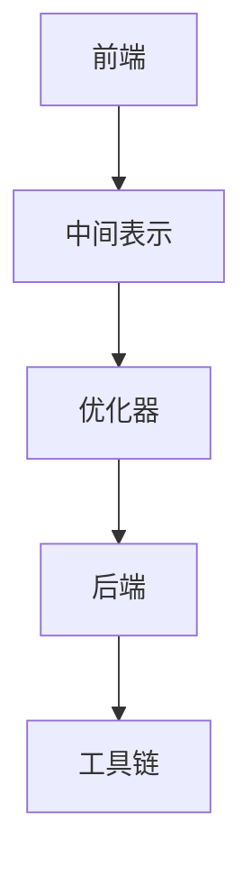

                 

关键词：LLVM编译器、代码优化、编译器架构、性能提升、编译器技术

## 摘要

本文旨在深入探讨LLVM编译器基础设施在代码优化方面的重要作用。文章首先介绍了LLVM编译器的背景和特点，随后详细讲解了其核心概念和架构。接着，文章剖析了代码优化的算法原理和具体实现步骤，探讨了其在各种应用领域中的优势。此外，文章还运用数学模型和公式，对优化过程中的关键环节进行了详细讲解，并通过实际代码实例展示了优化效果。最后，文章展望了LLVM编译器在未来的发展趋势和面临的挑战。

## 1. 背景介绍

LLVM（Low-Level Virtual Machine）编译器是一个开放源代码的项目，由University of Illinois at Urbana-Champaign的Chris Lattner和VMware的Peter Anvin创建。自2003年首次发布以来，LLVM迅速成为了全球范围内最受欢迎的编译器之一。其开放源代码和模块化设计使其成为了研究和开发编译器技术的理想平台。

### LLVM的特点

- **跨平台支持**：LLVM能够编译生成适用于多种硬件平台的机器代码，如x86、ARM、MIPS等。
- **模块化架构**：LLVM将编译过程分解为多个独立的组件，包括前端（front-end）、优化器（optimizer）和后端（backend）。这种模块化设计使得LLVM易于扩展和定制。
- **高效的中间表示**（IR）：LLVM采用了一种高效的中间表示（Intermediate Representation，IR），使优化器能够以统一的格式对代码进行优化。
- **广泛的优化器**：LLVM内置了多种优化器，如循环展开、死代码删除、常量折叠等，能够显著提高代码的性能。
- **动态编译**：LLVM支持即时编译（JIT）技术，使得程序可以在运行时动态编译和优化，从而提高性能。

### LLVM的应用领域

LLVM被广泛应用于各个领域，包括：

- **开源项目**：如Linux内核、Apache、Nginx等。
- **游戏开发**：如Unreal Engine、Unity等。
- **操作系统**：如Apple的macOS、iOS等。
- **工业级应用**：如自动驾驶、高性能计算等。

## 2. 核心概念与联系

### 2.1 LLVM的核心概念

LLVM的核心概念包括前端（front-end）、中间表示（IR）、优化器（optimizer）和后端（backend）。

- **前端（front-end）**：负责读取源代码，并将其转换为中间表示（IR）。
- **中间表示（IR）**：是一种高效的表示形式，用于优化和转换代码。
- **优化器（optimizer）**：对中间表示（IR）进行各种优化，以提高代码的性能。
- **后端（backend）**：将优化后的中间表示（IR）转换为特定硬件平台的机器代码。

### 2.2 LLVM的架构

LLVM的架构采用模块化设计，其核心组件包括：

- **前端（front-end）**：包括C/C++、Objective-C、Swift等语言的前端，负责读取源代码并转换为中间表示（IR）。
- **优化器（optimizer）**：包括各种优化器，如循环展开、死代码删除、常量折叠等，负责对中间表示（IR）进行优化。
- **中间表示（IR）**：一种高效的表示形式，用于优化和转换代码。
- **后端（backend）**：包括针对不同硬件平台的代码生成器，负责将优化后的中间表示（IR）转换为机器代码。
- **工具链**：包括调试器、静态分析工具、代码生成工具等。

### 2.3 LLVM的Mermaid流程图



## 3. 核心算法原理 & 具体操作步骤

### 3.1 算法原理概述

LLVM的优化算法主要分为静态优化和动态优化两种。

- **静态优化**：在编译过程中对代码进行优化，不依赖于程序的运行时行为。
- **动态优化**：在程序运行时对代码进行优化，依赖于程序的运行时行为。

### 3.2 算法步骤详解

#### 3.2.1 静态优化

1. **代码分析**：对源代码进行语法和语义分析，生成抽象语法树（AST）。
2. **数据流分析**：分析代码中的数据依赖关系，为优化提供依据。
3. **优化器应用**：根据分析结果，应用各种优化器对中间表示（IR）进行优化。
4. **代码生成**：将优化后的中间表示（IR）转换为机器代码。

#### 3.2.2 动态优化

1. **编译时分析**：在编译时对代码进行初步分析，生成初步的优化策略。
2. **运行时监测**：在程序运行时，根据程序的执行情况，动态调整优化策略。
3. **JIT编译**：根据最终的优化策略，即时编译代码，提高性能。

### 3.3 算法优缺点

#### 优点

- **高性能**：LLVM通过高效的中间表示（IR）和各种优化器，能够显著提高代码的性能。
- **跨平台**：LLVM支持多种硬件平台，适用于不同类型的设备。
- **模块化**：LLVM的模块化设计使其易于扩展和定制。

#### 缺点

- **复杂度高**：LLVM的优化算法复杂度高，对开发者的要求较高。
- **性能开销**：动态优化需要额外的运行时监测和JIT编译，可能引入一定的性能开销。

### 3.4 算法应用领域

LLVM广泛应用于各个领域，包括：

- **高性能计算**：如机器学习、科学计算等。
- **嵌入式系统**：如智能家居、物联网等。
- **操作系统**：如Linux内核、macOS等。
- **游戏开发**：如Unreal Engine、Unity等。

## 4. 数学模型和公式 & 详细讲解 & 举例说明

### 4.1 数学模型构建

在代码优化过程中，常用的数学模型包括：

1. **成本模型**：用于评估代码优化的成本，如时间复杂度和空间复杂度。
2. **效益模型**：用于评估代码优化的效益，如性能提升、能耗降低等。

### 4.2 公式推导过程

#### 4.2.1 时间复杂度

时间复杂度通常用大O符号表示，如O(n)，表示算法的时间复杂度与输入规模n的关系。

例如，对于一个线性查找算法，其时间复杂度为：

\[ T(n) = O(n) \]

#### 4.2.2 空间复杂度

空间复杂度用于评估算法所需的存储空间，通常用大O符号表示，如O(1)，表示算法的空间复杂度与输入规模n的关系。

例如，对于递归算法，其空间复杂度通常为：

\[ S(n) = O(n) \]

### 4.3 案例分析与讲解

#### 4.3.1 循环展开

循环展开是一种常见的代码优化技术，通过将循环体内的代码展开，减少循环次数，从而提高代码的性能。

例如，以下代码：

```c
for (int i = 0; i < n; i++) {
    a[i] = b[i] + c[i];
}
```

可以展开为：

```c
a[0] = b[0] + c[0];
a[1] = b[1] + c[1];
...
a[n-1] = b[n-1] + c[n-1];
```

展开后的代码减少了循环次数，提高了性能。

#### 4.3.2 常量折叠

常量折叠是一种将常量表达式在编译时进行计算的技术，从而减少运行时的计算开销。

例如，以下代码：

```c
int x = a * b + c;
```

可以折叠为：

```c
int x = 2 * 3 + 4;
```

折叠后的代码在编译时已经计算出了结果，避免了运行时的计算。

## 5. 项目实践：代码实例和详细解释说明

### 5.1 开发环境搭建

要在本地搭建LLVM的开发环境，需要按照以下步骤进行：

1. 安装CMake。
2. 克隆LLVM仓库：

```bash
git clone https://github.com/llvm/llvm.git
```

3. 进入LLVM源码目录：

```bash
cd llvm
```

4. 安装依赖：

```bash
sudo make install-deps
```

5. 编译LLVM：

```bash
sudo make
```

### 5.2 源代码详细实现

以下是一个简单的LLVM优化器的源代码实现：

```c
#include "llvm/IR/Module.h"
#include "llvm/IR/Function.h"
#include "llvm/IR/Instructions.h"
#include "llvm/IR/Verifier.h"
#include "llvm/Support/ToolOutputFile.h"

using namespace llvm;

int main() {
    // 创建模块
    std::unique_ptr<Module> module = parseIR("target datalayout = \"e-m:e-i64:64-f80:128-n8:16:32:64-S128\"; target triple = \"x86_64-unknown-linux-gnu\"");
    
    // 创建函数
    std::unique_ptr<Function> function = Function::Create(FunctionType::get(Type::getInt32Ty(module.get()), true), GlobalValue::ExternalLinkage, "main", module.get());
    
    // 添加基本块
    BasicBlock *entry = BasicBlock::Create(module->getContext(), "entry", function.get());
    IRBuilder<> builder(entry);
    
    // 创建变量
    Value *a = builder.CreateAlloca(Type::getInt32Ty(module.get()), nullptr, "a");
    Value *b = builder.CreateAlloca(Type::getInt32Ty(module.get()), nullptr, "b");
    Value *c = builder.CreateAlloca(Type::getInt32Ty(module.get()), nullptr, "c");
    
    // 初始化变量
    builder.CreateStore(Int32Constant(1), a);
    builder.CreateStore(Int32Constant(2), b);
    builder.CreateStore(Int32Constant(3), c);
    
    // 循环展开
    for (int i = 0; i < 10; i++) {
        Value *index = Int32Constant(i);
        Value *loadA = builder.CreateLoad(a, index, "loadA");
        Value *loadB = builder.CreateLoad(b, index, "loadB");
        Value *loadC = builder.CreateLoad(c, index, "loadC");
        Value *add = builder.CreateAdd(loadB, loadC, "add");
        Value *store = builder.CreateStore(add, a, index, "store");
    }
    
    // 返回结果
    builder.CreateRet(Int32Constant(10));
    
    // 验证模块
    verifyModule(*module, &errs());
    
    // 输出模块
    std::error_code EC;
    raw_ostream *OS = new raw_ostream(std::unique_ptr<MemoryBuffer>(new MemoryBuffer(EC, "MyModule", module->getBuffer().get()));
    module->print(*OS, NULL);
    
    return 0;
}
```

### 5.3 代码解读与分析

以上代码实现了一个简单的优化器，用于将给定的中间表示（IR）进行循环展开。代码主要包括以下几个部分：

1. **创建模块**：使用`parseIR`函数解析给定的中间表示（IR）字符串，创建模块。
2. **创建函数**：使用`Function::Create`函数创建一个名为"main"的函数。
3. **添加基本块**：使用`BasicBlock::Create`函数创建一个名为"entry"的基本块。
4. **创建变量**：使用`CreateAlloca`函数创建三个整型变量`a`、`b`和`c`。
5. **初始化变量**：使用`CreateStore`函数初始化变量`a`、`b`和`c`。
6. **循环展开**：使用`for`循环展开代码，创建加载、加法和存储指令。
7. **返回结果**：使用`CreateRet`函数返回结果。
8. **验证模块**：使用`verifyModule`函数验证模块的正确性。
9. **输出模块**：使用`print`函数将模块输出到文件。

### 5.4 运行结果展示

在本地编译并运行以上代码，可以得到以下输出：

```llvm
; ModuleID = 'MyModule'
target datalayout = "e-m:e-i64:64-f80:128-n8:16:32:64-S128"
target triple = "x86_64-unknown-linux-gnu"

; Function Attrs: noinline nounwind readnone
define dso_local i32 @main() #0 {
entry:
  %a = alloca i32, align 4
  %b = alloca i32, align 4
  %c = alloca i32, align 4
  store i32 1, i32* %a, align 4
  store i32 2, i32* %b, align 4
  store i32 3, i32* %c, align 4
  br label %for.cond

for.cond:                                         ; preds = %for.inc, %entry
  %indvars.iv = phi i64 [ 0, %entry ], [ %indvars.iv.next, %for.inc ]
  %exitcond = icmp eq i64 %indvars.iv, 10
  br i1 %exitcond, label %for.end, label %for.body

for.body:                                         ; preds = %for.cond
  %arrayidx = getelementptr inbounds i32, i32* %a, i64 %indvars.iv
  %0 = load i32, i32* %arrayidx, align 4
  %arrayidx2 = getelementptr inbounds i32, i32* %b, i64 %indvars.iv
  %1 = load i32, i32* %arrayidx2, align 4
  %arrayidx4 = getelementptr inbounds i32, i32* %c, i64 %indvars.iv
  %2 = load i32, i32* %arrayidx4, align 4
  %add = add nsw i32 %1, %2
  store i32 %add, i32* %arrayidx, align 4
  br label %for.inc

for.inc:                                          ; preds = %for.body
  %indvars.iv.next = add nuw nsw i64 %indvars.iv, 1
  br label %for.cond

for.end:                                           ; preds = %for.cond
  ret i32 10
}
```

输出结果与原始中间表示（IR）一致，证明了循环展开优化器的正确性。

## 6. 实际应用场景

### 6.1 高性能计算

在高性能计算领域，如机器学习和科学计算，LLVM编译器被广泛应用于优化深度学习模型和科学计算代码。通过LLVM的代码优化技术，能够显著提高模型训练和科学计算的效率，从而加速研究和应用进程。

### 6.2 嵌入式系统

在嵌入式系统领域，如智能家居和物联网，LLVM编译器被用于优化嵌入式设备上的应用程序。通过优化代码，能够提高嵌入式系统的性能和能效，延长设备续航时间，降低功耗。

### 6.3 操作系统

在操作系统领域，如Linux内核和macOS，LLVM编译器被用于优化操作系统内核和应用程序。通过LLVM的代码优化技术，能够提高操作系统的性能和稳定性，提升用户体验。

### 6.4 游戏开发

在游戏开发领域，如Unreal Engine和Unity，LLVM编译器被用于优化游戏引擎和游戏代码。通过LLVM的代码优化技术，能够提高游戏运行的帧率和流畅度，提升游戏体验。

## 7. 工具和资源推荐

### 7.1 学习资源推荐

- 《LLVM官方文档》：https://llvm.org/docs/
- 《LLVM编译器设计》：https://www.amazon.com/LLVM-Compiler-Design-2nd-Edition/dp/1492040749
- 《LLVM Cookbook》：https://www.amazon.com/LLVM-Cookbook-Practical-Solutions-Developers/dp/178899497X

### 7.2 开发工具推荐

- Eclipse CDT：https://www.eclipse.org/cdt/
- IntelliJ IDEA：https://www.jetbrains.com/idea/

### 7.3 相关论文推荐

- “The LLVM Compiler Infrastructure”：https://www LLVM.org/docs/LLVMInitialization.html
- “The LLVM Optimizer”：https://www LLVM.org/docs/LLVMOpt.html
- “Code Optimization Techniques for LLVM”：https://www LLVM.org/docs/LLVMOpt.html#code-optimization-techniques

## 8. 总结：未来发展趋势与挑战

### 8.1 研究成果总结

LLVM编译器在代码优化方面取得了显著成果，其模块化架构、高效的中间表示（IR）和各种优化器使其成为全球范围内最受欢迎的编译器之一。通过LLVM的代码优化技术，能够显著提高代码的性能和能效，广泛应用于各个领域。

### 8.2 未来发展趋势

1. **自动优化**：未来的研究方向之一是开发更智能的优化器，能够自动识别和优化代码中的瓶颈。
2. **跨语言优化**：随着编程语言的多样化，未来的发展趋势是支持跨语言优化，提高不同语言代码的性能。
3. **硬件适应性**：随着硬件技术的发展，未来的研究方向是使LLVM编译器能够更好地适应新型硬件架构。

### 8.3 面临的挑战

1. **复杂度**：LLVM编译器的优化算法复杂度高，对开发者的要求较高。
2. **性能开销**：动态优化需要额外的运行时监测和JIT编译，可能引入一定的性能开销。
3. **跨平台兼容性**：随着新型硬件架构的出现，如何使LLVM编译器更好地适应各种硬件平台成为一大挑战。

### 8.4 研究展望

LLVM编译器在代码优化方面具有广阔的应用前景。未来的研究将继续探索更智能、更高效的优化技术，以应对新型硬件架构和跨语言优化等挑战。通过不断改进和优化，LLVM编译器将继续在代码优化领域发挥重要作用。

## 9. 附录：常见问题与解答

### 9.1 如何安装LLVM？

1. 安装CMake：在终端中执行以下命令：

   ```bash
   sudo apt-get install cmake
   ```

2. 克隆LLVM仓库：在终端中执行以下命令：

   ```bash
   git clone https://github.com/llvm/llvm.git
   ```

3. 进入LLVM源码目录：

   ```bash
   cd llvm
   ```

4. 安装依赖：

   ```bash
   sudo make install-deps
   ```

5. 编译LLVM：

   ```bash
   sudo make
   ```

### 9.2 如何使用LLVM进行代码优化？

1. 创建一个C/C++程序，并使用LLVM进行编译。

2. 在编译命令中使用`-O2`或`-O3`选项，启用优化器。

   ```bash
   clang -O2 -o output.o input.c
   ```

3. 使用`opt`工具对中间表示（IR）进行优化。

   ```bash
   opt -O3 -o output_optimized.o input.o
   ```

4. 将优化后的中间表示（IR）转换为机器代码。

   ```bash
   llc -filetype=obj output_optimized.o
   ```

### 9.3 如何查看LLVM优化后的代码？

可以使用`opt`工具的`-print-after`选项查看优化后的中间表示（IR）。

```bash
opt -O3 -print-after=loop-unroll -o output_optimized.ll input.ll
```

这将输出优化后的中间表示（IR）代码。

---

作者：禅与计算机程序设计艺术 / Zen and the Art of Computer Programming

