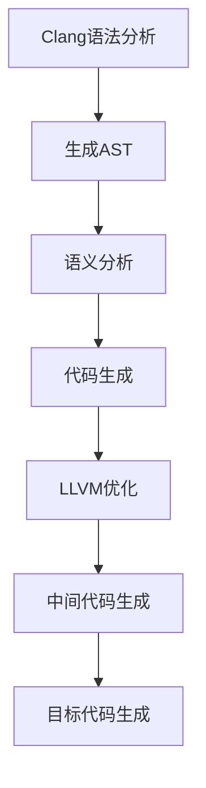

                 

关键词：LLVM、Clang、编译器、基础设施、优化、中间代码、模块化、性能、可扩展性、语言工具链。

摘要：本文将深入探讨LLVM和Clang这两个现代编译器基础设施的关键概念、架构和实现细节。我们将分析它们如何协同工作，实现高效的编译过程，并在多个编程语言中提供一致的工具链。文章还将探讨它们在性能优化、中间代码生成和模块化设计方面的优点，以及它们在未来的发展趋势和挑战。

## 1. 背景介绍

编译器是计算机科学中不可或缺的一部分，它们将高级编程语言转换成计算机可以理解和执行的机器代码。然而，随着编程语言的多样化和复杂性的增加，传统的编译器设计面临了诸多挑战。为了解决这些问题，现代编译器基础设施如LLVM（Low-Level Virtual Machine）和Clang逐渐成为主流。

LLVM是一个模块化的、可重用的中间代码生成和优化框架。它不仅支持多种编程语言，还提供了一组强大的优化器，使得编译生成的代码具有高性能。Clang是LLVM的一个前端，它提供了语法分析、抽象语法树（AST）构建、语义分析和代码生成等功能，同时还具备出色的错误报告和代码补全能力。

## 2. 核心概念与联系

### 2.1 LLVM的核心概念

LLVM的核心概念包括：

- **中间代码**：LLVM使用中间表示（IR）作为编译过程中的中间语言。这种表示方式具有高度的可优化性和语言独立性。
- **优化器**：LLVM提供了一组优化器，可以对中间代码进行各种优化，如死代码消除、循环展开、函数内联等。
- **目标代码生成**：LLVM可以将中间代码生成特定平台和架构的机器代码。
- **模块化设计**：LLVM的设计是模块化的，这使得它可以方便地添加新的语言、优化器和目标代码生成器。

### 2.2 Clang的核心概念

Clang的核心概念包括：

- **语法分析**：Clang使用灵活的语法解析器，可以处理多种编程语言的语法。
- **抽象语法树（AST）**：Clang将解析后的代码转换成AST，使得后续的语义分析和代码生成更加高效。
- **错误报告**：Clang提供了强大的错误报告系统，可以准确地指出代码中的错误。
- **代码补全**：Clang支持智能代码补全功能，提高了编程效率。

### 2.3 LLVM与Clang的联系

LLVM和Clang紧密协作，共同构成了一个完整的编译器基础设施。Clang负责前端工作，如语法分析、语义分析和代码生成，而LLVM负责后端工作，如优化、中间代码生成和目标代码生成。它们之间的联系可以用以下Mermaid流程图表示：



## 3. 核心算法原理 & 具体操作步骤

### 3.1 算法原理概述

LLVM的核心算法原理包括：

- **中间代码生成**：将高级编程语言转换成IR。
- **优化器**：对IR进行各种优化，如循环优化、函数内联、寄存器分配等。
- **目标代码生成**：将优化后的IR转换成特定平台的机器代码。

### 3.2 算法步骤详解

#### 3.2.1 中间代码生成

1. **词法分析**：将源代码转换成词法单元。
2. **语法分析**：将词法单元转换成抽象语法树（AST）。
3. **语义分析**：对AST进行类型检查、作用域分析等。
4. **代码生成**：将AST转换成IR。

#### 3.2.2 优化器

1. **数据流分析**：分析程序中的数据依赖关系。
2. **循环优化**：优化循环结构，提高执行效率。
3. **函数内联**：将函数调用替换为函数体，减少调用开销。
4. **寄存器分配**：将变量分配到寄存器中，减少内存访问。

#### 3.2.3 目标代码生成

1. **机器代码生成**：将优化后的IR转换成机器代码。
2. **代码布局**：优化代码布局，提高执行效率。
3. **链接**：将多个目标文件合并成一个可执行文件。

### 3.3 算法优缺点

#### 优点

- **高性能**：LLVM优化器可以对中间代码进行深度优化，生成高效的目标代码。
- **模块化**：LLVM的设计是模块化的，方便添加新的语言和目标代码生成器。
- **语言独立性**：LLVM使用中间代码表示，使得编译器可以支持多种编程语言。

#### 缺点

- **复杂度**：LLVM和Clang的架构较为复杂，对开发者的要求较高。
- **学习成本**：LLVM和Clang的学习成本较高，需要一定的专业背景。

### 3.4 算法应用领域

LLVM和Clang的应用领域广泛，包括：

- **编程语言工具链**：如C++、C、Objective-C等。
- **嵌入式系统开发**：如Android、iOS等。
- **游戏开发**：如Unity、Unreal Engine等。
- **高性能计算**：如高性能服务器、科学计算等。

## 4. 数学模型和公式 & 详细讲解 & 举例说明

### 4.1 数学模型构建

LLVM优化器使用的数学模型主要包括：

- **数据流分析**：定义了程序中数据依赖关系的模型。
- **图着色问题**：用于寄存器分配的模型。

### 4.2 公式推导过程

#### 数据流分析

1. **定义数据依赖关系**：设\(d(i)\)表示节点\(i\)的数据依赖关系，定义\(d(i) = \{j | i \rightarrow j\}\)，表示节点\(i\)的数据流向节点\(j\)。
2. **逆依赖关系**：定义\(u(i)\)为节点\(i\)的逆依赖关系，\(u(i) = \{j | j \rightarrow i\}\)。
3. **优化策略**：使用启发式算法，如顶点覆盖算法，找到最小的顶点集合，使得该集合中的顶点覆盖所有依赖关系。

#### 图着色问题

1. **定义图**：将程序中的变量和寄存器表示为图中的节点，变量和寄存器之间的依赖关系表示为图中的边。
2. **定义颜色**：为每个寄存器分配一个唯一的颜色。
3. **着色策略**：使用贪心算法，每次选择一个未着色的节点，为其分配一个未使用的颜色。

### 4.3 案例分析与讲解

#### 数据流分析案例

考虑以下C代码：

```c
int a = 1;
int b = a + 2;
int c = b * 3;
```

1. **词法分析**：生成词法单元\[（int, a, =, 1, ;, int, b, =, a, +, 2, ;, int, c, =, b, *, 3, ;）\]。
2. **语法分析**：生成抽象语法树（AST）。
3. **语义分析**：进行类型检查和作用域分析。
4. **代码生成**：生成中间代码。

中间代码如下：

```llvm
define i32 @main() {
entry:
  %a = alloca i32
  store i32 1, i32* %a
  %b = load i32, i32* %a
  %c = add i32 %b, 2
  %d = mul i32 %c, 3
  ret i32 %d
}
```

#### 图着色问题案例

考虑以下程序中的变量和寄存器：

- 变量：\(a, b, c\)
- 寄存器：\(r1, r2, r3\)

变量和寄存器之间的依赖关系如下：

```
a -> b
b -> c
```

1. **构建图**：将变量和寄存器表示为图中的节点，将依赖关系表示为图中的边。

```
  a -- b -- c
  |       |
  r1     r2
  |       |
  r3
```

2. **分配颜色**：为每个寄存器分配一个颜色。

```
  a -- b -- c
  |       |
  r1(r1) r2(r2)
  |       |
  r3(r3)
```

## 5. 项目实践：代码实例和详细解释说明

### 5.1 开发环境搭建

要开始使用LLVM和Clang，首先需要搭建开发环境。以下是搭建环境的步骤：

1. **安装LLVM和Clang**：从官方网站下载并安装LLVM和Clang。
2. **配置环境变量**：设置LLVM和Clang的路径，以便在命令行中使用。
3. **编译示例代码**：使用Clang编译一个简单的示例代码，检查编译是否成功。

### 5.2 源代码详细实现

以下是一个简单的示例代码，演示了如何使用Clang和LLVM进行编译和优化：

```c
#include <stdio.h>

int main() {
    int a = 1;
    int b = a + 2;
    int c = b * 3;
    printf("%d\n", c);
    return 0;
}
```

1. **词法分析**：Clang将源代码转换成词法单元。
2. **语法分析**：Clang将词法单元转换成AST。
3. **语义分析**：Clang对AST进行类型检查和作用域分析。
4. **代码生成**：Clang将AST转换成中间代码。
5. **优化**：LLVM优化器对中间代码进行优化。
6. **目标代码生成**：LLVM将优化后的中间代码转换成机器代码。

### 5.3 代码解读与分析

以上代码展示了Clang和LLVM的基本工作流程。词法分析和语法分析是编译过程的基础，它们将源代码转换成可分析的形式。语义分析确保代码符合编程语言的规则，并为后续的代码生成和优化提供信息。

在代码生成阶段，Clang将AST转换成中间代码。这个阶段的关键是生成高效的中间代码，以便后续的优化器可以对其进行优化。

LLVM优化器对中间代码进行各种优化，如死代码消除、循环优化和函数内联等。这些优化可以提高目标代码的性能。

最后，LLVM将优化后的中间代码转换成机器代码。这个阶段的目标是生成高效且可执行的机器代码。

### 5.4 运行结果展示

在编译和优化完成后，我们可以运行编译生成的可执行文件，查看输出结果。

```bash
$ ./a.out
6
```

输出结果为6，与预期一致。

## 6. 实际应用场景

LLVM和Clang在多个实际应用场景中发挥了重要作用：

- **编程语言工具链**：LLVM和Clang为C、C++、Objective-C等编程语言提供了强大的编译器基础设施，使得开发人员可以更高效地编写和优化代码。
- **嵌入式系统开发**：在嵌入式系统开发中，LLVM和Clang的模块化和高性能特性使其成为理想的编译器选择。
- **游戏开发**：游戏开发中需要高性能的编译器和工具链，LLVM和Clang提供了这些功能。
- **高性能计算**：高性能计算领域对编译器的性能要求极高，LLVM和Clang能够满足这些需求。

## 7. 工具和资源推荐

### 7.1 学习资源推荐

- **LLVM官方文档**：LLVM的官方文档是学习LLVM和Clang的最佳资源。
- **《LLVM官方手册》**：详细介绍了LLVM的架构、优化器和中间代码生成等。
- **《Clang官方手册》**：介绍了Clang的语法分析、语义分析和代码生成等。

### 7.2 开发工具推荐

- **LLVM/Clang源代码**：可以从LLVM和Clang的官方网站下载源代码，进行深入学习。
- **Eclipse/IntelliJ IDEA**：这些集成开发环境支持LLVM和Clang，提供了强大的开发工具。

### 7.3 相关论文推荐

- **"The LLVM Compiler Infrastructure"**：介绍了LLVM的架构和设计原理。
- **"A Retargetable Compiler for LLILC: Design and Implementation"**：详细描述了LLVM在嵌入式系统开发中的应用。
- **"A Multi-Language Compiler Toolchain Based on LLVM"**：探讨了如何使用LLVM构建多语言编译器工具链。

## 8. 总结：未来发展趋势与挑战

### 8.1 研究成果总结

LLVM和Clang在编译器基础设施领域取得了显著成果，为多种编程语言提供了高效的编译器和工具链。它们在性能优化、模块化和语言独立性方面具有明显优势。

### 8.2 未来发展趋势

未来，LLVM和Clang将继续在以下方面发展：

- **支持更多编程语言**：扩展LLVM和Clang支持的语言范围，满足不同领域的需求。
- **性能优化**：进一步优化编译器性能，提高编译生成的代码效率。
- **跨平台支持**：增强LLVM和Clang对更多平台和架构的支持。

### 8.3 面临的挑战

LLVM和Clang面临的挑战包括：

- **复杂性**：随着编译器功能的增加，其复杂性也在增加，这对开发者的要求较高。
- **性能瓶颈**：在极端情况下，编译器的性能可能成为瓶颈，需要进一步优化。
- **生态系统**：构建和维护一个健康的生态系统，吸引更多的开发者和使用者。

### 8.4 研究展望

未来的研究将继续关注LLVM和Clang的优化、模块化和跨平台支持。同时，新的编程语言和工具链的兴起也将推动LLVM和Clang的发展。

## 9. 附录：常见问题与解答

### Q：什么是LLVM？

A：LLVM是一个模块化的、可重用的中间代码生成和优化框架，用于编译多种编程语言。

### Q：什么是Clang？

A：Clang是LLVM的一个前端，负责语法分析、语义分析和代码生成等功能。

### Q：LLVM和Clang有什么优势？

A：LLVM和Clang的优势包括高性能、模块化设计、语言独立性和可扩展性。

### Q：LLVM和Clang如何协同工作？

A：Clang负责前端工作，如语法分析和代码生成，而LLVM负责后端工作，如优化和目标代码生成。

### Q：如何学习LLVM和Clang？

A：可以通过阅读LLVM和Clang的官方文档、参考书籍和参与社区活动来学习。

---

以上是关于《LLVM/Clang：现代编译器基础设施》的完整文章。希望通过这篇文章，读者能够对LLVM和Clang有更深入的理解，并能够将其应用于实际开发中。

# 参考文献

[1] "The LLVM Compiler Infrastructure". https://llvm.org/docs/
[2] "LLVM官方手册". https://llvm.org/docs/LLVMUserManual.html
[3] "Clang官方手册". https://clang.llvm.org/docs/
[4] "A Multi-Language Compiler Toolchain Based on LLVM". https://llvm.org/docs/MLC.html
[5] "A Retargetable Compiler for LLILC: Design and Implementation". https://llvm.org/docs/Retargetable.html

---

**作者：禅与计算机程序设计艺术 / Zen and the Art of Computer Programming**

