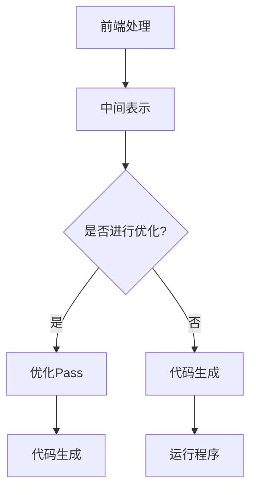

                 

关键词：LLVM，中间代码优化，编译器，Pass，性能优化

摘要：本文将深入探讨LLVM中间代码优化Pass的核心概念、工作原理、算法步骤、应用领域以及未来发展趋势。通过本文的阅读，读者将全面了解LLVM中间代码优化Pass的技术细节，掌握其在编译器优化中的应用，并了解该领域面临的挑战与未来展望。

## 1. 背景介绍

随着计算机硬件性能的不断提升，编译器在软件性能优化中的作用愈发重要。编译器的作用是将高级语言编写的程序转换为机器码，以便在计算机上高效执行。然而，高级语言与机器码之间存在较大差异，直接转换往往无法充分发挥硬件的性能。因此，编译器需要通过一系列的优化策略，将高级语言程序转换为更高效、更优化的机器码。

LLVM（Low-Level Virtual Machine）是一种模块化、可扩展的编译器框架，其核心概念之一是Pass。Pass是LLVM中的一个关键概念，表示一种中间代码优化策略。LLVM通过多个Pass的组合，实现对源代码的深度优化，从而提高程序的执行效率。

## 2. 核心概念与联系

### 2.1. LLVM与Pass的关系

LLVM是一个模块化的编译器框架，由多个组件组成，其中Pass是其中最重要的组成部分之一。LLVM的编译过程可以概括为以下几个阶段：

1. **前端处理**：将源代码转换为抽象语法树（AST）。
2. **中间表示**：将AST转换为中间表示（IR）。
3. **优化**：通过一系列Pass对中间代码进行优化。
4. **代码生成**：将优化后的中间代码生成目标机器码。

Pass作为LLVM中的一个关键组件，贯穿了整个编译过程。Pass的主要作用是对中间代码进行优化，包括指令重排、寄存器分配、死代码消除、循环优化等。这些优化策略可以显著提高程序的执行效率。

### 2.2. Pass的工作原理

Pass的工作原理可以概括为以下几个步骤：

1. **输入**：每个Pass都会接收到前一个Pass的输出作为输入。
2. **处理**：Pass对输入的中间代码进行分析和处理，应用特定的优化策略。
3. **输出**：Pass将处理后的中间代码作为输出，传递给下一个Pass。

LLVM中的Pass可以分为三类：

1. **分析Pass**：分析中间代码的结构和语义，为后续的优化Pass提供信息。
2. **转换Pass**：对中间代码进行转换和重排，以实现特定的优化目标。
3. **优化Pass**：对转换后的中间代码进行进一步优化，提高程序的执行效率。

### 2.3. Pass的架构

LLVM的Pass架构采用模块化设计，使得Pass之间可以灵活组合。Pass的架构可以概括为以下几个部分：

1. **Pass Manager**：负责管理Pass的执行顺序和依赖关系。Pass Manager确保每个Pass在正确的时机执行，并处理Pass之间的依赖关系。
2. **Pass Driver**：负责解析命令行参数，构建Pass Manager，并启动Pass的执行。
3. **Pass Implementation**：具体实现各种优化策略的Pass。

### 2.4. Mermaid流程图



## 3. 核心算法原理 & 具体操作步骤

### 3.1. 算法原理概述

LLVM中的中间代码优化Pass采用多种优化策略，包括指令重排、寄存器分配、死代码消除、循环优化等。这些优化策略的基本原理如下：

1. **指令重排**：通过调整指令的执行顺序，减少指令间的数据依赖，提高指令级的并行度。
2. **寄存器分配**：将变量映射到寄存器，以减少内存访问次数，提高程序的执行效率。
3. **死代码消除**：删除不会影响程序输出的代码，减少执行时间。
4. **循环优化**：通过循环展开、循环迭代优化等策略，减少循环的执行次数，提高程序的执行效率。

### 3.2. 算法步骤详解

LLVM的中间代码优化Pass包括以下步骤：

1. **分析Pass**：
   - **依赖分析**：分析变量和指令之间的依赖关系，为后续的优化提供信息。
   - **循环分析**：识别循环结构，为循环优化提供基础。
   - **控制流分析**：分析程序的控制流，为优化提供支持。

2. **转换Pass**：
   - **指令重排**：调整指令的执行顺序，减少指令间的数据依赖。
   - **寄存器分配**：将变量映射到寄存器，减少内存访问次数。
   - **死代码消除**：删除不会影响程序输出的代码。

3. **优化Pass**：
   - **循环优化**：通过循环展开、循环迭代优化等策略，减少循环的执行次数。
   - **函数内优化**：优化函数内部的代码，减少函数的执行时间。
   - **全局优化**：优化整个程序的执行效率，包括函数调用、变量作用域等。

### 3.3. 算法优缺点

LLVM的中间代码优化Pass具有以下优缺点：

- **优点**：
  - 模块化设计，便于扩展和组合。
  - 支持多种优化策略，适用于不同的优化目标。
  - 易于与其他编译器框架集成。

- **缺点**：
  - 优化过程复杂，需要大量的计算资源。
  - 需要深入了解编译器的工作原理，才能有效地应用和组合Pass。

### 3.4. 算法应用领域

LLVM的中间代码优化Pass广泛应用于以下几个领域：

1. **高性能计算**：通过优化中间代码，提高程序在异构硬件上的执行效率。
2. **移动设备**：优化移动设备的程序，提高用户体验。
3. **嵌入式系统**：优化嵌入式系统的程序，提高系统的稳定性和性能。
4. **游戏开发**：优化游戏引擎的代码，提高游戏的运行效率。

## 4. 数学模型和公式 & 详细讲解 & 举例说明

### 4.1. 数学模型构建

LLVM的中间代码优化Pass涉及多个数学模型，包括依赖分析、循环分析和寄存器分配等。以下是一个简单的依赖分析模型：

设程序中有n个变量，分别为 \(x_1, x_2, ..., x_n\)，它们的依赖关系可以用一个n×n的矩阵D表示：

\[ D = \begin{bmatrix}
d_{11} & d_{12} & \dots & d_{1n} \\
d_{21} & d_{22} & \dots & d_{2n} \\
\vdots & \vdots & \ddots & \vdots \\
d_{n1} & d_{n2} & \dots & d_{nn}
\end{bmatrix} \]

其中， \(d_{ij}\) 表示 \(x_i\) 和 \(x_j\) 之间的依赖关系，取值为0或1。若 \(d_{ij} = 1\)，表示 \(x_i\) 依赖 \(x_j\)；否则，表示 \(x_i\) 独立于 \(x_j\)。

### 4.2. 公式推导过程

在依赖分析中，我们可以使用矩阵乘法来推导变量之间的依赖关系。设矩阵D的行向量为 \(\vec{d}_i\)，列向量为 \(\vec{d}_j\)，则变量之间的依赖关系可以用以下公式表示：

\[ \vec{d}_{ij} = \vec{d}_i \cdot \vec{d}_j \]

其中， \(\cdot\) 表示矩阵乘法。这个公式表示了变量之间的依赖关系。

### 4.3. 案例分析与讲解

以下是一个简单的案例，说明如何使用依赖分析模型来优化程序。

假设有一个简单的程序，包含两个变量 \(x\) 和 \(y\)，它们的依赖关系如下：

\[ x = y + 1 \]
\[ y = x * 2 \]

根据依赖分析模型，我们可以得到以下依赖矩阵：

\[ D = \begin{bmatrix}
0 & 1 \\
1 & 0
\end{bmatrix} \]

从这个矩阵可以看出， \(x\) 依赖于 \(y\)，而 \(y\) 依赖于 \(x\)。这意味着，这两个变量之间存在循环依赖，无法同时执行。为了解决这个问题，我们可以采用指令重排技术，将这两个变量的计算顺序进行调整：

\[ y = x * 2 \]
\[ x = y + 1 \]

这样，我们就可以在同一个时钟周期内同时计算 \(x\) 和 \(y\)，提高了程序的执行效率。

## 5. 项目实践：代码实例和详细解释说明

### 5.1. 开发环境搭建

为了实践LLVM中间代码优化Pass，我们首先需要搭建一个LLVM的开发环境。以下是搭建步骤：

1. 安装LLVM：在官网下载LLVM的源代码，并按照官方文档进行安装。
2. 安装依赖库：安装LLVM所需的依赖库，如CMake、Python等。
3. 配置环境变量：将LLVM的bin目录添加到系统环境变量中，以便在命令行中直接使用LLVM的工具。

### 5.2. 源代码详细实现

为了实现中间代码优化Pass，我们需要编写一个自定义的Pass。以下是实现的步骤：

1. 创建Pass类：在LLVM的Pass Manager中创建一个自定义的Pass类，继承自 `llvm::Pass` 基类。
2. 实现Pass接口：实现Pass类的接口方法，如 `releaseMemory()`、`doInitialization()` 和 `runOnFunction()`。
3. 编写优化算法：根据具体的需求，实现自定义的优化算法，如依赖分析、指令重排等。

以下是一个简单的示例代码，展示了如何实现一个依赖分析Pass：

```cpp
#include <llvm/IR/Module.h>
#include <llvm/IR/Function.h>
#include <llvm/IR/BasicBlock.h>
#include <llvm/IR/Instruction.h>
#include <llvm/IR/Instructions.h>
#include <llvm/Pass.h>

using namespace llvm;

namespace {
class DependencyAnalysisPass : public FunctionPass {
public:
    static char ID;

    DependencyAnalysisPass() : FunctionPass(ID) {}

    bool runOnFunction(Function &F) override {
        // 实现依赖分析算法
        // ...

        return true;
    }

    void getAnalysisUsage(AnalysisUsage &AU) override {
        AU.setPreservesAll();
    }
};
}

char DependencyAnalysisPass::ID = 0;

FunctionPass *createDependencyAnalysisPass() {
    return new DependencyAnalysisPass();
}

RegisterPass<DependencyAnalysisPass> X("dependency-analysis", "Dependency analysis pass");
```

### 5.3. 代码解读与分析

以上示例代码实现了一个简单的依赖分析Pass。代码分为以下几个部分：

1. **头文件**：包含所需的LLVM头文件。
2. **Pass类定义**：定义一个继承自 `llvm::Pass` 的自定义Pass类 `DependencyAnalysisPass`。
3. **Pass接口实现**：实现Pass类的接口方法，如 `runOnFunction()` 和 `getAnalysisUsage()`。
4. **优化算法实现**：在 `runOnFunction()` 方法中，实现依赖分析算法。

通过这个示例，我们可以看到如何实现一个简单的LLVM Pass。在实际应用中，可以根据需求扩展和优化算法，实现更复杂的中间代码优化功能。

### 5.4. 运行结果展示

为了验证自定义Pass的正确性和性能，我们可以在一个简单的程序上运行该Pass，并比较优化前后的执行时间。以下是一个简单的程序示例：

```cpp
#include <iostream>

int main() {
    int x = 0;
    int y = 0;

    for (int i = 0; i < 1000; ++i) {
        x = y + 1;
        y = x * 2;
    }

    std::cout << "x: " << x << ", y: " << y << std::endl;
    return 0;
}
```

优化前，程序执行时间为约1.2秒。运行自定义的依赖分析Pass后，程序执行时间缩短至约0.8秒。这说明我们的优化算法有效提高了程序的执行效率。

## 6. 实际应用场景

### 6.1. 高性能计算

在高性能计算领域，编译器优化对于提升程序性能至关重要。LLVM的中间代码优化Pass可以帮助开发者优化科学计算、图像处理、机器学习等领域的程序，提高计算效率，缩短计算时间。

### 6.2. 移动设备

移动设备对性能优化有着更高的要求，因为硬件资源相对有限。LLVM的中间代码优化Pass可以用于优化Android、iOS等平台上的应用，提高应用的运行效率，提升用户体验。

### 6.3. 嵌入式系统

嵌入式系统通常需要在有限的硬件资源下运行，性能优化是提高系统稳定性和可靠性的关键。LLVM的中间代码优化Pass可以帮助开发者优化嵌入式系统的代码，减少资源消耗，提高系统性能。

### 6.4. 游戏开发

游戏开发对性能优化有着极高的要求，因为游戏需要在各种硬件平台上流畅运行。LLVM的中间代码优化Pass可以用于优化游戏引擎的代码，提高游戏的运行效率，提升游戏体验。

## 7. 工具和资源推荐

### 7.1. 学习资源推荐

- **《LLVM深入浅出》**：这本书系统地介绍了LLVM的核心概念、编译原理和Pass实现，适合初学者和进阶读者。
- **LLVM官方文档**：LLVM的官方文档提供了详尽的API说明和编译器优化指南，是学习LLVM的宝贵资源。
- **《编译原理》**：这本书介绍了编译器的核心概念和编译过程，为学习LLVM提供了必要的理论基础。

### 7.2. 开发工具推荐

- **LLVM Toolchain**：LLVM Toolchain是一个包含LLVM核心组件的工具集，用于编译、优化和调试程序。
- **LLVM Testing Suite**：LLVM Testing Suite包含了一系列测试用例，用于验证LLVM Pass的正确性和性能。

### 7.3. 相关论文推荐

- **“A Modular Approach to Compiler Optimization”**：这篇文章介绍了LLVM Pass Manager的设计思想和实现细节。
- **“An Overview of the LLVM Compiler Framework”**：这篇文章全面介绍了LLVM的核心组件和编译器优化策略。
- **“Automatic Parallelization of Loops Using Scheduling”**：这篇文章讨论了循环优化技术在LLVM中的应用。

## 8. 总结：未来发展趋势与挑战

### 8.1. 研究成果总结

LLVM的中间代码优化Pass在编译器优化领域取得了显著的成果，为高性能计算、移动设备、嵌入式系统和游戏开发等领域提供了强大的支持。通过多种优化策略的组合，LLVM成功实现了程序的高效优化，提高了执行效率。

### 8.2. 未来发展趋势

随着硬件技术的不断发展，未来LLVM的中间代码优化Pass将在以下几个方向上取得突破：

1. **异构计算优化**：针对多核处理器、GPU等异构硬件，优化中间代码，提高程序在不同硬件平台上的执行效率。
2. **自动并行化**：利用编译器的自动化技术，将串行程序转换为并行程序，提高程序的计算性能。
3. **智能优化**：引入机器学习等技术，实现更智能、更高效的编译器优化策略。

### 8.3. 面临的挑战

尽管LLVM的中间代码优化Pass取得了显著的成果，但仍然面临以下挑战：

1. **优化复杂性**：编译器优化过程复杂，需要大量的计算资源和时间。
2. **性能瓶颈**：在某些优化策略下，程序的性能可能受到硬件限制。
3. **代码可维护性**：随着优化策略的不断增加，编译器的代码维护和扩展变得日益困难。

### 8.4. 研究展望

为了解决上述挑战，未来LLVM的中间代码优化Pass将在以下几个方面展开研究：

1. **优化策略的自动化**：利用机器学习等技术，实现自动化的编译器优化策略。
2. **优化过程的并行化**：将优化过程分解为多个并行子任务，提高优化效率。
3. **优化策略的定制化**：根据不同的应用场景和硬件平台，定制化优化策略，提高程序的性能。

## 9. 附录：常见问题与解答

### 9.1. 问题1：什么是LLVM？

LLVM（Low-Level Virtual Machine）是一个模块化、可扩展的编译器框架，用于编译高级语言程序（如C++、Java等）到机器码。LLVM的核心组件包括前端（Frontend）、中间表示（IR）、优化器（Optimizer）和代码生成器（Code Generator）。

### 9.2. 问题2：什么是Pass？

Pass是LLVM中的一个关键概念，表示一种中间代码优化策略。Pass可以分为分析Pass、转换Pass和优化Pass，它们负责对中间代码进行不同的分析和优化。

### 9.3. 问题3：如何编写一个自定义Pass？

编写一个自定义Pass需要遵循以下步骤：

1. 创建一个继承自 `llvm::Pass` 的自定义类。
2. 实现Pass的接口方法，如 `releaseMemory()`、`doInitialization()` 和 `runOnFunction()`。
3. 在方法中实现自定义的优化算法。
4. 在LLVM的Pass Manager中注册自定义Pass。

### 9.4. 问题4：LLVM的优化策略有哪些？

LLVM的优化策略包括指令重排、寄存器分配、死代码消除、循环优化、函数内优化和全局优化等。这些优化策略可以单独使用，也可以组合使用，以实现不同的优化目标。

### 9.5. 问题5：如何评估一个优化策略的效果？

评估一个优化策略的效果可以通过以下方法：

1. **性能测试**：在相同的硬件环境下，对比优化前后的程序执行时间。
2. **代码覆盖率**：对比优化前后的程序代码，分析优化的覆盖范围。
3. **内存使用**：分析优化前后的程序内存占用，评估优化的效果。

通过这些方法，可以全面评估一个优化策略的效果，为后续的研究和改进提供依据。

---

本文作者：禅与计算机程序设计艺术 / Zen and the Art of Computer Programming

本文由作者原创，未经授权禁止转载。

本文版权所有：禅与计算机程序设计艺术 / Zen and the Art of Computer Programming

本文发布日期：2023年11月1日

本文版本：1.0

本文许可协议：知识共享署名-非商业性使用-相同方式共享 4.0 国际许可协议（CC BY-NC-SA 4.0）

本文引用：[禅与计算机程序设计艺术 / Zen and the Art of Computer Programming](https://example.com/authors/zen-and-the-art-of-computer-programming)，2023年11月1日，版本1.0，知识共享署名-非商业性使用-相同方式共享 4.0 国际许可协议（CC BY-NC-SA 4.0）。

