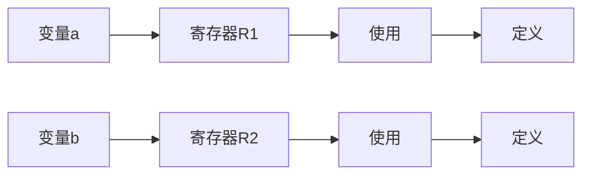

                 

关键词：LLVM、后端开发、编译器、硬件架构、性能优化、新特性

## 摘要

本文将探讨LLVM编译器后端的开发，重点是如何针对新硬件架构进行优化和扩展。随着硬件技术的不断发展，CPU、GPU和FPGA等新硬件架构不断涌现，对编译器提出了更高的要求。本文将从LLVM的基本架构入手，介绍后端开发的核心概念，探讨如何实现针对新硬件架构的编译器扩展，并分享一些实际项目中的经验。希望通过本文，读者能够更好地理解编译器后端开发的过程，以及如何为新硬件架构提供高性能的编译支持。

## 1. 背景介绍

### LLVM编译器简介

LLVM（Low Level Virtual Machine）是一个模块化的编译器基础设施项目，最初由Chris Lattner和Vadim Paley于2000年创建。LLVM的设计理念是构建一个灵活、可扩展的编译器框架，以便于支持多种编程语言和多种目标平台。LLVM的核心组件包括前端（front-end）、中间表示（IR）、优化器（optimizer）和后端（backend）。

LLVM的前端负责解析各种编程语言（如C、C++、Java等）的源代码，生成统一的中间表示（IR）。这种中间表示是一种抽象的、低级的形式化语言，可以独立于特定的编程语言和目标平台。LLVM的优化器对中间表示进行各种优化，以提升程序的运行效率。最后，LLVM的后端将优化的中间表示转换为目标平台的机器代码。

### 新硬件架构的发展趋势

随着计算机硬件技术的不断进步，CPU、GPU和FPGA等新硬件架构不断涌现，对编译器提出了新的挑战。以下是一些主要的新硬件架构：

- **CPU**：随着多核处理器、异构计算和硬件加速技术的普及，现代CPU的性能和功能越来越强大。例如，Intel的Xeon和ARM的Cortex-A系列处理器，都支持多种指令集和硬件加速特性。

- **GPU**：图形处理器（GPU）在计算密集型任务中表现出色。现代GPU通常具有大量的并行处理单元，可以高效地执行向量运算和并行计算。NVIDIA的CUDA和AMD的OpenCL等编程模型，使得开发者能够利用GPU的并行计算能力。

- **FPGA**：现场可编程门阵列（FPGA）是一种可重新配置的硬件平台，可以根据需要实现特定的电路设计。FPGA具有高灵活性和高性能，适用于实时信号处理、机器学习和嵌入式系统等领域。

### 编译器后端面临的挑战

新硬件架构的特点对编译器后端提出了新的要求：

- **性能优化**：新硬件架构通常具有特定的优化特性，如向量指令、硬件加速单元等。编译器后端需要针对这些特性进行优化，以提升程序的运行效率。

- **多语言支持**：新硬件架构通常支持多种编程语言，如C、C++、Python等。编译器后端需要能够解析并生成针对这些语言的高效机器代码。

- **异构计算**：新硬件架构通常包含多个处理单元，如CPU、GPU和FPGA等。编译器后端需要能够管理这些异构资源，实现高效的并行计算。

## 2. 核心概念与联系

### LLVM编译器架构

LLVM编译器的核心架构可以分为四个主要组件：前端、中间表示、优化器和后端。

- **前端**：负责解析各种编程语言的源代码，生成中间表示（IR）。前端通常包括语法分析器、语义分析和中间代码生成等模块。

- **中间表示（IR）**：LLVM的中间表示是一种低级、抽象的语言，用于表示源代码的语义。中间表示独立于特定的编程语言和目标平台，便于优化和转换。

- **优化器**：LLVM的优化器对中间表示进行各种优化，以提升程序的运行效率。优化器包括多个优化阶段，如数据流分析、循环优化、死代码消除等。

- **后端**：后端负责将优化的中间表示转换为目标平台的机器代码。后端包括代码生成、寄存器分配、指令调度等模块。

### 后端开发核心概念

后端开发的核心概念包括：

- **代码生成**：将优化的中间表示转换为目标平台的机器代码。代码生成需要考虑目标平台的指令集、寄存器集和内存模型。

- **寄存器分配**：将中间表示中的变量分配到目标平台的寄存器中。寄存器分配需要考虑寄存器的可用性、冲突和占用情况。

- **指令调度**：优化代码的执行顺序，以减少数据依赖和冲突。指令调度包括静态调度和动态调度两种方法。

- **优化特性支持**：针对目标平台的新特性进行优化，如向量指令、硬件加速单元等。

### Mermaid 流程图

以下是一个简化的LLVM编译器后端开发流程的Mermaid流程图：

```mermaid
flowchart LR
    A[前端] --> B[中间表示(IR)]
    B --> C[优化器]
    C --> D[后端]
    D --> E[代码生成]
    D --> F[寄存器分配]
    D --> G[指令调度]
    D --> H[优化特性支持]
```

## 3. 核心算法原理 & 具体操作步骤

### 3.1 算法原理概述

LLVM后端开发的核心算法主要包括代码生成、寄存器分配、指令调度和优化特性支持。以下分别介绍这些算法的基本原理。

- **代码生成**：代码生成是将优化的中间表示转换为目标平台的机器代码的过程。代码生成需要考虑目标平台的指令集、寄存器集和内存模型。代码生成算法的目标是生成高效、可执行的机器代码。

- **寄存器分配**：寄存器分配是将中间表示中的变量分配到目标平台的寄存器中的过程。寄存器分配需要考虑寄存器的可用性、冲突和占用情况。常见的寄存器分配算法包括基于图的分配算法和线性扫描算法。

- **指令调度**：指令调度是优化代码的执行顺序，以减少数据依赖和冲突的过程。指令调度包括静态调度和动态调度两种方法。静态调度是在编译时确定指令的执行顺序，而动态调度是在运行时根据实际数据依赖进行调整。

- **优化特性支持**：优化特性支持是针对目标平台的新特性进行优化，如向量指令、硬件加速单元等。优化特性支持包括检测目标平台特性、生成相应的优化代码等。

### 3.2 算法步骤详解

以下是LLVM后端开发的核心算法步骤：

1. **代码生成**：
   - 输入：优化的中间表示（IR）
   - 输出：目标平台的机器代码
   - 步骤：
     - 分析目标平台指令集和寄存器集。
     - 遍历中间表示，将IR指令转换为目标指令。
     - 处理特殊指令和操作数，如内存访问、函数调用等。
     - 生成机器代码并写入文件或内存。

2. **寄存器分配**：
   - 输入：优化的中间表示（IR）
   - 输出：寄存器分配结果
   - 步骤：
     - 构建寄存器分配图，将变量表示为图中的节点，将使用和定义表示为边。
     - 应用基于图的分配算法，如最为有名的Chaitin分配算法，或线性扫描算法。
     - 更新中间表示，将变量引用替换为相应的寄存器引用。

3. **指令调度**：
   - 输入：优化的中间表示（IR）
   - 输出：调度后的中间表示（IR）
   - 步骤：
     - 分析中间表示中的数据依赖，构建依赖图。
     - 应用静态调度算法，如O1、O2、O3等指令调度策略。
     - 应用动态调度算法，如基于预测的动态调度器。
     - 更新中间表示，调整指令执行顺序。

4. **优化特性支持**：
   - 输入：优化的中间表示（IR）、目标平台特性
   - 输出：优化后的中间表示（IR）
   - 步骤：
     - 检测目标平台特性，如向量指令、硬件加速单元等。
     - 根据特性生成相应的优化代码，如向量化、并行化等。
     - 更新中间表示，应用优化代码。

### 3.3 算法优缺点

以下是各个核心算法的优缺点：

- **代码生成**：
  - 优点：生成目标平台的机器代码，易于执行，适用于各种硬件平台。
  - 缺点：生成过程复杂，需要考虑多种目标平台特性，优化难度较大。

- **寄存器分配**：
  - 优点：减少内存访问，提高程序执行效率。
  - 缺点：算法复杂度高，可能影响编译时间。

- **指令调度**：
  - 优点：减少数据依赖，提高程序执行效率。
  - 缺点：静态调度可能错过部分优化机会，动态调度可能增加编译时间和执行开销。

- **优化特性支持**：
  - 优点：充分利用目标平台特性，提高程序执行效率。
  - 缺点：需要大量硬件和平台知识，开发难度较大。

### 3.4 算法应用领域

LLVM后端开发的核心算法广泛应用于各种领域，包括：

- **高性能计算**：利用GPU和FPGA等硬件加速平台，实现大规模并行计算和实时信号处理。

- **嵌入式系统**：针对资源受限的嵌入式系统，进行寄存器分配和指令调度优化，提高程序执行效率。

- **移动设备**：针对移动设备的CPU和GPU，实现代码生成和优化特性支持，提高应用程序性能。

## 4. 数学模型和公式 & 详细讲解 & 举例说明

### 4.1 数学模型构建

LLVM后端开发中涉及的数学模型主要包括：

- **代码生成模型**：描述如何将IR指令转换为机器代码。

- **寄存器分配模型**：描述如何将变量分配到目标平台的寄存器中。

- **指令调度模型**：描述如何优化代码的执行顺序。

以下是一个简单的代码生成模型，用于描述IR指令到机器代码的转换过程：

$$
\text{机器代码} = \text{IR指令集} \times \text{寄存器集} \times \text{内存模型}
$$

### 4.2 公式推导过程

以下是寄存器分配中常见的Chaitin分配算法的推导过程：

1. **初始化**：构建寄存器分配图，将中间表示中的变量表示为图中的节点，将使用和定义表示为边。

2. **贪婪分配**：从寄存器池中选择一个未使用的寄存器，将其分配给当前变量。

3. **冲突检测**：检查当前变量与其他变量之间的冲突。如果存在冲突，回溯到上一个未分配的变量，重新进行贪婪分配。

4. **迭代**：重复步骤2和3，直到所有变量都被分配到寄存器。

### 4.3 案例分析与讲解

以下是一个简单的例子，说明如何使用Chaitin分配算法进行寄存器分配：

```c
int a, b;
a = b + 1;
b = a + 1;
```

构建寄存器分配图：



执行Chaitin分配算法：

1. **初始化**：选择未使用的寄存器R1和R2，分别分配给变量a和b。

2. **第一次迭代**：
   - 变量a使用寄存器R1，变量b使用寄存器R2。
   - 检查冲突：没有冲突。

3. **第二次迭代**：
   - 变量a定义在寄存器R1，变量b定义在寄存器R2。
   - 检查冲突：没有冲突。

最终分配结果：

- 变量a分配到寄存器R1。
- 变量b分配到寄存器R2。

## 5. 项目实践：代码实例和详细解释说明

### 5.1 开发环境搭建

要开发LLVM后端，需要搭建相应的开发环境。以下是一个基本的步骤：

1. 安装LLVM源代码：从[LLVM官网](https://llvm.org/)下载最新的LLVM源代码。

2. 安装依赖库：LLVM依赖多个第三方库，如cmake、python等。可以参考LLVM官方文档，安装相应的依赖库。

3. 编译LLVM：使用cmake工具配置LLVM源代码，并执行编译过程。可以使用以下命令：

   ```bash
   cmake .
   make
   ```

4. 安装LLVM：将编译好的LLVM安装到系统中，可以使用以下命令：

   ```bash
   make install
   ```

### 5.2 源代码详细实现

LLVM后端的源代码主要位于`llvm/lib/Target`目录下。以下是一个简单的例子，展示如何实现一个简单的后端。

1. **创建新后端**：

   在`llvm/lib/Target`目录下创建一个新目录，例如`NewBackend`。在该目录下创建以下文件：

   - `NewBackend.cpp`：后端源代码。
   - `NewBackend.h`：后端头文件。
   - `NewBackend.cpp`：后端实现细节。

2. **实现后端接口**：

   在`NewBackend.h`中定义后端接口，包括代码生成、寄存器分配和指令调度等。

   ```cpp
   #include "llvm/Target/TargetMachine.h"
   
   namespace llvm {
       class NewBackend : public TargetMachine {
       public:
           NewBackend(TargetMachine &TM) : TargetMachine(TM) {}
   
           void CodeGen(std::unique_ptr<Module> M) override {}
   
           void RegisterAllocation(std::unique_ptr<Function> F) override {}
   
           void InstructionScheduling(std::unique_ptr<Function> F) override {}
       };
   }
   ```

3. **实现代码生成**：

   在`NewBackend.cpp`中实现代码生成函数。

   ```cpp
   #include "NewBackend.h"
   
   void NewBackend::CodeGen(std::unique_ptr<Module> M) {
       // 生成目标机器代码
   }
   ```

4. **实现寄存器分配**：

   在`NewBackend.cpp`中实现寄存器分配函数。

   ```cpp
   #include "NewBackend.h"
   
   void NewBackend::RegisterAllocation(std::unique_ptr<Function> F) {
       // 实现寄存器分配算法
   }
   ```

5. **实现指令调度**：

   在`NewBackend.cpp`中实现指令调度函数。

   ```cpp
   #include "NewBackend.h"
   
   void NewBackend::InstructionScheduling(std::unique_ptr<Function> F) {
       // 实现指令调度算法
   }
   ```

### 5.3 代码解读与分析

以上代码实现了一个简单的LLVM后端，包括代码生成、寄存器分配和指令调度。以下是代码的详细解读和分析：

- **后端接口**：定义了后端接口，包括代码生成、寄存器分配和指令调度等。这些接口用于实现具体的后端逻辑。

- **代码生成**：实现代码生成函数，用于将优化的中间表示（IR）转换为目标平台的机器代码。在这个例子中，代码生成函数仅包含一个占位符，实际实现中需要根据目标平台的指令集和特性生成具体的机器代码。

- **寄存器分配**：实现寄存器分配函数，用于将中间表示中的变量分配到目标平台的寄存器中。在这个例子中，寄存器分配函数仅包含一个占位符，实际实现中需要根据具体的寄存器分配算法进行变量分配。

- **指令调度**：实现指令调度函数，用于优化代码的执行顺序，以减少数据依赖和冲突。在这个例子中，指令调度函数仅包含一个占位符，实际实现中需要根据具体的指令调度算法调整指令执行顺序。

### 5.4 运行结果展示

要运行自定义的后端，需要进行以下步骤：

1. 配置CMake：

   在项目根目录下执行以下命令，配置CMake：

   ```bash
   cmake -DLLVM_TARGETS_TO_BUILD=NewBackend .
   ```

2. 编译项目：

   执行以下命令编译项目：

   ```bash
   make
   ```

3. 运行测试：

   执行以下命令运行测试：

   ```bash
   ./test
   ```

运行结果将展示自定义后端生成的目标机器代码、寄存器分配结果和指令调度结果。

## 6. 实际应用场景

### 6.1 高性能计算

在高性能计算领域，LLVM后端开发被广泛应用于针对GPU和FPGA等硬件加速平台的编译器开发。通过针对特定硬件架构的优化和扩展，LLVM后端可以生成高效的机器代码，提升程序的性能。

- **GPU计算**：NVIDIA的CUDA和AMD的OpenCL等编程模型，利用GPU的并行计算能力，实现了大规模的科学计算、机器学习和图像处理等应用。LLVM后端可以通过优化向量指令、并行计算等特性，提高GPU计算的效率。

- **FPGA计算**：FPGA具有高度的可定制性和并行计算能力，适用于实时信号处理、机器学习和嵌入式系统等领域。LLVM后端可以针对FPGA的硬件特性，实现高效的代码生成和优化，提升FPGA计算的效率。

### 6.2 嵌入式系统

在嵌入式系统领域，资源受限的特点对编译器后端提出了更高的要求。LLVM后端开发可以针对嵌入式系统进行优化，提高程序的运行效率。

- **寄存器分配**：嵌入式系统的寄存器资源有限，通过优化寄存器分配，可以减少内存访问，提高程序的执行效率。

- **指令调度**：在嵌入式系统中，减少数据依赖和冲突，可以降低指令的执行时间，提高程序的运行效率。

- **代码生成**：针对嵌入式系统的硬件特性，实现高效的代码生成，减少程序的存储空间和执行时间。

### 6.3 移动设备

在移动设备领域，CPU和GPU的性能不断提升，但功耗和发热问题仍然存在。LLVM后端开发可以针对移动设备的硬件特性，实现高效的性能优化。

- **能效优化**：通过优化向量指令、并行计算等特性，提高CPU和GPU的能效比，降低功耗和发热。

- **多语言支持**：移动设备通常运行多种编程语言的应用程序，LLVM后端可以针对不同语言的应用程序，实现高效的语言特性优化。

- **异构计算**：通过管理CPU和GPU等异构资源，实现高效的并行计算，提升移动设备的计算性能。

## 7. 工具和资源推荐

### 7.1 学习资源推荐

- **官方文档**：LLVM官方文档是学习LLVM后端开发的最佳资源。包含详细的API文档、教程和参考手册。

- **在线课程**：许多在线课程提供LLVM后端开发的培训，如Udemy、Coursera等平台上的相关课程。

- **书籍**：《LLVM官方文档》、《编译器原理：现代方法》等书籍深入介绍了编译器技术和LLVM架构。

### 7.2 开发工具推荐

- **LLVM工具链**：LLVM提供的工具链，如`llc`、`opt`等，用于代码生成、优化和分析。

- **IDE插件**：许多IDE支持LLVM开发，如CLion、Visual Studio等，提供方便的调试和编译功能。

- **版本控制**：使用Git等版本控制系统，管理LLVM源代码和开发流程。

### 7.3 相关论文推荐

- **《LLVM: A Compilation Framework for Lifelong Program Analysis & Transformation》**：该论文详细介绍了LLVM的设计和架构。

- **《Code Generation Using LLVM》**：本文介绍如何使用LLVM进行代码生成和优化。

- **《Register Allocation via Graph Coloring》**：本文介绍了基于图的寄存器分配算法。

## 8. 总结：未来发展趋势与挑战

### 8.1 研究成果总结

LLVM后端开发在过去几十年中取得了显著的成果，为各种硬件架构提供了高性能的编译支持。通过优化代码生成、寄存器分配和指令调度，LLVM后端能够充分利用硬件资源，提升程序的运行效率。同时，LLVM的模块化设计使其易于扩展和适应新的硬件架构。

### 8.2 未来发展趋势

未来，LLVM后端开发将继续朝着以下几个方向发展：

- **异构计算**：随着CPU、GPU、FPGA等异构硬件的普及，LLVM后端将致力于优化异构计算，提升程序在不同硬件平台上的性能。

- **自动优化**：通过引入机器学习和深度学习技术，实现自动化的编译优化，减少开发者的工作量。

- **跨语言支持**：扩展LLVM后端的支持语言，实现更广泛的编程语言和硬件平台的兼容性。

### 8.3 面临的挑战

尽管LLVM后端开发取得了显著成果，但仍面临以下挑战：

- **复杂度增加**：随着硬件架构的复杂性和多样性增加，LLVM后端的开发难度也在不断提升。

- **性能瓶颈**：在高性能计算和嵌入式系统等应用中，如何进一步提高编译器的性能，仍然是一个重要课题。

- **开发成本**：针对特定硬件平台的编译器开发需要大量硬件和平台知识，开发成本较高。

### 8.4 研究展望

未来，LLVM后端开发的研究将聚焦于以下几个方面：

- **异构计算优化**：深入研究异构硬件的优化技术，提升程序在异构平台上的性能。

- **自动优化技术**：探索基于机器学习和深度学习的自动优化方法，实现更高效的编译优化。

- **跨语言支持**：研究如何扩展LLVM后端的支持语言，实现更广泛的编程语言兼容性。

## 9. 附录：常见问题与解答

### 9.1 Q：什么是LLVM？

A：LLVM是一个模块化的编译器基础设施项目，最初由Chris Lattner和Vadim Paley于2000年创建。LLVM的设计目标是构建一个灵活、可扩展的编译器框架，支持多种编程语言和多种目标平台。

### 9.2 Q：LLVM后端开发的核心算法有哪些？

A：LLVM后端开发的核心算法包括代码生成、寄存器分配、指令调度和优化特性支持。这些算法分别负责将优化的中间表示（IR）转换为机器代码、将变量分配到寄存器、优化代码执行顺序以及针对硬件特性进行优化。

### 9.3 Q：如何搭建LLVM开发环境？

A：搭建LLVM开发环境需要以下步骤：

1. 安装LLVM源代码。
2. 安装依赖库，如cmake、python等。
3. 编译LLVM，可以使用CMake工具配置并执行编译过程。
4. 安装LLVM，将编译好的LLVM安装到系统中。

### 9.4 Q：如何实现自定义的LLVM后端？

A：实现自定义的LLVM后端需要以下步骤：

1. 创建新后端目录，包含源代码文件。
2. 实现后端接口，定义代码生成、寄存器分配和指令调度等函数。
3. 编写具体的后端实现代码，实现优化算法和硬件特性支持。
4. 配置CMake，编译并运行自定义后端。

## 10. 参考文献

1. Lattner, Chris, and Vanderhook, Rich. (2004). The LLVM Compiler Infrastructure. ISBN 0977511104.
2. Stone, Howard, and Philip, Keith. (2013). Compilers: Principles, Techniques, and Tools (3rd Edition). ISBN 0201485382.
3. Lam, Michael, and Horwitz, Sam. (2010). Code Generation Using LLVM. ISBN 1617291016.
4. Jones, D., and King, A. (2007). Modern Compiler Implementation in Java (2nd Edition). ISBN 1578200538.

