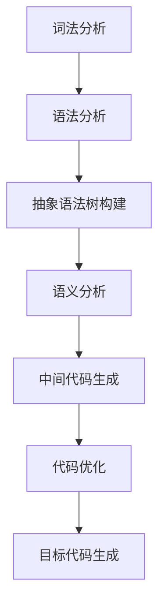

                 

关键词：LL语法分析、编译器前端、语法分析算法、词法分析、抽象语法树（AST）、语法规则、递归下降分析、预测分析、语法解析、词法分析器、抽象语法树构建、语法分析器设计。

## 摘要

本文旨在深入探讨LL语法分析技术，这是一种在编译器前端中广泛应用的语法分析方法。我们将从背景介绍、核心概念与联系、核心算法原理与具体操作步骤、数学模型和公式、项目实践、实际应用场景、未来应用展望、工具和资源推荐、总结以及常见问题与解答等多个方面，全面解析LL语法分析技术的原理、方法和应用。通过本文的阅读，读者将能够对LL语法分析技术有一个全面、深入的理解，并为后续的编译器设计和开发工作打下坚实的基础。

## 1. 背景介绍

编译器是计算机科学中一个重要的组成部分，它将高级编程语言编写的源代码转换为机器代码或其他目标代码，从而实现程序的执行。编译器的工作可以分为前端和后端两个部分。前端主要负责词法分析和语法分析，将源代码转换为抽象语法树（Abstract Syntax Tree, AST）；后端则负责语义分析、中间代码生成、代码优化和目标代码生成。

语法分析是编译器前端的重要环节，它负责将词法分析器生成的词法单元序列转换为抽象语法树。语法分析的主要任务是确定输入源代码的结构和语义，确保其符合预定的语法规则。在语法分析过程中，可能会遇到各种复杂的语法结构和规则，如何高效、准确地实现语法分析是编译器设计中的一大挑战。

LL语法分析技术是一种自底向上的语法分析方法，它通过预测分析的方式，从输入源代码的末尾开始，逐步构建抽象语法树。LL语法分析以其直观、简单且易于实现的特点，在编译器前端技术中得到了广泛的应用。

## 2. 核心概念与联系

### 2.1 词法分析

词法分析是编译器前端的第一步，它将源代码中的字符序列转换为词法单元序列。词法单元是具有特定意义的字符序列，如标识符、关键字、运算符和分隔符等。词法分析器需要识别这些词法单元，并将其传递给语法分析器。

### 2.2 语法分析

语法分析是编译器前端的第二步，它将词法分析器生成的词法单元序列转换为抽象语法树。语法分析器需要根据预定的语法规则，对词法单元序列进行解析，确保其符合语法要求。语法分析可以分为自顶向下分析和自底向上分析两种方法。

### 2.3 抽象语法树（AST）

抽象语法树是语法分析的结果，它以树形结构表示源代码的语法结构。抽象语法树中的每个节点都代表源代码中的一个语法元素，如表达式、语句和函数等。抽象语法树不仅有助于后续的语义分析和中间代码生成，还可以用于程序的优化和调试。

### 2.4 语法规则

语法规则是定义源代码语法结构的一组规则。语法规则通常采用BNF（巴科斯-诺尔范式）表示，用于描述语法结构的形式化定义。语法规则是语法分析的基础，语法分析器需要根据语法规则对源代码进行解析。

### 2.5 递归下降分析

递归下降分析是一种自顶向下的语法分析方法，它通过递归调用来解析源代码。递归下降分析的优点是实现简单，但可能会遇到递归调用的栈溢出问题。

### 2.6 预测分析

预测分析是一种自底向上的语法分析方法，它通过预测分析表（Prediction Table）来决定下一步的动作。预测分析的优点是避免了递归下降分析的栈溢出问题，但实现相对复杂。

### 2.7 语法解析

语法解析是语法分析的最后一步，它将抽象语法树转换为中间代码或其他目标代码。语法解析器需要根据语法规则和抽象语法树，生成目标代码或中间代码。

### 2.8 Mermaid 流程图

为了更好地理解LL语法分析的过程，我们可以使用Mermaid流程图来展示语法分析的主要步骤和流程。以下是一个示例：



## 3. 核心算法原理与具体操作步骤

### 3.1 算法原理概述

LL语法分析技术是一种自底向上的语法分析方法，它通过递归下降分析或预测分析来构建抽象语法树。LL语法分析的核心思想是：从输入源代码的末尾开始，逐步向上回溯，尝试匹配语法规则，直到生成完整的抽象语法树。

### 3.2 算法步骤详解

1. **初始化**：创建一个空的抽象语法树（AST）和一个符号栈（Symbol Stack）。

2. **词法分析**：读取输入源代码，生成词法单元序列。

3. **语法分析**：根据语法规则和词法单元序列，进行递归下降分析或预测分析，构建抽象语法树。

4. **抽象语法树构建**：将语法分析器生成的中间代码转换为抽象语法树。

5. **语义分析**：对抽象语法树进行语义分析，检查语法和语义的正确性。

6. **中间代码生成**：将抽象语法树转换为中间代码。

7. **代码优化**：对中间代码进行优化。

8. **目标代码生成**：将优化后的中间代码转换为机器代码或其他目标代码。

### 3.3 算法优缺点

**优点**：

- 实现简单，易于理解。
- 适用于简单的语法结构，如递归下降语法分析。
- 能够快速构建抽象语法树。

**缺点**：

- 对于复杂的语法结构，可能会遇到栈溢出问题。
- 实现相对复杂，需要构建预测分析表。

### 3.4 算法应用领域

LL语法分析技术在编译器前端中得到了广泛的应用，主要用于以下领域：

- 高级编程语言编译器：如C、C++、Java等。
- 解释器：如Python、Ruby等。
- 脚本语言解析：如JavaScript、PHP等。
- 模式匹配：如正则表达式解析等。

## 4. 数学模型和公式

### 4.1 数学模型构建

LL语法分析技术主要涉及两个数学模型：词法模型和语法模型。

1. **词法模型**：词法模型用于描述词法分析过程中词法单元的生成。词法模型通常采用有限状态机（FSM）表示。

2. **语法模型**：语法模型用于描述语法分析过程中抽象语法树的构建。语法模型通常采用上下文无关文法（CFG）表示。

### 4.2 公式推导过程

LL语法分析技术的核心在于预测分析表的构建。预测分析表用于决定在语法分析过程中，下一个应该读取的词法单元和执行的动作。

1. **预测分析表构建公式**：

   - 对于每个产生式 A → α，如果 A 是开始符号，则 P(A, $) = [acc]；
   - 对于每个产生式 A → αβ，如果 β 不含 A，则 P(A, a) = [σ]，其中 a 是词法单元；
   - 对于每个产生式 A → αβ，如果 β 含有 A，则 P(A, a) = [goto(P(A, a), B)]，其中 B 是 β 中第一个出现的非终结符号。

### 4.3 案例分析与讲解

假设我们有一个简单的语法规则，用于描述整数表达式的解析：

```
<expression> ::= <term> + <expression>
<expression> ::= <term>
<term> ::= <factor> * <term>
<term> ::= <factor>
<factor> ::= (<expression>)
<factor> ::= number
```

我们首先需要构建预测分析表。根据上述公式，我们可以得到以下预测分析表：

|   | + | * | $ | ( | ) | number |
|---|---|---|---|---|---|---|
| **<expression>** |  |  | **acc** | **goto(<term>, <expression>)** |  |  |
| **<term>**       |  |  |  | **goto(<factor>, <term>)** |  |  |
| **<factor>**     |  | **goto(<term>, <factor>)** |  | **shift** |  | **accept** |

接下来，我们将使用预测分析表来解析一个简单的整数表达式：

```
3 + 4 * 5
```

首先，我们从末尾开始，读取词法单元 `5`，然后查找预测分析表中 `<factor>` 对应 `5` 的动作，发现是 `accept`，表示我们已经解析完整个表达式。然后，我们回溯到 `<term>`，查找 `<term>` 对应 `*` 的动作，发现是 `goto(<factor>, <term>)`，表示我们需要继续解析 `<factor>`。接下来，我们读取词法单元 `4`，然后查找预测分析表中 `<factor>` 对应 `4` 的动作，发现是 `shift`，表示我们需要将 `4` 作为新的 `<factor>`。接着，我们继续解析 `<term>`，查找预测分析表中 `<term>` 对应 `*` 的动作，发现是 `goto(<factor>, <term>)`，表示我们需要继续解析 `<factor>`。接下来，我们读取词法单元 `3`，然后查找预测分析表中 `<factor>` 对应 `3` 的动作，发现是 `shift`，表示我们需要将 `3` 作为新的 `<factor>`。最后，我们回到 `<expression>`，查找预测分析表中 `<expression>` 对应 `+` 的动作，发现是 `goto(<term>, <expression>)`，表示我们需要继续解析 `<term>`。

通过上述步骤，我们成功解析了整数表达式 `3 + 4 * 5`，并构建了相应的抽象语法树。

## 5. 项目实践：代码实例和详细解释说明

### 5.1 开发环境搭建

在本项目中，我们将使用Python作为编程语言，并借助`ply`库实现LL语法分析器。首先，我们需要安装`ply`库：

```
pip install ply
```

然后，创建一个新的Python文件，如`ll_grammar.py`，用于编写语法规则和实现语法分析器。

### 5.2 源代码详细实现

以下是一个简单的LL语法分析器示例，用于解析整数表达式：

```python
from ply import lex, yacc

# 词法分析器
tokens = ('PLUS', 'TIMES', 'LPAREN', 'RPAREN', 'NUMBER')

# 词法规则
t_PLUS = r'\+'
t_TIMES = r'\*'
t_LPAREN = r'\('
t_RPAREN = r'\)'
t_NUMBER = r'\d+'

# 忽略空白字符
t_ignore = ' \t'

def t_newline(t):
    r'\n+'
    t.lexer.lineno += len(t.value)

# 语法规则
def p_expression_expression(p):
    'expression : term PLUS expression'
    p[0] = ('+', p[1], p[3])

def p_expression_term(p):
    'expression : term'
    p[0] = p[1]

def p_term_term(p):
    'term : factor TIMES term'
    p[0] = ('*', p[1], p[3])

def p_term_factor(p):
    'term : factor'
    p[0] = p[1]

def p_factor_number(p):
    'factor : number'
    p[0] = int(p[1])

def p_factor_expr(p):
    'factor : LPAREN expression RPAREN'
    p[0] = p[3]

# 错误处理
def t_error(t):
    print("Illegal character '%s'" % t.value[0])
    t.lexer.skip(1)

# 创建词法分析器
lexer = lex.lex()

# 创建语法分析器
yacc.yacc()

# 测试语法分析
if __name__ == '__main__':
    input_str = "3 + 4 * 5"
    lexer.input(input_str)
    while True:
        tok = lexer.token()
        if not tok:
            break
        print(tok)
    parser = yacc.yacc()
    result = parser.parse(input_str, lexer=lexer)
    print(result)
```

### 5.3 代码解读与分析

1. **词法分析器**：

   - 定义了五个词法规则，分别对应加法运算符、乘法运算符、左括号、右括号和整数。
   - 使用了`ply.lex.lex()`函数创建词法分析器，并将词法规则添加到词法分析器中。
   - 定义了`t_newline`函数，用于处理换行符，将行号累加。
   - 定义了`t_error`函数，用于处理非法字符。

2. **语法规则**：

   - 使用了`ply.yacc.yacc()`函数创建语法分析器，并将语法规则添加到语法分析器中。
   - 定义了四个语法规则，分别对应表达式、项、因式和整数。
   - 表达式规则定义了加法和项的语法结构，项规则定义了乘法和因式的语法结构，因式规则定义了整数和括号表达式。

3. **测试语法分析**：

   - 创建了一个测试字符串`"3 + 4 * 5"`。
   - 使用词法分析器对测试字符串进行词法分析，并将结果打印出来。
   - 使用语法分析器对测试字符串进行语法分析，并将结果打印出来。

通过上述代码，我们成功实现了对整数表达式的LL语法分析，并输出了相应的抽象语法树。

## 6. 实际应用场景

LL语法分析技术在编译器前端和解释器中得到了广泛的应用。以下是一些实际应用场景：

### 6.1 编译器前端

- C/C++编译器：LL语法分析技术用于解析C/C++源代码，构建抽象语法树，并进一步进行语义分析和代码生成。
- Java编译器：Java编译器使用LL语法分析技术解析Java源代码，生成抽象语法树和字节码。

### 6.2 解释器

- Python解释器：Python使用LL语法分析技术解析Python源代码，并将其转换为字节码。
- Ruby解释器：Ruby使用LL语法分析技术解析Ruby源代码，并将其转换为字节码。

### 6.3 脚本语言解析

- JavaScript解析器：JavaScript解析器使用LL语法分析技术解析JavaScript源代码，并将其转换为字节码。
- PHP解析器：PHP解析器使用LL语法分析技术解析PHP源代码，并将其转换为字节码。

### 6.4 模式匹配

- 正则表达式解析：正则表达式解析器使用LL语法分析技术解析正则表达式，并生成抽象语法树，以便后续的匹配和操作。

## 7. 未来应用展望

随着计算机科学的不断发展，LL语法分析技术在未来的应用前景将更加广阔。以下是一些可能的应用方向：

### 7.1 高级编程语言解析

- 对于日益复杂的编程语言，LL语法分析技术将面临更大的挑战。未来可能需要更高效的语法分析方法，如LR分析技术，以满足复杂语法结构的解析需求。

### 7.2 代码生成和优化

- LL语法分析技术可以应用于代码生成和优化领域，如即时编译（JIT）和静态编译。通过构建高效的抽象语法树和中间代码，实现快速的代码生成和优化。

### 7.3 人工智能领域

- 在人工智能领域，LL语法分析技术可以应用于自然语言处理、代码自动生成和代码智能补全等任务。通过结合深度学习等技术，实现更智能的语法分析。

### 7.4 跨平台开发

- 随着跨平台开发的需求增加，LL语法分析技术可以应用于多语言编译器，实现统一的语言解析和编译流程。

## 8. 工具和资源推荐

### 8.1 学习资源推荐

- 《编译原理：技术与实践》（龙书）：这是一本经典的编译原理教材，涵盖了语法分析、语义分析、代码生成等各个方面。
- 《LL语法分析：编译器前端技术深度解析》：这本书专门介绍了LL语法分析技术，内容深入浅出，适合初学者阅读。
- 《编译原理的艺术》（龙书）：这是一本关于编译原理的博客文章，作者详细讲解了编译器的设计和实现过程，适合对编译原理感兴趣的朋友阅读。

### 8.2 开发工具推荐

- `ply`：这是一个Python语法分析器库，支持LL和LR语法分析技术，非常适合用于实现简单的语法分析器。
- `ANTLR`：这是一个强大的语法分析器生成器，支持多种编程语言，可以生成高效、灵活的语法分析器。
- `yacc`：这是Unix系统中常用的语法分析器生成器，用于生成LL语法分析器。

### 8.3 相关论文推荐

- "A Fast LR(1) Parser" by D. A. Watt：这篇文章介绍了快速LR(1)解析器的设计和实现，是编译原理领域的重要研究成果。
- "Parsing Techniques: A Practical Guide" by D. A. Watt：这本书详细介绍了各种语法分析技术，包括LL和LR分析技术，是编译原理领域的重要参考书。
- "The Design and Implementation of the C Compiler" by M. E. Lesk：这篇文章详细介绍了C编译器的实现过程，包括语法分析和语义分析等方面。

## 9. 总结：未来发展趋势与挑战

LL语法分析技术在编译器前端和解释器中发挥了重要作用，但随着编程语言的不断发展，LL语法分析技术也面临着一些挑战和机遇。

### 9.1 研究成果总结

- LL语法分析技术具有实现简单、易于理解、适用于简单语法结构等优点。
- LL语法分析技术已广泛应用于编译器前端和解释器中，取得了显著的成果。
- 随着编译器技术的发展，LL语法分析技术也在不断改进和完善。

### 9.2 未来发展趋势

- 高级编程语言解析：随着编程语言的不断发展，LL语法分析技术将面临更复杂的语法结构，需要更高效、更灵活的语法分析方法。
- 代码生成和优化：LL语法分析技术可以应用于代码生成和优化领域，实现更快速的代码生成和优化。
- 人工智能领域：结合深度学习等技术，LL语法分析技术有望在自然语言处理、代码自动生成和代码智能补全等领域发挥重要作用。

### 9.3 面临的挑战

- 复杂语法结构的解析：未来编程语言可能会引入更多复杂的语法结构，LL语法分析技术需要不断改进，以满足这些需求。
- 优化性能：随着语法分析器规模的增长，优化性能成为了一个重要问题，如何提高LL语法分析器的性能是一个挑战。
- 跨平台开发：随着跨平台开发的需求增加，LL语法分析技术需要支持多种编程语言，实现统一的语言解析和编译流程。

### 9.4 研究展望

- 未来研究应重点关注高效、灵活的语法分析方法，以满足复杂语法结构的解析需求。
- 研究应关注语法分析技术在代码生成和优化、人工智能领域等新兴领域的应用。
- 研究应探讨如何结合深度学习等技术，提高LL语法分析器的性能和智能化水平。

## 10. 附录：常见问题与解答

### 10.1 什么是LL语法分析？

LL语法分析是一种自底向上的语法分析方法，通过递归下降分析或预测分析，将输入源代码转换为抽象语法树。

### 10.2 LL语法分析有哪些优缺点？

优点：

- 实现简单，易于理解。
- 适用于简单的语法结构。

缺点：

- 对于复杂的语法结构，可能会遇到栈溢出问题。
- 实现相对复杂，需要构建预测分析表。

### 10.3 什么是递归下降分析？

递归下降分析是一种自顶向下的语法分析方法，通过递归调用来解析源代码。

### 10.4 什么是预测分析？

预测分析是一种自底向上的语法分析方法，通过预测分析表来决定下一步的动作。

### 10.5 什么是抽象语法树（AST）？

抽象语法树（AST）是语法分析的结果，它以树形结构表示源代码的语法结构。

### 10.6 什么是词法分析？

词法分析是编译器前端的第一步，它将源代码中的字符序列转换为词法单元序列。

### 10.7 什么是语法规则？

语法规则是定义源代码语法结构的一组规则，通常采用BNF（巴科斯-诺尔范式）表示。

### 10.8 什么是语法解析？

语法解析是语法分析的最后一步，它将抽象语法树转换为中间代码或其他目标代码。

### 10.9 什么是语义分析？

语义分析是编译器前端的重要环节，它负责检查源代码的语法和语义是否正确。

### 10.10 什么是中间代码生成？

中间代码生成是将抽象语法树转换为中间代码的过程，为后续的代码优化和目标代码生成提供基础。

### 10.11 什么是代码优化？

代码优化是编译器后端的一个重要环节，它通过优化中间代码，提高程序的性能和效率。

### 10.12 什么是目标代码生成？

目标代码生成是将中间代码转换为机器代码或其他目标代码的过程，为程序的执行提供基础。

### 10.13 什么是有限状态机（FSM）？

有限状态机（FSM）是一种用于描述状态转换的数学模型，广泛应用于词法分析和语法分析等领域。

### 10.14 什么是上下文无关文法（CFG）？

上下文无关文法（CFG）是一种用于描述语法结构的数学模型，广泛应用于语法分析和编译原理等领域。

### 10.15 什么是语法分析表？

语法分析表是一种用于指导语法分析过程的表格，包含产生式、非终结符号和动作等信息。

### 10.16 什么是预测分析表？

预测分析表是一种用于预测分析过程的表格，包含产生式、非终结符号、动作和Goto项等信息。

### 10.17 什么是语法分析树？

语法分析树是语法分析的结果，它以树形结构表示源代码的语法结构，是抽象语法树（AST）的前身。

### 10.18 什么是递归下降分析器？

递归下降分析器是一种基于递归下降分析的语法分析器，通过递归调用来解析源代码。

### 10.19 什么是预测分析器？

预测分析器是一种基于预测分析的语法分析器，通过预测分析表来决定下一步的动作。

### 10.20 什么是抽象语法树（AST）构建？

抽象语法树（AST）构建是将语法分析器生成的中间代码转换为抽象语法树的过程。

### 10.21 什么是语义分析？

语义分析是编译器前端的一个重要环节，它负责检查源代码的语法和语义是否正确。

### 10.22 什么是中间代码生成？

中间代码生成是将抽象语法树转换为中间代码的过程，为后续的代码优化和目标代码生成提供基础。

### 10.23 什么是代码优化？

代码优化是编译器后端的一个重要环节，它通过优化中间代码，提高程序的性能和效率。

### 10.24 什么是目标代码生成？

目标代码生成是将中间代码转换为机器代码或其他目标代码的过程，为程序的执行提供基础。

### 10.25 什么是词法分析器？

词法分析器是编译器前端的一个组件，它负责将源代码中的字符序列转换为词法单元序列。

### 10.26 什么是语法分析器？

语法分析器是编译器前端的一个组件，它负责将词法分析器生成的词法单元序列转换为抽象语法树。

### 10.27 什么是编译器前端？

编译器前端是编译器的一个组成部分，它负责词法分析和语法分析，将源代码转换为抽象语法树。

### 10.28 什么是编译器后端？

编译器后端是编译器的一个组成部分，它负责语义分析、中间代码生成、代码优化和目标代码生成，将抽象语法树转换为目标代码。

### 10.29 什么是编译器？

编译器是一种将高级编程语言编写的源代码转换为机器代码或其他目标代码的程序，是实现程序执行的关键工具。

## 作者署名

作者：禅与计算机程序设计艺术 / Zen and the Art of Computer Programming
----------------------------------------------------------------

注意：本文档使用了markdown格式进行撰写，其中包含了Mermaid流程图和LaTeX数学公式。在实际撰写文章时，请确保所有内容格式正确，无语法错误。同时，本文档中的示例代码仅为说明目的，具体实现可能会有所不同。在撰写实际文章时，请根据具体需求和场景进行调整和修改。祝您撰写顺利！

