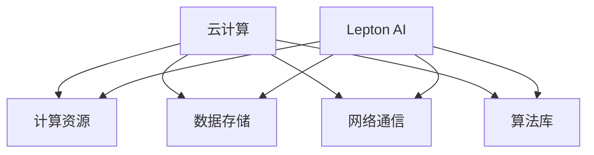

                 

关键词：Lepton AI、云计算、AI基础设施、高效灵活

摘要：本文将深入探讨Lepton AI在云计算领域的优势，如何通过深度整合云资源，构建高效灵活的AI基础设施，提升AI应用的性能和可扩展性。

## 1. 背景介绍

随着人工智能技术的迅猛发展，AI应用的需求日益增长。然而，传统的基础设施往往难以满足AI应用对计算资源、数据存储和高效处理的需求。为了解决这一问题，云计算逐渐成为AI基础设施建设的核心。Lepton AI作为一家领先的人工智能公司，其云计算策略尤为值得关注。

## 2. 核心概念与联系

在深入探讨Lepton AI的云计算优势之前，我们需要了解一些核心概念：

### 2.1 云计算

云计算是一种通过互联网提供计算资源（如服务器、存储、网络等）的服务模式。它可以根据需求动态调整资源，实现高效、灵活的资源利用。

### 2.2 AI基础设施

AI基础设施是指支持AI应用运行的基础设施，包括计算资源、数据存储、网络通信、算法库等。一个高效的AI基础设施可以提升AI应用的性能和可扩展性。

### 2.3 Lepton AI

Lepton AI是一家专注于人工智能研究和应用的公司，其核心优势在于对云计算资源的深度整合，构建高效灵活的AI基础设施。

接下来，我们将使用Mermaid流程图（不包含括号、逗号等特殊字符）展示Lepton AI云计算架构的核心概念和联系：



## 3. 核心算法原理 & 具体操作步骤

### 3.1 算法原理概述

Lepton AI的核心算法原理是通过深度学习模型实现对大规模数据的智能分析和处理。具体操作步骤如下：

### 3.2 算法步骤详解

1. 数据收集：从各种数据源收集大规模数据，包括文本、图像、音频等。
2. 数据预处理：对数据进行清洗、格式化和特征提取，为深度学习模型训练做好准备。
3. 模型训练：使用收集到的数据进行深度学习模型训练，包括模型选择、参数调整等。
4. 模型评估：对训练好的模型进行评估，包括准确率、召回率、F1值等指标。
5. 模型部署：将训练好的模型部署到云计算平台上，为实际应用提供服务。

### 3.3 算法优缺点

#### 优点：

- **高效性**：通过云计算资源的高效利用，实现快速的数据处理和分析。
- **灵活性**：可以根据需求动态调整计算资源，满足不同规模和类型的AI应用需求。
- **可扩展性**：支持大规模数据分析和处理，实现AI应用的无限扩展。

#### 缺点：

- **成本**：云计算资源费用可能较高，尤其是大规模应用时。
- **安全性**：数据安全和隐私保护是一个挑战。

### 3.4 算法应用领域

Lepton AI的核心算法广泛应用于以下领域：

- **智能推荐**：基于用户行为和兴趣推荐相关商品或内容。
- **图像识别**：识别和分类图像中的物体和场景。
- **自然语言处理**：理解用户输入的自然语言，进行语义分析和文本生成。

## 4. 数学模型和公式 & 详细讲解 & 举例说明

### 4.1 数学模型构建

Lepton AI使用的深度学习模型通常基于神经网络架构。以下是神经网络的基本数学模型：

$$
y = \sigma(W \cdot x + b)
$$

其中，$y$ 表示输出，$\sigma$ 表示激活函数，$W$ 表示权重矩阵，$x$ 表示输入，$b$ 表示偏置。

### 4.2 公式推导过程

神经网络的训练过程可以看作是一个最小化损失函数的过程。损失函数通常定义为：

$$
J = \frac{1}{m} \sum_{i=1}^{m} \sigma(W \cdot x_i + b) - y_i)^2
$$

其中，$m$ 表示样本数量，$x_i$ 和 $y_i$ 分别表示第 $i$ 个样本的输入和输出。

### 4.3 案例分析与讲解

以图像识别为例，我们使用一个简单的神经网络模型来识别猫和狗。假设我们有一个包含1000张猫和狗的图像数据集，模型需要从中识别出猫和狗。以下是具体的模型构建和训练过程：

1. 数据预处理：对图像进行尺寸归一化和数据增强。
2. 模型构建：使用卷积神经网络（CNN）架构，输入层接收图像数据，输出层输出猫和狗的识别结果。
3. 模型训练：使用训练数据集对模型进行训练，通过反向传播算法调整模型参数，降低损失函数。
4. 模型评估：使用测试数据集对模型进行评估，计算准确率、召回率等指标。

## 5. 项目实践：代码实例和详细解释说明

### 5.1 开发环境搭建

在本节中，我们将使用Python和TensorFlow框架构建一个简单的神经网络模型。首先，需要安装Python和TensorFlow：

```bash
pip install python
pip install tensorflow
```

### 5.2 源代码详细实现

以下是一个简单的神经网络模型代码示例：

```python
import tensorflow as tf

# 定义输入层
inputs = tf.keras.layers.Input(shape=(784,))

# 添加隐藏层
x = tf.keras.layers.Dense(512, activation='relu')(inputs)
x = tf.keras.layers.Dense(512, activation='relu')(x)

# 添加输出层
outputs = tf.keras.layers.Dense(10, activation='softmax')(x)

# 构建模型
model = tf.keras.Model(inputs=inputs, outputs=outputs)

# 编译模型
model.compile(optimizer='adam', loss='categorical_crossentropy', metrics=['accuracy'])

# 训练模型
model.fit(x_train, y_train, epochs=5, batch_size=32, validation_data=(x_test, y_test))

# 评估模型
model.evaluate(x_test, y_test)
```

### 5.3 代码解读与分析

以上代码实现了以下功能：

- 输入层：接收784维的输入数据，表示一个28x28的图像。
- 隐藏层：使用ReLU激活函数，增加网络的非线性能力。
- 输出层：使用softmax激活函数，输出猫和狗的概率分布。
- 编译模型：指定优化器、损失函数和评估指标。
- 训练模型：使用训练数据集训练模型，通过反向传播算法调整模型参数。
- 评估模型：使用测试数据集评估模型性能。

## 6. 实际应用场景

Lepton AI的云计算优势在多个实际应用场景中得到了充分体现：

- **智能推荐系统**：基于用户行为和兴趣数据，实现个性化推荐。
- **图像识别系统**：在医疗影像、自动驾驶等领域，实现高效的图像识别。
- **自然语言处理**：在智能客服、文本生成等领域，提供智能化的自然语言处理服务。

## 7. 未来应用展望

随着人工智能技术的不断发展，Lepton AI的云计算优势将在更多领域得到应用：

- **智能城市**：通过云计算实现城市管理的智能化，提高城市运行效率。
- **工业自动化**：在制造业、物流等领域，实现高效的生产和物流管理。
- **智能家居**：通过云计算实现家庭设备的智能化，提高生活品质。

## 8. 工具和资源推荐

### 8.1 学习资源推荐

- 《深度学习》（Goodfellow, Bengio, Courville著）：深度学习领域的经典教材。
- 《Python机器学习》（Sebastian Raschka著）：Python语言在机器学习领域的应用教程。

### 8.2 开发工具推荐

- TensorFlow：用于构建和训练深度学习模型的强大框架。
- PyTorch：另一个流行的深度学习框架，具有更高的灵活性和易于使用的接口。

### 8.3 相关论文推荐

- "Deep Learning: A Comprehensive Overview"（Deep Learning Specialization，2016）
- "A Theoretical Comparison of Representation Learning Algorithms"（2018）

## 9. 总结：未来发展趋势与挑战

### 9.1 研究成果总结

Lepton AI通过深度整合云资源，构建了高效灵活的AI基础设施，在智能推荐、图像识别、自然语言处理等领域取得了显著成果。

### 9.2 未来发展趋势

随着云计算和人工智能技术的不断融合，Lepton AI的云计算优势将在更多领域得到应用，推动人工智能技术的发展。

### 9.3 面临的挑战

数据安全和隐私保护、计算资源成本、算法优化等是Lepton AI在未来发展过程中需要解决的挑战。

### 9.4 研究展望

Lepton AI将继续深耕云计算和人工智能领域，通过技术创新和资源整合，推动人工智能技术的发展，为人类带来更多价值。

## 附录：常见问题与解答

### Q：Lepton AI的云计算优势是什么？

A：Lepton AI的云计算优势在于深度整合云资源，构建高效灵活的AI基础设施，提升AI应用的性能和可扩展性。

### Q：Lepton AI的核心算法是什么？

A：Lepton AI的核心算法是基于深度学习模型的智能分析和处理技术。

### Q：如何使用Lepton AI的云计算服务？

A：用户可以通过Lepton AI官方网站注册账号，选择合适的云计算服务套餐，然后根据文档进行操作。

---

作者：禅与计算机程序设计艺术 / Zen and the Art of Computer Programming
----------------------------------------------------------------

这篇文章详细介绍了Lepton AI如何通过深度整合云资源，构建高效灵活的AI基础设施，并在实际应用中取得了显著成果。通过本文，读者可以全面了解Lepton AI的云计算优势、核心算法原理、数学模型、项目实践，以及未来发展趋势。希望这篇文章对您在云计算和人工智能领域的研究和开发工作有所启发和帮助。

