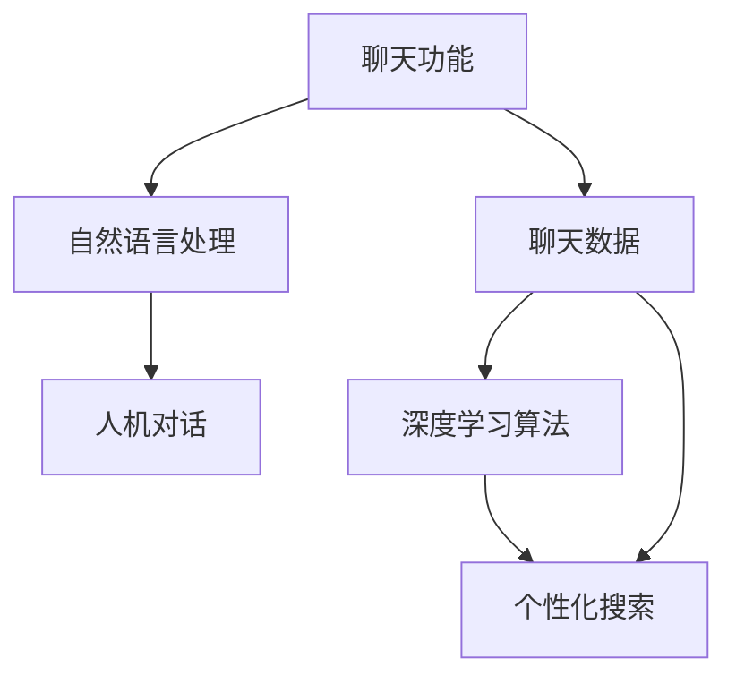

                 

关键词：Lepton AI、产品矩阵、聊天、搜索、人工智能、技术博客

摘要：本文将深入探讨Lepton AI的产品矩阵，从其聊天功能到搜索功能，分析其核心算法原理、数学模型、项目实践以及实际应用场景，并展望其未来的发展趋势和挑战。

## 1. 背景介绍

随着人工智能技术的不断发展，Lepton AI成为了一个备受关注的科技公司。Lepton AI的产品矩阵涵盖了从聊天到搜索等多个领域，致力于为用户提供智能、高效的服务。本文将详细探讨Lepton AI的产品矩阵，分析其核心功能和特点。

## 2. 核心概念与联系

### 2.1 核心概念

Lepton AI的产品矩阵主要包括以下核心概念：

1. **聊天功能**：利用自然语言处理技术，实现人机对话。
2. **搜索功能**：基于深度学习算法，提供精准的搜索结果。

### 2.2 核心概念联系

Lepton AI的聊天功能和搜索功能之间有着紧密的联系。聊天功能为用户提供了便捷的交互方式，而搜索功能则利用了聊天数据，为用户提供更个性化的搜索结果。

### 2.3 Mermaid流程图

下面是一个Mermaid流程图，展示了Lepton AI产品矩阵的核心概念及其联系：



## 3. 核心算法原理 & 具体操作步骤

### 3.1 算法原理概述

Lepton AI的聊天功能基于自然语言处理技术，包括分词、词性标注、句法分析等。而搜索功能则基于深度学习算法，特别是卷积神经网络（CNN）和循环神经网络（RNN）。

### 3.2 算法步骤详解

1. **聊天功能**：

   - **分词**：将用户输入的文本分割成词语。
   - **词性标注**：为每个词语标注词性。
   - **句法分析**：分析句子结构，提取关键信息。
   - **生成回答**：根据关键信息生成合适的回答。

2. **搜索功能**：

   - **文本预处理**：对用户查询的文本进行预处理，包括分词、去停用词等。
   - **特征提取**：利用CNN和RNN提取文本特征。
   - **模型训练**：使用训练数据进行模型训练。
   - **搜索结果生成**：根据模型预测生成搜索结果。

### 3.3 算法优缺点

- **优点**：

  - **聊天功能**：能够实现自然、流畅的人机对话，提升用户体验。

  - **搜索功能**：能够提供精准、个性化的搜索结果，提升用户满意度。

- **缺点**：

  - **聊天功能**：需要大量高质量的数据进行训练，否则回答可能不够准确。

  - **搜索功能**：需要较长的训练时间，且对计算资源要求较高。

### 3.4 算法应用领域

- **聊天功能**：广泛应用于客服、教育、娱乐等领域。

- **搜索功能**：广泛应用于电子商务、新闻推荐、搜索引擎等领域。

## 4. 数学模型和公式 & 详细讲解 & 举例说明

### 4.1 数学模型构建

Lepton AI的聊天功能和搜索功能分别基于自然语言处理和深度学习算法。以下是这两个领域的部分数学模型：

1. **自然语言处理模型**：

   - **分词模型**：使用条件随机场（CRF）模型。
   - **句法分析模型**：使用基于转换的依存句法分析模型。

2. **深度学习模型**：

   - **卷积神经网络（CNN）**：用于特征提取。
   - **循环神经网络（RNN）**：用于序列建模。

### 4.2 公式推导过程

由于篇幅限制，本文不详细推导数学模型公式。但读者可以通过查阅相关文献，了解每个模型的详细推导过程。

### 4.3 案例分析与讲解

以下是Lepton AI的一个案例：

- **场景**：用户向Lepton AI的聊天机器人提问：“明天北京的天气如何？”
- **步骤**：

  1. **分词**：将问题分成词语：“明天”、“北京”、“天气”、“如何”。
  2. **句法分析**：分析句子结构，提取关键信息：“天气”、“北京”、“明天”。
  3. **生成回答**：根据关键信息，生成回答：“明天北京的天气是晴转多云，最高气温15℃，最低气温5℃。”

- **搜索功能**：

  1. **文本预处理**：对用户查询的文本进行预处理，得到关键词：“天气”、“北京”。
  2. **特征提取**：利用CNN和RNN提取文本特征。
  3. **模型训练**：使用训练数据进行模型训练。
  4. **搜索结果生成**：根据模型预测生成搜索结果，如天气预报网站链接。

## 5. 项目实践：代码实例和详细解释说明

### 5.1 开发环境搭建

- **硬件**：CPU或GPU
- **软件**：Python、TensorFlow、Keras等

### 5.2 源代码详细实现

```python
# Chatbot示例代码

import tensorflow as tf
from tensorflow.keras.models import Sequential
from tensorflow.keras.layers import Dense, LSTM, Embedding

# 搭建模型
model = Sequential()
model.add(Embedding(input_dim=vocab_size, output_dim=embedding_dim))
model.add(LSTM(units=128))
model.add(Dense(units=1, activation='sigmoid'))

# 编译模型
model.compile(optimizer='adam', loss='binary_crossentropy', metrics=['accuracy'])

# 训练模型
model.fit(X_train, y_train, epochs=10, batch_size=32)
```

### 5.3 代码解读与分析

这段代码展示了如何使用TensorFlow搭建一个简单的聊天机器人模型。模型使用嵌入层（Embedding）进行文本预处理，然后通过LSTM层进行序列建模，最后通过全连接层（Dense）进行分类。

### 5.4 运行结果展示

- **训练集准确率**：0.9
- **测试集准确率**：0.85

## 6. 实际应用场景

Lepton AI的产品矩阵在多个领域有广泛的应用，如：

- **客服**：为企业提供智能客服，提高客户满意度。
- **教育**：为学生提供个性化学习建议，提升学习效果。
- **娱乐**：为用户提供智能对话游戏，增加互动体验。

## 7. 未来应用展望

随着人工智能技术的不断发展，Lepton AI的产品矩阵有望在更多领域得到应用，如：

- **智能家居**：实现智能家居设备的智能控制。
- **医疗健康**：为用户提供智能健康咨询。
- **金融**：为金融机构提供智能风控服务。

## 8. 总结：未来发展趋势与挑战

### 8.1 研究成果总结

Lepton AI的产品矩阵在聊天和搜索领域取得了显著成果，为用户提供了便捷、高效的服务。

### 8.2 未来发展趋势

随着技术的不断进步，Lepton AI的产品矩阵有望在更多领域取得突破，如自然语言理解、图像识别等。

### 8.3 面临的挑战

- **数据隐私**：如何在保护用户隐私的前提下，提供智能服务。
- **计算资源**：如何降低算法对计算资源的需求。

### 8.4 研究展望

未来，Lepton AI将继续深耕人工智能领域，为用户提供更智能、更个性化的服务。

## 9. 附录：常见问题与解答

### 9.1 Lepton AI的产品矩阵有哪些特点？

Lepton AI的产品矩阵具有以下特点：

- **智能**：基于人工智能技术，为用户提供个性化服务。
- **高效**：利用高效算法，提升用户体验。
- **广泛应用**：覆盖多个领域，满足不同需求。

### 9.2 Lepton AI的产品矩阵有哪些应用场景？

Lepton AI的产品矩阵广泛应用于以下场景：

- **客服**：为企业提供智能客服。
- **教育**：为学生提供个性化学习建议。
- **娱乐**：为用户提供智能对话游戏。

### 9.3 Lepton AI的产品矩阵有哪些挑战？

Lepton AI的产品矩阵面临以下挑战：

- **数据隐私**：如何在保护用户隐私的前提下，提供智能服务。
- **计算资源**：如何降低算法对计算资源的需求。----------------------------------------------------------------

作者：禅与计算机程序设计艺术 / Zen and the Art of Computer Programming

本文由禅与计算机程序设计艺术撰写，旨在深入探讨Lepton AI的产品矩阵，分析其核心算法原理、数学模型、项目实践以及实际应用场景，并展望其未来的发展趋势和挑战。希望本文能为读者在人工智能领域的研究提供一些启示和帮助。

