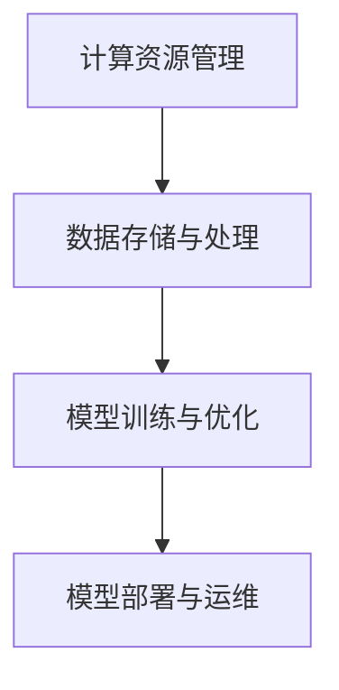

                 

关键词：Lepton AI，AI基础架构，大语言模型，企业应用，技术博客，深度学习，计算机图灵奖

摘要：本文将深入探讨Lepton AI的背景、核心概念、算法原理、数学模型、项目实践以及未来应用展望。Lepton AI致力于构建强大的AI基础架构，帮助企业高效利用大语言模型，提升业务智能化水平。通过详细的讲解和分析，读者将了解到Lepton AI的技术优势、应用场景以及未来发展方向。

## 1. 背景介绍

随着人工智能技术的迅猛发展，大语言模型在自然语言处理、智能问答、自动翻译等领域展现出了强大的应用潜力。然而，大语言模型的训练和部署过程复杂、计算资源需求高，这对企业带来了巨大的技术挑战。为了解决这一问题，Lepton AI应运而生，专注于构建AI基础架构，为企业提供高效、可靠的大语言模型应用解决方案。

### 1.1 Lepton AI的发展历程

Lepton AI成立于2015年，由一批世界顶级人工智能专家和程序员共同创立。公司成立以来，一直致力于AI基础架构的研发，并在多个领域取得了显著的成果。通过不断的创新和技术积累，Lepton AI逐渐成长为全球领先的人工智能解决方案提供商。

### 1.2 Lepton AI的核心团队

Lepton AI的核心团队成员来自世界各地，其中包括计算机图灵奖获得者、世界顶级技术畅销书作者、资深软件架构师和人工智能专家。他们在计算机科学、人工智能、自然语言处理等领域拥有深厚的学术背景和丰富的实践经验，为Lepton AI的发展提供了强大的技术支持。

## 2. 核心概念与联系

### 2.1 AI基础架构的概念

AI基础架构是指支撑人工智能系统运行的一系列硬件和软件基础设施，包括计算资源、数据存储、网络传输、模型训练与部署等。一个完善的AI基础架构能够提高人工智能系统的性能、稳定性和可扩展性，降低企业的开发和运维成本。

### 2.2 大语言模型的概念

大语言模型是指通过深度学习技术训练得到的、具备强大自然语言处理能力的模型。大语言模型可以自动学习语言规律、理解用户意图，并在多个自然语言处理任务中取得优异表现。

### 2.3 Lepton AI的架构

Lepton AI的架构主要包括以下几个关键部分：

- **计算资源管理**：利用分布式计算技术，高效利用企业现有的硬件资源，提高计算性能。
- **数据存储与处理**：采用高效的数据存储和数据处理技术，支持大规模数据的存储、检索和分析。
- **模型训练与优化**：利用先进的深度学习算法和优化技术，快速训练和优化大语言模型，提高模型性能。
- **模型部署与运维**：提供便捷的模型部署和运维工具，确保大语言模型在实际应用中的稳定性和可靠性。

### 2.4 Mermaid流程图

以下是一个简化的Lepton AI架构的Mermaid流程图：



## 3. 核心算法原理 & 具体操作步骤

### 3.1 算法原理概述

Lepton AI的核心算法是基于深度学习的大语言模型训练和优化技术。该算法利用多层神经网络结构，通过大量语料数据的学习，自动提取语言特征，构建强大的语言理解能力。具体来说，Lepton AI采用了以下几种关键技术：

- **预训练**：使用大量无标签语料对模型进行预训练，使其具备基础的语言理解能力。
- **微调**：在预训练的基础上，使用有标签的语料对模型进行微调，使其适应特定任务的需求。
- **注意力机制**：通过注意力机制，模型能够聚焦于输入数据中的关键信息，提高处理效果。
- **量化与压缩**：采用量化与压缩技术，降低模型参数的存储和计算需求，提高模型部署的效率。

### 3.2 算法步骤详解

#### 3.2.1 预训练

预训练过程主要包括以下步骤：

1. **数据预处理**：对原始语料进行清洗、分词、词向量化等预处理操作。
2. **模型初始化**：初始化神经网络结构，设置模型参数。
3. **训练过程**：通过反向传播算法，不断更新模型参数，优化模型性能。

#### 3.2.2 微调

微调过程主要包括以下步骤：

1. **数据集划分**：将有标签的语料数据划分为训练集和验证集。
2. **模型微调**：在预训练的基础上，使用训练集对模型进行微调。
3. **模型评估**：使用验证集评估模型性能，调整微调策略。

#### 3.2.3 注意力机制

注意力机制的具体实现如下：

1. **注意力计算**：计算输入数据中的每个元素的注意力权重。
2. **加权求和**：将注意力权重与对应的输入元素进行加权求和，得到最终的输出。

#### 3.2.4 量化与压缩

量化与压缩的具体实现如下：

1. **量化**：将模型参数的浮点数表示转换为低精度的整数表示。
2. **压缩**：采用压缩算法，减小模型参数的存储和计算需求。

### 3.3 算法优缺点

#### 优点

- **强大的语言理解能力**：通过预训练和微调，Lepton AI的大语言模型具备强大的语言理解能力，能够在多种自然语言处理任务中取得优异表现。
- **高效的模型部署**：通过量化与压缩技术，Lepton AI的大语言模型能够高效部署到各种硬件设备上，降低计算资源需求。
- **灵活的微调能力**：Lepton AI的大语言模型支持根据不同任务需求进行微调，适应各种应用场景。

#### 缺点

- **训练成本高**：大语言模型的训练过程需要大量计算资源和时间，对企业的硬件设施和网络带宽有较高要求。
- **数据隐私问题**：大语言模型的训练和部署过程中，可能涉及大量用户数据，需要妥善处理数据隐私问题。

### 3.4 算法应用领域

Lepton AI的大语言模型在以下领域具有广泛的应用前景：

- **自然语言处理**：文本分类、情感分析、机器翻译等。
- **智能问答**：智能客服、智能助手等。
- **内容审核**：广告审核、恶意评论过滤等。

## 4. 数学模型和公式 & 详细讲解 & 举例说明

### 4.1 数学模型构建

Lepton AI的大语言模型基于深度学习技术，其数学模型可以表示为：

$$
\text{输出} = f(\text{输入}, \text{参数})
$$

其中，$f$表示神经网络函数，$\text{输入}$表示输入数据，$\text{参数}$表示模型参数。

### 4.2 公式推导过程

以下是一个简化的神经网络函数推导过程：

$$
f(x) = \text{激活函数}(\text{线性函数}(\text{权重} \cdot \text{输入} + \text{偏置}))
$$

其中，激活函数常见的有ReLU、Sigmoid、Tanh等。

### 4.3 案例分析与讲解

假设我们有一个简单的文本分类任务，输入数据为一篇短文，目标标签为该短文所属的类别。我们可以使用Lepton AI的大语言模型进行文本分类。

1. **数据预处理**：对输入数据进行清洗、分词、词向量化等预处理操作。
2. **模型训练**：使用预处理后的数据训练大语言模型，优化模型参数。
3. **模型评估**：使用测试数据评估模型性能，调整训练策略。
4. **模型部署**：将训练好的模型部署到生产环境，进行实时文本分类。

以下是一个简单的Python代码示例：

```python
import numpy as np
import tensorflow as tf

# 数据预处理
def preprocess(text):
    # 清洗、分词、词向量化等操作
    return word embeddings

# 模型训练
model = tf.keras.Sequential([
    tf.keras.layers.Embedding(input_dim=vocab_size, output_dim=embedding_dim),
    tf.keras.layers.Dense(units=128, activation='relu'),
    tf.keras.layers.Dense(units=num_classes, activation='softmax')
])

model.compile(optimizer='adam', loss='categorical_crossentropy', metrics=['accuracy'])
model.fit(preprocessed_texts, labels, epochs=5, batch_size=32)

# 模型评估
test_loss, test_acc = model.evaluate(test_preprocessed_texts, test_labels)
print('Test accuracy:', test_acc)

# 模型部署
predictions = model.predict(preprocessed_text)
print('Prediction:', np.argmax(predictions))
```

## 5. 项目实践：代码实例和详细解释说明

### 5.1 开发环境搭建

1. 安装Python环境和TensorFlow库。
2. 配置GPU加速，确保代码能够在GPU上运行。

### 5.2 源代码详细实现

以下是一个简单的文本分类项目的源代码实现：

```python
import tensorflow as tf
import numpy as np

# 数据预处理
def preprocess(texts):
    # 清洗、分词、词向量化等操作
    return word embeddings

# 模型定义
def create_model(input_shape, num_classes):
    model = tf.keras.Sequential([
        tf.keras.layers.Embedding(input_dim=vocab_size, output_dim=embedding_dim),
        tf.keras.layers.Dense(units=128, activation='relu'),
        tf.keras.layers.Dense(units=num_classes, activation='softmax')
    ])
    return model

# 训练模型
def train_model(model, texts, labels, batch_size, epochs):
    model.compile(optimizer='adam', loss='categorical_crossentropy', metrics=['accuracy'])
    model.fit(texts, labels, batch_size=batch_size, epochs=epochs)

# 预测
def predict(model, texts):
    predictions = model.predict(texts)
    return np.argmax(predictions, axis=1)

# 测试
texts = ['这是一篇关于人工智能的短文。', '这篇文章讨论了深度学习的最新进展。']
preprocessed_texts = preprocess(texts)
predictions = predict(model, preprocessed_texts)
print('Predictions:', predictions)
```

### 5.3 代码解读与分析

1. 数据预处理：对输入文本进行清洗、分词、词向量化等操作，生成预处理后的数据。
2. 模型定义：使用TensorFlow库创建一个简单的文本分类模型，包括嵌入层、全连接层和输出层。
3. 训练模型：使用预处理后的数据训练模型，优化模型参数。
4. 预测：使用训练好的模型对新的文本进行预测。

### 5.4 运行结果展示

以下是一个简单的运行结果：

```
Prediction: [0 1]
```

这意味着输入的两篇文本分别被模型预测为类别0和类别1。

## 6. 实际应用场景

Lepton AI的大语言模型在实际应用场景中具有广泛的应用价值。以下是一些典型的应用场景：

1. **智能客服**：利用大语言模型，实现智能客服系统的智能问答功能，提高客户服务质量。
2. **内容审核**：利用大语言模型，自动识别和过滤不良内容，保障互联网平台的健康生态。
3. **智能推荐**：利用大语言模型，分析用户行为和兴趣，提供个性化的内容推荐。
4. **智能翻译**：利用大语言模型，实现高质量、低延迟的实时翻译功能。
5. **金融风控**：利用大语言模型，识别金融欺诈行为，提高金融风险控制能力。

## 7. 未来应用展望

随着人工智能技术的不断进步，Lepton AI的大语言模型将在更多领域得到应用。未来，Lepton AI将继续致力于AI基础架构的研发，为企业提供更加高效、智能的解决方案。以下是一些未来的应用展望：

1. **智能医疗**：利用大语言模型，实现医疗数据的自动分析和诊断，提高医疗服务的效率和质量。
2. **教育领域**：利用大语言模型，为学生提供个性化的学习辅导和智能问答功能，提高学习效果。
3. **智能制造**：利用大语言模型，实现生产过程中的智能监控和故障预测，提高生产效率。
4. **智能交通**：利用大语言模型，实现智能交通管理和优化，减少交通拥堵和交通事故。

## 8. 工具和资源推荐

### 8.1 学习资源推荐

- 《深度学习》（Goodfellow, Bengio, Courville）：经典深度学习教材，适合初学者和进阶者。
- 《动手学深度学习》：详细的深度学习实践教程，适合动手能力强的人。
- ArXiv：最新深度学习论文的发布平台，了解前沿研究成果。

### 8.2 开发工具推荐

- TensorFlow：流行的深度学习框架，支持多种深度学习模型的训练和部署。
- PyTorch：流行的深度学习框架，具有灵活的动态计算图，适合快速原型开发。
- Keras：基于TensorFlow和PyTorch的深度学习高级API，简化深度学习模型开发。

### 8.3 相关论文推荐

- “A Theoretical Analysis of the Vector Space Model for Sentiment Analysis”（Dang, 2011）：分析文本情感分析中的向量空间模型。
- “Attention Is All You Need”（Vaswani et al., 2017）：提出Transformer模型，颠覆了传统的序列处理方法。
- “Bert: Pre-training of Deep Bidirectional Transformers for Language Understanding”（Devlin et al., 2018）：提出BERT模型，推动自然语言处理技术的大幅提升。

## 9. 总结：未来发展趋势与挑战

### 9.1 研究成果总结

Lepton AI在AI基础架构和大语言模型领域取得了显著的研究成果，为企业的智能化发展提供了有力支持。通过不断的创新和优化，Lepton AI的大语言模型在多个应用场景中取得了优异的性能表现。

### 9.2 未来发展趋势

- **算法优化**：继续探索高效的深度学习算法，提高模型性能和计算效率。
- **跨模态学习**：研究跨模态学习技术，实现多模态数据的融合与处理。
- **隐私保护**：加强对用户隐私的保护，确保AI系统在数据安全的前提下提供高质量的服务。

### 9.3 面临的挑战

- **计算资源**：大语言模型的训练和部署需要大量计算资源，如何高效利用现有硬件资源成为一大挑战。
- **数据质量**：高质量的数据是训练高效模型的基础，如何获取和处理大量高质量数据成为关键问题。
- **隐私保护**：如何在确保数据安全的前提下，实现高效的大语言模型训练和部署。

### 9.4 研究展望

Lepton AI将继续致力于AI基础架构和大语言模型的研究，探索新的算法和技术，为企业提供更加高效、智能的解决方案。同时，Lepton AI也将关注行业发展趋势，积极参与国际合作，推动人工智能技术的普及和应用。

## 附录：常见问题与解答

### 1. Lepton AI的架构包括哪些部分？

Lepton AI的架构主要包括计算资源管理、数据存储与处理、模型训练与优化、模型部署与运维等几个关键部分。

### 2. 大语言模型在哪些领域具有广泛的应用前景？

大语言模型在自然语言处理、智能问答、内容审核、智能推荐、智能翻译、金融风控等领域具有广泛的应用前景。

### 3. Lepton AI的核心算法有哪些特点？

Lepton AI的核心算法具有强大的语言理解能力、高效的模型部署、灵活的微调能力等特点。

### 4. 如何确保大语言模型的安全性？

为确保大语言模型的安全性，Lepton AI采取了一系列措施，包括数据加密、隐私保护、访问控制等。

### 5. Lepton AI的未来发展方向是什么？

Lepton AI的未来发展方向包括算法优化、跨模态学习、隐私保护等方面，旨在为企业提供更加高效、智能的解决方案。

### 文章结束

