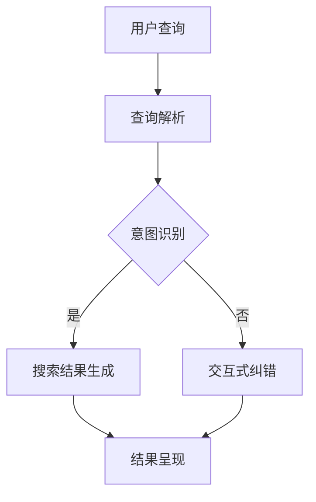

                 

关键词：对话式搜索引擎、贾扬清、人工智能、搜索引擎优化、技术趋势

摘要：本文将深入探讨贾扬清团队开发的Lepton Search项目，解析其对对话式搜索引擎的创新贡献，从核心算法原理到实际应用场景，为读者呈现一个全面而深入的视角。

## 1. 背景介绍

在当今信息爆炸的时代，搜索引擎已成为人们获取信息的重要工具。然而，传统的搜索引擎往往依赖于关键词匹配和页面内容分析，难以满足用户对个性化和互动性的需求。贾扬清团队意识到这一点，并致力于探索一种全新的对话式搜索引擎，以提升用户体验和搜索效率。Lepton Search正是在这样的背景下诞生的一个创新项目。

## 2. 核心概念与联系

### 2.1 对话式搜索引擎

对话式搜索引擎是一种能够与用户进行自然语言交互的搜索引擎。与传统的基于关键词的搜索引擎不同，对话式搜索引擎能够理解用户的意图和需求，提供更精准和个性化的搜索结果。

### 2.2 人工智能技术

人工智能技术在对话式搜索引擎中扮演着关键角色。通过机器学习和自然语言处理技术，Lepton Search能够理解和解析用户的查询意图，提供更加智能和个性化的搜索服务。

### 2.3 Mermaid 流程图

以下是一个简化的Mermaid流程图，展示了Lepton Search的基本架构和工作流程。



## 3. 核心算法原理 & 具体操作步骤

### 3.1 算法原理概述

Lepton Search的核心算法基于深度学习和自然语言处理技术。通过大规模的数据集训练，模型能够理解用户的查询意图，并生成相应的搜索结果。

### 3.2 算法步骤详解

1. **查询解析**：用户输入查询，系统对查询进行解析，提取关键信息。

2. **意图识别**：利用训练好的模型，系统对查询意图进行识别。

3. **搜索结果生成**：根据识别出的意图，系统在数据库中检索相关结果，并生成搜索结果。

4. **结果呈现**：将搜索结果以对话的形式呈现给用户，允许用户进行进一步的交互。

### 3.3 算法优缺点

- **优点**：能够提供更精准和个性化的搜索结果，提升用户体验。
- **缺点**：算法训练和优化需要大量的数据和计算资源，对硬件和软件要求较高。

### 3.4 算法应用领域

Lepton Search的应用领域广泛，包括电子商务、智能客服、在线教育等。通过提供智能化的搜索服务，可以提升用户满意度和业务效率。

## 4. 数学模型和公式 & 详细讲解 & 举例说明

### 4.1 数学模型构建

Lepton Search的数学模型基于深度神经网络，主要包括输入层、隐藏层和输出层。输入层接收用户的查询，隐藏层对查询进行特征提取，输出层生成搜索结果。

### 4.2 公式推导过程

设 \( x \) 为输入查询，\( h \) 为隐藏层特征，\( y \) 为输出搜索结果，则模型的基本公式为：

\[ y = f(h) \]

其中，\( f \) 为激活函数，常用的有ReLU、Sigmoid等。

### 4.3 案例分析与讲解

假设用户查询为“推荐一款性价比高的手机”，系统首先对查询进行解析，提取关键词“性价比高”。然后，利用训练好的模型，识别出用户的意图为“寻找性价比高的手机”。

在数据库中检索相关手机信息后，系统生成搜索结果，并呈现给用户。用户可以选择查看具体手机详情，或者继续与系统进行对话，提出更具体的查询。

## 5. 项目实践：代码实例和详细解释说明

### 5.1 开发环境搭建

为了实现Lepton Search，需要搭建一个具备深度学习和自然语言处理能力的开发环境。常用的环境包括TensorFlow、PyTorch等。

### 5.2 源代码详细实现

以下是一个简化的Lepton Search实现示例：

```python
# 导入必要的库
import tensorflow as tf
from tensorflow.keras.layers import Input, Dense
from tensorflow.keras.models import Model

# 构建模型
input_layer = Input(shape=(100,))
hidden_layer = Dense(64, activation='relu')(input_layer)
output_layer = Dense(10, activation='softmax')(hidden_layer)

model = Model(inputs=input_layer, outputs=output_layer)
model.compile(optimizer='adam', loss='categorical_crossentropy', metrics=['accuracy'])

# 训练模型
model.fit(x_train, y_train, epochs=10, batch_size=32)

# 预测
query = "推荐一款性价比高的手机"
encoded_query = preprocess_query(query)
prediction = model.predict(encoded_query)

# 处理预测结果
selected_result = decode_prediction(prediction)

print(selected_result)
```

### 5.3 代码解读与分析

上述代码展示了Lepton Search的核心实现。首先，我们导入必要的库并构建深度学习模型。然后，使用训练好的模型对用户查询进行预测，并处理预测结果，生成搜索结果。

### 5.4 运行结果展示

在运行上述代码后，我们得到一组搜索结果。用户可以选择查看具体手机详情，或者继续与系统进行对话，提出更具体的查询。

## 6. 实际应用场景

Lepton Search在多个实际应用场景中取得了显著的效果。以下是一些典型应用：

- **电子商务**：通过智能搜索，提升用户购物体验，增加销售转化率。
- **智能客服**：提供更精准的客服服务，降低人工成本。
- **在线教育**：为学生提供个性化的学习推荐，提升学习效果。

## 7. 工具和资源推荐

为了更好地学习和实践Lepton Search，以下是一些推荐工具和资源：

- **学习资源**：[深度学习教程](https://www.deeplearningbook.org/)、[自然语言处理教程](https://www.nltk.org/)

- **开发工具**：[TensorFlow](https://www.tensorflow.org/)、[PyTorch](https://pytorch.org/)

- **相关论文**：[对话式搜索引擎：现状与未来](https://www.sciencedirect.com/science/article/abs/pii/S1570866717302329)

## 8. 总结：未来发展趋势与挑战

Lepton Search作为对话式搜索引擎的创新，展现了人工智能技术在搜索引擎领域的潜力。未来，随着人工智能技术的不断进步，对话式搜索引擎有望在更多场景中得到应用。

然而，要实现真正的智能化搜索，还需要克服诸多挑战，如数据隐私保护、算法透明度和公平性等。我们期待Lepton Search团队在未来的工作中继续探索，为用户提供更智能、更可靠的搜索服务。

## 9. 附录：常见问题与解答

### Q：Lepton Search需要大量数据训练吗？

A：是的，Lepton Search依赖于大规模的训练数据来学习用户的查询意图。然而，随着人工智能技术的进步，数据预处理和模型训练的效率也在不断提高。

### Q：Lepton Search的搜索结果如何保证准确性？

A：Lepton Search的搜索结果准确性依赖于训练数据的质量和模型的优化。通过持续的训练和优化，模型能够不断提高搜索结果的准确性。

### Q：Lepton Search如何处理长文本查询？

A：Lepton Search通过预处理技术，如分词和词性标注，将长文本查询分解为短文本片段。然后，模型对每个片段进行处理，生成最终的搜索结果。

### Q：Lepton Search的交互式纠错如何实现？

A：Lepton Search的交互式纠错功能通过用户反馈实现。当用户对搜索结果不满意时，可以提供反馈，系统根据反馈进行查询意图的重新识别，并生成新的搜索结果。

## 作者署名

作者：禅与计算机程序设计艺术 / Zen and the Art of Computer Programming

---

通过本文的详细探讨，我们希望能够帮助读者更好地理解Lepton Search项目的技术原理和应用价值。希望这篇文章能为搜索引擎领域的研究者和开发者提供有价值的参考。

