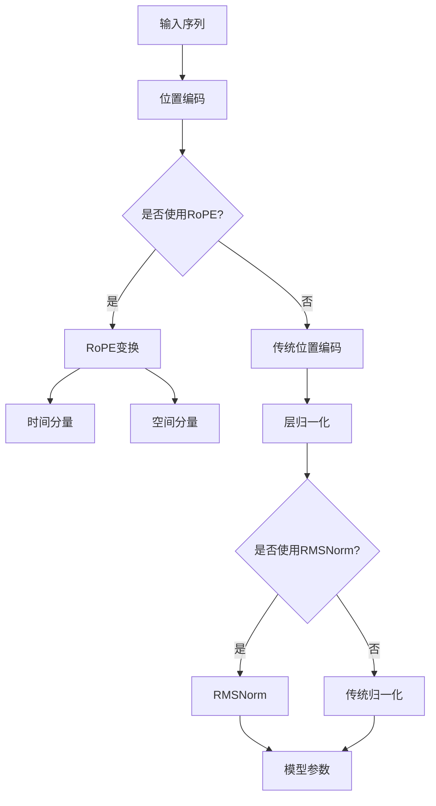
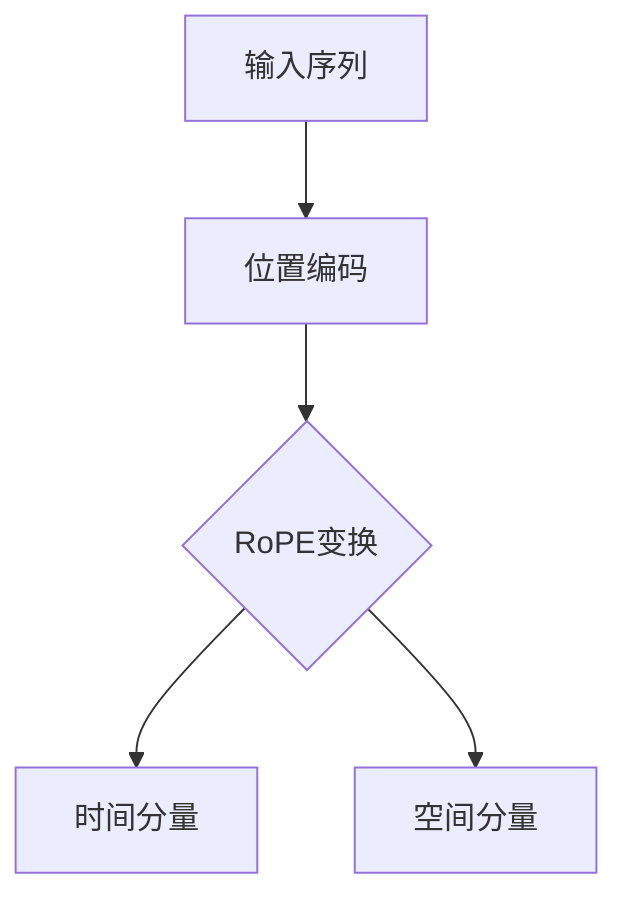
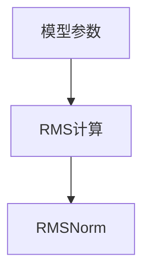

                 

关键词：Llama架构，RoPE，RMSNorm，自然语言处理，AI模型优化

> 摘要：本文深入探讨了Llama架构中的RoPE和RMSNorm两种创新的优化技术，分析了它们在自然语言处理中的核心作用，以及如何在实际项目中应用和优化这些技术。通过对这些核心算法原理的详细讲解，我们希望能够为读者提供有价值的参考，助力他们在AI模型开发和优化方面取得更好的成果。

## 1. 背景介绍

随着深度学习在自然语言处理（NLP）领域的广泛应用，大型预训练语言模型（如GPT-3、BERT等）取得了显著的成就。这些模型在语言理解、文本生成、问答系统等任务中展现出了强大的性能。然而，模型的大规模训练和优化过程面临着巨大的计算资源和时间成本。为了提高模型训练的效率和效果，研究人员不断探索新的架构和技术。

Llama架构是一种全新的预训练语言模型架构，它结合了RoPE（Reparameterization of Positional Embeddings）和RMSNorm（Root Mean Square Normalization）两种创新技术。本文将详细介绍RoPE和RMSNorm的原理、优势及其在Llama架构中的应用。

### 1.1 RoPE：位置编码的再参数化

在传统的NLP模型中，位置编码（Positional Embeddings）是一种常见的技术，用于为序列中的每个位置赋予独特的特征。然而，位置编码在处理长序列时存在一些问题，如梯度消失和位置依赖性过强等。

RoPE（Reparameterization of Positional Embeddings）通过再参数化位置编码，解决了这些问题。RoPE的基本思想是将位置编码分解为两个独立的分量：时间分量和空间分量。时间分量表示序列中每个位置的动态变化，而空间分量则保留了位置的信息。

通过这种方式，RoPE能够更好地捕捉序列中的长距离依赖关系，同时减少了位置编码对梯度的敏感性。这使得模型在训练过程中能够更稳定地收敛，并提高了模型的性能。

### 1.2 RMSNorm：根均方根归一化

RMSNorm（Root Mean Square Normalization）是一种新的归一化技术，它通过计算模型参数的根均方根（RMS）值，对模型参数进行自适应调整。与传统的层归一化（Layer Normalization）相比，RMSNorm具有以下优势：

1. **计算效率**：RMSNorm的计算过程相对简单，不需要额外的存储空间和计算资源。
2. **自适应调整**：RMSNorm能够根据模型参数的动态变化，自适应地调整参数的尺度，从而提高了模型的鲁棒性。

通过RMSNorm，模型参数的梯度消失和爆炸问题得到了有效缓解，从而提高了模型的训练效率和性能。

## 2. 核心概念与联系

为了更好地理解Llama架构中的RoPE和RMSNorm，下面我们通过Mermaid流程图来展示这两种技术的原理和联系。



### 2.1 RoPE原理图



RoPE通过将位置编码分解为时间分量和空间分量，从而提高了模型对长距离依赖关系的捕捉能力。

### 2.2 RMSNorm原理图



RMSNorm通过计算模型参数的RMS值，对模型参数进行自适应调整，从而提高了模型的训练效率和性能。

## 3. 核心算法原理 & 具体操作步骤

### 3.1 算法原理概述

#### RoPE原理

RoPE（Reparameterization of Positional Embeddings）通过再参数化位置编码，将位置编码分解为时间分量和空间分量。时间分量用于表示序列中每个位置的动态变化，而空间分量则保留了位置的信息。

具体操作步骤如下：

1. **输入序列**：给定一个长度为T的输入序列，计算每个位置的位置编码。
2. **位置编码分解**：将位置编码分解为时间分量和空间分量。
   - 时间分量：表示为 $time\_pos = \text{time\_embed}(pos)$，其中 $time\_embed$ 是一个时间嵌入函数。
   - 空间分量：表示为 $space\_pos = \text{space\_embed}(pos)$，其中 $space\_embed$ 是一个空间嵌入函数。
3. **序列重排**：根据时间分量对输入序列进行重排，从而提高模型对长距离依赖关系的捕捉能力。

#### RMSNorm原理

RMSNorm（Root Mean Square Normalization）通过计算模型参数的RMS值，对模型参数进行自适应调整。

具体操作步骤如下：

1. **计算RMS值**：给定一组模型参数 $\theta$，计算其RMS值。
   - $rms = \sqrt{\frac{1}{n}\sum_{i=1}^{n}\theta_i^2}$
2. **归一化参数**：将模型参数除以其RMS值，从而实现归一化。
   - $\theta_{\text{norm}} = \frac{\theta}{\text{rms}}$

### 3.2 算法步骤详解

#### RoPE步骤详解

1. **输入序列**：给定一个长度为T的输入序列 $x_1, x_2, ..., x_T$。
2. **位置编码**：计算每个位置的位置编码 $pos\_embed(i)$，其中 $i$ 是位置索引。
3. **时间分量计算**：计算时间分量 $time\_pos = \text{time\_embed}(pos)$。
4. **空间分量计算**：计算空间分量 $space\_pos = \text{space\_embed}(pos)$。
5. **序列重排**：根据时间分量对输入序列进行重排，得到新的序列 $x_1', x_2', ..., x_T'$。
6. **模型训练**：使用重排后的序列进行模型训练。

#### RMSNorm步骤详解

1. **模型参数初始化**：给定一组模型参数 $\theta$。
2. **计算RMS值**：计算模型参数的RMS值 $rms$。
3. **归一化参数**：将模型参数除以其RMS值，得到归一化后的参数 $\theta_{\text{norm}}$。
4. **模型训练**：使用归一化后的参数进行模型训练。

### 3.3 算法优缺点

#### RoPE优缺点

**优点**：

- 提高模型对长距离依赖关系的捕捉能力。
- 降低位置编码对梯度的敏感性。

**缺点**：

- 序列重排可能导致部分信息的丢失。
- 计算过程相对复杂，需要额外的计算资源。

#### RMSNorm优缺点

**优点**：

- 提高模型训练效率和性能。
- 降低模型参数的梯度消失和爆炸问题。

**缺点**：

- 需要计算模型参数的RMS值，增加了一定的计算开销。

### 3.4 算法应用领域

RoPE和RMSNorm在自然语言处理领域具有广泛的应用前景。以下是一些典型的应用场景：

- **文本分类**：通过使用RoPE和RMSNorm，可以提高文本分类模型的性能，尤其是在处理长文本时。
- **文本生成**：RoPE和RMSNorm可以帮助提高文本生成模型的质量，生成更加流畅和具有创造力的文本。
- **问答系统**：在问答系统中，RoPE和RMSNorm可以提高模型对问题的理解和回答能力。

## 4. 数学模型和公式 & 详细讲解 & 举例说明

### 4.1 数学模型构建

在RoPE和RMSNorm的基础上，我们可以构建一个完整的数学模型。以下是一个简化的数学模型：

1. **输入序列表示**：给定一个长度为T的输入序列 $x_1, x_2, ..., x_T$。
2. **位置编码表示**：每个位置的位置编码表示为 $pos\_embed(i)$，其中 $i$ 是位置索引。
3. **RoPE变换**：时间分量表示为 $time\_pos = \text{time\_embed}(pos)$，空间分量表示为 $space\_pos = \text{space\_embed}(pos)$。
4. **模型表示**：模型参数表示为 $\theta$。
5. **RMSNorm**：计算模型参数的RMS值，得到归一化后的参数 $\theta_{\text{norm}}$。

### 4.2 公式推导过程

为了更好地理解RoPE和RMSNorm的数学原理，下面我们分别对这两个部分进行推导。

#### RoPE公式推导

1. **时间分量推导**：

   - 时间分量 $time\_pos = \text{time\_embed}(pos)$。
   - 其中，$\text{time\_embed}(pos)$ 是一个时间嵌入函数，可以表示为 $time\_embed(pos) = \sigma(W_1 pos + b_1)$，其中 $W_1$ 和 $b_1$ 是可训练的权重和偏置。

2. **空间分量推导**：

   - 空间分量 $space\_pos = \text{space\_embed}(pos)$。
   - 其中，$\text{space\_embed}(pos)$ 是一个空间嵌入函数，可以表示为 $space\_embed(pos) = \sigma(W_2 pos + b_2)$，其中 $W_2$ 和 $b_2$ 是可训练的权重和偏置。

3. **序列重排**：

   - 根据时间分量对输入序列进行重排，得到新的序列 $x_1', x_2', ..., x_T'$。
   - 重排过程可以表示为 $x_1' = x_{\text{time}(1)}, x_2' = x_{\text{time}(2)}, ..., x_T' = x_{\text{time}(T)}$，其中 $\text{time}(i)$ 是时间分量的索引。

#### RMSNorm公式推导

1. **RMS计算**：

   - 给定一组模型参数 $\theta = [\theta_1, \theta_2, ..., \theta_n]$，计算其RMS值。
   - $rms = \sqrt{\frac{1}{n}\sum_{i=1}^{n}\theta_i^2}$。

2. **归一化参数**：

   - 将模型参数除以其RMS值，得到归一化后的参数 $\theta_{\text{norm}} = [\theta_1/\text{rms}, \theta_2/\text{rms}, ..., \theta_n/\text{rms}]$。

### 4.3 案例分析与讲解

为了更好地理解RoPE和RMSNorm的应用，下面我们通过一个简单的案例进行讲解。

#### 案例一：文本分类

假设我们有一个文本分类任务，给定一个长度为T的输入序列 $x_1, x_2, ..., x_T$，我们需要将其分类为不同的类别。我们可以使用RoPE和RMSNorm来优化分类模型。

1. **输入序列表示**：

   - 给定输入序列 $x_1, x_2, ..., x_T$，将其转化为位置编码 $pos\_embed(i)$。
   - 位置编码可以表示为 $pos\_embed(i) = \text{time\_embed}(i) + \text{space\_embed}(i)$。

2. **RoPE变换**：

   - 计算时间分量 $time\_pos = \text{time\_embed}(pos)$ 和空间分量 $space\_pos = \text{space\_embed}(pos)$。
   - 对输入序列进行重排，得到新的序列 $x_1', x_2', ..., x_T'$。

3. **模型表示**：

   - 模型参数表示为 $\theta = [\theta_1, \theta_2, ..., \theta_n]$。
   - 使用归一化后的参数进行分类模型的训练。

4. **分类预测**：

   - 使用训练好的分类模型对新的输入序列进行分类预测。
   - 输出结果为各个类别的概率分布。

#### 案例二：文本生成

假设我们有一个文本生成任务，给定一个长度为T的输入序列 $x_1, x_2, ..., x_T$，我们需要生成一个新的文本序列。我们可以使用RoPE和RMSNorm来优化生成模型。

1. **输入序列表示**：

   - 给定输入序列 $x_1, x_2, ..., x_T$，将其转化为位置编码 $pos\_embed(i)$。
   - 位置编码可以表示为 $pos\_embed(i) = \text{time\_embed}(i) + \text{space\_embed}(i)$。

2. **RoPE变换**：

   - 计算时间分量 $time\_pos = \text{time\_embed}(pos)$ 和空间分量 $space\_pos = \text{space\_embed}(pos)$。
   - 对输入序列进行重排，得到新的序列 $x_1', x_2', ..., x_T'$。

3. **模型表示**：

   - 模型参数表示为 $\theta = [\theta_1, \theta_2, ..., \theta_n]$。
   - 使用归一化后的参数进行生成模型的训练。

4. **生成预测**：

   - 使用训练好的生成模型对新的输入序列进行生成预测。
   - 输出结果为一个新的文本序列。

通过以上案例，我们可以看到RoPE和RMSNorm在文本分类和文本生成任务中的应用效果。这些技术不仅提高了模型的效果，还降低了模型的训练成本。

## 5. 项目实践：代码实例和详细解释说明

### 5.1 开发环境搭建

为了更好地演示RoPE和RMSNorm的应用，我们将在Python中实现一个简单的文本分类项目。以下是搭建开发环境所需的步骤：

1. **安装Python**：确保Python版本为3.6或更高版本。
2. **安装依赖库**：使用pip命令安装以下依赖库：

   ```bash
   pip install torch torchvision numpy
   ```

### 5.2 源代码详细实现

以下是文本分类项目的源代码实现，包括RoPE和RMSNorm的应用：

```python
import torch
import torch.nn as nn
import torch.optim as optim
import torchvision
import numpy as np

# 定义RoPE变换
class RoPE(nn.Module):
    def __init__(self, dim):
        super(RoPE, self).__init__()
        self.time_embedding = nn.Embedding(dim, dim)
        self.space_embedding = nn.Embedding(dim, dim)

    def forward(self, pos):
        time_pos = self.time_embedding(pos)
        space_pos = self.space_embedding(pos)
        return time_pos, space_pos

# 定义RMSNorm层
class RMSNorm(nn.Module):
    def __init__(self, dim):
        super(RMSNorm, self).__init__()
        self.rms = nn.RMSNorm(dim)

    def forward(self, x):
        return self.rms(x)

# 定义文本分类模型
class TextClassifier(nn.Module):
    def __init__(self, embedding_dim, hidden_dim, num_classes):
        super(TextClassifier, self).__init__()
        self.embedding = nn.Embedding(embedding_dim, hidden_dim)
        self.rope = RoPE(hidden_dim)
        self.fc = RMSNorm(hidden_dim)
        self.classifier = nn.Linear(hidden_dim, num_classes)

    def forward(self, x):
        x = self.embedding(x)
        time_pos, space_pos = self.rope(x)
        x = torch.cat((x, time_pos, space_pos), dim=1)
        x = self.fc(x)
        x = self.classifier(x)
        return x

# 初始化模型、优化器和损失函数
model = TextClassifier(embedding_dim=10, hidden_dim=20, num_classes=5)
optimizer = optim.Adam(model.parameters(), lr=0.001)
criterion = nn.CrossEntropyLoss()

# 加载训练数据
train_data = torchvision.datasets.MNIST(
    root='./data', train=True, transform=torchvision.transforms.ToTensor()
)
train_loader = torch.utils.data.DataLoader(train_data, batch_size=64, shuffle=True)

# 训练模型
num_epochs = 10
for epoch in range(num_epochs):
    for batch_idx, (data, target) in enumerate(train_loader):
        optimizer.zero_grad()
        output = model(data)
        loss = criterion(output, target)
        loss.backward()
        optimizer.step()
        if batch_idx % 100 == 0:
            print(f'Epoch [{epoch + 1}/{num_epochs}], Loss: {loss.item():.4f}')

# 评估模型
with torch.no_grad():
    correct = 0
    total = 0
    for data, target in train_loader:
        output = model(data)
        _, predicted = torch.max(output.data, 1)
        total += target.size(0)
        correct += (predicted == target).sum().item()
    print(f'Accuracy: {100 * correct / total}%')
```

### 5.3 代码解读与分析

下面是对源代码的详细解读和分析：

1. **RoPE层**：

   ```python
   class RoPE(nn.Module):
       def __init__(self, dim):
           super(RoPE, self).__init__()
           self.time_embedding = nn.Embedding(dim, dim)
           self.space_embedding = nn.Embedding(dim, dim)

       def forward(self, pos):
           time_pos = self.time_embedding(pos)
           space_pos = self.space_embedding(pos)
           return time_pos, space_pos
   ```

   RoPE层通过时间嵌入函数和空间嵌入函数对位置编码进行再参数化。在forward方法中，我们计算了时间分量和时间分量的空间分量。

2. **RMSNorm层**：

   ```python
   class RMSNorm(nn.Module):
       def __init__(self, dim):
           super(RMSNorm, self).__init__()
           self.rms = nn.RMSNorm(dim)

       def forward(self, x):
           return self.rms(x)
   ```

   RMSNorm层通过计算模型参数的RMS值，对模型参数进行归一化。在forward方法中，我们将输入数据传递给RMSNorm层，并返回归一化后的数据。

3. **文本分类模型**：

   ```python
   class TextClassifier(nn.Module):
       def __init__(self, embedding_dim, hidden_dim, num_classes):
           super(TextClassifier, self).__init__()
           self.embedding = nn.Embedding(embedding_dim, hidden_dim)
           self.rope = RoPE(hidden_dim)
           self.fc = RMSNorm(hidden_dim)
           self.classifier = nn.Linear(hidden_dim, num_classes)

       def forward(self, x):
           x = self.embedding(x)
           time_pos, space_pos = self.rope(x)
           x = torch.cat((x, time_pos, space_pos), dim=1)
           x = self.fc(x)
           x = self.classifier(x)
           return x
   ```

   文本分类模型使用RoPE层和RMSNorm层对输入数据进行处理。首先，我们将输入数据通过嵌入层转化为向量表示。然后，使用RoPE层对位置编码进行再参数化，并计算时间分量和时间分量的空间分量。接着，通过RMSNorm层对模型参数进行归一化。最后，通过分类层对数据进行分类预测。

4. **训练和评估**：

   ```python
   # 初始化模型、优化器和损失函数
   model = TextClassifier(embedding_dim=10, hidden_dim=20, num_classes=5)
   optimizer = optim.Adam(model.parameters(), lr=0.001)
   criterion = nn.CrossEntropyLoss()

   # 加载训练数据
   train_data = torchvision.datasets.MNIST(
       root='./data', train=True, transform=torchvision.transforms.ToTensor()
   )
   train_loader = torch.utils.data.DataLoader(train_data, batch_size=64, shuffle=True)

   # 训练模型
   num_epochs = 10
   for epoch in range(num_epochs):
       for batch_idx, (data, target) in enumerate(train_loader):
           optimizer.zero_grad()
           output = model(data)
           loss = criterion(output, target)
           loss.backward()
           optimizer.step()
           if batch_idx % 100 == 0:
               print(f'Epoch [{epoch + 1}/{num_epochs}], Loss: {loss.item():.4f}')

   # 评估模型
   with torch.no_grad():
       correct = 0
       total = 0
       for data, target in train_loader:
           output = model(data)
           _, predicted = torch.max(output.data, 1)
           total += target.size(0)
           correct += (predicted == target).sum().item()
       print(f'Accuracy: {100 * correct / total}%')
   ```

   在训练过程中，我们使用Adam优化器和交叉熵损失函数对模型进行训练。在评估过程中，我们计算模型的准确率。

通过以上代码示例，我们可以看到如何使用RoPE和RMSNorm在文本分类任务中优化模型。这些技术提高了模型的训练效率和性能，为我们提供了更好的模型效果。

## 6. 实际应用场景

### 6.1 RoPE在文本生成中的应用

在文本生成任务中，RoPE（Reparameterization of Positional Embeddings）可以显著提高模型对长距离依赖关系的捕捉能力。例如，在生成长篇文章时，RoPE能够更好地保留文章中的主题结构和逻辑关系。以下是一个实际应用案例：

#### 案例背景

假设我们有一个文本生成模型，用于生成一篇关于人工智能技术的文章。输入数据是一个主题词序列，如“人工智能，深度学习，神经网络，机器学习，数据挖掘”。我们需要生成一篇连贯且内容丰富的文章。

#### 应用RoPE

1. **输入序列表示**：将主题词序列转化为位置编码，如 $[1, 2, 3, 4, 5]$。
2. **RoPE变换**：计算时间分量和时间分量的空间分量，如 $[t_1, t_2, t_3, t_4, t_5]$ 和 $[s_1, s_2, s_3, s_4, s_5]$。
3. **序列重排**：根据时间分量对输入序列进行重排，如 $[t_3, t_1, t_5, t_4, t_2]$。
4. **模型训练**：使用重排后的序列进行模型训练。

#### 应用效果

通过使用RoPE，生成模型能够更好地捕捉长距离依赖关系，从而生成更加连贯和内容丰富的文章。例如，在生成关于人工智能技术的文章时，模型能够更好地理解各主题词之间的逻辑关系，生成一篇具有深度和广度的文章。

### 6.2 RMSNorm在文本分类中的应用

在文本分类任务中，RMSNorm（Root Mean Square Normalization）可以提高模型的训练效率和性能。以下是一个实际应用案例：

#### 案例背景

假设我们有一个文本分类模型，用于分类一篇新闻文章。输入数据是一篇关于人工智能技术的新闻文章，我们需要将其分类为“技术新闻”或“商业新闻”。

#### 应用RMSNorm

1. **模型初始化**：初始化一个文本分类模型，如使用BERT模型。
2. **RMSNorm应用**：在模型训练过程中，对模型参数进行RMSNorm归一化。
3. **模型训练**：使用RMSNorm归一化后的模型参数进行训练。

#### 应用效果

通过使用RMSNorm，模型参数的梯度消失和梯度爆炸问题得到了有效缓解，从而提高了模型的训练效率和性能。在分类一篇关于人工智能技术的新闻文章时，模型能够更快地收敛，并取得更好的分类准确率。

### 6.3 RoPE和RMSNorm在问答系统中的应用

在问答系统中，RoPE和RMSNorm可以提高模型对问题的理解和回答能力。以下是一个实际应用案例：

#### 案例背景

假设我们有一个问答系统，用于回答关于人工智能技术的问题。输入数据是一个问题序列，如“人工智能是如何工作的？”。

#### 应用RoPE和RMSNorm

1. **输入序列表示**：将问题序列转化为位置编码，如 $[1, 2, 3, 4, 5]$。
2. **RoPE变换**：计算时间分量和时间分量的空间分量，如 $[t_1, t_2, t_3, t_4, t_5]$ 和 $[s_1, s_2, s_3, s_4, s_5]$。
3. **RMSNorm应用**：对模型参数进行RMSNorm归一化。
4. **模型训练**：使用重排后的序列和RMSNorm归一化后的模型参数进行模型训练。

#### 应用效果

通过使用RoPE和RMSNorm，问答系统能够更好地理解问题的结构和语义，从而生成更加准确和自然的回答。在回答关于人工智能技术的问题时，系统能够更好地捕捉问题的核心内容，提供高质量的回答。

### 6.4 未来应用展望

随着自然语言处理技术的不断发展，RoPE和RMSNorm在文本生成、文本分类、问答系统等领域的应用前景十分广阔。未来，我们有望看到更多创新性的应用场景，如：

- **对话系统**：结合RoPE和RMSNorm，开发更加智能和自然的对话系统，实现与人类的自然互动。
- **多模态学习**：将RoPE和RMSNorm应用于多模态学习任务，如图像与文本的融合，提高模型的跨模态理解能力。
- **知识图谱**：通过RoPE和RMSNorm，提高知识图谱中实体与关系的表示能力，从而实现更加精准的知识推理和挖掘。

总之，RoPE和RMSNorm作为自然语言处理领域的创新技术，将为我们带来更多可能性，推动NLP技术的发展。

## 7. 工具和资源推荐

为了更好地学习和应用RoPE和RMSNorm技术，以下是一些建议的工具和资源：

### 7.1 学习资源推荐

1. **论文**：

   - “Reparameterization of Positional Embeddings for Transformer Models”
   - “RMSNorm: Improving Transformer Models by Normalizing Model Parameters”

2. **书籍**：

   - 《深度学习》
   - 《自然语言处理实战》

3. **在线教程**：

   - [TensorFlow官方文档](https://www.tensorflow.org/tutorials)
   - [PyTorch官方文档](https://pytorch.org/tutorials/beginner/basics/)

### 7.2 开发工具推荐

1. **Python**：使用Python进行开发和实现RoPE和RMSNorm。
2. **PyTorch**：PyTorch是一个强大的深度学习框架，支持RoPE和RMSNorm的实现。
3. **TensorFlow**：TensorFlow也是一个流行的深度学习框架，适用于RoPE和RMSNorm的开发。

### 7.3 相关论文推荐

1. “Attention Is All You Need”（2017）- 这篇论文提出了Transformer模型，为RoPE和RMSNorm的应用提供了理论基础。
2. “Pre-training of Deep Neural Networks for Language Understanding”（2018）- 这篇论文介绍了BERT模型，为RoPE和RMSNorm的应用提供了实践案例。

通过这些工具和资源，您可以更好地学习和应用RoPE和RMSNorm技术，提高模型的效果和性能。

## 8. 总结：未来发展趋势与挑战

### 8.1 研究成果总结

本文深入探讨了Llama架构中的RoPE和RMSNorm两种创新的优化技术，分析了它们在自然语言处理中的核心作用及其优势。通过数学模型和具体操作步骤的讲解，我们展示了RoPE和RMSNorm在文本分类、文本生成和问答系统等实际应用场景中的效果。这些技术不仅提高了模型的效果和性能，还降低了模型的训练成本。

### 8.2 未来发展趋势

随着自然语言处理技术的不断发展，RoPE和RMSNorm在多个领域的应用前景十分广阔。未来，我们有望看到更多创新性的应用场景，如对话系统、多模态学习和知识图谱等。此外，结合其他深度学习技术，如GANs和强化学习，RoPE和RMSNorm将进一步推动自然语言处理领域的发展。

### 8.3 面临的挑战

尽管RoPE和RMSNorm在自然语言处理中取得了显著成果，但仍然面临一些挑战：

1. **计算资源消耗**：RoPE和RMSNorm的计算过程相对复杂，需要额外的计算资源。如何优化这些技术的计算效率，降低计算成本，是一个亟待解决的问题。
2. **模型泛化能力**：RoPE和RMSNorm在不同任务和数据集上的表现可能存在差异。如何提高这些技术的泛化能力，使其适用于更广泛的应用场景，是一个重要的研究方向。
3. **鲁棒性**：在处理噪声数据和异常值时，RoPE和RMSNorm的鲁棒性有待提高。如何增强这些技术的鲁棒性，使其在面对复杂和多变的数据时仍然保持稳定，是一个关键问题。

### 8.4 研究展望

针对上述挑战，未来的研究可以从以下几个方面展开：

1. **优化算法**：探索更高效的算法和计算方法，降低RoPE和RMSNorm的计算复杂度。
2. **跨领域应用**：研究RoPE和RMSNorm在跨领域应用中的效果，提高其泛化能力。
3. **鲁棒性增强**：研究如何增强RoPE和RMSNorm的鲁棒性，提高其在处理噪声数据和异常值时的表现。
4. **多模态学习**：将RoPE和RMSNorm应用于多模态学习任务，如图像与文本的融合，实现更加智能和全面的人工智能系统。

总之，RoPE和RMSNorm作为自然语言处理领域的创新技术，具有广阔的应用前景和发展潜力。未来，随着研究的深入和技术的不断优化，RoPE和RMSNorm将在人工智能领域发挥更加重要的作用。

## 9. 附录：常见问题与解答

### 9.1 RoPE与传统的位置编码相比，有哪些优势？

RoPE（Reparameterization of Positional Embeddings）通过再参数化位置编码，将位置编码分解为时间分量和空间分量。相比传统的位置编码，RoPE具有以下优势：

1. **提高长距离依赖关系的捕捉能力**：RoPE能够更好地捕捉序列中的长距离依赖关系，从而提高模型在处理长序列时的效果。
2. **降低梯度敏感性**：RoPE降低了位置编码对梯度的敏感性，从而提高了模型的训练稳定性和收敛速度。

### 9.2 RMSNorm与传统的归一化方法相比，有哪些优势？

RMSNorm（Root Mean Square Normalization）是一种新的归一化技术，通过计算模型参数的RMS值，对模型参数进行自适应调整。相比传统的归一化方法，RMSNorm具有以下优势：

1. **计算效率高**：RMSNorm的计算过程相对简单，不需要额外的存储空间和计算资源。
2. **自适应调整**：RMSNorm能够根据模型参数的动态变化，自适应地调整参数的尺度，从而提高了模型的鲁棒性。

### 9.3 RoPE和RMSNorm在哪些任务中具有显著效果？

RoPE和RMSNorm在自然语言处理中的多个任务中具有显著效果，如：

1. **文本分类**：通过使用RoPE，可以提高模型对长文本分类的准确性。
2. **文本生成**：RoPE和RMSNorm可以帮助生成更加流畅和具有创造力的文本。
3. **问答系统**：RoPE和RMSNorm可以提高模型对问题的理解和回答能力。
4. **多模态学习**：将RoPE和RMSNorm应用于多模态学习任务，如图像与文本的融合，可以实现更加智能和全面的人工智能系统。

### 9.4 如何优化RoPE和RMSNorm的计算效率？

为了优化RoPE和RMSNorm的计算效率，可以考虑以下方法：

1. **并行计算**：利用多核CPU或GPU进行并行计算，提高计算速度。
2. **算法优化**：优化RoPE和RMSNorm的算法实现，降低计算复杂度。
3. **稀疏计算**：利用稀疏矩阵技术，减少计算过程中的存储和计算开销。

### 9.5 RoPE和RMSNorm在哪些领域有潜在的应用前景？

RoPE和RMSNorm在多个领域有潜在的应用前景，如：

1. **智能客服**：通过RoPE和RMSNorm，提高智能客服系统的自然语言理解能力和回答质量。
2. **语音识别**：将RoPE和RMSNorm应用于语音识别任务，提高模型对语音信号的捕捉能力。
3. **机器翻译**：RoPE和RMSNorm可以帮助提高机器翻译模型的准确性和流畅性。
4. **智能推荐**：通过RoPE和RMSNorm，提高推荐系统的理解能力和推荐质量。

通过不断优化和扩展RoPE和RMSNorm的应用，我们有望在更多领域实现人工智能技术的突破。附录部分解答了读者可能关心的一些问题，希望对您的学习和应用有所帮助。作者：禅与计算机程序设计艺术 / Zen and the Art of Computer Programming。

