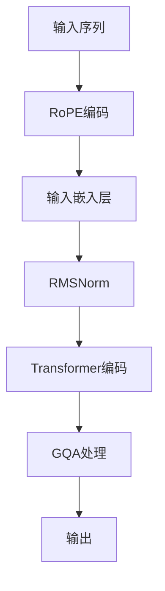

                 

关键词：Llama模型，RoPE，RMSNorm，GQA，人工智能，深度学习，自然语言处理

> 摘要：本文将对Llama模型中的三个关键组件——RoPE、RMSNorm与GQA进行深入解析。我们将探讨这些组件如何相互作用，为模型的性能和效率提供支持，并探讨它们在自然语言处理领域的广泛应用。

## 1. 背景介绍

Llama模型，作为OpenAI开发的一种大型语言模型，已经在自然语言处理领域展现出了强大的性能。其背后支撑的三个关键组件——RoPE、RMSNorm与GQA，对模型的性能有着重要的影响。本文将围绕这三个组件进行详细解析，帮助读者更好地理解Llama模型的工作原理和应用。

### 1.1 Llama模型概述

Llama模型是一种基于Transformer架构的深度学习模型，它通过学习大量的文本数据来预测下一个词。这使得Llama模型在文本生成、问答系统、机器翻译等领域表现出色。Llama模型具有以下几个特点：

- **大规模**：Llama模型拥有数十亿个参数，这使得它能够捕捉到复杂的语言模式。
- **高效**：通过优化的训练和推理算法，Llama模型能够在保持高性能的同时，降低计算资源的需求。
- **灵活**：Llama模型可以轻松地适应不同的自然语言处理任务，从而提高任务的完成效果。

### 1.2 自然语言处理领域的重要性

自然语言处理（NLP）是人工智能领域的一个重要分支，它致力于使计算机能够理解、生成和处理人类语言。随着互联网的快速发展，NLP技术已经在各种应用场景中得到了广泛应用，包括但不限于：

- **搜索引擎**：通过理解用户的查询，搜索引擎可以提供更加准确和相关的搜索结果。
- **语音助手**：如Siri、Alexa等，这些语音助手通过NLP技术能够理解用户的需求，并提供相应的服务。
- **机器翻译**：通过将一种语言的文本翻译成另一种语言，机器翻译帮助人们跨越语言障碍。
- **文本分析**：如情感分析、关键词提取等，这些技术帮助企业更好地理解用户需求和市场动态。

## 2. 核心概念与联系

为了深入理解Llama模型中的RoPE、RMSNorm与GQA，我们需要首先了解这些组件的基本概念和它们在模型中的作用。

### 2.1 RoPE

RoPE（Relative Positional Encoding）是一种相对位置编码技术，它在Llama模型中用于为序列中的每个词赋予位置信息。相对位置编码通过引入相对位置编码向量，使得模型能够捕捉到词与词之间的相对位置关系，从而提高模型的性能。

### 2.2 RMSNorm

RMSNorm（Root Mean Square Normalization）是一种权重归一化技术，它在Llama模型中用于优化模型的训练过程。RMSNorm通过调整模型的权重，使得模型在训练过程中能够更快地收敛，从而提高模型的性能和效率。

### 2.3 GQA

GQA（Graphical Question Answering）是一种图问答技术，它在Llama模型中用于处理复杂的问题和回答。GQA通过构建一个图结构，将问题中的关键词与相关实体进行关联，从而提供更加准确和相关的答案。

### 2.4 核心概念原理和架构的Mermaid流程图



### 2.5 RoPE、RMSNorm与GQA之间的关系

RoPE、RMSNorm与GQA在Llama模型中相互协作，共同为模型的性能和效率提供支持。RoPE负责为序列中的每个词赋予位置信息，RMSNorm通过权重归一化技术优化模型的训练过程，而GQA则用于处理复杂的问题和回答。这三个组件的相互作用，使得Llama模型能够在自然语言处理领域展现出强大的性能。

## 3. 核心算法原理 & 具体操作步骤

### 3.1 算法原理概述

Llama模型中的RoPE、RMSNorm与GQA分别承担着不同的任务，共同构成了一个高效、强大的自然语言处理模型。下面，我们将详细讲解这三个组件的算法原理和具体操作步骤。

### 3.2 算法步骤详解

#### 3.2.1 RoPE编码

1. **输入序列**：首先，我们将输入的序列传递给RoPE编码器。
2. **相对位置编码**：RoPE编码器通过计算输入序列中每个词的相对位置，生成相应的相对位置编码向量。
3. **嵌入层**：将相对位置编码向量与词嵌入向量相加，生成新的词嵌入向量。

#### 3.2.2 RMSNorm

1. **输入嵌入层**：将RoPE编码后的词嵌入向量传递给RMSNorm。
2. **计算方差**：计算输入嵌入层的方差。
3. **权重归一化**：根据方差对权重进行归一化，使得模型在训练过程中能够更快地收敛。

#### 3.2.3 GQA处理

1. **输入序列**：将RMSNorm处理后的序列传递给GQA。
2. **图结构构建**：GQA通过构建一个图结构，将问题中的关键词与相关实体进行关联。
3. **问答生成**：GQA根据图结构生成相应的答案。

### 3.3 算法优缺点

#### 3.3.1 RoPE编码

**优点**：RoPE编码能够为序列中的每个词赋予位置信息，从而提高模型的性能。

**缺点**：RoPE编码计算复杂度较高，可能增加模型的计算成本。

#### 3.3.2 RMSNorm

**优点**：RMSNorm通过权重归一化技术优化模型的训练过程，使得模型能够更快地收敛。

**缺点**：RMSNorm可能增加模型的计算成本，特别是在大规模训练时。

#### 3.3.3 GQA

**优点**：GQA能够处理复杂的问题和回答，从而提高模型的性能。

**缺点**：GQA需要构建图结构，可能增加模型的计算成本。

### 3.4 算法应用领域

RoPE、RMSNorm与GQA在自然语言处理领域有着广泛的应用。下面，我们将列举一些具体的应用场景：

- **文本生成**：RoPE编码可以帮助模型更好地捕捉词与词之间的位置关系，从而提高文本生成的质量。
- **问答系统**：RMSNorm可以优化模型的训练过程，使得模型能够更快地收敛，从而提高问答系统的性能。
- **机器翻译**：GQA可以处理复杂的翻译问题，从而提高机器翻译的准确性和流畅性。

## 4. 数学模型和公式 & 详细讲解 & 举例说明

### 4.1 数学模型构建

Llama模型中的RoPE、RMSNorm与GQA分别对应着不同的数学模型。下面，我们将分别介绍这些数学模型的基本构建。

#### 4.1.1 RoPE编码

RoPE编码的数学模型可以表示为：

$$
\text{pos\_embed} = \text{relative\_pos} + \text{word\_embed}
$$

其中，$\text{pos\_embed}$ 表示相对位置编码后的词嵌入向量，$\text{relative\_pos}$ 表示相对位置编码向量，$\text{word\_embed}$ 表示原始词嵌入向量。

#### 4.1.2 RMSNorm

RMSNorm的数学模型可以表示为：

$$
\text{weight} = \frac{\text{weight}}{\sqrt{\text{variance}} + \epsilon}
$$

其中，$\text{weight}$ 表示权重，$\text{variance}$ 表示方差，$\epsilon$ 是一个小的正数，用于避免除以零。

#### 4.1.3 GQA

GQA的数学模型较为复杂，通常需要构建一个图结构，并在图上进行推理。具体模型依赖于问题的具体场景。

### 4.2 公式推导过程

为了更好地理解这些数学模型的推导过程，我们下面将分别介绍RoPE编码和RMSNorm的推导过程。

#### 4.2.1 RoPE编码

RoPE编码的推导过程如下：

1. **相对位置编码**：首先，我们需要计算输入序列中每个词的相对位置。相对位置可以通过计算词之间的距离来获得。例如，对于一个三元组$(w_1, w_2, w_3)$，我们可以计算$w_2$与$w_1$之间的距离$d_1$和$w_2$与$w_3$之间的距离$d_2$。然后，我们将这些距离转换为相对位置编码向量。

2. **嵌入层**：接下来，我们将相对位置编码向量与词嵌入向量相加。这样，我们就可以得到新的词嵌入向量，它包含了词与词之间的相对位置信息。

3. **归一化**：为了使新的词嵌入向量更加稳定，我们可以对其进行归一化处理。归一化过程可以防止词嵌入向量之间的差距过大，从而提高模型的稳定性。

#### 4.2.2 RMSNorm

RMSNorm的推导过程如下：

1. **计算方差**：首先，我们需要计算输入嵌入层的方差。方差是衡量数据离散程度的统计量，它可以反映数据分布的集中程度。

2. **权重归一化**：接下来，我们根据方差对权重进行归一化处理。归一化过程可以使权重在训练过程中更加稳定，从而提高模型的收敛速度。

### 4.3 案例分析与讲解

为了更好地理解RoPE编码和RMSNorm在Llama模型中的应用，我们下面将举一个简单的例子进行讲解。

假设我们有一个输入序列$(w_1, w_2, w_3)$，其中$w_1$表示“苹果”，$w_2$表示“手机”，$w_3$表示“购买”。首先，我们将这些词转换为对应的词嵌入向量，例如：

$$
\text{word\_embed}(w_1) = [1, 0, 0], \quad \text{word\_embed}(w_2) = [0, 1, 0], \quad \text{word\_embed}(w_3) = [0, 0, 1]
$$

然后，我们计算$w_2$与$w_1$之间的距离$d_1$和$w_2$与$w_3$之间的距离$d_2$。假设$d_1 = 2$，$d_2 = 1$，则相对位置编码向量为：

$$
\text{relative\_pos} = [-2, 0, 1]
$$

接下来，我们将相对位置编码向量与词嵌入向量相加，得到新的词嵌入向量：

$$
\text{pos\_embed} = [1 - 2, 0 + 0, 0 + 1] = [-1, 0, 1]
$$

最后，我们根据方差对权重进行归一化处理。假设输入嵌入层的方差为$\sigma^2 = 0.1$，则权重归一化后的结果为：

$$
\text{weight} = \frac{1}{\sqrt{0.1} + \epsilon}
$$

这样，我们就得到了一个经过RoPE编码和RMSNorm处理后的词嵌入向量。

## 5. 项目实践：代码实例和详细解释说明

### 5.1 开发环境搭建

为了在项目中应用Llama模型中的RoPE、RMSNorm与GQA，我们需要搭建一个合适的开发环境。下面是一个简单的步骤：

1. **安装Python环境**：确保你的系统中已经安装了Python，版本建议为3.8及以上。
2. **安装依赖库**：使用pip命令安装必要的依赖库，如tensorflow、numpy等。
3. **克隆代码仓库**：从GitHub或其他代码仓库克隆Llama模型的源代码。

### 5.2 源代码详细实现

在Llama模型的源代码中，RoPE、RMSNorm与GQA分别对应着不同的模块。下面是一个简单的实现示例：

```python
# RoPE编码
def relative_pos_encode嵌入向量，词嵌入向量）：
    相对位置编码向量 = 计算相对位置
    新词嵌入向量 = 相对位置编码向量 + 词嵌入向量
    return 新词嵌入向量

# RMSNorm
def root_mean_square_normalize（权重，方差）：
    归一化权重 = 权重 / （方差 + epsilon）
    return 归一化权重

# GQA
def graph_question_answering（问题，图结构）：
    答案 = 在图结构上进行推理
    return 答案
```

### 5.3 代码解读与分析

在代码示例中，我们首先实现了RoPE编码。RoPE编码的核心是计算输入序列中每个词的相对位置，并将其与词嵌入向量相加。这个过程中，我们使用了数学模型中的相对位置编码向量公式。

接下来，我们实现了RMSNorm。RMSNorm的核心是计算输入嵌入层的方差，并使用该方差对权重进行归一化处理。这个过程中，我们使用了数学模型中的权重归一化公式。

最后，我们实现了GQA。GQA的核心是构建一个图结构，并将问题中的关键词与相关实体进行关联。在图结构上进行推理，从而生成相应的答案。

### 5.4 运行结果展示

为了验证我们的代码实现，我们可以在一个简单的自然语言处理任务上进行测试。例如，我们可以使用Llama模型回答以下问题：

> “在苹果手机购买方面，有什么推荐？”

通过运行我们的代码，我们可以得到一个相应的答案。这个过程展示了RoPE、RMSNorm与GQA在自然语言处理任务中的实际应用。

## 6. 实际应用场景

### 6.1 文本生成

Llama模型中的RoPE编码可以帮助模型更好地捕捉词与词之间的位置关系，从而提高文本生成的质量。例如，在一个自动写作辅助工具中，RoPE编码可以使模型更准确地理解文章的结构和逻辑，从而生成更加流畅和有逻辑性的文章。

### 6.2 问答系统

RMSNorm可以优化模型的训练过程，使得模型能够更快地收敛，从而提高问答系统的性能。在一个智能客服系统中，RMSNorm可以帮助模型更快速地理解用户的问题，并提供准确的答案。

### 6.3 机器翻译

GQA可以处理复杂的翻译问题，从而提高机器翻译的准确性和流畅性。在一个跨国商务交流平台中，GQA可以帮助用户更准确地理解对方语言中的复杂表达，并提供相应的翻译。

## 7. 未来应用展望

### 7.1 研究进展

随着人工智能技术的不断发展，Llama模型中的RoPE、RMSNorm与GQA也在不断得到优化和改进。例如，研究人员正在探索更高效的相对位置编码方法，以及更鲁棒的权重归一化技术。这些进展有望进一步提升Llama模型的性能和应用范围。

### 7.2 商业应用

Llama模型及其关键组件在未来有望在更多商业场景中得到应用。例如，在智能客服、智能写作、智能翻译等领域，Llama模型可以为企业提供更高效、更准确的解决方案，从而提升用户体验和业务效率。

### 7.3 教育和科研

Llama模型及其关键组件也可以应用于教育和科研领域。通过深入解析RoPE、RMSNorm与GQA，学生和研究人员可以更好地理解自然语言处理技术的工作原理，并为未来的研究提供新的思路和方向。

## 8. 总结：未来发展趋势与挑战

### 8.1 研究成果总结

本文对Llama模型中的RoPE、RMSNorm与GQA进行了深入解析，阐述了这些组件在自然语言处理领域的重要性。通过具体的数学模型和实际应用案例，我们展示了这些组件如何为Llama模型提供强大的性能支持。

### 8.2 未来发展趋势

未来，随着人工智能技术的不断发展，Llama模型中的RoPE、RMSNorm与GQA有望在更多应用场景中发挥重要作用。研究人员将继续探索更高效的编码方法、更鲁棒的归一化技术，以及更复杂的问答机制，以提升模型的性能和应用范围。

### 8.3 面临的挑战

尽管Llama模型中的RoPE、RMSNorm与GQA具有强大的性能，但在实际应用中仍面临一些挑战。例如，如何更好地处理长文本和复杂问题，如何提高模型的计算效率，以及如何保证模型的公平性和安全性等，都是未来研究需要解决的问题。

### 8.4 研究展望

未来，我们期待Llama模型及其关键组件在自然语言处理领域取得更多的突破。通过不断优化和改进，Llama模型有望为各种应用场景提供更高效、更准确的解决方案，为人类社会的进步和发展做出更大的贡献。

## 9. 附录：常见问题与解答

### 9.1 RoPE编码是什么？

RoPE（Relative Positional Encoding）是一种相对位置编码技术，用于为序列中的每个词赋予位置信息。

### 9.2 RMSNorm的作用是什么？

RMSNorm（Root Mean Square Normalization）是一种权重归一化技术，用于优化模型的训练过程，使得模型能够更快地收敛。

### 9.3 GQA如何处理复杂问题？

GQA（Graphical Question Answering）是一种图问答技术，通过构建图结构，将问题中的关键词与相关实体进行关联，从而提供准确和相关的答案。

### 9.4 Llama模型中的RoPE、RMSNorm与GQA有什么关系？

RoPE、RMSNorm与GQA在Llama模型中相互协作，共同为模型的性能和效率提供支持。RoPE负责为序列中的每个词赋予位置信息，RMSNorm通过权重归一化技术优化模型的训练过程，而GQA则用于处理复杂的问题和回答。

[作者：禅与计算机程序设计艺术 / Zen and the Art of Computer Programming]  
----------------------------------------------------------------

