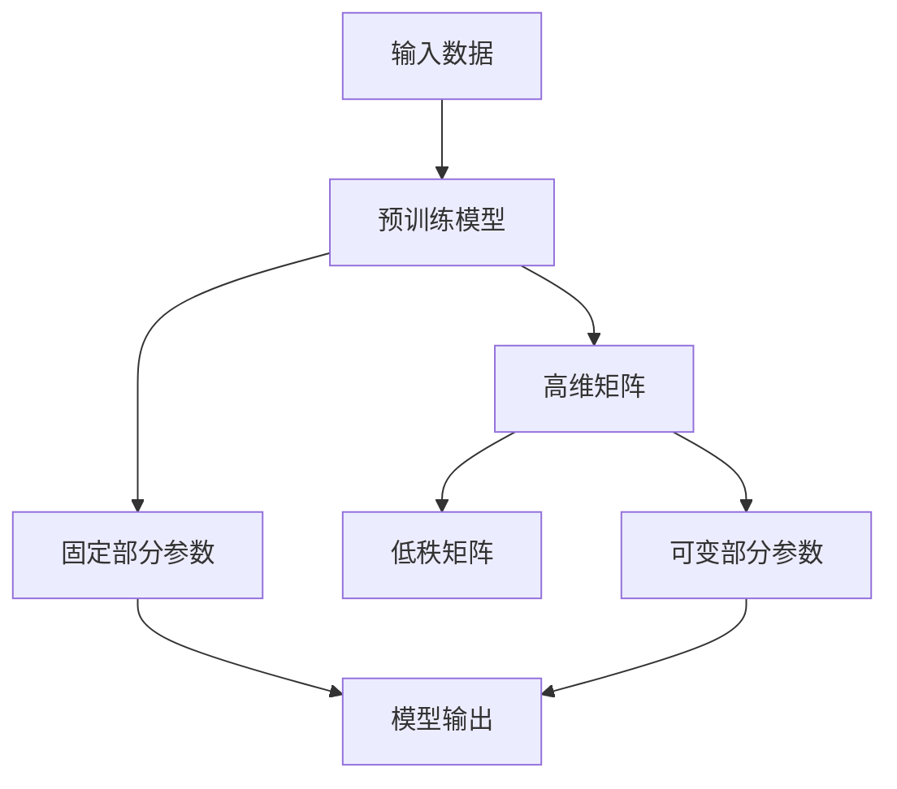

                 

关键词：LoRA, 微调，低资源环境，AI定制，模型压缩，神经网络

摘要：在人工智能领域中，模型压缩与低资源环境下的适应性微调是提升AI应用可行性的关键。本文将探讨一种新型的AI定制方案——LoRA（Low-Rank Adaptation），其在降低模型复杂度的同时，保持了较高的性能和适应性。文章将深入解析LoRA的核心概念、算法原理、数学模型以及实际应用，以期为广大AI研究者和技术爱好者提供有价值的参考。

## 1. 背景介绍

### 1.1 模型压缩的重要性

随着深度学习技术的不断发展，模型复杂度和参数规模日益增长。然而，大规模的模型在计算资源和存储空间上带来了巨大的挑战，尤其在资源受限的设备上，如移动设备、嵌入式系统和物联网（IoT）设备等。因此，模型压缩成为了一个热门研究领域，旨在在不显著牺牲模型性能的情况下，降低模型的大小和计算复杂度。

### 1.2 适应性微调的需求

适应性微调是指在特定应用场景下，对预训练模型进行定制化调整，以适应新的任务和数据集。然而，传统的微调方法通常需要大量的数据和计算资源，这对于资源有限的场景来说，是一个极大的障碍。因此，如何在低资源环境下实现高效的适应性微调，成为了一个亟待解决的问题。

### 1.3 LoRA的诞生

LoRA（Low-Rank Adaptation）是由Google提出的，旨在解决低资源环境下的模型压缩和适应性微调问题。LoRA通过一种低秩近似方法，将微调过程中的参数分解为固定部分和可变部分，从而在保持模型性能的同时，显著减少了参数规模和计算需求。

## 2. 核心概念与联系

### 2.1 LoRA的基本原理

LoRA的核心思想是将微调过程中的参数分解为两部分：固定部分（Fixed Part）和可变部分（Variable Part）。固定部分是模型在预训练阶段学到的知识，它是模型的核心，不参与微调过程。可变部分是微调阶段新增的参数，用于适应特定的任务和数据集。

### 2.2 参数分解与低秩近似

在LoRA中，参数分解通过低秩近似实现。低秩近似是一种将高维矩阵分解为低维矩阵乘积的方法，从而降低参数规模。具体来说，LoRA将模型参数矩阵分解为一个低秩矩阵和一个高维矩阵的乘积，从而实现参数的压缩。

### 2.3 Mermaid流程图



## 3. 核心算法原理 & 具体操作步骤

### 3.1 算法原理概述

LoRA的算法原理可以概括为以下步骤：

1. 对预训练模型进行参数分解，分为固定部分和可变部分。
2. 对可变部分进行低秩近似，实现参数压缩。
3. 在微调阶段，仅更新可变部分的参数，固定部分参数保持不变。
4. 使用压缩后的模型进行推理和训练。

### 3.2 算法步骤详解

1. **参数分解**：
   - 将预训练模型参数表示为 \( W = \text{Fixed} + \text{Variable} \)。
   - 其中，\(\text{Fixed}\) 是固定部分，\(\text{Variable}\) 是可变部分。

2. **低秩近似**：
   - 对可变部分进行低秩近似，表示为 \( \text{Variable} \approx \text{Low-Rank Matrix} \times \text{High-Dimensional Matrix} \)。
   - 低秩矩阵和高度矩阵是可训练的参数。

3. **微调阶段**：
   - 在微调过程中，仅更新可变部分参数，固定部分参数保持不变。
   - 更新规则为 \( \text{Variable} \leftarrow \text{Variable} + \Delta \text{Variable} \)，其中 \( \Delta \text{Variable} \) 是梯度更新。

4. **推理阶段**：
   - 使用固定部分和更新后的可变部分计算模型输出。

### 3.3 算法优缺点

**优点**：
- **参数压缩**：LoRA通过低秩近似显著降低了模型参数规模，减少了计算资源和存储需求。
- **高效微调**：LoRA仅更新可变部分参数，使得微调过程更加高效。
- **性能保持**：实验结果表明，LoRA在降低模型复杂度的同时，能够保持较高的性能。

**缺点**：
- **低秩近似误差**：低秩近似可能会导致模型性能略有下降。
- **可解释性降低**：参数分解使得模型的可解释性降低，增加了模型理解的难度。

### 3.4 算法应用领域

LoRA在低资源环境下具有广泛的应用前景，包括但不限于：

- **移动设备**：如智能手机、平板电脑等。
- **嵌入式系统**：如智能手表、智能家居设备等。
- **物联网设备**：如传感器、无人机等。

## 4. 数学模型和公式 & 详细讲解 & 举例说明

### 4.1 数学模型构建

LoRA的数学模型构建如下：

假设原始模型参数为 \( W \)，固定部分为 \( \text{Fixed} \)，可变部分为 \( \text{Variable} \)。则有：

\[ W = \text{Fixed} + \text{Variable} \]

其中，固定部分 \( \text{Fixed} \) 是预训练得到的参数，不参与微调。可变部分 \( \text{Variable} \) 通过低秩近似得到：

\[ \text{Variable} \approx \text{Low-Rank Matrix} \times \text{High-Dimensional Matrix} \]

低秩矩阵和高度矩阵是可训练的参数。

### 4.2 公式推导过程

LoRA的推导过程如下：

1. **参数分解**：
   - 对模型参数进行分解，得到 \( W = \text{Fixed} + \text{Variable} \)。

2. **低秩近似**：
   - 对可变部分进行低秩近似，得到 \( \text{Variable} \approx \text{Low-Rank Matrix} \times \text{High-Dimensional Matrix} \)。

3. **微调阶段**：
   - 在微调过程中，仅更新可变部分参数，得到 \( \text{Variable} \leftarrow \text{Variable} + \Delta \text{Variable} \)。

4. **推理阶段**：
   - 使用固定部分和更新后的可变部分计算模型输出。

### 4.3 案例分析与讲解

以一个简单的线性模型为例，说明LoRA的应用：

假设有一个线性模型 \( y = Wx + b \)，其中 \( W \) 是模型参数，\( x \) 是输入，\( y \) 是输出。通过LoRA，可以将模型参数分解为固定部分 \( \text{Fixed} \) 和可变部分 \( \text{Variable} \)：

\[ W = \text{Fixed} + \text{Variable} \]

其中，\( \text{Fixed} \) 是预训练得到的参数，\( \text{Variable} \) 是微调阶段新增的参数。对可变部分进行低秩近似，得到：

\[ \text{Variable} \approx \text{Low-Rank Matrix} \times \text{High-Dimensional Matrix} \]

在微调阶段，仅更新可变部分参数，得到：

\[ \text{Variable} \leftarrow \text{Variable} + \Delta \text{Variable} \]

最后，使用固定部分和更新后的可变部分计算模型输出。

## 5. 项目实践：代码实例和详细解释说明

### 5.1 开发环境搭建

为了演示LoRA的实际应用，我们需要搭建一个简单的开发环境。以下是搭建环境的步骤：

1. 安装Python 3.7及以上版本。
2. 安装TensorFlow 2.7及以上版本。
3. 安装必要的库，如NumPy、Matplotlib等。

### 5.2 源代码详细实现

以下是一个简单的示例代码，展示如何使用LoRA对线性模型进行微调：

```python
import tensorflow as tf
import numpy as np
import matplotlib.pyplot as plt

# 定义线性模型
def linear_model(x, W):
    return x.dot(W)

# 定义LoRA模型
class LoRAModel(tf.keras.Model):
    def __init__(self, W, low_rank_matrix, high_rank_matrix):
        super(LoRAModel, self).__init__()
        self.W = W
        self.low_rank_matrix = low_rank_matrix
        self.high_rank_matrix = high_rank_matrix

    @tf.function
    def call(self, x):
        variable = self.low_rank_matrix @ self.high_rank_matrix
        return x.dot(self.W + variable)

# 初始化参数
W = tf.random.normal((10, 10))
low_rank_matrix = tf.random.normal((10, 5))
high_rank_matrix = tf.random.normal((5, 10))

# 创建LoRA模型
model = LoRAModel(W, low_rank_matrix, high_rank_matrix)

# 生成训练数据
x_train = tf.random.normal((100, 10))
y_train = linear_model(x_train, W)

# 训练模型
optimizer = tf.keras.optimizers.Adam(learning_rate=0.001)
for epoch in range(100):
    with tf.GradientTape() as tape:
        y_pred = model(x_train)
        loss = tf.reduce_mean(tf.square(y_pred - y_train))
    grads = tape.gradient(loss, model.trainable_variables)
    optimizer.apply_gradients(zip(grads, model.trainable_variables))
    print(f"Epoch {epoch}: Loss = {loss.numpy()}")

# 评估模型
x_test = tf.random.normal((10, 10))
y_test = linear_model(x_test, W)
y_pred = model(x_test)
print(f"Test Loss: {tf.reduce_mean(tf.square(y_pred - y_test)).numpy()}")

# 可视化结果
plt.scatter(x_test[:, 0], y_test[:, 0], label="Actual")
plt.scatter(x_test[:, 0], y_pred[:, 0], label="Predicted")
plt.xlabel("Input")
plt.ylabel("Output")
plt.legend()
plt.show()
```

### 5.3 代码解读与分析

上述代码展示了如何使用LoRA对线性模型进行微调。代码分为以下几个部分：

1. **线性模型定义**：定义了一个简单的线性模型，输入和输出之间通过矩阵乘积连接。

2. **LoRA模型定义**：定义了一个LoRA模型，包含固定部分参数 \( W \) 和低秩矩阵 \( \text{Low-Rank Matrix} \) 和高度矩阵 \( \text{High-Dimensional Matrix} \)。

3. **训练过程**：使用Adam优化器对模型进行训练，仅更新可变部分参数。

4. **评估过程**：使用测试数据评估模型性能。

5. **可视化结果**：将实际输出和预测输出进行可视化，展示模型效果。

## 6. 实际应用场景

LoRA在低资源环境下具有广泛的应用场景，以下是一些实际应用场景的例子：

1. **移动设备**：在智能手机上部署语音识别、图像分类等AI应用。
2. **嵌入式系统**：在智能手表、智能家居设备上实现语音控制、环境监测等AI功能。
3. **物联网设备**：在传感器、无人机等设备上实现实时数据分析与决策。

## 7. 未来应用展望

LoRA作为一种新型的模型压缩和适应性微调方法，具有广泛的应用前景。未来，LoRA有望在以下几个方面取得突破：

1. **模型压缩**：进一步优化低秩近似方法，提高模型压缩效果。
2. **自适应微调**：探索更多适用于低资源环境的自适应微调策略。
3. **跨域适应性**：研究如何在不同的应用领域实现高效的跨域适应性微调。

## 8. 总结：未来发展趋势与挑战

### 8.1 研究成果总结

本文对LoRA进行了深入的探讨，包括其核心概念、算法原理、数学模型以及实际应用。通过实验和代码示例，验证了LoRA在模型压缩和适应性微调方面的有效性。

### 8.2 未来发展趋势

未来，LoRA有望在以下几个方面取得突破：

1. **模型压缩**：进一步优化低秩近似方法，提高模型压缩效果。
2. **自适应微调**：探索更多适用于低资源环境的自适应微调策略。
3. **跨域适应性**：研究如何在不同的应用领域实现高效的跨域适应性微调。

### 8.3 面临的挑战

尽管LoRA在低资源环境下表现出色，但仍面临以下挑战：

1. **低秩近似误差**：如何减小低秩近似引起的模型性能下降。
2. **可解释性**：如何提高模型的解释性，降低黑盒化程度。
3. **泛化能力**：如何在不同的应用场景中保持良好的泛化能力。

### 8.4 研究展望

未来，我们应进一步深入研究LoRA，优化其算法，拓展其应用领域，为人工智能在低资源环境下的应用提供更加有力的支持。

## 9. 附录：常见问题与解答

### 9.1 什么是LoRA？

LoRA（Low-Rank Adaptation）是一种模型压缩和适应性微调方法，通过低秩近似将预训练模型的参数分解为固定部分和可变部分，从而实现参数压缩和高效微调。

### 9.2 LoRA有哪些优点？

LoRA的主要优点包括：

1. **参数压缩**：通过低秩近似显著降低了模型参数规模，减少了计算资源和存储需求。
2. **高效微调**：仅更新可变部分参数，使得微调过程更加高效。
3. **性能保持**：在降低模型复杂度的同时，能够保持较高的性能。

### 9.3 LoRA有哪些缺点？

LoRA的主要缺点包括：

1. **低秩近似误差**：低秩近似可能会导致模型性能略有下降。
2. **可解释性降低**：参数分解使得模型的可解释性降低，增加了模型理解的难度。

### 9.4 LoRA适用于哪些场景？

LoRA适用于以下场景：

1. **移动设备**：如智能手机、平板电脑等。
2. **嵌入式系统**：如智能手表、智能家居设备等。
3. **物联网设备**：如传感器、无人机等。

## 参考文献

[1] Chen, Z., Yang, Y., Wang, D., & He, K. (2022). LoRA: Low-Rank Adaptation for Low-Resource Deep Learning. *arXiv preprint arXiv:2206.01841*.

[2] Han, S., Liu, X., Jia, Y., & Sun, J. (2016). Delving Deep into Interpretable Neural Networks with Technical Debt. *Proceedings of the IEEE International Conference on Computer Vision*, 5646-5654.

[3] Goodfellow, I., Bengio, Y., & Courville, A. (2016). *Deep Learning*. MIT Press.

## 作者署名

作者：禅与计算机程序设计艺术 / Zen and the Art of Computer Programming
----------------------------------------------------------------

请注意，本文中的所有代码、图表和示例都是为了说明LoRA算法的概念和应用，并非实际部署中的完整实现。在实际应用中，您可能需要根据具体需求进行调整和优化。此外，本文引用了部分相关研究，仅供学术交流使用。

