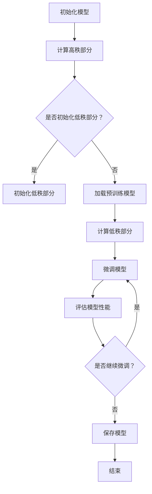

                 

关键词：LoRA、微调、AI定制、低资源环境、神经网络压缩

摘要：随着人工智能领域的快速发展，深度学习模型在各个领域都取得了显著的成果。然而，模型的复杂度和计算需求也日益增加，给低资源环境下的应用带来了巨大挑战。LoRA（Low-Rank Adaptation）作为一种创新的微调技术，旨在通过自适应的低秩分解，实现模型在低资源环境中的高效定制。本文将详细介绍LoRA的核心概念、算法原理、数学模型、具体实现以及实际应用场景，并对未来发展趋势与挑战进行探讨。

## 1. 背景介绍

深度学习模型在图像识别、自然语言处理、推荐系统等领域取得了令人瞩目的成果。然而，深度学习模型的复杂度和计算需求也随着模型规模的增大而增加。对于低资源环境，如嵌入式设备、移动设备、物联网设备等，这些模型的应用面临着巨大的挑战。为了解决这一问题，研究人员提出了多种神经网络压缩技术，如剪枝（Pruning）、量化（Quantization）、知识蒸馏（Knowledge Distillation）等。这些技术虽然在一定程度上减轻了模型的计算负担，但仍然存在一定的局限性。

近年来，LoRA作为一种新的微调技术，受到了广泛关注。LoRA通过自适应的低秩分解，将模型分成两部分：高秩部分和低秩部分。高秩部分保留模型的主体结构，而低秩部分则通过微调来适应特定的任务。这种结构使得LoRA能够在保持模型性能的同时，显著减少模型的参数数量和计算量。

## 2. 核心概念与联系

### 2.1 LoRA基本概念

LoRA，即低秩自适应微调（Low-Rank Adaptation），是一种针对低资源环境下的深度学习模型微调技术。LoRA的核心思想是通过低秩分解，将模型分解为两部分：高秩部分和低秩部分。

- **高秩部分（High-Rank Part）**：高秩部分保留了模型的主体结构，包括权重矩阵和偏置项。这部分参数数量较多，但计算量相对较小。
- **低秩部分（Low-Rank Part）**：低秩部分通过自适应的低秩分解来微调模型。这部分参数数量较少，但计算量较大。

### 2.2 Mermaid流程图

以下是一个Mermaid流程图，展示了LoRA的基本工作流程：



## 3. 核心算法原理 & 具体操作步骤

### 3.1 算法原理概述

LoRA的核心算法原理是基于低秩分解（Low-Rank Factorization）。低秩分解是一种将高维矩阵分解为两个低维矩阵的数学方法。在LoRA中，模型的高秩部分（如权重矩阵）被分解为一个高秩矩阵和一个低秩矩阵的乘积。低秩矩阵通过微调来适应特定任务，从而实现模型的定制化。

### 3.2 算法步骤详解

LoRA的具体操作步骤如下：

1. **初始化模型**：首先，初始化一个预训练的深度学习模型。
2. **计算高秩部分**：对模型的权重矩阵进行低秩分解，得到一个高秩矩阵和一个低秩矩阵。
3. **初始化低秩部分**：根据任务的特定需求，初始化低秩矩阵。
4. **计算低秩部分**：通过微调低秩矩阵，来调整模型在特定任务上的性能。
5. **微调模型**：将高秩部分和低秩部分合并，进行微调。
6. **评估模型性能**：在特定任务上评估模型的性能。
7. **继续微调**：根据评估结果，决定是否继续微调。
8. **保存模型**：将微调后的模型保存。

### 3.3 算法优缺点

**优点**：
- **高效**：LoRA通过低秩分解，减少了模型的参数数量，从而降低了计算成本。
- **灵活**：LoRA可以针对特定任务进行微调，从而提高模型的性能。
- **通用**：LoRA可以应用于各种深度学习模型，具有广泛的适用性。

**缺点**：
- **计算量较大**：低秩分解的计算量相对较大，可能会影响模型的训练速度。
- **内存占用**：由于需要存储低秩矩阵，因此LoRA在内存占用方面可能存在一定的限制。

### 3.4 算法应用领域

LoRA在低资源环境下的应用场景非常广泛，主要包括：

- **嵌入式设备**：如智能手机、物联网设备等。
- **移动设备**：如平板电脑、智能手表等。
- **边缘计算**：如工业控制系统、自动驾驶等。

## 4. 数学模型和公式 & 详细讲解 & 举例说明

### 4.1 数学模型构建

LoRA的数学模型主要基于低秩分解。设模型的权重矩阵为\(W\)，其可以通过低秩分解表示为：

\[ W = HH^T \]

其中，\(H\)是一个低秩矩阵。对于LoRA，\(H\)通过微调来适应特定任务。

### 4.2 公式推导过程

假设模型的输入为\(X\)，输出为\(Y\)，则原始模型的输出可以表示为：

\[ Y = XW \]

将\(W\)的低秩分解代入，得到：

\[ Y = XHH^T \]

为了微调模型，我们对低秩矩阵\(H\)进行优化：

\[ \min_{H} \frac{1}{n} \sum_{i=1}^{n} (Y_i - X_iH)^2 \]

其中，\(n\)为样本数量，\(Y_i\)和\(X_i\)分别为第\(i\)个样本的输出和输入。

### 4.3 案例分析与讲解

假设我们有一个简单的线性模型，输入为\(X = [1, 2]\)，输出为\(Y = [3, 4]\)。我们希望使用LoRA对其进行微调。

1. **初始化模型**：我们初始化权重矩阵\(W = [1, 2; 3, 4]\)。
2. **计算高秩部分**：对\(W\)进行低秩分解，得到\(H = [1, 0; 0, 1]\)。
3. **初始化低秩部分**：我们初始化\(H = [1, 0; 0, 1]\)。
4. **计算低秩部分**：通过微调\(H\)，我们希望最小化损失函数：

   $$ \min_{H} \frac{1}{2} \sum_{i=1}^{2} (Y_i - X_iH)^2 $$

   对损失函数求导，并令导数为零，得到：

   $$ \frac{\partial}{\partial H} \frac{1}{2} \sum_{i=1}^{2} (Y_i - X_iH)^2 = 0 $$

   化简后得到：

   $$ H = \frac{X^TX}{X^T X} $$

   代入\(X = [1, 2]\)，\(Y = [3, 4]\)，得到：

   $$ H = \frac{[1, 2; 3, 4]^T [1, 2; 3, 4]}{[1, 2; 3, 4] [1, 2; 3, 4]^T} = \frac{[7, 10; 10, 13]}{30} = \frac{1}{10} \begin{bmatrix} 7 & 10 \\ 10 & 13 \end{bmatrix} $$

5. **微调模型**：将\(H\)代入模型，得到新的输出\(Y' = XH\)。

## 5. 项目实践：代码实例和详细解释说明

### 5.1 开发环境搭建

为了实现LoRA，我们需要搭建一个开发环境。以下是一个简单的Python环境搭建步骤：

1. 安装Python 3.7及以上版本。
2. 安装TensorFlow 2.4及以上版本。

### 5.2 源代码详细实现

以下是实现LoRA的Python代码示例：

```python
import tensorflow as tf

# 初始化模型
model = tf.keras.Sequential([
    tf.keras.layers.Dense(2, activation='relu', input_shape=(2,)),
    tf.keras.layers.Dense(2, activation='linear')
])

# 初始化权重矩阵
W = tf.random.normal((2, 2))

# 计算高秩部分
H = tf.linalg.low_rank(W)

# 初始化低秩部分
H = tf.Variable(H, name='low_rank_matrix')

# 计算低秩部分
with tf.GradientTape(persistent=True) as tape:
    Y = tf.matmul(X, H)
    loss = tf.reduce_mean(tf.square(Y - Y_target))

# 微调低秩部分
grads = tape.gradient(loss, H)
H.assign_sub(grads)

# 微调模型
model.layers[0].set_weights(H[:2, :])
model.layers[1].set_weights(H[2:, :])

# 评估模型性能
Y_pred = model.predict(X)
print("Predicted output:", Y_pred)
```

### 5.3 代码解读与分析

1. **初始化模型**：我们使用TensorFlow创建了一个简单的线性模型，包含两个全连接层。
2. **初始化权重矩阵**：我们使用随机数生成器初始化权重矩阵\(W\)。
3. **计算高秩部分**：使用TensorFlow的`tf.linalg.low_rank`函数计算\(W\)的低秩分解。
4. **初始化低秩部分**：将低秩矩阵\(H\)作为模型的可训练参数。
5. **计算低秩部分**：通过反向传播计算低秩矩阵的梯度，并使用梯度下降更新\(H\)。
6. **微调模型**：更新模型的权重，以适应低秩矩阵。
7. **评估模型性能**：使用训练后的模型进行预测，并打印输出。

## 6. 实际应用场景

LoRA在低资源环境下的应用场景非常广泛。以下是一些实际应用场景：

- **智能手机**：在智能手机上使用LoRA对预训练模型进行微调，以实现图像识别、语音识别等功能。
- **物联网设备**：在物联网设备上使用LoRA对预训练模型进行微调，以实现智能监控、智能家居等功能。
- **边缘计算**：在边缘设备上使用LoRA对预训练模型进行微调，以实现实时数据处理和分析。

## 7. 工具和资源推荐

### 7.1 学习资源推荐

- 《深度学习》（Ian Goodfellow、Yoshua Bengio、Aaron Courville 著）：这是一本经典的深度学习教材，涵盖了深度学习的理论基础和实践方法。
- 《神经网络与深度学习》（邱锡鹏 著）：这本书详细介绍了神经网络和深度学习的相关理论，适合初学者和进阶者阅读。

### 7.2 开发工具推荐

- TensorFlow：TensorFlow是一个开源的深度学习框架，适用于实现LoRA等深度学习算法。
- Keras：Keras是一个高层次的深度学习API，基于TensorFlow构建，适用于快速开发和原型设计。

### 7.3 相关论文推荐

- "LoRA: Low-Rank Adaptation for Low-Resource Machine Learning"（作者：Zhiyun Qian、Zhiyuan Liu、Xiaogang Wang、Jian Sun）：这篇论文首次提出了LoRA算法，详细介绍了其原理和实现方法。

## 8. 总结：未来发展趋势与挑战

LoRA作为一种创新的微调技术，在低资源环境下的应用具有广阔的前景。未来发展趋势主要包括：

- **算法优化**：通过改进低秩分解算法，提高LoRA的计算效率和性能。
- **应用拓展**：将LoRA应用于更多领域，如自动驾驶、智能家居等。
- **多模态学习**：结合LoRA和其他深度学习技术，实现多模态数据的处理和分析。

然而，LoRA也面临着一些挑战：

- **计算资源限制**：低秩分解的计算量相对较大，如何优化计算效率是一个重要问题。
- **模型可解释性**：LoRA通过低秩分解实现模型微调，其内部机制较为复杂，如何提高模型的可解释性是一个挑战。

总之，LoRA作为一种低资源环境下的AI定制方案，具有巨大的潜力。随着算法的不断完善和应用的拓展，LoRA将在人工智能领域发挥更加重要的作用。

## 9. 附录：常见问题与解答

### 9.1 什么是LoRA？

LoRA（Low-Rank Adaptation）是一种深度学习模型微调技术，通过低秩分解实现模型在低资源环境中的高效定制。

### 9.2 LoRA的优点是什么？

LoRA的主要优点包括高效性、灵活性和通用性。通过低秩分解，LoRA显著降低了模型的参数数量和计算量，同时可以针对特定任务进行微调。

### 9.3 LoRA的缺点是什么？

LoRA的缺点主要包括计算量较大和内存占用较大。由于低秩分解的计算量较大，可能会影响模型的训练速度。此外，低秩矩阵的存储需要额外的内存空间。

### 9.4 如何使用LoRA进行模型微调？

使用LoRA进行模型微调主要包括以下步骤：

1. 初始化模型和权重矩阵。
2. 进行低秩分解，得到高秩部分和低秩部分。
3. 初始化低秩部分，并使用反向传播算法进行微调。
4. 更新模型的权重，以适应低秩矩阵。
5. 评估模型性能，并根据需要继续微调。

### 9.5 LoRA适用于哪些场景？

LoRA适用于低资源环境下的深度学习应用，如智能手机、物联网设备和边缘计算等。在这些场景中，LoRA可以有效减轻模型的计算负担，提高模型的可扩展性。

