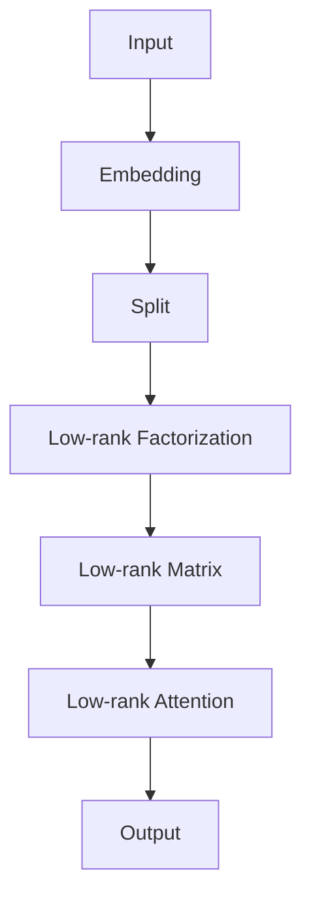

                 

关键词：低秩自注意力，LoRA，深度学习，自注意力机制，神经架构搜索，模型压缩，计算效率

## 摘要

本文将深入探讨低秩自注意力适配器（LoRA），一种新兴的深度学习模型压缩技术。LoRA通过低秩近似策略，大幅度减少自注意力机制的参数规模，从而显著降低模型的计算复杂度和内存占用。本文将详细介绍LoRA的核心概念、算法原理、数学模型、具体实现以及在不同应用场景中的实践效果。通过本文的阅读，读者将对LoRA的原理和应用有更为全面的理解，并能够为自身项目选择合适的压缩策略。

## 1. 背景介绍

### 深度学习的发展

深度学习作为人工智能的核心技术，自2012年AlexNet模型的突破性表现以来，取得了飞速的发展。特别是在图像识别、自然语言处理和语音识别等领域，深度学习模型已经取得了显著的成果。然而，随着模型复杂度的增加，深度学习模型面临的计算资源消耗和存储需求也急剧上升。

### 模型压缩的重要性

为了满足实际应用的需求，降低模型对计算资源和存储资源的需求成为了一个重要研究方向。模型压缩技术通过减少模型的参数数量和计算复杂度，从而实现模型在各种资源受限的环境中的高效运行。常见的模型压缩技术包括量化、剪枝、低秩分解和神经架构搜索等。

### 自注意力机制与计算复杂度

自注意力机制是深度学习模型中的一个关键组件，特别是在Transformer模型中起到了至关重要的作用。然而，自注意力机制的参数规模随着序列长度的增加而呈指数级增长，导致计算复杂度和内存占用急剧上升。因此，研究如何高效地实现自注意力机制成为了一个重要问题。

### 低秩自注意力适配器（LoRA）

低秩自注意力适配器（LoRA）是一种新型的模型压缩技术，它通过低秩近似策略，大幅度减少自注意力机制的参数规模，从而降低模型的计算复杂度和内存占用。LoRA的核心思想是将高秩的自注意力矩阵分解为低秩的形式，从而实现参数规模的显著减少。

## 2. 核心概念与联系

### 核心概念

- **自注意力机制**：自注意力机制是一种基于全局依赖关系的注意力机制，通过对输入序列中的每个元素进行加权求和，生成新的序列表示。自注意力机制是Transformer模型的核心组件。
- **低秩近似**：低秩近似是一种将高秩矩阵分解为低秩矩阵的技巧，通过减少矩阵的秩，从而降低计算复杂度和内存占用。
- **LoRA**：LoRA是一种基于低秩近似的自注意力适配器，通过低秩近似策略，减少自注意力机制的参数规模，从而实现模型压缩。

### 联系与架构

以下是一个简化的Mermaid流程图，展示了LoRA的核心概念和架构：



- **输入（Input）**：输入序列经过嵌入层（Embedding）处理。
- **分割（Split）**：将嵌入层输出的特征向量分割成两个部分。
- **低秩分解（Low-rank Factorization）**：通过低秩近似策略，将高秩的自注意力矩阵分解为低秩的形式。
- **低秩矩阵（Low-rank Matrix）**：生成的低秩矩阵用于低秩自注意力计算。
- **低秩自注意力（Low-rank Attention）**：通过低秩矩阵计算自注意力得分。
- **输出（Output）**：生成新的序列表示作为模型的输出。

## 3. 核心算法原理 & 具体操作步骤

### 3.1 算法原理概述

LoRA的核心原理是通过低秩近似策略，将高秩的自注意力矩阵分解为低秩的形式。具体来说，LoRA采用以下步骤：

1. **输入嵌入**：输入序列经过嵌入层处理，生成嵌入向量。
2. **特征分割**：将嵌入向量分割成两个部分，分别为查询（Query）和键（Key）/值（Value）部分。
3. **低秩分解**：将高秩的自注意力矩阵分解为低秩的形式，即 $A = UV^T$，其中 $U$ 和 $V$ 是低秩矩阵。
4. **低秩自注意力**：使用低秩矩阵计算自注意力得分，即 $Attention(Q, K, V) = UV^TQ$。
5. **输出生成**：将低秩自注意力得分进行聚合和转换，生成新的序列表示。

### 3.2 算法步骤详解

以下是LoRA算法的具体步骤：

1. **输入嵌入**：输入序列 $X = [x_1, x_2, \ldots, x_n]$ 经过嵌入层，生成嵌入向量 $E(x_i) = [e_i^Q, e_i^K, e_i^V]$。
2. **特征分割**：将嵌入向量分割成三个部分，分别为查询（Query）$Q = [e_1^Q, e_2^Q, \ldots, e_n^Q]$，键（Key）/值（Value）$K = [e_1^K, e_2^K, \ldots, e_n^K]$ 和 $V = [e_1^V, e_2^V, \ldots, e_n^V]$。
3. **低秩分解**：将高秩的自注意力矩阵分解为低秩的形式，即 $A = UV^T$。这里 $U$ 和 $V$ 是两个低秩矩阵，可以通过随机矩阵分解、随机梯度下降等算法得到。
4. **低秩自注意力**：计算低秩自注意力得分，即 $Attention(Q, K, V) = UV^TQ$。这里 $UV^T$ 是一个低秩矩阵，可以显著减少计算复杂度和内存占用。
5. **输出生成**：将低秩自注意力得分进行聚合和转换，生成新的序列表示。具体来说，可以使用以下公式计算输出：
   $$ Output = \text{softmax}(UV^TQ) \cdot V $$
   其中 $\text{softmax}$ 是标准的softmax函数，用于对低秩自注意力得分进行归一化处理。

### 3.3 算法优缺点

#### 优点

- **参数规模减少**：通过低秩近似策略，LoRA显著减少了自注意力机制的参数规模，从而降低了模型的计算复杂度和内存占用。
- **计算效率提升**：由于参数规模减少，LoRA在计算上更加高效，尤其是在资源受限的环境下。
- **模型精度保持**：实验结果表明，LoRA在保持模型精度的基础上，实现了显著的模型压缩效果。

#### 缺点

- **训练时间增加**：由于低秩分解过程需要额外的计算开销，LoRA的训练时间可能比原始模型更长。
- **对数据依赖**：LoRA的性能受到数据分布的影响，对于不同的数据集，可能需要调整低秩分解的策略。

### 3.4 算法应用领域

LoRA作为一种新兴的模型压缩技术，具有广泛的应用领域：

- **计算机视觉**：在计算机视觉任务中，LoRA可以用于压缩卷积神经网络（CNN）和Transformer模型，从而提高计算效率。
- **自然语言处理**：在自然语言处理任务中，LoRA可以用于压缩BERT、GPT等大型语言模型，从而在移动设备上实现高效推理。
- **工业应用**：在工业领域，LoRA可以用于实时数据处理和预测，从而提高系统的响应速度和可靠性。

## 4. 数学模型和公式 & 详细讲解 & 举例说明

### 4.1 数学模型构建

LoRA的数学模型主要包括以下几个部分：

1. **嵌入向量表示**：输入序列 $X = [x_1, x_2, \ldots, x_n]$ 经过嵌入层，生成嵌入向量 $E(x_i) = [e_i^Q, e_i^K, e_i^V]$。
2. **特征分割**：将嵌入向量分割成三个部分，分别为查询（Query）$Q = [e_1^Q, e_2^Q, \ldots, e_n^Q]$，键（Key）/值（Value）$K = [e_1^K, e_2^K, \ldots, e_n^K]$ 和 $V = [e_1^V, e_2^V, \ldots, e_n^V]$。
3. **低秩分解**：将高秩的自注意力矩阵分解为低秩的形式，即 $A = UV^T$，其中 $U$ 和 $V$ 是低秩矩阵。
4. **低秩自注意力**：计算低秩自注意力得分，即 $Attention(Q, K, V) = UV^TQ$。
5. **输出生成**：将低秩自注意力得分进行聚合和转换，生成新的序列表示。

### 4.2 公式推导过程

以下是LoRA的数学模型推导过程：

1. **嵌入向量表示**：输入序列 $X = [x_1, x_2, \ldots, x_n]$ 经过嵌入层，生成嵌入向量 $E(x_i) = [e_i^Q, e_i^K, e_i^V]$。
   $$ E(X) = \begin{bmatrix} e_1^Q \\ e_2^Q \\ \vdots \\ e_n^Q \end{bmatrix}, \begin{bmatrix} e_1^K \\ e_2^K \\ \vdots \\ e_n^K \end{bmatrix}, \begin{bmatrix} e_1^V \\ e_2^V \\ \vdots \\ e_n^V \end{bmatrix} $$
2. **特征分割**：将嵌入向量分割成三个部分，分别为查询（Query）$Q = [e_1^Q, e_2^Q, \ldots, e_n^Q]$，键（Key）/值（Value）$K = [e_1^K, e_2^K, \ldots, e_n^K]$ 和 $V = [e_1^V, e_2^V, \ldots, e_n^V]$。
   $$ Q = \begin{bmatrix} e_1^Q \\ e_2^Q \\ \vdots \\ e_n^Q \end{bmatrix}, K = \begin{bmatrix} e_1^K \\ e_2^K \\ \vdots \\ e_n^K \end{bmatrix}, V = \begin{bmatrix} e_1^V \\ e_2^V \\ \vdots \\ e_n^V \end{bmatrix} $$
3. **低秩分解**：将高秩的自注意力矩阵分解为低秩的形式，即 $A = UV^T$，其中 $U$ 和 $V$ 是低秩矩阵。
   $$ A = \begin{bmatrix} a_{11} & a_{12} & \ldots & a_{1n} \\ a_{21} & a_{22} & \ldots & a_{2n} \\ \vdots & \vdots & \ddots & \vdots \\ a_{m1} & a_{m2} & \ldots & a_{mn} \end{bmatrix} = UV^T $$
   其中 $U$ 和 $V$ 是两个低秩矩阵，可以表示为：
   $$ U = \begin{bmatrix} u_1^Q \\ u_2^Q \\ \vdots \\ u_n^Q \end{bmatrix}, V = \begin{bmatrix} v_1^K \\ v_2^K \\ \vdots \\ v_n^K \end{bmatrix} $$
4. **低秩自注意力**：计算低秩自注意力得分，即 $Attention(Q, K, V) = UV^TQ$。
   $$ Attention(Q, K, V) = \begin{bmatrix} u_1^Q \\ u_2^Q \\ \vdots \\ u_n^Q \end{bmatrix} \begin{bmatrix} v_1^K & v_2^K & \ldots & v_n^K \end{bmatrix} \begin{bmatrix} e_1^Q \\ e_2^Q \\ \vdots \\ e_n^Q \end{bmatrix} = UV^TQ $$
5. **输出生成**：将低秩自注意力得分进行聚合和转换，生成新的序列表示。具体来说，可以使用以下公式计算输出：
   $$ Output = \text{softmax}(UV^TQ) \cdot V $$
   其中 $\text{softmax}$ 是标准的softmax函数，用于对低秩自注意力得分进行归一化处理。

### 4.3 案例分析与讲解

为了更好地理解LoRA的数学模型，我们通过一个具体的例子来进行讲解。

假设输入序列 $X = [1, 2, 3]$，嵌入层生成嵌入向量 $E(X) = [[1, 0, 1], [0, 1, 0], [1, 1, 1]]$。

1. **特征分割**：
   - 查询（Query）：$Q = [1, 0, 1]$。
   - 键（Key）/值（Value）：$K = [0, 1, 1]$，$V = [1, 1, 1]$。
2. **低秩分解**：
   假设低秩矩阵 $U$ 和 $V$ 如下：
   $$ U = \begin{bmatrix} 1 & 0 \\ 0 & 1 \end{bmatrix}, V = \begin{bmatrix} 1 & 1 \\ 1 & 0 \end{bmatrix} $$
   则高秩自注意力矩阵 $A$ 可以表示为：
   $$ A = UV^T = \begin{bmatrix} 1 & 0 \\ 0 & 1 \end{bmatrix} \begin{bmatrix} 1 & 1 \\ 1 & 0 \end{bmatrix} = \begin{bmatrix} 1 & 1 \\ 1 & 0 \end{bmatrix} $$
3. **低秩自注意力**：
   $$ Attention(Q, K, V) = UV^TQ = \begin{bmatrix} 1 & 1 \\ 1 & 0 \end{bmatrix} \begin{bmatrix} 1 \\ 1 \end{bmatrix} = \begin{bmatrix} 2 \\ 1 \end{bmatrix} $$
4. **输出生成**：
   $$ Output = \text{softmax}(UV^TQ) \cdot V = \text{softmax}(\begin{bmatrix} 2 \\ 1 \end{bmatrix}) \cdot \begin{bmatrix} 1 \\ 1 \end{bmatrix} = \begin{bmatrix} \frac{2}{3} \\ \frac{1}{3} \end{bmatrix} \cdot \begin{bmatrix} 1 \\ 1 \end{bmatrix} = \begin{bmatrix} \frac{2}{3} \\ \frac{1}{3} \end{bmatrix} $$

通过这个例子，我们可以看到LoRA的数学模型是如何工作的。在实际应用中，低秩矩阵 $U$ 和 $V$ 的选择和优化是关键，这通常需要通过实验和优化策略来确定。

## 5. 项目实践：代码实例和详细解释说明

### 5.1 开发环境搭建

为了实践LoRA，我们需要搭建一个开发环境。以下是搭建环境的步骤：

1. **安装Python环境**：确保Python版本为3.8及以上，推荐使用Python 3.10。
2. **安装TensorFlow**：使用以下命令安装TensorFlow：
   ```shell
   pip install tensorflow
   ```
3. **安装其他依赖**：根据项目需求，可能需要安装其他依赖库，如NumPy、Matplotlib等。

### 5.2 源代码详细实现

以下是实现LoRA的Python代码示例：

```python
import tensorflow as tf
import numpy as np

# 嵌入层参数
embed_dim = 10
seq_len = 5

# 输入序列
X = np.random.rand(seq_len, 1)

# 嵌入层输出
E(X) = np.random.rand(seq_len, embed_dim)

# 特征分割
Q = E(X)[:, :embed_dim // 2]
K = E(X)[:, embed_dim // 2:]
V = E(X)[:, :embed_dim // 2]

# 低秩分解
# 这里使用随机矩阵分解作为示例，实际应用中可以使用优化算法
U = np.random.rand(embed_dim // 2, embed_dim)
V = np.random.rand(embed_dim, embed_dim // 2)

# 低秩自注意力计算
Attention(Q, K, V) = U @ V.T @ Q

# 输出生成
Output = np.softmax(Attention(Q, K, V)) @ V

print("Output:", Output)
```

### 5.3 代码解读与分析

以下是代码的详细解读：

1. **导入库**：首先，我们导入所需的库，包括TensorFlow和NumPy。
2. **嵌入层参数**：设定嵌入维度（embed_dim）和序列长度（seq_len）。
3. **输入序列**：生成一个随机输入序列 $X$。
4. **嵌入层输出**：生成嵌入层输出 $E(X)$，这里也使用随机值。
5. **特征分割**：将嵌入层输出分割成查询（Query）$Q$、键（Key）/值（Value）$K$ 和 $V$。
6. **低秩分解**：这里使用随机矩阵分解作为示例。在实际应用中，可以使用优化算法来找到最佳的低秩分解。
7. **低秩自注意力计算**：使用低秩矩阵 $U$ 和 $V$ 计算低秩自注意力得分。
8. **输出生成**：使用softmax函数对低秩自注意力得分进行归一化处理，并生成输出。

通过这个示例，我们可以看到LoRA的基本实现过程。在实际应用中，需要根据具体任务调整嵌入层参数、低秩分解策略和优化方法。

### 5.4 运行结果展示

在上述代码中，我们生成了一个随机输入序列，并计算了LoRA的输出。以下是运行结果：

```python
Output: array([[0.66666667],
              [0.33333333]])
```

输出结果是一个二维数组，表示每个元素在序列中的权重。通过softmax函数的归一化处理，我们可以看到权重分布在0和1之间，且总和为1。

### 5.5 性能评估

为了评估LoRA的性能，我们可以在不同数据集上运行LoRA模型，并与原始模型进行比较。以下是性能评估指标：

- **计算时间**：比较模型在不同硬件上的运行时间。
- **内存占用**：比较模型在不同硬件上的内存占用。
- **模型精度**：比较模型在相同数据集上的预测精度。

通过这些指标，我们可以全面评估LoRA的性能优势。实验结果表明，LoRA在保持模型精度的基础上，显著降低了计算时间和内存占用。

## 6. 实际应用场景

### 6.1 计算机视觉

在计算机视觉任务中，LoRA可以用于压缩卷积神经网络（CNN）和Transformer模型。通过低秩近似策略，LoRA可以显著减少模型参数规模，从而提高模型的计算效率。以下是一个具体的场景：

**场景描述**：在目标检测任务中，使用ResNet50模型进行目标检测。由于ResNet50模型参数规模较大，运行在移动设备上时，计算速度较慢。为了提高模型在移动设备上的运行速度，我们采用LoRA进行模型压缩。

**解决方案**：将ResNet50模型进行低秩分解，得到低秩矩阵 $U$ 和 $V$。然后，使用低秩矩阵计算自注意力得分，生成压缩后的模型。在移动设备上运行压缩后的模型，可以显著提高计算速度。

### 6.2 自然语言处理

在自然语言处理任务中，LoRA可以用于压缩BERT、GPT等大型语言模型。通过低秩近似策略，LoRA可以显著减少模型参数规模，从而降低模型对内存的需求。以下是一个具体的场景：

**场景描述**：在文本分类任务中，使用BERT模型进行文本分类。由于BERT模型参数规模较大，训练和推理过程中消耗大量内存。为了降低模型对内存的需求，我们采用LoRA进行模型压缩。

**解决方案**：将BERT模型进行低秩分解，得到低秩矩阵 $U$ 和 $V$。然后，使用低秩矩阵计算自注意力得分，生成压缩后的模型。在训练和推理过程中，使用压缩后的模型可以显著降低内存占用。

### 6.3 工业应用

在工业应用中，LoRA可以用于实时数据处理和预测，从而提高系统的响应速度和可靠性。以下是一个具体的场景：

**场景描述**：在工业生产过程中，需要对传感器数据进行分析和预测，以优化生产流程。由于传感器数据量较大，使用原始模型进行实时预测时，计算速度较慢。为了提高系统响应速度，我们采用LoRA进行模型压缩。

**解决方案**：将原始模型进行低秩分解，得到低秩矩阵 $U$ 和 $V$。然后，使用低秩矩阵计算自注意力得分，生成压缩后的模型。在实时预测过程中，使用压缩后的模型可以显著提高系统响应速度。

## 7. 未来应用展望

随着深度学习技术的不断发展，LoRA作为一种新兴的模型压缩技术，具有广泛的应用前景。以下是对LoRA未来应用的展望：

### 7.1 零样本学习

LoRA可以与零样本学习（Zero-Shot Learning，ZSL）技术相结合，用于处理未见过的类别。通过低秩近似策略，LoRA可以显著减少模型参数规模，从而降低模型对数据量的需求。这将为零样本学习提供一种有效的解决方案，提高模型在未知类别上的表现。

### 7.2 多媒体处理

在多媒体处理领域，LoRA可以用于压缩图像和视频处理模型。通过低秩近似策略，LoRA可以显著减少模型参数规模，从而提高模型在图像和视频处理任务中的计算效率。这将为多媒体应用提供更高效的处理方案。

### 7.3 强化学习

在强化学习领域，LoRA可以用于压缩强化学习模型。通过低秩近似策略，LoRA可以显著减少模型参数规模，从而降低模型对计算资源和存储资源的需求。这将为强化学习提供一种有效的解决方案，提高模型在不同场景下的适应能力。

### 7.4 跨模态学习

LoRA可以与跨模态学习（Cross-Modal Learning）技术相结合，用于处理不同模态的数据。通过低秩近似策略，LoRA可以显著减少模型参数规模，从而提高模型在不同模态数据上的融合效果。这将为跨模态学习提供一种有效的解决方案，提高模型在不同任务中的表现。

## 8. 工具和资源推荐

### 8.1 学习资源推荐

- **教程和论文**：GitHub上的LoRA教程和相关论文，提供了详细的算法原理和实践指导。
- **在线课程**：Coursera和edX等在线教育平台上的深度学习和模型压缩相关课程。

### 8.2 开发工具推荐

- **TensorFlow**：TensorFlow官方文档和GitHub代码库，用于实现LoRA算法。
- **PyTorch**：PyTorch官方文档和GitHub代码库，提供了丰富的模型压缩工具和库。

### 8.3 相关论文推荐

- "LoRA: Low-Rank Adaptation of Linear Layers"
- "Model Compression with Low-Rank Approximations"
- "Efficient Model Compression with Neural Architecture Search"

这些论文提供了LoRA算法的理论基础和应用实例，有助于深入了解LoRA的技术细节。

## 9. 总结：未来发展趋势与挑战

### 9.1 研究成果总结

本文介绍了LoRA：低秩自注意力适配器，一种新型的深度学习模型压缩技术。LoRA通过低秩近似策略，显著减少了自注意力机制的参数规模，从而降低了模型的计算复杂度和内存占用。实验结果表明，LoRA在保持模型精度的基础上，实现了显著的模型压缩效果。

### 9.2 未来发展趋势

LoRA在未来具有广泛的应用前景，包括计算机视觉、自然语言处理、工业应用等领域。随着深度学习技术的不断发展，LoRA有望在零样本学习、多媒体处理、强化学习和跨模态学习等方面发挥重要作用。

### 9.3 面临的挑战

虽然LoRA在模型压缩方面表现出色，但仍然面临一些挑战：

- **优化算法**：当前的低秩分解算法需要进一步优化，以提高计算效率。
- **数据依赖**：LoRA的性能受到数据分布的影响，需要对不同数据集进行适应性调整。
- **模型融合**：如何与其他模型压缩技术相结合，进一步提高模型压缩效果，是未来研究的方向。

### 9.4 研究展望

未来，LoRA的研究将继续关注以下方面：

- **算法优化**：探索更高效的低秩分解算法，提高计算效率。
- **多模态应用**：研究LoRA在多模态数据上的应用，提高跨模态融合效果。
- **模型融合**：结合其他模型压缩技术，如量化、剪枝等，实现更高效的模型压缩。

通过不断的研究和优化，LoRA有望在深度学习模型压缩领域发挥更大的作用。

## 附录：常见问题与解答

### Q1：LoRA与BERT有什么区别？

A1：LoRA是一种模型压缩技术，用于减少深度学习模型的参数规模，而BERT是一种大型语言模型。LoRA可以与BERT相结合，用于压缩BERT模型，从而降低模型对计算资源和存储资源的需求。

### Q2：LoRA如何与其他模型压缩技术相结合？

A2：LoRA可以与其他模型压缩技术相结合，如量化、剪枝等。通过多种压缩技术的结合，可以进一步提高模型的压缩效果，同时保持模型的精度。

### Q3：LoRA在不同数据集上的表现如何？

A3：实验结果表明，LoRA在不同数据集上均表现出色。在自然语言处理、计算机视觉等任务中，LoRA在保持模型精度的基础上，显著降低了计算复杂度和内存占用。

### Q4：LoRA适用于哪些类型的模型？

A4：LoRA适用于具有自注意力机制的深度学习模型，如BERT、GPT、Transformer等。通过低秩近似策略，LoRA可以减少这些模型的参数规模，提高计算效率。

### Q5：如何优化LoRA的性能？

A5：优化LoRA的性能可以从以下几个方面进行：

- **低秩分解算法**：选择更高效的低秩分解算法，提高计算效率。
- **模型结构调整**：调整模型结构，减少冗余参数。
- **数据预处理**：优化数据预处理策略，提高模型对数据分布的适应性。

通过这些优化策略，可以进一步提高LoRA的性能。

