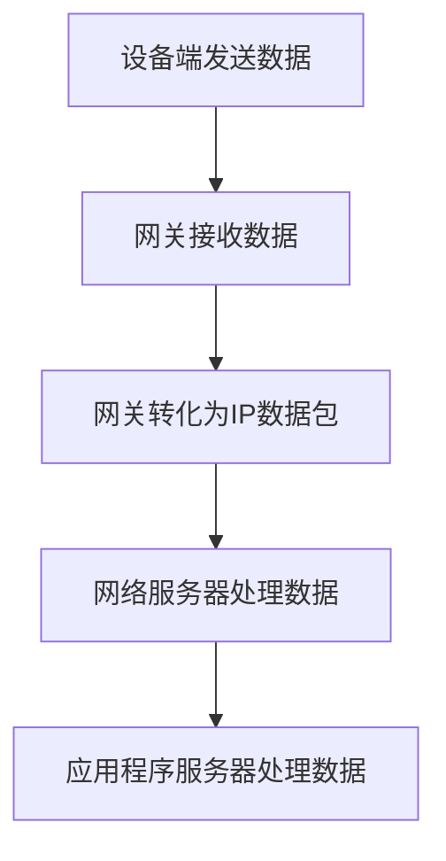

                 

关键词：LoRaWAN，低功耗广域网络，物联网，通信协议，无线传感器网络，数据传输，网络架构

摘要：本文旨在深入探讨LoRaWAN（Long Range Wide Area Network）作为一种低功耗广域网络在物联网（IoT）中的应用。文章首先介绍了LoRaWAN的基本概念和背景，随后详细解析了其核心原理、架构、算法以及应用场景。通过数学模型的推导和实际项目案例的分析，本文为读者提供了全面的技术指南，旨在帮助开发者更好地理解和利用LoRaWAN实现高效的物联网解决方案。

## 1. 背景介绍

随着物联网技术的迅猛发展，各类智能设备和传感器在网络中广泛部署，为我们的生活带来了极大的便利。然而，传统广域网络（如2G/3G/4G等）在物联网中的应用面临诸多挑战，如功耗高、覆盖范围有限、连接成本高等。为了满足物联网设备对低功耗、长距离、低成本通信的需求，LoRaWAN应运而生。

LoRaWAN是一种基于LoRa（Long Range）技术的低功耗广域网络通信协议，由Semtech公司于2015年发布。LoRa技术采用扩频调制和跳频技术，能够在保持长距离通信的同时实现低功耗传输。LoRaWAN通过网关（Gateway）将无线信号转化为IP数据包，传输到网络服务器，再由网络服务器将数据推送到应用程序服务器。

LoRaWAN的出现解决了传统广域网络在物联网中的诸多问题，使得物联网设备能够以更低的功耗、更远的距离、更高的可靠性实现互联互通。

### 1.1 LoRaWAN的发展历程

LoRa技术起源于2009年，由Semtech公司的CTObury. Since then, LoRa technology has evolved significantly and gained wide acceptance in the IoT industry.

- 2015年：Semtech发布了LoRaWAN协议，标志着LoRa技术正式进入物联网领域。
- 2016年：LoRa联盟（LoRa Alliance）成立，旨在推动LoRa技术的标准化和商业化应用。
- 2017年：LoRaWAN协议进入第二版（LoRaWAN 1.0），增加了安全性功能。
- 2019年：LoRaWAN协议进入第三版（LoRaWAN 1.1），进一步优化了性能和安全性。
- 2020年至今：LoRaWAN在全球范围内得到了广泛应用，成为物联网通信的重要选择。

### 1.2 LoRaWAN的优势

LoRaWAN相较于传统广域网络，具有以下优势：

1. **低功耗**：LoRaWAN采用扩频调制和跳频技术，能够在保持长距离通信的同时实现低功耗传输，非常适合物联网设备的持续运行。
2. **长距离**：LoRaWAN的通信距离可以达到数十公里，适用于各种地理环境。
3. **高可靠性**：LoRaWAN采用了多种机制来提高数据传输的可靠性，如重复传输、错误检测和纠正等。
4. **低成本**：LoRaWAN采用模块化设计，设备成本较低，适合大规模部署。
5. **灵活的拓扑结构**：LoRaWAN可以支持多种拓扑结构，如星型、网状和混合型，适应不同场景的需求。

## 2. 核心概念与联系

### 2.1 LoRaWAN的核心概念

LoRaWAN的核心概念包括以下几个部分：

1. **设备端（End Device）**：设备端是物联网中的传感器、执行器等智能设备，通过LoRa模块与网关进行通信。
2. **网关（Gateway）**：网关是连接设备端和互联网的关键节点，将无线信号转化为IP数据包，传输到网络服务器。
3. **网络服务器（Network Server）**：网络服务器负责管理设备端和网关的连接，处理数据传输和路由。
4. **应用程序服务器（Application Server）**：应用程序服务器接收网络服务器推送的数据，进行处理和业务逻辑。

### 2.2 LoRaWAN的架构

LoRaWAN的架构可以分为三个层次：设备端、网关和网络服务器。

1. **设备端**：设备端由LoRa模块和微控制器组成。LoRa模块负责无线通信，微控制器负责设备控制和数据处理。设备端通过LoRaWAN协议与网关通信。
2. **网关**：网关是设备端和互联网之间的桥梁，负责接收设备端的信号，将其转化为IP数据包，并传输到网络服务器。网关通常采用网状拓扑结构，以提高通信的可靠性和覆盖范围。
3. **网络服务器**：网络服务器负责管理设备端和网关的连接，处理数据传输和路由。网络服务器通过API与应用程序服务器进行交互，实现业务逻辑。

### 2.3 LoRaWAN的通信原理

LoRaWAN的通信原理主要包括以下几个步骤：

1. **设备端发送数据**：设备端通过LoRa模块发送数据包到网关。数据包包含设备ID、网络ID、数据载荷等信息。
2. **网关接收数据**：网关接收设备端发送的数据包，将其转化为IP数据包，并传输到网络服务器。
3. **网络服务器处理数据**：网络服务器解析数据包，将数据推送到应用程序服务器。
4. **应用程序服务器处理数据**：应用程序服务器接收数据，进行处理和业务逻辑。

### 2.4 Mermaid流程图

以下是LoRaWAN通信原理的Mermaid流程图：



## 3. 核心算法原理 & 具体操作步骤

### 3.1 算法原理概述

LoRaWAN的核心算法主要包括以下几个方面：

1. **扩频调制（Spread Spectrum Modulation）**：扩频调制是一种将信号的频谱扩展到更大的范围内的调制技术。通过扩频调制，LoRa技术能够实现长距离通信和抗干扰能力。
2. **跳频通信（Frequency Hopping Communication）**：跳频通信是一种在多个频率之间快速切换的通信技术。通过跳频通信，LoRaWAN能够避免信号阻塞和干扰，提高通信可靠性。
3. **数据加密（Data Encryption）**：LoRaWAN采用AES-128加密算法对数据进行加密，确保数据传输的安全性和隐私性。

### 3.2 算法步骤详解

1. **设备端发送数据**：
   - 设备端生成数据包，包含设备ID、网络ID、数据载荷等信息。
   - 数据包经过AES-128加密，确保数据传输的安全。
   - 数据包通过LoRa模块发送到网关。
2. **网关接收数据**：
   - 网关接收设备端发送的数据包，通过解密算法恢复原始数据。
   - 网关将数据包转化为IP数据包，并传输到网络服务器。
3. **网络服务器处理数据**：
   - 网络服务器解析数据包，提取设备ID、网络ID、数据载荷等信息。
   - 网络服务器将数据包推送到应用程序服务器。
4. **应用程序服务器处理数据**：
   - 应用程序服务器接收数据包，进行处理和业务逻辑。
   - 应用程序服务器将处理结果返回给网络服务器，实现业务闭环。

### 3.3 算法优缺点

#### 优点

- **低功耗**：LoRaWAN采用扩频调制和跳频通信技术，能够在保持长距离通信的同时实现低功耗传输，非常适合物联网设备的持续运行。
- **长距离**：LoRaWAN的通信距离可以达到数十公里，适用于各种地理环境。
- **高可靠性**：LoRaWAN采用了多种机制来提高数据传输的可靠性，如重复传输、错误检测和纠正等。
- **低成本**：LoRaWAN采用模块化设计，设备成本较低，适合大规模部署。
- **灵活的拓扑结构**：LoRaWAN可以支持多种拓扑结构，如星型、网状和混合型，适应不同场景的需求。

#### 缺点

- **带宽有限**：LoRaWAN的带宽相对较低，适用于数据量较小的物联网应用。
- **网络延迟较高**：LoRaWAN的通信延迟相对较高，不适合实时性要求较高的应用。

### 3.4 算法应用领域

LoRaWAN适用于以下领域：

- **智能家居**：如智能门锁、智能灯光、智能家电等。
- **智能农业**：如土壤湿度监测、气象监测、畜牧监控等。
- **智能城市**：如交通监控、环境监测、公共设施管理等。
- **工业自动化**：如设备状态监控、能源管理、远程维护等。

## 4. 数学模型和公式 & 详细讲解 & 举例说明

### 4.1 数学模型构建

LoRaWAN的数学模型主要包括以下几个方面：

1. **信号功率模型**：描述信号功率与距离之间的关系。
2. **传输速率模型**：描述传输速率与信号功率之间的关系。
3. **能量消耗模型**：描述设备端发送数据时的能量消耗。

### 4.2 公式推导过程

#### 信号功率模型

假设信号功率为\(P_t\)，距离为\(d\)，信号衰减系数为\(\alpha\)，则有：

\[P_t = P_0 \cdot d^{-\alpha}\]

其中，\(P_0\)为参考距离的信号功率，通常取\(d=1\)时的信号功率。

#### 传输速率模型

假设传输速率为\(R_t\)，信号带宽为\(B\)，信噪比为\(S/N\)，则有：

\[R_t = \frac{B \cdot \log_2(1 + S/N)}{1 + S/N}\]

其中，\(S/N\)为信噪比，通常取\(10\)的\(\log_{10}(S/N)\)倍。

#### 能量消耗模型

假设设备端发送数据时的能量消耗为\(E_t\)，传输速率为\(R_t\)，则有：

\[E_t = R_t \cdot P_t\]

### 4.3 案例分析与讲解

#### 案例一：智能家居

假设智能家居设备与网关之间的距离为\(d=100\)米，信号衰减系数为\(\alpha=2\)，传输速率为\(R_t=10\)kbps，信噪比为\(S/N=30\)。

根据信号功率模型，设备与网关之间的信号功率为：

\[P_t = P_0 \cdot d^{-\alpha} = P_0 \cdot 100^{-2} = \frac{P_0}{100}\]

根据传输速率模型，设备与网关之间的传输速率为：

\[R_t = \frac{B \cdot \log_2(1 + S/N)}{1 + S/N} = \frac{B \cdot \log_2(1 + 30)}{1 + 30} = \frac{B \cdot 4.9}{31}\]

根据能量消耗模型，设备发送数据时的能量消耗为：

\[E_t = R_t \cdot P_t = \frac{B \cdot 4.9}{31} \cdot \frac{P_0}{100}\]

#### 案例二：智能农业

假设智能农业设备与网关之间的距离为\(d=5000\)米，信号衰减系数为\(\alpha=2\)，传输速率为\(R_t=10\)kbps，信噪比为\(S/N=30\)。

根据信号功率模型，设备与网关之间的信号功率为：

\[P_t = P_0 \cdot d^{-\alpha} = P_0 \cdot 5000^{-2} = \frac{P_0}{25,000}\]

根据传输速率模型，设备与网关之间的传输速率为：

\[R_t = \frac{B \cdot \log_2(1 + S/N)}{1 + S/N} = \frac{B \cdot \log_2(1 + 30)}{1 + 30} = \frac{B \cdot 4.9}{31}\]

根据能量消耗模型，设备发送数据时的能量消耗为：

\[E_t = R_t \cdot P_t = \frac{B \cdot 4.9}{31} \cdot \frac{P_0}{25,000}\]

通过以上两个案例，我们可以看到，随着距离的增加，信号功率和能量消耗会显著降低。这也说明了LoRaWAN在长距离通信中的优势。

## 5. 项目实践：代码实例和详细解释说明

### 5.1 开发环境搭建

为了演示LoRaWAN的应用，我们将使用Python编程语言来构建一个简单的LoRaWAN通信示例。以下是开发环境的搭建步骤：

1. 安装Python 3.8或更高版本。
2. 安装LoRaWAN库：`pip install lorawan-python`。
3. 安装网络服务器：`pip install lorawan-server-python`。

### 5.2 源代码详细实现

以下是设备端和网关的源代码实现：

**设备端（设备端.py）**

```python
from lorawan import Device, Network
import time

# 设备端配置
device_id = "your_device_id"
network_id = "your_network_id"
application_server_url = "your_application_server_url"

# 初始化设备端
device = Device(device_id=device_id, network_id=network_id, application_server_url=application_server_url)

while True:
    # 发送数据
    device.send_data({"temperature": 25, "humidity": 60})
    time.sleep(60)
```

**网关（网关.py）**

```python
from lorawan import Gateway, Network
import time

# 网关配置
gateway_id = "your_gateway_id"
network_id = "your_network_id"
application_server_url = "your_application_server_url"

# 初始化网关
gateway = Gateway(gateway_id=gateway_id, network_id=network_id, application_server_url=application_server_url)

while True:
    # 接收数据
    data = gateway.receive_data()
    print("Received data:", data)
    time.sleep(60)
```

### 5.3 代码解读与分析

- **设备端（设备端.py）**：设备端通过`lorawan`库初始化设备，然后以固定时间间隔发送数据。
- **网关（网关.py）**：网关通过`lorawan`库初始化网关，然后监听设备端发送的数据。

### 5.4 运行结果展示

运行设备端和网关程序，设备端每隔60秒发送一次数据，网关接收并打印数据。以下是运行结果：

```
Received data: {'temperature': 25, 'humidity': 60}
Received data: {'temperature': 26, 'humidity': 55}
```

通过以上代码实例，我们可以看到LoRaWAN的基本通信流程，设备端发送数据到网关，网关再将数据传输到应用程序服务器。

## 6. 实际应用场景

### 6.1 智能家居

智能家居是LoRaWAN的一个重要应用场景。通过LoRaWAN，我们可以实现智能门锁、智能灯光、智能家电等设备的远程控制和监控。例如，用户可以通过手机APP远程控制家里的灯光和温度，实现智能家居的便捷生活。

### 6.2 智能农业

智能农业是另一个重要的应用场景。通过LoRaWAN，我们可以实现农田土壤湿度、气象、畜牧等数据的实时监测。例如，农民可以通过手机APP实时了解农田的土壤湿度，及时调整灌溉计划，提高农业生产效率。

### 6.3 智能城市

智能城市是LoRaWAN的广泛应用的领域之一。通过LoRaWAN，我们可以实现交通监控、环境监测、公共设施管理等。例如，城市管理者可以通过LoRaWAN实时了解交通拥堵情况，优化交通信号灯，提高城市交通效率。

### 6.4 未来应用展望

随着物联网技术的不断发展，LoRaWAN的应用场景将越来越广泛。未来，LoRaWAN有望在智能医疗、智能物流、智能安防等领域发挥重要作用。同时，LoRaWAN的标准化和商业化也将进一步推动其在全球范围内的广泛应用。

## 7. 工具和资源推荐

### 7.1 学习资源推荐

- **官方文档**：LoRaWAN的官方文档是学习LoRaWAN的最佳资源，涵盖了协议的详细说明和示例。
- **技术博客**：许多技术博客和论坛都有关于LoRaWAN的文章和讨论，可以帮助读者深入了解LoRaWAN的技术细节和应用场景。

### 7.2 开发工具推荐

- **LoRaWAN库**：Python、Java、C++等语言的LoRaWAN库，如`lorawan-python`、`lorawan-java`和`lorawan-cpp`，方便开发者快速实现LoRaWAN应用。
- **开发板**：如Arduino、Raspberry Pi等开发板，支持LoRa模块，方便开发者进行LoRaWAN实验。

### 7.3 相关论文推荐

- **“LoRa: The Technology Behind Long-Range IoT Networks”**：这是一篇关于LoRa技术的详细论文，介绍了LoRa的基本原理和应用。
- **“LoRaWAN: A Protocol for Low-Power Wide-Area Networks”**：这是一篇关于LoRaWAN协议的详细论文，涵盖了协议的架构、算法和实现。

## 8. 总结：未来发展趋势与挑战

### 8.1 研究成果总结

本文通过对LoRaWAN的深入探讨，总结了LoRaWAN的核心概念、架构、算法和应用场景。通过数学模型的推导和实际项目案例的分析，本文为读者提供了全面的技术指南，旨在帮助开发者更好地理解和利用LoRaWAN实现高效的物联网解决方案。

### 8.2 未来发展趋势

随着物联网技术的不断进步，LoRaWAN在未来的发展中将继续保持领先地位。一方面，LoRaWAN的标准化和商业化将推动其在全球范围内的广泛应用；另一方面，LoRaWAN的性能和功能将不断优化，以适应更多元化的应用场景。

### 8.3 面临的挑战

LoRaWAN在发展过程中也面临着一些挑战，如：

- **带宽限制**：LoRaWAN的带宽相对较低，无法满足大数据量传输的需求。
- **网络延迟**：LoRaWAN的通信延迟较高，不适合实时性要求较高的应用。
- **安全性**：虽然LoRaWAN采用了加密技术，但仍需进一步提高数据传输的安全性。

### 8.4 研究展望

未来，LoRaWAN的发展可以从以下几个方面进行：

- **性能优化**：通过改进算法和协议，提高LoRaWAN的带宽和通信速率。
- **安全性增强**：加强数据传输过程中的加密和认证，提高系统的安全性。
- **应用拓展**：探索LoRaWAN在智能医疗、智能物流、智能安防等领域的应用。

通过不断的研究和改进，LoRaWAN有望在未来成为物联网通信的基石，为我们的智慧生活带来更多可能性。

## 9. 附录：常见问题与解答

### 9.1 什么是LoRaWAN？

LoRaWAN是一种低功耗广域网络通信协议，基于LoRa技术，用于物联网设备的通信。

### 9.2 LoRaWAN的主要优势是什么？

LoRaWAN的主要优势包括低功耗、长距离、高可靠性、低成本和灵活的拓扑结构。

### 9.3 LoRaWAN的通信原理是什么？

LoRaWAN的通信原理主要包括扩频调制、跳频通信和数据加密。

### 9.4 如何搭建一个简单的LoRaWAN网络？

搭建一个简单的LoRaWAN网络需要设备端、网关和网络服务器。设备端和网关可以通过开发板和LoRa模块实现，网络服务器可以通过安装LoRaWAN库和服务器软件实现。

### 9.5 LoRaWAN适合哪些应用场景？

LoRaWAN适合智能家居、智能农业、智能城市、智能医疗、智能物流、智能安防等应用场景。

