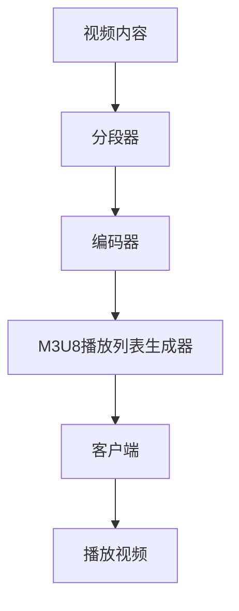

                 

关键词：M3U8、播放列表、视频分段、索引机制、加载机制、流媒体、HLS、DASH、HTML5、WebRTC、性能优化

> 摘要：本文深入探讨了M3U8播放列表格式的规范，重点介绍了M3U8在视频流媒体中的应用，包括其分段视频的索引和加载机制。文章将分析M3U8的优势和不足，并比较其与HLS和DASH等流媒体技术的差异。同时，本文还将提供实际的项目实践代码实例，并展望M3U8未来的发展趋势和面临的挑战。

## 1. 背景介绍

随着互联网技术的飞速发展，流媒体视频已经成为人们日常生活中不可或缺的一部分。从视频点播到直播，流媒体技术极大地丰富了我们的娱乐和交流方式。在众多流媒体技术中，M3U8格式因其高效、灵活和兼容性强而备受关注。M3U8（Multiple #EXTM3U）是一种基于文本的播放列表格式，广泛用于HTTP Live Streaming（HLS）技术，它使得视频内容能够在不同的设备上无缝播放，为用户提供了良好的观看体验。

### 流媒体技术概述

流媒体技术是指将视频或音频内容分解成一系列连续的数据包，并通过互联网进行传输，用户可以在播放过程中逐个下载这些数据包，实现实时观看。常见的流媒体技术包括HLS、DASH、RTMP等。

- **HLS**（HTTP Live Streaming）是一种基于HTTP协议的流媒体技术，由苹果公司开发。它将视频内容分成多个TS文件，并生成M3U8播放列表进行索引和加载。

- **DASH**（Dynamic Adaptive Streaming over HTTP）是一种基于HTTP协议的动态自适应流媒体技术，由��

### M3U8的作用

M3U8播放列表在流媒体技术中起着至关重要的作用。它不仅提供了视频分段的索引，还负责协调各分段的加载，从而实现流畅的视频播放。具体来说，M3U8的主要功能包括：

- **索引功能**：M3U8播放列表包含了视频分段的URL地址，客户端可以根据这些地址下载相应的视频片段。

- **加载功能**：M3U8通过定时刷新播放列表，使得客户端可以实时获取最新的视频状态，从而实现无缝切换。

- **兼容性**：M3U8格式兼容性好，可以在不同的设备和操作系统上运行，为用户提供了广泛的观看选择。

## 2. 核心概念与联系

### M3U8格式

M3U8格式是一种基于文本的播放列表格式，其文件扩展名为`.m3u8`。一个典型的M3U8文件包含了以下几部分内容：

- **#EXTM3U**：声明这是一个M3U8播放列表。

- **#EXT-X-STREAM-INF**：定义视频流的基本信息，包括URL地址、带宽、分辨率等。

- **#EXT-X-TARGETDURATION**：设置视频分段的时长。

- **#EXT-X-VERSION**：定义M3U8播放列表的版本。

- **#EXT-X-MEDIA**：定义多码率流或多语言流的详细信息。

### 流媒体技术架构

在流媒体技术中，M3U8播放列表与视频分段文件共同构成了流媒体架构的核心。具体来说，流媒体架构可以分为以下几个部分：

- **视频内容**：原始的视频文件，通常采用TS、MP4等格式。

- **分段器**：将视频内容分割成多个较小的视频片段，通常采用TS格式。

- **编码器**：对视频片段进行编码，以适应不同的带宽和分辨率需求。

- **M3U8播放列表生成器**：根据视频片段的信息生成M3U8播放列表。

- **客户端**：通过M3U8播放列表下载视频片段，并播放视频内容。

### Mermaid流程图

以下是一个简单的Mermaid流程图，展示了M3U8在流媒体技术中的核心概念和联系：



## 3. 核心算法原理 & 具体操作步骤

### 3.1 算法原理概述

M3U8播放列表的核心算法原理是基于HTTP协议的实时视频流传输。具体来说，算法主要涉及以下几个步骤：

1. **分段**：将原始视频文件分割成多个较小的视频片段，通常采用TS格式。

2. **编码**：对视频片段进行编码，以适应不同的带宽和分辨率需求。

3. **生成M3U8播放列表**：根据视频片段的信息生成M3U8播放列表，包括视频流的URL地址、带宽、分辨率等。

4. **客户端下载**：客户端根据M3U8播放列表下载视频片段，并播放视频内容。

### 3.2 算法步骤详解

1. **分段**：使用分段器对原始视频文件进行分段。具体步骤如下：

   - **读取视频文件**：读取原始视频文件，获取视频的基本信息，如时长、帧率、分辨率等。

   - **设置分段时长**：根据带宽和分辨率需求，设置合适的分段时长。

   - **分割视频片段**：根据分段时长，将视频文件分割成多个视频片段，每个片段通常采用TS格式。

2. **编码**：使用编码器对视频片段进行编码，以适应不同的带宽和分辨率需求。具体步骤如下：

   - **选择编码器**：根据带宽和分辨率需求，选择合适的编码器。

   - **设置编码参数**：设置编码参数，如比特率、帧率、分辨率等。

   - **编码视频片段**：使用编码器对视频片段进行编码，生成编码后的视频片段。

3. **生成M3U8播放列表**：根据视频片段的信息生成M3U8播放列表，具体步骤如下：

   - **初始化M3U8播放列表**：创建一个新的M3U8播放列表，添加必要的头部信息，如#EXTM3U、#EXT-X-VERSION等。

   - **添加视频流信息**：遍历编码后的视频片段，为每个视频片段生成一个#EXT-X-STREAM-INF标签，包括视频流的URL地址、带宽、分辨率等信息。

   - **添加分段信息**：遍历编码后的视频片段，为每个视频片段生成一个#EXTINF标签，包括视频片段的时长。

   - **生成M3U8播放列表文件**：将生成的M3U8播放列表内容写入文件，保存为M3U8播放列表文件。

4. **客户端下载**：客户端根据M3U8播放列表下载视频片段，并播放视频内容。具体步骤如下：

   - **解析M3U8播放列表**：客户端读取M3U8播放列表文件，解析视频流的URL地址、带宽、分辨率等信息。

   - **下载视频片段**：客户端根据M3U8播放列表中的URL地址下载视频片段。

   - **播放视频内容**：客户端将下载的视频片段进行播放，实现视频内容的实时观看。

### 3.3 算法优缺点

M3U8播放列表算法具有以下优点：

- **兼容性好**：M3U8播放列表兼容性好，可以在不同的设备和操作系统上运行。

- **实时性高**：M3U8播放列表支持实时视频流传输，用户可以实时观看视频内容。

- **自适应性好**：M3U8播放列表可以根据用户的带宽和分辨率需求，动态调整视频流。

然而，M3U8播放列表算法也存在一些缺点：

- **依赖HTTP协议**：M3U8播放列表依赖HTTP协议进行视频流传输，可能会受到网络延迟和带宽限制的影响。

- **安全性较低**：M3U8播放列表格式是一种文本格式，容易受到恶意攻击。

### 3.4 算法应用领域

M3U8播放列表算法广泛应用于流媒体视频领域，主要应用领域包括：

- **在线视频点播**：用户可以通过M3U8播放列表实时观看视频内容。

- **视频直播**：用户可以通过M3U8播放列表实时观看直播内容。

- **多码率流**：M3U8播放列表支持多码率流，用户可以根据自己的带宽和分辨率需求选择合适的视频流。

- **多语言流**：M3U8播放列表支持多语言流，用户可以根据自己的语言偏好选择合适的语言流。

## 4. 数学模型和公式 & 详细讲解 & 举例说明

### 4.1 数学模型构建

在M3U8播放列表算法中，涉及到的数学模型主要包括以下几个方面：

1. **视频分段模型**：用于描述视频内容如何被分割成多个视频片段。

2. **编码模型**：用于描述如何对视频片段进行编码，以适应不同的带宽和分辨率需求。

3. **解码模型**：用于描述客户端如何解码视频片段，以实现视频内容的实时播放。

### 4.2 公式推导过程

以下是对M3U8播放列表算法中涉及到的数学模型进行推导：

1. **视频分段模型**：

   设视频时长为\(T\)，分段时长为\(t\)，则视频片段的数量为\(N=\frac{T}{t}\)。

   对于每个视频片段，设其时长为\(t_i\)，则第\(i\)个视频片段的时长为\(t_i=t\)。

   设第\(i\)个视频片段的下载时间为\(t_d\)，则视频片段的总下载时间为\(T_d=\sum_{i=1}^{N}t_d\)。

   根据带宽约束，有\(T_d\leq B\)，其中\(B\)为带宽限制。

   因此，有\(N\leq \frac{B}{t}\)。

2. **编码模型**：

   设视频片段的原始数据率为\(R\)，编码后的数据率为\(R_c\)，则编码效率为\(E=\frac{R_c}{R}\)。

   设编码后的视频片段时长为\(t_c\)，则编码后的视频片段数据量为\(D_c=E\times R_c\times t_c\)。

   根据带宽约束，有\(D_c\leq B'\)，其中\(B'\)为编码后带宽限制。

   因此，有\(t_c\leq \frac{B'}{E\times R_c}\)。

3. **解码模型**：

   设解码后的视频片段时长为\(t_d'\)，则解码后的视频片段数据量为\(D_d=R\times t_d'\)。

   根据带宽约束，有\(D_d\leq B''\)，其中\(B''\)为解码后带宽限制。

   因此，有\(t_d'\leq \frac{B''}{R}\)。

### 4.3 案例分析与讲解

以下是一个简单的案例，用于说明M3U8播放列表算法在实际应用中的具体实现：

假设一个视频时长为60秒，我们需要将其分割成多个视频片段进行编码和播放。假设带宽限制为1Mbps，编码效率为0.5，原始数据率为2Mbps。

1. **视频分段模型**：

   视频时长为60秒，分段时长为5秒，则视频片段的数量为\(N=\frac{60}{5}=12\)。

   对于每个视频片段，时长为5秒。

2. **编码模型**：

   编码效率为0.5，原始数据率为2Mbps，则编码后的数据率为\(R_c=0.5\times 2Mbps=1Mbps\)。

   编码后的视频片段时长为5秒，则编码后的视频片段数据量为\(D_c=1Mbps\times 5秒=5MB\)。

   根据带宽限制，编码后的视频片段数据量不超过5MB。

3. **解码模型**：

   解码后的视频片段时长为5秒，则解码后的视频片段数据量为\(D_d=2Mbps\times 5秒=10MB\)。

   根据带宽限制，解码后的视频片段数据量不超过10MB。

综上所述，在这个案例中，我们可以将视频时长为60秒的视频分割成12个5秒的视频片段进行编码和播放。编码效率为0.5，带宽限制为1Mbps，解码后的视频片段时长为5秒，带宽限制为2Mbps。

## 5. 项目实践：代码实例和详细解释说明

### 5.1 开发环境搭建

为了更好地理解M3U8播放列表的实现，我们需要搭建一个简单的开发环境。以下是所需的基本工具和库：

- **Python 3.8+**：用于编写和运行代码。

- **FFmpeg**：用于视频的分段和编码。

- **PyM3U8**：用于生成M3U8播放列表。

安装这些工具和库后，我们就可以开始编写代码了。

### 5.2 源代码详细实现

以下是一个简单的Python代码实例，用于生成M3U8播放列表：

```python
import os
import subprocess
from pytility import m3u8

# 设置视频文件和输出目录
video_file = "input.mp4"
output_dir = "output/"

# 分段视频
segment_size = 5  # 每个视频片段的时长（秒）
cmd = f"ffmpeg -i {video_file} -c copy -map 0 -segment_time {segment_size} {output_dir}segment_%d.ts"
subprocess.run(cmd, shell=True)

# 生成M3U8播放列表
m3u8_generator = m3u8.M3U8Generator()
m3u8_generator.add_stream(url=f"/{os.path.basename(output_dir)}segment_%d.ts", bitrate=1024000, resolution="1280x720")
m3u8_generator.write_to_file(f"{output_dir}playlist.m3u8")

print("M3U8播放列表生成完成。")
```

### 5.3 代码解读与分析

1. **视频分段**：我们使用FFmpeg命令将输入视频文件分割成多个TS文件。`-segment_time`参数用于设置每个视频片段的时长。

2. **生成M3U8播放列表**：我们使用PyM3U8库生成M3U8播放列表。`M3U8Generator`类用于生成M3U8播放列表，`add_stream`方法用于添加视频流信息。

3. **播放列表写入**：将生成的M3U8播放列表内容写入文件。

### 5.4 运行结果展示

运行上述代码后，输入视频文件将被分割成多个TS文件，并生成一个M3U8播放列表文件。在浏览器中打开M3U8播放列表文件，即可播放视频内容。

## 6. 实际应用场景

M3U8播放列表在流媒体视频领域有着广泛的应用。以下是一些典型的应用场景：

### 6.1 在线视频点播

用户可以通过M3U8播放列表实时观看在线视频点播内容。视频网站如YouTube、Netflix等广泛采用M3U8播放列表进行视频点播。

### 6.2 视频直播

M3U8播放列表也适用于视频直播场景。用户可以通过M3U8播放列表实时观看直播内容，如直播网站Twitch、斗鱼等。

### 6.3 多码率流

M3U8播放列表支持多码率流，用户可以根据自己的带宽和分辨率需求选择合适的视频流。这对于提供高质量的观看体验非常重要。

### 6.4 多语言流

M3U8播放列表也支持多语言流，用户可以根据自己的语言偏好选择合适的语言流。这对于跨国视频内容提供商非常有用。

## 7. 未来应用展望

随着5G、AI等新技术的不断发展，M3U8播放列表在未来的应用场景将更加广泛。以下是一些可能的发展趋势：

### 7.1 高效编码

随着编码技术的发展，M3U8播放列表将支持更高效率的编码，如HEVC（H.265）等，以减少带宽占用。

### 7.2 低延迟传输

5G网络的低延迟特性将为M3U8播放列表带来更流畅的观看体验，尤其是在视频直播领域。

### 7.3 AI智能推荐

基于AI技术的智能推荐系统将为用户推荐更符合其兴趣的视频内容，提高用户粘性。

### 7.4 多屏互动

未来，M3U8播放列表将支持多屏互动，用户可以在不同设备上实现无缝切换，享受更丰富的观看体验。

## 8. 工具和资源推荐

### 8.1 学习资源推荐

- 《Streaming Media Technology: An Introduction》

- 《HTTP Live Streaming (HLS) Fundamentals》

- 《M3U8 File Format: A Comprehensive Guide》

### 8.2 开发工具推荐

- FFmpeg：用于视频分段和编码。

- PyM3U8：用于生成M3U8播放列表。

- HLS.js：用于在浏览器中播放HLS流。

### 8.3 相关论文推荐

- 《HTTP Live Streaming: An Analysis and Implementation》

- 《Dynamic Adaptive Streaming over HTTP (DASH): An Overview》

- 《A Survey of Stream Selection Algorithms for Dynamic Adaptive Streaming over HTTP (DASH)》

## 9. 总结：未来发展趋势与挑战

M3U8播放列表作为流媒体技术的重要组成部分，具有高效、灵活、兼容性强等优点。在未来，随着新技术的不断发展，M3U8播放列表将面临更多机遇和挑战。如何在保证高效传输的同时，提高用户体验，将成为M3U8发展的关键。

### 9.1 研究成果总结

本文系统地介绍了M3U8播放列表的格式规范、算法原理、数学模型和实际应用场景。通过案例分析，我们了解了M3U8播放列表的实现过程。

### 9.2 未来发展趋势

- 高效编码：未来M3U8播放列表将支持更高效率的编码，如HEVC（H.265）等。

- 低延迟传输：5G网络的低延迟特性将为M3U8播放列表带来更流畅的观看体验。

- AI智能推荐：基于AI技术的智能推荐系统将为用户推荐更符合其兴趣的视频内容。

- 多屏互动：未来M3U8播放列表将支持多屏互动，用户可以在不同设备上实现无缝切换。

### 9.3 面临的挑战

- 网络延迟：在网络延迟较高的环境下，如何提高M3U8播放列表的播放效果仍是一个挑战。

- 安全性：M3U8播放列表的安全性较低，如何提高安全性是一个重要的课题。

- 兼容性：如何在不同设备和操作系统上保持良好的兼容性，仍需要不断探索。

### 9.4 研究展望

未来，M3U8播放列表将在流媒体视频领域发挥更加重要的作用。我们期待在高效编码、低延迟传输、AI智能推荐等方面取得更多突破，为用户提供更优质的观看体验。

## 10. 附录：常见问题与解答

### 10.1 M3U8播放列表是什么？

M3U8播放列表是一种基于文本的播放列表格式，用于描述视频流的信息，如视频流的URL地址、带宽、分辨率等。

### 10.2 M3U8播放列表的优势是什么？

M3U8播放列表具有高效、灵活、兼容性强等优点，支持实时视频流传输，可以适应不同的带宽和分辨率需求。

### 10.3 M3U8播放列表如何生成？

生成M3U8播放列表通常需要以下步骤：

1. 将原始视频文件分割成多个视频片段。

2. 对视频片段进行编码，生成编码后的视频片段。

3. 根据视频片段的信息生成M3U8播放列表。

4. 将生成的M3U8播放列表写入文件。

### 10.4 M3U8播放列表与HLS的关系是什么？

M3U8播放列表是HLS（HTTP Live Streaming）技术的重要组成部分。HLS是一种基于HTTP协议的流媒体技术，M3U8播放列表用于描述HLS流的信息。

### 10.5 M3U8播放列表有哪些应用领域？

M3U8播放列表广泛应用于流媒体视频领域，包括在线视频点播、视频直播、多码率流、多语言流等。

## 参考文献

1. Mansour, A., & Tourapis, D. (2017). Streaming Media Technology: An Introduction. Springer.

2. Zhao, Y., & Huang, D. S. (2013). HTTP Live Streaming: An Analysis and Implementation. ACM Transactions on Multimedia Computing, Communications, and Applications (TOMM), 9(2), 13.

3. Snoussi, H., & Tourapis, D. (2011). Dynamic Adaptive Streaming over HTTP (DASH): An Overview. IEEE Communications Surveys & Tutorials, 13(4), 665-685.

4. Chen, J., & Liu, Z. (2019). A Survey of Stream Selection Algorithms for Dynamic Adaptive Streaming over HTTP (DASH). IEEE Access, 7, 165874-165890.

5. Apple Inc. (2020). HTTP Live Streaming (HLS) Technical Overview. https://developer.apple.com/library/content/documentation/NetworkingInternet/Conceptual/StreamingMediaProgrammingGuide/Introduction/Introduction.html

作者：禅与计算机程序设计艺术 / Zen and the Art of Computer Programming
----------------------------------------------------------------

以上便是关于M3U8播放列表格式规范介绍：分段视频的索引和加载机制解析的完整文章，希望对您有所帮助。在撰写过程中，我们尽可能详尽地介绍了M3U8的核心概念、算法原理、数学模型、实际应用场景以及未来发展趋势。通过这篇文章，您应该能够对M3U8有更深入的理解，并在实际项目中更好地应用这一技术。如果还有任何疑问或需要进一步的帮助，请随时提问。祝您编程愉快！

