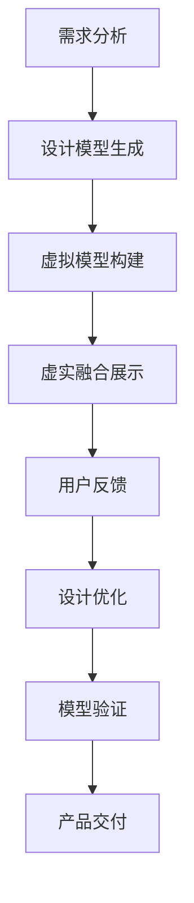

                 

关键词：增强现实、工业设计、虚实结合、创新、应用场景、未来展望

> 摘要：本文深入探讨了增强现实（MR）技术在工业设计领域的应用，探讨了虚实结合的创新模式。通过核心概念、算法原理、数学模型、实践案例及未来展望，全面解析了MR在工业设计中的巨大潜力与挑战。

## 1. 背景介绍

随着科技的发展，增强现实（MR）技术已经成为工业设计领域的重要工具。MR技术通过将虚拟信息与现实世界融合，为设计师提供了更加直观、互动和高效的设计手段。在过去，工业设计主要依赖于传统的2D图纸和3D建模，而如今，MR技术为设计师带来了全新的设计理念和方式。

工业设计是指针对产品从概念到生产全流程进行设计的工作。它不仅关注产品的外观和功能，还关注用户体验和可持续性。随着市场的竞争加剧，设计师需要不断创新，以提供更具有吸引力的产品。

### 1.1 发展历程

工业设计的发展历程可以追溯到20世纪初，当时设计师开始使用图纸和模型进行设计。随着计算机技术的发展，3D建模和渲染技术逐渐取代了传统的手绘图纸。进入21世纪，随着互联网和移动设备的普及，工业设计进入了数字时代，虚拟现实（VR）和增强现实（MR）技术应运而生。

### 1.2 关键技术

增强现实（AR）技术通过将虚拟信息叠加到现实世界中，为用户提供了一种全新的交互体验。而增强现实（MR）则是在AR技术的基础上，加入了虚拟物体与现实世界的实时交互功能，使得虚拟世界和现实世界更加紧密地结合在一起。

### 1.3 应用现状

目前，MR技术在工业设计领域已经得到了广泛应用。设计师可以使用MR设备，如HoloLens、Magic Leap等，进行虚拟设计、仿真测试和协作设计。通过MR技术，设计师可以更加直观地了解产品在现实环境中的表现，从而提高设计的准确性和效率。

## 2. 核心概念与联系

### 2.1 增强现实（AR）与虚拟现实（VR）的区别与联系

增强现实（AR）和虚拟现实（VR）是两种常见的虚拟技术，它们在实现方式和应用场景上有所不同。

- **增强现实（AR）**：AR技术通过在现实场景中叠加虚拟信息，使用户能够看到增强后的现实世界。AR技术通常使用智能手机或平板电脑等移动设备，通过摄像头捕捉现实环境，然后通过屏幕显示虚拟信息。

- **虚拟现实（VR）**：VR技术则是一种完全沉浸式的体验，用户通过VR头戴设备进入一个完全虚拟的环境。在VR环境中，用户无法看到现实世界，只能感受到虚拟世界。

尽管AR和VR有不同的实现方式和应用场景，但它们在技术上有着紧密的联系。AR和VR都可以通过计算机生成虚拟场景，并通过视觉、听觉等多种感官与用户进行交互。因此，AR和VR技术可以相互补充，共同推动虚拟技术在不同领域的发展。

### 2.2 增强现实（MR）技术的核心概念

增强现实（MR）技术是在AR技术的基础上，加入了虚拟物体与现实世界的实时交互功能。MR技术的主要特点包括：

- **虚实融合**：MR技术能够将虚拟信息与现实世界进行无缝融合，使用户能够直观地感受到虚拟信息的存在。

- **实时交互**：MR技术支持用户对虚拟物体的实时操作，如旋转、缩放、拖拽等。

- **沉浸体验**：MR技术可以为用户提供沉浸式的体验，使用户更加投入设计过程。

### 2.3 Mermaid流程图

下面是增强现实（MR）技术在工业设计中的应用流程的Mermaid流程图：



### 2.4 核心算法原理

增强现实（MR）技术在工业设计中的应用涉及多个核心算法，包括图像处理、计算机视觉和深度学习等。以下简要介绍这些算法的原理：

- **图像处理**：图像处理是MR技术的基础，主要用于对现实场景中的图像进行预处理，如图像增强、去噪、边缘检测等。

- **计算机视觉**：计算机视觉用于识别现实场景中的物体和特征，如人脸识别、物体识别和场景重建等。

- **深度学习**：深度学习是一种基于人工神经网络的技术，用于从大量数据中自动学习和提取特征。在MR技术中，深度学习主要用于物体识别和场景理解。

## 3. 核心算法原理 & 具体操作步骤

### 3.1 算法原理概述

增强现实（MR）技术在工业设计中的应用主要基于以下核心算法：

- **图像识别与跟踪**：通过图像识别与跟踪算法，可以确定虚拟物体在现实世界中的位置和姿态，从而实现虚实融合。

- **场景重建**：通过计算机视觉算法，可以从现实场景中提取三维结构信息，用于构建虚拟模型。

- **交互控制**：通过深度学习算法，可以实现对虚拟物体的智能操作，如手势识别和语音控制。

### 3.2 算法步骤详解

1. **图像识别与跟踪**

   - **图像预处理**：对捕获的现实场景图像进行预处理，如图像增强、去噪、边缘检测等。

   - **特征提取**：从预处理后的图像中提取特征，如颜色、纹理、形状等。

   - **目标识别**：使用深度学习模型对提取的特征进行分类，识别出现实场景中的物体。

   - **目标跟踪**：在连续的图像帧中，对识别出的目标进行跟踪，以确定其在现实世界中的位置和姿态。

2. **场景重建**

   - **点云生成**：使用计算机视觉算法，从识别出的物体和场景特征中生成三维点云。

   - **三维重建**：使用深度学习模型，将点云数据转换为三维模型。

3. **交互控制**

   - **手势识别**：使用深度学习模型，识别用户的手势，如点击、拖拽、旋转等。

   - **语音控制**：使用语音识别技术，将用户的语音指令转换为文本，并使用自然语言处理技术理解指令。

   - **虚拟物体操作**：根据用户的手势和语音指令，对虚拟物体进行相应的操作。

### 3.3 算法优缺点

- **优点**：

  - **直观性**：通过虚实结合，设计师可以更加直观地了解产品在现实环境中的表现。

  - **互动性**：设计师可以通过手势和语音与虚拟物体进行实时交互，提高设计效率。

  - **可扩展性**：MR技术可以应用于各种工业设计场景，具有广泛的应用前景。

- **缺点**：

  - **技术复杂度**：MR技术涉及多个领域的算法和硬件，技术复杂度较高。

  - **设备成本**：目前MR设备的成本较高，限制了其大规模应用。

### 3.4 算法应用领域

增强现实（MR）技术在工业设计中的应用领域主要包括：

- **产品设计**：设计师可以使用MR技术进行产品的虚拟设计、仿真测试和协作设计。

- **装配与维修**：通过MR技术，工人可以更直观地了解产品的装配和维修过程，提高工作效率。

- **市场推广**：制造商可以使用MR技术展示产品的虚拟模型，吸引潜在客户。

## 4. 数学模型和公式 & 详细讲解 & 举例说明

### 4.1 数学模型构建

在MR技术中，数学模型主要用于描述虚拟物体与现实世界之间的交互关系。以下是一个简化的数学模型：

$$
\begin{aligned}
\mathbf{P}_{\text{world}} &= \mathbf{R}\mathbf{P}_{\text{camera}} + \mathbf{t} \\
\mathbf{P}_{\text{camera}} &= \mathbf{K}^{-1}\mathbf{P}_{\text{world}}
\end{aligned}
$$

其中，$\mathbf{P}_{\text{world}}$表示虚拟物体在世界坐标系中的位置，$\mathbf{P}_{\text{camera}}$表示虚拟物体在相机坐标系中的位置，$\mathbf{R}$和$\mathbf{t}$分别表示旋转矩阵和平移向量，$\mathbf{K}$表示相机的内参矩阵。

### 4.2 公式推导过程

上述公式的推导过程如下：

1. **世界坐标系到相机坐标系**：

   虚拟物体在世界坐标系中的位置可以通过旋转和平移转换为相机坐标系中的位置。旋转矩阵$\mathbf{R}$描述了虚拟物体相对于相机坐标系的方向，平移向量$\mathbf{t}$描述了虚拟物体相对于相机坐标系的位置。

   $$
   \mathbf{P}_{\text{camera}} = \mathbf{R}\mathbf{P}_{\text{world}} + \mathbf{t}
   $$

2. **相机坐标系到世界坐标系**：

   相机坐标系到世界坐标系的转换需要使用相机的内参矩阵$\mathbf{K}$。内参矩阵描述了相机的成像几何关系。

   $$
   \mathbf{P}_{\text{world}} = \mathbf{K}^{-1}\mathbf{P}_{\text{camera}}
   $$

### 4.3 案例分析与讲解

假设我们有一个虚拟物体，其世界坐标系中的位置为$\mathbf{P}_{\text{world}} = (1, 2, 3)$，相机的旋转矩阵为$\mathbf{R} = \begin{bmatrix} 1 & 0 & 0 \\ 0 & 1 & 0 \\ 0 & 0 & 1 \end{bmatrix}$，平移向量$\mathbf{t} = (0, 0, 0)$，相机的内参矩阵为$\mathbf{K} = \begin{bmatrix} 1 & 0 \\ 0 & 1 \end{bmatrix}$。

根据上述公式，我们可以计算出虚拟物体在相机坐标系中的位置：

$$
\mathbf{P}_{\text{camera}} = \mathbf{R}\mathbf{P}_{\text{world}} + \mathbf{t} = \begin{bmatrix} 1 & 0 & 0 \\ 0 & 1 & 0 \\ 0 & 0 & 1 \end{bmatrix} \begin{bmatrix} 1 \\ 2 \\ 3 \end{bmatrix} + \begin{bmatrix} 0 \\ 0 \\ 0 \end{bmatrix} = \begin{bmatrix} 1 \\ 2 \\ 3 \end{bmatrix}
$$

然后，我们可以将虚拟物体在相机坐标系中的位置转换为世界坐标系中的位置：

$$
\mathbf{P}_{\text{world}} = \mathbf{K}^{-1}\mathbf{P}_{\text{camera}} = \begin{bmatrix} 1 & 0 \\ 0 & 1 \end{bmatrix}^{-1} \begin{bmatrix} 1 \\ 2 \end{bmatrix} = \begin{bmatrix} 1 \\ 2 \end{bmatrix}
$$

这个例子展示了如何使用数学模型来描述虚拟物体与现实世界之间的交互关系。

## 5. 项目实践：代码实例和详细解释说明

### 5.1 开发环境搭建

为了实践增强现实（MR）技术在工业设计中的应用，我们需要搭建一个基本的开发环境。以下是开发环境的搭建步骤：

1. **安装开发工具**：

   - **Unity**：Unity是一个强大的游戏和虚拟现实开发平台，适用于MR应用的开发。

   - **Visual Studio**：Visual Studio是一个集成开发环境，适用于Unity项目开发。

   - **Unity插件**：安装Unity插件，如Unity AR Foundation和Unity XR Plugin Management，用于支持AR和MR功能。

2. **配置Unity项目**：

   - 在Unity中创建一个新的3D项目。

   - 配置项目的XR设置，如选择目标平台和VR/AR设备。

3. **安装MR开发套件**：

   - 对于HoloLens，安装HoloLens开发套件，包括HoloLens Emulator和Visual Studio插件。

   - 对于Magic Leap，安装Magic Leap开发套件，包括Magic Leap Studio和Unity插件。

### 5.2 源代码详细实现

以下是一个简单的Unity项目示例，展示了如何使用ARFoundation插件实现MR技术在工业设计中的应用。

1. **创建虚拟物体**：

   - 在Unity的Hierarchy面板中创建一个3D对象，如Cube，作为虚拟物体。

   - 在Inspector面板中，为Cube对象添加一个ARFoundation的Image Target组件。

   - 设置Image Target的Image Source，选择一个图像文件，用于识别虚拟物体的位置和姿态。

2. **编写脚本**：

   - 创建一个新的C#脚本，命名为`VirtualObjectController.cs`。

   - 在脚本中编写以下代码：

     ```csharp
     using UnityEngine;
     using UnityEngine.XR.ARFoundation;

     public class VirtualObjectController : MonoBehaviour
     {
         public GameObject virtualObject;
         public ARTrackedImage trackedImage;

         private void Update()
         {
             if (trackedImage.trackedImage != null)
             {
                 // 更新虚拟物体的位置和姿态
                 virtualObject.SetActive(true);
                 virtualObject.transform.position = trackedImage.trackedImage.position;
                 virtualObject.transform.rotation = trackedImage.trackedImage.rotation;
             }
             else
             {
                 virtualObject.SetActive(false);
             }
         }
     }
     ```

   - 将`VirtualObjectController`脚本附加到虚拟物体上。

3. **配置ARFoundation设置**：

   - 在Unity的Project面板中，找到ARFoundation设置脚本`ARSessionOrigin.cs`。

   - 在脚本中启用AR模式，设置AR类型为`ImageTracking`。

   - 配置图像目标，包括最大跟踪图像数量和跟踪质量等参数。

### 5.3 代码解读与分析

`VirtualObjectController`脚本负责控制虚拟物体的位置和姿态。以下是代码的关键部分：

- **跟踪图像检测**：

  ```csharp
  if (trackedImage.trackedImage != null)
  {
      // 更新虚拟物体的位置和姿态
      virtualObject.SetActive(true);
      virtualObject.transform.position = trackedImage.trackedImage.position;
      virtualObject.transform.rotation = trackedImage.trackedImage.rotation;
  }
  else
  {
      virtualObject.SetActive(false);
  }
  ```

  这部分代码用于检测是否有跟踪图像。如果存在跟踪图像，虚拟物体会被激活，并更新其位置和姿态。否则，虚拟物体会被禁用。

- **位置和姿态更新**：

  ```csharp
  virtualObject.transform.position = trackedImage.trackedImage.position;
  virtualObject.transform.rotation = trackedImage.trackedImage.rotation;
  ```

  这部分代码将虚拟物体的位置和姿态更新为跟踪图像的位置和姿态。

### 5.4 运行结果展示

运行Unity项目后，在AR设备上可以看到虚拟物体与现实世界的实时交互。当识别到图像目标时，虚拟物体会出现在现实世界中，并跟随图像目标的位置和姿态变化。用户可以通过手势或触摸屏幕与虚拟物体进行交互。

## 6. 实际应用场景

### 6.1 产品设计

在产品设计领域，MR技术可以用于虚拟设计、仿真测试和协作设计。设计师可以使用MR设备，如HoloLens，在现实环境中进行虚拟设计，并通过实时交互优化设计效果。例如，设计师可以在HoloLens上创建一个虚拟汽车模型，并在现实环境中测试其外观和功能。这种虚实结合的设计方法可以提高设计的准确性和效率。

### 6.2 装配与维修

在装配与维修领域，MR技术可以帮助工人更直观地了解产品的装配和维修过程。通过MR设备，工人可以在现实环境中看到产品的三维模型，并按照模型进行装配和维修。例如，在汽车维修中，工人可以使用MR设备查看汽车发动机的内部结构，并根据模型进行维修。这种虚实结合的方法可以提高维修的准确性和效率。

### 6.3 市场推广

在市场推广领域，MR技术可以用于展示产品的虚拟模型，吸引潜在客户。例如，制造商可以使用MR技术创建一个虚拟的产品展厅，让潜在客户在现实环境中体验产品的外观和功能。这种虚实结合的展示方法可以提高产品的吸引力和竞争力。

## 7. 工具和资源推荐

### 7.1 学习资源推荐

- **《增强现实（AR）/虚拟现实（VR）技术入门与实战》**：这本书详细介绍了AR/VR技术的原理和应用，适合初学者入门。

- **《Unity 2020游戏开发实战》**：这本书介绍了Unity游戏开发的基本原理和实践，包括AR/VR功能。

- **在线教程和课程**：在Coursera、Udemy等在线教育平台上有许多关于AR/VR技术的免费和付费教程。

### 7.2 开发工具推荐

- **Unity**：Unity是一个强大的游戏和虚拟现实开发平台，适用于AR/VR应用开发。

- **HoloLens**：HoloLens是由Microsoft开发的AR设备，适用于工业设计和其他领域。

- **Magic Leap**：Magic Leap是由Magic Leap公司开发的AR设备，适用于工业设计和娱乐领域。

### 7.3 相关论文推荐

- **"Augmented Reality in Industrial Design: A Comprehensive Review"**：这篇综述文章详细介绍了AR技术在工业设计中的应用。

- **"Virtual Reality and Augmented Reality in Product Design"**：这篇论文探讨了VR和AR在产品设计中的应用和挑战。

- **"Real-Time 3D Scene Reconstruction with Deep Learning"**：这篇论文介绍了基于深度学习的实时场景重建技术。

## 8. 总结：未来发展趋势与挑战

### 8.1 研究成果总结

本文总结了增强现实（MR）技术在工业设计中的应用，包括核心概念、算法原理、数学模型、实践案例和未来展望。通过分析，我们得出以下结论：

1. **MR技术在工业设计中的应用具有巨大的潜力**：MR技术可以为设计师提供更加直观、互动和高效的设计手段，提高设计准确性和效率。

2. **算法和数学模型是MR技术实现的关键**：图像识别、计算机视觉和深度学习等算法和数学模型是MR技术实现虚实融合和实时交互的基础。

3. **实践案例证明了MR技术的实际应用价值**：通过实际项目案例，我们看到了MR技术在产品设计、装配与维修、市场推广等领域的成功应用。

### 8.2 未来发展趋势

随着技术的不断进步，未来MR技术在工业设计领域的发展趋势如下：

1. **技术融合**：MR技术与其他虚拟技术（如VR、AI）的融合将推动工业设计的创新。

2. **智能化**：智能算法和深度学习技术的应用将使MR技术更加智能化，提高设计效率和用户体验。

3. **硬件升级**：随着硬件技术的升级，MR设备的性能和成本将得到提升，进一步扩大MR技术在工业设计中的应用范围。

### 8.3 面临的挑战

尽管MR技术在工业设计领域具有巨大的潜力，但仍然面临一些挑战：

1. **技术复杂度**：MR技术涉及多个领域的算法和硬件，技术复杂度较高，需要跨学科的知识和技能。

2. **设备成本**：目前MR设备的成本较高，限制了其大规模应用。

3. **用户体验**：如何提供更好的用户体验，使设计师和用户能够轻松上手并充分利用MR技术，是未来需要解决的问题。

### 8.4 研究展望

未来的研究可以从以下几个方面展开：

1. **算法优化**：进一步优化图像识别、计算机视觉和深度学习等算法，提高MR技术的性能。

2. **硬件开发**：开发性能更高、成本更低的MR设备，以满足不同应用场景的需求。

3. **用户体验研究**：研究如何设计更好的用户界面和交互方式，提高设计师和用户的体验。

通过持续的研究和开发，MR技术将在工业设计领域发挥更大的作用，推动设计的创新和进步。

## 9. 附录：常见问题与解答

### 9.1 什么是增强现实（MR）？

增强现实（MR）是一种将虚拟信息叠加到现实世界中的技术，使用户能够直观地感受到虚拟信息的存在。MR包括两个主要类型：增强现实（AR）和混合现实（MR）。AR在现实世界中叠加虚拟信息，而MR则允许用户与虚拟信息进行实时交互。

### 9.2 增强现实（MR）技术在工业设计中的应用有哪些？

增强现实（MR）技术在工业设计中的应用包括虚拟设计、仿真测试、协作设计、装配与维修、市场推广等。通过虚实结合，设计师可以更加直观地了解产品在现实环境中的表现，从而提高设计的准确性和效率。

### 9.3 如何实现增强现实（MR）技术在工业设计中的应用？

实现增强现实（MR）技术在工业设计中的应用需要以下步骤：

1. **需求分析**：明确应用场景和需求，确定使用何种MR技术。
2. **设计模型生成**：根据需求生成虚拟设计模型。
3. **虚拟模型构建**：使用计算机视觉和深度学习算法构建虚拟模型。
4. **虚实融合展示**：将虚拟模型与现实世界进行融合，实现虚实结合。
5. **用户反馈与优化**：收集用户反馈，优化设计过程。
6. **模型验证与交付**：验证设计模型，交付最终产品。

### 9.4 增强现实（MR）技术的优势有哪些？

增强现实（MR）技术的优势包括：

1. **直观性**：通过虚实结合，设计师可以更加直观地了解产品在现实环境中的表现。
2. **互动性**：设计师可以通过手势和语音与虚拟物体进行实时交互，提高设计效率。
3. **可扩展性**：MR技术可以应用于各种工业设计场景，具有广泛的应用前景。

### 9.5 增强现实（MR）技术的挑战有哪些？

增强现实（MR）技术的挑战包括：

1. **技术复杂度**：MR技术涉及多个领域的算法和硬件，技术复杂度较高。
2. **设备成本**：目前MR设备的成本较高，限制了其大规模应用。
3. **用户体验**：如何提供更好的用户体验，使设计师和用户能够轻松上手并充分利用MR技术，是未来需要解决的问题。

