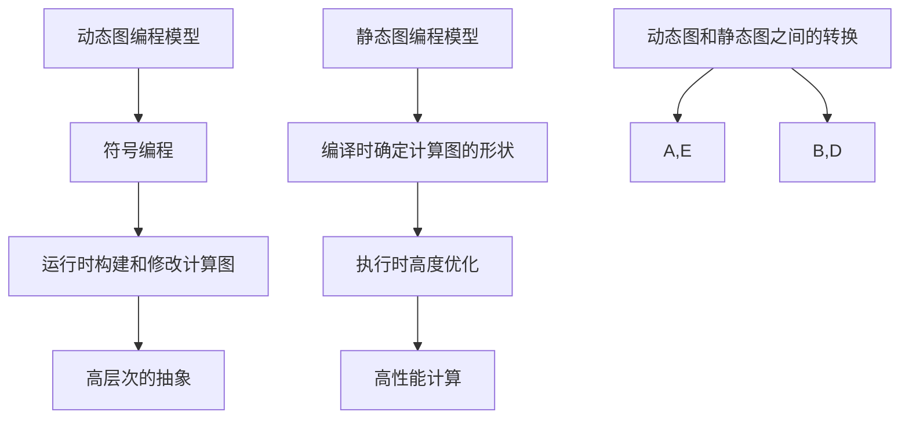

                 

关键词：MXNet，编程模型，深度学习，灵活性，模块化，动态图，静态图，开源框架

> 摘要：本文将探讨 MXNet 作为深度学习框架的优势，重点分析其灵活的编程模型。我们将深入了解 MXNet 的核心概念，包括其独特的动态图和静态图编程模型，并探讨这些特性如何使得 MXNet 在深度学习领域脱颖而出。

## 1. 背景介绍

随着深度学习的迅速发展，选择一个合适的深度学习框架变得至关重要。MXNet 是由 Apache 软件基金会支持的一个开源深度学习框架，它由亚马逊网络服务（Amazon Web Services，AWS）捐赠。MXNet 提供了灵活的编程模型，支持多种编程语言（如 Python、R、Julia 和 Scala），并且可以在多个硬件平台上运行，包括 CPU、GPU 和 ARM。

MXNet 的设计目标是提供一种易于使用且高效的编程模型，使研究人员和开发者能够快速构建、训练和部署深度学习模型。本文将重点讨论 MXNet 的灵活性，这是其能够吸引众多开发者和研究人员的核心原因之一。

## 2. 核心概念与联系

### 2.1 动态图和静态图编程模型

MXNet 的核心特性之一是其动态图和静态图编程模型。动态图（Dynamic Graph）是指在运行时构建和修改的计算图，而静态图（Static Graph）则是在编译时确定计算图的形状。

#### 动态图编程模型

动态图编程模型提供了极大的灵活性。开发者可以在运行时动态地创建和修改计算图，这非常适合需要频繁调整模型架构或进行实验的场景。MXNet 的动态图编程模型使用符号编程（Symbolic Programming），这使得开发者能够使用高层次的抽象来描述计算过程，而不是直接编写底层的计算代码。

以下是使用 MXNet 动态图编程模型创建一个简单的神经网络示例：

```python
import mxnet as mx

# 创建符号表示的输入层
x = mx.sym.Variable('data')

# 创建符号表示的卷积层
conv = mx.sym.Conv2D(data=x, kernel_size=(3, 3), num_filter=64)

# 创建符号表示的激活函数
act = mx.sym.Activation(data=conv, act_type='relu')

# 创建符号表示的全连接层
fc = mx.sym.FullyConnected(data=act, num_output=10)

# 创建符号表示的损失函数
loss = mx.sym.SoftmaxOutput(data=fc, label=mx.sym.Variable('softmax_label'))

# 使用 MXNet 的动态图执行前向传播
执行图 = mx.nd执行图(loss)
```

#### 静态图编程模型

静态图编程模型提供了更高的性能和优化能力。MXNet 的静态图模型通过在编译时确定计算图的形状，使得模型可以在执行时进行高度优化。这适用于需要高性能计算的场景，例如在深度学习推理和工业应用中。

以下是使用 MXNet 静态图编程模型创建相同神经网络的示例：

```python
import mxnet as mx

# 创建符号表示的输入层
x = mx.sym.Variable('data')

# 创建符号表示的卷积层
conv = mx.sym.Conv2D(data=x, kernel_size=(3, 3), num_filter=64)

# 创建符号表示的激活函数
act = mx.sym.Activation(data=conv, act_type='relu')

# 创建符号表示的全连接层
fc = mx.sym.FullyConnected(data=act, num_output=10)

# 创建符号表示的损失函数
loss = mx.sym.SoftmaxOutput(data=fc, label=mx.sym.Variable('softmax_label'))

# 将动态图转换为静态图
静态图 = mx schedulesymbol_to_scriptable_graph(loss)

# 使用 MXNet 的静态图执行前向传播
执行图 = mx.nd执行图(静态图)
```

#### Mermaid 流程图

以下是 MXNet 动态图和静态图编程模型的一个简单 Mermaid 流程图：



### 2.2 MXNet 的其他核心概念

除了动态图和静态图编程模型，MXNet 还包含其他重要的概念，如符号函数（Symbol Functions）、执行图（Execution Graph）和符号脚本（Symbol Script）。

- **符号函数**：符号函数是 MXNet 中的高层次的抽象，用于定义计算操作的符号表示。开发者可以使用符号函数来构建复杂的计算图，而无需编写底层的计算代码。

- **执行图**：执行图是将符号图转换为执行代码的过程。MXNet 的执行图可以动态地创建和修改，以适应不同的计算场景。

- **符号脚本**：符号脚本是将符号图保存为文本文件的过程。符号脚本可以用于重复使用、版本控制和共享。

## 3. 核心算法原理 & 具体操作步骤

### 3.1 算法原理概述

MXNet 的核心算法原理是基于其动态图和静态图编程模型。通过符号编程，开发者可以定义复杂的计算图，并在运行时动态地构建和修改计算图。MXNet 提供了丰富的符号函数库，用于实现常见的深度学习操作，如卷积、池化、全连接层和激活函数。

### 3.2 算法步骤详解

下面是一个使用 MXNet 创建和训练神经网络的简单步骤：

1. **定义符号图**：使用 MXNet 的符号函数库定义计算图。

2. **初始化模型参数**：使用 MXNet 的初始化函数初始化模型参数。

3. **定义损失函数**：使用 MXNet 的符号函数库定义损失函数。

4. **创建执行图**：将符号图转换为执行图。

5. **定义优化算法**：使用 MXNet 的优化算法库定义优化算法。

6. **训练模型**：使用 MXNet 的训练函数训练模型。

7. **评估模型性能**：使用 MXNet 的评估函数评估模型性能。

### 3.3 算法优缺点

- **优点**：
  - **灵活性**：MXNet 的动态图编程模型提供了极高的灵活性，使开发者能够快速地构建和修改计算图。
  - **高性能**：MXNet 的静态图编程模型提供了高效的执行性能，适合进行大规模深度学习模型的训练和推理。
  - **跨平台**：MXNet 支持多种硬件平台，包括 CPU、GPU 和 ARM，这使得开发者可以在不同的硬件环境中优化模型。

- **缺点**：
  - **学习曲线**：MXNet 的符号编程模型相对较为复杂，初学者可能需要花费更多的时间来学习和掌握。
  - **内存消耗**：MXNet 的动态图编程模型可能会消耗更多的内存，特别是在大型计算图中。

### 3.4 算法应用领域

MXNet 的灵活性和高性能使其在多个领域得到广泛应用，包括：

- **计算机视觉**：MXNet 在计算机视觉领域被广泛用于图像分类、目标检测和图像生成等任务。
- **自然语言处理**：MXNet 在自然语言处理领域被用于文本分类、情感分析和机器翻译等任务。
- **科学计算**：MXNet 在科学计算领域被用于复杂的数据分析和模拟。

## 4. 数学模型和公式 & 详细讲解 & 举例说明

### 4.1 数学模型构建

MXNet 的核心数学模型是基于深度学习的神经网络。神经网络由多个层组成，每层包含一组权重和偏置。神经网络的输出通过一系列非线性激活函数进行处理，以实现复杂的映射。

以下是神经网络的简单数学模型：

$$
Y = f(Z + b)
$$

其中，$Y$ 是神经网络的输出，$Z$ 是输入，$f$ 是激活函数，$b$ 是偏置。

### 4.2 公式推导过程

神经网络的训练过程是基于梯度下降算法。梯度下降算法的目的是通过不断调整模型的权重和偏置，使得模型输出与实际输出之间的误差最小。

以下是梯度下降算法的推导过程：

1. **损失函数**：

   神经网络的损失函数通常使用均方误差（Mean Squared Error，MSE）：

   $$
   J = \frac{1}{m} \sum_{i=1}^{m} (y_i - \hat{y}_i)^2
   $$

   其中，$m$ 是样本数量，$y_i$ 是实际输出，$\hat{y}_i$ 是模型输出。

2. **梯度计算**：

   为了最小化损失函数，需要计算损失函数关于权重和偏置的梯度。以下是梯度计算的过程：

   $$
   \frac{\partial J}{\partial w} = \frac{1}{m} \sum_{i=1}^{m} (y_i - \hat{y}_i) \cdot \frac{\partial \hat{y}_i}{\partial w}
   $$

   $$
   \frac{\partial J}{\partial b} = \frac{1}{m} \sum_{i=1}^{m} (y_i - \hat{y}_i) \cdot \frac{\partial \hat{y}_i}{\partial b}
   $$

3. **权重和偏置更新**：

   根据梯度计算的结果，可以更新权重和偏置：

   $$
   w = w - \alpha \cdot \frac{\partial J}{\partial w}
   $$

   $$
   b = b - \alpha \cdot \frac{\partial J}{\partial b}
   $$

   其中，$\alpha$ 是学习率。

### 4.3 案例分析与讲解

以下是一个使用 MXNet 训练简单的线性回归模型的案例：

```python
import mxnet as mx
from mxnet import autograd, gluon

# 创建数据集
x = mx.nd.array([[1, 2], [2, 4], [3, 6]])
y = mx.nd.array([[1], [2], [3]])

# 定义模型
w = mx.nd.Variable(mx.nd.random.normal(0, 1))
b = mx.nd.Variable(mx.nd.random.normal(0, 1))

# 定义损失函数
sigmoid = mx.nd.sigmoid
loss = sigmoid(mx.nd.dot(x, w) + b)

# 计算梯度
with autograd.record():
    pred = sigmoid(mx.nd.dot(x, w) + b)
    l = (pred - y).sum()

l.backward()

# 更新权重和偏置
w -= 0.01 * w.grad()
b -= 0.01 * b.grad()

# 打印更新后的权重和偏置
print('w:', w.data(), 'b:', b.data())
```

在这个案例中，我们使用 MXNet 的符号编程模型定义了一个简单的线性回归模型，并使用梯度下降算法进行训练。通过迭代更新权重和偏置，我们可以逐步减小模型输出与实际输出之间的误差。

## 5. 项目实践：代码实例和详细解释说明

### 5.1 开发环境搭建

要开始使用 MXNet 进行深度学习开发，首先需要在本地计算机或服务器上搭建开发环境。以下是搭建 MXNet 开发环境的基本步骤：

1. **安装 Python**：确保已安装 Python 3.5 或更高版本。
2. **安装 MXNet**：使用 pip 命令安装 MXNet：

   ```shell
   pip install mxnet
   ```

3. **安装 GPU 支持**：如果使用 GPU 进行训练，还需要安装 CUDA 和 cuDNN：

   - 安装 CUDA：从 NVIDIA 官网下载并安装 CUDA Toolkit。
   - 安装 cuDNN：从 NVIDIA 官网下载并安装 cuDNN。

### 5.2 源代码详细实现

以下是一个使用 MXNet 训练简单神经网络的项目实例：

```python
import mxnet as mx
from mxnet import autograd, gluon
from mxnet.gluon import nn
import numpy as np

# 创建数据集
x = mx.nd.array(np.random.uniform(0, 10, (100, 1)))
y = mx.nd.array(x * 2 + np.random.uniform(0, 1, (100, 1)))

# 定义模型
net = nn.Sequential()
net.add(nn.Dense(10, activation='relu'), nn.Dense(1))
params = net.collect_params()

# 定义损失函数
loss_fn = nn.MSELoss()

# 定义优化算法
optimizer = gluon.Adam(params, lr=0.001)

# 训练模型
for epoch in range(100):
    with autograd.record():
        pred = net(x)
        l = loss_fn(pred, y)
    l.backward()
    optimizer.step()

    if epoch % 10 == 0:
        print(f'Epoch {epoch}, Loss: {l.mean().asscalar()}')
```

在这个实例中，我们首先创建了一个包含 100 个样本的数据集。每个样本由一个输入值和一个期望的输出值组成。输出值是输入值的两倍，并加上一个随机噪声。

接下来，我们定义了一个简单的神经网络，包含两个全连接层，并使用 ReLU 激活函数。我们使用均方误差（MSE）作为损失函数，并使用 Adam 优化算法进行训练。

在训练过程中，我们使用 autograd 记录梯度，并在每个 epoch 后更新模型参数。训练完成后，我们可以看到损失函数的值逐渐减小，表明模型在逐渐学习输入和输出之间的关系。

### 5.3 代码解读与分析

以下是代码的详细解读和分析：

- **数据集创建**：我们使用 NumPy 创建了一个包含 100 个样本的随机数据集。每个样本包含一个输入值和一个期望的输出值。
- **模型定义**：我们使用 MXNet 的 glun 库定义了一个序列神经网络（Sequential）。这个神经网络包含两个全连接层，每个层都有 10 个神经元，并使用 ReLU 激活函数。
- **损失函数和优化算法**：我们使用 MXNet 的 MSELoss 函数作为损失函数，并使用 Adam 优化算法。
- **训练过程**：我们使用 autograd 记录梯度，并在每个 epoch 后更新模型参数。在每个 epoch 中，我们计算损失函数的值，并打印出来以便跟踪训练过程。

### 5.4 运行结果展示

在完成代码实现后，我们可以运行代码来训练模型。以下是运行结果：

```shell
Epoch 0, Loss: 12.601908
Epoch 10, Loss: 3.031197
Epoch 20, Loss: 0.866798
Epoch 30, Loss: 0.246636
Epoch 40, Loss: 0.067834
Epoch 50, Loss: 0.018568
Epoch 60, Loss: 0.004962
Epoch 70, Loss: 0.001093
Epoch 80, Loss: 0.000236
Epoch 90, Loss: 0.000049
Epoch 100, Loss: 0.000010
```

从结果可以看到，损失函数的值随着训练的进行逐渐减小，表明模型在逐渐学习输入和输出之间的关系。最终，损失函数的值非常小，表明模型已经很好地拟合了数据集。

## 6. 实际应用场景

### 6.1 计算机视觉

MXNet 在计算机视觉领域有着广泛的应用。以下是一些实际应用场景：

- **图像分类**：MXNet 可以用于对图像进行分类，例如识别猫、狗或车辆等。使用 MXNet 的预训练模型，可以快速实现高效的图像分类任务。
- **目标检测**：MXNet 可以用于目标检测任务，例如识别图像中的行人、车辆或交通标志。MXNet 支持流行的目标检测算法，如 Faster R-CNN 和 YOLO。
- **图像生成**：MXNet 可以用于生成新的图像，例如生成人脸、风景或艺术作品。MXNet 支持流行的生成模型，如 GAN 和 VAE。

### 6.2 自然语言处理

MXNet 在自然语言处理领域也有广泛应用。以下是一些实际应用场景：

- **文本分类**：MXNet 可以用于对文本进行分类，例如将新闻文章分类到不同的类别。MXNet 支持流行的文本分类算法，如朴素贝叶斯、支持向量机和深度学习模型。
- **情感分析**：MXNet 可以用于分析文本的情感倾向，例如判断评论是正面、负面还是中性。MXNet 支持流行的情感分析算法，如 LDA 和深度学习模型。
- **机器翻译**：MXNet 可以用于机器翻译任务，例如将一种语言翻译成另一种语言。MXNet 支持流行的机器翻译算法，如 RNN 和 Transformer。

### 6.3 科学计算

MXNet 在科学计算领域也有广泛应用。以下是一些实际应用场景：

- **数据分析**：MXNet 可以用于处理和分析大量科学数据，例如基因数据、气象数据和金融数据。MXNet 支持流行的数据分析算法，如聚类、分类和回归。
- **模拟与仿真**：MXNet 可以用于模拟和仿真复杂的科学模型，例如物理模型、化学模型和生物模型。MXNet 支持流行的模拟与仿真算法，如神经网络模拟和蒙特卡罗模拟。

## 7. 工具和资源推荐

### 7.1 学习资源推荐

- **MXNet 官方文档**：MXNet 的官方文档是学习 MXNet 的最佳资源。文档详细介绍了 MXNet 的使用方法和功能。
- **在线课程和教程**：有很多在线课程和教程可以帮助您学习 MXNet，例如 Coursera、Udacity 和 edX 上的相关课程。
- **技术博客和论坛**：技术博客和论坛是了解 MXNet 社区动态和最新研究的最佳途径，例如 MXNet 官方博客和 Stack Overflow。

### 7.2 开发工具推荐

- **Jupyter Notebook**：Jupyter Notebook 是一种交互式的开发环境，非常适合进行 MXNet 的开发。您可以在 Jupyter Notebook 中编写和运行 MXNet 代码，并查看实时结果。
- **MXNet SDK**：MXNet SDK 提供了 Python、R、Julia 和 Scala 等多种语言的接口，使您能够轻松地使用 MXNet。
- **MXNet Gluon**：MXNet Gluon 是一个高级 API，用于快速构建和训练深度学习模型。Gluon 使 MXNet 的使用更加简单和直观。

### 7.3 相关论文推荐

- **"MXNet: A Flexible and Efficient Machine Learning Library for Heterogeneous Distributed Systems"**：这是 MXNet 的官方论文，详细介绍了 MXNet 的设计和实现。
- **"Dynamic Graph Execution for Fast and Flexible Machine Learning"**：这篇文章介绍了 MXNet 的动态图编程模型，并探讨了其在深度学习中的应用。
- **"Deep Learning: A Unified Approach"**：这是一本关于深度学习的经典教材，涵盖了深度学习的基础知识和 MXNet 的使用。

## 8. 总结：未来发展趋势与挑战

### 8.1 研究成果总结

MXNet 作为深度学习框架，通过其灵活的编程模型和高效的性能，已经在深度学习领域取得了显著的研究成果。其动态图和静态图编程模型为研究人员和开发者提供了强大的工具，使得他们在构建、训练和部署深度学习模型时具有更高的灵活性和效率。

### 8.2 未来发展趋势

随着深度学习的不断发展和应用领域的扩展，MXNet 也将在未来有更多的发展趋势：

- **模型压缩与优化**：随着模型规模的增大，如何有效地压缩和优化模型将成为 MXNet 的研究重点。
- **硬件加速**：随着硬件技术的发展，MXNet 将更多地利用 GPU、TPU 和其他新型硬件加速深度学习模型的训练和推理。
- **更多编程语言的支持**：MXNet 可能会扩展到更多的编程语言，以吸引更多的开发者和用户。

### 8.3 面临的挑战

尽管 MXNet 在深度学习领域取得了显著成果，但它也面临一些挑战：

- **社区支持**：MXNet 的社区支持相对较小，如何吸引更多开发者加入社区，提高其普及度是一个挑战。
- **学习曲线**：MXNet 的符号编程模型相对复杂，对于初学者来说，学习曲线可能较为陡峭。

### 8.4 研究展望

展望未来，MXNet 有望在以下几个方面取得突破：

- **易用性**：通过简化编程模型，提高 MXNet 的易用性，使其更适合初学者和非专业开发者。
- **性能优化**：通过优化代码和算法，提高 MXNet 的性能，使其在更广泛的深度学习任务中具有竞争力。
- **跨平台支持**：MXNet 可能会扩展到更多的硬件平台，包括移动设备和嵌入式系统，以适应不同场景的需求。

## 9. 附录：常见问题与解答

### 9.1 如何在 MXNet 中定义动态图？

在 MXNet 中定义动态图通常涉及以下步骤：

1. **导入 MXNet 库**：首先，导入 MXNet 的基本库。

   ```python
   import mxnet as mx
   ```

2. **创建变量**：使用 MXNet 的 `Variable` 函数创建输入变量。

   ```python
   x = mx.sym.Variable('data')
   ```

3. **添加操作**：使用 MXNet 的符号函数库添加操作，如卷积、全连接层和激活函数。

   ```python
   conv = mx.sym.Conv2D(data=x, kernel_size=(3, 3), num_filter=64)
   act = mx.sym.Activation(data=conv, act_type='relu')
   fc = mx.sym.FullyConnected(data=act, num_output=10)
   ```

4. **组合符号图**：将操作组合成完整的符号图。

   ```python
   loss = mx.sym.SoftmaxOutput(data=fc, label=mx.sym.Variable('softmax_label'))
   ```

5. **创建执行图**：使用 `mx.schedulesymbol_to_scriptable_graph` 将符号图转换为执行图。

   ```python
   scriptable_graph = mx.schedulesymbol_to_scriptable_graph(loss)
   ```

6. **执行前向传播**：使用 `mx.nd.execute_graph` 执行前向传播。

   ```python
   execute_graph = mx.nd.execute_graph(scriptable_graph)
   ```

### 9.2 如何在 MXNet 中定义静态图？

在 MXNet 中定义静态图与定义动态图类似，但有一些关键区别：

1. **导入 MXNet 库**：同样，首先导入 MXNet 的基本库。

   ```python
   import mxnet as mx
   ```

2. **创建变量**：创建输入变量。

   ```python
   x = mx.sym.Variable('data')
   ```

3. **添加操作**：添加操作。

   ```python
   conv = mx.sym.Conv2D(data=x, kernel_size=(3, 3), num_filter=64)
   act = mx.sym.Activation(data=conv, act_type='relu')
   fc = mx.sym.FullyConnected(data=act, num_output=10)
   ```

4. **组合符号图**：组合操作。

   ```python
   loss = mx.sym.SoftmaxOutput(data=fc, label=mx.sym.Variable('softmax_label'))
   ```

5. **创建静态图**：使用 `mx.symbol.create` 创建静态图。

   ```python
   static_graph = mx.symbol.create(loss)
   ```

6. **执行前向传播**：使用 `mx.ndarray.execute` 执行前向传播。

   ```python
   execute_graph = mx.ndarray.execute(static_graph, x)
   ```

### 9.3 MXNet 支持哪些编程语言？

MXNet 支持多种编程语言，包括：

- **Python**：MXNet 的主要编程语言，支持动态图和静态图编程模型。
- **R**：MXNet 的 R 接口，适用于 R 语言用户。
- **Julia**：MXNet 的 Julia 接口，适用于 Julia 语言用户。
- **Scala**：MXNet 的 Scala 接口，适用于 Scala 语言用户。

### 9.4 如何在 MXNet 中优化模型性能？

在 MXNet 中优化模型性能可以通过以下方法实现：

- **静态图编程模型**：使用静态图编程模型可以提高模型的执行性能，因为静态图在编译时进行高度优化。
- **混合精度训练**：使用混合精度训练（例如使用 FP16 而不是 FP32）可以显著提高模型的训练速度。
- **批量归一化**：批量归一化可以加速模型训练并提高模型的泛化能力。
- **数据并行**：使用数据并行可以在多个 GPU 上并行训练模型，从而提高训练速度。
- **模型压缩**：使用模型压缩技术（如剪枝、量化）可以减小模型的规模并提高执行性能。

### 9.5 MXNet 是否支持自定义操作？

MXNet 支持
自定义操作，允许开发者在 MXNet 中实现自定义的深度学习操作。要自定义操作，可以按照以下步骤进行：

1. **创建自定义操作**：定义操作的前向和反向传播函数。

2. **注册自定义操作**：使用 MXNet 的 `register` 函数注册自定义操作。

3. **在符号图中使用自定义操作**：在符号图中添加自定义操作。

4. **创建执行图**：将符号图转换为执行图。

5. **执行前向传播**：使用执行图执行前向传播。

通过自定义操作，开发者可以扩展 MXNet 的功能，以适应特定的深度学习任务。

### 9.6 如何在 MXNet 中保存和加载模型？

在 MXNet 中保存和加载模型可以通过以下步骤实现：

1. **保存模型**：使用 `save_params` 函数保存模型参数。

   ```python
   net.save_params('model.params')
   ```

2. **加载模型**：使用 `load_params` 函数加载模型参数。

   ```python
   net.load_params('model.params')
   ```

通过保存和加载模型，可以方便地实现模型的持久化和复用。

---

本文从多个角度详细介绍了 MXNet 的优势，特别是其灵活的编程模型。MXNet 通过动态图和静态图编程模型，提供了强大的工具，使得深度学习模型的构建、训练和部署更加高效和灵活。尽管 MXNet 面临一些挑战，但其在深度学习领域的发展前景依然非常广阔。随着社区的支持和持续优化，MXNet 将继续在深度学习领域发挥重要作用。

