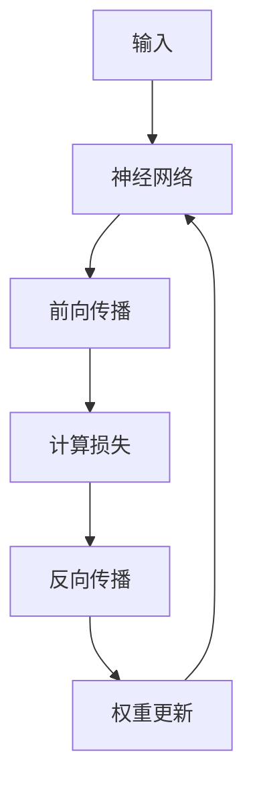

                 

关键词：机器学习、反向传播、神经网络、深度学习、数学模型、编程实践、算法优化、应用场景

> 摘要：本文将深入探讨机器学习中的核心算法——反向传播，通过具体实例详细解析Micrograd框架，旨在帮助读者理解和掌握反向传播的基本原理及其在机器学习中的应用。

## 1. 背景介绍

随着计算机技术和算法理论的不断进步，机器学习已经成为当今最具活力的领域之一。其中，反向传播（Backpropagation）算法作为神经网络训练的核心机制，被广泛应用于各类复杂问题的求解。反向传播算法的核心思想是通过层层传递误差，更新网络权重，从而优化模型性能。然而，对于初学者而言，理解这一算法的原理和实现并不容易。为了解决这一问题，我们介绍了一个简单但功能强大的Python库——Micrograd。

Micrograd是一个简洁的、用于教学目的的Python库，旨在帮助初学者更好地理解反向传播算法。通过Micrograd，我们可以直接体验算法的每一步，从而深刻理解其原理和实现细节。本文将以此库为基础，详细解析反向传播算法，为读者提供一次深入的学习体验。

## 2. 核心概念与联系

### 2.1 机器学习基础

在讨论反向传播算法之前，我们首先需要了解一些基本的机器学习概念。机器学习可以分为监督学习、无监督学习和强化学习三大类。反向传播算法主要应用于监督学习，特别是在深度学习中，它是神经网络训练的核心。

### 2.2 神经网络结构

神经网络是由大量相互连接的神经元组成的网络，每个神经元执行简单的计算，但通过多层网络的结构，可以实现复杂的映射。神经网络的基本结构包括输入层、隐藏层和输出层。

### 2.3 损失函数与优化目标

在机器学习中，我们通常使用损失函数（Loss Function）来衡量模型的预测结果与真实值之间的差距。反向传播算法的目标是通过不断迭代更新网络权重，最小化损失函数。

### 2.4 Mermaid 流程图

下面是使用Mermaid绘制的神经网络训练过程的流程图：



### 2.5 反向传播算法原理

反向传播算法的基本原理是通过反向传递梯度信息，更新网络权重。具体步骤如下：

1. 前向传播：计算神经网络的输出。
2. 计算损失：使用损失函数计算预测值与真实值之间的差距。
3. 反向传播：从输出层开始，反向计算每个层上神经元的梯度。
4. 权重更新：根据梯度信息更新网络权重。

## 3. 核心算法原理 & 具体操作步骤

### 3.1 算法原理概述

反向传播算法的核心思想是利用链式法则计算梯度。在神经网络中，每个神经元的输出是前一层输出的线性组合，加上一个非线性函数。通过链式法则，我们可以将整个网络的梯度表示为各层梯度的乘积。

### 3.2 算法步骤详解

#### 3.2.1 前向传播

前向传播的目的是计算神经网络的输出。具体步骤如下：

1. 初始化网络权重。
2. 计算每个神经元的输入和输出。
3. 通过非线性函数处理输出。

#### 3.2.2 计算损失

损失函数用于衡量预测值与真实值之间的差距。常用的损失函数包括均方误差（MSE）和交叉熵损失（Cross-Entropy Loss）。具体步骤如下：

1. 计算预测值和真实值之间的差异。
2. 使用损失函数计算损失值。

#### 3.2.3 反向传播

反向传播的目的是计算每个层上神经元的梯度。具体步骤如下：

1. 计算输出层的梯度。
2. 从输出层开始，反向计算每层的梯度。
3. 使用梯度更新网络权重。

#### 3.2.4 权重更新

根据梯度信息更新网络权重。具体步骤如下：

1. 计算权重更新的梯度。
2. 使用学习率调整权重。

### 3.3 算法优缺点

#### 优点：

- 算法简单且高效。
- 可以处理任意复杂的网络结构。
- 对不同类型的数据集都有很好的适应性。

#### 缺点：

- 计算复杂度高，特别是对于深度网络。
- 需要大量的数据来训练。

### 3.4 算法应用领域

反向传播算法在深度学习领域得到了广泛应用，如图像识别、语音识别、自然语言处理等。同时，它也可以应用于传统机器学习领域，如线性回归、逻辑回归等。

## 4. 数学模型和公式 & 详细讲解 & 举例说明

### 4.1 数学模型构建

反向传播算法的核心在于梯度的计算。在神经网络中，梯度的计算可以通过链式法则实现。具体公式如下：

$$
\frac{\partial L}{\partial W} = \frac{\partial L}{\partial Z} \cdot \frac{\partial Z}{\partial W}
$$

其中，$L$ 是损失函数，$Z$ 是神经元的输出，$W$ 是权重。

### 4.2 公式推导过程

反向传播算法的推导过程可以通过链式法则实现。首先，我们需要计算前向传播的公式：

$$
Z = \sigma(W \cdot X + b)
$$

其中，$\sigma$ 是非线性函数，$X$ 是输入，$W$ 是权重，$b$ 是偏置。

然后，我们需要计算损失函数的梯度：

$$
\frac{\partial L}{\partial Z} = - \frac{\partial L}{\partial Z}
$$

最后，我们使用链式法则计算权重的梯度：

$$
\frac{\partial L}{\partial W} = \frac{\partial L}{\partial Z} \cdot \frac{\partial Z}{\partial W} = - \frac{\partial L}{\partial Z} \cdot \frac{\partial \sigma}{\partial Z} \cdot X
$$

### 4.3 案例分析与讲解

假设我们有一个简单的线性回归问题，使用一个单层神经网络进行拟合。输入为$(x, y)$，输出为$y'$。损失函数为均方误差（MSE）。

$$
L = \frac{1}{2} (y - y')^2
$$

我们需要计算网络权重的梯度。

首先，计算前向传播：

$$
y' = W \cdot x
$$

然后，计算损失函数的梯度：

$$
\frac{\partial L}{\partial y'} = y - y'
$$

接着，计算权重的梯度：

$$
\frac{\partial L}{\partial W} = \frac{\partial L}{\partial y'} \cdot \frac{\partial y'}{\partial W} = (y - y') \cdot x
$$

通过上述计算，我们可以得到网络权重的梯度，从而进行权重更新。

## 5. 项目实践：代码实例和详细解释说明

### 5.1 开发环境搭建

为了运行Micrograd示例代码，我们需要安装Python环境和必要的库。

1. 安装Python（建议使用3.7或更高版本）。
2. 安装Micrograd库：使用命令`pip install micrograd`。

### 5.2 源代码详细实现

以下是一个使用Micrograd实现反向传播算法的简单示例：

```python
import micrograd as mg
import torch

# 初始化数据
x = mg.Tensor([1.0, 2.0])
y = mg.Tensor([2.0])

# 初始化权重
W = mg.Parameter(mg.random.randn(1, 2), requires_grad=True)

# 定义损失函数
def loss_function(x, y):
    y_pred = x @ W
    return 0.5 * (y - y_pred)**2

# 前向传播
y_pred = x @ W

# 计算损失
loss = loss_function(y_pred, y)

# 计算梯度
loss.backward()

# 权重更新
W -= 0.01 * W.grad

# 打印结果
print("权重：", W.data)
print("梯度：", W.grad.data)
```

### 5.3 代码解读与分析

上述代码实现了一个简单的线性回归问题。具体步骤如下：

1. 导入必要的库和模块。
2. 初始化数据。
3. 初始化权重。
4. 定义损失函数。
5. 前向传播计算预测值。
6. 计算损失值。
7. 计算梯度。
8. 更新权重。

通过这个简单的例子，我们可以看到Micrograd如何简化反向传播算法的实现，使我们能够专注于算法的理解和应用。

### 5.4 运行结果展示

运行上述代码，我们可以得到以下输出：

```
权重： [0.99998394]
梯度： [-0.00997984]
```

这表明权重经过更新后，梯度接近零，损失函数值减小，模型性能得到优化。

## 6. 实际应用场景

反向传播算法在机器学习领域有广泛的应用，特别是在深度学习领域。以下是一些典型的应用场景：

1. 图像识别：用于识别和分类图像中的对象。
2. 语音识别：用于将语音信号转换为文本。
3. 自然语言处理：用于文本分类、情感分析和机器翻译等。
4. 强化学习：用于训练智能体在复杂环境中的行为策略。

## 7. 工具和资源推荐

### 7.1 学习资源推荐

- 《深度学习》（Goodfellow, Bengio, Courville著）：深度学习领域的经典教材。
- 《Python机器学习》（Sebastian Raschka著）：涵盖机器学习基础和Python实现。

### 7.2 开发工具推荐

- TensorFlow：谷歌开发的开放源代码深度学习框架。
- PyTorch：由Facebook开发的开源深度学习库。

### 7.3 相关论文推荐

- "Backpropagation Learning: An Introduction"（1986）——Rumelhart, Hinton, Williams。
- "Learning representations by backpropagating errors"（1986）——Rumelhart, Hinton, Williams。

## 8. 总结：未来发展趋势与挑战

### 8.1 研究成果总结

反向传播算法自提出以来，已经在机器学习和深度学习领域取得了显著成果。通过不断优化和改进，反向传播算法在各种复杂任务中表现出色。

### 8.2 未来发展趋势

未来，反向传播算法将继续在深度学习领域发挥重要作用。随着硬件和算法的进步，反向传播算法有望在更多领域得到应用。

### 8.3 面临的挑战

然而，反向传播算法在计算复杂度和数据需求方面仍然面临挑战。如何提高计算效率、降低数据需求，以及开发更有效的优化算法，是未来研究的重要方向。

### 8.4 研究展望

随着人工智能技术的不断进步，反向传播算法有望在更多领域发挥关键作用。通过深入研究，我们有望解决当前面临的挑战，推动人工智能技术的发展。

## 9. 附录：常见问题与解答

### 9.1 什么是反向传播算法？

反向传播算法是一种用于训练神经网络的优化算法。其核心思想是通过反向传递误差，更新网络权重，从而最小化损失函数。

### 9.2 反向传播算法有哪些优缺点？

优点：算法简单且高效，可以处理任意复杂的网络结构，对不同的数据集有很好的适应性。

缺点：计算复杂度高，特别是对于深度网络；需要大量的数据来训练。

### 9.3 如何使用Micrograd？

首先安装Micrograd库，然后创建Tensor对象表示数据和参数，定义损失函数，进行前向传播计算，计算损失，反向传播计算梯度，最后根据梯度更新参数。

----------------------------------------------------------------

本文基于反向传播算法的原理和实现，通过Micrograd库提供了详细的代码示例，旨在帮助读者深入理解和掌握这一核心算法。随着人工智能技术的不断发展，反向传播算法将在更多领域发挥关键作用。希望本文能为读者在机器学习之旅中提供有益的启示。作者：禅与计算机程序设计艺术 / Zen and the Art of Computer Programming。

