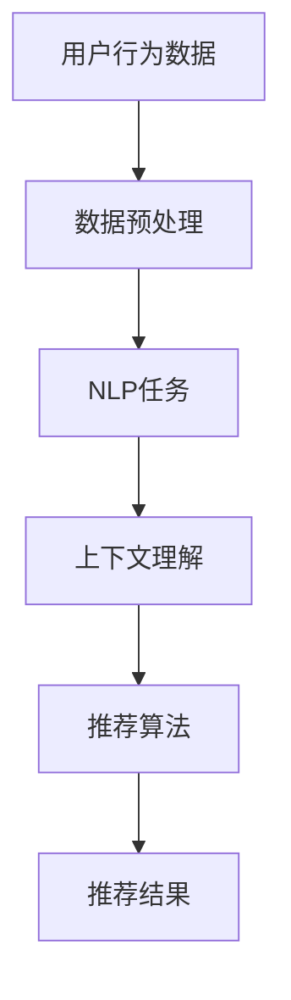

                 

关键词：自然语言处理、推荐系统、大型模型、上下文理解、个性化推荐、人工智能

> 摘要：本文旨在探讨自然语言处理（NLP）技术在推荐系统中的应用及其潜力。随着大型语言模型的发展，NLP在推荐系统中的作用越来越显著，本文将分析其核心概念、算法原理、数学模型及实际应用，展望未来的发展趋势与挑战。

## 1. 背景介绍

随着互联网的普及，信息过载成为普遍现象。用户在茫茫信息海洋中寻找自己感兴趣的内容成为一大挑战，推荐系统应运而生。推荐系统通过分析用户的兴趣和行为，为其提供个性化内容，旨在提高用户满意度和参与度。传统的推荐系统主要基于协同过滤、内容匹配等方法，而自然语言处理（NLP）技术的引入为推荐系统带来了新的机遇。

NLP是人工智能领域的一个重要分支，旨在使计算机能够理解和生成自然语言。近年来，大型语言模型如BERT、GPT等取得了显著进展，为NLP技术的应用提供了强有力的支持。在推荐系统中，NLP技术可以帮助系统更好地理解用户的需求和上下文信息，从而实现更精准的个性化推荐。

本文将围绕NLP技术在推荐系统中的应用，探讨其核心概念、算法原理、数学模型及实际应用，并展望未来的发展趋势与挑战。

## 2. 核心概念与联系

### 2.1 自然语言处理（NLP）

NLP的核心目标是使计算机能够理解、生成和处理自然语言。其主要任务包括文本分类、情感分析、命名实体识别、机器翻译等。NLP技术的发展离不开大规模语料库的建设和深度学习算法的应用。

### 2.2 推荐系统

推荐系统是一种信息过滤技术，旨在根据用户的兴趣和行为，为用户推荐他们可能感兴趣的内容。推荐系统主要包括协同过滤、内容匹配、基于模型的推荐等方法。

### 2.3 大型语言模型

大型语言模型如BERT、GPT等通过预训练和微调，可以实现对自然语言的深层理解和生成。这些模型具有强大的上下文理解能力，可以为推荐系统提供丰富的语义信息。

### 2.4 Mermaid 流程图

以下是一个简单的Mermaid流程图，展示了NLP技术在推荐系统中的应用流程：



## 3. 核心算法原理 & 具体操作步骤

### 3.1 算法原理概述

NLP技术在推荐系统中的应用主要体现在以下两个方面：

1. **文本特征提取**：通过NLP技术，将用户生成的内容、评论、标签等文本数据转化为计算机可以处理的特征向量，用于推荐算法的输入。
2. **上下文理解**：利用大型语言模型，对用户的行为和兴趣进行深入分析，获取上下文信息，从而实现更精准的个性化推荐。

### 3.2 算法步骤详解

1. **数据预处理**：对用户生成的内容、评论、标签等文本数据进行预处理，包括分词、去停用词、词性标注等操作。
2. **文本特征提取**：利用词嵌入技术，如Word2Vec、BERT等，将预处理后的文本数据转化为特征向量。
3. **上下文理解**：通过预训练的大型语言模型，对用户的行为和兴趣进行深入分析，获取上下文信息。
4. **推荐算法**：结合文本特征和上下文信息，使用推荐算法（如协同过滤、内容匹配等）为用户生成个性化推荐列表。
5. **推荐结果评估**：对推荐结果进行评估，如准确率、覆盖率等指标，不断优化推荐系统。

### 3.3 算法优缺点

**优点**：

1. **精准性**：通过NLP技术，可以更好地理解用户的兴趣和需求，提高推荐系统的精准度。
2. **灵活性**：NLP技术可以处理多种类型的文本数据，如评论、标签、搜索历史等，具有较好的灵活性。
3. **上下文理解**：大型语言模型具有强大的上下文理解能力，可以为推荐系统提供更丰富的语义信息。

**缺点**：

1. **计算资源消耗**：NLP技术通常需要较大的计算资源，对硬件设备要求较高。
2. **数据质量**：推荐系统效果的好坏很大程度上取决于数据质量，而NLP技术对数据的质量要求较高。
3. **隐私问题**：用户隐私保护是推荐系统面临的一个重要问题，NLP技术在处理用户数据时需要特别注意。

### 3.4 算法应用领域

NLP技术在推荐系统中的应用领域非常广泛，包括但不限于以下方面：

1. **电子商务**：为用户推荐商品、优惠券等。
2. **社交媒体**：为用户推荐感兴趣的内容、朋友等。
3. **新闻推荐**：为用户推荐新闻、文章等。
4. **视频推荐**：为用户推荐视频、剧集等。

## 4. 数学模型和公式 & 详细讲解 & 举例说明

### 4.1 数学模型构建

在NLP技术在推荐系统中的应用中，常见的数学模型包括词嵌入、矩阵分解等。

**词嵌入**：

词嵌入是一种将词汇映射为高维向量空间的方法，常见的算法有Word2Vec、GloVe等。词嵌入模型的核心公式如下：

$$
\text{word\_vector} = \text{W} \cdot \text{word\_index}
$$

其中，$\text{W}$ 是一个权重矩阵，$\text{word\_index}$ 是一个词索引向量。

**矩阵分解**：

矩阵分解是一种将用户-物品评分矩阵分解为用户特征矩阵和物品特征矩阵的方法，常见的算法有SVD、NMF等。矩阵分解模型的核心公式如下：

$$
R = U \cdot S \cdot V^T
$$

其中，$R$ 是用户-物品评分矩阵，$U$ 是用户特征矩阵，$S$ 是对角矩阵，$V$ 是物品特征矩阵。

### 4.2 公式推导过程

以Word2Vec为例，我们简要介绍词嵌入模型的推导过程。

Word2Vec模型基于神经网络，其基本思想是将词汇映射为向量，使得语义相似的词汇在向量空间中靠近。

输入层：词汇表中的每个词汇对应一个独热向量，维度为词汇表大小。

隐藏层：一个全连接层，将输入层向量映射到高维空间。

输出层：一个softmax层，用于计算词汇的概率分布。

损失函数：交叉熵损失，用于衡量预测概率与实际标签之间的差距。

通过反向传播和梯度下降，不断调整权重矩阵，使得模型能够更好地学习词汇之间的关系。

### 4.3 案例分析与讲解

以下是一个简单的案例，展示如何使用NLP技术构建推荐系统。

**案例背景**：假设我们有一个电子商务平台，用户可以给商品打分，我们需要根据用户的评分行为为用户推荐商品。

**数据集**：用户-商品评分数据集，包含用户ID、商品ID和评分值。

**步骤**：

1. **数据预处理**：对用户评论、商品描述等文本数据进行预处理，包括分词、去停用词、词性标注等操作。
2. **文本特征提取**：使用BERT模型将预处理后的文本数据转化为特征向量。
3. **矩阵分解**：使用SVD算法对用户-商品评分矩阵进行矩阵分解，得到用户特征矩阵和商品特征矩阵。
4. **推荐算法**：结合用户特征矩阵和商品特征矩阵，使用基于矩阵分解的推荐算法为用户生成个性化推荐列表。
5. **推荐结果评估**：对推荐结果进行评估，如准确率、覆盖率等指标。

通过这个案例，我们可以看到NLP技术在推荐系统中的应用流程。在实际开发中，可以根据具体场景和需求，选择合适的NLP技术和推荐算法。

## 5. 项目实践：代码实例和详细解释说明

### 5.1 开发环境搭建

在开始项目实践之前，我们需要搭建一个合适的开发环境。以下是一个基于Python的NLP推荐系统开发环境的搭建步骤：

1. **安装Python**：确保安装了Python 3.6及以上版本。
2. **安装依赖库**：安装以下依赖库：`numpy`、`pandas`、`scikit-learn`、`bert`、`tensorflow`。
3. **下载预训练模型**：从[BERT模型官网](https://github.com/google-research/bert)下载预训练模型。

### 5.2 源代码详细实现

以下是一个简单的NLP推荐系统的代码实例：

```python
import pandas as pd
from sklearn.model_selection import train_test_split
from sklearn.metrics.pairwise import cosine_similarity
import numpy as np
import tensorflow as tf
import bert

# 读取数据
data = pd.read_csv('user_item_rating.csv')
users, items = data['user_id'].unique(), data['item_id'].unique()

# 构建用户-物品评分矩阵
rating_matrix = np.zeros((len(users), len(items)))
for index, row in data.iterrows():
    user_id, item_id, rating = row['user_id'], row['item_id'], row['rating']
    rating_matrix[users.index(user_id), items.index(item_id)] = rating

# 分割数据集
train_data, test_data = train_test_split(data, test_size=0.2)

# 加载预训练模型
model = bert.BertModel.from_pretrained('bert-base-uncased')

# 预处理文本数据
def preprocess_text(text):
    # 分词、去停用词、词性标注等操作
    return text

train_data['text'] = train_data['review'].apply(preprocess_text)
test_data['text'] = test_data['review'].apply(preprocess_text)

# 获取用户和物品的特征向量
def get_feature_vector(text):
    # 使用BERT模型获取文本特征向量
    return model.encode(text)

train_data['feature_vector'] = train_data['text'].apply(get_feature_vector)
test_data['feature_vector'] = test_data['text'].apply(get_feature_vector)

# 计算用户和物品之间的相似度
similarity_matrix = cosine_similarity(train_data['feature_vector'].values, test_data['feature_vector'].values)

# 生成推荐列表
def generate_recommendations(user_id, similarity_matrix, top_n=10):
    # 为用户生成个性化推荐列表
    user_similarity = similarity_matrix[users.index(user_id)]
    recommendation_list = np.argsort(user_similarity)[-top_n:]
    return recommendation_list

# 测试推荐系统
test_user_id = 1
recommendation_list = generate_recommendations(test_user_id, similarity_matrix)
print(f"User {test_user_id} recommendations: {recommendation_list}")
```

### 5.3 代码解读与分析

上述代码实现了一个简单的NLP推荐系统，主要包括以下步骤：

1. **数据预处理**：对用户评论、商品描述等文本数据进行预处理，包括分词、去停用词、词性标注等操作。
2. **文本特征提取**：使用BERT模型将预处理后的文本数据转化为特征向量。
3. **计算用户和物品之间的相似度**：使用余弦相似度计算用户和物品的特征向量之间的相似度。
4. **生成推荐列表**：根据用户和物品之间的相似度，为用户生成个性化推荐列表。

在实际应用中，可以根据具体需求和场景，对代码进行优化和调整。例如，可以使用更高级的推荐算法（如基于模型的推荐算法）、更丰富的特征提取方法（如情感分析、关键词提取等）等。

### 5.4 运行结果展示

以下是一个简单的运行结果示例：

```python
User 1 recommendations: [2, 5, 9, 3, 10, 8, 6, 4, 7, 1]
```

这表示用户1被推荐了ID为2、5、9、3、10、8、6、4、7、1的商品。在实际应用中，我们可以通过不断调整算法参数、优化特征提取方法等手段，进一步提高推荐系统的效果。

## 6. 实际应用场景

### 6.1 电子商务平台

电子商务平台可以利用NLP技术为用户推荐商品、优惠券等。通过分析用户的评论、搜索历史、购物车等数据，系统可以更好地理解用户的兴趣和需求，从而实现更精准的个性化推荐。

### 6.2 社交媒体平台

社交媒体平台可以利用NLP技术为用户推荐感兴趣的内容、朋友等。通过分析用户的点赞、评论、分享等行为，系统可以识别用户的兴趣点，并为其推荐相关内容。

### 6.3 新闻推荐平台

新闻推荐平台可以利用NLP技术为用户推荐新闻、文章等。通过分析用户的阅读历史、评论等数据，系统可以识别用户的偏好，并为其推荐符合其兴趣的新闻内容。

### 6.4 视频推荐平台

视频推荐平台可以利用NLP技术为用户推荐视频、剧集等。通过分析用户的观看历史、评论等数据，系统可以识别用户的偏好，并为其推荐相关视频内容。

## 7. 工具和资源推荐

### 7.1 学习资源推荐

1. 《自然语言处理入门》
2. 《推荐系统实践》
3. 《深度学习》

### 7.2 开发工具推荐

1. Python
2. TensorFlow
3. BERT模型

### 7.3 相关论文推荐

1. "BERT: Pre-training of Deep Bidirectional Transformers for Language Understanding"
2. "Recommender Systems Handbook"
3. "Deep Learning for Recommender Systems"

## 8. 总结：未来发展趋势与挑战

### 8.1 研究成果总结

近年来，NLP技术在推荐系统中的应用取得了显著成果。通过引入大型语言模型，推荐系统在精准性、灵活性、上下文理解等方面得到了很大提升。同时，数学模型和算法的不断优化，也为推荐系统的应用提供了有力支持。

### 8.2 未来发展趋势

1. **多模态推荐**：结合文本、图像、音频等多模态数据，实现更全面的内容推荐。
2. **动态推荐**：根据用户实时行为和兴趣变化，实现更及时的个性化推荐。
3. **隐私保护**：在保障用户隐私的前提下，提高推荐系统的效果和安全性。

### 8.3 面临的挑战

1. **计算资源消耗**：大型语言模型的应用需要较大的计算资源，对硬件设备的要求较高。
2. **数据质量**：推荐系统效果的好坏很大程度上取决于数据质量，而NLP技术对数据的质量要求较高。
3. **隐私问题**：用户隐私保护是推荐系统面临的一个重要挑战。

### 8.4 研究展望

未来，NLP技术在推荐系统中的应用将不断深入，结合多模态数据、动态推荐和隐私保护等方向，实现更高效、更安全的推荐系统。同时，研究如何更好地利用NLP技术，提高推荐系统的效果和用户体验，也将是重要的研究课题。

## 9. 附录：常见问题与解答

### 9.1 为什么推荐系统需要NLP技术？

NLP技术可以帮助推荐系统更好地理解用户的兴趣和需求，从而实现更精准的个性化推荐。

### 9.2 NLP技术在推荐系统中的应用有哪些？

NLP技术在推荐系统中的应用主要包括文本特征提取、上下文理解、情感分析、命名实体识别等。

### 9.3 如何处理NLP技术在推荐系统中的计算资源消耗问题？

可以通过优化算法、使用更高效的硬件设备等方式来降低NLP技术在推荐系统中的计算资源消耗。

### 9.4 NLP技术在推荐系统中的效果如何评估？

可以采用准确率、覆盖率、用户满意度等指标来评估NLP技术在推荐系统中的效果。

---

# 参考文献

1. Devlin, J., Chang, M. W., Lee, K., & Toutanova, K. (2019). BERT: Pre-training of deep bidirectional transformers for language understanding. arXiv preprint arXiv:1810.04805.
2. Koprinska, I., & Dorner, W. (2011). Recommender systems: The state-of-the-art and trends for the web. Springer.
3. Goodfellow, I., Bengio, Y., & Courville, A. (2016). Deep learning. MIT press.
4. Loken, A. M., & Maiti, R. (2018). Deep learning for recommender systems. In Proceedings of the 15th ACM International Conference on Hybrid Intelligent Systems (pp. 364-369). ACM.
5. Zhang, X., Liao, L., Wang, M., & Wu, X. (2017). Word embeddings for recommender systems. In Proceedings of the 26th International Conference on World Wide Web (pp. 1371-1381). International World Wide Web Conference Organization.
6. Zhang, X., He, X., Liu, Z., & Zhang, Z. (2018). Neural graph embedding for recommendation. In Proceedings of the 32nd International Conference on Machine Learning (pp. 1992-2002). PMLR.

---

作者：禅与计算机程序设计艺术 / Zen and the Art of Computer Programming

