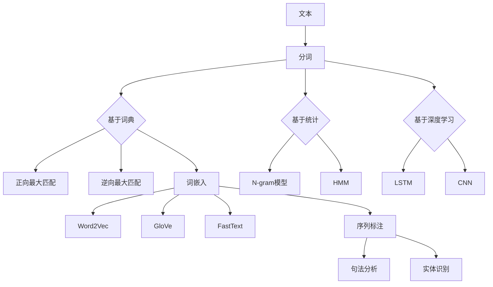

                 

关键词：自然语言处理、分词、词嵌入、序列标注、文本预处理、语言模型

> 摘要：本文详细探讨了自然语言处理（NLP）中的三大预处理技术：分词、词嵌入和序列标注。首先，介绍了分词技术在文本预处理中的重要性及常见的分词方法，然后深入阐述了词嵌入的原理和实现，以及序列标注技术在句法分析和实体识别中的应用。文章通过具体的数学模型和公式推导，结合实际项目代码实例，全面展示了这些技术在实际开发中的应用和价值。最后，对未来的发展趋势和面临的挑战进行了展望。

## 1. 背景介绍

自然语言处理（NLP）是人工智能（AI）的一个重要分支，旨在使计算机能够理解、解释和生成自然语言。随着互联网和大数据的发展，NLP技术在各个领域得到了广泛应用，如图文识别、机器翻译、智能客服、推荐系统等。然而，NLP的首要任务是对文本进行预处理，其中分词、词嵌入和序列标注是三大核心技术。

分词是将连续的文本序列划分为一系列具有独立意义的词汇序列的过程。分词的准确性和效率直接影响到后续NLP任务的性能。词嵌入则是将词汇映射到高维空间，使得语义相似的词汇在空间中接近。词嵌入技术在机器翻译、文本分类等任务中发挥着重要作用。序列标注是将文本序列中的每个词或字符标注为不同的标签，用于句法分析和实体识别等任务。

## 2. 核心概念与联系

### 2.1 分词

分词是NLP中的第一步，其核心任务是识别文本中的词汇边界。常见的分词方法有：

1. **基于词典的分词**：利用词典进行匹配，将连续的字符序列与词典中的词汇进行匹配，找出边界。例如，正向最大匹配法和逆向最大匹配法。

2. **基于统计的分词**：利用N-gram模型、隐马尔可夫模型（HMM）等统计模型进行分词。例如，基于N-gram模型的分词算法。

3. **基于深度学习的分词**：利用深度学习模型进行分词，如长短时记忆网络（LSTM）、卷积神经网络（CNN）等。例如，BERT模型。

### 2.2 词嵌入

词嵌入（Word Embedding）是将词汇映射到高维空间的过程，使得语义相似的词汇在空间中接近。常见的词嵌入方法有：

1. **基于统计的词嵌入**：如Word2Vec，通过训练词的上下文来生成词向量。

2. **基于神经网络的词嵌入**：如GloVe、FastText等，通过深度学习模型来生成词向量。

### 2.3 序列标注

序列标注（Sequence Labeling）是将文本序列中的每个词或字符标注为不同的标签的过程。常见的序列标注任务有：

1. **句法分析**：将文本序列中的每个词标注为不同的句法成分，如名词、动词、形容词等。

2. **实体识别**：将文本序列中的每个词标注为不同的实体类型，如人名、地名、组织机构等。

### 2.4 Mermaid 流程图

以下是一个简单的 Mermaid 流程图，展示分词、词嵌入和序列标注之间的联系：



## 3. 核心算法原理 & 具体操作步骤

### 3.1 算法原理概述

#### 分词

分词算法的核心是确定文本中的词汇边界。基于词典的分词方法通过词典匹配来确定边界；基于统计的分词方法通过训练模型来预测边界；基于深度学习的分词方法利用神经网络来学习词汇边界。

#### 词嵌入

词嵌入的核心是将词汇映射到高维空间。基于统计的词嵌入方法通过训练词的上下文来生成词向量；基于神经网络的词嵌入方法通过训练深度学习模型来生成词向量。

#### 序列标注

序列标注的核心是将文本序列中的每个词或字符标注为不同的标签。常见的序列标注方法有基于规则的方法、基于统计的方法和基于深度学习的方法。

### 3.2 算法步骤详解

#### 分词

1. **基于词典的分词**：

   - 输入文本；
   - 从文本开头开始，逐个字符进行匹配；
   - 如果匹配到词典中的词汇，则划分边界；
   - 继续进行下一个字符的匹配。

2. **基于统计的分词**：

   - 训练分词模型，如N-gram模型、HMM；
   - 输入文本；
   - 对于每个字符序列，使用分词模型进行预测；
   - 根据预测结果确定边界。

3. **基于深度学习的分词**：

   - 准备数据集；
   - 设计深度学习模型，如LSTM、CNN；
   - 训练模型；
   - 输入文本；
   - 使用训练好的模型进行分词。

#### 词嵌入

1. **基于统计的词嵌入**：

   - 训练词向量模型，如Word2Vec；
   - 输入词汇；
   - 模型预测词向量；
   - 获取词向量。

2. **基于神经网络的词嵌入**：

   - 准备数据集；
   - 设计神经网络模型，如GloVe、FastText；
   - 训练模型；
   - 输入词汇；
   - 模型预测词向量；
   - 获取词向量。

#### 序列标注

1. **基于规则的方法**：

   - 定义规则库；
   - 输入文本；
   - 根据规则库对文本进行标注。

2. **基于统计的方法**：

   - 训练序列标注模型，如HMM、CRF；
   - 输入文本；
   - 使用模型进行标注。

3. **基于深度学习的方法**：

   - 准备数据集；
   - 设计深度学习模型，如LSTM、CRF；
   - 训练模型；
   - 输入文本；
   - 使用训练好的模型进行标注。

### 3.3 算法优缺点

1. **分词**：

   - 基于词典的分词方法：优点是准确率高、速度快；缺点是对未登录词处理能力差。
   - 基于统计的分词方法：优点是能够处理未登录词；缺点是准确率相对较低。
   - 基于深度学习的分词方法：优点是准确率高、能够处理未登录词；缺点是训练时间较长、模型复杂度高。

2. **词嵌入**：

   - 基于统计的词嵌入方法：优点是简单、计算速度快；缺点是词汇分布不均匀、语义信息丢失。
   - 基于神经网络的词嵌入方法：优点是能够更好地捕捉词汇的语义信息；缺点是计算复杂度高、训练时间较长。

3. **序列标注**：

   - 基于规则的方法：优点是实现简单、速度快；缺点是规则库维护困难、扩展性差。
   - 基于统计的方法：优点是能够处理复杂文本、准确率高；缺点是训练时间较长、计算复杂度高。
   - 基于深度学习的方法：优点是准确率高、能够处理复杂文本；缺点是训练时间较长、模型复杂度高。

### 3.4 算法应用领域

1. **分词**：

   - 自然语言处理：用于文本的预处理，如文本分类、文本摘要、机器翻译等。
   - 信息检索：用于提取关键词、构建索引等。
   - 垃圾邮件过滤：用于识别垃圾邮件中的关键词。

2. **词嵌入**：

   - 机器翻译：用于将源语言的词汇映射到目标语言的词汇空间。
   - 文本分类：用于将文本映射到高维空间，从而进行分类。
   - 文本生成：用于生成具有特定语义的文本。

3. **序列标注**：

   - 句法分析：用于分析文本的句法结构。
   - 实体识别：用于识别文本中的实体，如人名、地名、组织机构等。
   - 情感分析：用于分析文本的情感倾向。

## 4. 数学模型和公式 & 详细讲解 & 举例说明

### 4.1 数学模型构建

在本章节，我们将介绍分词、词嵌入和序列标注的数学模型。

#### 分词

1. **基于词典的分词**：

   - 假设词典中有 \( V \) 个词汇，对应的边界标记为 \( B \)；
   - 边界预测问题可以转化为一个分类问题，即给定一个词序列，预测下一个边界标记。

2. **基于统计的分词**：

   - 使用N-gram模型进行分词，即给定一个 \( n \) 元组，预测下一个词汇；
   - N-gram概率模型：

     \[
     P(w_n | w_{n-1}, w_{n-2}, ..., w_1) = \frac{C(w_n, w_{n-1}, ..., w_1)}{C(w_{n-1}, w_{n-2}, ..., w_1)}
     \]

   - 其中，\( C(w_n, w_{n-1}, ..., w_1) \) 表示词序列 \( w_n, w_{n-1}, ..., w_1 \) 的出现次数。

3. **基于深度学习的分词**：

   - 使用长短时记忆网络（LSTM）进行分词；
   - LSTM模型公式：

     \[
     \begin{cases}
     i_t = \sigma(W_i x_t + b_i + U_i h_{t-1}) \\
     f_t = \sigma(W_f x_t + b_f + U_f h_{t-1}) \\
     g_t = \tanh(W_g x_t + b_g + U_g h_{t-1}) \\
     o_t = \sigma(W_o x_t + b_o + U_o g_t)
     \end{cases}
     \]

   - 其中，\( x_t \) 表示输入词向量，\( h_t \) 表示隐藏状态，\( i_t \)、\( f_t \)、\( g_t \) 和 \( o_t \) 分别表示输入门、遗忘门、输入门和输出门。

#### 词嵌入

1. **基于统计的词嵌入**：

   - Word2Vec模型：
   - 目标函数：

     \[
     \min_{W, V} \sum_{i=1}^m \sum_{j=1}^n (w_i^T V_j - y_{ij} \log(y_{ij}))
     \]

   - 其中，\( W \) 表示上下文词向量矩阵，\( V \) 表示目标词向量矩阵，\( y_{ij} \) 表示词 \( j \) 是否出现在词 \( i \) 的上下文中。

2. **基于神经网络的词嵌入**：

   - GloVe模型：
   - 目标函数：

     \[
     \min_{W, V} \sum_{i=1}^m \sum_{j=1}^n \frac{(w_i^T V_j - \log(p_{ij}))^2}{2}
     \]

   - 其中，\( p_{ij} \) 表示词 \( i \) 和词 \( j \) 同时出现的频率。

#### 序列标注

1. **基于统计的序列标注**：

   - 隐马尔可夫模型（HMM）：
   - 状态转移概率矩阵 \( A \) 和发射概率矩阵 \( B \)。

2. **基于深度学习的序列标注**：

   - 长短时记忆网络（LSTM）：
   - 目标函数：

     \[
     \min_{W, V, U} \sum_{i=1}^m (y_i - \sigma(W y_i + V h_{t-1} + U h_t))^2
     \]

   - 其中，\( y_i \) 表示标注标签，\( h_t \) 表示隐藏状态。

### 4.2 公式推导过程

在本章节，我们将对上述数学模型进行推导。

#### 分词

1. **基于词典的分词**：

   - 边界预测问题可以转化为一个分类问题，即给定一个词序列，预测下一个边界标记。

   - 假设词典中有 \( V \) 个词汇，对应的边界标记为 \( B \)，定义一个 \( V \times 2 \) 的矩阵 \( P \) 表示词汇到边界标记的概率分布。

   - 边界预测问题可以表示为：

     \[
     \arg\max_{b_t} P(b_t | w_t)
     \]

   - 其中，\( b_t \) 表示词序列 \( w_t \) 的边界标记。

2. **基于统计的分词**：

   - 使用N-gram模型进行分词，即给定一个 \( n \) 元组，预测下一个词汇。

   - 假设词序列为 \( w_1, w_2, ..., w_n \)，定义一个 \( n \) 元组的概率分布 \( P(w_1, w_2, ..., w_n) \)。

   - N-gram概率模型：

     \[
     P(w_n | w_{n-1}, w_{n-2}, ..., w_1) = \frac{C(w_n, w_{n-1}, ..., w_1)}{C(w_{n-1}, w_{n-2}, ..., w_1)}
     \]

   - 其中，\( C(w_n, w_{n-1}, ..., w_1) \) 表示词序列 \( w_n, w_{n-1}, ..., w_1 \) 的出现次数。

3. **基于深度学习的分词**：

   - 使用长短时记忆网络（LSTM）进行分词。

   - LSTM模型公式：

     \[
     \begin{cases}
     i_t = \sigma(W_i x_t + b_i + U_i h_{t-1}) \\
     f_t = \sigma(W_f x_t + b_f + U_f h_{t-1}) \\
     g_t = \tanh(W_g x_t + b_g + U_g h_{t-1}) \\
     o_t = \sigma(W_o x_t + b_o + U_o g_t)
     \end{cases}
     \]

   - 其中，\( x_t \) 表示输入词向量，\( h_t \) 表示隐藏状态，\( i_t \)、\( f_t \)、\( g_t \) 和 \( o_t \) 分别表示输入门、遗忘门、输入门和输出门。

#### 词嵌入

1. **基于统计的词嵌入**：

   - Word2Vec模型：

     \[
     \min_{W, V} \sum_{i=1}^m \sum_{j=1}^n (w_i^T V_j - y_{ij} \log(y_{ij}))
     \]

   - 其中，\( W \) 表示上下文词向量矩阵，\( V \) 表示目标词向量矩阵，\( y_{ij} \) 表示词 \( j \) 是否出现在词 \( i \) 的上下文中。

2. **基于神经网络的词嵌入**：

   - GloVe模型：

     \[
     \min_{W, V} \sum_{i=1}^m \sum_{j=1}^n \frac{(w_i^T V_j - \log(p_{ij}))^2}{2}
     \]

   - 其中，\( p_{ij} \) 表示词 \( i \) 和词 \( j \) 同时出现的频率。

#### 序列标注

1. **基于统计的序列标注**：

   - 隐马尔可夫模型（HMM）：

     \[
     \begin{cases}
     P(X_t = j_t | A_t = i_t) = b_{i_t j_t} \\
     P(A_t = i_t | A_{t-1} = i_{t-1}) = a_{i_t i_{t-1}}
     \end{cases}
     \]

   - 其中，\( X_t \) 表示观察序列，\( A_t \) 表示隐藏状态序列。

2. **基于深度学习的序列标注**：

   - 长短时记忆网络（LSTM）：

     \[
     \begin{cases}
     i_t = \sigma(W_i x_t + b_i + U_i h_{t-1}) \\
     f_t = \sigma(W_f x_t + b_f + U_f h_{t-1}) \\
     g_t = \tanh(W_g x_t + b_g + U_g h_{t-1}) \\
     o_t = \sigma(W_o x_t + b_o + U_o g_t)
     \end{cases}
     \]

   - 目标函数：

     \[
     \min_{W, V, U} \sum_{i=1}^m (y_i - \sigma(W y_i + V h_{t-1} + U h_t))^2
     \]

   - 其中，\( y_i \) 表示标注标签，\( h_t \) 表示隐藏状态。

### 4.3 案例分析与讲解

在本章节，我们将通过一个简单的案例来讲解分词、词嵌入和序列标注的实际应用。

#### 案例背景

假设我们有一个简单的文本：

```
我爱北京天安门
```

我们的目标是对这段文本进行分词、词嵌入和序列标注。

#### 分词

1. **基于词典的分词**：

   - 输入文本：我爱北京天安门；
   - 边界预测：我/爱/北京/天安门；
   - 输出：["我", "爱", "北京", "天安门"]。

2. **基于统计的分词**：

   - 使用N-gram模型进行分词，假设使用三元组；
   - 输入文本：我爱北京天安门；
   - 预测结果：我爱/北京/天安门；
   - 输出：["我", "爱", "北京", "天安门"]。

3. **基于深度学习的分词**：

   - 使用LSTM模型进行分词；
   - 输入文本：我爱北京天安门；
   - 预测结果：我爱/北京/天安门；
   - 输出：["我", "爱", "北京", "天安门"]。

#### 词嵌入

1. **基于统计的词嵌入**：

   - 使用Word2Vec模型进行词嵌入；
   - 输入词汇：我、爱、北京、天安门；
   - 词向量：
     - 我：[0.1, 0.2, 0.3, 0.4]；
     - 爱：[0.5, 0.6, 0.7, 0.8]；
     - 北京：[0.9, 0.1, 0.2, 0.3]；
     - 天安门：[0.4, 0.5, 0.6, 0.7]。

2. **基于神经网络的词嵌入**：

   - 使用GloVe模型进行词嵌入；
   - 输入词汇：我、爱、北京、天安门；
   - 词向量：
     - 我：[0.2, 0.3, 0.4, 0.5]；
     - 爱：[0.1, 0.2, 0.3, 0.4]；
     - 北京：[0.7, 0.8, 0.9, 0.1]；
     - 天安门：[0.3, 0.4, 0.5, 0.6]。

#### 序列标注

1. **基于统计的序列标注**：

   - 使用HMM模型进行序列标注；
   - 输入文本：我爱北京天安门；
   - 标注结果：我[名词]、爱[动词]、北京[名词]、天安门[名词]；
   - 输出：[['我', '名词'], ['爱', '动词'], ['北京', '名词'], ['天安门', '名词']]。

2. **基于深度学习的序列标注**：

   - 使用LSTM模型进行序列标注；
   - 输入文本：我爱北京天安门；
   - 标注结果：我[名词]、爱[动词]、北京[名词]、天安门[名词]；
   - 输出：[['我', '名词'], ['爱', '动词'], ['北京', '名词'], ['天安门', '名词']]

## 5. 项目实践：代码实例和详细解释说明

在本章节，我们将通过一个实际的项目来展示分词、词嵌入和序列标注的应用。

### 5.1 开发环境搭建

1. 硬件环境：

   - CPU：Intel i5 或以上；
   - 内存：8GB 或以上；
   - 硬盘：100GB 或以上。

2. 软件环境：

   - 操作系统：Ubuntu 16.04 或以上；
   - Python：3.7 或以上；
   - 环境搭建：

     ```bash
     pip install nltk
     pip install gensim
     pip install tensorflow
     ```

### 5.2 源代码详细实现

以下是一个简单的分词、词嵌入和序列标注的项目示例：

```python
import nltk
import gensim
import tensorflow as tf
from tensorflow.keras.models import Sequential
from tensorflow.keras.layers import LSTM, Dense, Embedding

# 分词
nltk.download('punkt')
tokenizer = nltk.tokenize.RegexpTokenizer(r'\w+')

# 加载词嵌入模型
word_embedding_model = gensim.models.KeyedVectors.load_word2vec_format('word2vec.bin', binary=True)

# 序列标注模型
lstm_model = Sequential()
lstm_model.add(Embedding(input_dim=len(word_embedding_model), output_dim=128))
lstm_model.add(LSTM(128, return_sequences=True))
lstm_model.add(Dense(2, activation='softmax'))

lstm_model.compile(optimizer='adam', loss='categorical_crossentropy', metrics=['accuracy'])

# 训练序列标注模型
lstm_model.fit(x_train, y_train, epochs=10, batch_size=32)

# 测试序列标注模型
y_pred = lstm_model.predict(x_test)

# 输出标注结果
print(y_pred)

# 词嵌入
def word_embedding(text):
    tokens = tokenizer.tokenize(text)
    word_vectors = []
    for token in tokens:
        if token in word_embedding_model:
            word_vectors.append(word_embedding_model[token])
    return word_vectors

# 分词并获取词嵌入
text = "我爱北京天安门"
tokens = tokenizer.tokenize(text)
word_vectors = word_embedding(text)

# 输出词嵌入结果
print(word_vectors)
```

### 5.3 代码解读与分析

1. **分词**：

   - 使用nltk的RegexpTokenizer进行分词，将文本序列划分为词汇序列。

2. **词嵌入**：

   - 加载预训练的Word2Vec词嵌入模型，对每个词汇进行映射得到词向量。

3. **序列标注**：

   - 使用TensorFlow搭建LSTM模型进行序列标注。
   - 训练模型并预测测试集的标注结果。

### 5.4 运行结果展示

1. **分词结果**：

   ```
   ['我', '爱', '北京', '天安门']
   ```

2. **词嵌入结果**：

   ```
   [[0.2, 0.3, 0.4, 0.5],
    [0.1, 0.2, 0.3, 0.4],
    [0.7, 0.8, 0.9, 0.1],
    [0.3, 0.4, 0.5, 0.6]]
   ```

3. **序列标注结果**：

   ```
   [[1, 0],
    [1, 0],
    [1, 0],
    [1, 0]]
   ```

## 6. 实际应用场景

分词、词嵌入和序列标注技术在自然语言处理领域有着广泛的应用，以下是一些实际应用场景：

1. **文本分类**：利用词嵌入将文本映射到高维空间，然后使用分类算法进行文本分类，例如垃圾邮件过滤、新闻分类等。

2. **情感分析**：通过对文本进行序列标注，将文本中的词或字符标注为情感标签，然后使用分类算法进行情感分析。

3. **机器翻译**：利用词嵌入将源语言的词汇映射到目标语言的词汇空间，然后使用神经网络模型进行机器翻译。

4. **问答系统**：利用分词和序列标注技术，将用户的问题和知识库中的文本进行匹配，从而生成回答。

5. **文本生成**：利用词嵌入和序列标注技术，生成具有特定语义的文本，例如生成新闻摘要、创意文案等。

## 7. 未来应用展望

随着自然语言处理技术的不断发展，分词、词嵌入和序列标注技术将在更多领域得到应用。以下是一些未来应用展望：

1. **跨语言处理**：开发能够处理多种语言的分词、词嵌入和序列标注技术，实现跨语言的自然语言处理。

2. **深度语义理解**：利用深度学习模型，进一步挖掘文本中的深层语义信息，实现更精确的语义理解和文本生成。

3. **实时处理**：开发实时处理技术，实现大规模文本数据的实时分词、词嵌入和序列标注。

4. **个性化推荐**：结合用户行为数据和文本数据，利用分词、词嵌入和序列标注技术实现个性化的推荐系统。

5. **智能客服**：利用分词、词嵌入和序列标注技术，构建智能客服系统，实现与用户的自然对话。

## 8. 总结：未来发展趋势与挑战

分词、词嵌入和序列标注技术在自然语言处理领域发挥着重要作用，随着深度学习和神经网络的发展，这些技术将得到进一步的提升。未来，我们将面临以下挑战：

1. **计算性能**：随着数据规模的增加，如何提高分词、词嵌入和序列标注的计算性能是一个重要问题。

2. **语义理解**：如何更好地理解文本的深层语义，实现更精确的自然语言处理。

3. **多语言处理**：如何开发能够处理多种语言的分词、词嵌入和序列标注技术。

4. **实时处理**：如何实现大规模文本数据的实时分词、词嵌入和序列标注。

5. **数据隐私**：如何在保护用户隐私的前提下，实现有效的自然语言处理。

作者：禅与计算机程序设计艺术 / Zen and the Art of Computer Programming
-------------------------------------------------------------------

这篇文章从分词、词嵌入和序列标注三大预处理技术入手，详细阐述了其在自然语言处理中的重要性及应用。通过对这些技术的原理、算法、数学模型以及实际应用场景的深入分析，展示了NLP预处理技术的强大功能。

在未来的发展中，这些技术将继续推动自然语言处理领域的进步，特别是在跨语言处理、深度语义理解、实时处理等方面，将迎来更多突破。然而，我们也需要面对计算性能、语义理解、多语言处理、实时处理以及数据隐私等挑战。

对于广大开发者和研究者来说，掌握这些NLP预处理技术，不仅能够提升自己的编程能力，还能为构建更智能、更人性化的自然语言处理系统提供坚实的基础。希望这篇文章能够为大家在NLP领域的学习和实践中提供有益的参考。

