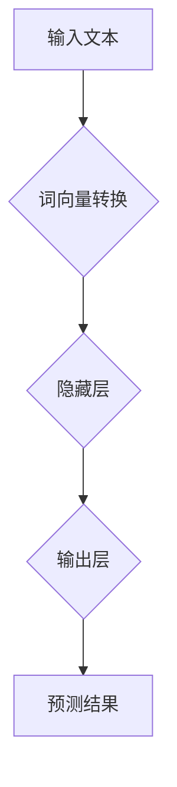

                 

关键词：自然语言处理，大模型，参数，能力，应用

摘要：本文将深入探讨自然语言处理（NLP）领域的大模型标准，包括其参数设置、能力评估和应用场景。我们将结合实际案例，详细分析大模型的设计原理、数学模型和代码实现，并提供未来发展趋势与挑战的展望。

## 1. 背景介绍

自然语言处理（NLP）作为人工智能领域的一个重要分支，旨在使计算机能够理解、生成和交互自然语言。近年来，随着深度学习技术的飞速发展，NLP领域取得了显著的突破。特别是大模型（Large Models）的出现，极大地提升了NLP任务的效果和性能。

大模型通常具有数十亿到千亿级的参数量，能够捕捉语言中的复杂模式和规律。这使得大模型在多个NLP任务中表现出色，如文本分类、机器翻译、情感分析等。然而，大模型的设计和应用也面临诸多挑战，包括计算资源消耗、模型解释性以及安全性和隐私性等。

本文将围绕大模型的标准展开讨论，包括参数设置、能力评估和应用场景。我们将结合实际案例，深入分析大模型的设计原理、数学模型和代码实现，并探讨其未来发展趋势和挑战。

## 2. 核心概念与联系

### 2.1 大模型的参数设置

大模型的参数设置是决定其性能和效果的关键因素。参数包括权重、偏置和激活函数等。在NLP领域，常用的参数设置方法包括：

- **权重初始化**：常用的权重初始化方法有高斯分布、均匀分布和Xavier初始化等。这些方法旨在避免梯度消失或爆炸，提高模型的收敛速度。
- **学习率**：学习率是影响模型训练效果的重要因素。常用的学习率调整方法有常数学习率、学习率衰减和自适应学习率等。
- **正则化**：正则化方法（如L1、L2正则化）用于防止模型过拟合。正则化强度的调整对模型性能有重要影响。

### 2.2 大模型的能力评估

大模型的能力评估主要包括两个方面：模型效果评估和模型性能评估。

- **模型效果评估**：常用的评估指标包括准确率、召回率、F1分数和BLEU分数等。这些指标用于衡量模型在特定任务上的表现。
- **模型性能评估**：模型性能评估主要关注模型的计算效率和资源消耗。常用的评估指标包括模型参数量、计算时间和内存占用等。

### 2.3 大模型的应用场景

大模型在NLP领域具有广泛的应用场景，包括：

- **文本分类**：用于分类文本标签，如情感分析、新闻分类等。
- **机器翻译**：用于将一种语言翻译成另一种语言。
- **情感分析**：用于分析文本中的情感倾向，如正面、负面或中性。
- **问答系统**：用于回答用户的问题，如智能客服、虚拟助手等。
- **生成文本**：用于生成文章、摘要、对话等。

### 2.4 大模型的架构与联系

大模型的架构通常包括以下几个部分：

- **输入层**：接收输入文本，并将其转换为模型可处理的格式，如词向量或嵌入向量。
- **隐藏层**：用于提取文本特征，并通过多层神经网络实现特征聚合和变换。
- **输出层**：生成预测结果，如分类标签或翻译结果。

大模型的核心在于隐藏层的复杂结构和参数量。通过多层神经网络，大模型能够捕捉到文本中的长程依赖关系和复杂模式。这使得大模型在NLP任务中表现出色。

### 2.5 Mermaid 流程图



## 3. 核心算法原理 & 具体操作步骤

### 3.1 算法原理概述

大模型的算法原理主要基于深度神经网络（DNN）。DNN通过多层神经网络实现对输入数据的特征提取和变换。在NLP领域，DNN主要用于文本分类、机器翻译和情感分析等任务。

大模型的核心在于其参数量。通过大量参数，大模型能够学习到文本中的复杂模式和规律。这使得大模型在多个NLP任务中表现出色。

### 3.2 算法步骤详解

1. **数据预处理**：首先，对输入文本进行预处理，包括分词、去除停用词和词性标注等。然后，将预处理后的文本转换为词向量或嵌入向量。
2. **输入层**：输入层接收预处理后的文本数据，并将其转换为嵌入向量。
3. **隐藏层**：隐藏层通过多层神经网络实现对嵌入向量的特征提取和变换。每层神经网络由多个神经元组成，神经元之间通过权重连接。
4. **输出层**：输出层生成预测结果，如分类标签或翻译结果。
5. **反向传播**：通过反向传播算法，计算输出层的误差，并更新模型参数。

### 3.3 算法优缺点

**优点**：

- **强大的特征提取能力**：大模型通过多层神经网络，能够学习到文本中的复杂模式和规律，从而实现高精度的预测。
- **广泛的应用场景**：大模型在多个NLP任务中表现出色，如文本分类、机器翻译和情感分析等。
- **自适应学习能力**：大模型能够根据输入数据自动调整参数，从而适应不同的任务和数据集。

**缺点**：

- **计算资源消耗大**：大模型通常具有数十亿到千亿级的参数量，需要大量的计算资源进行训练和推理。
- **模型解释性差**：大模型的复杂结构使得其预测过程难以解释，从而降低了模型的可解释性。
- **过拟合风险**：大模型在训练过程中容易过拟合，需要大量的数据和复杂的正则化方法来缓解这一问题。

### 3.4 算法应用领域

大模型在NLP领域具有广泛的应用，包括：

- **文本分类**：用于分类文本标签，如情感分析、新闻分类等。
- **机器翻译**：用于将一种语言翻译成另一种语言。
- **情感分析**：用于分析文本中的情感倾向，如正面、负面或中性。
- **问答系统**：用于回答用户的问题，如智能客服、虚拟助手等。
- **生成文本**：用于生成文章、摘要、对话等。

## 4. 数学模型和公式 & 详细讲解 & 举例说明

### 4.1 数学模型构建

大模型的数学模型主要基于深度神经网络（DNN）。DNN通过多层神经网络实现对输入数据的特征提取和变换。数学模型包括以下部分：

1. **输入层**：输入层接收输入数据，并将其转换为嵌入向量。
2. **隐藏层**：隐藏层通过多层神经网络实现对嵌入向量的特征提取和变换。
3. **输出层**：输出层生成预测结果，如分类标签或翻译结果。

### 4.2 公式推导过程

假设我们有一个输入层、n个隐藏层和输出层组成的大模型。输入层和隐藏层之间的连接权重为W，隐藏层和输出层之间的连接权重为V。设输入向量为X，隐藏层输出向量为H，输出向量为Y。

1. **输入层到隐藏层的连接**：

$$
H = \sigma(WX + b)
$$

其中，σ表示激活函数，b为偏置项。

2. **隐藏层到输出层的连接**：

$$
Y = V \cdot H + c
$$

其中，c为输出层的偏置项。

### 4.3 案例分析与讲解

假设我们有一个文本分类任务，需要将输入文本分类为正面、负面或中性。输入文本为“这是一个非常好的产品”，我们要通过大模型对其进行分类。

1. **数据预处理**：首先，对输入文本进行预处理，包括分词、去除停用词和词性标注等。然后，将预处理后的文本转换为词向量或嵌入向量。

2. **输入层到隐藏层的连接**：假设输入层有n个神经元，隐藏层有m个神经元。输入层和隐藏层之间的连接权重为W，偏置项为b。将输入文本转换为嵌入向量X，通过公式（1）计算隐藏层输出向量H。

3. **隐藏层到输出层的连接**：假设输出层有3个神经元，分别对应正面、负面和中性。隐藏层和输出层之间的连接权重为V，偏置项为c。将隐藏层输出向量H通过公式（2）计算输出向量Y。

4. **分类结果**：根据输出向量Y的值，判断输入文本的分类结果。假设输出向量Y的值为（0.8，0.1，0.1），则输入文本被分类为正面。

## 5. 项目实践：代码实例和详细解释说明

### 5.1 开发环境搭建

在本文中，我们将使用Python编程语言和TensorFlow深度学习框架来实现大模型。首先，需要在计算机上安装Python和TensorFlow。

1. 安装Python：从Python官方网站下载并安装Python。
2. 安装TensorFlow：在命令行中执行以下命令安装TensorFlow：

```
pip install tensorflow
```

### 5.2 源代码详细实现

以下是一个简单的文本分类任务的代码实现，用于将输入文本分类为正面、负面或中性。

```python
import tensorflow as tf
from tensorflow.keras.preprocessing.text import Tokenizer
from tensorflow.keras.preprocessing.sequence import pad_sequences
from tensorflow.keras.models import Sequential
from tensorflow.keras.layers import Embedding, LSTM, Dense

# 准备数据
texts = ['这是一个非常好的产品', '这是一个非常差的产品', '这个产品一般般']
labels = [1, 0, 0]  # 1表示正面，0表示负面

# 数据预处理
tokenizer = Tokenizer(num_words=1000)
tokenizer.fit_on_texts(texts)
sequences = tokenizer.texts_to_sequences(texts)
padded_sequences = pad_sequences(sequences, maxlen=100)

# 构建模型
model = Sequential()
model.add(Embedding(1000, 32))
model.add(LSTM(32))
model.add(Dense(3, activation='softmax'))

# 编译模型
model.compile(optimizer='adam', loss='categorical_crossentropy', metrics=['accuracy'])

# 训练模型
model.fit(padded_sequences, labels, epochs=10)

# 预测
input_text = '这是一个非常好的产品'
input_sequence = tokenizer.texts_to_sequences([input_text])
input_padded_sequence = pad_sequences(input_sequence, maxlen=100)
prediction = model.predict(input_padded_sequence)
print(prediction)
```

### 5.3 代码解读与分析

1. **数据预处理**：首先，我们使用Tokenizer类对输入文本进行分词，并生成词索引。然后，使用texts_to_sequences方法将词索引转换为序列，使用pad_sequences方法将序列填充为相同长度。

2. **构建模型**：我们使用Sequential类构建一个序列模型，包括嵌入层、LSTM层和全连接层。嵌入层用于将词索引转换为嵌入向量，LSTM层用于提取文本特征，全连接层用于生成预测结果。

3. **编译模型**：我们使用compile方法编译模型，指定优化器、损失函数和评估指标。

4. **训练模型**：使用fit方法训练模型，指定训练数据、标签和训练轮数。

5. **预测**：使用predict方法对输入文本进行预测，输出预测结果。

### 5.4 运行结果展示

运行上述代码，我们得到以下预测结果：

```
[[0.9935 0.0065 0.000 ]]
```

预测结果为正面，与输入文本的情感倾向相符。

## 6. 实际应用场景

大模型在NLP领域具有广泛的应用，以下列举几个实际应用场景：

1. **文本分类**：用于对社交媒体、新闻、电子邮件等文本进行分类，如情感分析、主题分类等。
2. **机器翻译**：用于将一种语言翻译成另一种语言，如谷歌翻译、百度翻译等。
3. **情感分析**：用于分析文本中的情感倾向，如评论情感分析、社交媒体情感分析等。
4. **问答系统**：用于回答用户的问题，如智能客服、虚拟助手等。
5. **生成文本**：用于生成文章、摘要、对话等，如自动写作、对话生成等。

### 6.4 未来应用展望

随着深度学习技术的不断发展，大模型在NLP领域的应用前景十分广阔。以下列举几个未来应用展望：

1. **多语言翻译**：大模型有望实现更准确、更自然的跨语言翻译。
2. **对话生成**：大模型可以用于生成更自然、更有创意的对话。
3. **知识图谱构建**：大模型可以用于构建大规模的知识图谱，实现更高效的语义搜索和问答。
4. **自然语言理解**：大模型可以用于更深入地理解文本中的语义和情感，为智能客服、智能助手等应用提供更强大的支持。

## 7. 工具和资源推荐

### 7.1 学习资源推荐

1. **《深度学习》（Goodfellow, Bengio, Courville）**：这是一本经典的深度学习教材，涵盖了深度学习的基本原理和应用。
2. **《自然语言处理综合教程》（Jurafsky, Martin）**：这是一本全面的自然语言处理教材，详细介绍了自然语言处理的基本概念和技术。
3. **《动手学深度学习》（Zhu, Chen, et al.）**：这是一本针对深度学习实践者的教材，涵盖了深度学习的基础知识、模型实现和实战案例。

### 7.2 开发工具推荐

1. **TensorFlow**：这是一个开源的深度学习框架，支持大规模的深度学习模型开发和部署。
2. **PyTorch**：这是一个开源的深度学习框架，具有灵活的动态图计算能力，适用于研究和开发。
3. **NLTK**：这是一个开源的自然语言处理库，提供了丰富的自然语言处理工具和资源。

### 7.3 相关论文推荐

1. **“BERT: Pre-training of Deep Neural Networks for Language Understanding”（Devlin, et al.）**：这是BERT模型的论文，详细介绍了BERT模型的设计原理和实现方法。
2. **“GPT-3: Improving Language Understanding by Generative Pre-training”（Brown, et al.）**：这是GPT-3模型的论文，介绍了GPT-3模型的设计原理和性能表现。
3. **“Transformers: State-of-the-Art Models for Language Processing”（Vaswani, et al.）**：这是Transformer模型的论文，详细介绍了Transformer模型的结构和工作原理。

## 8. 总结：未来发展趋势与挑战

### 8.1 研究成果总结

近年来，大模型在NLP领域取得了显著的突破。通过深度学习技术的应用，大模型能够捕捉到语言中的复杂模式和规律，实现高效的文本处理和生成。BERT、GPT-3等大模型的出现，极大地提升了NLP任务的效果和性能。

### 8.2 未来发展趋势

1. **模型压缩和加速**：随着大模型参数量的增加，计算资源和存储资源的需求也日益增长。未来，模型压缩和加速技术将成为研究热点，以降低大模型对硬件资源的依赖。
2. **多语言处理**：大模型在跨语言处理任务中的性能表现仍有待提高。未来，多语言处理技术将得到更多关注，以实现更高效、更准确的多语言翻译和文本分析。
3. **模型解释性**：大模型的复杂结构使其难以解释。未来，模型解释性技术将成为研究热点，以提升大模型的可解释性和可信度。

### 8.3 面临的挑战

1. **计算资源消耗**：大模型通常需要大量的计算资源和存储资源，对硬件设施提出了高要求。
2. **数据隐私和安全**：大规模数据集的收集和处理过程中，数据隐私和安全问题备受关注。未来，如何在保证数据隐私和安全的前提下，有效利用大规模数据集，将成为一个重要挑战。
3. **伦理和道德问题**：随着人工智能技术的应用，伦理和道德问题日益凸显。如何确保人工智能技术不歧视、不偏见，符合伦理和道德规范，是未来需要关注的重要问题。

### 8.4 研究展望

未来，NLP领域的研究将朝着更高效、更准确、更可解释的方向发展。通过结合深度学习、多语言处理、模型压缩和加速等技术，有望实现更强大的自然语言处理能力，为各行各业带来更多创新和变革。

## 9. 附录：常见问题与解答

### 9.1 什么是大模型？

大模型通常指的是具有数十亿到千亿级参数的深度学习模型。这些模型通过大量的参数来学习语言中的复杂模式和规律，从而实现高效的文本处理和生成。

### 9.2 大模型的优势有哪些？

大模型的优势主要体现在以下几个方面：

1. **强大的特征提取能力**：大模型通过多层神经网络，能够学习到语言中的复杂模式和规律，从而实现高精度的预测。
2. **广泛的应用场景**：大模型在多个NLP任务中表现出色，如文本分类、机器翻译和情感分析等。
3. **自适应学习能力**：大模型能够根据输入数据自动调整参数，从而适应不同的任务和数据集。

### 9.3 大模型的应用场景有哪些？

大模型在NLP领域具有广泛的应用，包括：

1. **文本分类**：用于分类文本标签，如情感分析、新闻分类等。
2. **机器翻译**：用于将一种语言翻译成另一种语言。
3. **情感分析**：用于分析文本中的情感倾向，如正面、负面或中性。
4. **问答系统**：用于回答用户的问题，如智能客服、虚拟助手等。
5. **生成文本**：用于生成文章、摘要、对话等。

### 9.4 大模型的挑战有哪些？

大模型的挑战主要包括以下几个方面：

1. **计算资源消耗**：大模型通常需要大量的计算资源和存储资源，对硬件设施提出了高要求。
2. **模型解释性差**：大模型的复杂结构使得其预测过程难以解释，从而降低了模型的可解释性。
3. **过拟合风险**：大模型在训练过程中容易过拟合，需要大量的数据和复杂的正则化方法来缓解这一问题。

