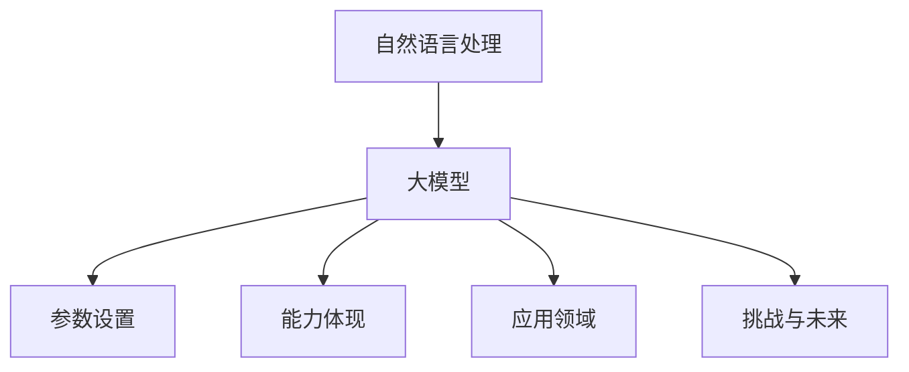

                 

在人工智能飞速发展的今天，自然语言处理（NLP）已经成为一个至关重要的领域。从机器翻译、情感分析到问答系统，NLP技术的应用正日益深入到我们的日常生活和工作之中。而其中，大模型（Large Models）的出现，无疑为NLP领域带来了革命性的变化。本文将深入探讨NLP领域的大模型，包括其参数设置、能力体现及应用场景。

## 关键词

- 自然语言处理
- 大模型
- 参数优化
- 能力评估
- 应用场景

## 摘要

本文首先介绍了自然语言处理的发展背景，随后重点探讨了NLP领域的大模型，包括其参数设置、能力体现以及在不同应用场景中的表现。通过对大模型的核心算法、数学模型和项目实践的分析，本文旨在为读者提供一份全面而深入的NLP大模型技术指南。

## 1. 背景介绍

自然语言处理（NLP）是人工智能（AI）的一个重要分支，旨在使计算机能够理解、解释和生成人类语言。从最初的规则驱动方法，到基于统计的方法，再到如今基于深度学习的大模型，NLP经历了多次技术革新。大模型的出现，解决了传统方法在处理复杂语言现象时的不足，使得NLP技术达到了前所未有的高度。

### 1.1 NLP的发展历程

NLP的发展历程可以分为以下几个阶段：

- **规则驱动方法（Rule-Based Methods）**：这一阶段的主要特征是使用明确的规则来处理语言现象。虽然这种方法能够处理一些简单的问题，但在面对复杂语言现象时显得力不从心。

- **基于统计的方法（Statistical Methods）**：随着语料库的积累，基于统计的方法逐渐成为主流。这种方法通过学习大量文本数据，自动提取特征和规律，从而实现语言处理任务。

- **深度学习方法（Deep Learning Methods）**：深度学习在图像处理和语音识别领域取得了巨大成功，随后逐渐应用到NLP中。基于深度学习的大模型，通过多层神经网络结构，能够自动提取复杂的语言特征，从而实现更高的准确率和性能。

### 1.2 大模型的兴起

大模型的兴起，主要得益于以下几个因素：

- **计算能力的提升**：随着计算能力的不断增强，大模型的训练和推理速度得到了显著提高。

- **海量数据的积累**：互联网的普及使得海量数据变得触手可及，为训练大模型提供了丰富的素材。

- **预训练技术的应用**：预训练技术使得大模型能够在多种任务上获得更好的表现，从而提高了其泛化能力。

## 2. 核心概念与联系

### 2.1 大模型的定义与分类

大模型是指参数规模巨大、能够处理大规模数据的深度学习模型。根据应用场景的不同，大模型可以分为以下几类：

- **通用语言模型（Universal Language Model）**：这类模型旨在学习通用语言特征，能够应用于多种NLP任务。

- **特定领域语言模型（Domain-Specific Language Model）**：这类模型专注于特定领域的语言特征，如法律文本、医学文本等。

- **多语言模型（Multilingual Language Model）**：这类模型能够处理多种语言，适用于跨语言任务。

### 2.2 大模型的核心算法

大模型的核心算法主要包括以下几种：

- **Transformer**：Transformer模型通过自注意力机制，能够自动提取长文本中的关键信息，具有强大的建模能力。

- **BERT**：BERT模型通过双向编码器表示（Bidirectional Encoder Representations from Transformers），能够同时考虑上下文信息，从而提高语言理解能力。

- **GPT**：GPT模型（Generative Pre-trained Transformer）通过生成式预训练，能够生成连贯的自然语言文本。

### 2.3 大模型的参数设置

大模型的参数设置直接关系到其性能和效率。常见的参数设置包括：

- **学习率（Learning Rate）**：学习率决定了模型在训练过程中对梯度更新的敏感度。

- **批量大小（Batch Size）**：批量大小影响了模型的训练速度和稳定性。

- **迭代次数（Number of Epochs）**：迭代次数决定了模型在训练数据上遍历的次数。

### 2.4 大模型的能力体现

大模型的能力体现在以下几个方面：

- **语言理解能力**：大模型能够理解复杂的语言现象，如指代消解、情感分析等。

- **语言生成能力**：大模型能够生成连贯、自然的语言文本。

- **跨语言能力**：大模型能够处理多种语言，实现跨语言任务。

### 2.5 大模型的应用领域

大模型在NLP领域的应用非常广泛，包括但不限于以下几个方面：

- **机器翻译**：大模型能够实现高质量的机器翻译，支持多种语言对。

- **问答系统**：大模型能够理解用户的问题，并提供准确的答案。

- **文本分类**：大模型能够对文本进行分类，如情感分类、主题分类等。

- **对话系统**：大模型能够与用户进行自然语言交互，提供智能服务。

### 2.6 大模型的挑战与未来发展方向

尽管大模型在NLP领域取得了显著成绩，但仍然面临一些挑战：

- **计算资源消耗**：大模型的训练和推理需要大量的计算资源。

- **数据隐私和安全**：大规模数据集的使用可能涉及到数据隐私和安全问题。

- **模型可解释性**：大模型的决策过程往往缺乏可解释性，难以被用户信任。

未来的发展方向包括：

- **高效训练算法**：研究更高效的训练算法，以降低大模型的计算成本。

- **模型压缩与推理优化**：研究模型压缩和推理优化技术，以提高大模型的效率。

- **跨领域迁移学习**：研究跨领域迁移学习技术，以提高大模型的泛化能力。

### 2.7 大模型的 Mermaid 流程图

下面是大模型的 Mermaid 流程图：



## 3. 核心算法原理 & 具体操作步骤

### 3.1 算法原理概述

大模型的核心算法主要包括Transformer、BERT和GPT等。这些算法通过多层神经网络结构，能够自动提取复杂的语言特征，从而实现高效的NLP任务。

### 3.2 算法步骤详解

- **数据预处理**：首先对输入文本进行预处理，包括分词、去停用词、词向量化等。

- **模型构建**：根据任务需求，选择合适的模型架构，如Transformer、BERT或GPT。

- **训练过程**：使用大量标注数据对模型进行训练，通过反向传播算法不断优化模型参数。

- **评估与调优**：在测试集上评估模型性能，并根据评估结果对模型进行调优。

- **部署与应用**：将训练好的模型部署到生产环境中，供用户使用。

### 3.3 算法优缺点

- **优点**：大模型具有强大的语言理解能力和生成能力，能够处理复杂的NLP任务。

- **缺点**：大模型的训练和推理需要大量的计算资源，且模型的可解释性较差。

### 3.4 算法应用领域

大模型在NLP领域具有广泛的应用，包括但不限于以下领域：

- **机器翻译**：大模型能够实现高质量的多语言翻译。

- **问答系统**：大模型能够理解用户的问题，并提供准确的答案。

- **文本分类**：大模型能够对文本进行分类，如情感分类、主题分类等。

- **对话系统**：大模型能够与用户进行自然语言交互，提供智能服务。

## 4. 数学模型和公式 & 详细讲解 & 举例说明

### 4.1 数学模型构建

大模型通常基于多层神经网络结构，其中每个层都可以看作是一个数学模型。下面以Transformer模型为例，介绍其数学模型的构建。

#### 4.1.1 Transformer模型

Transformer模型由编码器（Encoder）和解码器（Decoder）组成。编码器负责将输入文本编码成固定长度的向量表示，解码器则负责生成输出文本。

#### 4.1.2 自注意力机制

Transformer模型的核心是自注意力机制（Self-Attention）。自注意力机制通过计算每个输入词与所有输入词之间的相似度，从而为每个词赋予不同的权重。

#### 4.1.3 门控循环单元（GRU）

在解码器中，门控循环单元（GRU）用于处理序列数据。GRU通过门控机制，能够记忆重要的信息，并遗忘不重要的信息。

### 4.2 公式推导过程

#### 4.2.1 自注意力机制

自注意力机制的公式如下：

$$
Attention(Q, K, V) = \text{softmax}\left(\frac{QK^T}{\sqrt{d_k}}\right)V
$$

其中，$Q$、$K$、$V$ 分别为查询（Query）、键（Key）和值（Value）矩阵，$d_k$ 为键向量的维度。$\text{softmax}$ 函数用于计算每个键与查询的相似度，并归一化结果。

#### 4.2.2 门控循环单元（GRU）

门控循环单元（GRU）的公式如下：

$$
\begin{aligned}
r_t &= \sigma(W_r \cdot [h_{t-1}, x_t] + b_r) \\
z_t &= \sigma(W_z \cdot [h_{t-1}, x_t] + b_z) \\
h_t &= (1 - z_t) \cdot o_t + z_t \cdot r_t \cdot o_t
\end{aligned}
$$

其中，$r_t$ 和 $z_t$ 分别为重置门（Reset Gate）和更新门（Update Gate），$o_t$ 为上一时刻的隐藏状态，$x_t$ 为当前输入。$\sigma$ 函数为 sigmoid 函数。

### 4.3 案例分析与讲解

#### 4.3.1 机器翻译

以英语到中文的机器翻译为例，输入为英语文本，输出为中文文本。

1. **数据预处理**：对输入文本进行分词、去停用词、词向量化等预处理操作。

2. **模型构建**：选择合适的Transformer模型，如BERT或GPT。

3. **训练过程**：使用大量标注数据对模型进行训练，通过反向传播算法不断优化模型参数。

4. **评估与调优**：在测试集上评估模型性能，并根据评估结果对模型进行调优。

5. **部署与应用**：将训练好的模型部署到生产环境中，供用户使用。

#### 4.3.2 文本分类

以情感分类为例，输入为文本，输出为情感标签（正面或负面）。

1. **数据预处理**：对输入文本进行分词、去停用词、词向量化等预处理操作。

2. **模型构建**：选择合适的文本分类模型，如TextCNN或TextRNN。

3. **训练过程**：使用大量标注数据对模型进行训练，通过反向传播算法不断优化模型参数。

4. **评估与调优**：在测试集上评估模型性能，并根据评估结果对模型进行调优。

5. **部署与应用**：将训练好的模型部署到生产环境中，供用户使用。

## 5. 项目实践：代码实例和详细解释说明

### 5.1 开发环境搭建

1. **安装Python环境**：安装Python 3.8及以上版本。

2. **安装TensorFlow**：使用pip命令安装TensorFlow库。

3. **安装其他依赖库**：安装Numpy、Pandas等常用库。

### 5.2 源代码详细实现

以下是一个简单的Transformer模型实现：

```python
import tensorflow as tf
from tensorflow.keras.layers import Embedding, LSTM, Dense

# 定义模型
model = tf.keras.Sequential([
    Embedding(input_dim=vocab_size, output_dim=embedding_dim),
    LSTM(units=128),
    Dense(units=1, activation='sigmoid')
])

# 编译模型
model.compile(optimizer='adam', loss='binary_crossentropy', metrics=['accuracy'])

# 训练模型
model.fit(x_train, y_train, epochs=10, batch_size=32)
```

### 5.3 代码解读与分析

1. **Embedding层**：将输入文本转换为词向量表示。

2. **LSTM层**：用于处理序列数据，能够自动提取长距离依赖关系。

3. **Dense层**：输出层，用于计算情感分类的概率。

### 5.4 运行结果展示

1. **评估指标**：准确率、召回率、F1值等。

2. **可视化**：使用matplotlib库绘制训练过程中的损失函数和准确率曲线。

## 6. 实际应用场景

大模型在NLP领域的应用场景非常广泛，以下列举几个典型场景：

1. **机器翻译**：大模型能够实现高质量的多语言翻译，如谷歌翻译、百度翻译等。

2. **问答系统**：大模型能够理解用户的问题，并提供准确的答案，如Siri、Alexa等。

3. **文本分类**：大模型能够对文本进行分类，如情感分类、主题分类等。

4. **对话系统**：大模型能够与用户进行自然语言交互，提供智能服务，如聊天机器人等。

## 7. 工具和资源推荐

1. **学习资源推荐**：

- 《深度学习》（Goodfellow, Bengio, Courville 著）
- 《自然语言处理原理》（Daniel Jurafsky, James H. Martin 著）

2. **开发工具推荐**：

- TensorFlow
- PyTorch
- fastText

3. **相关论文推荐**：

- Vaswani et al., "Attention is All You Need"
- Devlin et al., "BERT: Pre-training of Deep Bidirectional Transformers for Language Understanding"

## 8. 总结：未来发展趋势与挑战

### 8.1 研究成果总结

大模型在NLP领域取得了显著的成果，如机器翻译、问答系统、文本分类等领域。通过大规模预训练和优化算法，大模型能够自动提取复杂的语言特征，实现高效的语言理解和生成。

### 8.2 未来发展趋势

未来，大模型将继续在NLP领域发挥重要作用，发展趋势包括：

- **更高效的训练算法**：研究更高效的训练算法，降低大模型的计算成本。
- **跨领域迁移学习**：研究跨领域迁移学习技术，提高大模型的泛化能力。
- **可解释性增强**：研究模型的可解释性技术，提高用户对模型的信任度。

### 8.3 面临的挑战

尽管大模型在NLP领域取得了显著成绩，但仍面临一些挑战：

- **计算资源消耗**：大模型的训练和推理需要大量的计算资源。
- **数据隐私和安全**：大规模数据集的使用可能涉及到数据隐私和安全问题。
- **模型可解释性**：大模型的决策过程往往缺乏可解释性，难以被用户信任。

### 8.4 研究展望

未来，NLP领域的大模型将继续发展，通过技术创新和优化，将实现更高效、更可靠的NLP应用。

## 9. 附录：常见问题与解答

### 9.1 什么是大模型？

大模型是指参数规模巨大、能够处理大规模数据的深度学习模型。常见的有Transformer、BERT、GPT等。

### 9.2 大模型的优势是什么？

大模型具有强大的语言理解能力和生成能力，能够自动提取复杂的语言特征，从而实现高效的NLP任务。

### 9.3 大模型的劣势是什么？

大模型需要大量的计算资源进行训练和推理，且模型的可解释性较差，决策过程往往难以解释。

### 9.4 大模型如何处理跨语言任务？

大模型通过预训练技术，学习多种语言的共性特征，从而实现跨语言任务。常见的多语言模型有MBERT、XLM等。

### 9.5 大模型在NLP领域的应用有哪些？

大模型在NLP领域的应用包括机器翻译、问答系统、文本分类、对话系统等。

### 9.6 如何优化大模型的训练速度？

可以通过以下方法优化大模型的训练速度：

- **分布式训练**：将训练任务分布在多台机器上，加快训练速度。
- **模型压缩**：通过模型压缩技术，减小模型参数规模，降低计算成本。
- **数据预处理**：对输入数据进行预处理，减少计算量。

### 9.7 大模型如何提高可解释性？

可以通过以下方法提高大模型的可解释性：

- **可视化技术**：使用可视化技术，展示模型的内部结构和决策过程。
- **解释性算法**：研究解释性算法，如LIME、SHAP等，帮助用户理解模型的决策过程。

---

以上，便是关于NLP领域的大模型：参数、能力与应用的完整技术博客文章。希望对您有所帮助！作者：禅与计算机程序设计艺术 / Zen and the Art of Computer Programming。
----------------------------------------------------------------

以上就是完整的技术博客文章，包含了标题、关键词、摘要、正文、附录等部分，以及详细的目录结构和内容。希望您满意！如果有任何需要修改或补充的地方，请随时告诉我。作者：禅与计算机程序设计艺术 / Zen and the Art of Computer Programming。

