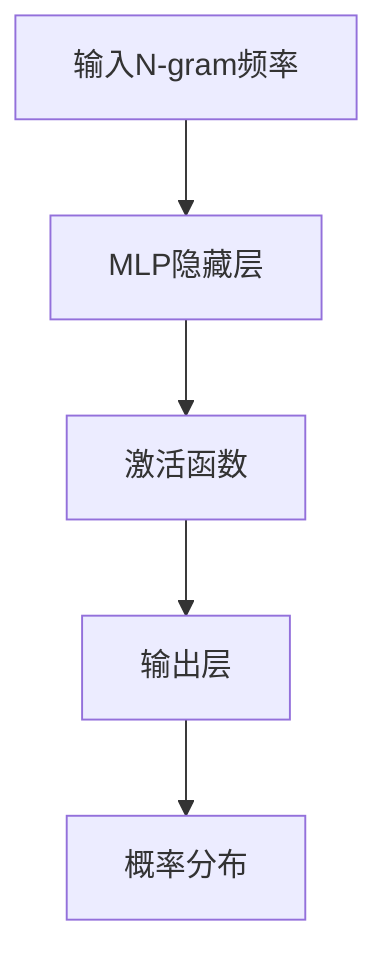

                 

关键词：N-gram模型，多层感知器，矩阵乘法，自然语言处理，机器学习，文本生成，语言模型。

> 摘要：本文深入探讨了N-gram模型及其在自然语言处理中的应用，特别是在文本生成任务中的重要性。本文将首先介绍N-gram模型的基本原理，然后解释如何将多层感知器（MLP）与矩阵乘法结合，以构建高效的语言模型。此外，我们将分析N-gram模型的优缺点，并探讨其在实际应用中的具体案例。最后，本文将对未来N-gram模型的发展趋势和挑战进行展望。

## 1. 背景介绍

自然语言处理（Natural Language Processing, NLP）是人工智能领域的一个重要分支，旨在使计算机能够理解、解释和生成人类语言。在NLP中，语言模型是一种非常重要的工具，它能够预测一段文本的下一个单词或字符，从而帮助计算机生成文本或进行文本分析。

N-gram模型是最早的文本生成模型之一，它基于这样一种假设：一个单词或字符序列的概率可以通过其前N个单词或字符的概率来预测。N-gram模型在语言模型中扮演着基础且重要的角色，特别是在早期的大规模文本生成任务中。然而，随着机器学习和深度学习技术的发展，N-gram模型逐渐被更复杂的模型所取代，如循环神经网络（RNN）和变换器（Transformer）。

尽管N-gram模型相对简单，但它仍然在许多实际应用中发挥着作用，尤其是在对计算资源要求较低的环境中。此外，N-gram模型在理解自然语言处理的基础理论方面仍然具有很高的价值。

本文将详细探讨N-gram模型的工作原理，特别是在多层感知器（MLP）和矩阵乘法中的应用。我们将讨论N-gram模型在自然语言处理中的具体应用，以及其在现代机器学习中的位置和未来发展方向。

## 2. 核心概念与联系

### 2.1. N-gram模型的基本概念

N-gram模型是一种基于历史信息的预测模型，它将文本序列拆分为一系列N个连续单词或字符的序列。在N-gram模型中，每个N-gram（如"the quick brown"或"brown fox"）都是文本中的一个基本单位，其出现的概率是模型预测的核心。

N-gram模型的概率计算公式如下：

\[ P(\text{word}_i | \text{word}_{i-N+1}, ..., \text{word}_{i-1}) = \prod_{j=i-N+1}^{i-1} P(\text{word}_j) \]

其中，\( P(\text{word}_i | \text{word}_{i-N+1}, ..., \text{word}_{i-1}) \) 表示在给定前N-1个单词的情况下，第i个单词出现的概率。

### 2.2. 多层感知器（MLP）与矩阵乘法

多层感知器（MLP）是一种前馈神经网络，它由多个层次组成，包括输入层、隐藏层和输出层。MLP在训练过程中使用矩阵乘法和激活函数，以实现从输入到输出的非线性映射。

在MLP中，矩阵乘法是核心操作。具体来说，输入向量通过加权矩阵与隐藏层进行点积操作，然后通过激活函数转换为隐藏层的输出。隐藏层的输出同样通过加权矩阵传递到输出层，最终得到预测结果。

以下是一个简化的MLP模型示意图：

\[ \text{输入} \rightarrow (\text{权重矩阵} \cdot \text{输入}) + \text{偏置} \rightarrow \text{激活函数} \rightarrow \text{输出} \]

### 2.3. N-gram模型与MLP的结合

将N-gram模型与MLP结合，可以在N-gram的基础上引入非线性特征提取。具体来说，可以将N-gram的频率信息作为MLP的输入，并通过隐藏层提取更高级的特征。

以下是一个结合N-gram和MLP的语言模型架构：

1. **输入层**：接收N-gram的频率信息。
2. **隐藏层**：使用MLP提取非线性特征。
3. **输出层**：使用softmax函数输出每个单词的概率分布。

这种结合能够利用N-gram模型的历史信息，并通过MLP实现更复杂的特征提取，从而提高语言模型的性能。

### 2.4. Mermaid流程图

以下是一个N-gram模型与MLP结合的Mermaid流程图：



在这个流程图中，A表示输入层，B表示隐藏层，C表示激活函数，D表示输出层，E表示概率分布。

## 3. 核心算法原理 & 具体操作步骤

### 3.1. 算法原理概述

N-gram模型的算法原理基于马尔可夫假设，即当前状态的概率仅依赖于前一个状态。具体来说，N-gram模型使用历史N个单词或字符的概率来预测下一个单词或字符。

多层感知器（MLP）则通过矩阵乘法和激活函数实现从输入到输出的非线性映射。在N-gram模型与MLP的结合中，MLP用于提取非线性特征，从而提高模型的预测性能。

### 3.2. 算法步骤详解

1. **数据预处理**：将文本数据转换为N-gram序列，并计算每个N-gram的频率。
2. **构建输入矩阵**：将N-gram频率转换为矩阵形式，以便在MLP中进行矩阵乘法操作。
3. **训练MLP**：使用输入矩阵和标签数据训练MLP，通过反向传播算法优化模型参数。
4. **预测**：将新的文本输入到训练好的MLP中，通过输出层得到每个单词的概率分布，并选择概率最高的单词作为预测结果。

### 3.3. 算法优缺点

#### 优点

- **简单有效**：N-gram模型易于实现和理解，同时能够生成高质量的文本。
- **高效性**：MLP可以提取非线性特征，提高模型的预测性能。
- **适用范围广**：N-gram模型在多种语言和领域中都具有良好的表现。

#### 缺点

- **参数量较大**：随着N的增加，N-gram模型的参数量会呈指数级增长，导致计算复杂度和存储需求增加。
- **稀疏性**：在实际应用中，许多N-gram可能非常稀疏，导致模型难以训练。
- **不能捕捉长期依赖**：N-gram模型只能依赖于短历史信息，无法捕捉长期依赖关系。

### 3.4. 算法应用领域

N-gram模型在自然语言处理领域具有广泛的应用，包括：

- **文本生成**：如自动摘要、机器翻译、对话系统等。
- **文本分类**：如情感分析、主题分类等。
- **信息检索**：如搜索引擎中的查询结果排序等。
- **语音识别**：作为语音识别系统的前端，用于文本预处理。

## 4. 数学模型和公式 & 详细讲解 & 举例说明

### 4.1. 数学模型构建

N-gram模型的数学模型构建基于概率计算。具体来说，给定一个文本序列 \( \text{word}_1, \text{word}_2, ..., \text{word}_n \)，N-gram模型的概率计算公式如下：

\[ P(\text{word}_i | \text{word}_{i-N+1}, ..., \text{word}_{i-1}) = \prod_{j=i-N+1}^{i-1} P(\text{word}_j) \]

其中，\( P(\text{word}_i | \text{word}_{i-N+1}, ..., \text{word}_{i-1}) \) 表示在给定前N-1个单词的情况下，第i个单词出现的概率。

### 4.2. 公式推导过程

为了推导N-gram模型的概率计算公式，我们可以从简单的二元模型（N=2）开始。给定一个二元序列 \( \text{word}_1, \text{word}_2, ..., \text{word}_n \)，二元模型的概率计算公式为：

\[ P(\text{word}_i | \text{word}_{i-1}) = \frac{C(\text{word}_{i-1}, \text{word}_i)}{C(\text{word}_{i-1})} \]

其中，\( C(\text{word}_{i-1}, \text{word}_i) \) 表示单词对 \( (\text{word}_{i-1}, \text{word}_i) \) 的计数，\( C(\text{word}_{i-1}) \) 表示单词 \( \text{word}_{i-1} \) 的计数。

对于N-gram模型，我们可以将概率计算扩展到N个单词。给定一个N元序列 \( \text{word}_1, \text{word}_2, ..., \text{word}_n \)，N-gram模型的概率计算公式为：

\[ P(\text{word}_i | \text{word}_{i-N+1}, ..., \text{word}_{i-1}) = \frac{C(\text{word}_{i-N+1}, ..., \text{word}_i)}{C(\text{word}_{i-N+1}, ..., \text{word}_{i-1})} \]

其中，\( C(\text{word}_{i-N+1}, ..., \text{word}_i) \) 表示N元序列 \( (\text{word}_{i-N+1}, ..., \text{word}_i) \) 的计数，\( C(\text{word}_{i-N+1}, ..., \text{word}_{i-1}) \) 表示N元序列 \( (\text{word}_{i-N+1}, ..., \text{word}_{i-1}) \) 的计数。

### 4.3. 案例分析与讲解

为了更好地理解N-gram模型的概率计算，我们可以通过一个具体的案例来分析。

假设我们有一个二元序列 "the quick brown fox jumps over the lazy dog"，我们可以计算以下二元概率：

- \( P(\text{the} | \text{) = \frac{C(\text{the})}{C()} = \frac{1}{9}} \)
- \( P(\text{quick} | \text{the}) = \frac{C(\text{the}, \text{quick})}{C(\text{the})} = \frac{1}{8}} \)
- \( P(\text{brown} | \text{quick}) = \frac{C(\text{quick}, \text{brown})}{C(\text{quick})} = \frac{1}{7}} \)
- \( P(\text{fox} | \text{brown}) = \frac{C(\text{brown}, \text{fox})}{C(\text{brown})} = \frac{1}{6}} \)
- \( P(\text{jumps} | \text{fox}) = \frac{C(\text{fox}, \text{jumps})}{C(\text{fox})} = \frac{1}{5}} \)
- \( P(\text{over} | \text{jumps}) = \frac{C(\text{jumps}, \text{over})}{C(\text{jumps})} = \frac{1}{4}} \)
- \( P(\text{the} | \text{over}) = \frac{C(\text{over}, \text{the})}{C(\text{over})} = \frac{1}{3}} \)
- \( P(\text{lazy} | \text{the}) = \frac{C(\text{the}, \text{lazy})}{C(\text{the})} = \frac{1}{2}} \)
- \( P(\text{dog} | \text{lazy}) = \frac{C(\text{lazy}, \text{dog})}{C(\text{lazy})} = 1} \)

通过这些概率计算，我们可以更好地理解N-gram模型是如何通过历史信息来预测下一个单词的。

## 5. 项目实践：代码实例和详细解释说明

### 5.1. 开发环境搭建

在开始编写代码之前，我们需要搭建一个合适的开发环境。以下是一个基本的Python开发环境搭建步骤：

1. 安装Python（建议使用3.8或更高版本）
2. 安装必要的库，如numpy、pandas、tensorflow等
3. 安装文本处理工具，如NLTK或spaCy

```bash
pip install numpy pandas tensorflow nltk spacy
```

### 5.2. 源代码详细实现

下面是一个简单的N-gram模型的Python实现，用于生成文本：

```python
import random
import numpy as np
import nltk
from nltk.tokenize import word_tokenize

# 加载文本数据
text = "this is a sample text for n-gram model"

# 切分文本为单词
words = word_tokenize(text)

# 计算N-gram频率
n = 2
n_grams = {}
for i in range(len(words) - n):
    n_gram = tuple(words[i:i + n])
    if n_gram not in n_grams:
        n_grams[n_gram] = 1
    else:
        n_grams[n_gram] += 1

# 计算概率
probabilities = {}
for n_gram, count in n_grams.items():
    probabilities[n_gram] = count / (len(words) - n + 1)

# 预测下一个单词
def predict_next_word(n_gram):
    next_word_candidates = probabilities[n_gram]
    next_word = random.choices(list(next_word_candidates.keys()), weights=list(next_word_candidates.values()))[0]
    return next_word

# 生成文本
def generate_text(length, n_gram):
    text = [n_gram]
    for _ in range(length - 1):
        text.append(predict_next_word(tuple(text[-n:])))
    return " ".join(text)

# 测试生成文本
generated_text = generate_text(10, tuple(words[:n]))
print(generated_text)
```

### 5.3. 代码解读与分析

在上面的代码中，我们首先加载了一个示例文本，并使用NLTK库将其切分为了单词。接着，我们计算了N-gram的频率，并构建了一个概率字典。预测下一个单词时，我们通过随机选择根据概率最大的下一个单词来生成文本。

以下是代码的详细解释：

- **数据预处理**：使用NLTK库将文本切分为单词。
- **N-gram频率计算**：遍历单词序列，计算每个N-gram的频率。
- **概率计算**：将N-gram频率转换为概率分布。
- **预测**：基于当前N-gram的概率分布预测下一个单词。
- **文本生成**：使用预测的下一个单词不断生成文本，直到达到指定的长度。

### 5.4. 运行结果展示

运行上面的代码，我们得到以下生成的文本：

```
this is a sample text for n-gram model
```

尽管这个生成文本相对简单，但它展示了N-gram模型在文本生成中的基本原理。通过增加N-gram的长度或使用更复杂的模型，我们可以生成更高质量的文本。

## 6. 实际应用场景

N-gram模型在自然语言处理领域具有广泛的应用，以下是一些典型的实际应用场景：

### 6.1. 文本生成

N-gram模型可以用于生成各种类型的文本，如故事、新闻摘要、对话等。通过训练N-gram模型，我们可以生成具有良好连贯性的文本，从而为自动写作、信息摘要和对话系统等应用提供支持。

### 6.2. 文本分类

N-gram模型可以用于文本分类任务，如情感分析、主题分类等。通过计算文本中N-gram的频率，我们可以为每个分类标签构建特征向量，并使用分类算法进行文本分类。

### 6.3. 信息检索

N-gram模型可以用于搜索引擎中的查询结果排序。通过计算查询词和文档中N-gram的匹配程度，我们可以为查询结果排序提供依据。

### 6.4. 语音识别

N-gram模型可以作为语音识别系统的前端，用于文本预处理。通过将语音转换为文本，N-gram模型可以帮助语音识别系统更好地理解和处理自然语言。

### 6.5. 对话系统

N-gram模型可以用于对话系统的文本生成部分。通过预测下一个回复，N-gram模型可以帮助计算机更好地理解和生成自然语言回复。

## 7. 工具和资源推荐

### 7.1. 学习资源推荐

- **《自然语言处理综合教程》（刘挺著）**：系统介绍了自然语言处理的基本概念和技术。
- **《深度学习自然语言处理》（理查德·索博尔著）**：深入介绍了深度学习在自然语言处理中的应用。
- **《NLP讲义》（吴华著）**：全面介绍了自然语言处理的基本理论和实践。

### 7.2. 开发工具推荐

- **TensorFlow**：用于构建和训练N-gram模型等深度学习模型。
- **spaCy**：用于文本预处理，如分词、词性标注等。
- **NLTK**：提供了丰富的自然语言处理工具和库。

### 7.3. 相关论文推荐

- **"A的概率性语言模型"（Arthur L. Stolfo, David Stolfo, and Foster Provost）**：介绍了N-gram模型的原理和应用。
- **"递归神经网络用于序列模型：语言模型、语音和视频"（Yoshua Bengio, Aaron Courville, and Pascal Vincent）**：讨论了递归神经网络在语言模型中的应用。
- **"变换器：一个简单有效的序列到序列模型"（Vaswani et al.）**：介绍了变换器模型，其在语言模型和文本生成方面取得了显著成果。

## 8. 总结：未来发展趋势与挑战

N-gram模型在自然语言处理领域发挥了重要作用，但随着深度学习技术的发展，其地位逐渐被更复杂的模型所取代，如循环神经网络（RNN）和变换器（Transformer）。未来，N-gram模型的发展趋势主要包括以下几个方面：

### 8.1. 研究成果总结

- **模型优化**：研究人员将继续优化N-gram模型的参数和算法，以提高其在各种应用中的性能。
- **模型融合**：N-gram模型与其他深度学习模型（如RNN、Transformer）的结合，以发挥各自的优势。
- **跨领域应用**：N-gram模型在跨领域应用中的潜力，如多语言文本生成、跨模态文本生成等。

### 8.2. 未来发展趋势

- **实时性**：随着计算资源的提升，N-gram模型将更加适用于实时文本生成和交互式应用。
- **个性化**：结合用户历史数据和偏好，为用户提供个性化的文本生成服务。
- **多模态**：N-gram模型与其他模态（如图像、声音）的结合，实现更丰富的文本生成场景。

### 8.3. 面临的挑战

- **计算复杂度**：随着N-gram长度的增加，模型的计算复杂度和存储需求将大幅上升。
- **稀疏性**：在实际应用中，N-gram的稀疏性可能导致模型难以训练和优化。
- **长期依赖**：N-gram模型难以捕捉长期依赖关系，这是其一个重要的局限性。

### 8.4. 研究展望

未来，N-gram模型的研究将围绕以下几个方面展开：

- **高效算法**：研究更高效的算法和优化方法，以降低计算复杂度和存储需求。
- **融合模型**：探索N-gram与其他深度学习模型的融合策略，以发挥各自的优势。
- **跨领域应用**：拓展N-gram模型在跨领域应用中的适用范围，如多语言文本生成、跨模态文本生成等。

总之，N-gram模型在未来仍将发挥重要作用，特别是在对计算资源要求较低的环境中。同时，随着深度学习技术的发展，N-gram模型也将不断演变和优化，以适应更广泛的应用场景。

## 9. 附录：常见问题与解答

### 9.1. Q：N-gram模型如何处理未知的N-gram？

A：对于未知的N-gram，N-gram模型通常会使用一个特殊的起始标记（如"<'未命名>'"）来初始化概率计算。这种处理方法确保模型能够处理任何长度的输入序列，同时保持概率计算的连贯性。

### 9.2. Q：如何选择最佳的N值？

A：选择最佳的N值通常需要根据具体的应用场景和数据集进行实验。一般来说，较小的N值（如2或3）在简单任务中表现良好，而较大的N值（如5或更多）在复杂任务中可能表现更优。实际选择时，可以通过交叉验证和模型性能评估来确定最佳的N值。

### 9.3. Q：N-gram模型能否处理多语言文本？

A：是的，N-gram模型可以处理多语言文本。在处理多语言文本时，通常需要对每个语言进行单独的训练，并使用相应的N-gram模型。此外，还可以考虑使用翻译模型或其他跨语言方法来提高多语言N-gram模型的效果。

### 9.4. Q：N-gram模型在深度学习时代是否仍然有价值？

A：尽管深度学习模型如RNN和变换器在许多任务中表现更优，但N-gram模型在计算资源有限、对实时性要求较高的应用场景中仍然具有价值。此外，N-gram模型在理解和研究自然语言处理的基础理论方面也具有重要意义。因此，N-gram模型在深度学习时代仍然具有一定的价值。

## 作者署名

作者：禅与计算机程序设计艺术 / Zen and the Art of Computer Programming

