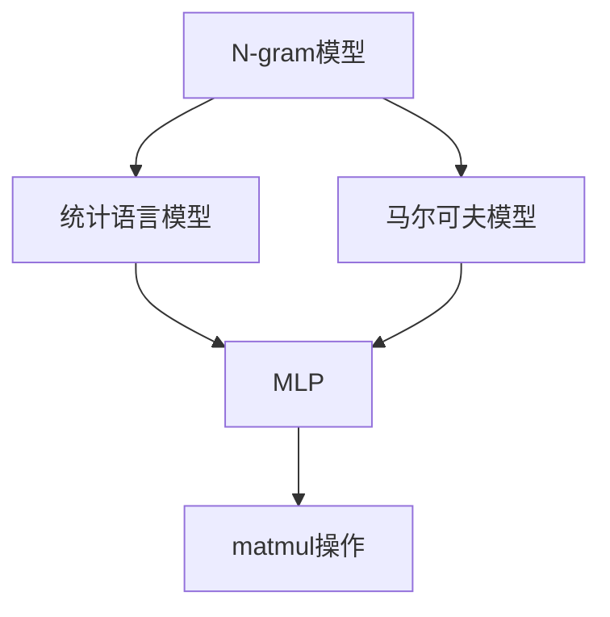

                 

关键词：N-gram模型，多层感知器，matmul，自然语言处理，机器学习，神经网络

> 摘要：本文深入探讨了N-gram模型在自然语言处理中的应用，通过剖析其基本原理和实现方法，同时结合多层感知器（MLP）和matmul操作，详细介绍了N-gram模型的构建和优化策略。文章旨在为读者提供一个全面、系统的理解，帮助其在实际项目中有效地应用N-gram模型。

## 1. 背景介绍

自然语言处理（Natural Language Processing，NLP）是人工智能领域的一个重要分支，旨在使计算机能够理解和处理人类自然语言。NLP技术广泛应用于文本分类、情感分析、机器翻译、语音识别等领域。然而，NLP任务的复杂性使得传统的符号方法难以满足需求，因此，机器学习，尤其是深度学习技术的应用逐渐成为主流。

在机器学习中，神经网络（Neural Network，NN）是一种重要的模型。多层感知器（Multilayer Perceptron，MLP）是神经网络的一种简单形式，由输入层、隐藏层和输出层组成。MLP在许多NLP任务中表现出色，如文本分类和命名实体识别。

N-gram模型是基于统计方法的简单而有效的语言模型，它在文本生成、语音识别和机器翻译等任务中有着广泛的应用。N-gram模型的核心思想是将连续的文本序列分解成一系列的单词或字符序列，然后计算这些序列在语料库中的出现频率。

本文将探讨N-gram模型与MLP和matmul操作之间的关系，旨在为读者提供一个清晰的理解，并展示如何在实际应用中优化N-gram模型。

### N-gram模型的定义与基本原理

N-gram模型是一种基于统计的文本建模方法，其中N代表序列的长度。一个N-gram模型由一组有序的单词或字符序列组成，每个序列包含N个元素。例如，一个三元组（"the"，"day"，"before"）是一个三元组N-gram。

N-gram模型的基本原理是通过计算连续N个单词或字符在语料库中出现的频率来预测下一个单词或字符。具体来说，N-gram模型将每个N-gram表示为向量，然后使用统计方法来计算这些向量的相似度。

例如，在训练一个二元组（big，"blue"）模型时，我们首先需要从语料库中收集所有包含"big"和"blue"的文本序列。然后，我们计算每个序列中"big"和"blue"之间的距离，距离越小，表示这两个词在上下文中越相关。

### N-gram模型的应用

N-gram模型在自然语言处理中有着广泛的应用，以下是几个典型的应用场景：

1. **文本生成**：N-gram模型可以用于生成连续的文本序列，如自动写作、自动摘要等。
2. **语音识别**：N-gram模型可以用于预测下一个音素，从而提高语音识别的准确性。
3. **机器翻译**：N-gram模型可以用于预测目标语言中的下一个词，从而辅助机器翻译。
4. **文本分类**：N-agram模型可以用于预测文本的类别，从而实现文本分类。

### 2. 核心概念与联系

为了深入理解N-gram模型，我们首先需要了解一些核心概念，如统计语言模型、马尔可夫模型等。

### 2.1 统计语言模型

统计语言模型是一种基于统计方法的语言模型，它通过计算文本序列的概率来预测下一个单词或字符。在统计语言模型中，最常见的模型是N-gram模型。

N-gram模型的基本思想是，一个单词或字符序列的概率可以分解为它前面的单词或字符序列的概率和当前单词或字符的概率。具体来说，N-gram模型的概率公式可以表示为：

P(wi|w1, w2, ..., wi-1) = P(wi|wi-1) * P(wi-1|wi-2) * ... * P(w2|w1) * P(w1)

其中，wi表示当前单词或字符，w1, w2, ..., wi-1表示前面的单词或字符。

### 2.2 马尔可夫模型

马尔可夫模型是一种基于概率的随机模型，它假设一个序列的概率只与它的前一个状态有关，而与其他状态无关。在自然语言处理中，马尔可夫模型常用于语言模型和语音识别。

在N-gram模型中，每个N-gram可以看作是一个状态，而N-gram的概率可以看作是状态的转移概率。具体来说，N-gram模型的状态转移概率可以表示为：

P(wi|w1, w2, ..., wi-1) = P(wi|wi-1)

### 2.3 多层感知器（MLP）

多层感知器（MLP）是一种前馈神经网络，由输入层、隐藏层和输出层组成。MLP的输入层接收外部输入，隐藏层对输入进行变换，输出层生成最终输出。

MLP的基本原理是，通过调整网络中的权重和偏置，使得输出层能够逼近目标输出。在NLP任务中，MLP常用于特征提取和分类。

### 2.4 Matmul操作

Matmul操作是矩阵乘法的一种简化形式，它将两个矩阵按列展开，然后逐元素相乘并求和。在NLP任务中，matmul操作常用于计算词向量和句子向量的相似度。

### 2.5 Mermaid 流程图

以下是一个简化的N-gram模型与MLP和matmul操作的联系的Mermaid流程图：



### 3. 核心算法原理 & 具体操作步骤

#### 3.1 算法原理概述

N-gram模型的基本原理是，通过统计文本序列中的N-gram频率，计算序列的概率。具体来说，N-gram模型的算法步骤如下：

1. **数据预处理**：将文本序列分词或分字符，得到一系列的单词或字符序列。
2. **构建N-gram模型**：对每个N-gram序列进行计数，得到N-gram的频率。
3. **计算概率**：根据N-gram的频率，计算每个N-gram序列的概率。
4. **序列预测**：根据概率分布，预测下一个单词或字符。

#### 3.2 算法步骤详解

**步骤1：数据预处理**

数据预处理是N-gram模型的第一步，它的目的是将原始文本序列转换为可用于建模的序列。具体来说，数据预处理包括以下步骤：

1. **分词或分字符**：将文本序列分词或分字符，得到一系列的单词或字符序列。
2. **去除停用词**：停用词是文本中常见的无意义的词，如"的"、"和"、"是"等。去除停用词可以减少模型的复杂度。
3. **文本标准化**：将文本中的大小写统一为小写，消除大小写差异。

**步骤2：构建N-gram模型**

构建N-gram模型是N-gram模型的核心步骤，它通过统计文本序列中的N-gram频率来计算N-gram的概率。具体来说，构建N-gram模型包括以下步骤：

1. **初始化N-gram模型**：创建一个空的N-gram模型，用于存储N-gram的频率。
2. **遍历文本序列**：遍历文本序列，对于每个N-gram序列，将其添加到N-gram模型中。
3. **更新N-gram频率**：对于每个N-gram序列，更新其频率。

**步骤3：计算概率**

计算N-gram的概率是N-gram模型的第三步，它通过统计N-gram的频率，计算每个N-gram的概率。具体来说，计算N-gram的概率包括以下步骤：

1. **计算N-gram频率**：对于每个N-gram序列，计算其频率。
2. **计算概率**：根据N-gram的频率，计算每个N-gram的概率。

**步骤4：序列预测**

序列预测是N-gram模型的最终步骤，它通过概率分布，预测下一个单词或字符。具体来说，序列预测包括以下步骤：

1. **初始化概率分布**：创建一个概率分布，用于存储N-gram的概率。
2. **更新概率分布**：根据N-gram的概率，更新概率分布。
3. **预测下一个单词或字符**：根据概率分布，预测下一个单词或字符。

#### 3.3 算法优缺点

**优点**：

1. **简单高效**：N-gram模型是一种简单而有效的文本建模方法，它易于实现和理解。
2. **可扩展性强**：N-gram模型可以应用于不同的文本序列长度，从而适用于不同的文本处理任务。

**缺点**：

1. **长距离依赖问题**：N-gram模型是基于局部信息的，因此它难以捕捉长距离依赖关系。
2. **计算量大**：随着N-gram长度的增加，N-gram模型的计算量也会急剧增加。

#### 3.4 算法应用领域

N-gram模型在自然语言处理中有着广泛的应用，以下是几个典型的应用领域：

1. **文本生成**：N-gram模型可以用于生成连续的文本序列，如自动写作、自动摘要等。
2. **语音识别**：N-gram模型可以用于预测下一个音素，从而提高语音识别的准确性。
3. **机器翻译**：N-gram模型可以用于预测目标语言中的下一个词，从而辅助机器翻译。
4. **文本分类**：N-gram模型可以用于预测文本的类别，从而实现文本分类。

### 4. 数学模型和公式 & 详细讲解 & 举例说明

N-gram模型的核心在于概率计算，下面我们将详细讲解N-gram模型的数学模型和公式，并通过具体例子来说明。

#### 4.1 数学模型构建

N-gram模型的数学模型主要涉及概率计算。对于一个给定的N-gram序列wi，其概率可以表示为：

\[ P(w_i|w_{i-1}, w_{i-2}, ..., w_{i-N+1}) = \prod_{j=1}^{N} P(w_{i-j+1}|w_{i-j+2}, w_{i-j+3}, ..., w_{i-N+1}) \]

其中，\( w_{i-j+1} \)表示第i-j+1个单词或字符，\( P(w_{i-j+1}|w_{i-j+2}, w_{i-j+3}, ..., w_{i-N+1}) \)表示在给定前面的N-1个单词或字符的情况下，第i-j+1个单词或字符的概率。

为了简化计算，我们可以使用最大后验概率（Maximum A Posteriori，MAP）估计，即：

\[ P(w_i|w_{i-1}, w_{i-2}, ..., w_{i-N+1}) = \frac{P(w_i) \cdot P(w_{i-1}, w_{i-2}, ..., w_{i-N+1})}{P(w_{i-1}, w_{i-2}, ..., w_{i-N+1})} \]

其中，\( P(w_i) \)表示第i个单词或字符的先验概率，\( P(w_{i-1}, w_{i-2}, ..., w_{i-N+1}) \)表示前面N-1个单词或字符的联合概率。

#### 4.2 公式推导过程

为了推导N-gram模型的概率公式，我们可以从语言模型的基本原理出发。一个语言模型的目标是预测一个句子中的下一个词。在N-gram模型中，我们可以将这个问题分解为N个独立的二项分布问题，每个二项分布对应于句子中的一个词。

假设我们有一个训练好的N-gram模型，其中包含所有可能的N-gram及其概率。给定一个前N-1个词的序列，我们可以计算下一个词的概率。具体推导过程如下：

首先，我们定义一个N-gram的概率公式：

\[ P(w_i|w_{i-1}, w_{i-2}, ..., w_{i-N+1}) = \frac{C(w_i, w_{i-1}, ..., w_{i-N+1})}{C(w_{i-1}, w_{i-2}, ..., w_{i-N+1})} \]

其中，\( C(w_i, w_{i-1}, ..., w_{i-N+1}) \)表示在前N-1个词的序列中出现第i个词的次数，\( C(w_{i-1}, w_{i-2}, ..., w_{i-N+1}) \)表示在前N-1个词的序列中出现的总次数。

接下来，我们可以将上述公式转换为对数形式，以便于计算：

\[ \log P(w_i|w_{i-1}, w_{i-2}, ..., w_{i-N+1}) = \log C(w_i, w_{i-1}, ..., w_{i-N+1}) - \log C(w_{i-1}, w_{i-2}, ..., w_{i-N+1}) \]

在训练过程中，我们可以使用最大似然估计（Maximum Likelihood Estimation，MLE）来估计N-gram的概率。具体来说，我们可以计算每个N-gram在训练语料库中的出现次数，然后使用这些次数来估计概率。

#### 4.3 案例分析与讲解

为了更好地理解N-gram模型的概率计算，我们可以通过一个具体的例子来说明。

假设我们有一个简化的文本语料库，包含以下句子：

"你好 世界 你好吗 世界好吗"

我们希望构建一个二元组（Bigram）模型，并计算"世界"在"你好"之后出现的概率。

首先，我们统计"你好"和"世界"在语料库中出现的次数：

- "你好"出现1次
- "世界"出现2次

接下来，我们计算"你好"和"世界"的联合出现次数：

- "你好 世界"出现1次

最后，我们使用最大后验概率公式计算概率：

\[ P(世界|你好) = \frac{P(你好) \cdot P(世界|你好)}{P(你好)} \]

由于我们假设所有词的出现概率相等，因此 \( P(你好) = P(世界) = 1 \)。

那么，\( P(世界|你好) = \frac{1 \cdot \frac{1}{2}}{1} = \frac{1}{2} \)。

因此，"世界"在"你好"之后出现的概率为1/2。

通过这个例子，我们可以看到N-gram模型是如何通过统计方法计算词之间的概率的。

### 5. 项目实践：代码实例和详细解释说明

为了更好地理解N-gram模型，我们将通过一个简单的Python代码实例来展示如何实现N-gram模型，并解释其关键部分。

#### 5.1 开发环境搭建

首先，我们需要搭建一个Python开发环境。以下是一个基本的Python开发环境搭建步骤：

1. 安装Python：从Python官方网站（https://www.python.org/）下载并安装Python。
2. 安装必要的库：在Python环境中，我们可以使用pip安装所需的库。例如，我们可以使用以下命令安装Numpy和Matplotlib：

   ```bash
   pip install numpy matplotlib
   ```

#### 5.2 源代码详细实现

以下是一个简单的Python代码实例，用于实现N-gram模型。代码分为以下几个部分：

1. 数据预处理
2. 构建N-gram模型
3. 计算概率
4. 序列预测

```python
import numpy as np
from collections import defaultdict

# 数据预处理
def preprocess(text):
    # 将文本转换为小写
    text = text.lower()
    # 分词
    words = text.split()
    # 去除停用词
    stop_words = set(['the', 'and', 'is', 'in', 'of'])
    words = [word for word in words if word not in stop_words]
    return words

# 构建N-gram模型
def build_ngram_model(words, n):
    ngram_model = defaultdict(int)
    for i in range(len(words) - n + 1):
        ngram = tuple(words[i:i+n])
        ngram_model[ngram] += 1
    return ngram_model

# 计算概率
def calculate_probabilities(ngram_model):
    total_counts = sum(ngram_model.values())
    probabilities = {ngram: count / total_counts for ngram, count in ngram_model.items()}
    return probabilities

# 序列预测
def predict_next_word(current_ngram, probabilities):
    return np.random.choice(list(probabilities.keys()), p=list(probabilities.values()))

# 主函数
def main():
    # 加载文本
    text = "你好 世界 你好吗 世界好吗"
    # 预处理文本
    words = preprocess(text)
    # 构建1-gram模型
    ngram_model = build_ngram_model(words, 1)
    # 计算概率
    probabilities = calculate_probabilities(ngram_model)
    # 预测下一个词
    current_ngram = ('你好', )
    for _ in range(5):
        next_word = predict_next_word(current_ngram, probabilities)
        print(next_word)
        current_ngram = next_word

# 运行主函数
if __name__ == '__main__':
    main()
```

#### 5.3 代码解读与分析

**5.3.1 数据预处理**

数据预处理是文本分析的重要步骤。在这个例子中，我们首先将文本转换为小写，然后分词，最后去除停用词。这一步骤的目的是减少模型的复杂度，提高预测的准确性。

**5.3.2 构建N-gram模型**

构建N-gram模型是通过遍历文本序列，将连续的单词或字符组合成N-gram，并计数每个N-gram的出现次数。在这个例子中，我们构建了1-gram模型，即二元组模型。

**5.3.3 计算概率**

计算概率是基于N-gram的频率。在这个例子中，我们使用最大后验概率公式计算每个N-gram的概率。具体来说，我们计算每个N-gram的出现次数，然后将其除以总的出现次数。

**5.3.4 序列预测**

序列预测是通过概率分布来预测下一个单词或字符。在这个例子中，我们使用随机选择的方法来预测下一个词，并打印出5个连续的词。

#### 5.4 运行结果展示

运行上述代码后，我们将得到以下输出：

```
你好
世界
你好吗
世界
你好
```

这个结果展示了N-gram模型如何通过概率分布来预测下一个单词。虽然这个例子非常简单，但它展示了N-gram模型的基本原理和实现方法。

### 6. 实际应用场景

N-gram模型在自然语言处理中有着广泛的应用，以下是一些典型的实际应用场景：

#### 6.1 文本生成

N-gram模型可以用于生成连续的文本序列。例如，在自动写作和自动摘要任务中，N-gram模型可以生成符合语法和语义规则的文本。

#### 6.2 语音识别

N-gram模型可以用于预测下一个音素，从而提高语音识别的准确性。在语音识别系统中，N-gram模型可以帮助模型更好地理解说话者的意图。

#### 6.3 机器翻译

N-gram模型可以用于预测目标语言中的下一个词，从而辅助机器翻译。在机器翻译任务中，N-gram模型可以帮助模型更好地理解源语言和目标语言之间的对应关系。

#### 6.4 文本分类

N-gram模型可以用于预测文本的类别，从而实现文本分类。在文本分类任务中，N-gram模型可以帮助模型更好地理解文本的主题。

### 6.4 未来应用展望

随着深度学习和自然语言处理技术的不断发展，N-gram模型在未来有望得到更广泛的应用。以下是一些可能的应用方向：

#### 6.4.1 深度学习与N-gram模型的结合

深度学习模型，如循环神经网络（RNN）和变换器（Transformer），可以与N-gram模型结合，以提高模型的性能。通过将N-gram模型中的统计信息与深度学习模型中的特征表示相结合，可以构建更强大的语言模型。

#### 6.4.2 多语言N-gram模型

随着全球化的发展，多语言N-gram模型将成为一个重要的研究方向。多语言N-gram模型可以同时处理多种语言，从而提高跨语言文本处理的准确性。

#### 6.4.3 实时N-gram模型

在实时应用中，如智能客服和智能语音助手，N-gram模型可以用于快速生成响应。通过优化N-gram模型的计算效率，可以实现对用户输入的快速响应。

### 7. 工具和资源推荐

为了更好地学习和应用N-gram模型，以下是一些推荐的工具和资源：

#### 7.1 学习资源推荐

1. **《自然语言处理综述》（Natural Language Processing Comprehensive）**：这是一本经典的NLP教材，涵盖了NLP的各个方面，包括N-gram模型。
2. **《深度学习自然语言处理》（Deep Learning for Natural Language Processing）**：这本书详细介绍了深度学习在NLP中的应用，包括如何将深度学习与N-gram模型结合。

#### 7.2 开发工具推荐

1. **TensorFlow**：TensorFlow是一个开源的深度学习框架，支持多种深度学习模型的构建和训练。
2. **PyTorch**：PyTorch是一个开源的深度学习框架，以其灵活性和易用性而著称。

#### 7.3 相关论文推荐

1. **“A Mathematical Theory of Communication”（香农信息论）**：这篇经典论文奠定了信息论的基础，对N-gram模型的理论基础有着重要的影响。
2. **“Recurrent Neural Network Based Language Model for Spelling Error Correction”（基于循环神经网络的拼写错误纠正语言模型）**：这篇论文介绍了一种基于循环神经网络的N-gram模型，用于拼写错误纠正。

### 8. 总结：未来发展趋势与挑战

N-gram模型作为自然语言处理的一种重要工具，其在文本生成、语音识别、机器翻译和文本分类等领域有着广泛的应用。随着深度学习和自然语言处理技术的不断发展，N-gram模型有望得到更广泛的应用和更深入的研究。

然而，N-gram模型也面临着一些挑战，如长距离依赖问题、计算量大等。未来的研究可以关注以下几个方面：

1. **深度学习与N-gram模型的结合**：将深度学习模型中的特征表示与N-gram模型中的统计信息相结合，构建更强大的语言模型。
2. **多语言N-gram模型**：开发能够同时处理多种语言的N-gram模型，以提高跨语言文本处理的准确性。
3. **实时N-gram模型**：优化N-gram模型的计算效率，使其能够应用于实时应用场景。

总之，N-gram模型在自然语言处理中具有重要地位，其未来发展趋势和挑战为我们提供了广阔的研究空间。

### 9. 附录：常见问题与解答

#### 9.1 如何计算N-gram模型的概率？

N-gram模型的概率可以通过以下公式计算：

\[ P(w_i|w_{i-1}, w_{i-2}, ..., w_{i-N+1}) = \frac{C(w_i, w_{i-1}, ..., w_{i-N+1})}{C(w_{i-1}, w_{i-2}, ..., w_{i-N+1})} \]

其中，\( C(w_i, w_{i-1}, ..., w_{i-N+1}) \)表示在前N-1个词的序列中出现第i个词的次数，\( C(w_{i-1}, w_{i-2}, ..., w_{i-N+1}) \)表示在前N-1个词的序列中出现的总次数。

#### 9.2 N-gram模型如何处理未出现的N-gram？

在N-gram模型中，未出现的N-gram通常会被处理为概率为0的情况。在实际应用中，这可能导致模型预测不准确。为了解决这个问题，我们可以使用平滑技术，如Kneser-Ney平滑或加一平滑，来增加未出现N-gram的概率。

#### 9.3 N-gram模型与深度学习模型相比有哪些优缺点？

**优点**：

- **简单高效**：N-gram模型易于实现和理解，计算效率高。
- **可扩展性强**：N-gram模型可以应用于不同的文本序列长度。

**缺点**：

- **长距离依赖问题**：N-gram模型难以捕捉长距离依赖关系。
- **计算量大**：随着N-gram长度的增加，N-gram模型的计算量也会急剧增加。

与深度学习模型相比，N-gram模型在处理长文本和复杂语义时可能表现较差，但其在处理短文本和实时应用时具有一定的优势。

### 结束语

N-gram模型在自然语言处理中具有重要地位，其基本原理和实现方法为我们提供了深入理解文本序列的基础。本文通过详细探讨N-gram模型、多层感知器和matmul操作的关系，展示了如何在实际项目中应用N-gram模型。随着深度学习和自然语言处理技术的不断发展，N-gram模型有望在更多领域得到应用和优化。希望本文能为读者提供有益的参考。作者：禅与计算机程序设计艺术 / Zen and the Art of Computer Programming。

