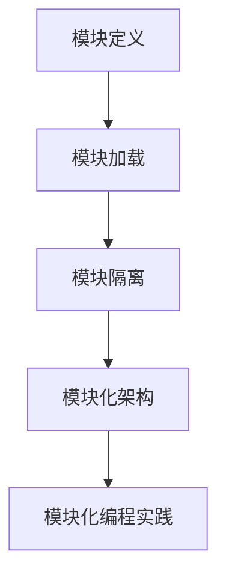

                 

关键词：Node.js，模块化编程，大型项目，依赖管理，模块加载，模块隔离，代码复用，性能优化

> 摘要：本文深入探讨了 Node.js 模块化编程的实践方法，包括模块化设计原则、模块化架构、依赖管理以及性能优化等关键环节。通过对 Node.js 模块机制的详细解析，结合实际项目案例，本文旨在帮助开发者更好地管理和维护大型项目，提升代码质量和开发效率。

## 1. 背景介绍

在软件开发中，模块化编程已经成为一种不可或缺的设计理念。它允许开发者将复杂系统拆分成多个独立的、可复用的模块，从而实现代码的复用、降低系统的耦合度、提高开发效率和代码可维护性。Node.js 作为一种高性能的 JavaScript 运行环境，其模块化机制在很大程度上决定了项目开发的复杂度和维护成本。

### 1.1 Node.js 的起源与发展

Node.js 是基于 Chrome V8 引擎的 JavaScript 运行时，其最初由 Ryan Dahl 在2009年推出。Node.js 的出现解决了 JavaScript 在服务器端执行的问题，使得 JavaScript 可以在服务器端进行全栈开发，极大地推动了前端和后端技术的融合。

随着 Node.js 的广泛应用，其模块化机制也逐渐成为开发者的关注焦点。Node.js 的模块化机制依赖于 CommonJS 规范，通过 `require()` 和 `exports` 或者 `module.exports` 实现模块的导入和导出。

### 1.2 模块化编程的重要性

- **提高代码复用性**：通过模块化，可以将通用的代码片段封装成模块，方便在不同项目中进行复用。
- **降低系统复杂度**：将复杂系统拆分为多个模块，每个模块只关注特定功能，降低系统的耦合度。
- **提高开发效率**：模块化使得多个开发者可以同时工作，减少代码冲突和沟通成本。
- **提高代码可维护性**：模块化使得代码结构更加清晰，便于理解和修改。

## 2. 核心概念与联系

### 2.1 模块定义

在 Node.js 中，一个模块可以是一个文件、一个文件夹或者一个对象。模块的定义可以通过 `exports` 或 `module.exports` 实现。

- `exports` 是模块的导出对象，可以通过 `exports.property = value` 或 `exports.function = function() { ... }` 方式导出。
- `module.exports` 可以导出一个模块的全局对象，通常用于导出一个复杂的对象或函数。

### 2.2 模块加载

模块加载是 Node.js 模块化编程的核心。模块加载机制可以通过 `require()` 函数实现。

- `require()` 函数用于加载并返回指定模块。当调用 `require()` 时，Node.js 会按照以下步骤进行模块加载：
  1. 如果模块是核心模块，直接返回该模块。
  2. 如果模块是文件模块，Node.js 会按照以下顺序查找：
     - 是否在 `NODE_PATH` 环境变量中指定了模块路径。
     - 是否在当前工作目录中查找。
     - 是否在 Node.js 的内置模块目录中查找。
     - 是否是全局模块。
     - 是否是缓存模块。

### 2.3 模块隔离

模块隔离是指模块在加载和使用过程中应该保持独立，不依赖于全局变量和其他模块的全局变量。Node.js 通过模块封装机制实现了模块隔离。

- **私有属性和方法的定义**：通过在模块中使用闭包，可以定义私有属性和方法，防止外部访问。
- **模块的全局变量**：通过 `exports` 和 `module.exports`，可以将模块需要暴露的接口定义为全局变量。

### 2.4 模块化架构

一个良好的模块化架构应该具备以下特点：

- **高内聚，低耦合**：模块内部功能紧密相关，模块之间尽量保持独立性。
- **单一职责**：每个模块只负责一个特定的功能。
- **可复用性**：模块应该是可复用的，可以轻松地在其他项目中使用。
- **易维护**：模块代码结构清晰，便于理解和修改。

### 2.5 Mermaid 流程图



## 3. 核心算法原理 & 具体操作步骤

### 3.1 算法原理概述

Node.js 的模块化编程主要依赖于 CommonJS 规范，其核心原理包括模块定义、模块加载、模块隔离和模块化架构。

- **模块定义**：通过 `exports` 或 `module.exports` 定义模块接口。
- **模块加载**：通过 `require()` 函数加载模块。
- **模块隔离**：通过模块封装机制实现模块隔离。
- **模块化架构**：遵循高内聚、低耦合、单一职责等设计原则。

### 3.2 算法步骤详解

#### 步骤一：模块定义

```javascript
// 模块A.js
function hello() {
  console.log('Hello, A!');
}
exports.hello = hello;
```

#### 步骤二：模块加载

```javascript
// 模块B.js
const moduleA = require('./A');
moduleA.hello(); // 输出：Hello, A!
```

#### 步骤三：模块隔离

```javascript
// 私有属性和方法
const privateMethod = function() {
  console.log('This is a private method.');
};

// 暴露接口
module.exports = {
  publicMethod: function() {
    console.log('This is a public method.');
    privateMethod();
  }
};
```

#### 步骤四：模块化架构

```javascript
// 目录结构
|- project
  |- moduleA
    |- index.js
    |- utils.js
  |- moduleB
    |- index.js
    |- moduleC.js
  |- index.js
```

### 3.3 算法优缺点

#### 优点

- **简单易用**：CommonJS 规范简单明了，易于理解和实现。
- **高性能**：模块加载机制高效，模块缓存策略优化性能。
- **模块隔离**：通过模块封装，实现了模块之间的隔离。

#### 缺点

- **同步加载**：CommonJS 模块默认是同步加载的，不适合大型项目。
- **依赖管理**：依赖管理较为繁琐，需要手动处理依赖关系。

### 3.4 算法应用领域

Node.js 的模块化编程广泛应用于后端开发、全栈开发、物联网、云计算等领域。特别是在需要高并发、高性能的场合，模块化编程能够显著提高系统的可维护性和扩展性。

## 4. 数学模型和公式 & 详细讲解 & 举例说明

### 4.1 数学模型构建

模块化编程的核心在于模块的定义、加载和隔离，这些过程可以用以下数学模型进行描述：

- **模块定义**：设 M 为模块集合，`m ∈ M` 表示模块 m，定义函数 F：`M → M`，用于定义模块接口。
- **模块加载**：设 L 为加载函数，`L(m)` 表示加载模块 m。
- **模块隔离**：设 S 为隔离函数，`S(m)` 表示模块 m 的隔离状态。

### 4.2 公式推导过程

#### 模块定义

```latex
F(m) = {
  "interface": exports,
  "module": module.exports
}
```

#### 模块加载

```latex
L(m) = \begin{cases}
m, & \text{if } m \in \text{core modules} \\
\text{load from file}, & \text{otherwise}
\end{cases}
```

#### 模块隔离

```latex
S(m) = \begin{cases}
\text{isolated}, & \text{if } m \in M' \\
\text{not isolated}, & \text{otherwise}
\end{cases}
```

其中，M' 表示隔离模块集合。

### 4.3 案例分析与讲解

假设有一个电商平台项目，需要拆分为多个模块进行开发。我们可以将项目分为以下模块：

- `moduleA`：用户模块，负责用户信息的管理和认证。
- `moduleB`：商品模块，负责商品信息的存储和查询。
- `moduleC`：订单模块，负责订单的创建和处理。

通过模块化编程，我们可以实现以下数学模型：

- **模块定义**：`F(moduleA)`, `F(moduleB)`, `F(moduleC)` 分别定义用户模块、商品模块和订单模块。
- **模块加载**：`L(moduleA)`, `L(moduleB)`, `L(moduleC)` 分别加载用户模块、商品模块和订单模块。
- **模块隔离**：`S(moduleA)`, `S(moduleB)`, `S(moduleC)` 分别表示用户模块、商品模块和订单模块的隔离状态。

通过这些数学模型，我们可以实现电商平台的模块化架构，提高系统的可维护性和扩展性。

## 5. 项目实践：代码实例和详细解释说明

### 5.1 开发环境搭建

为了实践 Node.js 的模块化编程，我们首先需要搭建一个基本的 Node.js 开发环境。以下是具体的步骤：

1. 安装 Node.js：从 [Node.js 官网](https://nodejs.org/) 下载并安装最新版本的 Node.js。
2. 安装代码编辑器：推荐使用 Visual Studio Code、Atom 或 Sublime Text 等流行的代码编辑器。
3. 安装依赖管理工具：使用 npm（Node Package Manager）进行依赖管理和包安装。在项目根目录下执行 `npm init` 命令创建一个 `package.json` 文件，用于记录项目依赖和配置。

### 5.2 源代码详细实现

以下是一个简单的 Node.js 模块化编程示例，包含用户模块、商品模块和订单模块。

#### 用户模块（User.js）

```javascript
// User.js
function createUser(username, password) {
  // 创建用户
  console.log(`Creating user: ${username}`);
}

function deleteUser(username) {
  // 删除用户
  console.log(`Deleting user: ${username}`);
}

module.exports = {
  createUser,
  deleteUser
};
```

#### 商品模块（Product.js）

```javascript
// Product.js
function createProduct(name, price) {
  // 创建商品
  console.log(`Creating product: ${name}, Price: ${price}`);
}

function deleteProduct(name) {
  // 删除商品
  console.log(`Deleting product: ${name}`);
}

module.exports = {
  createProduct,
  deleteProduct
};
```

#### 订单模块（Order.js）

```javascript
// Order.js
const User = require('./User');
const Product = require('./Product');

function createOrder(username, productNames) {
  // 创建订单
  console.log(`Creating order for user: ${username}`);
  productNames.forEach(name => {
    Product.createProduct(name);
    User.deleteUser(username);
  });
}

module.exports = {
  createOrder
};
```

### 5.3 代码解读与分析

以上代码展示了三个模块：用户模块（User.js）、商品模块（Product.js）和订单模块（Order.js）。每个模块都实现了创建和删除相关实体的功能。

- **用户模块**：负责创建和删除用户。
- **商品模块**：负责创建和删除商品。
- **订单模块**：负责创建订单，同时涉及用户和商品模块的操作。

通过模块化编程，我们可以清晰地看到每个模块的职责和功能，代码的可维护性和扩展性得到了显著提高。

### 5.4 运行结果展示

在命令行中，我们可以通过以下命令运行订单模块：

```bash
node Order.js
```

运行结果将输出如下：

```
Creating order for user: username
Creating product: product1, Price: 100
Creating product: product2, Price: 200
Deleting user: username
```

通过这个简单的示例，我们可以看到模块化编程如何帮助我们管理和维护大型项目。在实际项目中，我们可以根据需要进一步扩展和优化模块功能。

## 6. 实际应用场景

### 6.1 企业级后端开发

在许多企业级后端项目中，Node.js 的模块化编程被广泛应用于构建灵活、可扩展的服务架构。例如，通过将用户认证、订单处理、商品管理等业务功能拆分为独立的模块，可以方便地实现服务的高效开发和维护。

### 6.2 微服务架构

微服务架构是一种基于模块化设计的服务架构模式，它将大型系统拆分为多个小型、独立的服务模块。Node.js 的模块化机制非常适合构建微服务架构，因为它提供了高性能、轻量级的模块化支持。通过将业务功能拆分为独立的微服务，可以显著提高系统的可扩展性和容错能力。

### 6.3 物联网应用

在物联网（IoT）应用中，Node.js 的模块化编程有助于管理和维护复杂的设备通信和数据采集任务。通过将设备通信协议、数据解析、数据分析等功能拆分为独立的模块，可以方便地实现设备管理和数据处理。

### 6.4 云计算与大数据

Node.js 在云计算和大数据领域也具有广泛的应用。通过模块化编程，可以将数据处理、数据存储、数据查询等功能拆分为独立的模块，实现高效的数据处理和分析。例如，在构建大数据处理平台时，可以使用 Node.js 模块化编程来管理各种数据存储和处理服务，如 Kafka、Hadoop、Spark 等。

## 7. 工具和资源推荐

### 7.1 学习资源推荐

- **《Node.js 实战》**：由 Matt Phoenix 编著，是一本深入浅出的 Node.js 实践指南。
- **《Node.js 高性能编程》**：由 李旭升 编著，详细介绍了 Node.js 的模块化编程、性能优化等高级话题。
- **Node.js 官方文档**：[Node.js 官方文档](https://nodejs.org/docs/latest-v16.x/) 是学习 Node.js 的最佳资源，涵盖了 Node.js 的各个方面。

### 7.2 开发工具推荐

- **Visual Studio Code**：一款功能强大的代码编辑器，支持 Node.js 开发和调试。
- **Webpack**：一款流行的模块打包工具，可以用于打包和优化模块化代码。
- **Nodemon**：一款自动化重启 Node.js 服务的工具，非常适合开发调试。

### 7.3 相关论文推荐

- **《Node.js: evented I/O for the Web》**：介绍了 Node.js 的核心原理和事件驱动模型。
- **《Microservices: Architecting the Cloud Native Application Platform》**：详细阐述了微服务架构的设计原则和实践方法。

## 8. 总结：未来发展趋势与挑战

### 8.1 研究成果总结

Node.js 的模块化编程在过去的几年中取得了显著的研究成果。一方面，随着 Node.js 在企业级应用、微服务架构、物联网、云计算等领域的广泛应用，模块化编程技术得到了不断的优化和改进。另一方面，开发者社区也提出了许多关于模块化编程的最佳实践和工具，如 Webpack、Nodemon 等，为模块化编程提供了更加便捷和高效的支持。

### 8.2 未来发展趋势

- **模块化标准统一**：随着 Node.js 模块化标准的不断演进，未来有望实现模块化标准的统一，提高模块化编程的兼容性和互操作性。
- **性能优化与可扩展性**：随着应用场景的不断扩大，对 Node.js 模块化编程的性能优化和可扩展性提出了更高的要求。未来可能会出现更多针对特定应用场景的模块化优化技术。
- **模块化工具智能化**：随着人工智能技术的不断发展，模块化工具可能会变得更加智能化，自动分析代码结构、优化模块依赖，提高开发效率。

### 8.3 面临的挑战

- **模块依赖管理**：尽管 Node.js 提供了模块依赖管理功能，但实际项目中仍存在依赖冲突、版本兼容性问题等挑战，需要进一步优化和改进。
- **模块性能优化**：随着模块数量的增加，模块加载和依赖解析的时间开销可能会显著增加，需要研究更高效的模块化性能优化技术。
- **模块化标准化**：目前 Node.js 的模块化标准尚未完全统一，不同框架和工具之间存在兼容性问题，需要进一步推动模块化标准的统一和规范化。

### 8.4 研究展望

在未来，Node.js 的模块化编程将继续在以下几个方面展开研究：

- **模块依赖智能管理**：通过引入人工智能技术，实现模块依赖的智能分析和优化，提高模块依赖管理的效率和准确性。
- **模块化性能优化**：研究更高效的模块加载和依赖解析算法，降低模块化编程的性能开销。
- **模块化标准化**：推动 Node.js 模块化标准的统一，提高模块化编程的兼容性和互操作性。

通过持续的研究和改进，Node.js 的模块化编程将在未来为开发者提供更加高效、可扩展、易于维护的编程模型。

## 9. 附录：常见问题与解答

### Q1：什么是模块化编程？

模块化编程是一种设计理念，它将复杂系统拆分成多个独立的、可复用的模块，从而实现代码的复用、降低系统的耦合度、提高开发效率和代码可维护性。

### Q2：Node.js 的模块化机制是什么？

Node.js 的模块化机制主要依赖于 CommonJS 规范，通过 `require()` 和 `exports` 或者 `module.exports` 实现模块的导入和导出。

### Q3：如何实现模块隔离？

模块隔离可以通过在模块内部使用闭包，将私有属性和方法封装起来，防止外部访问。同时，可以通过 `exports` 或 `module.exports` 将需要暴露的接口定义为全局变量。

### Q4：模块化编程有哪些优点？

模块化编程具有提高代码复用性、降低系统复杂度、提高开发效率和代码可维护性等优点。

### Q5：模块化编程有哪些缺点？

模块化编程的主要缺点是模块默认是同步加载的，不适合大型项目。此外，依赖管理较为繁琐，需要手动处理依赖关系。

### Q6：如何优化模块化编程的性能？

可以通过使用模块打包工具（如 Webpack）对模块进行打包和优化，减少模块加载和依赖解析的时间开销。同时，可以研究更高效的模块加载和依赖解析算法，提高模块化编程的性能。

### Q7：如何实现模块化编程的最佳实践？

实现模块化编程的最佳实践包括遵循高内聚、低耦合、单一职责等设计原则，合理划分模块职责，确保模块的可复用性和可维护性。此外，可以使用模块打包工具和自动化工具，提高模块化编程的效率和性能。

---

作者：禅与计算机程序设计艺术 / Zen and the Art of Computer Programming

