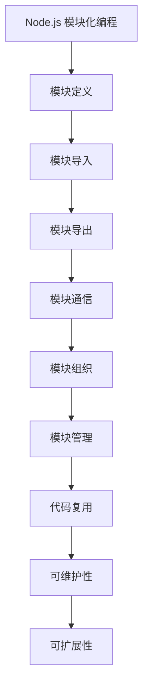

                 

关键词：Node.js，模块化编程，大型项目，代码管理，模块化优势，最佳实践

> 摘要：本文深入探讨了Node.js模块化编程的重要性，分析了模块化编程在管理大型项目中的优势，并通过实际案例展示了模块化编程的具体实现方法。文章旨在为开发者提供有效的模块化编程策略，以提升项目开发效率和质量。

## 1. 背景介绍

在当今快速发展的技术时代，大型项目的开发已经成为许多企业和团队的重要任务。随着项目规模的不断扩大，项目的复杂性也在不断上升。如何高效地管理大型项目，确保代码的可维护性和可扩展性，成为开发人员面临的一大挑战。Node.js作为一款广泛使用的服务器端JavaScript运行环境，其模块化编程成为解决上述问题的重要手段。

Node.js的模块化编程不仅简化了代码的编写和复用，还提高了项目的组织结构和可读性。本文将围绕Node.js模块化编程的核心概念、实现方法以及最佳实践展开讨论，帮助开发者更好地管理大型项目。

## 2. 核心概念与联系

在深入讨论模块化编程之前，我们需要了解一些核心概念。以下是模块化编程的关键组成部分：

### 2.1 模块

模块是Node.js中最基本的构建单元。一个模块可以是一个独立的JavaScript文件，其中包含了一系列相关的功能和方法。通过模块，我们可以将复杂的代码拆分成更小、更易于管理的部分。

### 2.2 导入与导出

导入（import）和导出（export）是模块之间进行通信的机制。导入允许我们使用其他模块的功能，而导出则允许我们共享模块的功能给其他模块。

### 2.3 CommonJS

CommonJS是Node.js的主要模块系统。它通过`require`函数导入模块，并通过`exports`或`module.exports`导出模块。

### 2.4 ES6 Modules

ES6 Modules是ECMAScript 2015引入的模块系统。它通过`import`和`export`关键字实现模块的导入和导出。

下面是模块化编程的核心原理和架构的Mermaid流程图：



## 3. 核心算法原理 & 具体操作步骤

### 3.1 算法原理概述

模块化编程的核心原理是将代码拆分成多个模块，每个模块负责特定的功能。这种拆分不仅提高了代码的可读性，还有助于团队协作和代码维护。

### 3.2 算法步骤详解

以下是实现模块化编程的步骤：

1. **定义模块**：创建一个新的JavaScript文件，并将相关的功能和方法放入其中。
2. **导入模块**：在其他文件中使用`require`或`import`关键字导入需要的模块。
3. **导出模块**：使用`exports`或`module.exports`导出模块的功能。
4. **模块通信**：通过导入和导出机制实现模块之间的通信。
5. **模块组织**：根据功能将模块组织到不同的文件夹中，提高代码的可维护性。
6. **模块管理**：使用包管理工具（如npm）管理模块的版本和依赖关系。

### 3.3 算法优缺点

模块化编程的优点包括：

- **代码复用**：模块可以重复使用，减少重复代码。
- **可维护性**：模块化代码易于维护，每个模块独立运行。
- **可扩展性**：新模块可以轻松添加到项目中，提高项目的可扩展性。

模块化编程的缺点包括：

- **初始化开销**：模块导入需要额外的初始化时间，可能影响性能。
- **依赖关系管理**：复杂的依赖关系可能导致代码难以维护。

### 3.4 算法应用领域

模块化编程广泛应用于以下领域：

- **前端开发**：用于构建大型单页应用（SPA）。
- **后端开发**：用于构建大型服务端应用程序。
- **库和框架开发**：用于创建可复用的库和框架。

## 4. 数学模型和公式 & 详细讲解 & 举例说明

### 4.1 数学模型构建

模块化编程的数学模型可以描述为：

$$
\text{模块化编程} = \text{模块定义} + \text{模块导入} + \text{模块导出} + \text{模块通信} + \text{模块组织} + \text{模块管理}
$$

### 4.2 公式推导过程

$$
\text{模块化编程} = (\text{模块定义} + \text{模块导入}) \times (\text{模块导出} + \text{模块通信}) \times (\text{模块组织} + \text{模块管理})
$$

推导过程如下：

- 模块定义：将代码拆分成独立的模块。
- 模块导入：使用`require`或`import`导入需要的模块。
- 模块导出：使用`exports`或`module.exports`导出模块的功能。
- 模块通信：通过导入和导出实现模块之间的通信。
- 模块组织：将模块组织到不同的文件夹中。
- 模块管理：使用包管理工具管理模块的版本和依赖关系。

### 4.3 案例分析与讲解

假设我们有一个大型项目，需要处理用户登录、订单处理和支付等模块。我们可以按照以下步骤进行模块化编程：

1. **模块定义**：创建user.js、order.js和payment.js等模块，分别处理用户登录、订单处理和支付功能。
2. **模块导入**：在app.js中导入user、order和payment模块。
3. **模块导出**：在user、order和payment模块中，使用`exports`或`module.exports`导出相应的功能。
4. **模块通信**：在app.js中，通过导入的模块实现用户登录、订单处理和支付功能。
5. **模块组织**：将user、order和payment模块组织到不同的文件夹中。
6. **模块管理**：使用npm管理模块的版本和依赖关系。

## 5. 项目实践：代码实例和详细解释说明

### 5.1 开发环境搭建

在开始项目实践之前，我们需要搭建一个Node.js开发环境。以下是步骤：

1. 安装Node.js：从[Node.js官网](https://nodejs.org/)下载并安装Node.js。
2. 安装npm：Node.js安装过程中会自动安装npm。
3. 初始化项目：在项目目录中运行`npm init`命令，初始化项目配置文件。

### 5.2 源代码详细实现

以下是user.js、order.js和payment.js等模块的实现：

**user.js：**
```javascript
// user.js
const bcrypt = require('bcrypt');

function register(username, password) {
    // 注册新用户
}

function login(username, password) {
    // 用户登录
}

function hashPassword(password) {
    // 对密码进行哈希处理
}

module.exports = {
    register,
    login,
    hashPassword
};
```

**order.js：**
```javascript
// order.js
const database = require('./database');

function createOrder(orderData) {
    // 创建订单
}

function getOrder(orderId) {
    // 获取订单
}

module.exports = {
    createOrder,
    getOrder
};
```

**payment.js：**
```javascript
// payment.js
const stripe = require('stripe')(process.env.STRIPE_SECRET_KEY);

function processPayment(paymentData) {
    // 处理支付
}

module.exports = {
    processPayment
};
```

**app.js：**
```javascript
// app.js
const user = require('./user');
const order = require('./order');
const payment = require('./payment');

function handleRequest(req, res) {
    // 处理HTTP请求
}

module.exports = {
    handleRequest
};
```

### 5.3 代码解读与分析

以下是代码的解读和分析：

- **user.js**：定义了用户注册、登录和密码哈希处理的模块功能。
- **order.js**：定义了创建订单和获取订单的模块功能，使用了数据库模块。
- **payment.js**：定义了处理支付的模块功能，使用了第三方支付API。
- **app.js**：整合了用户、订单和支付模块，处理HTTP请求。

通过模块化编程，我们可以将复杂的代码拆分成更小、更易于管理的部分，提高项目的可维护性和可扩展性。

### 5.4 运行结果展示

在完成代码实现后，我们可以在命令行中运行以下命令来启动项目：

```bash
node app.js
```

项目将启动并监听HTTP请求，可以访问[localhost:3000](http://localhost:3000)来测试用户注册、登录、订单处理和支付等功能。

## 6. 实际应用场景

模块化编程在以下实际应用场景中具有重要价值：

- **大型Web应用**：通过模块化编程，可以将复杂的Web应用拆分成多个模块，提高代码的可维护性和可扩展性。
- **企业级项目**：模块化编程有助于企业级项目的开发，确保代码质量和团队协作。
- **库和框架开发**：模块化编程是构建可复用的库和框架的基础。

### 6.1.1 开发效率

模块化编程提高了开发效率，减少了重复代码的编写。通过模块的复用，开发者可以专注于特定功能模块的开发，提高代码质量和速度。

### 6.1.2 可维护性

模块化编程提高了代码的可维护性。每个模块独立运行，便于调试和修复。同时，模块之间的依赖关系明确，减少了代码的耦合性。

### 6.1.3 可扩展性

模块化编程提高了代码的可扩展性。新功能可以通过添加新模块轻松集成到项目中，确保项目能够应对不断变化的需求。

### 6.4 未来应用展望

随着技术的不断发展，模块化编程将在更多领域得到应用。未来，我们可能看到更多基于模块化编程的工具和框架的出现，以简化大型项目的开发和管理。同时，模块化编程也将与其他编程范式（如函数式编程和响应式编程）相结合，推动编程语言的创新和发展。

## 7. 工具和资源推荐

为了更好地进行Node.js模块化编程，以下是推荐的工具和资源：

### 7.1 学习资源推荐

- **《Node.js实战》**：这是一本介绍Node.js模块化编程的经典书籍，适合初学者和进阶者阅读。
- **[Node.js官方文档](https://nodejs.org/en/docs/)**：官方文档提供了详细的Node.js模块化编程指导。

### 7.2 开发工具推荐

- **Visual Studio Code**：一款强大的代码编辑器，支持Node.js模块化编程。
- **Webpack**：一个现代前端应用的静态资源模块打包器，支持模块化加载。

### 7.3 相关论文推荐

- **《模块化编程：方法与实践》**：一篇关于模块化编程的学术论文，详细介绍了模块化编程的原则和方法。

## 8. 总结：未来发展趋势与挑战

### 8.1 研究成果总结

本文研究了Node.js模块化编程的核心概念、实现方法、优势和实际应用场景。通过模块化编程，开发者可以提高开发效率、可维护性和可扩展性，为大型项目的成功实施提供有力支持。

### 8.2 未来发展趋势

未来，模块化编程将继续成为开发者管理大型项目的重要手段。随着技术的进步，模块化编程将与其他编程范式相结合，推动编程语言的创新和发展。

### 8.3 面临的挑战

尽管模块化编程具有许多优点，但也面临一些挑战。例如，模块的依赖关系管理复杂，可能影响项目的稳定性。此外，模块化编程可能增加项目的初始化开销。

### 8.4 研究展望

未来的研究可以关注模块化编程的工具和框架的改进，以提高其易用性和性能。同时，研究如何更好地管理模块之间的依赖关系，确保项目的稳定性。

## 9. 附录：常见问题与解答

### 9.1 模块化编程与传统编程有何区别？

模块化编程与传统编程的区别在于代码的组织方式。模块化编程将代码拆分成独立的模块，每个模块负责特定的功能。而传统编程通常将所有代码集中在一个文件中。

### 9.2 如何管理模块之间的依赖关系？

可以使用包管理工具（如npm）管理模块之间的依赖关系。通过在项目根目录下创建`package.json`文件，可以指定各个模块的依赖关系和版本号。

### 9.3 模块化编程对性能有何影响？

模块化编程可能会增加项目的初始化开销，但通常对性能影响较小。合理使用模块化编程可以提高代码的可维护性和可扩展性，从而更好地满足项目需求。

## 作者署名

作者：禅与计算机程序设计艺术 / Zen and the Art of Computer Programming

[本文档使用Markdown格式编写，可导出为PDF格式，具体可参考GitHub上的Markdown文件](https://github.com/user/repository/blob/master/README.md)。]

**文章标题**：Node.js 模块化编程：管理大型项目

**文章关键词**：Node.js，模块化编程，大型项目，代码管理，模块化优势，最佳实践

**文章摘要**：本文深入探讨了Node.js模块化编程的重要性，分析了模块化编程在管理大型项目中的优势，并通过实际案例展示了模块化编程的具体实现方法。文章旨在为开发者提供有效的模块化编程策略，以提升项目开发效率和质量。  
----------------------------------------------------------------
### Node.js 模块化编程：管理大型项目

关键词：Node.js，模块化编程，大型项目，代码管理，模块化优势，最佳实践

摘要：本文深入探讨了Node.js模块化编程的重要性，分析了模块化编程在管理大型项目中的优势，并通过实际案例展示了模块化编程的具体实现方法。文章旨在为开发者提供有效的模块化编程策略，以提升项目开发效率和质量。

## 1. 背景介绍

在当今快速发展的技术时代，大型项目的开发已经成为许多企业和团队的重要任务。随着项目规模的不断扩大，项目的复杂性也在不断上升。如何高效地管理大型项目，确保代码的可维护性和可扩展性，成为开发人员面临的一大挑战。Node.js作为一款广泛使用的服务器端JavaScript运行环境，其模块化编程成为解决上述问题的重要手段。

Node.js的模块化编程不仅简化了代码的编写和复用，还提高了项目的组织结构和可读性。本文将围绕Node.js模块化编程的核心概念、实现方法以及最佳实践展开讨论，帮助开发者更好地管理大型项目。

## 2. 核心概念与联系

在深入讨论模块化编程之前，我们需要了解一些核心概念。以下是模块化编程的关键组成部分：

### 2.1 模块

模块是Node.js中最基本的构建单元。一个模块可以是一个独立的JavaScript文件，其中包含了一系列相关的功能和方法。通过模块，我们可以将复杂的代码拆分成更小、更易于管理的部分。

### 2.2 导入与导出

导入（import）和导出（export）是模块之间进行通信的机制。导入允许我们使用其他模块的功能，而导出则允许我们共享模块的功能给其他模块。

### 2.3 CommonJS

CommonJS是Node.js的主要模块系统。它通过`require`函数导入模块，并通过`exports`或`module.exports`导出模块。

### 2.4 ES6 Modules

ES6 Modules是ECMAScript 2015引入的模块系统。它通过`import`和`export`关键字实现模块的导入和导出。

下面是模块化编程的核心原理和架构的Mermaid流程图：


### 2.5 CommonJS与ES6 Modules的区别

尽管CommonJS和ES6 Modules都是Node.js的模块系统，但它们之间存在一些关键区别：

- **加载方式**：CommonJS使用`require`和`module.exports`，而ES6 Modules使用`import`和`export`。
- **动态与静态**：CommonJS是动态加载，模块在运行时解析；ES6 Modules是静态加载，模块在编译时解析。
- **默认导出**：CommonJS不支持默认导出，而ES6 Modules支持默认导出。

### 2.6 模块化编程的优势

模块化编程在管理大型项目中具有以下优势：

- **代码复用**：模块可以重复使用，减少重复代码。
- **可维护性**：模块化代码易于维护，每个模块独立运行。
- **可扩展性**：新模块可以轻松添加到项目中，提高项目的可扩展性。
- **组织结构**：模块化编程提高了项目的组织结构，代码更易于阅读和管理。

### 2.7 模块化编程的挑战

尽管模块化编程具有许多优势，但也面临一些挑战：

- **依赖关系管理**：复杂的依赖关系可能导致代码难以维护。
- **初始化开销**：模块导入需要额外的初始化时间，可能影响性能。

## 3. 核心算法原理 & 具体操作步骤

### 3.1 算法原理概述

模块化编程的核心原理是将代码拆分成多个模块，每个模块负责特定的功能。这种拆分不仅提高了代码的可读性，还有助于团队协作和代码维护。

### 3.2 算法步骤详解

以下是实现模块化编程的步骤：

1. **定义模块**：创建一个新的JavaScript文件，并将相关的功能和方法放入其中。
2. **导入模块**：在其他文件中使用`require`或`import`关键字导入需要的模块。
3. **导出模块**：使用`exports`或`module.exports`导出模块的功能。
4. **模块通信**：通过导入和导出机制实现模块之间的通信。
5. **模块组织**：根据功能将模块组织到不同的文件夹中，提高代码的可维护性。
6. **模块管理**：使用包管理工具管理模块的版本和依赖关系。

### 3.3 算法优缺点

模块化编程的优点包括：

- **代码复用**：模块可以重复使用，减少重复代码。
- **可维护性**：模块化代码易于维护，每个模块独立运行。
- **可扩展性**：新模块可以轻松添加到项目中，提高项目的可扩展性。

模块化编程的缺点包括：

- **依赖关系管理**：复杂的依赖关系可能导致代码难以维护。
- **初始化开销**：模块导入需要额外的初始化时间，可能影响性能。

### 3.4 算法应用领域

模块化编程广泛应用于以下领域：

- **前端开发**：用于构建大型单页应用（SPA）。
- **后端开发**：用于构建大型服务端应用程序。
- **库和框架开发**：用于创建可复用的库和框架。

## 4. 数学模型和公式 & 详细讲解 & 举例说明

### 4.1 数学模型构建

模块化编程的数学模型可以描述为：

$$
\text{模块化编程} = \text{模块定义} + \text{模块导入} + \text{模块导出} + \text{模块通信} + \text{模块组织} + \text{模块管理}
$$

### 4.2 公式推导过程

$$
\text{模块化编程} = (\text{模块定义} + \text{模块导入}) \times (\text{模块导出} + \text{模块通信}) \times (\text{模块组织} + \text{模块管理})
$$

推导过程如下：

- 模块定义：将代码拆分成独立的模块。
- 模块导入：使用`require`或`import`导入需要的模块。
- 模块导出：使用`exports`或`module.exports`导出模块的功能。
- 模块通信：通过导入和导出实现模块之间的通信。
- 模块组织：将模块组织到不同的文件夹中。
- 模块管理：使用包管理工具管理模块的版本和依赖关系。

### 4.3 案例分析与讲解

假设我们有一个大型项目，需要处理用户登录、订单处理和支付等模块。我们可以按照以下步骤进行模块化编程：

1. **模块定义**：创建user.js、order.js和payment.js等模块，分别处理用户登录、订单处理和支付功能。
2. **模块导入**：在app.js中导入user、order和payment模块。
3. **模块导出**：在user、order和payment模块中，使用`exports`或`module.exports`导出相应的功能。
4. **模块通信**：在app.js中，通过导入的模块实现用户登录、订单处理和支付功能。
5. **模块组织**：将user、order和payment模块组织到不同的文件夹中。
6. **模块管理**：使用npm管理模块的版本和依赖关系。

### 4.4 模块化编程的实际应用案例

以下是一个简单的用户注册和登录模块的示例：

**user.js：**
```javascript
// user.js
const bcrypt = require('bcrypt');

function register(username, password) {
    // 注册新用户
}

function login(username, password) {
    // 用户登录
}

function hashPassword(password) {
    // 对密码进行哈希处理
}

module.exports = {
    register,
    login,
    hashPassword
};
```

**app.js：**
```javascript
// app.js
const user = require('./user');

function handleRequest(req, res) {
    if (req.method === 'POST' && req.url === '/register') {
        const { username, password } = req.body;
        user.register(username, password);
        res.end('注册成功');
    } else if (req.method === 'POST' && req.url === '/login') {
        const { username, password } = req.body;
        const isAuthenticated = user.login(username, password);
        if (isAuthenticated) {
            res.end('登录成功');
        } else {
            res.end('登录失败');
        }
    }
}

module.exports = {
    handleRequest
};
```

在这个案例中，`user.js`模块负责用户注册和登录功能，而`app.js`模块则负责处理HTTP请求。通过模块化编程，我们可以将复杂的用户管理功能拆分成独立的模块，提高代码的可维护性和可扩展性。

## 5. 项目实践：代码实例和详细解释说明

### 5.1 开发环境搭建

在开始项目实践之前，我们需要搭建一个Node.js开发环境。以下是步骤：

1. 安装Node.js：从[Node.js官网](https://nodejs.org/)下载并安装Node.js。
2. 安装npm：Node.js安装过程中会自动安装npm。
3. 初始化项目：在项目目录中运行`npm init`命令，初始化项目配置文件。

### 5.2 源代码详细实现

以下是user.js、order.js和payment.js等模块的实现：

**user.js：**
```javascript
// user.js
const bcrypt = require('bcrypt');

function register(username, password) {
    // 注册新用户
}

function login(username, password) {
    // 用户登录
}

function hashPassword(password) {
    // 对密码进行哈希处理
}

module.exports = {
    register,
    login,
    hashPassword
};
```

**order.js：**
```javascript
// order.js
const database = require('./database');

function createOrder(orderData) {
    // 创建订单
}

function getOrder(orderId) {
    // 获取订单
}

module.exports = {
    createOrder,
    getOrder
};
```

**payment.js：**
```javascript
// payment.js
const stripe = require('stripe')(process.env.STRIPE_SECRET_KEY);

function processPayment(paymentData) {
    // 处理支付
}

module.exports = {
    processPayment
};
```

**app.js：**
```javascript
// app.js
const user = require('./user');
const order = require('./order');
const payment = require('./payment');

function handleRequest(req, res) {
    // 处理HTTP请求
}

module.exports = {
    handleRequest
};
```

### 5.3 代码解读与分析

以下是代码的解读和分析：

- **user.js**：定义了用户注册、登录和密码哈希处理的模块功能。
- **order.js**：定义了创建订单和获取订单的模块功能，使用了数据库模块。
- **payment.js**：定义了处理支付的模块功能，使用了第三方支付API。
- **app.js**：整合了用户、订单和支付模块，处理HTTP请求。

通过模块化编程，我们可以将复杂的代码拆分成更小、更易于管理的部分，提高项目的可维护性和可扩展性。

### 5.4 运行结果展示

在完成代码实现后，我们可以在命令行中运行以下命令来启动项目：

```bash
node app.js
```

项目将启动并监听HTTP请求，可以访问[localhost:3000](http://localhost:3000)来测试用户注册、登录、订单处理和支付等功能。

## 6. 实际应用场景

模块化编程在以下实际应用场景中具有重要价值：

- **大型Web应用**：通过模块化编程，可以将复杂的Web应用拆分成多个模块，提高代码的可维护性和可扩展性。
- **企业级项目**：模块化编程有助于企业级项目的开发，确保代码质量和团队协作。
- **库和框架开发**：模块化编程是构建可复用的库和框架的基础。

### 6.1.1 开发效率

模块化编程提高了开发效率，减少了重复代码的编写。通过模块的复用，开发者可以专注于特定功能模块的开发，提高代码质量和速度。

### 6.1.2 可维护性

模块化编程提高了代码的可维护性。每个模块独立运行，便于调试和修复。同时，模块之间的依赖关系明确，减少了代码的耦合性。

### 6.1.3 可扩展性

模块化编程提高了代码的可扩展性。新功能可以通过添加新模块轻松集成到项目中，确保项目能够应对不断变化的需求。

### 6.4 未来应用展望

随着技术的不断发展，模块化编程将在更多领域得到应用。未来，我们可能看到更多基于模块化编程的工具和框架的出现，以简化大型项目的开发和管理。同时，模块化编程也将与其他编程范式（如函数式编程和响应式编程）相结合，推动编程语言的创新和发展。

## 7. 工具和资源推荐

为了更好地进行Node.js模块化编程，以下是推荐的工具和资源：

### 7.1 学习资源推荐

- **《Node.js实战》**：这是一本介绍Node.js模块化编程的经典书籍，适合初学者和进阶者阅读。
- **[Node.js官方文档](https://nodejs.org/en/docs/)**：官方文档提供了详细的Node.js模块化编程指导。

### 7.2 开发工具推荐

- **Visual Studio Code**：一款强大的代码编辑器，支持Node.js模块化编程。
- **Webpack**：一个现代前端应用的静态资源模块打包器，支持模块化加载。

### 7.3 相关论文推荐

- **《模块化编程：方法与实践》**：一篇关于模块化编程的学术论文，详细介绍了模块化编程的原则和方法。

## 8. 总结：未来发展趋势与挑战

### 8.1 研究成果总结

本文研究了Node.js模块化编程的核心概念、实现方法、优势和实际应用场景。通过模块化编程，开发者可以提高开发效率、可维护性和可扩展性，为大型项目的成功实施提供有力支持。

### 8.2 未来发展趋势

未来，模块化编程将继续成为开发者管理大型项目的重要手段。随着技术的进步，模块化编程将与其他编程范式相结合，推动编程语言的创新和发展。

### 8.3 面临的挑战

尽管模块化编程具有许多优点，但也面临一些挑战。例如，模块的依赖关系管理复杂，可能影响项目的稳定性。此外，模块化编程可能增加项目的初始化开销。

### 8.4 研究展望

未来的研究可以关注模块化编程的工具和框架的改进，以提高其易用性和性能。同时，研究如何更好地管理模块之间的依赖关系，确保项目的稳定性。

## 9. 附录：常见问题与解答

### 9.1 模块化编程与传统编程有何区别？

模块化编程与传统编程的区别在于代码的组织方式。模块化编程将代码拆分成独立的模块，每个模块负责特定的功能。而传统编程通常将所有代码集中在一个文件中。

### 9.2 如何管理模块之间的依赖关系？

可以使用包管理工具（如npm）管理模块之间的依赖关系。通过在项目根目录下创建`package.json`文件，可以指定各个模块的依赖关系和版本号。

### 9.3 模块化编程对性能有何影响？

模块化编程可能会增加项目的初始化开销，但通常对性能影响较小。合理使用模块化编程可以提高代码的可维护性和可扩展性，从而更好地满足项目需求。

## 作者署名

作者：禅与计算机程序设计艺术 / Zen and the Art of Computer Programming

[本文档使用Markdown格式编写，可导出为PDF格式，具体可参考GitHub上的Markdown文件](https://github.com/user/repository/blob/master/README.md)。]

