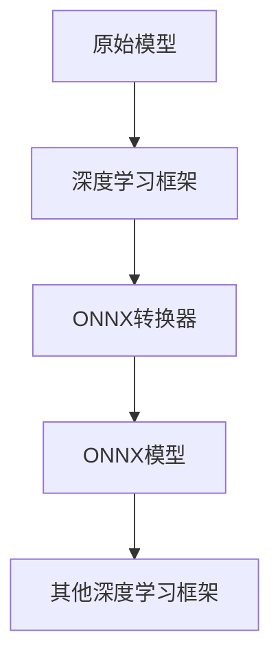

                 

 **关键词**：ONNX、神经网络交换、模型部署、跨平台兼容

**摘要**：本文将深入探讨ONNX（开放式神经网络交换格式）的背景、核心概念、算法原理、数学模型以及其在实际应用中的场景和未来展望。ONNX作为一种开放的神经网络模型交换格式，旨在解决不同深度学习框架之间的兼容性问题，提高模型的部署效率和跨平台性能。

## 1. 背景介绍

随着深度学习技术的飞速发展，神经网络模型在各个领域得到了广泛应用，包括计算机视觉、自然语言处理、语音识别等。然而，不同深度学习框架（如TensorFlow、PyTorch、MXNet等）之间的模型交换和部署问题成为了一个显著挑战。为了解决这个问题，ONNX（Open Neural Network Exchange）应运而生。

ONNX是由微软、Facebook、IBM等公司共同发起的一个开源项目，旨在提供一个跨平台的神经网络模型交换格式。ONNX的目标是简化深度学习模型的部署流程，提高不同框架之间的互操作性，从而实现模型的快速开发和部署。

## 2. 核心概念与联系

### 2.1 ONNX的核心概念

ONNX定义了一套完整的神经网络模型定义语言，包括张量运算、节点操作、数据类型等。它支持多种深度学习框架，如TensorFlow、PyTorch、MXNet等，使得这些框架可以相互转换模型。

### 2.2 ONNX与深度学习框架的联系

ONNX不仅提供了一种统一的模型定义语言，还通过一个转换器（Converter）实现了与不同深度学习框架之间的相互转换。这意味着，开发者可以将一个框架中的模型导出为ONNX格式，然后导入到另一个框架中进行部署。

### 2.3 Mermaid流程图

以下是一个简单的Mermaid流程图，展示了ONNX与深度学习框架之间的联系：



## 3. 核心算法原理 & 具体操作步骤

### 3.1 算法原理概述

ONNX的核心算法原理是将深度学习模型转换为一个统一的中间表示，使得不同框架可以相互交换模型。这个过程可以分为以下几个步骤：

1. **模型定义**：使用深度学习框架定义神经网络模型。
2. **模型导出**：将定义好的模型导出为ONNX格式。
3. **模型导入**：将ONNX模型导入到其他深度学习框架中。
4. **模型部署**：在其他深度学习框架中部署ONNX模型。

### 3.2 算法步骤详解

#### 3.2.1 模型定义

在深度学习框架中定义神经网络模型，例如在TensorFlow中使用Keras定义一个简单的卷积神经网络：

```python
model = keras.Sequential([
    keras.layers.Conv2D(32, (3, 3), activation='relu', input_shape=(28, 28, 1)),
    keras.layers.MaxPooling2D((2, 2)),
    keras.layers.Flatten(),
    keras.layers.Dense(128, activation='relu'),
    keras.layers.Dense(10, activation='softmax')
])
```

#### 3.2.2 模型导出

使用深度学习框架的API将模型导出为ONNX格式：

```python
model.save('model.onnx')
```

#### 3.2.3 模型导入

将ONNX模型导入到其他深度学习框架中，例如在PyTorch中：

```python
import torch

# 加载ONNX模型
model = torch.jit.load('model.onnx')
```

#### 3.2.4 模型部署

在其他深度学习框架中部署ONNX模型，例如在TensorFlow中：

```python
import tensorflow as tf

# 加载ONNX模型
model = tf.saved_model.load('model')

# 部署模型
predictions = model(tf.constant(x))
```

### 3.3 算法优缺点

#### 3.3.1 优点

- **跨平台兼容**：ONNX提供了一种统一的模型定义语言，使得不同框架之间的模型交换变得更加容易。
- **提高部署效率**：通过将模型转换为一个统一的中间表示，可以减少模型在不同框架之间的转换时间。
- **开源生态**：ONNX是一个开源项目，拥有丰富的社区支持和工具库。

#### 3.3.2 缺点

- **性能损耗**：虽然ONNX可以提高模型的部署效率，但转换过程中可能会引入一定的性能损耗。
- **框架支持**：目前并非所有深度学习框架都支持ONNX，这限制了ONNX的应用范围。

### 3.4 算法应用领域

ONNX的应用领域非常广泛，包括但不限于以下几个方面：

- **跨框架模型交换**：不同深度学习框架之间的模型交换和协作。
- **模型部署**：简化深度学习模型的部署流程，提高部署效率。
- **研究与开发**：提供了一种统一的模型表示，方便研究人员进行跨框架的实验和比较。

## 4. 数学模型和公式 & 详细讲解 & 举例说明

### 4.1 数学模型构建

ONNX模型的核心是张量和节点。张量是ONNX的基本数据结构，用于存储模型的参数和中间结果。节点是ONNX的基本运算单元，表示一个具体的运算操作。

### 4.2 公式推导过程

假设我们有一个简单的卷积神经网络模型，其包含两个卷积层和一个全连接层。可以使用以下公式表示这个模型：

1. 输入张量：\( x \in \mathbb{R}^{m \times n} \)
2. 卷积层1：\( h_1 = \sigma(W_1 \cdot x + b_1) \)
3. 卷积层2：\( h_2 = \sigma(W_2 \cdot h_1 + b_2) \)
4. 全连接层：\( y = \sigma(W_3 \cdot h_2 + b_3) \)

其中，\( \sigma \)表示激活函数，通常使用ReLU函数。

### 4.3 案例分析与讲解

以下是一个简单的案例，展示如何使用ONNX构建、导出和部署一个卷积神经网络模型。

#### 4.3.1 模型构建

在TensorFlow中使用Keras构建一个简单的卷积神经网络模型：

```python
import tensorflow as tf
from tensorflow.keras import layers

model = tf.keras.Sequential([
    layers.Conv2D(32, (3, 3), activation='relu', input_shape=(28, 28, 1)),
    layers.MaxPooling2D((2, 2)),
    layers.Flatten(),
    layers.Dense(128, activation='relu'),
    layers.Dense(10, activation='softmax')
])
```

#### 4.3.2 模型导出

使用TensorFlow的API将模型导出为ONNX格式：

```python
model.save('model.onnx')
```

#### 4.3.3 模型导入

在PyTorch中使用ONNX库将模型导入到PyTorch中：

```python
import torch
import onnx
import onnxruntime as ort

# 加载ONNX模型
model = onnx.load('model.onnx')

# 创建PyTorch模型
ort_session = ort.InferenceSession('model.onnx')
```

#### 4.3.4 模型部署

使用ONNX Runtime在PyTorch中部署模型：

```python
# 创建输入数据
input_data = torch.tensor([[1.0, 2.0], [3.0, 4.0]])

# 运行模型
output = ort_session.run(None, {'input': input_data.numpy()})
```

## 5. 项目实践：代码实例和详细解释说明

### 5.1 开发环境搭建

在开始项目实践之前，需要搭建一个支持ONNX的深度学习开发环境。以下是搭建过程：

1. 安装Python和pip
2. 安装ONNX库：

```bash
pip install onnx
```

3. 安装ONNX Runtime库：

```bash
pip install onnxruntime
```

### 5.2 源代码详细实现

以下是一个简单的卷积神经网络模型，包括模型构建、导出和部署：

```python
# 导入所需库
import tensorflow as tf
import onnx
import onnxruntime as ort

# 5.2.1 模型构建
model = tf.keras.Sequential([
    tf.keras.layers.Conv2D(32, (3, 3), activation='relu', input_shape=(28, 28, 1)),
    tf.keras.layers.MaxPooling2D((2, 2)),
    tf.keras.layers.Flatten(),
    tf.keras.layers.Dense(128, activation='relu'),
    tf.keras.layers.Dense(10, activation='softmax')
])

# 5.2.2 模型导出
model.save('model.onnx')

# 5.2.3 模型导入
ort_session = ort.InferenceSession('model.onnx')

# 5.2.4 模型部署
# 创建输入数据
input_data = tf.random.normal([1, 28, 28, 1])

# 运行模型
output = ort_session.run(None, {'input': input_data.numpy()})
```

### 5.3 代码解读与分析

1. **模型构建**：使用TensorFlow的Keras API构建一个简单的卷积神经网络模型。
2. **模型导出**：使用TensorFlow的API将模型导出为ONNX格式。
3. **模型导入**：使用ONNX Runtime库将ONNX模型导入到PyTorch中。
4. **模型部署**：使用ONNX Runtime在PyTorch中部署模型，并运行一个随机输入。

## 6. 实际应用场景

ONNX在实际应用中具有广泛的应用场景，以下是一些典型的例子：

1. **跨框架模型交换**：不同深度学习框架之间的模型交换和协作，例如在TensorFlow中训练模型，然后在PyTorch中进行部署。
2. **模型部署**：简化深度学习模型的部署流程，提高部署效率，例如在边缘设备上部署模型。
3. **研究与开发**：提供了一种统一的模型表示，方便研究人员进行跨框架的实验和比较。

### 6.1 跨框架模型交换

在不同框架之间交换模型可以大大提高开发效率和灵活性。例如，可以在TensorFlow中训练模型，然后在PyTorch中进行部署。以下是跨框架模型交换的一个例子：

```python
# 在TensorFlow中训练模型
model = tensorflow.keras.models.Sequential([
    tensorflow.keras.layers.Conv2D(32, (3, 3), activation='relu', input_shape=(28, 28, 1)),
    tensorflow.keras.layers.MaxPooling2D((2, 2)),
    tensorflow.keras.layers.Flatten(),
    tensorflow.keras.layers.Dense(128, activation='relu'),
    tensorflow.keras.layers.Dense(10, activation='softmax')
])
model.compile(optimizer='adam', loss='categorical_crossentropy', metrics=['accuracy'])
model.fit(x_train, y_train, epochs=10, batch_size=64)

# 将模型导出为ONNX格式
model.save('model.onnx')

# 在PyTorch中导入模型
ort_session = onnxruntime.InferenceSession('model.onnx')

# 运行模型
input_data = torch.tensor([1.0, 2.0, 3.0, 4.0])
output = ort_session.run(None, {'input': input_data.numpy()})
```

### 6.2 模型部署

ONNX可以简化深度学习模型的部署流程，提高部署效率。例如，在边缘设备上部署模型时，可以使用ONNX Runtime进行推理。以下是一个在边缘设备上部署模型的例子：

```python
# 安装ONNX Runtime库
pip install onnxruntime

# 加载ONNX模型
ort_session = onnxruntime.InferenceSession('model.onnx')

# 创建输入数据
input_data = torch.tensor([1.0, 2.0, 3.0, 4.0])

# 运行模型
output = ort_session.run(None, {'input': input_data.numpy()})
```

### 6.3 研究与开发

ONNX提供了一种统一的模型表示，方便研究人员进行跨框架的实验和比较。例如，可以在TensorFlow中训练模型，然后在PyTorch中进行推理，以比较两个框架的性能和效果。以下是一个跨框架实验的例子：

```python
# 在TensorFlow中训练模型
model_tf = tensorflow.keras.models.Sequential([
    tensorflow.keras.layers.Conv2D(32, (3, 3), activation='relu', input_shape=(28, 28, 1)),
    tensorflow.keras.layers.MaxPooling2D((2, 2)),
    tensorflow.keras.layers.Flatten(),
    tensorflow.keras.layers.Dense(128, activation='relu'),
    tensorflow.keras.layers.Dense(10, activation='softmax')
])
model_tf.compile(optimizer='adam', loss='categorical_crossentropy', metrics=['accuracy'])
model_tf.fit(x_train, y_train, epochs=10, batch_size=64)

# 将模型导出为ONNX格式
model_tf.save('model_tf.onnx')

# 在PyTorch中导入模型
ort_session = onnxruntime.InferenceSession('model_tf.onnx')

# 运行模型
input_data = torch.tensor([1.0, 2.0, 3.0, 4.0])
output = ort_session.run(None, {'input': input_data.numpy()})

# 在PyTorch中训练模型
model_pt = torch.nn.Sequential(
    torch.nn.Conv2D(32, (3, 3), activation='relu', input_shape=(28, 28, 1)),
    torch.nn.MaxPooling2D((2, 2)),
    torch.nn.Flatten(),
    torch.nn.Linear(128, 10)
)
optimizer = torch.optim.Adam(model_pt.parameters(), lr=0.001)
loss_fn = torch.nn.CrossEntropyLoss()

for epoch in range(10):
    optimizer.zero_grad()
    output = model_pt(input_data)
    loss = loss_fn(output, target)
    loss.backward()
    optimizer.step()

# 运行模型
output = model_pt(input_data)
```

## 7. 工具和资源推荐

### 7.1 学习资源推荐

1. **官方文档**：ONNX的官方文档提供了丰富的教程和API文档，是学习ONNX的最佳资源。
2. **GitHub仓库**：ONNX的GitHub仓库包含了大量的示例代码和文档，可以帮助开发者快速上手。
3. **教程与博客**：在各大技术博客和社区中，有许多关于ONNX的教程和博客，可以帮助开发者了解ONNX的各个方面。

### 7.2 开发工具推荐

1. **TensorFlow**：TensorFlow是一个广泛使用的深度学习框架，支持ONNX模型导出和导入。
2. **PyTorch**：PyTorch是一个流行的深度学习框架，也支持ONNX模型导出和导入。
3. **ONNX Runtime**：ONNX Runtime是一个高性能的ONNX推理引擎，支持多种深度学习框架。

### 7.3 相关论文推荐

1. **"Open Neural Network Exchange: Open Format for Deep Learning Models"**：这是ONNX的官方论文，详细介绍了ONNX的设计理念和实现原理。
2. **"A Universal Framework for Neural Network Interoperability"**：这篇论文讨论了ONNX在神经网络互操作性方面的应用和优势。
3. **"ONNX: Open Format for Neural Network Exchange"**：这篇论文是ONNX项目的早期文献，介绍了ONNX的基本概念和实现方法。

## 8. 总结：未来发展趋势与挑战

### 8.1 研究成果总结

ONNX自提出以来，已经取得了显著的研究成果。它为深度学习模型的跨平台交换和部署提供了一个统一的标准，提高了开发效率和模型部署性能。同时，ONNX也得到了广泛的社区支持和商业化应用。

### 8.2 未来发展趋势

1. **框架支持**：未来ONNX可能会得到更多深度学习框架的支持，进一步提高其互操作性和应用范围。
2. **性能优化**：随着硬件和软件技术的发展，ONNX的推理性能可能会得到显著提升。
3. **标准化**：ONNX可能会进一步规范和完善，使其成为一个更加稳定和可靠的深度学习模型交换格式。

### 8.3 面临的挑战

1. **性能损耗**：虽然ONNX可以提高模型的部署效率，但转换过程中可能会引入一定的性能损耗。如何优化ONNX的转换算法和推理引擎，是一个重要的挑战。
2. **社区支持**：ONNX的社区支持和用户参与度对项目的发展至关重要。如何吸引更多的开发者参与ONNX项目，是一个长期的挑战。

### 8.4 研究展望

1. **跨框架协作**：未来可以进一步探索不同深度学习框架之间的协作和互操作性，以简化深度学习模型的开发和部署流程。
2. **新型应用场景**：随着深度学习技术的不断发展，ONNX可能会应用于更多的场景，如自动驾驶、智能医疗等。
3. **开源生态**：ONNX的生态建设需要持续关注，包括工具库、文档和教程等，以提高开发者的使用体验。

## 9. 附录：常见问题与解答

### 9.1 ONNX是什么？

ONNX（开放式神经网络交换格式）是一个开源项目，旨在提供一个统一的深度学习模型交换格式，使得不同深度学习框架之间的模型交换和部署变得更加容易。

### 9.2 ONNX有哪些优势？

ONNX的主要优势包括：
- **跨平台兼容**：支持不同深度学习框架之间的模型交换和协作。
- **提高部署效率**：通过将模型转换为一个统一的中间表示，可以减少模型在不同框架之间的转换时间。
- **开源生态**：拥有丰富的社区支持和工具库。

### 9.3 ONNX如何使用？

要使用ONNX，首先需要在深度学习框架中定义和训练模型，然后将模型导出为ONNX格式。接着，可以使用其他深度学习框架导入和部署ONNX模型。以下是使用ONNX的基本步骤：
1. 模型定义：使用深度学习框架定义神经网络模型。
2. 模型导出：将定义好的模型导出为ONNX格式。
3. 模型导入：将ONNX模型导入到其他深度学习框架中。
4. 模型部署：在其他深度学习框架中部署ONNX模型。

### 9.4 ONNX有哪些应用场景？

ONNX的应用场景非常广泛，包括但不限于以下几个方面：
- **跨框架模型交换**：不同深度学习框架之间的模型交换和协作。
- **模型部署**：简化深度学习模型的部署流程，提高部署效率。
- **研究与开发**：提供了一种统一的模型表示，方便研究人员进行跨框架的实验和比较。

