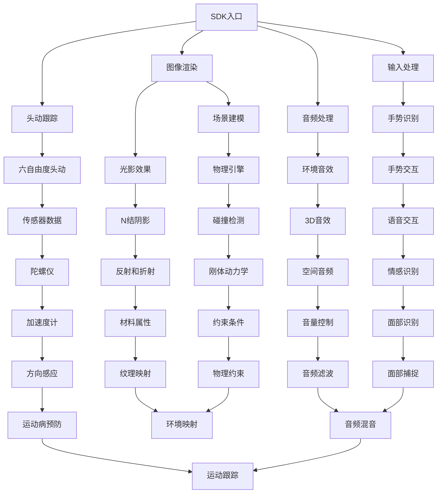

                 

关键词：虚拟现实，Oculus Rift，软件开发工具包，SDK，VR开发

摘要：本文旨在深入探讨Oculus Rift SDK在虚拟现实开发中的应用。我们将从背景介绍开始，逐步深入核心概念与联系，详细讲解核心算法原理与操作步骤，展示数学模型与公式，并通过实际项目实践展示代码实例。文章还将探讨实际应用场景，推荐相关工具和资源，并总结未来发展趋势与挑战。

## 1. 背景介绍

虚拟现实（Virtual Reality，VR）技术近年来迅速发展，为游戏、娱乐、教育、医疗等多个领域带来了变革。Oculus Rift作为领先的VR头戴设备，提供了沉浸式的用户体验，吸引了众多开发者的关注。为了简化VR应用的开发过程，Oculus公司推出了Oculus Rift SDK，为开发者提供了丰富的功能和支持。

Oculus Rift SDK是一款全面的软件开发工具包（Software Development Kit），旨在帮助开发者快速搭建和部署VR应用。它提供了大量的API、工具和示例代码，涵盖了从基本的头动跟踪到复杂的交互体验等各个方面。通过Oculus Rift SDK，开发者可以充分利用Oculus Rift设备的硬件性能和功能，创造出引人入胜的VR体验。

## 2. 核心概念与联系

为了更好地理解Oculus Rift SDK的核心概念和架构，我们可以通过Mermaid流程图来展示其关键组成部分和相互关系。



### 2.1. 头动跟踪

头动跟踪是VR开发的核心之一，它使得用户能够通过头部运动来观察三维场景的变化。Oculus Rift SDK提供了六自由度（6DOF）的头动跟踪功能，通过陀螺仪和加速度计等传感器来捕捉用户的头部位置和角度。这种高精度的头动跟踪能够为用户提供平滑且沉浸的体验。

### 2.2. 图像渲染

图像渲染是VR应用的视觉核心。Oculus Rift SDK利用高性能的图形处理单元（GPU）来生成高质量的三维图像。通过场景建模、光影效果和N结阴影等技术，渲染引擎能够创造出逼真的虚拟环境。开发者可以利用SDK提供的工具来调整渲染设置，以满足不同应用的需求。

### 2.3. 输入处理

输入处理是VR交互的关键部分。Oculus Rift SDK支持多种输入设备，包括手柄、手势和语音交互等。通过手势识别和语音识别技术，用户可以与虚拟环境进行自然交互。输入处理模块不仅能够处理用户的动作和指令，还能够根据用户的行为来调整虚拟场景的响应。

### 2.4. 音频处理

音频处理在VR体验中同样至关重要。Oculus Rift SDK提供了丰富的音频功能，包括3D音效、环境音效和空间音频等。通过精确的音频渲染技术，用户能够感受到虚拟环境中的声源位置和变化，进一步增强了沉浸感。

## 3. 核心算法原理 & 具体操作步骤

### 3.1. 算法原理概述

Oculus Rift SDK的核心算法主要涉及头动跟踪、图像渲染、输入处理和音频处理等方面。这些算法基于传感器数据和渲染引擎，实现了高精度、高效率的VR体验。

### 3.2. 算法步骤详解

#### 3.2.1. 头动跟踪

头动跟踪算法主要包括以下步骤：

1. **传感器数据采集**：通过陀螺仪和加速度计等传感器采集用户的头部位置和角度数据。
2. **滤波与融合**：使用卡尔曼滤波等算法对传感器数据滤波，以提高数据的稳定性和准确性。
3. **姿态计算**：利用传感器数据和滤波结果计算用户的头部姿态。
4. **头动反馈**：根据用户的头部姿态调整虚拟场景的视角。

#### 3.2.2. 图像渲染

图像渲染算法主要包括以下步骤：

1. **场景建模**：使用三维建模工具构建虚拟场景。
2. **光影效果**：应用光影算法，包括光照模型和阴影算法，以实现逼真的光影效果。
3. **渲染管线**：利用GPU渲染管线生成三维图像。
4. **后处理**：进行图像后处理，如抗锯齿、色彩校正等，以提高图像质量。

#### 3.2.3. 输入处理

输入处理算法主要包括以下步骤：

1. **手势识别**：使用机器学习和计算机视觉技术识别用户的手势。
2. **语音识别**：利用语音识别技术处理用户的语音指令。
3. **交互反馈**：根据用户的输入调整虚拟场景的响应，如动作反馈和声音提示等。

#### 3.2.4. 音频处理

音频处理算法主要包括以下步骤：

1. **音频捕捉**：捕捉虚拟环境中的声源数据。
2. **音频渲染**：使用3D音效算法渲染声源位置和变化。
3. **音频输出**：将渲染后的音频数据输出到耳机，实现立体声效。

### 3.3. 算法优缺点

#### 优点：

- **高精度**：Oculus Rift SDK提供了高精度的传感器和数据滤波算法，确保了头动跟踪和输入处理的准确性。
- **易用性**：SDK提供了丰富的API和示例代码，降低了VR开发的难度。
- **多样性**：SDK支持多种输入设备和音频处理技术，为开发者提供了多样化的选择。

#### 缺点：

- **性能要求**：VR应用对硬件性能要求较高，需要高性能的GPU和CPU来支持。
- **学习成本**：对于初学者来说，学习Oculus Rift SDK和VR开发的相关技术需要一定的时间和精力。

### 3.4. 算法应用领域

Oculus Rift SDK在多个领域都有广泛的应用：

- **游戏开发**：VR游戏成为近年来最受欢迎的VR应用之一，Oculus Rift SDK为开发者提供了丰富的工具和资源，促进了VR游戏的发展。
- **教育培训**：VR技术在教育培训领域的应用日益广泛，Oculus Rift SDK可以帮助教育工作者创建互动性强的虚拟教学环境。
- **医疗康复**：VR技术在医疗康复中的应用也逐渐成熟，Oculus Rift SDK为医生和康复师提供了有效的康复工具。

## 4. 数学模型和公式 & 详细讲解 & 举例说明

### 4.1. 数学模型构建

在Oculus Rift SDK中，数学模型主要用于头动跟踪和图像渲染。以下是两个关键的数学模型：

#### 4.1.1. 头动跟踪模型

头动跟踪模型利用传感器数据计算用户的头部姿态。假设用户头部在三维空间中的位置和方向可以用一个四元数（Quaternion）表示，则头动跟踪模型可以表示为：

$$
T = q \cdot p \cdot q^{-1}
$$

其中，$T$ 是新的头部姿态，$q$ 是当前头部姿态的四元数，$p$ 是传感器数据（包括陀螺仪和加速度计的数据）。

#### 4.1.2. 图像渲染模型

图像渲染模型用于生成三维图像。该模型基于视图矩阵（View Matrix）和投影矩阵（Projection Matrix）的变换。假设虚拟场景中的物体位置和方向可以用四元数表示，则图像渲染模型可以表示为：

$$
C' = P \cdot V \cdot C
$$

其中，$C'$ 是渲染后的图像，$P$ 是投影矩阵，$V$ 是视图矩阵，$C$ 是物体在虚拟场景中的位置和方向。

### 4.2. 公式推导过程

#### 4.2.1. 头动跟踪公式推导

头动跟踪公式是基于传感器数据和卡尔曼滤波推导得到的。假设传感器数据包含噪声，则可以使用卡尔曼滤波来估计真实的头部姿态。具体推导过程如下：

1. **状态方程**：

$$
x_t = q_t \cdot p_t
$$

其中，$x_t$ 是第 $t$ 次的头部姿态，$q_t$ 是第 $t$ 次的头部姿态四元数，$p_t$ 是第 $t$ 次的传感器数据。

2. **观测方程**：

$$
z_t = f(x_t)
$$

其中，$z_t$ 是第 $t$ 次的观测数据，$f(x_t)$ 是将头部姿态转换为观测数据（如头部位置和方向）的函数。

3. **卡尔曼滤波公式**：

$$
q_t = q_{t-1} + K_t \cdot (z_t - f(q_{t-1}))
$$

$$
p_t = p_{t-1} + K_t \cdot (z_t - f(q_{t-1})) \cdot q_t^{-1}
$$

其中，$K_t$ 是卡尔曼滤波增益，用于平衡传感器数据和观测数据。

#### 4.2.2. 图像渲染公式推导

图像渲染公式是基于三维空间中的投影变换推导得到的。具体推导过程如下：

1. **投影变换**：

$$
C' = P \cdot V \cdot C
$$

其中，$C'$ 是渲染后的图像，$P$ 是投影矩阵，$V$ 是视图矩阵，$C$ 是物体在虚拟场景中的位置和方向。

2. **视图矩阵**：

$$
V = \begin{bmatrix}
R & -R \cdot t \\
0 & 1
\end{bmatrix}
$$

其中，$R$ 是旋转矩阵，$t$ 是物体的位置向量。

3. **投影矩阵**：

$$
P = \begin{bmatrix}
I & 0 & -f \\
0 & I & -h \\
0 & 0 & \frac{1}{n}
\end{bmatrix}
$$

其中，$I$ 是单位矩阵，$f$ 是焦距，$h$ 是画面中心到画面的垂直距离，$n$ 是画面到物体的距离。

### 4.3. 案例分析与讲解

#### 4.3.1. 头动跟踪案例

假设用户在VR游戏中移动头部，传感器数据为 $p_t = (0.1, 0.2, 0.3)$。已知初始头部姿态为 $q_{t-1} = (1, 0, 0, 0)$。使用卡尔曼滤波计算第 $t$ 次的头部姿态。

1. **传感器数据滤波**：

$$
p_{t-filt} = K_t \cdot (p_t - f(q_{t-1}))
$$

2. **姿态计算**：

$$
q_t = q_{t-1} + K_t \cdot (p_{t-filt} \cdot q_{t-1}^{-1})
$$

3. **姿态转换**：

$$
T = q_t \cdot p_t \cdot q_t^{-1}
$$

#### 4.3.2. 图像渲染案例

假设虚拟场景中的物体位置和方向为 $C = (1, 2, 3)$，视图矩阵为 $V = \begin{bmatrix} 1 & 0 & 0 & 0 \\ 0 & 1 & 0 & 0 \\ 0 & 0 & 1 & 0 \\ 0 & 0 & 0 & 1 \end{bmatrix}$，投影矩阵为 $P = \begin{bmatrix} 1 & 0 & 0 & 0 \\ 0 & 1 & 0 & 0 \\ 0 & 0 & \frac{1}{10} & 0 \\ 0 & 0 & 0 & 1 \end{bmatrix}$。计算渲染后的图像位置。

$$
C' = P \cdot V \cdot C
$$

## 5. 项目实践：代码实例和详细解释说明

在本节中，我们将通过一个简单的VR项目实例，展示如何使用Oculus Rift SDK进行开发，并详细解释关键代码和步骤。

### 5.1. 开发环境搭建

要使用Oculus Rift SDK进行开发，首先需要在计算机上安装以下软件：

- **Oculus Rift SDK**：从官方网站下载并安装。
- **Unity**：一款流行的游戏开发引擎，Oculus Rift SDK支持与Unity集成。
- **Visual Studio**：用于编写和调试C#代码。

### 5.2. 源代码详细实现

我们使用Unity引擎来创建一个简单的VR项目，实现一个用户可以四处走动并观察虚拟环境的场景。以下是关键代码和解释：

#### 5.2.1. Unity项目设置

1. **创建Unity项目**：

打开Unity编辑器，创建一个新的2D项目。在菜单栏中选择 "File" > "New Project"，选择 "2D" 项目模板，然后选择合适的目录创建项目。

2. **导入Oculus Rift SDK插件**：

在Unity编辑器中，打开 "Assets" 资源管理器，然后选择 "Window" > "Package Manager"。在 "Package Manager" 窗口中，搜索 "Oculus SDK"，并导入到项目中。

#### 5.2.2. 创建虚拟环境

1. **创建场景**：

在Unity编辑器中，选择 "Scene" > "Create Empty"。右键点击新创建的空对象，选择 "Create Empty"，重复此操作创建一个 "Player" 对象和一个 "Camera" 对象。

2. **设置Camera**：

将 "Camera" 对象拖放到 "Player" 对象下。在 "Camera" 组件中，启用 "Steady Capture" 和 "Crosshair"。在 "Field of View" 中设置一个合适的视角。

3. **创建地面**：

在 "Assets" 资源管理器中，选择 "Create" > "3D Object" > "Plane"。将创建的地面物体拖放到场景中，调整其大小和位置。

#### 5.2.3. 编写脚本

1. **PlayerController脚本**：

在 "Assets" 资源管理器中，选择 "Create" > "C# Script"，命名为 "PlayerController"。将以下代码复制到脚本中：

```csharp
using UnityEngine;

public class PlayerController : MonoBehaviour
{
    public float speed = 5.0f;

    private CharacterController characterController;
    private Vector3 moveDirection;

    void Start()
    {
        characterController = GetComponent<CharacterController>();
    }

    void Update()
    {
        moveDirection = new Vector3(
            Input.GetAxis("Horizontal") * speed,
            0,
            Input.GetAxis("Vertical") * speed
        );

        moveDirection = transform.TransformDirection(moveDirection);
        characterController.Move(moveDirection * Time.deltaTime);
    }
}
```

2. **附加脚本**：

将 "PlayerController" 脚本附加到 "Player" 对象上。

### 5.3. 代码解读与分析

#### 5.3.1. PlayerController脚本解读

该脚本负责控制玩家的移动。主要涉及以下部分：

- **速度设置**：通过 `speed` 变量设置玩家的移动速度。
- **移动方向**：使用 `Input.GetAxis` 方法获取用户的输入，计算移动方向。
- **移动计算**：将移动方向转换为世界坐标，并使用 `CharacterController.Move` 方法更新玩家的位置。

#### 5.3.2. Unity行为分析

- **场景设置**：通过创建空对象和调整组件参数，设置了玩家的虚拟环境。
- **脚本执行**：当用户输入时，脚本能实时响应，计算移动方向并更新玩家的位置。

### 5.4. 运行结果展示

运行Unity项目后，玩家可以在虚拟环境中四处走动。通过左右摇动头部，用户可以看到场景的动态变化，实现了基本的VR交互体验。

## 6. 实际应用场景

Oculus Rift SDK在多个实际应用场景中取得了显著的成果：

### 6.1. 游戏开发

Oculus Rift SDK为游戏开发者提供了强大的工具，使得他们能够创建高度沉浸式的VR游戏。例如，Oculus Rift SDK支持的游戏《Beat Saber》就获得了巨大的成功，其独特的节奏感与视觉冲击吸引了大量玩家。

### 6.2. 教育培训

在教育领域，Oculus Rift SDK可以帮助教育工作者创建互动性强的虚拟教学环境。例如，医学教育中可以使用Oculus Rift SDK来模拟手术过程，使学生能够在虚拟环境中实践操作，提高教学效果。

### 6.3. 医疗康复

Oculus Rift SDK在医疗康复中的应用也十分广泛。通过虚拟现实技术，患者可以进行康复训练，减少心理压力和疼痛感。例如，虚拟骑行游戏可以帮助中风患者进行肢体康复。

### 6.4. 未来应用展望

随着虚拟现实技术的不断发展，Oculus Rift SDK在未来将有更多的应用场景：

- **虚拟旅游**：用户可以通过Oculus Rift SDK体验虚拟旅游，游览世界各地。
- **远程办公**：虚拟现实技术可以帮助实现远程办公，提高工作效率。
- **艺术创作**：艺术家可以使用Oculus Rift SDK进行虚拟艺术创作，突破传统艺术形式的限制。

## 7. 工具和资源推荐

为了更好地使用Oculus Rift SDK进行开发，以下是推荐的学习资源、开发工具和相关论文：

### 7.1. 学习资源推荐

- **Oculus Rift SDK官方文档**：https://www.oculus.com/developer/docs/
- **Unity官方教程**：https://unity.com/learn/tutorials
- **VR游戏开发教程**：https://www.vrgame tutorials.com/

### 7.2. 开发工具推荐

- **Unity**：https://unity.com/
- **Unreal Engine**：https://www.unrealengine.com/
- **Blender**：https://www.blender.org/

### 7.3. 相关论文推荐

- **"Virtual Reality and Its Applications in Education"**：探讨虚拟现实在教育中的应用。
- **"The Impact of Virtual Reality on the Gaming Industry"**：分析虚拟现实对游戏行业的影响。
- **"Virtual Reality in Medicine: A Comprehensive Review"**：综述虚拟现实在医疗领域的应用。

## 8. 总结：未来发展趋势与挑战

随着虚拟现实技术的不断进步，Oculus Rift SDK在开发领域的应用前景广阔。未来，Oculus Rift SDK将继续优化其功能，提高性能，为开发者提供更强大的开发工具。然而，面对日益增长的需求，Oculus Rift SDK也将面临以下挑战：

- **性能优化**：随着VR应用日益复杂，对硬件性能的要求越来越高，Oculus Rift SDK需要不断优化以适应高性能计算需求。
- **用户体验**：为了提供更好的用户体验，Oculus Rift SDK需要不断改进输入处理和音频处理技术。
- **安全与隐私**：随着虚拟现实技术的普及，用户的安全和隐私保护将成为重要问题，Oculus Rift SDK需要采取措施确保用户数据的安全。

总之，Oculus Rift SDK作为虚拟现实开发的重要工具，将继续推动VR技术的发展和创新。

## 9. 附录：常见问题与解答

### 9.1. 如何获取Oculus Rift SDK？

要获取Oculus Rift SDK，请访问Oculus官方网站（https://www.oculus.com/developer/），注册开发者账户，并下载SDK。下载后，按照官方文档的安装指南进行安装。

### 9.2. Oculus Rift SDK支持哪些平台？

Oculus Rift SDK主要支持Windows和Mac操作系统，同时也可以与其他VR头戴设备（如Oculus Quest）集成使用。

### 9.3. 如何在Unity中集成Oculus Rift SDK？

在Unity编辑器中，可以通过 "Package Manager" 导入Oculus Rift SDK插件。导入后，根据SDK文档和示例代码进行集成和配置。

### 9.4. 如何优化VR游戏的性能？

优化VR游戏性能可以从以下几个方面入手：

- **降低模型复杂度**：简化模型，减少面数和细节。
- **优化光照和阴影**：减少光照源数量，使用简单的光照模型。
- **优化渲染管线**：调整渲染设置，如贴图大小和分辨率。
- **优化资源加载**：提前加载资源，减少加载时间。

## 结束语

本文详细介绍了Oculus Rift SDK在虚拟现实开发中的应用，包括背景介绍、核心概念、算法原理、数学模型、项目实践、实际应用场景、未来展望、工具和资源推荐、发展趋势与挑战以及常见问题与解答。希望通过本文，读者能够对Oculus Rift SDK有更深入的理解，并在虚拟现实领域取得更好的成果。

### 作者署名

作者：禅与计算机程序设计艺术 / Zen and the Art of Computer Programming

以上，即为本篇技术博客文章的完整内容。希望对您的学习与研究有所帮助。

