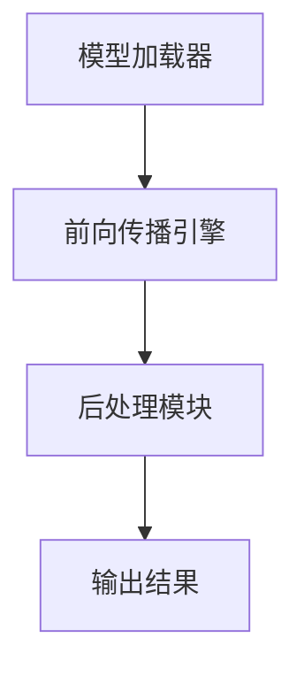

                 

关键词：OpenCV，深度学习，DNN模块，模型集成，图像识别，人脸检测，神经网络，计算机视觉

> 摘要：本文将深入探讨OpenCV DNN模块在深度学习模型集成中的应用。我们将介绍DNN模块的基本概念、架构原理，详细讲解其操作步骤，并通过实际项目案例展示其在图像识别和人脸检测等领域的强大功能。文章还将展望深度学习模型在计算机视觉领域的未来发展趋势和挑战，并推荐相关的学习资源和开发工具。

## 1. 背景介绍

随着深度学习技术的飞速发展，计算机视觉领域取得了令人瞩目的成果。然而，深度学习模型的训练和部署一直是困扰开发者的难题。OpenCV（Open Source Computer Vision Library）作为一款广泛使用的计算机视觉库，其DNN（Deep Neural Network）模块为深度学习模型的快速集成提供了便利。通过OpenCV DNN模块，开发者可以轻松地将预训练的深度学习模型部署到各种应用场景中。

本文将围绕OpenCV DNN模块展开，介绍其核心概念、架构原理和操作步骤，并结合实际案例进行详细讲解。通过阅读本文，读者将能够了解如何利用OpenCV DNN模块实现深度学习模型的快速集成，为计算机视觉应用的开发提供有力支持。

## 2. 核心概念与联系

### 2.1 DNN模块的基本概念

DNN（Deep Neural Network）模块是OpenCV中的一个子模块，用于加载、配置和执行深度学习模型。DNN模块支持多种深度学习框架，如Caffe、TensorFlow和PyTorch等，使得开发者可以在OpenCV中直接使用这些模型。

### 2.2 DNN模块的架构原理

DNN模块的架构设计充分考虑了深度学习模型的特性和性能需求。其核心组件包括：

- **模型加载器**：用于加载深度学习模型文件，包括网络结构、权重和参数。
- **前向传播引擎**：负责执行模型的前向传播，计算输入数据在网络中的输出结果。
- **后处理模块**：用于对模型的输出结果进行后处理，如概率阈值设置、非极大值抑制等。

### 2.3 Mermaid流程图



### 2.4 DNN模块与深度学习框架的联系

DNN模块的设计思路是将深度学习框架的模型文件转换为OpenCV内部可以识别和处理的格式。这一转换过程通常包括以下几个步骤：

1. **模型文件转换**：将深度学习框架的模型文件（如Caffe的prototxt和 weights文件、TensorFlow的 pb文件等）转换为OpenCV支持的onnx格式。
2. **模型加载**：使用OpenCV的DNN模块加载转换后的onnx模型文件。
3. **模型配置**：设置模型的输入和输出参数，如输入尺寸、数据类型等。
4. **模型执行**：执行模型的前向传播，得到输出结果。
5. **后处理**：对输出结果进行后处理，得到最终的应用结果。

## 3. 核心算法原理 & 具体操作步骤

### 3.1 算法原理概述

OpenCV DNN模块的核心算法原理是利用深度学习模型进行图像识别和目标检测。具体来说，通过加载预训练的深度学习模型，对输入图像进行特征提取和分类，从而实现对图像内容的理解和分析。

### 3.2 算法步骤详解

1. **模型加载**：首先，需要加载深度学习模型文件。使用OpenCV的DNN模块提供的`readNet`函数，将模型文件加载到内存中。

   ```python
   net = cv2.dnn.readNetFromCaffe(model.prototxt, model.caffemodel)
   ```

2. **模型配置**：在加载模型后，需要配置模型的输入和输出参数。根据模型的架构和输入要求，设置输入图像的尺寸、数据类型等。

   ```python
   net.setInput(img, scalefactor, size, mean, swapRB)
   ```

3. **前向传播**：使用`forward`函数执行模型的前向传播，得到输出结果。

   ```python
   output = net.forward()
   ```

4. **后处理**：根据模型的输出结果，进行后处理，如概率阈值设置、非极大值抑制等，得到最终的应用结果。

   ```python
   results = postprocess(output, threshold)
   ```

### 3.3 算法优缺点

**优点**：

- **模型集成便捷**：OpenCV DNN模块支持多种深度学习框架，使得开发者可以方便地将预训练的深度学习模型集成到OpenCV应用中。
- **性能高效**：OpenCV DNN模块采用了优化的前向传播引擎，能够高效地执行深度学习模型，提高图像处理速度。
- **易于使用**：OpenCV DNN模块提供了简单的API接口，使得开发者可以快速上手，实现深度学习模型的应用。

**缺点**：

- **模型转换复杂**：深度学习框架的模型文件通常需要转换为OpenCV支持的格式，这一过程可能需要一定的转换工具和技巧。
- **兼容性有限**：OpenCV DNN模块支持的深度学习框架有限，无法直接使用所有类型的深度学习模型。

### 3.4 算法应用领域

OpenCV DNN模块广泛应用于图像识别、目标检测、人脸识别等计算机视觉领域。以下是一些具体的应用场景：

- **图像识别**：利用深度学习模型对输入图像进行分类和识别，如物体识别、场景分类等。
- **目标检测**：通过深度学习模型检测图像中的目标物体，如行人检测、车辆检测等。
- **人脸识别**：利用深度学习模型进行人脸特征提取和比对，实现人脸识别和身份验证。

## 4. 数学模型和公式 & 详细讲解 & 举例说明

### 4.1 数学模型构建

深度学习模型的核心是神经网络，其基本构建块是神经元。每个神经元接收多个输入信号，并通过激活函数产生输出信号。神经网络的输出结果取决于网络的结构、参数和输入数据。

### 4.2 公式推导过程

假设有一个简单的单层神经网络，包含n个神经元，每个神经元接收m个输入信号。输入信号为\(x_1, x_2, \ldots, x_m\)，权重为\(w_{ij}\)，激活函数为\(f\)。则神经网络的输出结果可以表示为：

$$
y_j = f(\sum_{i=1}^{m} w_{ij} x_i)
$$

其中，\(y_j\)为第j个神经元的输出，\(f\)为激活函数。

### 4.3 案例分析与讲解

假设我们有一个简单的二元分类问题，需要判断一个输入图像是猫还是狗。使用一个简单的单层神经网络进行分类，输入为图像的特征向量，输出为分类概率。

1. **输入层**：输入图像的特征向量，维度为m。
2. **隐藏层**：一个神经元，接收m个输入信号，通过权重和激活函数产生输出。
3. **输出层**：一个神经元，输出为分类概率。

根据上述神经网络结构，我们可以推导出输出结果：

$$
P(\text{猫}) = f(\sum_{i=1}^{m} w_{ij} x_i)
$$

其中，\(f\)为激活函数，\(w_{ij}\)为隐藏层神经元的权重，\(x_i\)为输入特征向量。

通过设置合适的权重和激活函数，可以使神经网络在训练过程中逐渐调整参数，提高分类准确率。

## 5. 项目实践：代码实例和详细解释说明

### 5.1 开发环境搭建

1. 安装OpenCV库：

   ```shell
   pip install opencv-python
   ```

2. 安装Caffe模型文件（以MobileNet为例）：

   下载MobileNet模型文件（prototxt和caffemodel）：

   ```shell
   wget https://github.com/opencv/opencv_3rdparty/raw/master/dnn/opencv_face_detection_models/deploy.prototxt
   wget https://github.com/opencv/opencv_3rdparty/raw/master/dnn/opencv_face_detection_models/res10_300x300_ssd_iter_140000.caffemodel
   ```

### 5.2 源代码详细实现

```python
import cv2

def detect_faces(image, model_prototxt, model_caffemodel):
    # 加载模型
    net = cv2.dnn.readNetFromCaffe(model_prototxt, model_caffemodel)

    # 转换为灰度图像
    gray = cv2.cvtColor(image, cv2.COLOR_BGR2GRAY)

    # 设置模型输入尺寸
    (h, w) = gray.shape[:2]
    blob = cv2.dnn.blobFromImage(cv2.resize(gray, (300, 300)), 1.0, (300, 300), (104.0, 177.0, 123.0))

    # 执行前向传播
    net.setInput(blob)
    detections = net.forward()

    # 遍历检测结果
    for i in range(0, detections.shape[2]):
        confidence = detections[0, 0, i, 2]

        if confidence > 0.5:
            box = detections[0, 0, i, 3:7] * np.array([w, h, w, h])
            (x, y, x2, y2) = box.astype("int")

            cv2.rectangle(image, (x, y), (x2, y2), (0, 0, 255), 2)

    return image

# 加载测试图像
image = cv2.imread("test.jpg")

# 检测人脸
result = detect_faces(image, "deploy.prototxt", "res10_300x300_ssd_iter_140000.caffemodel")

# 显示结果
cv2.imshow("Result", result)
cv2.waitKey(0)
cv2.destroyAllWindows()
```

### 5.3 代码解读与分析

1. **加载模型**：使用`cv2.dnn.readNetFromCaffe`函数加载Caffe模型文件。
2. **转换图像**：将输入图像转换为灰度图像，并设置模型输入尺寸。
3. **前向传播**：使用`cv2.dnn.blobFromImage`函数生成模型输入blob，并执行前向传播。
4. **处理检测结果**：遍历检测结果，判断置信度是否大于0.5，并在图像上绘制人脸区域。
5. **显示结果**：显示处理后的图像。

## 6. 实际应用场景

OpenCV DNN模块在计算机视觉领域具有广泛的应用。以下是一些实际应用场景：

- **图像识别**：利用深度学习模型对输入图像进行分类和识别，如物体识别、场景分类等。
- **目标检测**：通过深度学习模型检测图像中的目标物体，如行人检测、车辆检测等。
- **人脸识别**：利用深度学习模型进行人脸特征提取和比对，实现人脸识别和身份验证。
- **物体跟踪**：利用深度学习模型对图像中的物体进行实时跟踪，如视频监控、自动驾驶等。

## 6.4 未来应用展望

随着深度学习技术的不断发展，OpenCV DNN模块在计算机视觉领域的应用前景广阔。未来，OpenCV DNN模块可能会：

- **支持更多深度学习框架**：引入更多深度学习框架，如PyTorch、MXNet等，以满足不同开发者的需求。
- **优化模型转换工具**：提高模型转换工具的效率和兼容性，简化深度学习模型集成过程。
- **增强模型性能**：通过优化算法和硬件加速，提高深度学习模型在OpenCV中的运行效率。
- **拓展应用领域**：探索深度学习模型在医学影像、智能监控等领域的应用。

## 7. 工具和资源推荐

### 7.1 学习资源推荐

- **OpenCV官方网站**：提供详细的文档和教程，帮助开发者了解OpenCV及其DNN模块的使用方法。
- **深度学习教程**：如《深度学习》（Goodfellow et al.），《Python深度学习》（Raschka and Lutz），为深度学习初学者提供全面的理论和实践指导。
- **在线课程**：如Udacity的《深度学习纳米学位》、Coursera的《深度学习专项课程》，帮助开发者快速掌握深度学习技术。

### 7.2 开发工具推荐

- **Caffe**：用于构建和训练深度学习模型的框架，支持多种硬件加速和优化。
- **TensorFlow**：Google开源的深度学习框架，提供丰富的API和工具，支持多种应用场景。
- **PyTorch**：Facebook开源的深度学习框架，具有简洁的API和强大的功能，适用于研究与应用。

### 7.3 相关论文推荐

- **《深度学习：卷积神经网络》**（2012年）：由Hinton等研究者提出的卷积神经网络（CNN）模型，是计算机视觉领域的里程碑。
- **《快速卷积神经网络》**（2014年）：由He等研究者提出的ResNet模型，实现了图像分类的突破性进展。
- **《Person Re-Identification》**（2016年）：综述了人脸识别和行人重识别领域的研究进展，为深度学习模型的应用提供了新思路。

## 8. 总结：未来发展趋势与挑战

### 8.1 研究成果总结

本文介绍了OpenCV DNN模块在深度学习模型集成中的应用，详细讲解了其核心概念、架构原理和操作步骤，并结合实际案例进行了详细解释。通过本文，读者可以了解如何利用OpenCV DNN模块实现深度学习模型的快速集成，为计算机视觉应用的开发提供有力支持。

### 8.2 未来发展趋势

未来，OpenCV DNN模块在计算机视觉领域的应用前景广阔。随着深度学习技术的不断发展，OpenCV DNN模块可能会支持更多深度学习框架，优化模型转换工具，增强模型性能，拓展应用领域。

### 8.3 面临的挑战

在深度学习模型集成过程中，开发者仍需面临以下挑战：

- **模型转换复杂**：深度学习框架的模型文件需要转换为OpenCV支持的格式，这一过程可能需要一定的转换工具和技巧。
- **兼容性有限**：OpenCV DNN模块支持的深度学习框架有限，无法直接使用所有类型的深度学习模型。
- **性能优化**：深度学习模型在OpenCV中的运行效率仍有待提高，特别是在大规模图像处理场景中。

### 8.4 研究展望

未来，OpenCV DNN模块的研究应重点关注以下几个方面：

- **模型转换工具优化**：提高模型转换工具的效率和兼容性，简化深度学习模型集成过程。
- **性能优化**：通过算法优化和硬件加速，提高深度学习模型在OpenCV中的运行效率。
- **应用拓展**：探索深度学习模型在医学影像、智能监控等领域的应用，为实际场景提供更有效的解决方案。

## 9. 附录：常见问题与解答

### 9.1 如何加载深度学习模型？

使用`cv2.dnn.readNetFromCaffe`函数加载Caffe模型文件，函数参数为模型文件路径。例如：

```python
net = cv2.dnn.readNetFromCaffe("model.prototxt", "model.caffemodel")
```

### 9.2 如何设置模型输入参数？

使用`net.setInput`函数设置模型输入参数，函数参数包括输入图像blob、缩放因子、输入尺寸、均值和换RGB通道。例如：

```python
blob = cv2.dnn.blobFromImage(image, scalefactor, size, mean, swapRB)
net.setInput(blob)
```

### 9.3 如何处理模型输出结果？

根据模型输出结果的不同类型，可以使用相应的后处理函数进行处理。例如，对于目标检测模型，可以使用`postprocess`函数进行后处理：

```python
results = postprocess(output, threshold)
```

其中，`output`为模型输出结果，`threshold`为概率阈值。

## 文章末尾

作者：禅与计算机程序设计艺术 / Zen and the Art of Computer Programming

