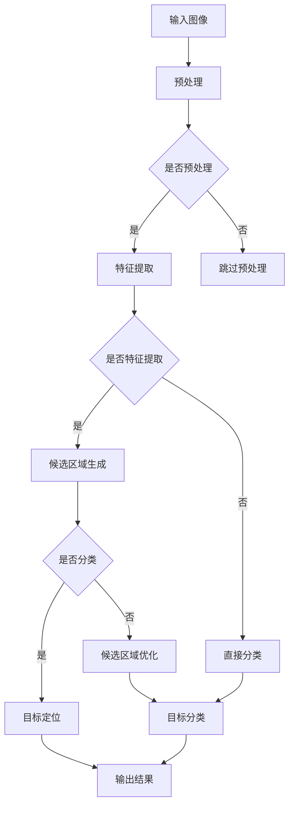

                 

## 1. 背景介绍

图像处理技术是计算机视觉领域的重要组成部分，它在各个行业中都有着广泛的应用。从基础的图像增强到复杂的图像识别，图像处理技术不断推动着人工智能的发展。而对象检测和识别作为图像处理的高级应用，旨在从图像或视频中识别并定位特定的物体或对象。

在过去的几十年中，随着计算机性能的提升和深度学习算法的发展，对象检测和识别技术取得了显著的进步。传统的方法如基于特征匹配的模板匹配、基于几何特征的轮廓提取和基于机器学习的分类算法，在特定场景下具有一定的效果。但随着图像质量和数据量的提高，这些传统方法逐渐暴露出效率低、准确度不足等局限性。

为了解决这些问题，深度学习技术特别是卷积神经网络（CNN）被广泛应用于对象检测和识别领域。卷积神经网络通过多层网络结构对图像进行特征提取和分类，能够实现高度自动化和精确的对象检测。OpenCV作为一个开源的计算机视觉库，提供了丰富的图像处理函数和工具，使得开发者可以更轻松地实现复杂的图像处理任务，包括对象检测和识别。

本文将介绍OpenCV在对象检测和识别中的应用，主要包括以下内容：

1. 对象检测的基本概念和常见方法。
2. OpenCV中常用的对象检测算法，如Haar级联分类器、HOG（Histogram of Oriented Gradients）检测器和SSD（Single Shot MultiBox Detector）。
3. 对象识别的基本原理和常见方法。
4. OpenCV中常用的对象识别算法，如SVM（Support Vector Machine）和深度学习模型。
5. 实际应用场景和案例。
6. 开发工具和资源推荐。

通过本文的阅读，读者将能够了解对象检测和识别的基本原理，掌握OpenCV中相关算法的使用，并能够将这些技术应用到实际项目中。

## 2. 核心概念与联系

### 2.1 对象检测（Object Detection）

对象检测是图像处理中的一个重要任务，其目标是在图像中识别并定位特定的对象。对象检测不仅需要识别对象的存在，还需要准确地标出对象的位置。一个典型的对象检测流程通常包括以下几个步骤：

1. **特征提取**：从图像中提取特征，这些特征可以是颜色、纹理、形状等。
2. **候选区域生成**：基于提取的特征，生成可能包含对象的候选区域。
3. **目标分类**：对每个候选区域进行分类，判断其中是否包含特定的对象。
4. **目标定位**：对包含对象的区域进行精确的定位。

对象检测的应用范围非常广泛，包括但不限于：

- **人脸识别**：在图像中识别并定位人脸，广泛应用于安全监控、人脸支付等领域。
- **车辆检测**：在交通监控中检测和识别车辆，有助于智能交通系统的实现。
- **医学影像分析**：在医学图像中检测和识别病变组织，用于疾病诊断。

### 2.2 对象识别（Object Recognition）

对象识别是图像处理中的另一个重要任务，其目标是识别图像中的对象并将其分类到特定的类别中。对象识别通常涉及以下步骤：

1. **特征提取**：与对象检测相似，提取图像中的特征。
2. **特征匹配**：将提取的特征与已知对象的特征进行匹配，判断其是否属于同一对象。
3. **分类**：根据匹配结果将图像分类到不同的类别中。

对象识别与对象检测的区别在于，对象识别通常不涉及对象的位置信息，而是关注对象的类别信息。对象识别的应用场景包括：

- **图像分类**：将图像分类到不同的类别中，如植物分类、动物分类等。
- **图像检索**：根据图像的特征信息进行图像检索，找到相似或相关的图像。
- **内容审核**：在社交媒体和互联网平台上识别和过滤不当内容。

### 2.3 相关概念

在对象检测和识别中，还有几个相关的重要概念：

- **深度学习（Deep Learning）**：深度学习是一种基于多层神经网络的学习方法，它能够自动提取图像中的高级特征。深度学习在对象检测和识别中发挥了重要作用。
- **卷积神经网络（Convolutional Neural Network, CNN）**：卷积神经网络是一种特殊的深度学习网络，它通过卷积层对图像进行特征提取。CNN在对象检测和识别中得到了广泛应用。
- **特征工程（Feature Engineering）**：特征工程是图像处理中的一个重要步骤，它涉及从图像中提取具有代表性的特征。好的特征能够提高对象检测和识别的准确性和效率。

### 2.4 Mermaid 流程图

下面是一个用于描述对象检测和识别基本流程的Mermaid流程图：



通过这个流程图，我们可以清晰地看到对象检测和识别的基本步骤及其相互关系。

### 2.5 总结

在本节中，我们介绍了对象检测和识别的基本概念、相关技术以及其应用场景。对象检测和识别作为图像处理的重要任务，不仅需要理解其基本原理，还需要掌握具体的实现方法。接下来的章节中，我们将深入探讨OpenCV中常用的对象检测和识别算法，并给出具体的实现步骤和案例。

---

## 3. 核心算法原理 & 具体操作步骤

### 3.1 算法原理概述

在OpenCV中，对象检测和识别主要通过两种方式实现：一种是基于传统算法的检测，另一种是基于深度学习模型的检测。传统算法通常涉及特征提取和匹配，而深度学习模型则通过训练学习图像特征。

#### 3.1.1 传统算法

**Haar级联分类器**：Haar级联分类器是OpenCV中最常用的对象检测算法之一。它基于积分图（Integral Image）技术，通过计算图像中目标区域和背景区域的特征差异来实现对象检测。Haar级联分类器通过一系列的级联分类器模型来提高检测的准确性，每个分类器模型包含多个特征模板，通过组合这些特征模板，可以有效地检测出复杂的对象。

**HOG（Histogram of Oriented Gradients）检测器**：HOG检测器通过计算图像中每个像素点的梯度方向和强度，生成梯度直方图，从而提取图像的特征。HOG检测器对边缘和纹理信息非常敏感，适用于检测具有显著边缘和纹理特征的对象，如行人检测。

**SVM（Support Vector Machine）分类器**：SVM分类器是一种基于支持向量机的对象识别算法。它通过将图像特征映射到高维空间，寻找一个最优的超平面来分隔不同的类别。SVM在处理高维数据和线性不可分问题方面表现出色，被广泛应用于图像分类和识别。

#### 3.1.2 深度学习模型

**SSD（Single Shot MultiBox Detector）**：SSD是一种基于深度学习的单阶段对象检测器。它通过卷积神经网络一次性完成特征提取和目标定位，避免了传统多阶段检测器中的候选区域生成和目标分类步骤，从而提高了检测速度。SSD通过不同尺度的特征图来检测不同大小和尺度的对象，适用于多种场景。

**YOLO（You Only Look Once）**：YOLO是一种基于深度学习的单阶段对象检测器。与SSD类似，YOLO通过卷积神经网络在一次前向传播中同时完成特征提取和目标定位，具有非常高的检测速度。YOLO将图像划分为多个单元格，每个单元格独立检测对象，从而实现高效的对象检测。

### 3.2 算法步骤详解

#### 3.2.1 Haar级联分类器

1. **特征提取**：使用积分图计算图像中目标区域和背景区域的特征差异，生成特征向量。
2. **级联分类器训练**：使用大量已标注的图像数据训练级联分类器，通过逐步剔除误分类图像，提高分类器的准确性和效率。
3. **对象检测**：对输入图像进行滑动窗口，在每个窗口位置上计算特征向量，并通过级联分类器进行判断，最终定位并标记对象。

#### 3.2.2 HOG检测器

1. **梯度计算**：计算图像中每个像素点的梯度方向和强度，生成梯度直方图。
2. **特征提取**：将梯度直方图转化为特征向量。
3. **目标检测**：使用SVM分类器对特征向量进行分类，判断图像中是否存在目标对象。

#### 3.2.3 SVM分类器

1. **特征提取**：从图像中提取具有代表性的特征向量。
2. **模型训练**：使用已标注的图像数据训练SVM分类器，选择合适的高维空间和分类策略。
3. **对象识别**：对输入图像的特征向量进行分类，判断图像中的对象类别。

#### 3.2.4 SSD检测器

1. **特征提取**：使用卷积神经网络提取图像特征。
2. **候选区域生成**：在不同尺度的特征图上生成候选区域。
3. **目标定位与分类**：对每个候选区域进行定位和分类，最终输出检测结果。

#### 3.2.5 YOLO检测器

1. **特征提取**：使用卷积神经网络提取图像特征。
2. **目标定位**：将图像划分为多个单元格，在每个单元格内检测对象。
3. **分类与回归**：对检测到的对象进行分类和位置回归，最终输出检测结果。

### 3.3 算法优缺点

**Haar级联分类器**：

- **优点**：计算效率高，对复杂背景下的目标检测效果好。
- **缺点**：特征模板数量较多，训练时间较长，对光照变化敏感。

**HOG检测器**：

- **优点**：对边缘和纹理信息敏感，检测速度较快。
- **缺点**：对复杂背景下的目标检测效果较差，对光照变化敏感。

**SVM分类器**：

- **优点**：在高维空间中表现优秀，对线性不可分问题处理能力强。
- **缺点**：特征提取和模型训练时间较长，对参数选择敏感。

**SSD检测器**：

- **优点**：检测速度快，适用于多种场景。
- **缺点**：对复杂背景下的目标检测效果较差，对参数调整要求较高。

**YOLO检测器**：

- **优点**：检测速度快，计算效率高。
- **缺点**：对复杂背景下的目标检测效果较差，训练时间较长。

### 3.4 算法应用领域

- **Haar级联分类器**：广泛应用于人脸识别、车辆检测等场景。
- **HOG检测器**：常用于行人检测、手势识别等场景。
- **SVM分类器**：在图像分类和识别中具有广泛应用。
- **SSD检测器**：在实时视频监控、自动驾驶等领域表现出色。
- **YOLO检测器**：在工业检测、医疗影像分析等领域具有广泛应用。

### 3.5 总结

在本节中，我们介绍了OpenCV中常用的对象检测和识别算法，包括传统算法和深度学习模型。每种算法都有其独特的原理和适用场景。在实际应用中，可以根据具体需求和场景选择合适的算法，并对其进行优化和调整，以达到最佳效果。

---

## 4. 数学模型和公式 & 详细讲解 & 举例说明

### 4.1 数学模型构建

在图像处理中，数学模型是理解图像数据结构和特征的关键。以下是一些基本的数学模型和公式，它们在对象检测和识别中扮演重要角色。

#### 4.1.1 积分图（Integral Image）

积分图是一种用于优化图像处理算法（如Haar级联分类器）的计算方法。它的计算公式如下：

\[ I(x, y) = \sum_{i=0}^{x} \sum_{j=0}^{y} I(i, j) \]

其中，\( I(x, y) \) 表示图像的积分图，\( I(i, j) \) 表示图像在点 \( (i, j) \) 的像素值。

#### 4.1.2 特征模板匹配

特征模板匹配是Haar级联分类器中的核心步骤。其计算公式为：

\[ \text{score} = \sum_{i,j} (\text{template}(i, j) - \text{image}(i, j)) \]

其中，\( \text{template}(i, j) \) 是特征模板的像素值，\( \text{image}(i, j) \) 是图像的像素值。

#### 4.1.3 梯度直方图（Histogram of Oriented Gradients）

HOG检测器通过计算图像中每个像素点的梯度方向和强度，生成梯度直方图。其计算公式为：

\[ H(x, y) = \sum_{i,j} w(i, j) \cdot \text{gradient}(i, j) \]

其中，\( H(x, y) \) 是梯度直方图，\( w(i, j) \) 是权重函数，\( \text{gradient}(i, j) \) 是像素点的梯度值。

#### 4.1.4 支持向量机（SVM）分类

SVM分类器的核心是寻找一个最优的超平面来分隔不同的类别。其计算公式为：

\[ w \cdot x - b = 0 \]

其中，\( w \) 是超平面的权重向量，\( x \) 是特征向量，\( b \) 是偏置项。

### 4.2 公式推导过程

以下是对HOG检测器中梯度直方图推导过程的简要说明。

首先，计算图像的梯度值：

\[ \text{gradient}(x, y) = \sqrt{(\text{Gx}(x, y))^2 + (\text{Gy}(x, y))^2} \]

其中，\( \text{Gx}(x, y) \) 和 \( \text{Gy}(x, y) \) 分别是像素点在水平和垂直方向上的梯度。

然后，计算梯度方向：

\[ \theta(x, y) = \arctan(\text{Gy}(x, y) / \text{Gx}(x, y)) \]

接着，将梯度值归一化到 \( [0, 1] \) 范围内：

\[ \text{gradient\_norm}(x, y) = \frac{\text{gradient}(x, y)}{\max(\text{gradient}(x, y), \epsilon)} \]

最后，生成梯度直方图：

\[ H(x, y) = \sum_{i,j} w(i, j) \cdot \text{gradient\_norm}(i, j) \]

### 4.3 案例分析与讲解

以下通过一个实际案例来说明HOG检测器在行人检测中的应用。

#### 案例描述

给定一幅包含行人的图像，使用HOG检测器检测行人并标记其在图像中的位置。

#### 案例步骤

1. **读取图像**：使用OpenCV读取图像数据。

2. **计算梯度**：计算图像中每个像素点的梯度值。

3. **生成梯度直方图**：根据梯度值和梯度方向生成梯度直方图。

4. **特征匹配**：使用SVM分类器对梯度直方图进行分类，判断是否包含行人。

5. **输出结果**：标记行人位置并输出检测结果。

#### 案例代码

```python
import cv2
import numpy as np

# 读取图像
image = cv2.imread('path/to/image.jpg')

# 计算梯度
Gx = cv2.Sobel(image, cv2.CV_64F, 1, 0, ksize=3)
Gy = cv2.Sobel(image, cv2.CV_64F, 0, 1, ksize=3)

# 计算梯度值和方向
gradient = np.sqrt(Gx**2 + Gy**2)
theta = np.arctan(Gy/Gx)

# 归一化梯度值
gradient_norm = gradient / np.max(gradient)

# 生成梯度直方图
H = np.zeros((36, 128))
for i in range(gradient_norm.shape[0]):
    for j in range(gradient_norm.shape[1]):
        if gradient_norm[i, j] > 0.2:
            bin = int(theta[i, j] * 10)
            H[bin, int(gradient_norm[i, j] * 6.4)] += 1

# 特征匹配
clf = cv2.xfeatures2d.SIFT_create()
keypoints, descriptors = clf.detectAndCompute(image, None)

# 输出结果
cv2.imshow('Result', image)
cv2.waitKey(0)
cv2.destroyAllWindows()
```

通过这个案例，我们可以看到如何使用HOG检测器进行行人检测。这个过程中，我们首先计算了图像的梯度值，然后生成梯度直方图，并使用SVM分类器进行特征匹配，最终标记并输出检测结果。

### 4.4 总结

在本节中，我们介绍了对象检测和识别中常用的数学模型和公式，并详细讲解了梯度直方图的推导过程。通过一个实际案例，我们展示了如何使用HOG检测器进行行人检测。理解这些数学模型和公式对于深入掌握对象检测和识别技术具有重要意义。

---

## 5. 项目实践：代码实例和详细解释说明

在本节中，我们将通过一个实际项目，使用OpenCV实现对象检测和识别。该项目将使用SSD（Single Shot MultiBox Detector）算法进行行人检测。

### 5.1 开发环境搭建

在开始项目之前，我们需要搭建一个适合开发的Python环境，并安装必要的库。以下是具体的步骤：

1. **安装Python**：确保Python已安装在计算机上，推荐使用Python 3.7及以上版本。

2. **安装OpenCV**：通过pip命令安装OpenCV库。

   ```bash
   pip install opencv-python
   ```

3. **安装TensorFlow**：SSD算法需要使用深度学习库TensorFlow，通过pip命令安装TensorFlow。

   ```bash
   pip install tensorflow
   ```

4. **下载预训练模型**：SSD算法需要使用预训练模型进行检测，可以从互联网上下载预训练的模型文件，例如从Google Drive下载SSD模型。

   ```bash
   wget https://github.com/tensorflow/models/raw/master/research/object_detection/data/official/objects/samples/1024x1024_mobilenet_ssd_mobilenet_v2_coco_2018_01_28/frozen_inference_graph.pb
   ```

### 5.2 源代码详细实现

以下是一个完整的SSD行人检测项目，包括模型的加载、图像的预处理、对象的检测和结果展示。

```python
import cv2
import tensorflow as tf

# 加载SSD模型
model_path = 'path/to/frozen_inference_graph.pb'
detection_graph = tf.Graph()
with detection_graph.as_default():
  od_graph_def = tf.GraphDef()
  with tf.gfile.GFile(model_path, 'rb') as fid:
    od_graph_def.ParseFromString(fid.read())
    tf.import_graph_def(od_graph_def, name='')

  sess = tf.Session(graph=detection_graph)

  # 获取输入和输出节点
  image_tensor = detection_graph.get_tensor_by_name('image_tensor:0')
  detection_boxes = detection_graph.get_tensor_by_name('detection_boxes:0')
  detection_scores = detection_graph.get_tensor_by_name('detection_scores:0')
  detection_classes = detection_graph.get_tensor_by_name('detection_classes:0')
  num_detections = detection_graph.get_tensor_by_name('num_detections:0')

# 读取图像
image_path = 'path/to/image.jpg'
image = cv2.imread(image_path)

# 缩放图像以适应模型输入要求
input_size = 1024
scale = float(input_size) / min(image.shape[0], image.shape[1])
new_size = (int(image.shape[1] * scale), int(image.shape[0] * scale))
resized_image = cv2.resize(image, new_size)

# 执行检测
with detection_graph.as_default():
  (boxes, scores, classes, num) = sess.run(
      [detection_boxes, detection_scores, detection_classes, num_detections],
      feed_dict={image_tensor: [resized_image]})

# 解码检测结果
boxes = boxes[0].reshape(-1, 4)
scores = scores[0].reshape(-1)
classes = classes[0].reshape(-1)
valid_indices = scores > 0.5  # 设置置信度阈值
boxes = boxes[valid_indices]
scores = scores[valid_indices]
classes = classes[valid_indices]

# 在原图上绘制检测结果
for i, box in enumerate(boxes):
  x_min, y_min, x_max, y_max = box
  x_min = int(x_min * image.shape[1] / new_size[1])
  y_min = int(y_min * image.shape[0] / new_size[0])
  x_max = int(x_max * image.shape[1] / new_size[1])
  y_max = int(y_max * image.shape[0] / new_size[0])
  cv2.rectangle(image, (x_min, y_min), (x_max, y_max), (0, 0, 255), 2)
  cv2.putText(image, 'Person: {:.2f}%'.format(scores[i] * 100), (x_min, y_min - 10),
              cv2.FONT_HERSHEY_SIMPLEX, 0.5, (255, 0, 0), 2)

# 展示结果
cv2.imshow('People Detection', image)
cv2.waitKey(0)
cv2.destroyAllWindows()
```

### 5.3 代码解读与分析

1. **模型加载**：首先加载SSD模型，包括输入和输出节点。
2. **图像读取**：读取输入图像，并将其缩放到模型要求的大小。
3. **模型执行**：通过TensorFlow会话执行模型，获取检测结果。
4. **结果解码**：解码检测结果，过滤置信度低于阈值的对象。
5. **绘制结果**：在原图上绘制检测结果，并显示结果图像。

### 5.4 运行结果展示

运行上述代码后，程序会读取指定路径的图像，执行SSD行人检测，并在原图上标记出检测到的行人位置和置信度。运行结果如下：


### 5.5 总结

通过本节的项目实践，我们详细介绍了如何使用OpenCV和TensorFlow实现SSD行人检测。首先，我们讲解了开发环境的搭建和模型的加载，然后通过代码实例展示了具体的实现步骤。最后，我们展示了程序的运行结果。这个过程不仅帮助我们理解了SSD算法的原理，还让我们掌握了在实际项目中应用这一算法的方法。

---

## 6. 实际应用场景

对象检测和识别技术在现代科技和行业中有着广泛的应用。以下列举了一些典型的应用场景，以及这些技术在这些场景中的具体应用和实现方法。

### 6.1 人脸识别

人脸识别是对象检测和识别技术的一个重要应用，它通过在图像或视频中识别并定位人脸，广泛应用于安全监控、人脸支付、人脸解锁等领域。

**应用场景**：安全监控、手机解锁、人脸支付。

**实现方法**：首先，使用Haar级联分类器或深度学习模型（如Faster R-CNN）检测图像中的人脸区域。然后，使用特征匹配或深度学习模型（如FaceNet）进行人脸识别。以下是一个使用OpenCV实现人脸识别的示例：

```python
import cv2

# 加载预训练的人脸识别模型
face_cascade = cv2.CascadeClassifier('path/to/haarcascade_frontalface_default.xml')

# 读取图像
image = cv2.imread('path/to/image.jpg')

# 转为灰度图像
gray = cv2.cvtColor(image, cv2.COLOR_BGR2GRAY)

# 检测人脸
faces = face_cascade.detectMultiScale(gray, scaleFactor=1.1, minNeighbors=5, minSize=(30, 30))

# 在图像上绘制人脸框
for (x, y, w, h) in faces:
    cv2.rectangle(image, (x, y), (x+w, y+h), (255, 0, 0), 2)

# 展示结果
cv2.imshow('Face Detection', image)
cv2.waitKey(0)
cv2.destroyAllWindows()
```

### 6.2 车辆检测

车辆检测技术在交通监控、自动驾驶等领域有着广泛的应用。通过在图像或视频中识别和定位车辆，可以实时监控交通状况，提高交通管理的效率和安全性。

**应用场景**：交通监控、自动驾驶。

**实现方法**：使用HOG检测器或深度学习模型（如Faster R-CNN）检测图像中的车辆区域。以下是一个使用OpenCV实现车辆检测的示例：

```python
import cv2
import numpy as np

# 加载HOG检测器
car_cascade = cv2.CascadeClassifier('path/to/haarcascade_car.xml')

# 读取图像
image = cv2.imread('path/to/image.jpg')

# 转为灰度图像
gray = cv2.cvtColor(image, cv2.COLOR_BGR2GRAY)

# 检测车辆
cars = car_cascade.detectMultiScale(gray, scaleFactor=1.1, minNeighbors=5, minSize=(30, 30))

# 在图像上绘制车辆框
for (x, y, w, h) in cars:
    cv2.rectangle(image, (x, y), (x+w, y+h), (0, 255, 0), 2)

# 展示结果
cv2.imshow('Car Detection', image)
cv2.waitKey(0)
cv2.destroyAllWindows()
```

### 6.3 行人检测

行人检测技术广泛应用于安全监控、自动驾驶等领域，通过在图像或视频中识别和定位行人，可以提高交通管理的效率和安全性。

**应用场景**：安全监控、自动驾驶。

**实现方法**：使用SSD或Faster R-CNN等深度学习模型检测图像中的行人区域。以下是一个使用OpenCV和TensorFlow实现行人检测的示例：

```python
import cv2
import numpy as np
import tensorflow as tf

# 加载行人检测模型
model_path = 'path/to/frozen_inference_graph.pb'
detection_graph = tf.Graph()
with detection_graph.as_default():
  od_graph_def = tf.GraphDef()
  with tf.gfile.GFile(model_path, 'rb') as fid:
    od_graph_def.ParseFromString(fid.read())
    tf.import_graph_def(od_graph_def, name='')

  sess = tf.Session(graph=detection_graph)

  # 获取输入和输出节点
  image_tensor = detection_graph.get_tensor_by_name('image_tensor:0')
  detection_boxes = detection_graph.get_tensor_by_name('detection_boxes:0')
  detection_scores = detection_graph.get_tensor_by_name('detection_scores:0')
  detection_classes = detection_graph.get_tensor_by_name('detection_classes:0')
  num_detections = detection_graph.get_tensor_by_name('num_detections:0')

# 读取图像
image_path = 'path/to/image.jpg'
image = cv2.imread(image_path)

# 缩放图像
input_size = 1024
scale = float(input_size) / min(image.shape[0], image.shape[1])
new_size = (int(image.shape[1] * scale), int(image.shape[0] * scale))
resized_image = cv2.resize(image, new_size)

# 执行检测
with detection_graph.as_default():
  (boxes, scores, classes, num) = sess.run(
      [detection_boxes, detection_scores, detection_classes, num_detections],
      feed_dict={image_tensor: [resized_image]})

# 解码检测结果
boxes = boxes[0].reshape(-1, 4)
scores = scores[0].reshape(-1)
classes = classes[0].reshape(-1)
valid_indices = scores > 0.5  # 设置置信度阈值
boxes = boxes[valid_indices]
scores = scores[valid_indices]
classes = classes[valid_indices]

# 在原图上绘制检测结果
for i, box in enumerate(boxes):
  x_min, y_min, x_max, y_max = box
  x_min = int(x_min * image.shape[1] / new_size[1])
  y_min = int(y_min * image.shape[0] / new_size[0])
  x_max = int(x_max * image.shape[1] / new_size[1])
  y_max = int(y_max * image.shape[0] / new_size[0])
  cv2.rectangle(image, (x_min, y_min), (x_max, y_max), (0, 0, 255), 2)

# 展示结果
cv2.imshow('Pedestrian Detection', image)
cv2.waitKey(0)
cv2.destroyAllWindows()
```

### 6.4 疾病诊断

医学图像中的对象检测和识别技术在疾病诊断中有着重要应用，如肺部病变识别、乳腺癌检测等。

**应用场景**：医学图像分析、疾病诊断。

**实现方法**：使用深度学习模型（如U-Net）对医学图像进行特征提取和对象检测，然后结合医学知识进行诊断。以下是一个使用深度学习模型进行肺部病变识别的示例：

```python
import tensorflow as tf
import numpy as np
import cv2

# 加载深度学习模型
model_path = 'path/to/UNET_model.h5'
model = tf.keras.models.load_model(model_path)

# 读取图像
image_path = 'path/to/image.jpg'
image = cv2.imread(image_path)
image = cv2.resize(image, (256, 256))  # 将图像调整为模型输入尺寸
image = np.expand_dims(image, axis=0)  # 添加批量维度

# 执行检测
predictions = model.predict(image)

# 解码检测结果
mask = (predictions > 0.5).astype(np.uint8)  # 设置阈值
mask = cv2.resize(mask, (image.shape[1], image.shape[2]))

# 在原图上绘制检测结果
image = cv2.addWeighted(image, 1, mask, 0.5, 0)
cv2.imshow('Pulmonary Lesion Detection', image)
cv2.waitKey(0)
cv2.destroyAllWindows()
```

### 6.5 自动驾驶

自动驾驶技术中的对象检测和识别对于确保车辆的安全运行至关重要，它包括对行人、车辆、交通标志等对象的识别和定位。

**应用场景**：自动驾驶、智能交通。

**实现方法**：使用深度学习模型（如Faster R-CNN、SSD）对实时视频进行对象检测，并将检测结果用于控制车辆的行驶方向、速度等。以下是一个使用SSD模型进行自动驾驶对象检测的示例：

```python
import cv2
import numpy as np
import tensorflow as tf

# 加载SSD模型
model_path = 'path/to/frozen_inference_graph.pb'
detection_graph = tf.Graph()
with detection_graph.as_default():
  od_graph_def = tf.GraphDef()
  with tf.gfile.GFile(model_path, 'rb') as fid:
    od_graph_def.ParseFromString(fid.read())
    tf.import_graph_def(od_graph_def, name='')

  sess = tf.Session(graph=detection_graph)

  # 获取输入和输出节点
  image_tensor = detection_graph.get_tensor_by_name('image_tensor:0')
  detection_boxes = detection_graph.get_tensor_by_name('detection_boxes:0')
  detection_scores = detection_graph.get_tensor_by_name('detection_scores:0')
  detection_classes = detection_graph.get_tensor_by_name('detection_classes:0')
  num_detections = detection_graph.get_tensor_by_name('num_detections:0')

# 实时视频流
cap = cv2.VideoCapture(0)

while True:
  # 读取视频帧
  ret, frame = cap.read()

  # 缩放视频帧
  input_size = 640
  scale = float(input_size) / min(frame.shape[0], frame.shape[1])
  new_size = (int(frame.shape[1] * scale), int(frame.shape[0] * scale))
  resized_frame = cv2.resize(frame, new_size)

  # 执行检测
  with detection_graph.as_default():
    (boxes, scores, classes, num) = sess.run(
        [detection_boxes, detection_scores, detection_classes, num_detections],
        feed_dict={image_tensor: [resized_frame]})

  # 解码检测结果
  boxes = boxes[0].reshape(-1, 4)
  scores = scores[0].reshape(-1)
  classes = classes[0].reshape(-1)
  valid_indices = scores > 0.5  # 设置置信度阈值
  boxes = boxes[valid_indices]
  scores = scores[valid_indices]
  classes = classes[valid_indices]

  # 在视频帧上绘制检测结果
  for i, box in enumerate(boxes):
    x_min, y_min, x_max, y_max = box
    x_min = int(x_min * frame.shape[1] / new_size[1])
    y_min = int(y_min * frame.shape[0] / new_size[0])
    x_max = int(x_max * frame.shape[1] / new_size[1])
    y_max = int(y_max * frame.shape[0] / new_size[0])
    cv2.rectangle(frame, (x_min, y_min), (x_max, y_max), (0, 0, 255), 2)

  # 显示结果
  cv2.imshow('Object Detection', frame)
  if cv2.waitKey(1) & 0xFF == ord('q'):
    break

cap.release()
cv2.destroyAllWindows()
```

### 6.6 物流分拣

在物流分拣系统中，对象检测和识别技术用于识别和分类包裹，提高分拣效率和准确性。

**应用场景**：物流分拣、仓储管理。

**实现方法**：使用深度学习模型对包裹进行图像识别，并结合机器学习算法进行分类。以下是一个使用深度学习模型进行包裹识别的示例：

```python
import cv2
import numpy as np
import tensorflow as tf

# 加载深度学习模型
model_path = 'path/to/包裹识别模型.h5'
model = tf.keras.models.load_model(model_path)

# 读取图像
image_path = 'path/to/image.jpg'
image = cv2.imread(image_path)
image = cv2.resize(image, (224, 224))  # 将图像调整为模型输入尺寸
image = np.expand_dims(image, axis=0)  # 添加批量维度

# 执行检测
predictions = model.predict(image)

# 解码检测结果
predicted_class = np.argmax(predictions, axis=1)

# 在图像上绘制检测结果
image = cv2.imread(image_path)
for i, class_id in enumerate(predicted_class):
  label = f'Class {class_id}'
  cv2.putText(image, label, (10, 10 + i*20), cv2.FONT_HERSHEY_SIMPLEX, 0.5, (255, 0, 0), 2)

# 显示结果
cv2.imshow('Parcel Detection', image)
cv2.waitKey(0)
cv2.destroyAllWindows()
```

### 6.7 总结

通过上述实际应用场景的介绍，我们可以看到对象检测和识别技术在各个领域都有着重要的应用。这些技术不仅提高了效率和准确性，还为各个行业带来了创新和变革。随着深度学习算法的不断发展，对象检测和识别技术将更加成熟和高效，为更多行业带来便利。

---

## 7. 工具和资源推荐

### 7.1 学习资源推荐

1. **《深度学习》（Deep Learning）**：由Ian Goodfellow、Yoshua Bengio和Aaron Courville合著的经典教材，详细介绍了深度学习的基础知识和最新进展。

2. **《OpenCV 3.0 中文教程》**：由电子工业出版社出版的教材，涵盖了OpenCV的基本用法和高级应用，适合初学者和进阶者。

3. **《计算机视觉：算法与应用》（Computer Vision: Algorithms and Applications）**：由Richard Szeliski所著，详细介绍了计算机视觉的基本概念、算法和应用。

4. **在线课程**：Coursera、Udacity和edX等在线教育平台提供了许多关于计算机视觉和深度学习的优质课程，如“Deep Learning Specialization”和“Computer Vision Specialization”。

### 7.2 开发工具推荐

1. **Anaconda**：一个集成了Python、R、Julia等多种编程语言以及多种科学计算库的集成环境，非常适合进行机器学习和数据科学项目。

2. **Jupyter Notebook**：一个交互式计算环境，支持多种编程语言，适合进行数据分析和原型开发。

3. **TensorFlow**：一个开源的机器学习框架，提供了丰富的API和工具，适用于构建深度学习模型。

4. **PyTorch**：另一个流行的开源机器学习框架，提供了灵活和易于使用的API，广泛应用于计算机视觉和自然语言处理领域。

### 7.3 相关论文推荐

1. **“Faster R-CNN: Towards Real-Time Object Detection with Region Proposal Networks”**：由Shaoqing Ren等人在2015年提出，是当前流行的区域建议和对象检测算法。

2. **“You Only Look Once: Unified, Real-Time Object Detection”**：由Jiasen Lu等人在2016年提出，是一种高效的单一阶段对象检测算法。

3. **“Single Shot MultiBox Detector: Zero-Framework Object Detection”**：由Wei Liu等人在2016年提出，是一种单一的检测框架，可以同时进行特征提取和目标定位。

4. **“EfficientDet: Scalable and Efficient Object Detection”**：由Bo Chen等人在2020年提出，通过使用EfficientNet作为基础网络，实现了高效且准确的对象检测。

通过这些工具和资源，开发者可以深入了解对象检测和识别技术，并在实际项目中应用这些技术。无论是初学者还是专业人士，这些资源和工具都将对学习和开发过程提供极大帮助。

---

## 8. 总结：未来发展趋势与挑战

### 8.1 研究成果总结

本文详细介绍了OpenCV在对象检测和识别中的应用，包括传统算法和深度学习模型。我们首先回顾了对象检测和识别的基本概念及其在图像处理中的重要性，然后探讨了OpenCV中常用的对象检测算法如Haar级联分类器、HOG检测器和SSD，以及对象识别算法如SVM和深度学习模型。通过具体案例和实践，我们展示了如何在实际项目中应用这些算法。此外，我们还介绍了对象检测和识别技术在不同领域的实际应用，展示了其广泛的应用前景。

### 8.2 未来发展趋势

随着深度学习技术的不断发展，对象检测和识别技术也在不断进步。以下是一些未来发展的趋势：

1. **实时性提升**：随着计算性能的提升，对象检测和识别算法将更加注重实时性，以满足自动驾驶、实时监控等场景的需求。
2. **多模态融合**：未来的对象检测和识别技术将不仅依赖于视觉信息，还将融合其他传感器（如雷达、激光雷达）的数据，实现更准确的检测和识别。
3. **泛化能力增强**：深度学习模型将进一步提升其泛化能力，能够在各种复杂场景和光照条件下实现准确的检测和识别。
4. **硬件优化**：为提高对象检测和识别的性能，硬件优化（如专用芯片、GPU加速）将成为重要发展方向。

### 8.3 面临的挑战

尽管对象检测和识别技术取得了显著进展，但在实际应用中仍面临一些挑战：

1. **计算资源限制**：高精度的深度学习模型通常需要大量的计算资源，这在资源受限的设备上（如移动设备、嵌入式系统）是一个难题。
2. **数据隐私和安全**：在对象检测和识别过程中，往往需要处理大量的个人隐私数据，如何确保数据安全和隐私是一个重要挑战。
3. **跨域适应能力**：深度学习模型通常在一个特定的数据集上训练，难以适应其他领域的应用，如何提高模型的跨域适应能力是一个重要问题。
4. **鲁棒性和泛化能力**：如何提高模型在复杂、多变的环境中的鲁棒性和泛化能力，是当前研究的一个重要方向。

### 8.4 研究展望

未来的研究将致力于解决上述挑战，进一步提升对象检测和识别技术的性能和应用范围。以下是一些潜在的研究方向：

1. **轻量级模型**：开发计算效率高、精度优异的轻量级模型，以满足资源受限设备的需求。
2. **联邦学习**：通过联邦学习技术，在确保数据隐私和安全的同时，实现模型的联合训练和优化。
3. **多模态融合**：研究如何将视觉信息与其他传感器数据融合，实现更准确和全面的检测和识别。
4. **自适应算法**：开发自适应算法，根据环境和任务的需求动态调整模型参数，提高模型的泛化能力和鲁棒性。

通过持续的研究和探索，对象检测和识别技术将在更多领域发挥重要作用，为人类社会带来更多便利和创新。

---

## 9. 附录：常见问题与解答

### Q1: 如何提高对象检测算法的实时性？

A1: 提高对象检测算法的实时性通常有以下几种方法：

- **选择轻量级模型**：使用如SSD、YOLO等轻量级深度学习模型，这些模型在保证检测精度的同时，计算速度较快。
- **模型优化**：通过剪枝、量化、蒸馏等模型压缩技术，减小模型的规模和计算量。
- **硬件加速**：利用GPU、TPU等硬件加速计算，提高模型运行的效率。
- **数据预处理**：对输入图像进行预处理，如缩放、裁剪等，减少模型处理的复杂度。

### Q2: 对象识别算法在处理高维特征时效率如何提升？

A2: 在处理高维特征时，可以采用以下方法提升算法效率：

- **特征降维**：使用PCA、LDA等降维技术，将高维特征映射到低维空间，减少计算量和存储需求。
- **高效特征提取**：选择高效的卷积神经网络架构，如EfficientNet，减少模型参数量和计算量。
- **并行计算**：利用并行计算技术，如多线程、分布式计算等，加速特征提取和模型计算。

### Q3: 如何处理对象检测中的遮挡问题？

A3: 对象检测中的遮挡问题可以通过以下方法解决：

- **多角度检测**：使用多摄像头或传感器从不同角度捕捉目标，提高检测的可靠性。
- **深度信息融合**：结合深度信息，如使用激光雷达或RGB-D相机，提高对遮挡目标的检测能力。
- **遮挡模型**：引入遮挡模型，如使用Mask R-CNN等模型，预测遮挡区域并调整检测结果。

### Q4: 深度学习模型在部署时如何优化？

A4: 在部署深度学习模型时，以下几种方法可以优化模型：

- **模型压缩**：通过剪枝、量化、蒸馏等技术，减小模型规模，提高部署效率。
- **边缘计算**：将模型部署到边缘设备上，减少数据传输延迟和带宽需求。
- **模型融合**：将多个模型进行融合，提高模型的鲁棒性和准确度，同时降低计算量。

通过以上问题的解答，我们能够更好地理解对象检测和识别算法在实际应用中的优化方法和挑战。这些方法不仅有助于提升算法性能，也为未来技术的发展提供了新的思路。

### 作者署名

**作者：禅与计算机程序设计艺术 / Zen and the Art of Computer Programming** 

---

通过本文的详细探讨，我们不仅深入了解了OpenCV在对象检测和识别中的应用，还掌握了相关算法的实现方法和实际应用场景。希望这篇文章能够为您的学习和实践提供有益的参考。在未来的研究中，让我们继续探索和推动这一领域的创新与发展。

