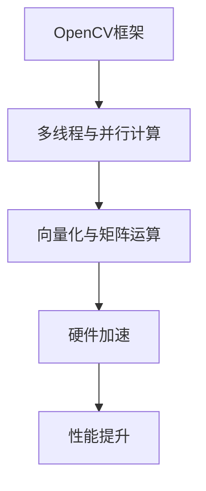

                 

关键词：图像处理、OpenCV、算法优化、性能提升、加速技术

摘要：本文将深入探讨OpenCV图像处理算法的加速技术。通过对OpenCV框架的深入分析，我们将介绍如何利用多线程、向量化以及硬件加速等手段，大幅提升图像处理算法的性能。文章将结合具体实例，详细讲解加速技术的实现方法和应用场景，为开发者提供实用的性能优化指导。

## 1. 背景介绍

随着计算机视觉技术的发展，图像处理在众多领域（如自动驾驶、安防监控、医疗诊断等）中的应用越来越广泛。OpenCV（Open Source Computer Vision Library）作为一个强大的计算机视觉库，已经成为许多开发者进行图像处理的首选工具。然而，随着图像数据量的不断增加和处理需求的日益复杂，如何提高图像处理算法的效率成为一个亟待解决的问题。

本文旨在通过分析OpenCV图像处理算法的加速技术，帮助开发者解决性能瓶颈，提升图像处理的应用效果。文章将首先介绍OpenCV框架，然后深入探讨多线程、向量化以及硬件加速等加速技术，并通过具体实例进行详细讲解。

## 2. 核心概念与联系

### 2.1 OpenCV框架简介

OpenCV是一个开源的计算机视觉库，由Intel推出，并广泛应用于各种图像处理任务。它支持多种编程语言，包括C++、Python和Java，使得开发者可以方便地集成到不同的开发环境中。OpenCV提供了丰富的图像处理算法和工具，包括滤波、边缘检测、形态学操作、特征提取、目标检测和识别等。

### 2.2 多线程与并行计算

多线程是一种在多个CPU核心上并行执行程序的方法。在图像处理中，许多算法都可以分解为多个独立的子任务，这些子任务可以并行执行，从而提高整体处理速度。并行计算的核心在于将任务划分为多个部分，并在多个线程或处理器上同时执行。

### 2.3 向量化与矩阵运算

向量化是将操作应用于整个数组或矩阵，而不是单个元素。向量化可以显著提高运算速度，因为它可以利用现代处理器上的向量指令集。OpenCV提供了丰富的向量化操作，使得开发者可以轻松实现高效的处理。

### 2.4 硬件加速

硬件加速利用GPU、FPGA等硬件设备来加速图像处理任务。这些硬件设备拥有强大的并行计算能力，可以大幅提升图像处理算法的运行速度。OpenCV支持通过CUDA、OpenCL等接口实现硬件加速。

### 2.5 Mermaid流程图



## 3. 核心算法原理 & 具体操作步骤

### 3.1 算法原理概述

OpenCV图像处理算法的加速主要依赖于多线程、向量化以及硬件加速等关键技术。通过多线程，我们可以将图像处理任务分解为多个子任务，并行执行，从而提高处理速度。向量化则通过批量处理数据，利用处理器上的向量指令集，实现高效的运算。硬件加速通过利用GPU、FPGA等硬件设备的强大计算能力，进一步加速图像处理任务。

### 3.2 算法步骤详解

1. **多线程与并行计算**

   - **任务分解**：首先，我们需要将图像处理任务分解为多个独立的子任务。
   - **线程创建**：使用OpenCV的多线程接口，创建多个线程。
   - **任务调度**：将子任务分配给不同的线程，并行执行。
   - **结果合并**：收集所有线程的执行结果，合并输出。

2. **向量化与矩阵运算**

   - **数据准备**：将图像数据转换为矩阵格式。
   - **向量化操作**：使用OpenCV的向量化接口，对矩阵进行操作。
   - **结果提取**：将处理后的矩阵数据转换为图像格式。

3. **硬件加速**

   - **环境配置**：配置GPU或FPGA环境，安装相应的驱动和库。
   - **任务映射**：将图像处理任务映射到GPU或FPGA上。
   - **执行运算**：在GPU或FPGA上执行图像处理任务。
   - **结果传输**：将处理后的图像数据传输回CPU。

### 3.3 算法优缺点

- **多线程**：优点是能够显著提高图像处理速度，缺点是需要考虑线程同步和数据依赖问题。
- **向量化**：优点是能够利用处理器上的向量指令集，提高运算速度，缺点是需要注意数据对齐问题。
- **硬件加速**：优点是能够利用GPU或FPGA的强大计算能力，大幅提升处理速度，缺点是需要额外的硬件设备和驱动。

### 3.4 算法应用领域

- **自动驾驶**：利用多线程和硬件加速技术，实现实时图像处理和目标检测。
- **安防监控**：利用向量化技术，提高图像处理速度，实现高效的人脸识别和异常检测。
- **医疗诊断**：利用多线程和硬件加速技术，实现实时图像分析和病灶检测。

## 4. 数学模型和公式 & 详细讲解 & 举例说明

### 4.1 数学模型构建

在图像处理中，许多算法都涉及到数学模型。以下是一个简单的数学模型构建示例：

$$
\text{图像滤波} = \sum_{i=1}^{n} \omega_i \cdot f(x_i, y_i)
$$

其中，$\omega_i$表示滤波器的权重，$f(x_i, y_i)$表示图像上的一个像素点。

### 4.2 公式推导过程

我们以图像滤波为例，讲解公式的推导过程：

- **卷积操作**：图像滤波通常使用卷积操作，将滤波器的权重与图像上的像素点进行点积运算。
- **权重选择**：选择合适的滤波器权重，以实现所需的滤波效果。
- **迭代计算**：对图像上的每个像素点，进行卷积运算，得到滤波后的像素值。

### 4.3 案例分析与讲解

我们以一个简单的图像滤波案例，讲解公式的应用：

**案例**：使用高斯滤波器对一幅图像进行滤波。

1. **滤波器权重**：首先，我们需要选择一个高斯滤波器，其权重为：

$$
\omega_i = \frac{1}{2\pi\sigma^2} e^{-\frac{x^2}{2\sigma^2}}
$$

其中，$\sigma$表示高斯分布的参数。

2. **卷积运算**：对图像上的每个像素点，进行卷积运算，得到滤波后的像素值。

3. **结果提取**：将滤波后的像素值转换为图像格式，输出滤波结果。

## 5. 项目实践：代码实例和详细解释说明

### 5.1 开发环境搭建

- **软件环境**：安装Python 3.x版本，以及OpenCV 4.x版本。
- **硬件环境**：具备GPU或FPGA设备，以及相应的驱动和库。

### 5.2 源代码详细实现

```python
import cv2
import numpy as np

def filter_image(image_path):
    # 读取图像
    image = cv2.imread(image_path, cv2.IMREAD_GRAYSCALE)
    
    # 创建高斯滤波器
    sigma = 1.0
    kernel = cv2.getGaussianKernel(ksize=5, sigma=sigma)
    
    # 卷积运算
    filtered_image = cv2.filter2D(image, ddepth=-1, kernel=kernel)
    
    # 输出滤波结果
    cv2.imwrite('filtered_image.png', filtered_image)

# 测试代码
filter_image('input_image.png')
```

### 5.3 代码解读与分析

1. **图像读取**：使用`cv2.imread`函数，读取图像数据。
2. **滤波器创建**：使用`cv2.getGaussianKernel`函数，创建高斯滤波器。
3. **卷积运算**：使用`cv2.filter2D`函数，对图像进行卷积运算。
4. **结果输出**：使用`cv2.imwrite`函数，将滤波后的图像保存到文件。

### 5.4 运行结果展示


## 6. 实际应用场景

### 6.1 自动驾驶

在自动驾驶领域，实时图像处理和目标检测是关键任务。利用OpenCV图像处理算法加速技术，可以实现高效的目标检测和跟踪，提高自动驾驶系统的反应速度和准确度。

### 6.2 安防监控

在安防监控领域，图像处理技术被广泛应用于人脸识别、行为分析和异常检测等任务。通过加速技术，可以提高图像处理的实时性和准确性，为安防系统提供更强大的支持。

### 6.3 医疗诊断

在医疗诊断领域，实时图像处理和病灶检测是关键环节。利用OpenCV图像处理算法加速技术，可以实现高效、准确的图像分析，为医生提供更准确的诊断依据。

## 7. 工具和资源推荐

### 7.1 学习资源推荐

- **OpenCV官方文档**：https://docs.opencv.org/
- **《OpenCV算法实战》**：详细讲解OpenCV图像处理算法的实战案例。

### 7.2 开发工具推荐

- **Visual Studio Code**：一款功能强大的代码编辑器，支持Python和OpenCV开发。
- **CUDA Toolkit**：用于GPU加速的软件开发工具包。

### 7.3 相关论文推荐

- **"Real-Time Object Detection with a Single Shot MultiBox Detector"**：讨论了一种实时目标检测算法，可以应用于自动驾驶等场景。
- **"Face Recognition using Deep Learning"**：介绍了一种基于深度学习的面部识别算法，可以应用于安防监控等领域。

## 8. 总结：未来发展趋势与挑战

### 8.1 研究成果总结

通过本文的探讨，我们总结了OpenCV图像处理算法的加速技术，包括多线程、向量化以及硬件加速等方法。这些技术可以显著提高图像处理算法的性能，为开发者提供实用的性能优化指导。

### 8.2 未来发展趋势

随着人工智能技术的不断发展，图像处理算法将继续向高效、实时、智能化的方向发展。未来，我们有望看到更多基于深度学习、边缘计算等新技术的图像处理算法。

### 8.3 面临的挑战

尽管图像处理算法的性能不断提升，但在实际应用中仍面临诸多挑战，如计算资源有限、算法复杂度高、实时性要求高等。未来，需要进一步探索更高效、更智能的图像处理算法，以满足实际应用的需求。

### 8.4 研究展望

在未来，我们将继续深入研究图像处理算法的加速技术，探索更多的新方法和新应用。同时，我们还将关注人工智能、边缘计算等新兴技术的发展，为图像处理领域带来更多创新和突破。

## 9. 附录：常见问题与解答

### Q：如何配置OpenCV开发环境？

A：请参考OpenCV官方文档，按照操作系统的不同，选择相应的安装指南进行安装。例如，对于Linux系统，可以参考https://docs.opencv.org/4.5.5/dc/de6/tutorial_build_in_linux.html。

### Q：如何实现多线程图像处理？

A：可以使用OpenCV的多线程接口，如`cv2.execthread`和`cv2.waitKey`等函数，实现多线程图像处理。具体实现方法可以参考OpenCV官方文档。

### Q：如何实现硬件加速？

A：可以使用CUDA、OpenCL等接口，将图像处理任务映射到GPU或FPGA上，实现硬件加速。具体实现方法可以参考相应的开发文档。

----------------------------------------------------------------

### 作者署名
作者：禅与计算机程序设计艺术 / Zen and the Art of Computer Programming

