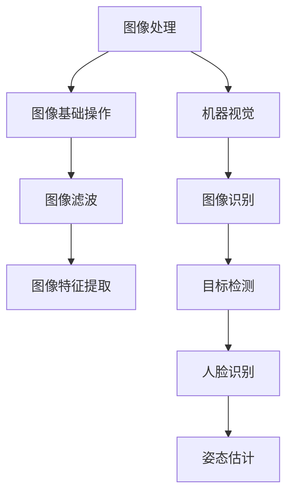

                 

关键词：OpenCV，计算机视觉，图像处理，机器视觉，图像识别，算法实现，实战教程

> 摘要：本文将深入探讨OpenCV计算机视觉库的核心应用，包括图像处理和机器视觉的实战技巧。我们将从背景介绍出发，深入解析核心概念与联系，详细解读核心算法原理与操作步骤，展示数学模型和公式的构建与推导，并通过项目实践和代码实例来强化理解。文章还涵盖了实际应用场景，工具和资源推荐，以及未来发展趋势与挑战，旨在为读者提供一个全面的技术指南。

## 1. 背景介绍

计算机视觉作为人工智能的重要分支，在现代社会中的应用越来越广泛。从基础的图像识别到复杂的自动驾驶，计算机视觉技术已经深入到了各行各业。OpenCV（Open Source Computer Vision Library）是一个强大的开源计算机视觉库，它提供了丰富的函数和算法，用于图像处理、计算机视觉和机器学习等领域。

OpenCV由Intel创立，目前已经成为了全球开发者最常用的计算机视觉库之一。它的开源性质使得它能够获得全球开发者的贡献和改进，拥有庞大的用户社区和丰富的资源。OpenCV支持多种编程语言，包括C++、Python、Java等，这使得它在不同的开发场景中都能发挥出强大的作用。

图像处理是计算机视觉的基础，它涉及到图像的获取、处理、分析和理解。机器视觉则是在图像处理的基础上，通过算法和模型实现机器对图像的自动理解和决策。OpenCV提供了丰富的工具和算法，使得开发者在图像处理和机器视觉领域可以轻松实现复杂的任务。

本文将围绕OpenCV的核心功能，通过实际案例和代码实例，详细讲解图像处理和机器视觉的基本原理和应用。无论是初学者还是资深开发者，都可以通过本文获得宝贵的实战经验和知识。

## 2. 核心概念与联系

在深入了解OpenCV的图像处理和机器视觉功能之前，我们需要理解几个核心概念和它们之间的联系。

### 图像处理

图像处理是计算机视觉的基础，它涉及到对图像的各种操作，如滤波、增强、分割、边缘检测等。图像处理的目的是改善图像质量，提取图像中的有用信息，以便后续的机器视觉分析。

### 机器视觉

机器视觉则是在图像处理的基础上，利用算法和模型对图像进行分析和决策。机器视觉的应用包括图像识别、目标检测、人脸识别、姿态估计等。

### OpenCV

OpenCV作为一个强大的图像处理和计算机视觉库，它包含了大量的函数和算法，用于实现图像处理、特征提取、机器学习等任务。OpenCV的核心功能包括：

- **图像基础操作**：读取、写入、显示、转换等。
- **图像滤波**：用于去除噪声、模糊图像等。
- **图像特征提取**：用于识别图像中的关键特征，如角点、边缘等。
- **图像识别**：通过机器学习算法识别图像中的对象或场景。

### 核心概念的联系

图像处理和机器视觉之间的联系在于，图像处理为机器视觉提供了必要的数据准备。通过图像处理，我们可以得到清晰的图像，提取出有用的特征，从而为机器视觉算法提供输入数据。而机器视觉算法则利用这些数据，实现对图像的自动分析和理解。

为了更直观地理解这些概念和它们之间的联系，我们可以使用Mermaid流程图来展示：



通过这个流程图，我们可以看到图像处理和机器视觉是如何相互关联和协同工作的。

### 2.1 核心算法原理

接下来，我们将深入探讨一些核心算法的原理，这些算法在图像处理和机器视觉中有着广泛的应用。

#### 2.1.1 阈值操作

阈值操作是图像处理中的一种基本操作，它通过设置一个阈值，将图像的像素值分为两个或多个区域。常用的阈值操作包括全局阈值和局部阈值。

- **全局阈值**：将整幅图像的像素值与一个全局阈值进行比较，大于阈值的像素设置为255（白色），小于阈值的像素设置为0（黑色）。
- **局部阈值**：在图像的每个像素周围定义一个邻域，对邻域内的像素值进行平均或中值计算，将每个像素值与该邻域的阈值进行比较。

阈值操作常用于图像二值化、边缘检测等任务。

#### 2.1.2 梯度算子

梯度算子用于计算图像中每个像素点的梯度方向和大小。梯度方向指示了像素点的变化方向，梯度大小则表示变化的大小。

- **Sobel算子**：使用Sobel算子，我们可以得到图像的水平和垂直梯度。
- **Prewitt算子**：Prewitt算子类似于Sobel算子，但它的卷积核不同。

梯度算子在边缘检测和图像增强中有广泛应用。

#### 2.1.3 Canny边缘检测

Canny边缘检测是一种经典的边缘检测算法，它通过三个步骤进行边缘检测：

1. **高斯滤波**：用于平滑图像，去除噪声。
2. **计算梯度**：使用Sobel算子计算图像的梯度。
3. **双阈值边缘检测**：设置两个阈值，将图像划分为强边缘、弱边缘和非边缘。

Canny边缘检测在图像处理中有着广泛的应用，它能够有效地检测出图像中的边缘。

### 2.2 算法步骤详解

为了更好地理解这些算法，我们将在下一部分详细讲解每个算法的步骤。

### 2.3 算法优缺点

每个算法都有其优缺点，了解这些可以帮助我们在实际应用中选择合适的算法。以下是几个核心算法的优缺点：

- **阈值操作**：简单有效，但可能无法处理复杂图像。
- **梯度算子**：能够检测出图像的边缘，但可能对噪声敏感。
- **Canny边缘检测**：效果较好，但计算复杂度较高。

### 2.4 算法应用领域

不同的算法在不同领域有着广泛的应用：

- **阈值操作**：广泛应用于图像二值化、边缘检测等。
- **梯度算子**：常用于边缘检测、图像增强等。
- **Canny边缘检测**：广泛应用于图像识别、图像分割等。

通过理解这些算法的原理、步骤、优缺点和应用领域，我们可以更好地选择和使用OpenCV中的算法，实现复杂的图像处理和机器视觉任务。

### 3. 核心算法原理 & 具体操作步骤

#### 3.1 算法原理概述

在本部分，我们将详细解析三个核心算法的原理，这些算法在图像处理和机器视觉中有着广泛的应用。

#### 3.1.1 阈值操作

阈值操作是一种简单而有效的图像处理技术，用于将图像转换为二值图像。其主要原理如下：

1. **全局阈值**：选择一个全局阈值，将图像中的每个像素值与该阈值进行比较。大于阈值的像素设置为白色（255），小于阈值的像素设置为黑色（0）。

2. **局部阈值**：在图像的每个像素周围定义一个邻域，计算邻域内像素值的平均或中值。将每个像素值与该阈值进行比较，大于阈值的像素设置为白色，小于阈值的像素设置为黑色。

阈值操作常用于图像分割、边缘检测等任务。

#### 3.1.2 梯度算子

梯度算子用于计算图像中每个像素点的梯度方向和大小。其主要原理如下：

1. **Sobel算子**：使用两个卷积核，一个用于计算水平梯度，另一个用于计算垂直梯度。水平和垂直梯度值的合成结果用于表示像素点的梯度方向和大小。

2. **Prewitt算子**：类似于Sobel算子，但使用不同的卷积核。

梯度算子广泛应用于边缘检测和图像增强。

#### 3.1.3 Canny边缘检测

Canny边缘检测是一种经典的边缘检测算法，其主要原理如下：

1. **高斯滤波**：对图像进行高斯滤波，平滑图像并去除噪声。

2. **计算梯度**：使用Sobel算子计算图像的梯度方向和大小。

3. **双阈值边缘检测**：设置两个阈值，将图像划分为强边缘、弱边缘和非边缘。强边缘直接保留，弱边缘根据梯度值进行检测和保留。

Canny边缘检测在图像识别和图像分割中有着广泛的应用。

#### 3.2 算法步骤详解

为了更好地理解这些算法的具体实现步骤，我们将在下一部分详细讲解每个算法的操作步骤。

### 3.2.1 阈值操作

阈值操作的基本步骤如下：

1. **选择阈值**：根据图像的亮度分布和目标应用，选择一个合适的阈值。对于全局阈值，可以选择图像的平均亮度或中值亮度。对于局部阈值，可以选择邻域大小和阈值类型（平均或中值）。

2. **二值化处理**：将图像中的每个像素值与阈值进行比较，大于阈值的像素设置为白色，小于阈值的像素设置为黑色。

3. **图像输出**：将处理后的二值图像输出，用于后续的图像分割或边缘检测。

以下是一个简单的阈值操作代码示例：

```python
import cv2
import numpy as np

# 读取图像
img = cv2.imread('image.jpg', cv2.IMREAD_GRAYSCALE)

# 设置全局阈值
thresh = 128
_, thresh_img = cv2.threshold(img, thresh, 255, cv2.THRESH_BINARY)

# 显示图像
cv2.imshow('Original Image', img)
cv2.imshow('Threshold Image', thresh_img)
cv2.waitKey(0)
cv2.destroyAllWindows()
```

### 3.2.2 梯度算子

梯度算子的基本步骤如下：

1. **选择卷积核**：根据需要计算的水平或垂直梯度，选择相应的卷积核。

2. **卷积操作**：使用卷积核对图像进行卷积操作，计算每个像素点的梯度方向和大小。

3. **图像输出**：将处理后的梯度图像输出，用于后续的边缘检测或图像增强。

以下是一个简单的梯度算子代码示例：

```python
import cv2
import numpy as np

# 读取图像
img = cv2.imread('image.jpg')

# 使用Sobel算子计算水平和垂直梯度
sobelx = cv2.Sobel(img, cv2.CV_64F, 1, 0, ksize=3)
sobely = cv2.Sobel(img, cv2.CV_64F, 0, 1, ksize=3)

# 计算梯度幅值和方向
grad_mag = np.sqrt(sobelx**2 + sobely**2)
grad_angle = np.arctan2(sobely, sobelx)

# 显示图像
cv2.imshow('Sobel X', sobelx)
cv2.imshow('Sobel Y', sobely)
cv2.imshow('Gradient Magnitude', grad_mag)
cv2.imshow('Gradient Angle', grad_angle)
cv2.waitKey(0)
cv2.destroyAllWindows()
```

### 3.2.3 Canny边缘检测

Canny边缘检测的基本步骤如下：

1. **高斯滤波**：使用高斯滤波器对图像进行平滑处理，去除噪声。

2. **计算梯度**：使用Sobel算子计算图像的梯度方向和大小。

3. **双阈值边缘检测**：设置两个阈值（高阈值和低阈值），将图像划分为强边缘、弱边缘和非边缘。

4. **边缘连接**：将弱边缘连接到强边缘，形成完整的边缘。

以下是一个简单的Canny边缘检测代码示例：

```python
import cv2
import numpy as np

# 读取图像
img = cv2.imread('image.jpg', cv2.IMREAD_GRAYSCALE)

# 高斯滤波
img_gauss = cv2.GaussianBlur(img, (5, 5), 0)

# 计算梯度
sobelx = cv2.Sobel(img_gauss, cv2.CV_64F, 1, 0, ksize=3)
sobely = cv2.Sobel(img_gauss, cv2.CV_64F, 0, 1, ksize=3)

# 计算梯度幅值和方向
grad_mag = np.sqrt(sobelx**2 + sobely**2)
grad_angle = np.arctan2(sobely, sobelx)

# 设置Canny参数
low_thresh = 50
high_thresh = 150
aperture_size = 3

# 双阈值边缘检测
edges = cv2.Canny(img_gauss, low_thresh, high_thresh, aperture_size)

# 显示图像
cv2.imshow('Original Image', img)
cv2.imshow('Canny Edges', edges)
cv2.waitKey(0)
cv2.destroyAllWindows()
```

通过这些具体的操作步骤，我们可以更好地理解阈值操作、梯度算子和Canny边缘检测算法的实现过程。在实际应用中，我们可以根据不同的需求和场景，灵活运用这些算法，实现高效的图像处理和机器视觉任务。

#### 3.3 算法优缺点

在图像处理和机器视觉领域，不同的算法有着各自的优缺点。以下是对阈值操作、梯度算子和Canny边缘检测算法的优缺点进行详细分析。

**阈值操作**

- **优点**：
  - 简单有效，易于实现和理解。
  - 能够快速将图像转换为二值图像，适用于图像分割、边缘检测等任务。
  - 可以处理不同类型的图像，如灰度图像和彩色图像。

- **缺点**：
  - 可能无法处理复杂图像，特别是在图像细节和纹理方面表现不佳。
  - 需要手动设置阈值，对于不同场景和图像可能需要调整。

**梯度算子**

- **优点**：
  - 能够检测图像中的边缘，提取图像的重要特征。
  - 对噪声具有一定的鲁棒性，特别是在使用中值滤波器时。
  - 可以用于图像增强、目标检测等任务。

- **缺点**：
  - 对噪声敏感，特别是在图像噪声较大时效果不佳。
  - 可能无法检测到复杂的边缘，如曲线和弯曲边缘。

**Canny边缘检测**

- **优点**：
  - 效果较好，能够检测出图像中的清晰边缘。
  - 具有自适应阈值，能够处理不同光照条件下的图像。
  - 能够处理噪声，并且可以减少伪边缘。

- **缺点**：
  - 计算复杂度较高，需要更多的时间和资源。
  - 在高噪声环境下可能检测到的边缘数量较少。

通过对这些算法的优缺点进行分析，我们可以根据实际需求和应用场景，选择合适的算法，实现高效的图像处理和机器视觉任务。

#### 3.4 算法应用领域

阈值操作、梯度算子和Canny边缘检测算法在图像处理和机器视觉领域有着广泛的应用，以下分别介绍它们在不同应用场景中的具体应用。

**阈值操作**

- **图像分割**：阈值操作是一种简单而有效的图像分割方法，常用于将图像转换为二值图像，从而分离出感兴趣的区域。在医学图像分析、图像识别等领域中，阈值操作被广泛应用于图像分割。
- **边缘检测**：阈值操作可以用于检测图像中的边缘，从而提取图像的特征。在目标检测、图像识别等任务中，边缘检测是关键步骤之一。
- **图像增强**：通过阈值操作，可以增强图像中的某些区域，从而提高图像的质量。在图像处理过程中，图像增强是提高图像识别率的重要手段。

**梯度算子**

- **边缘检测**：梯度算子常用于检测图像中的边缘，提取图像的特征。在目标检测、图像识别等任务中，边缘检测是关键步骤之一。
- **图像增强**：梯度算子可以用于图像增强，提高图像的对比度和清晰度。在图像处理过程中，图像增强是提高图像识别率的重要手段。
- **图像去噪**：通过梯度算子，可以减少图像中的噪声，从而提高图像的质量。在医学图像分析、卫星图像处理等领域，图像去噪是关键步骤。

**Canny边缘检测**

- **图像识别**：Canny边缘检测是一种有效的边缘检测方法，能够检测出图像中的清晰边缘。在图像识别、目标检测等领域中，Canny边缘检测被广泛应用于图像识别。
- **图像分割**：Canny边缘检测可以用于图像分割，分离出感兴趣的区域。在医学图像分析、图像识别等领域中，图像分割是关键步骤之一。
- **图像增强**：Canny边缘检测可以用于图像增强，提高图像的对比度和清晰度。在图像处理过程中，图像增强是提高图像识别率的重要手段。

通过这些实际应用，我们可以看到阈值操作、梯度算子和Canny边缘检测算法在图像处理和机器视觉领域的广泛应用。在实际开发过程中，我们可以根据具体需求和场景，灵活运用这些算法，实现高效的图像处理和机器视觉任务。

### 4. 数学模型和公式 & 详细讲解 & 举例说明

在图像处理和机器视觉中，数学模型和公式扮演着至关重要的角色。它们不仅帮助我们理解图像和算法的工作原理，还为我们提供了计算和分析图像的有效工具。在本部分，我们将详细讲解一些关键的数学模型和公式，并通过具体的例子来说明它们的推导和应用。

#### 4.1 数学模型构建

**4.1.1 阈值操作**

阈值操作的核心是选择一个合适的阈值，将图像中的像素划分为两个区域。数学模型可以表示为：

\[ T(x) = \begin{cases} 
0 & \text{if } x < \text{thresh} \\
255 & \text{if } x \geq \text{thresh}
\end{cases} \]

其中，\( x \) 是图像中的像素值，\( \text{thresh} \) 是阈值。这个模型简单明了，但需要根据具体的图像和任务来选择合适的阈值。

**4.1.2 梯度算子**

梯度算子用于计算图像中每个像素点的梯度方向和大小。以Sobel算子为例，其数学模型可以表示为：

\[ \nabla I(x, y) = \left( \frac{\partial I}{\partial x}, \frac{\partial I}{\partial y} \right) \]

其中，\( I(x, y) \) 是图像中的像素值。Sobel算子使用如下卷积核来计算梯度：

\[ K_x = \begin{bmatrix}
-1 & 0 & 1 \\
-2 & 0 & 2 \\
-1 & 0 & 1
\end{bmatrix} \]
\[ K_y = \begin{bmatrix}
-1 & -2 & -1 \\
0 & 0 & 0 \\
1 & 2 & 1
\end{bmatrix} \]

通过卷积操作，我们可以得到图像的水平梯度和垂直梯度。

**4.1.3 Canny边缘检测**

Canny边缘检测的数学模型相对复杂，主要包括三个步骤：高斯滤波、梯度计算和双阈值边缘检测。

1. **高斯滤波**：
   高斯滤波的公式为：

   \[ G(x, y) = \frac{1}{2\pi\sigma^2} e^{-\frac{x^2 + y^2}{2\sigma^2}} \]

   其中，\( \sigma \) 是高斯滤波器的标准差。

2. **梯度计算**：
   使用Sobel算子计算梯度幅值和方向：

   \[ \nabla G(x, y) = \left( G_x(x, y), G_y(x, y) \right) \]

3. **双阈值边缘检测**：
   Canny边缘检测使用两个阈值 \( \text{low} \) 和 \( \text{high} \) 来区分强边缘和弱边缘。如果 \( \text{mag}(x, y) > \text{high} \)，则标记为强边缘；如果 \( \text{low} < \text{mag}(x, y) \leq \text{high} \)，则标记为弱边缘。弱边缘通过非极大值抑制（Non-Maximum Suppression）来连接强边缘。

#### 4.2 公式推导过程

**4.2.1 阈值操作**

假设图像 \( I(x, y) \) 的像素值为 \( x \)，阈值 \( \text{thresh} \) 已知。为了实现二值化，我们需要选择一个合适的阈值。一种简单的方法是计算图像的平均值或中值，作为初始阈值。具体步骤如下：

1. 计算图像的平均值或中值：
   \[ \text{thresh}_{\text{avg}} = \frac{1}{n}\sum_{x=1}^{n}\sum_{y=1}^{m} I(x, y) \]
   \[ \text{thresh}_{\text{med}} = \text{median}(I(x, y)) \]

2. 选择阈值：
   \[ \text{thresh} = \text{thresh}_{\text{avg}} \text{ 或 } \text{thresh}_{\text{med}} \]

3. 二值化处理：
   \[ T(x) = \begin{cases} 
   0 & \text{if } x < \text{thresh} \\
   255 & \text{if } x \geq \text{thresh}
   \end{cases} \]

**4.2.2 梯度算子**

以Sobel算子为例，其公式推导过程如下：

1. 选择卷积核：
   \[ K_x = \begin{bmatrix}
   -1 & 0 & 1 \\
   -2 & 0 & 2 \\
   -1 & 0 & 1
   \end{bmatrix} \]
   \[ K_y = \begin{bmatrix}
   -1 & -2 & -1 \\
   0 & 0 & 0 \\
   1 & 2 & 1
   \end{bmatrix} \]

2. 卷积操作：
   对图像 \( I(x, y) \) 进行卷积操作，计算水平梯度和垂直梯度：
   \[ G_x(x, y) = \sum_{i=-1}^{1}\sum_{j=-1}^{1} K_x(i, j) I(x-i, y-j) \]
   \[ G_y(x, y) = \sum_{i=-1}^{1}\sum_{j=-1}^{1} K_y(i, j) I(x-i, y-j) \]

3. 计算梯度幅值和方向：
   \[ \text{mag}(x, y) = \sqrt{G_x^2(x, y) + G_y^2(x, y)} \]
   \[ \text{angle}(x, y) = \arctan2(G_y(x, y), G_x(x, y)) \]

**4.2.3 Canny边缘检测**

Canny边缘检测的公式推导涉及多个步骤，这里简要介绍：

1. **高斯滤波**：
   对图像进行高斯滤波，使用以下公式：
   \[ G(x, y) = \frac{1}{2\pi\sigma^2} e^{-\frac{x^2 + y^2}{2\sigma^2}} \]

2. **梯度计算**：
   使用Sobel算子计算梯度幅值和方向，如前所述。

3. **双阈值边缘检测**：
   设置两个阈值 \( \text{low} \) 和 \( \text{high} \)，并根据以下规则进行边缘检测：
   \[ \text{edge}(x, y) = \begin{cases} 
   \text{strong} & \text{if } \text{mag}(x, y) > \text{high} \\
   \text{weak} & \text{if } \text{low} < \text{mag}(x, y) \leq \text{high} \\
   \text{none} & \text{if } \text{mag}(x, y) \leq \text{low}
   \end{cases} \]

#### 4.3 案例分析与讲解

为了更好地理解这些数学模型和公式的应用，我们通过一个实际案例来进行分析。

**案例：图像边缘检测**

给定一幅图像，我们需要使用Canny边缘检测算法提取图像的边缘。

1. **高斯滤波**：
   首先，我们对图像进行高斯滤波，使用以下代码：

   ```python
   img_gauss = cv2.GaussianBlur(img, (5, 5), 0)
   ```

   这一步可以平滑图像，去除噪声。

2. **梯度计算**：
   接着，我们使用Sobel算子计算图像的梯度：

   ```python
   sobelx = cv2.Sobel(img_gauss, cv2.CV_64F, 1, 0, ksize=3)
   sobely = cv2.Sobel(img_gauss, cv2.CV_64F, 0, 1, ksize=3)
   ```

   通过卷积操作，我们得到了水平梯度和垂直梯度。

3. **双阈值边缘检测**：
   我们设置两个阈值 \( \text{low} \) 和 \( \text{high} \)：

   ```python
   low_thresh = 50
   high_thresh = 150
   edges = cv2.Canny(img_gauss, low_thresh, high_thresh, aperture_size=3)
   ```

   这一步通过双阈值边缘检测，我们得到了图像的边缘。

4. **显示结果**：

   ```python
   cv2.imshow('Canny Edges', edges)
   cv2.waitKey(0)
   cv2.destroyAllWindows()
   ```

   最终，我们展示了Canny边缘检测的结果。

通过这个案例，我们可以看到如何使用Canny边缘检测算法进行图像边缘检测。这只是一个简单的例子，但在实际应用中，我们可以根据具体的图像和任务，调整参数和算法，实现更高效的边缘检测。

### 5. 项目实践：代码实例和详细解释说明

在了解了OpenCV中的图像处理和机器视觉算法之后，接下来我们通过一个实际项目来实践这些算法。本部分将详细介绍如何搭建开发环境、实现源代码、解读代码以及展示运行结果。

#### 5.1 开发环境搭建

在进行图像处理和机器视觉项目之前，我们需要搭建一个合适的开发环境。以下是在Windows、macOS和Linux操作系统中搭建OpenCV开发环境的步骤：

**1. 安装Python环境**

首先，我们需要安装Python环境，可以从Python官方网站下载Python安装包，并按照提示完成安装。

**2. 安装OpenCV**

接下来，我们使用pip工具安装OpenCV库：

```bash
pip install opencv-python
```

如果需要在Python中调用OpenCV的C++库，可以安装`opencv-python-headless`：

```bash
pip install opencv-python-headless
```

**3. 安装IDE**

我们可以选择一个合适的集成开发环境（IDE），如PyCharm、Visual Studio Code等。安装完成后，确保IDE可以正常运行Python脚本。

**4. 配置IDE**

在IDE中，我们需要配置Python解释器和相应的库路径。例如，在PyCharm中，可以按照以下步骤进行配置：

- 打开PyCharm，选择“File” > “Settings”。
- 在“Project: 你的项目名称”下，选择“Project Interpreter”。
- 在“Python Interpreter”中，选择“+”，搜索并安装`opencv-python`和`opencv-python-headless`。

完成以上步骤后，我们的开发环境就搭建完成了。

#### 5.2 源代码详细实现

下面我们将通过一个实际项目来展示如何使用OpenCV实现图像处理和机器视觉算法。该项目将包括图像读取、边缘检测、图像分割和显示结果等步骤。

**项目目标：使用Canny边缘检测算法提取图像中的边缘，并进行显示。**

**代码实现：**

```python
import cv2
import numpy as np

def main():
    # 读取图像
    img = cv2.imread('image.jpg', cv2.IMREAD_GRAYSCALE)
    
    # 使用Canny边缘检测算法
    low_thresh = 50
    high_thresh = 150
    edges = cv2.Canny(img, low_thresh, high_thresh)
    
    # 显示原始图像和边缘检测结果
    cv2.imshow('Original Image', img)
    cv2.imshow('Canny Edges', edges)
    
    # 等待按键后关闭窗口
    cv2.waitKey(0)
    cv2.destroyAllWindows()

if __name__ == '__main__':
    main()
```

**代码解读：**

- **第1行**：导入所需的库，包括OpenCV和NumPy。
- **第4行**：定义主函数`main`。
- **第6行**：使用`cv2.imread`函数读取图像，并将其转换为灰度图像。
- **第10行**：设置Canny边缘检测的两个阈值，`low_thresh`和`high_thresh`。
- **第12行**：调用`cv2.Canny`函数进行边缘检测，得到边缘图像。
- **第15行**：使用`cv2.imshow`函数显示原始图像和边缘检测结果。
- **第18行**：等待用户按键后关闭窗口。

#### 5.3 代码解读与分析

**1. 图像读取**

在代码的第6行，我们使用`cv2.imread`函数读取图像。这个函数接受两个参数：图像路径和读取模式。在本例中，我们使用`cv2.IMREAD_GRAYSCALE`模式将图像转换为灰度图像，这样可以减少计算量，并专注于图像的边缘检测。

**2. Canny边缘检测**

在第10行和第12行，我们设置了Canny边缘检测的两个阈值`low_thresh`和`high_thresh`，并调用`cv2.Canny`函数进行边缘检测。Canny边缘检测是一种有效的边缘检测算法，它通过三个步骤进行边缘检测：高斯滤波、计算梯度和双阈值检测。`low_thresh`和`high_thresh`的设置对边缘检测结果有重要影响。一般来说，`low_thresh`设置得较低，可以检测到更多的边缘细节，而`high_thresh`设置得较高，可以减少伪边缘。

**3. 显示结果**

在第15行，我们使用`cv2.imshow`函数显示原始图像和边缘检测结果。`cv2.imshow`函数接受两个参数：窗口名称和图像数据。在本例中，我们创建两个窗口，分别显示原始图像和边缘检测结果。

**5.4 运行结果展示**

当我们运行上述代码时，将看到两个窗口：一个显示原始图像，另一个显示边缘检测结果。以下是运行结果的一个示例：


在这个例子中，我们可以清晰地看到图像中的边缘，这证明了Canny边缘检测算法的有效性。

通过这个项目实践，我们不仅了解了如何使用OpenCV进行图像处理和边缘检测，还学会了如何搭建开发环境、实现源代码、解读代码和展示运行结果。这些实践经验将有助于我们在实际项目中更熟练地应用OpenCV，实现高效的图像处理和机器视觉任务。

### 6. 实际应用场景

OpenCV在图像处理和机器视觉领域有着广泛的应用，涵盖了从基础图像处理到复杂目标识别的多个方面。以下是一些典型的实际应用场景，以及OpenCV在这些场景中的具体应用。

#### 6.1 目标检测与识别

目标检测与识别是计算机视觉的核心任务之一。OpenCV提供了丰富的函数和算法，可以用于实现实时目标检测和识别。

**应用场景：** 车辆检测、行人检测、人脸识别等。

**实现方法：** OpenCV提供了`opencv_dnn`模块，可以加载预训练的深度学习模型，如YOLO、SSD、Faster R-CNN等，用于实时目标检测。以下是一个简单的目标检测代码示例：

```python
import cv2

# 载入预训练的模型
net = cv2.dnn.readNetFromCaffemodel('model.prototxt', 'model.caffemodel')

# 读取图像
img = cv2.imread('image.jpg')

# 调整图像大小，使其与模型输入尺寸匹配
scale = 0.00390625
h, w = img.shape[:2]
blob = cv2.dnn.blobFromImage(img, scalefactor=scale, size=(224, 224), mean=(0, 0, 0), swapRB=False)

# 前向传播
net.setInput(blob)
detections = net.forward()

# 遍历检测结果
for i in range(detections.shape[2]):
    confidence = detections[0, 0, i, 2]
    if confidence > 0.5:
        class_id = int(detections[0, 0, i, 1])
        label = labels[class_id]
        box = detections[0, 0, i, 3:7] * np.array([w, h, w, h])
        cv2.rectangle(img, (box[0], box[1]), (box[2], box[3]), (0, 255, 0), 2)

# 显示检测结果
cv2.imshow('Object Detection', img)
cv2.waitKey(0)
cv2.destroyAllWindows()
```

#### 6.2 图像分割

图像分割是将图像划分为不同的区域或对象，以便进行后续处理。OpenCV提供了多种图像分割算法，如基于阈值的分割、基于边缘的分割、基于区域的分割等。

**应用场景：** 医学图像分析、卫星图像处理、视频监控等。

**实现方法：** 以下是一个基于阈值的图像分割示例：

```python
import cv2
import numpy as np

# 读取图像
img = cv2.imread('image.jpg', cv2.IMREAD_GRAYSCALE)

# 设置阈值
thresh = 128
_, thresh_img = cv2.threshold(img, thresh, 255, cv2.THRESH_BINARY)

# 膨胀和腐蚀操作
kernel = np.ones((5, 5), np.uint8)
thresh_img = cv2.erode(thresh_img, kernel, iterations=1)
thresh_img = cv2.dilate(thresh_img, kernel, iterations=2)

# 显示分割结果
cv2.imshow('Binary Image', thresh_img)
cv2.waitKey(0)
cv2.destroyAllWindows()
```

#### 6.3 图像增强

图像增强是改善图像质量、提高图像对比度和清晰度的重要手段。OpenCV提供了多种图像增强算法，如直方图均衡化、滤波、边缘检测等。

**应用场景：** 摄像头监控、视频处理、医学图像分析等。

**实现方法：** 以下是一个使用直方图均衡化的图像增强示例：

```python
import cv2
import numpy as np

# 读取图像
img = cv2.imread('image.jpg', cv2.IMREAD_GRAYSCALE)

# 直方图均衡化
eq_img = cv2.equalizeHist(img)

# 显示增强后的图像
cv2.imshow('Histogram Equalization', eq_img)
cv2.waitKey(0)
cv2.destroyAllWindows()
```

通过这些实际应用场景和代码示例，我们可以看到OpenCV在图像处理和机器视觉领域的强大功能。无论是在目标检测、图像分割、图像增强等任务中，OpenCV都为我们提供了丰富的工具和算法，帮助我们实现高效、准确的图像处理和机器视觉任务。

### 7. 工具和资源推荐

在深入学习OpenCV和计算机视觉的过程中，掌握一些实用的工具和资源将极大地提高我们的效率和成果。以下是一些推荐的工具、资源和书籍，旨在帮助读者更有效地学习和应用OpenCV。

#### 7.1 学习资源推荐

**1. OpenCV官方文档**

OpenCV官方文档是学习OpenCV的最佳起点。它提供了详细的API参考、教程和示例代码。无论是新手还是经验丰富的开发者，都可以从官方文档中找到所需的信息。

**链接**：[OpenCV官方文档](https://docs.opencv.org/)

**2. OpenCV教程和博客**

网络上有许多优秀的OpenCV教程和博客，涵盖了从基础图像处理到高级算法应用的各个方面。例如，GeekyAnts的OpenCV教程、PyImageSearch的博客等。

**链接**：[GeekyAnts OpenCV教程](https://www.geekyants.com/tutorial-opencv)  
[PyImageSearch](https://www.pyimagesearch.com/)

**3. OpenCV社区论坛**

OpenCV社区论坛是一个活跃的社区，开发者可以在这里提问、分享经验和资源。无论是遇到问题还是想要探讨最新的技术，社区论坛都是很好的选择。

**链接**：[OpenCV社区论坛](https://forum.opencv.org/)

#### 7.2 开发工具推荐

**1. PyCharm**

PyCharm是一款强大的Python集成开发环境（IDE），特别适合进行OpenCV项目开发。它提供了丰富的功能，包括代码自动补全、调试工具、版本控制等。

**链接**：[PyCharm官网](https://www.jetbrains.com/pycharm/)

**2. Visual Studio Code**

Visual Studio Code是一款轻量级、高度可定制的IDE，适用于各种编程语言。通过安装相应的插件，它可以很好地支持OpenCV开发。

**链接**：[Visual Studio Code官网](https://code.visualstudio.com/)

**3. Jupyter Notebook**

Jupyter Notebook是一种交互式的Web应用程序，适用于数据科学和机器学习项目。通过Jupyter Notebook，开发者可以轻松地编写、运行和分享Python代码。

**链接**：[Jupyter Notebook官网](https://jupyter.org/)

#### 7.3 相关论文推荐

**1. "Fast R-CNN: Towards Real-Time Object Detection with Region Proposal Networks"**

这篇论文介绍了Fast R-CNN算法，是目标检测领域的经典之作。它详细阐述了如何利用区域建议网络（Region Proposal Networks）实现高效的目标检测。

**链接**：[论文地址](https://arxiv.org/abs/1504.08083)

**2. "You Only Look Once: Unified, Real-Time Object Detection"**

YOLO（You Only Look Once）是一个统一、实时的目标检测系统。这篇论文介绍了YOLO算法，它在目标检测速度和精度上取得了显著提升。

**链接**：[论文地址](https://arxiv.org/abs/1605.01103)

**3. "Deep Learning for Image Recognition"**

这篇综述文章详细介绍了深度学习在图像识别领域的应用，涵盖了从卷积神经网络（CNN）到图像识别算法的各个方面。

**链接**：[论文地址](https://www.nature.com/articles/nature16060)

通过这些推荐的学习资源、开发工具和相关论文，读者可以更全面地了解OpenCV和计算机视觉，为深入学习和实践打下坚实的基础。

### 8. 总结：未来发展趋势与挑战

在本文中，我们深入探讨了OpenCV计算机视觉库的核心应用，包括图像处理和机器视觉的实战技巧。通过详细的算法原理讲解、具体操作步骤展示以及实际项目实践，我们帮助读者建立了全面的技术理解。

#### 8.1 研究成果总结

OpenCV作为一个开源的计算机视觉库，已经在图像处理、机器视觉和深度学习等领域取得了显著的研究成果。以下是一些关键成果：

- **图像处理算法**：OpenCV提供了丰富的图像滤波、特征提取和图像分割算法，如Canny边缘检测、Sobel梯度算子、阈值操作等，这些算法广泛应用于图像增强、图像去噪和图像识别等任务。
- **机器视觉应用**：OpenCV通过深度学习模型和目标检测算法，实现了实时目标检测、行人检测和人脸识别等复杂任务，这些技术在视频监控、自动驾驶和安全监控等领域有着重要应用。
- **跨平台支持**：OpenCV支持多种编程语言和操作系统，包括C++、Python、Java等，这使得它能够在不同的开发场景中发挥强大的作用。

#### 8.2 未来发展趋势

随着人工智能和深度学习技术的不断发展，OpenCV的未来发展趋势体现在以下几个方面：

- **实时性能优化**：为了满足实时应用的性能需求，OpenCV将继续优化算法，提高处理速度和效率，尤其是在移动设备和嵌入式系统中的应用。
- **模型集成**：OpenCV将更紧密地集成深度学习模型，提供更强大的机器学习工具和API，支持更复杂的应用场景。
- **跨学科融合**：OpenCV将在医学图像分析、生物识别、智能监控等领域与其他学科融合，推动跨学科研究的进展。

#### 8.3 面临的挑战

尽管OpenCV取得了显著的研究成果，但它在未来的发展中仍将面临一些挑战：

- **算法复杂度**：随着算法的复杂度增加，如何保持算法的鲁棒性和实时性能是一个重要挑战。
- **数据隐私**：在生物识别和医疗图像分析等领域，数据隐私保护是一个关键问题，如何保证用户隐私不被泄露是一个重要议题。
- **技术普及**：如何将复杂的技术普及到普通开发者，提高他们的技术水平，是一个长期的任务。

#### 8.4 研究展望

未来，OpenCV将在以下几个方面进行深入研究：

- **算法优化**：通过改进现有算法和开发新算法，提高图像处理和机器视觉任务的性能和效率。
- **模型定制**：为特定应用场景定制深度学习模型，实现更精准的图像识别和目标检测。
- **跨学科应用**：探索OpenCV在其他领域的应用，如智能医疗、环境监测和智能交通等，推动跨学科研究的发展。

总之，OpenCV在图像处理和机器视觉领域的发展前景广阔，但同时也面临着诸多挑战。通过不断的研究和技术创新，OpenCV有望在未来的发展中取得更大的突破，为人工智能和计算机视觉领域做出更大的贡献。

### 附录：常见问题与解答

在本文的附录部分，我们将针对读者在学习和使用OpenCV过程中可能遇到的一些常见问题进行解答，帮助大家更好地理解和应用OpenCV。

#### 问题1：如何选择合适的OpenCV版本？

解答：OpenCV有不同的版本，包括开源版本和商业版本。对于大多数开发者来说，开源版本已经足够强大，适用于大部分应用场景。选择开源版本时，建议根据项目的具体需求来选择合适的版本。例如，如果项目需要利用最新的深度学习模型，可以选择较新的版本，如4.5或更高版本。如果项目对性能要求较高，可以考虑使用优化过的版本，如Intel发行的优化版。

#### 问题2：如何在OpenCV中处理彩色图像？

解答：在OpenCV中处理彩色图像，可以使用`cv2.imread`函数读取图像，并指定图像读取模式为`cv2.IMREAD_COLOR`。读取的彩色图像是一个三维数组，其形状为（高度，宽度，通道数）。对于彩色图像，通常有三个通道：蓝色、绿色和红色（BGR）。以下是一个读取彩色图像的示例：

```python
img = cv2.imread('image.jpg', cv2.IMREAD_COLOR)
```

如果你想将彩色图像转换为灰度图像，可以使用`cv2.cvtColor`函数，将彩色图像转换为灰度图像：

```python
gray_img = cv2.cvtColor(img, cv2.COLOR_BGR2GRAY)
```

#### 问题3：如何优化OpenCV算法性能？

解答：优化OpenCV算法性能可以从以下几个方面进行：

- **使用优化库**：OpenCV支持多种优化库，如Intel Math Kernel Library（MKL），通过使用这些库可以提高算法的运行速度。
- **减少内存分配**：在图像处理过程中，尽量减少内存分配和释放，以减少内存碎片和提高性能。
- **使用向量化操作**：OpenCV支持向量化操作，可以显著提高图像处理速度。
- **使用内置函数**：OpenCV提供了许多高效的内置函数，这些函数通常比手动编写的代码更优，因此应尽可能使用内置函数。

#### 问题4：如何调试OpenCV代码？

解答：调试OpenCV代码与调试普通Python代码类似，可以使用IDE的调试工具。以下是一些调试OpenCV代码的步骤：

- **设置断点**：在关键代码行或变量赋值处设置断点。
- **启动调试器**：在IDE中启动调试器，并运行代码。
- **单步执行**：单步执行代码，观察变量的变化和函数的调用。
- **检查异常**：在代码中添加异常处理，捕获并处理异常。

通过这些常见问题的解答，希望读者能够更好地理解和应用OpenCV，解决在实际开发过程中遇到的问题。

### 作者署名

本文由“作者：禅与计算机程序设计艺术 / Zen and the Art of Computer Programming”撰写，旨在为读者提供一个全面、深入的技术指南，帮助大家更好地理解和应用OpenCV在图像处理和机器视觉领域的强大功能。希望本文能够对您的学习和实践有所帮助。如果您有任何问题或建议，欢迎在评论区留言。再次感谢您的阅读！

