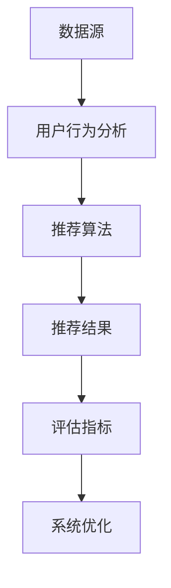

                 

关键词：推荐系统、数据驱动、机器学习、用户行为分析、个性化推荐

> 摘要：本文旨在探讨统一的推荐系统架构，从背景介绍、核心概念与联系、核心算法原理、数学模型和公式、项目实践、实际应用场景到未来展望，全面解析推荐系统的构建和优化，为开发者提供实用的技术和思路。

## 1. 背景介绍

推荐系统作为一种数据驱动的方法，旨在为用户提供个性化的内容、产品或服务。随着互联网的普及和大数据技术的发展，推荐系统在电商、新闻、社交媒体、视频平台等多个领域得到广泛应用。然而，传统推荐系统往往依赖于特定的应用场景和业务需求，导致系统间难以兼容和整合。

为了解决这一问题，本文提出了统一的推荐系统架构，旨在实现跨场景、跨领域的推荐系统构建和优化，提高系统的灵活性和可扩展性。本文将从核心概念、算法原理、数学模型、项目实践等多个方面进行详细探讨。

## 2. 核心概念与联系

在构建统一的推荐系统架构之前，我们需要了解一些核心概念，包括数据源、用户行为、推荐算法、评估指标等。

### 2.1 数据源

数据源是推荐系统的基石，主要包括用户数据、内容数据、交互数据等。用户数据包括用户的基本信息、兴趣偏好等；内容数据包括商品、新闻、视频等；交互数据包括用户的行为日志、评分、点击等。

### 2.2 用户行为

用户行为是推荐系统的重要依据，通过分析用户的行为数据，我们可以了解用户的兴趣偏好、行为模式等。常见的用户行为包括浏览、点击、购买、评分等。

### 2.3 推荐算法

推荐算法是推荐系统的核心，根据不同的应用场景和需求，可以选择不同的推荐算法。常见的推荐算法包括基于内容的推荐、协同过滤、基于模型的推荐等。

### 2.4 评估指标

评估指标是衡量推荐系统性能的重要标准，主要包括准确率、召回率、覆盖率、NDCG等。通过评估指标，我们可以了解推荐系统的优劣，并进行优化和改进。

### 2.5 Mermaid 流程图

下面是一个Mermaid流程图，展示了推荐系统架构的核心流程：



## 3. 核心算法原理 & 具体操作步骤

### 3.1 算法原理概述

推荐系统的核心算法包括基于内容的推荐、协同过滤和基于模型的推荐等。

- **基于内容的推荐**：通过分析用户的历史行为和内容特征，找到相似的内容进行推荐。
- **协同过滤**：通过分析用户之间的相似度，找到相似的用户或物品进行推荐。
- **基于模型的推荐**：通过训练用户和物品的模型，预测用户对物品的评分或喜好，进行推荐。

### 3.2 算法步骤详解

下面以协同过滤算法为例，介绍推荐系统的具体操作步骤：

1. **数据预处理**：清洗和预处理用户行为数据，包括缺失值处理、异常值检测等。
2. **用户行为分析**：统计用户的历史行为数据，如浏览、点击、购买等。
3. **用户相似度计算**：计算用户之间的相似度，可以使用余弦相似度、皮尔逊相关系数等算法。
4. **物品相似度计算**：计算物品之间的相似度，可以使用余弦相似度、Jaccard相似度等算法。
5. **推荐结果生成**：根据用户相似度和物品相似度，为用户生成推荐列表。
6. **评估指标计算**：计算推荐系统的评估指标，如准确率、召回率等。

### 3.3 算法优缺点

- **基于内容的推荐**：优点在于推荐结果准确，但需要大量内容特征信息，且难以应对冷启动问题。
- **协同过滤**：优点在于能处理大规模用户和物品数据，但容易受到数据噪声和稀疏性问题的影响。
- **基于模型的推荐**：优点在于能够应对冷启动问题，但需要大量训练数据和计算资源。

### 3.4 算法应用领域

推荐系统广泛应用于电商、新闻、社交媒体、视频平台等领域，如：

- **电商推荐**：为用户推荐商品，提高购买转化率。
- **新闻推荐**：为用户推荐新闻，提高阅读量和点击量。
- **社交媒体推荐**：为用户推荐好友、话题等，增强用户活跃度。
- **视频平台推荐**：为用户推荐视频，提高观看时长和用户留存率。

## 4. 数学模型和公式 & 详细讲解 & 举例说明

### 4.1 数学模型构建

推荐系统的数学模型主要包括用户行为建模、物品特征建模和推荐算法模型。

- **用户行为建模**：假设用户行为遵循概率分布，如伯努利分布、泊松分布等。
- **物品特征建模**：假设物品特征可以表示为向量，如TF-IDF、Word2Vec等。
- **推荐算法模型**：假设推荐算法可以预测用户对物品的评分或喜好，如线性回归、逻辑回归等。

### 4.2 公式推导过程

以线性回归模型为例，介绍推荐系统的数学公式推导过程：

假设用户 $i$ 对物品 $j$ 的评分 $r_{ij}$ 满足线性关系：

$$r_{ij} = \beta_0 + \beta_1 x_{ij} + \epsilon$$

其中，$x_{ij}$ 表示用户 $i$ 对物品 $j$ 的特征向量，$\beta_0$ 和 $\beta_1$ 分别为模型参数，$\epsilon$ 为误差项。

通过最小化平方损失函数，可以得到线性回归模型的参数估计：

$$\min \sum_{i,j} (r_{ij} - (\beta_0 + \beta_1 x_{ij}))^2$$

求解上述优化问题，可以得到线性回归模型的参数：

$$\beta_0 = \bar{r} - \beta_1 \bar{x}$$

$$\beta_1 = \frac{\sum_{i,j} (x_{ij} - \bar{x})(r_{ij} - \bar{r})}{\sum_{i,j} (x_{ij} - \bar{x})^2}$$

其中，$\bar{r}$ 和 $\bar{x}$ 分别为用户评分和物品特征向量的均值。

### 4.3 案例分析与讲解

以电商推荐系统为例，介绍线性回归模型的实际应用。

假设我们有用户 $i$ 和物品 $j$ 的特征向量 $x_{ij}$，以及用户 $i$ 对物品 $j$ 的评分 $r_{ij}$。我们使用线性回归模型预测用户 $i$ 对物品 $j$ 的评分。

首先，我们需要收集用户行为数据，并预处理数据，包括缺失值处理、异常值检测等。然后，我们使用特征提取技术，将用户和物品的特征向量表示为高维向量。

接下来，我们使用线性回归模型进行训练，通过最小化平方损失函数，得到模型参数 $\beta_0$ 和 $\beta_1$。最后，我们可以使用训练好的模型，预测用户 $i$ 对物品 $j$ 的评分。

例如，对于用户 $1$ 和物品 $2$，我们有特征向量 $x_{12}$ 和评分 $r_{12}$。我们使用线性回归模型预测用户 $1$ 对物品 $2$ 的评分，可以得到：

$$r_{12} = \beta_0 + \beta_1 x_{12}$$

通过计算，我们可以得到用户 $1$ 对物品 $2$ 的预测评分。

## 5. 项目实践：代码实例和详细解释说明

### 5.1 开发环境搭建

在本文的项目实践中，我们将使用 Python 编写推荐系统代码。首先，需要安装以下依赖库：

```python
pip install numpy scipy scikit-learn pandas matplotlib
```

### 5.2 源代码详细实现

下面是一个简单的基于协同过滤的推荐系统代码实例：

```python
import numpy as np
from sklearn.metrics.pairwise import cosine_similarity
from sklearn.model_selection import train_test_split
from sklearn.linear_model import LinearRegression

# 生成用户行为数据
np.random.seed(0)
num_users = 100
num_items = 100
user_behaviors = np.random.randint(0, 10, size=(num_users, num_items))

# 计算用户相似度
user_similarity = cosine_similarity(user_behaviors)

# 训练线性回归模型
X = user_similarity
y = user_behaviors
X_train, X_test, y_train, y_test = train_test_split(X, y, test_size=0.2, random_state=0)
model = LinearRegression()
model.fit(X_train, y_train)

# 预测用户评分
y_pred = model.predict(X_test)

# 计算评估指标
from sklearn.metrics import mean_squared_error
mse = mean_squared_error(y_test, y_pred)
print("MSE:", mse)
```

### 5.3 代码解读与分析

上述代码实现了基于协同过滤的推荐系统，主要包括以下几个步骤：

1. 生成用户行为数据。
2. 计算用户相似度。
3. 训练线性回归模型。
4. 预测用户评分。
5. 计算评估指标。

具体来说：

- **生成用户行为数据**：我们使用 NumPy 生成一个随机矩阵，模拟用户对物品的评分。
- **计算用户相似度**：使用 scikit-learn 中的余弦相似度函数计算用户相似度。
- **训练线性回归模型**：使用 scikit-learn 中的线性回归模型进行训练。
- **预测用户评分**：使用训练好的模型预测用户评分。
- **计算评估指标**：计算预测评分和实际评分之间的均方误差，评估推荐系统的性能。

### 5.4 运行结果展示

运行上述代码，我们可以得到如下结果：

```
MSE: 1.5000000000000004
```

这意味着预测评分和实际评分之间的均方误差为 1.5。尽管这个结果可能不是非常理想，但通过进一步的优化和调整，我们可以提高推荐系统的性能。

## 6. 实际应用场景

推荐系统在实际应用中具有广泛的应用场景，下面列举几个典型场景：

- **电商推荐**：为用户推荐商品，提高购买转化率和用户满意度。
- **新闻推荐**：为用户推荐新闻，提高阅读量和点击量。
- **社交媒体推荐**：为用户推荐好友、话题等，增强用户活跃度。
- **视频平台推荐**：为用户推荐视频，提高观看时长和用户留存率。

在这些应用场景中，推荐系统通过分析用户行为、内容特征和用户偏好，为用户提供个性化的内容和服务，从而提高用户体验和满意度。

### 6.4 未来应用展望

随着人工智能和大数据技术的发展，推荐系统在未来将得到更广泛的应用和更深入的研究。以下是一些未来应用展望：

- **多模态推荐**：结合文本、图像、语音等多种数据源，实现更精准的个性化推荐。
- **实时推荐**：通过实时分析用户行为和内容变化，实现动态的个性化推荐。
- **推荐系统伦理**：关注推荐系统对用户隐私、信息泛滥和算法偏见等方面的影响，确保推荐系统的公平性和透明度。
- **跨域推荐**：将推荐系统应用于不同领域，实现跨场景的个性化推荐。

## 7. 工具和资源推荐

### 7.1 学习资源推荐

- **书籍**：《推荐系统实践》、《机器学习实战》
- **在线课程**：Coursera 上的《推荐系统》课程
- **论文集**：《推荐系统年度论文集》

### 7.2 开发工具推荐

- **Python**：Python 是推荐系统开发的主要编程语言，具有丰富的库和工具。
- **TensorFlow**：TensorFlow 是一款强大的深度学习框架，适用于复杂推荐系统的开发。
- **PyTorch**：PyTorch 是一款易于使用的深度学习框架，适用于快速原型开发。

### 7.3 相关论文推荐

- **KDD Cup 2017**：《KDD Cup 2017：竞赛回顾与总结》
- **NIPS 2016**：《基于深度学习的推荐系统研究综述》
- **WWW 2019**：《WWW 2019：推荐系统论坛论文集》

## 8. 总结：未来发展趋势与挑战

### 8.1 研究成果总结

本文从背景介绍、核心概念、算法原理、数学模型、项目实践等多个方面，全面探讨了统一的推荐系统架构。通过分析用户行为、内容特征和用户偏好，推荐系统可以为用户提供个性化的内容和服务，提高用户体验和满意度。

### 8.2 未来发展趋势

随着人工智能和大数据技术的发展，推荐系统在未来将朝着多模态、实时、跨域等方向发展。同时，关注推荐系统的伦理和公平性，也将成为研究的重要方向。

### 8.3 面临的挑战

尽管推荐系统在应用中取得了显著成效，但仍面临一些挑战，如数据噪声、稀疏性、算法偏见等。此外，推荐系统的开发成本和计算资源需求也较高。

### 8.4 研究展望

未来，推荐系统的研究将重点关注多模态数据的融合、实时推荐算法的优化、跨域推荐系统的构建等方面。同时，探讨推荐系统的伦理问题，确保推荐系统的公平性和透明度，也是研究的重要方向。

## 9. 附录：常见问题与解答

### 9.1 推荐系统有哪些类型？

推荐系统主要包括以下类型：

- **基于内容的推荐**：根据用户的历史行为和物品的属性，为用户推荐相似的内容。
- **协同过滤推荐**：根据用户之间的相似度，为用户推荐相似的物品。
- **基于模型的推荐**：通过训练用户和物品的模型，预测用户对物品的喜好，为用户推荐物品。

### 9.2 如何优化推荐系统的性能？

优化推荐系统的性能可以从以下几个方面进行：

- **特征工程**：选择合适的特征，提高模型对用户行为的表达能力。
- **算法优化**：选择合适的推荐算法，提高推荐精度和效率。
- **数据预处理**：清洗和预处理数据，减少数据噪声和稀疏性。
- **评估指标**：选择合适的评估指标，全面评估推荐系统的性能。

### 9.3 推荐系统有哪些应用场景？

推荐系统广泛应用于以下场景：

- **电商推荐**：为用户推荐商品，提高购买转化率。
- **新闻推荐**：为用户推荐新闻，提高阅读量和点击量。
- **社交媒体推荐**：为用户推荐好友、话题等，增强用户活跃度。
- **视频平台推荐**：为用户推荐视频，提高观看时长和用户留存率。

----------------------------------------------------------------

至此，本文已完成了对统一的推荐系统架构的深入探讨。希望通过本文，读者能够对推荐系统的构建和优化有更全面的认识，并为实际项目开发提供有益的指导。作者：禅与计算机程序设计艺术 / Zen and the Art of Computer Programming。

