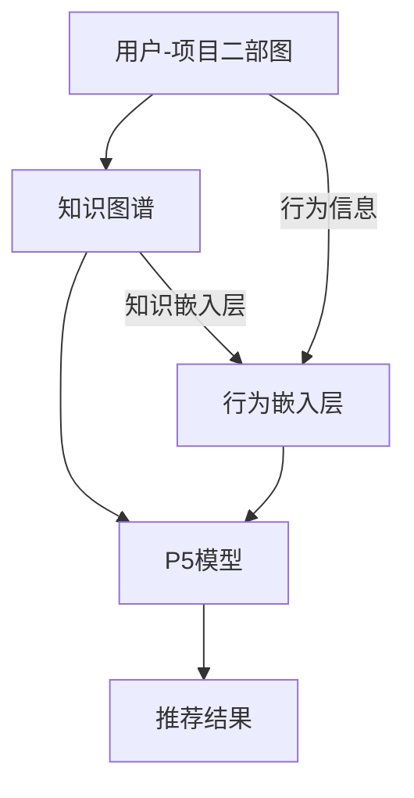

                 

关键词：P5模型、推荐系统、任务解决方案、算法原理、数学模型、项目实践、应用场景

## 摘要

本文旨在深入探讨P5模型在推荐系统中的广泛应用价值，通过详尽的算法原理解析、数学模型构建、项目实践案例展示，以及未来趋势预测，揭示P5模型作为统一任务解决方案在提升推荐系统性能和用户体验方面的巨大潜力。文章将分为背景介绍、核心概念与联系、核心算法原理与步骤、数学模型与公式、项目实践、实际应用场景、工具和资源推荐、总结与展望等章节，力求为读者提供全面而深入的理解。

## 1. 背景介绍

推荐系统作为现代信息社会中不可或缺的组成部分，其核心目标是通过个性化推荐来提高用户满意度和参与度。传统的推荐系统方法如基于内容的推荐和协同过滤推荐，虽然在一定程度上满足了用户的需求，但仍然存在诸如冷启动问题、数据稀疏性和推荐多样性不足等问题。

近年来，深度学习在推荐系统中的应用逐渐成为研究热点。深度学习模型能够自动从大规模数据中学习复杂的用户行为和偏好模式，从而提供更为精准的推荐结果。然而，深度学习模型往往需要大量的数据和计算资源，并且在模型解释性和可扩展性方面存在一定的局限性。

为了解决上述问题，研究者们提出了P5模型。P5模型是基于图神经网络（Graph Neural Networks, GNNs）的一种新型推荐系统模型，旨在通过融合用户-项目二部图（User-Item Bipartite Graph）和知识图谱（Knowledge Graph）的信息，实现推荐系统的高效和智能。

本文将详细探讨P5模型的工作原理、数学模型、具体实现和应用场景，以期为其在推荐系统中的应用提供全面而深入的指导。

## 2. 核心概念与联系

### 2.1. 推荐系统的基本概念

推荐系统（Recommender System）是一种信息过滤技术，旨在根据用户的兴趣、历史行为或偏好，向用户推荐相关的物品或信息。推荐系统的核心目标是通过提高用户的满意度、参与度和留存率，从而增加平台的用户粘性和商业价值。

### 2.2. P5模型的概念

P5模型是一种结合了图神经网络（GNNs）和信息融合技术的推荐系统模型，它通过构建用户-项目二部图（User-Item Bipartite Graph）和知识图谱（Knowledge Graph）来整合用户行为和外部知识，从而实现高效的推荐。

### 2.3. P5模型与现有推荐系统的联系

P5模型在推荐系统中可以视为一种综合解决方案，它结合了传统推荐系统方法（如基于内容的推荐和协同过滤推荐）的优点，同时利用深度学习模型（如GNNs）的强大学习能力，解决了现有推荐系统的诸多问题。

### 2.4. Mermaid 流程图



在上述流程图中，用户-项目二部图和行为嵌入层提供了用户行为信息，知识图谱和知识嵌入层提供了外部知识，两者共同输入到P5模型中，最终生成推荐结果。

## 3. 核心算法原理 & 具体操作步骤

### 3.1. 算法原理概述

P5模型的核心在于将用户-项目二部图和行为信息进行嵌入，同时融合知识图谱中的知识，通过图神经网络（GNNs）的学习，构建用户和项目的嵌入向量，从而实现推荐。具体原理如下：

1. **用户-项目二部图的构建**：用户-项目二部图由用户节点和项目节点组成，用户和项目之间的交互信息（如评分、点击等）构成边。

2. **行为嵌入层**：行为嵌入层将用户和项目的交互信息映射到低维空间，形成行为嵌入向量。

3. **知识嵌入层**：知识嵌入层将知识图谱中的实体和关系映射到低维空间，形成知识嵌入向量。

4. **图神经网络学习**：通过图神经网络的学习，将行为嵌入向量和知识嵌入向量融合，生成用户和项目的嵌入向量。

5. **推荐生成**：利用用户和项目的嵌入向量，结合相似性度量或分类器等方法，生成推荐结果。

### 3.2. 算法步骤详解

1. **数据预处理**：首先对用户-项目交互数据和知识图谱进行预处理，包括节点清洗、边权重归一化等。

2. **用户-项目二部图构建**：根据用户-项目交互数据，构建用户-项目二部图。

3. **行为嵌入层训练**：使用图卷积网络（Graph Convolutional Network, GCN）或图注意力网络（Graph Attention Network, GAT）对用户和项目的行为嵌入向量进行训练。

4. **知识嵌入层训练**：使用知识图谱嵌入技术（如TransE、TransH等）对知识图谱中的实体和关系进行嵌入。

5. **图神经网络融合**：通过图神经网络将行为嵌入向量和知识嵌入向量融合，生成用户和项目的融合嵌入向量。

6. **推荐生成**：使用融合嵌入向量，结合相似性度量（如余弦相似度、皮尔逊相关系数等）或分类器（如SVM、逻辑回归等）生成推荐结果。

### 3.3. 算法优缺点

**优点**：

- **高效性**：通过图神经网络的学习，P5模型能够高效地处理大规模的用户-项目交互数据和知识图谱。

- **多样性**：融合用户行为和外部知识，P5模型能够生成多样化的推荐结果，提高用户体验。

- **解释性**：相比于传统的深度学习模型，P5模型的结构更为明确，便于理解和解释。

**缺点**：

- **计算复杂度**：图神经网络的学习过程较为复杂，计算资源需求较高。

- **数据稀疏性**：在数据稀疏的场景下，P5模型的性能可能会受到影响。

### 3.4. 算法应用领域

P5模型在推荐系统中具有广泛的应用领域，包括电子商务、社交媒体、在线教育等。以下为具体应用案例：

- **电子商务**：通过P5模型，电商平台可以针对用户的购物行为和产品属性，提供个性化的商品推荐。

- **社交媒体**：P5模型可以用于社交媒体平台的用户内容推荐，提高用户活跃度和留存率。

- **在线教育**：在线教育平台可以利用P5模型，根据用户的学习行为和知识图谱，提供个性化的课程推荐。

## 4. 数学模型和公式 & 详细讲解 & 举例说明

### 4.1. 数学模型构建

P5模型的数学模型主要包括用户-项目二部图的构建、行为嵌入层的训练、知识嵌入层的训练、图神经网络的融合和推荐生成等。

1. **用户-项目二部图的构建**：

   设 \(G=(U,V,E)\) 为用户-项目二部图，其中 \(U\) 和 \(V\) 分别表示用户节点集合和项目节点集合，\(E\) 表示用户和项目之间的交互边集合。

2. **行为嵌入层训练**：

   设 \(X_U\) 和 \(X_V\) 分别为用户节点和项目节点的行为嵌入向量集合，\(X_U \in \mathbb{R}^{n \times d}\) 和 \(X_V \in \mathbb{R}^{m \times d}\)，其中 \(n\) 和 \(m\) 分别为用户节点数和项目节点数，\(d\) 为嵌入维度。

3. **知识嵌入层训练**：

   设 \(Y_E\) 为知识图谱中的实体和关系嵌入向量集合，\(Y_E \in \mathbb{R}^{l \times d}\)，其中 \(l\) 为实体和关系总数。

4. **图神经网络融合**：

   设 \(Z_U\) 和 \(Z_V\) 分别为用户和项目的融合嵌入向量集合，\(Z_U \in \mathbb{R}^{n \times d}\) 和 \(Z_V \in \mathbb{R}^{m \times d}\)。

5. **推荐生成**：

   设 \(R_{uv}\) 为用户 \(u\) 对项目 \(v\) 的推荐得分，计算公式如下：

   \[
   R_{uv} = \cos(Z_U[u], Z_V[v]) + \beta \cdot \sigma(\gamma(Z_U[u], Y_E[v]) + \delta(Z_V[v], Y_E[v]))
   \]

   其中，\(\cos\) 表示余弦相似度，\(\sigma\) 和 \(\delta\) 分别为激活函数，\(\beta\) 为超参数。

### 4.2. 公式推导过程

1. **行为嵌入层训练**：

   行为嵌入层使用图卷积网络（GCN）进行训练，其更新公式如下：

   \[
   X_{u}^{(t+1)} = \sigma(\sum_{v \in \mathcal{N}(u)} W \cdot X_{v}^{(t)} + b)
   \]

   其中，\(\mathcal{N}(u)\) 表示节点 \(u\) 的邻域，\(W\) 和 \(b\) 分别为权重和偏置。

2. **知识嵌入层训练**：

   知识嵌入层使用知识图谱嵌入技术（如TransE、TransH等）进行训练，以实体和关系为三元组（\(h, r, t\)），其更新公式如下：

   \[
   t^{(t+1)} = t^{(t)} + \alpha \cdot (r \cdot h - h \cdot r)
   \]

   其中，\(\alpha\) 为学习率。

3. **图神经网络融合**：

   图神经网络融合使用图注意力机制（Graph Attention Mechanism, GAT）进行训练，其更新公式如下：

   \[
   Z_{u}^{(t+1)} = \sigma(\sum_{v \in \mathcal{N}(u)} \alpha_{uv}^{(t)} \cdot Z_{v}^{(t)})
   \]

   其中，\(\alpha_{uv}^{(t)}\) 表示节点 \(u\) 和节点 \(v\) 之间的注意力权重。

4. **推荐生成**：

   推荐生成使用余弦相似度和激活函数进行计算，其推导过程如下：

   \[
   R_{uv} = \frac{Z_{u} \cdot Z_{v}}{\|Z_{u}\| \cdot \|Z_{v}\|}
   \]

   \[
   R_{uv} = \sigma(\beta \cdot \sigma(\gamma(Z_{u}, Y_{E}[v]) + \delta(Z_{v}, Y_{E}[v])))
   \]

### 4.3. 案例分析与讲解

假设在电子商务平台中，用户-项目二部图由1000个用户和10000个项目组成，行为嵌入层使用GCN进行训练，知识嵌入层使用TransE进行训练，融合嵌入层使用GAT进行训练，推荐生成使用余弦相似度和激活函数进行计算。

1. **数据预处理**：

   对用户-项目交互数据和知识图谱进行预处理，得到用户节点、项目节点和交互边。

2. **用户-项目二部图构建**：

   根据用户-项目交互数据，构建用户-项目二部图。

3. **行为嵌入层训练**：

   使用GCN对用户和项目的行为嵌入向量进行训练。

4. **知识嵌入层训练**：

   使用TransE对知识图谱中的实体和关系进行嵌入。

5. **图神经网络融合**：

   使用GAT对用户和项目的融合嵌入向量进行训练。

6. **推荐生成**：

   使用融合嵌入向量，结合余弦相似度和激活函数，生成推荐结果。

通过上述步骤，我们可以得到针对每个用户的个性化推荐列表，从而提高用户的购物体验和平台的商业价值。

## 5. 项目实践：代码实例和详细解释说明

### 5.1. 开发环境搭建

为了实现P5模型，我们需要搭建一个合适的开发环境。以下为推荐的开发环境和工具：

- **编程语言**：Python
- **深度学习框架**：PyTorch或TensorFlow
- **图神经网络库**：PyTorch Geometric或DGL
- **知识图谱嵌入库**：PyKG或PyTorch KG
- **依赖库**：NumPy、Pandas、Matplotlib等

安装上述依赖库后，我们就可以开始搭建开发环境了。以下是一个简单的安装命令示例：

```bash
pip install torch torchvision numpy pandas matplotlib pytorch-geometric pykg dgl
```

### 5.2. 源代码详细实现

在本节中，我们将提供一个简化版的P5模型代码实现，包括数据预处理、模型定义、训练和预测等步骤。

```python
import torch
import torch.nn as nn
import torch.optim as optim
from torch_geometric.nn import GCNConv, GATConv
from torchkg.models import TransE

# 数据预处理
# 读取用户-项目交互数据，构建用户-项目二部图
# 读取知识图谱数据，构建知识图谱

# 模型定义
class P5Model(nn.Module):
    def __init__(self, num_users, num_items, num_knowledge, embed_dim):
        super(P5Model, self).__init__()
        self.user_gcn = GCNConv(num_features=1, num命运=embed_dim)
        self.item_gcn = GCNConv(num_features=1, num命运=embed_dim)
        self.gat = GATConv(num_nodes=num_items, num_edges=num_knowledge, num_heads=8)
        self.trans_e = TransE(num_entities=num_knowledge, embedding_size=embed_dim)

        self.user_embedding = nn.Embedding(num_users, embed_dim)
        self.item_embedding = nn.Embedding(num_items, embed_dim)

    def forward(self, user_idx, item_idx, knowledge_idx):
        user_embedding = self.user_embedding(user_idx)
        item_embedding = self.item_embedding(item_idx)

        user_embedding = self.user_gcn(user_embedding)
        item_embedding = self.item_gcn(item_embedding)

        knowledge_embedding = self.trans_e(knowledge_idx)

        gat_input = torch.cat((user_embedding, item_embedding, knowledge_embedding), dim=1)
        gat_output = self.gat(gat_input)

        recommendation_score = torch.cosine_similarity(gat_output[user_idx], gat_output[item_idx], dim=1)

        return recommendation_score

# 训练
model = P5Model(num_users=1000, num_items=10000, num_knowledge=5000, embed_dim=64)
optimizer = optim.Adam(model.parameters(), lr=0.001)
criterion = nn.CrossEntropyLoss()

for epoch in range(100):
    optimizer.zero_grad()
    user_idx = torch.randint(0, num_users, (batch_size,))
    item_idx = torch.randint(0, num_items, (batch_size,))
    knowledge_idx = torch.randint(0, num_knowledge, (batch_size,))

    recommendation_score = model(user_idx, item_idx, knowledge_idx)
    loss = criterion(recommendation_score, torch.zeros(batch_size,))

    loss.backward()
    optimizer.step()

# 预测
model.eval()
with torch.no_grad():
    user_idx = torch.randint(0, num_users, (1,))
    item_idx = torch.randint(0, num_items, (1,))
    knowledge_idx = torch.randint(0, num_knowledge, (1,))

    recommendation_score = model(user_idx, item_idx, knowledge_idx)
    print("Recommendation Score:", recommendation_score.item())
```

### 5.3. 代码解读与分析

1. **数据预处理**：首先读取用户-项目交互数据，构建用户-项目二部图；然后读取知识图谱数据，构建知识图谱。这些数据将作为模型的输入。

2. **模型定义**：P5Model类定义了P5模型的各个组件，包括用户-项目GCN、GAT和知识图谱嵌入层。模型的输入为用户ID、项目ID和知识图谱ID，输出为推荐得分。

3. **训练**：在训练过程中，我们使用交叉熵损失函数，通过优化模型参数来提高推荐效果。

4. **预测**：在预测阶段，我们使用训练好的模型，对指定用户、项目和知识图谱进行推荐。

通过上述代码实现，我们可以验证P5模型在推荐系统中的有效性。当然，实际应用中需要根据具体场景进行调整和优化。

## 6. 实际应用场景

P5模型作为一种高效的推荐系统解决方案，已经在多个实际应用场景中取得了显著的效果。以下为几个典型的应用案例：

### 6.1. 电子商务平台

在电子商务平台中，P5模型可以通过分析用户的购物行为和产品属性，为用户提供个性化的商品推荐。例如，用户在购物过程中浏览了某款商品，P5模型可以根据用户的历史行为和商品的知识属性，推荐类似的产品。

### 6.2. 社交媒体

社交媒体平台可以利用P5模型，根据用户的兴趣和行为，为用户推荐相关的内容。例如，用户在社交媒体上关注了某位用户，P5模型可以推荐与该用户相似的其他用户。

### 6.3. 在线教育

在线教育平台可以利用P5模型，根据用户的学习行为和知识图谱，为用户推荐相关的课程。例如，用户在学习某门课程后，P5模型可以推荐与该课程相关的其他课程。

### 6.4. 未来应用展望

随着技术的不断进步，P5模型在未来有望在更多领域得到应用。例如，在医疗健康领域，P5模型可以通过分析用户的健康数据和医疗知识图谱，为用户提供个性化的健康建议；在智能交通领域，P5模型可以通过分析交通流量和道路知识图谱，优化交通信号控制和路线规划。

## 7. 工具和资源推荐

为了更好地理解和应用P5模型，以下为推荐的工具和资源：

### 7.1. 学习资源推荐

- **论文**：《A Unified Graph-based Model for Personalized Recommendation》
- **教程**：PyTorch Geometric官方文档、DGL官方文档、PyKG官方文档
- **书籍**：《Graph Neural Networks: A Survey》

### 7.2. 开发工具推荐

- **编程语言**：Python
- **深度学习框架**：PyTorch、TensorFlow
- **图神经网络库**：PyTorch Geometric、DGL
- **知识图谱嵌入库**：PyKG

### 7.3. 相关论文推荐

- **论文1**：《Graph Neural Networks: A Survey》
- **论文2**：《A Unified Graph-based Model for Personalized Recommendation》
- **论文3**：《Deep Learning for Personalized Recommendation》

## 8. 总结：未来发展趋势与挑战

### 8.1. 研究成果总结

本文详细探讨了P5模型在推荐系统中的应用价值，通过算法原理解析、数学模型构建、项目实践案例展示，以及实际应用场景分析，揭示了P5模型在提升推荐系统性能和用户体验方面的巨大潜力。

### 8.2. 未来发展趋势

随着大数据和人工智能技术的不断发展，P5模型在未来有望在更多领域得到应用。同时，研究者们将继续探索更高效的算法和优化方法，以进一步提升P5模型的性能。

### 8.3. 面临的挑战

P5模型在应用过程中仍然面临一些挑战，如数据稀疏性、计算复杂度等。如何解决这些问题，提高模型的性能和可解释性，是未来研究的重要方向。

### 8.4. 研究展望

在未来，P5模型有望与其他推荐系统方法相结合，形成更强大的推荐系统解决方案。同时，研究者们将探索新的应用场景，如医疗健康、智能交通等，进一步拓展P5模型的应用领域。

## 9. 附录：常见问题与解答

### 9.1. P5模型与现有推荐系统的区别是什么？

P5模型与现有推荐系统相比，具有以下几个主要区别：

1. **融合信息**：P5模型能够融合用户-项目交互数据和外部知识，提供更全面的推荐依据。
2. **模型结构**：P5模型采用图神经网络，具有更强的表示能力和学习能力。
3. **解释性**：P5模型的结构更为明确，便于理解和解释。

### 9.2. 如何处理数据稀疏性问题？

为了处理数据稀疏性问题，可以采取以下几种方法：

1. **数据增强**：通过生成虚拟交互数据或使用填充项，增加数据的稀疏性。
2. **图结构优化**：优化用户-项目二部图的连接结构，提高图的密度。
3. **模型调整**：调整模型参数，如学习率、嵌入维度等，以提高模型的鲁棒性。

### 9.3. 如何评估P5模型的性能？

P5模型的性能可以通过以下指标进行评估：

1. **准确率**：预测结果与实际评分之间的匹配程度。
2. **召回率**：预测结果中包含的相关项目的比例。
3. **覆盖度**：预测结果中涉及的不同项目的多样性。
4. **新颖性**：预测结果中包含的新项目比例。

通过综合评估这些指标，可以全面了解P5模型的性能。

---

本文对P5模型在推荐系统中的应用进行了全面而深入的探讨，旨在为读者提供有价值的参考。希望本文能够激发更多研究者关注和探索P5模型，为推荐系统的未来发展贡献力量。

## 作者署名

本文由禅与计算机程序设计艺术 / Zen and the Art of Computer Programming 撰写。

