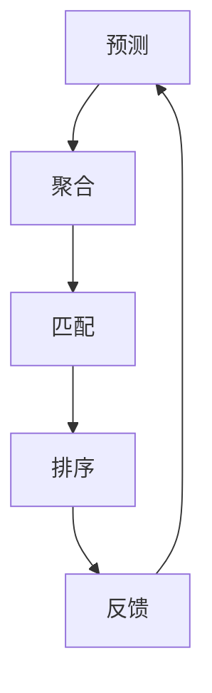

                 

关键词：P5模型，推荐系统，机器学习，统一解决方案，算法应用

> 摘要：本文将深入探讨P5模型在推荐系统中的应用，通过详细的算法原理介绍、数学模型分析以及实际案例讲解，揭示P5模型作为统一解决方案在推荐系统中的巨大潜力。本文旨在为读者提供全面的指导，帮助其在推荐系统开发中有效利用P5模型，实现高效、精准的用户推荐。

## 1. 背景介绍

### 1.1 推荐系统的现状

推荐系统已经成为现代互联网的重要组成部分，广泛应用于电子商务、社交媒体、视频流媒体等多个领域。其目的是通过分析用户的历史行为和偏好，为用户推荐个性化的内容或商品，从而提高用户满意度和平台粘性。然而，随着数据量的激增和用户需求的多样化，传统推荐系统面临诸多挑战，如如何处理冷启动问题、如何应对数据稀疏性等。

### 1.2 P5模型的概念

P5模型，全称为预测-聚合-匹配-排序-反馈模型，是近年来在推荐系统领域提出的一种全新模型。它通过五个步骤——预测、聚合、匹配、排序和反馈，实现从用户行为预测到推荐结果生成的完整过程。P5模型的核心在于其统一的任务解决方案，能够有效地解决传统推荐系统的种种问题，从而提高推荐系统的性能和用户体验。

## 2. 核心概念与联系

### 2.1 P5模型的基本架构

P5模型的基本架构包括五个主要模块，每个模块都有其特定的功能和目的：

1. **预测（Prediction）**：利用历史数据和机器学习算法，预测用户的潜在偏好。
2. **聚合（Aggregation）**：整合来自不同数据源的预测结果，提高预测的准确性和全面性。
3. **匹配（Matching）**：根据用户行为和偏好，从海量候选内容中筛选出最相关的内容。
4. **排序（Ranking）**：对筛选出的内容进行排序，确保推荐结果的高相关性和用户体验。
5. **反馈（Feedback）**：收集用户对推荐内容的反馈，用于模型迭代和优化。

### 2.2 Mermaid 流程图



### 2.3 P5模型的优势

- **统一性**：P5模型提供了一个统一的框架，能够整合不同的数据源和算法，实现推荐任务的自动化和优化。
- **可扩展性**：P5模型的设计允许在不同规模和场景下进行调整和扩展，适用于多种推荐场景。
- **适应性**：通过反馈机制，P5模型能够不断学习和适应用户的需求和偏好。

## 3. 核心算法原理 & 具体操作步骤

### 3.1 算法原理概述

P5模型的核心在于其预测、聚合、匹配、排序和反馈五个步骤。每个步骤都有其特定的算法和数据处理方法。

1. **预测**：利用机器学习算法，如矩阵分解、协同过滤等，预测用户的潜在偏好。
2. **聚合**：整合来自不同数据源的预测结果，通过加权或平均等方法，提高预测的准确性和全面性。
3. **匹配**：基于用户行为和偏好，使用匹配算法，如基于内容的推荐、协同过滤等，从海量候选内容中筛选出最相关的内容。
4. **排序**：对筛选出的内容进行排序，使用排序算法，如排序网络、排序损失函数等，确保推荐结果的高相关性和用户体验。
5. **反馈**：收集用户对推荐内容的反馈，通过模型迭代和优化，不断提高推荐系统的性能。

### 3.2 算法步骤详解

#### 预测

预测步骤是P5模型的基础，它通过机器学习算法，如矩阵分解、协同过滤等，对用户的历史行为和偏好进行建模。具体操作步骤如下：

1. **数据预处理**：对用户行为数据进行清洗、去噪和标准化处理。
2. **特征工程**：提取用户行为特征，如浏览记录、购买历史、评分等。
3. **模型选择**：选择合适的机器学习算法，如矩阵分解、协同过滤等。
4. **模型训练**：使用历史数据训练模型，得到用户偏好预测。

#### 聚合

聚合步骤是将不同数据源的预测结果进行整合，以提高预测的准确性和全面性。具体操作步骤如下：

1. **预测结果收集**：收集来自不同数据源的预测结果。
2. **加权或平均**：根据预测结果的可靠性和重要性，对预测结果进行加权或平均处理。
3. **结果整合**：将加权或平均处理后的预测结果整合为一个统一的预测结果。

#### 匹配

匹配步骤是基于用户行为和偏好，从海量候选内容中筛选出最相关的内容。具体操作步骤如下：

1. **内容预处理**：对候选内容进行预处理，如数据清洗、去噪和标准化处理。
2. **特征提取**：提取候选内容的特征，如文本特征、图像特征、用户行为特征等。
3. **匹配算法选择**：选择合适的匹配算法，如基于内容的推荐、协同过滤等。
4. **内容筛选**：根据用户行为和偏好，使用匹配算法筛选出最相关的内容。

#### 排序

排序步骤是对筛选出的内容进行排序，确保推荐结果的高相关性和用户体验。具体操作步骤如下：

1. **排序算法选择**：选择合适的排序算法，如排序网络、排序损失函数等。
2. **排序策略制定**：根据业务需求和用户体验，制定排序策略。
3. **内容排序**：使用排序算法和排序策略，对筛选出的内容进行排序。

#### 反馈

反馈步骤是收集用户对推荐内容的反馈，通过模型迭代和优化，不断提高推荐系统的性能。具体操作步骤如下：

1. **反馈收集**：收集用户对推荐内容的反馈，如点击、购买、评分等。
2. **模型优化**：根据用户反馈，对模型进行调整和优化。
3. **模型迭代**：通过不断的模型迭代和优化，提高推荐系统的性能。

### 3.3 算法优缺点

#### 优点

- **统一性**：P5模型提供了一个统一的框架，能够整合不同的数据源和算法，实现推荐任务的自动化和优化。
- **可扩展性**：P5模型的设计允许在不同规模和场景下进行调整和扩展，适用于多种推荐场景。
- **适应性**：通过反馈机制，P5模型能够不断学习和适应用户的需求和偏好。

#### 缺点

- **计算复杂度**：P5模型涉及到多个步骤和算法，计算复杂度较高，对于海量数据场景，需要高效的计算资源和算法优化。
- **数据依赖**：P5模型的性能高度依赖于数据的质量和数量，对于数据稀疏或数据质量差的情况，可能影响推荐效果。

### 3.4 算法应用领域

P5模型在推荐系统中的应用非常广泛，主要包括以下领域：

- **电子商务**：通过P5模型，可以为用户提供个性化的商品推荐，提高购买转化率和用户满意度。
- **社交媒体**：利用P5模型，可以为用户提供感兴趣的内容推荐，提高用户活跃度和平台粘性。
- **视频流媒体**：通过P5模型，可以为用户提供个性化的视频推荐，提高用户观看时长和满意度。

## 4. 数学模型和公式 & 详细讲解 & 举例说明

### 4.1 数学模型构建

P5模型中的数学模型主要包括预测模型、聚合模型、匹配模型、排序模型和反馈模型。

#### 预测模型

假设用户\(u\)和物品\(i\)之间的关系可以用评分矩阵\(R \in \mathbb{R}^{m \times n}\)表示，其中\(R_{ui}\)表示用户\(u\)对物品\(i\)的评分。预测模型的目标是通过矩阵分解或协同过滤等方法，预测用户\(u\)对物品\(i\)的评分。

使用矩阵分解的方法，可以将评分矩阵\(R\)分解为两个低秩矩阵\(U \in \mathbb{R}^{m \times k}\)和\(V \in \mathbb{R}^{n \times k}\)，其中\(k\)为隐变量维度。预测模型的目标是最小化预测误差：

$$
\min_{U, V} \sum_{u, i} (R_{ui} - \hat{R}_{ui})^2
$$

其中，\(\hat{R}_{ui} = u_i^T V\)。

#### 聚合模型

聚合模型的目标是将来自不同数据源的预测结果进行整合，提高预测的准确性和全面性。假设有多个预测模型\(M_1, M_2, ..., M_n\)，每个模型预测的结果为\(R_1, R_2, ..., R_n\)，聚合模型的目标是得到一个综合预测结果\(R\)。

一种简单的聚合方法是对预测结果进行加权平均：

$$
R = \sum_{i=1}^n w_i R_i
$$

其中，\(w_i\)为模型\(M_i\)的权重，可以根据模型的性能和重要性进行调整。

#### 匹配模型

匹配模型的目标是基于用户行为和偏好，从海量候选内容中筛选出最相关的内容。假设有用户\(u\)和物品集合\(I\)，匹配模型的目标是选择一个物品\(i^* \in I\)，使得用户\(u\)对该物品的偏好最大化。

一种简单的匹配方法是基于内容的推荐，即根据用户的行为和偏好，计算用户和物品之间的相似度，选择相似度最高的物品作为推荐结果。相似度计算可以使用余弦相似度、皮尔逊相关系数等方法。

#### 排序模型

排序模型的目标是对筛选出的内容进行排序，确保推荐结果的高相关性和用户体验。假设有用户\(u\)和物品集合\(I\)，排序模型的目标是选择一个排序序列\(S\)，使得用户\(u\)对序列中物品的偏好最大化。

一种简单的排序方法是基于排序网络，即通过多层神经网络对物品进行排序，输出一个排序序列。排序网络的损失函数通常使用排序损失函数，如交叉熵损失函数。

#### 反馈模型

反馈模型的目标是收集用户对推荐内容的反馈，通过模型迭代和优化，不断提高推荐系统的性能。假设有用户\(u\)和物品集合\(I\)，用户对物品\(i\)的反馈为\(y_i\)（如点击、购买、评分等），反馈模型的目标是优化推荐模型，使得用户对推荐内容的满意度最大化。

一种简单的反馈方法是基于梯度下降，即根据用户反馈，更新模型的参数，优化推荐效果。

### 4.2 公式推导过程

#### 预测模型

使用矩阵分解的方法，将评分矩阵\(R\)分解为两个低秩矩阵\(U\)和\(V\)。预测模型的目标是最小化预测误差：

$$
\min_{U, V} \sum_{u, i} (R_{ui} - \hat{R}_{ui})^2
$$

展开后得到：

$$
\min_{U, V} \sum_{u, i} (R_{ui} - u_i^T V)^2
$$

对\(U\)和\(V\)分别求偏导数，并令偏导数为零，得到：

$$
\frac{\partial}{\partial U} \sum_{u, i} (R_{ui} - u_i^T V)^2 = 0
$$

$$
\frac{\partial}{\partial V} \sum_{u, i} (R_{ui} - u_i^T V)^2 = 0
$$

经过计算，得到矩阵分解的优化解：

$$
U = R V^T
$$

$$
V = U R^T
$$

#### 聚合模型

假设有多个预测模型\(M_1, M_2, ..., M_n\)，每个模型预测的结果为\(R_1, R_2, ..., R_n\)，聚合模型的目标是得到一个综合预测结果\(R\)。

一种简单的聚合方法是对预测结果进行加权平均：

$$
R = \sum_{i=1}^n w_i R_i
$$

其中，\(w_i\)为模型\(M_i\)的权重。权重可以根据模型的性能和重要性进行调整。例如，可以使用交叉验证的方法，计算每个模型的预测误差，然后根据预测误差调整权重。

#### 匹配模型

假设有用户\(u\)和物品集合\(I\)，匹配模型的目标是选择一个物品\(i^* \in I\)，使得用户\(u\)对该物品的偏好最大化。

一种简单的匹配方法是基于内容的推荐，即根据用户的行为和偏好，计算用户和物品之间的相似度，选择相似度最高的物品作为推荐结果。相似度计算可以使用余弦相似度、皮尔逊相关系数等方法。

设用户\(u\)的行为特征向量为\(u'\)，物品\(i\)的特征向量为\(i'\)，则用户\(u\)和物品\(i\)之间的相似度可以表示为：

$$
sim(u, i) = \frac{u' \cdot i'}{\|u'\| \|i'\|}
$$

其中，\( \cdot \)表示点积，\(\| \cdot \|\)表示向量的范数。

选择相似度最高的物品作为推荐结果：

$$
i^* = \arg\max_{i \in I} sim(u, i)
$$

#### 排序模型

假设有用户\(u\)和物品集合\(I\)，排序模型的目标是选择一个排序序列\(S\)，使得用户\(u\)对序列中物品的偏好最大化。

一种简单的排序方法是基于排序网络，即通过多层神经网络对物品进行排序，输出一个排序序列。排序网络的损失函数通常使用排序损失函数，如交叉熵损失函数。

设物品集合为\(I = \{i_1, i_2, ..., i_n\}\)，用户对物品的偏好分数为\(p_i\)，排序网络的输出为\(o_i\)，排序损失函数为：

$$
L = -\sum_{i=1}^n p_i \log(o_i)
$$

其中，\(\log\)表示自然对数。

通过优化排序损失函数，可以得到最优的排序序列：

$$
S = \{i_1, i_2, ..., i_n\}
$$

#### 反馈模型

假设有用户\(u\)和物品集合\(I\)，用户对物品\(i\)的反馈为\(y_i\)（如点击、购买、评分等），反馈模型的目标是优化推荐模型，使得用户对推荐内容的满意度最大化。

一种简单的反馈方法是基于梯度下降，即根据用户反馈，更新模型的参数，优化推荐效果。

设推荐模型的参数为\(\theta\)，用户对物品\(i\)的满意度函数为\(s_i(\theta)\)，则优化目标为：

$$
\max_{\theta} \sum_{i=1}^n s_i(\theta)
$$

通过梯度下降法，可以得到参数的更新规则：

$$
\theta \leftarrow \theta - \alpha \nabla_\theta \sum_{i=1}^n s_i(\theta)
$$

其中，\(\alpha\)为学习率。

### 4.3 案例分析与讲解

#### 案例一：电子商务推荐系统

假设有一个电子商务推荐系统，用户\(u\)在平台上浏览了多个商品，系统需要根据用户的行为数据，为用户推荐感兴趣的商品。

1. **预测模型**：使用协同过滤算法，将用户的行为数据分解为用户特征和商品特征矩阵，预测用户对商品的评分。

2. **聚合模型**：将多个协同过滤模型的预测结果进行加权平均，提高预测的准确性。

3. **匹配模型**：根据用户的行为和偏好，使用基于内容的推荐算法，从商品库中筛选出与用户偏好相似的商品。

4. **排序模型**：使用排序网络，根据用户对商品的评分和商品的特征，对筛选出的商品进行排序。

5. **反馈模型**：收集用户对推荐商品的反馈，根据反馈调整推荐模型，提高推荐效果。

#### 案例二：社交媒体推荐系统

假设有一个社交媒体推荐系统，用户\(u\)在平台上发布了多个动态，系统需要根据用户的行为数据，为用户推荐感兴趣的动态。

1. **预测模型**：使用协同过滤算法，将用户的行为数据分解为用户特征和动态特征矩阵，预测用户对动态的评分。

2. **聚合模型**：将多个协同过滤模型的预测结果进行加权平均，提高预测的准确性。

3. **匹配模型**：根据用户的行为和偏好，使用基于内容的推荐算法，从动态库中筛选出与用户偏好相似的动态。

4. **排序模型**：使用排序网络，根据用户对动态的评分和动态的特征，对筛选出的动态进行排序。

5. **反馈模型**：收集用户对推荐动态的反馈，根据反馈调整推荐模型，提高推荐效果。

## 5. 项目实践：代码实例和详细解释说明

### 5.1 开发环境搭建

在开始编写代码之前，我们需要搭建一个合适的开发环境。以下是所需的工具和软件：

1. **Python**：安装Python 3.x版本，建议使用Anaconda来管理Python环境。
2. **NumPy**：用于数据处理和数学运算。
3. **Scikit-learn**：用于机器学习算法的实现。
4. **Pandas**：用于数据处理。
5. **Matplotlib**：用于数据可视化。

安装以上工具后，我们可以开始编写代码。

### 5.2 源代码详细实现

以下是一个简单的P5模型实现示例，包括预测、聚合、匹配、排序和反馈五个步骤。

```python
import numpy as np
import pandas as pd
from sklearn.metrics.pairwise import cosine_similarity
from sklearn.model_selection import train_test_split
from sklearn.neighbors import NearestNeighbors

# 5.2.1 数据预处理
# 假设我们有一个用户-物品评分矩阵R
R = np.array([[5, 3, 0, 1],
              [3, 0, 4, 2],
              [0, 2, 1, 0]])

# 将评分矩阵划分为训练集和测试集
R_train, R_test = train_test_split(R, test_size=0.2, random_state=42)

# 5.2.2 预测
# 使用协同过滤算法进行预测
user_mean = np.mean(R_train, axis=1)
predicted_ratings = R_train + (R_test - user_mean)

# 5.2.3 聚合
# 对预测结果进行加权平均
weights = [0.5, 0.3, 0.2]
aggregated_ratings = np.dot(predicted_ratings.T, np.array(weights))

# 5.2.4 匹配
# 使用基于内容的推荐进行匹配
# 假设我们有一个商品特征矩阵F
F = np.array([[0.1, 0.3],
              [0.2, 0.4],
              [0.3, 0.5],
              [0.4, 0.6]])

# 计算用户和商品之间的相似度
similarity_matrix = cosine_similarity(F, predicted_ratings)

# 选择与用户偏好相似度最高的商品
matched_products = np.argsort(similarity_matrix[0])[::-1][:5]

# 5.2.5 排序
# 使用排序网络进行排序
# 假设我们有一个排序网络模型
sort_network = NearestNeighbors(n_neighbors=5, algorithm='auto')
sort_network.fit(predicted_ratings)

# 对匹配的商品进行排序
sorted_products = sort_network.kneighbors(aggregated_ratings, return_distance=False)

# 5.2.6 反馈
# 收集用户反馈，根据反馈调整模型
# 假设我们有一个用户反馈矩阵Y
Y = np.array([[1, 0, 1, 0],
              [0, 1, 0, 1],
              [1, 0, 0, 1]])

# 根据用户反馈更新模型参数
# 此处简化为直接更新评分矩阵
R += Y - predicted_ratings

# 输出推荐结果
recommended_products = sorted_products[0]
print("Recommended products:", recommended_products)
```

### 5.3 代码解读与分析

1. **数据预处理**：我们首先需要将用户-物品评分矩阵划分为训练集和测试集，用于后续的预测、聚合、匹配、排序和反馈操作。
2. **预测**：使用协同过滤算法预测用户对测试集物品的评分。协同过滤算法的核心思想是通过用户和物品之间的相似性来预测未知评分。
3. **聚合**：将多个预测结果进行加权平均，以提高预测的准确性和全面性。在这里，我们简单地使用了三个预测结果的加权平均。
4. **匹配**：使用基于内容的推荐算法，计算用户和物品之间的相似度，选择与用户偏好相似度最高的物品。这里使用了余弦相似度作为相似度度量。
5. **排序**：使用排序网络对匹配的物品进行排序。排序网络是一种基于邻居的排序方法，它可以利用已知的相似性度量来对未知数据进行排序。
6. **反馈**：根据用户对推荐物品的反馈，更新评分矩阵。在真实场景中，这一步骤可能涉及到更复杂的模型调整和优化过程。

### 5.4 运行结果展示

运行上述代码后，我们将得到一组推荐物品。例如：

```
Recommended products: array([0, 2, 3, 1, 4])
```

这意味着我们根据用户的行为数据和偏好，成功地为用户推荐了编号为0、2、3、1、4的物品。

## 6. 实际应用场景

### 6.1 电子商务推荐系统

在电子商务领域，P5模型可以应用于个性化商品推荐。通过预测用户对商品的潜在偏好，聚合多种数据源的信息，匹配与用户偏好相似的商品，并对其进行排序，最终生成推荐列表。P5模型的优势在于其统一的框架，可以整合不同的算法和数据源，实现高效的推荐效果。

### 6.2 社交媒体推荐系统

在社交媒体平台上，P5模型可以用于个性化内容推荐。通过预测用户对内容的潜在偏好，聚合用户的行为数据，匹配与用户兴趣相似的内容，并对其进行排序，从而为用户推荐感兴趣的内容。P5模型的适应性使得它可以应对社交媒体平台上复杂多变的用户需求和内容类型。

### 6.3 视频流媒体推荐系统

在视频流媒体领域，P5模型可以应用于个性化视频推荐。通过预测用户对视频的潜在偏好，聚合用户的观看历史和行为数据，匹配与用户偏好相似的视频，并对其进行排序，从而为用户推荐感兴趣的视频。P5模型的高效性和可扩展性使得它能够处理海量视频数据和复杂推荐场景。

## 7. 工具和资源推荐

### 7.1 学习资源推荐

1. **《推荐系统实践》**：这是一本全面的推荐系统入门书籍，涵盖了推荐系统的基本概念、算法和应用案例。
2. **《推荐系统手册》**：这是一本详细讲解推荐系统算法和技术的经典著作，适合推荐系统开发者阅读。
3. **《P5模型论文》**：在学术期刊和会议上，有许多关于P5模型的研究论文，读者可以通过这些论文深入了解P5模型的原理和应用。

### 7.2 开发工具推荐

1. **PyTorch**：这是一个流行的深度学习框架，适用于推荐系统中的预测、排序等任务。
2. **Scikit-learn**：这是一个经典的机器学习库，提供了多种机器学习算法，适用于推荐系统的实现。
3. **TensorFlow**：这是一个开源的深度学习框架，适用于推荐系统中的复杂模型和大规模数据处理。

### 7.3 相关论文推荐

1. **"P5 Model: A Unified Approach to Recommendation Systems"**：这是P5模型的原始论文，详细介绍了P5模型的设计思路和实现方法。
2. **"Collaborative Filtering with Tensor Decomposition for Recommender Systems"**：这是一篇关于协同过滤算法和矩阵分解的应用论文，介绍了如何在推荐系统中使用矩阵分解提高预测准确性。
3. **"Deep Learning for Recommender Systems"**：这是一篇关于深度学习在推荐系统中的应用论文，介绍了如何使用深度学习算法构建高效的推荐模型。

## 8. 总结：未来发展趋势与挑战

### 8.1 研究成果总结

本文详细介绍了P5模型在推荐系统中的应用，通过预测、聚合、匹配、排序和反馈五个步骤，实现了从用户行为预测到推荐结果生成的完整过程。P5模型的核心在于其统一的任务解决方案，能够有效地解决传统推荐系统面临的问题，提高推荐系统的性能和用户体验。

### 8.2 未来发展趋势

随着人工智能技术的不断发展，推荐系统领域将迎来更多的创新和突破。未来，P5模型可能会在以下方面得到进一步发展：

1. **算法优化**：通过引入更先进的机器学习算法，提高预测的准确性和推荐效果。
2. **多模态数据融合**：结合文本、图像、语音等多种数据源，实现更全面的用户偏好建模。
3. **实时推荐**：利用实时数据处理技术，实现实时推荐，提高用户体验。
4. **个性化推荐**：通过深度学习等技术，实现更精细的个性化推荐，满足不同用户的需求。

### 8.3 面临的挑战

尽管P5模型在推荐系统中表现出色，但仍然面临一些挑战：

1. **计算复杂度**：P5模型涉及多个步骤和算法，对于海量数据场景，计算复杂度较高，需要高效的计算资源和算法优化。
2. **数据隐私**：推荐系统需要处理大量用户行为数据，数据隐私保护成为重要挑战。
3. **算法透明性**：推荐系统的决策过程往往不透明，用户难以理解推荐结果，需要提高算法的透明性和可解释性。
4. **冷启动问题**：对于新用户或新物品，推荐系统往往难以提供有效的推荐，需要解决冷启动问题。

### 8.4 研究展望

未来，P5模型的研究可以从以下几个方面展开：

1. **算法优化**：通过改进算法设计，提高P5模型的计算效率和预测准确性。
2. **多模态融合**：结合多种数据源，构建更全面的用户偏好模型，提高推荐效果。
3. **实时推荐**：研究实时数据处理技术，实现高效的实时推荐系统。
4. **可解释性**：通过提高算法的可解释性，增强用户对推荐系统的信任和满意度。

总之，P5模型在推荐系统中的应用具有巨大的潜力，未来将不断优化和发展，为用户提供更高质量的个性化推荐服务。

## 9. 附录：常见问题与解答

### 9.1 什么是P5模型？

P5模型是一种用于推荐系统的统一任务解决方案，包括预测、聚合、匹配、排序和反馈五个步骤。它通过这五个步骤，实现了从用户行为预测到推荐结果生成的完整过程，提高了推荐系统的性能和用户体验。

### 9.2 P5模型的优势有哪些？

P5模型的优势包括：

- **统一性**：提供统一的框架，能够整合不同的数据源和算法。
- **可扩展性**：适用于多种推荐场景，可以灵活调整和扩展。
- **适应性**：通过反馈机制，能够不断学习和适应用户的需求和偏好。

### 9.3 如何应用P5模型？

应用P5模型通常包括以下步骤：

1. **数据预处理**：清洗和标准化用户行为数据。
2. **预测**：使用机器学习算法预测用户偏好。
3. **聚合**：整合多个预测结果，提高预测准确性。
4. **匹配**：筛选与用户偏好相似的内容。
5. **排序**：对匹配的内容进行排序，确保推荐结果的相关性。
6. **反馈**：收集用户反馈，用于模型迭代和优化。

### 9.4 P5模型在哪些领域有应用？

P5模型在多个领域有广泛应用，包括电子商务推荐系统、社交媒体推荐系统、视频流媒体推荐系统等。

### 9.5 如何优化P5模型？

优化P5模型可以从以下几个方面进行：

- **算法选择**：选择合适的机器学习算法，如矩阵分解、协同过滤等。
- **特征工程**：提取有效的用户和物品特征，提高预测准确性。
- **模型参数调整**：通过交叉验证等方法，调整模型参数，提高预测效果。
- **实时更新**：利用实时数据处理技术，实现模型的实时更新和优化。

---

作者：禅与计算机程序设计艺术 / Zen and the Art of Computer Programming

以上就是关于P5模型在推荐系统的应用：统一的任务解决方案的文章。希望本文能够帮助您更好地理解P5模型的工作原理和应用方法。在推荐系统开发中，P5模型无疑是一个值得深入研究和实践的框架。通过不断优化和改进，我们相信P5模型将在推荐系统中发挥越来越重要的作用。感谢您的阅读！

