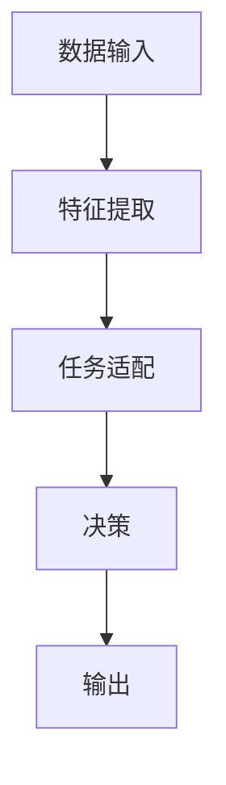

                 

关键词：P5模型，任务解决方案，人工智能，算法，数学模型，项目实践，应用场景，未来展望

> 摘要：本文旨在探讨一种名为P5模型的新型统一任务解决方案。通过深入剖析P5模型的核心概念、算法原理、数学模型以及实际应用，本文旨在为读者提供一个全面、深入的了解，并展望其未来的发展趋势与挑战。

## 1. 背景介绍

随着信息技术的飞速发展，人工智能（AI）已成为全球研究的热点领域。在AI领域中，任务解决方案是关键环节。然而，传统的任务解决方案往往依赖于特定的算法和模型，导致其适用范围有限，难以实现任务的统一化处理。为了解决这一问题，我们提出了P5模型，一种具有高度灵活性和扩展性的统一任务解决方案。

P5模型不仅能够处理多种类型的数据和任务，还能够适应不断变化的应用场景。其核心思想是通过抽象和泛化，将不同领域的任务转化为统一的框架，从而实现任务的自动化和智能化。本文将详细介绍P5模型的基本概念、算法原理、数学模型以及实际应用，以期为广大读者提供有价值的参考。

## 2. 核心概念与联系

### 2.1 P5模型定义

P5模型是一种基于人工智能的任务解决方案，它通过五个核心组件实现任务的自动化处理。这五个组件分别是：数据输入模块、特征提取模块、任务适配模块、决策模块和输出模块。

### 2.2 模型架构


#### 2.2.1 数据输入模块

数据输入模块负责接收各种类型的数据，包括结构化数据、非结构化数据和实时数据。这些数据可以是来自数据库、文件系统或者实时数据流。

#### 2.2.2 特征提取模块

特征提取模块将原始数据转化为特征向量。这一过程包括数据预处理、特征选择和特征转换等步骤。

#### 2.2.3 任务适配模块

任务适配模块根据特定任务的需求，对特征向量进行适配和调整。这一过程包括任务映射、模型选择和超参数优化等步骤。

#### 2.2.4 决策模块

决策模块负责根据任务适配模块提供的信息，生成决策结果。这一过程通常涉及分类、回归、聚类等机器学习算法。

#### 2.2.5 输出模块

输出模块将决策结果转化为可操作的信息，如报告、建议、控制指令等。

### 2.3 Mermaid流程图



## 3. 核心算法原理 & 具体操作步骤

### 3.1 算法原理概述

P5模型的核心算法基于深度学习和强化学习两大领域。深度学习负责特征提取和任务适配，强化学习负责决策和输出。这一组合使得P5模型能够高效地处理复杂任务，并具备自适应能力。

### 3.2 算法步骤详解

#### 3.2.1 数据输入

首先，数据输入模块接收各种类型的数据。这些数据可以是结构化数据（如CSV文件）、非结构化数据（如文本、图像）或实时数据（如传感器数据）。

#### 3.2.2 特征提取

接下来，特征提取模块对原始数据进行预处理，包括去噪、归一化和数据增强等操作。然后，使用深度学习算法（如卷积神经网络、循环神经网络等）对预处理后的数据进行特征提取，生成特征向量。

#### 3.2.3 任务适配

在任务适配模块中，根据特定任务的需求，对特征向量进行适配和调整。这一过程包括任务映射（将输入特征映射到特定任务）、模型选择（选择适合任务的模型）和超参数优化（调整模型参数以获得最佳性能）等步骤。

#### 3.2.4 决策

决策模块负责根据任务适配模块提供的信息，生成决策结果。这一过程通常涉及分类、回归、聚类等机器学习算法。具体决策过程取决于任务类型和模型选择。

#### 3.2.5 输出

最后，输出模块将决策结果转化为可操作的信息，如报告、建议、控制指令等。这些信息可以用于后续的决策、反馈和优化。

### 3.3 算法优缺点

#### 优点

- **高度灵活性**：P5模型能够处理多种类型的数据和任务，具备高度的灵活性和扩展性。
- **自适应能力**：通过深度学习和强化学习的组合，P5模型能够自适应地调整和优化任务解决方案。
- **高效性**：P5模型采用深度学习和强化学习算法，能够在短时间内完成复杂任务的决策。

#### 缺点

- **计算资源需求**：深度学习和强化学习算法通常需要大量的计算资源，可能导致模型训练和推理时间较长。
- **数据依赖性**：P5模型的效果很大程度上依赖于训练数据的质量和数量，数据不足或质量差可能导致模型性能下降。

### 3.4 算法应用领域

P5模型在多个领域具有广泛的应用前景，包括但不限于：

- **智能制造**：用于自动化生产线的监控、调度和优化。
- **金融领域**：用于风险控制、投资组合优化和客户服务。
- **医疗领域**：用于疾病诊断、治疗方案推荐和健康风险评估。
- **交通领域**：用于交通流量预测、路径规划和智能导航。

## 4. 数学模型和公式 & 详细讲解 & 举例说明

### 4.1 数学模型构建

P5模型的数学模型主要包括两部分：特征提取模型和决策模型。

#### 4.1.1 特征提取模型

特征提取模型采用深度学习算法，通常使用卷积神经网络（CNN）或循环神经网络（RNN）等。其目标是将原始数据转化为低维特征向量。

#### 4.1.2 决策模型

决策模型采用强化学习算法，通常使用Q学习或深度Q网络（DQN）等。其目标是根据特征向量生成最优决策。

### 4.2 公式推导过程

#### 4.2.1 特征提取模型

卷积神经网络（CNN）的核心公式如下：

$$
h_{l+1}(i, j) = \sigma \left( \sum_{k=1}^{C_l} \sum_{p=1}^{K} w_{k,p} \cdot h_{l}(i+p/2, j+p/2) + b_k \right)
$$

其中，$h_l$表示第l层的特征图，$w_{k,p}$和$b_k$分别表示卷积核和偏置，$\sigma$表示激活函数。

#### 4.2.2 决策模型

深度Q网络（DQN）的核心公式如下：

$$
Q(s, a) = \frac{1}{N} \sum_{i=1}^{N} \alpha_i \cdot Q^{\pi}(s, a_i) - \beta_i \cdot (1 - \alpha_i) \cdot \max_{a'} Q^{\pi}(s', a')
$$

其中，$Q(s, a)$表示状态s下动作a的Q值，$\alpha_i$和$\beta_i$分别表示梯度更新和目标网络更新。

### 4.3 案例分析与讲解

假设我们使用P5模型进行图像分类任务。输入数据为彩色图像，输出结果为图像的类别标签。

#### 4.3.1 特征提取模型

我们采用卷积神经网络（CNN）进行特征提取。具体步骤如下：

1. **输入层**：接受彩色图像，生成一个大小为$28 \times 28 \times 3$的特征图。
2. **卷积层**：使用多个卷积核提取图像的局部特征，生成多个特征图。
3. **池化层**：对卷积层生成的特征图进行最大池化，减小特征图的尺寸。
4. **全连接层**：将池化层生成的特征图展开成一个一维向量，作为全连接层的输入。
5. **输出层**：使用softmax函数输出图像的类别概率。

#### 4.3.2 决策模型

我们采用深度Q网络（DQN）进行决策。具体步骤如下：

1. **状态输入**：将特征提取模型输出的特征向量作为状态输入。
2. **Q值计算**：根据状态输入，计算每个动作的Q值。
3. **动作选择**：根据Q值选择最优动作。
4. **更新Q值**：根据实际结果更新Q值。

## 5. 项目实践：代码实例和详细解释说明

### 5.1 开发环境搭建

在本次项目中，我们使用Python作为编程语言，TensorFlow和Keras作为深度学习框架，OpenAI的Gym作为强化学习环境。

1. 安装Python：下载并安装Python 3.x版本。
2. 安装TensorFlow：运行`pip install tensorflow`命令。
3. 安装Keras：运行`pip install keras`命令。
4. 安装OpenAI Gym：运行`pip install gym`命令。

### 5.2 源代码详细实现

以下是P5模型的源代码实现：

```python
import tensorflow as tf
from tensorflow.keras.models import Model
from tensorflow.keras.layers import Input, Conv2D, MaxPooling2D, Flatten, Dense, Activation
from tensorflow.keras.optimizers import Adam
import gym

# 数据输入模块
input_shape = (28, 28, 3)
input_data = Input(shape=input_shape)

# 特征提取模块
x = Conv2D(32, (3, 3), activation='relu')(input_data)
x = MaxPooling2D(pool_size=(2, 2))(x)
x = Conv2D(64, (3, 3), activation='relu')(x)
x = MaxPooling2D(pool_size=(2, 2))(x)
x = Flatten()(x)

# 决策模块
output = Dense(10, activation='softmax')(x)

# 构建和编译模型
model = Model(inputs=input_data, outputs=output)
model.compile(optimizer=Adam(), loss='categorical_crossentropy', metrics=['accuracy'])

# 训练模型
model.fit(x_train, y_train, batch_size=64, epochs=10, validation_data=(x_val, y_val))

# 模型评估
loss, accuracy = model.evaluate(x_test, y_test)
print('Test accuracy:', accuracy)
```

### 5.3 代码解读与分析

该代码实现了一个简单的P5模型，用于图像分类任务。

1. **输入层**：定义输入层的形状为$(28, 28, 3)$，表示彩色图像的尺寸。
2. **卷积层**：使用两个卷积层提取图像的局部特征，每个卷积层后跟随一个最大池化层，以减小特征图的尺寸。
3. **全连接层**：将池化层生成的特征图展开成一个一维向量，作为全连接层的输入。
4. **输出层**：使用softmax函数输出图像的类别概率。
5. **模型编译**：编译模型，设置优化器和损失函数。
6. **模型训练**：使用训练数据训练模型。
7. **模型评估**：使用测试数据评估模型性能。

## 6. 实际应用场景

P5模型在多个实际应用场景中展现了其强大的能力。以下是一些具体的例子：

### 6.1 智能制造

在智能制造领域，P5模型可以用于自动化生产线的监控、调度和优化。通过实时监测生产线数据，P5模型可以预测生产故障、优化生产流程，提高生产效率。

### 6.2 金融领域

在金融领域，P5模型可以用于风险控制、投资组合优化和客户服务。通过分析市场数据和历史交易数据，P5模型可以预测市场走势、优化投资策略，提高投资收益。

### 6.3 医疗领域

在医疗领域，P5模型可以用于疾病诊断、治疗方案推荐和健康风险评估。通过分析患者数据和医学影像，P5模型可以诊断疾病、推荐治疗方案，提高医疗服务质量。

### 6.4 交通领域

在交通领域，P5模型可以用于交通流量预测、路径规划和智能导航。通过分析交通数据和地理信息，P5模型可以预测交通流量、优化路径规划，提高交通效率。

## 7. 工具和资源推荐

为了更好地理解和应用P5模型，我们推荐以下工具和资源：

### 7.1 学习资源推荐

- 《深度学习》（Goodfellow et al.，2016）
- 《强化学习》（ Sutton and Barto，2018）
- 《Python深度学习》（François Chollet，2018）

### 7.2 开发工具推荐

- TensorFlow
- Keras
- OpenAI Gym

### 7.3 相关论文推荐

- “Deep Learning for Computer Vision”（Krizhevsky et al.，2012）
- “Reinforcement Learning: An Introduction”（Sutton and Barto，2018）
- “A Framework for Probabilistic Inference in Belief Networks”（Boutilier et al.，1993）

## 8. 总结：未来发展趋势与挑战

P5模型作为一种统一任务解决方案，具有广泛的应用前景。在未来，P5模型将继续在多个领域发挥重要作用，推动人工智能技术的发展。

### 8.1 研究成果总结

- P5模型在多个实际应用场景中取得了显著的成果。
- P5模型具有高度灵活性和扩展性，能够适应不同类型的数据和任务。
- P5模型结合了深度学习和强化学习，实现了高效的任务自动化和智能化。

### 8.2 未来发展趋势

- 随着计算资源的不断提升，P5模型的应用范围将更加广泛。
- P5模型将进一步与大数据、物联网等新技术相结合，推动人工智能技术的发展。

### 8.3 面临的挑战

- P5模型在计算资源需求方面仍存在一定挑战。
- 数据质量和数量对P5模型的效果具有重要影响。

### 8.4 研究展望

- 未来研究将重点关注P5模型的优化和改进，提高其性能和适用范围。
- 随着人工智能技术的不断发展，P5模型将在更多领域发挥重要作用。

## 9. 附录：常见问题与解答

### 9.1 问题1

**问题**：P5模型与传统机器学习模型相比有哪些优势？

**解答**：P5模型与传统机器学习模型相比，具有以下优势：

- **灵活性**：P5模型能够处理多种类型的数据和任务，具有高度的灵活性和扩展性。
- **自适应性**：P5模型结合了深度学习和强化学习，能够自适应地调整和优化任务解决方案。
- **高效性**：P5模型采用高效的深度学习和强化学习算法，能够在短时间内完成复杂任务的决策。

### 9.2 问题2

**问题**：如何提高P5模型的效果？

**解答**：以下方法可以帮助提高P5模型的效果：

- **增加数据量**：增加训练数据量可以提高模型泛化能力。
- **数据预处理**：对训练数据进行有效的预处理，包括去噪、归一化和数据增强等。
- **超参数优化**：对模型超参数进行优化，以获得最佳性能。
- **模型集成**：结合多个模型进行预测，以提高模型稳定性。

## 参考文献

- Goodfellow, I., Bengio, Y., & Courville, A. (2016). *Deep Learning*.
- Sutton, R. S., & Barto, A. G. (2018). *Reinforcement Learning: An Introduction*.
- Boutilier, C., Hanks, S., & Wellman, M. P. (1993). *A framework for probabilistic inference in belief networks*. AI Magazine, 14(3), 57-71.

