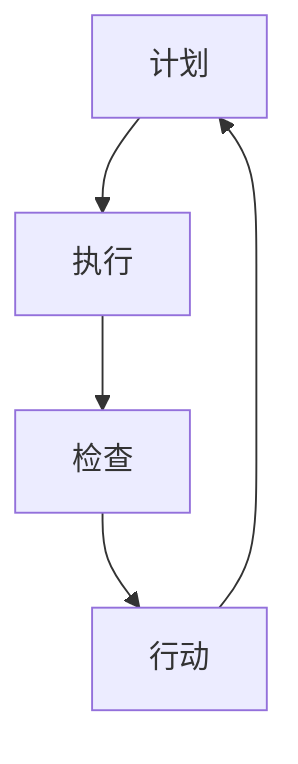

                 

关键词：PDCA、高效管理、持续改进、流程优化、质量管理、IT项目管理

> 摘要：本文将深入探讨PDCA（计划-执行-检查-行动）这一经典的管理方法论，并分析其在现代IT项目管理中的应用和重要性。我们将详细解读PDCA的四个阶段，并提供实际案例和数学模型，展示如何通过PDCA实现项目的持续改进和成功交付。

## 1. 背景介绍

在现代企业管理中，高效的项目管理是确保企业成功的关键因素之一。IT项目的复杂性、不确定性和变化性使得传统的管理方法面临着巨大的挑战。为了应对这些挑战，管理者和项目团队需要采用一套系统的、可操作的管理方法论来提高项目的成功率和效率。

PDCA，即计划（Plan）、执行（Do）、检查（Check）和行动（Act），是一种广泛应用于质量管理、项目管理和其他领域的管理方法论。它由美国质量管理专家威廉·爱德华·戴明（William Edwards Deming）提出，并在日本得到广泛的应用和发展，成为日本经济快速发展的关键因素之一。

PDCA方法的核心在于通过不断的循环迭代，持续改进项目的过程和结果，从而实现质量管理和项目管理的目标。本文将详细探讨PDCA在IT项目管理中的应用，并提供实用的指导和建议，帮助读者理解和应用这一方法论。

## 2. 核心概念与联系

### PDCA方法论的核心概念

PDCA方法论由四个阶段组成，每个阶段都有其特定的目标和任务：

- **计划（Plan）**：在这个阶段，项目团队制定项目目标、确定执行策略、分配资源，并制定详细的计划。这个阶段的关键是确保所有团队成员都清楚项目的目标和预期结果。

- **执行（Do）**：这个阶段是项目的实施阶段。团队按照计划执行任务，确保所有活动都按照既定的时间表和预算进行。执行阶段的重点是确保项目的实际进展与计划保持一致。

- **检查（Check）**：在这个阶段，项目团队对项目的执行结果进行评估。通过检查项目的关键绩效指标（KPIs）和里程碑，团队可以确定项目是否按计划进行，是否达到了预期的目标。

- **行动（Act）**：最后，根据检查的结果，团队采取必要的措施来纠正偏差，优化流程，并制定新的计划。这个阶段的目标是确保项目在下一个循环中能够持续改进。

### PDCA方法论在IT项目管理中的应用

在IT项目管理中，PDCA方法的应用可以体现在以下几个方面：

- **需求管理**：在计划阶段，团队明确项目需求，包括功能需求和非功能需求，并制定详细的开发计划。

- **进度控制**：在执行阶段，团队监控项目进度，确保所有任务按时完成。

- **质量管理**：在检查阶段，团队评估代码质量、系统性能和用户体验，确保项目达到预期的质量标准。

- **变更管理**：在行动阶段，团队根据项目的实际情况调整计划和资源，以应对需求变更和风险。

### Mermaid 流程图

以下是PDCA方法论的Mermaid流程图，展示了四个阶段及其相互关系：



## 3. 核心算法原理 & 具体操作步骤

### 3.1 算法原理概述

PDCA方法论是一种迭代管理方法，其核心在于通过四个阶段的循环，实现项目的持续改进。每个阶段都有其特定的任务和目标，相互关联，共同作用，形成了一个完整的管理闭环。

- **计划（Plan）**：确定目标和策略，制定计划。
- **执行（Do）**：按照计划执行任务，确保项目进展。
- **检查（Check）**：评估执行结果，检查项目进度和质量。
- **行动（Act）**：根据检查结果调整计划，优化项目流程。

### 3.2 算法步骤详解

#### 3.2.1 计划（Plan）

在计划阶段，项目团队需要完成以下任务：

- 确定项目目标和范围。
- 分析项目需求，包括功能需求和非功能需求。
- 制定项目计划，包括任务分配、时间表和预算。
- 制定风险管理计划，识别潜在风险并制定应对措施。

#### 3.2.2 执行（Do）

在执行阶段，项目团队需要：

- 按照项目计划执行任务。
- 确保资源分配合理，团队成员明确任务和目标。
- 定期汇报项目进度，确保项目按计划进行。

#### 3.2.3 检查（Check）

在检查阶段，项目团队需要：

- 评估项目进度和质量，确保项目达到预期目标。
- 收集和分析项目数据，包括KPIs、里程碑完成情况等。
- 识别项目中的问题和偏差，分析原因。

#### 3.2.4 行动（Act）

在行动阶段，项目团队需要：

- 根据检查结果采取纠正措施，调整计划。
- 优化项目流程，提高效率。
- 对团队成员进行培训，提高项目执行能力。

### 3.3 算法优缺点

#### 优点：

- **系统性和结构性**：PDCA提供了明确的管理框架，有助于项目团队按照既定流程进行工作。
- **持续改进**：PDCA强调持续改进，通过不断循环迭代，不断提高项目质量和效率。
- **灵活性**：PDCA可以根据项目实际情况进行调整，灵活应对需求变更和风险。

#### 缺点：

- **时间成本**：PDCA的循环迭代过程可能会增加项目的时间成本。
- **管理难度**：在实施PDCA时，需要团队成员具备较高的管理和协作能力。

### 3.4 算法应用领域

PDCA方法论适用于各种类型的IT项目管理，包括软件开发、系统集成、网络建设等。此外，它还可以应用于其他领域，如质量管理、流程优化等。

## 4. 数学模型和公式 & 详细讲解 & 举例说明

### 4.1 数学模型构建

在PDCA方法论中，数学模型主要用于以下几个方面：

- **项目进度评估**：使用进度偏差（Schedule Variance, SV）和成本偏差（Cost Variance, CV）来评估项目进度和成本。
- **质量评估**：使用缺陷密度（Defect Density, DD）和客户满意度（Customer Satisfaction, CS）来评估项目质量。
- **资源分配**：使用优化模型（如线性规划、网络流模型）来优化资源分配。

### 4.2 公式推导过程

以下是PDCA方法论中常用的几个数学公式的推导过程：

#### 4.2.1 进度偏差（SV）

$$SV = EV - PV$$

其中，EV（Earned Value）表示挣值，PV（Planned Value）表示计划值。

推导过程：

- 挣值（EV）是已完成工作的价值，可以通过工作量和单价计算得出。
- 计划值（PV）是计划完成工作的价值，也是通过工作量和单价计算得出。
- 进度偏差（SV）是实际完成的进度与计划进度的差异，可以用来评估项目进度。

#### 4.2.2 成本偏差（CV）

$$CV = EV - AC$$

其中，AC（Actual Cost）表示实际成本。

推导过程：

- 挣值（EV）是已完成工作的价值。
- 实际成本（AC）是实际投入的成本。
- 成本偏差（CV）是实际成本与计划成本的差异，可以用来评估项目成本。

#### 4.2.3 缺陷密度（DD）

$$DD = D / N$$

其中，D表示缺陷数，N表示总代码行数。

推导过程：

- 缺陷密度（DD）是单位代码中的缺陷数，可以用来评估代码质量。
- 缺陷数（D）是通过代码审查、测试等过程发现的缺陷总数。
- 总代码行数（N）是代码库中的总行数。

#### 4.2.4 客户满意度（CS）

$$CS = \frac{S}{T} \times 100\%$$

其中，S表示满意次数，T表示总反馈次数。

推导过程：

- 客户满意度（CS）是客户反馈的满意次数占总反馈次数的百分比，可以用来评估用户体验。

### 4.3 案例分析与讲解

#### 4.3.1 项目进度评估

假设一个IT项目，计划在6个月内完成，预算为100万元。在项目进行到第3个月时，实际完成的工作量为40%，实际成本为50万元。使用PDCA方法，我们可以计算进度偏差（SV）和成本偏差（CV）。

- 挣值（EV）= 40% × 100万元 = 40万元
- 计划值（PV）= 50% × 100万元 = 50万元
- 进度偏差（SV）= EV - PV = 40万元 - 50万元 = -10万元
- 实际成本（AC）= 50万元
- 成本偏差（CV）= EV - AC = 40万元 - 50万元 = -10万元

根据计算结果，项目进度偏差为-10万元，成本偏差为-10万元。这意味着项目进度落后，成本超支。项目团队需要采取行动，调整计划，优化资源分配，以确保项目能够按时按预算完成。

#### 4.3.2 质量评估

假设一个软件项目，代码库中有100,000行代码，经过代码审查和测试，发现了200个缺陷。使用PDCA方法，我们可以计算缺陷密度（DD）。

- 缺陷数（D）= 200
- 总代码行数（N）= 100,000
- 缺陷密度（DD）= D / N = 200 / 100,000 = 0.002

根据计算结果，缺陷密度为0.002，表示每千行代码中有2个缺陷。这个缺陷密度可以用来评估代码质量，如果缺陷密度过高，项目团队需要采取行动，改进代码质量，减少缺陷数量。

#### 4.3.3 客户满意度评估

假设一个IT项目，客户反馈了100次，其中70次表示满意，30次表示不满意。使用PDCA方法，我们可以计算客户满意度（CS）。

- 满意次数（S）= 70
- 总反馈次数（T）= 100
- 客户满意度（CS）= S / T × 100% = 70 / 100 × 100% = 70%

根据计算结果，客户满意度为70%，表示项目的用户体验得到了大部分客户的认可。如果客户满意度较低，项目团队需要分析原因，改进用户体验，提高客户满意度。

## 5. 项目实践：代码实例和详细解释说明

### 5.1 开发环境搭建

在本案例中，我们将使用Python语言编写一个简单的IT项目管理工具，用于实现PDCA方法的四个阶段。以下是开发环境搭建的步骤：

1. 安装Python 3.8及以上版本。
2. 安装必要的Python库，如numpy、matplotlib等。

### 5.2 源代码详细实现

以下是实现PDCA方法的Python源代码：

```python
import numpy as np
import matplotlib.pyplot as plt

class PDCA:
    def __init__(self, plan, do, check, act):
        self.plan = plan
        self.do = do
        self.check = check
        self.act = act
    
    def execute(self):
        self.do.execute()
        self.check.execute()
        self.act.execute()
    
    def plot_progress(self):
        progress = self.do.progress
        plt.plot(progress)
        plt.xlabel('时间')
        plt.ylabel('进度')
        plt.title('项目进度图')
        plt.show()

class Plan:
    def __init__(self, goals, strategies):
        self.goals = goals
        self.strategies = strategies
    
    def execute(self):
        print("执行计划...")
        print("目标：", self.goals)
        print("策略：", self.strategies)

class Do:
    def __init__(self, tasks):
        self.tasks = tasks
        self.progress = []
    
    def execute(self):
        print("执行任务...")
        for task in self.tasks:
            print(task)
            self.progress.append(len(self.tasks) * 0.1)  # 假设任务执行进度为10%

    def get_progress(self):
        return self.progress

class Check:
    def __init__(self, metrics):
        self.metrics = metrics
    
    def execute(self):
        print("检查进度...")
        for metric in self.metrics:
            print(metric, "：", self.metrics[metric])

class Act:
    def __init__(self, adjustments):
        self.adjustments = adjustments
    
    def execute(self):
        print("采取行动...")
        for adjustment in self.adjustments:
            print(adjustment)

if __name__ == "__main__":
    plan = Plan(goals="完成软件项目", strategies="制定详细计划")
    do = Do(tasks=["任务1", "任务2", "任务3"])
    check = Check(metrics={"进度": 0})
    act = Act(adjustments=["调整资源分配", "优化任务执行流程"])

    pdca = PDCA(plan, do, check, act)
    pdca.execute()
    pdca.plot_progress()
```

### 5.3 代码解读与分析

上述代码实现了PDCA方法的四个阶段，包括计划（Plan）、执行（Do）、检查（Check）和行动（Act）。以下是对代码的详细解读：

- **Plan类**：负责制定项目目标和策略。在初始化时，传入项目目标和策略列表，并在执行时打印出这些信息。
- **Do类**：负责执行任务。在初始化时，传入任务列表，并在执行时打印出任务信息，并更新进度列表。
- **Check类**：负责检查进度。在初始化时，传入指标字典，并在执行时打印出指标信息。
- **Act类**：负责采取行动。在初始化时，传入调整措施列表，并在执行时打印出调整措施信息。

- **PDCA类**：负责整个PDCA方法的执行。在初始化时，传入Plan、Do、Check和Act对象，并在执行时分别调用这四个对象的方法。

- **主程序**：创建Plan、Do、Check和Act对象，并传入相应的参数，然后创建PDCA对象，并调用其execute()方法执行PDCA方法。最后，调用plot_progress()方法绘制项目进度图。

### 5.4 运行结果展示

运行上述代码后，将按照PDCA方法的四个阶段执行任务，并在控制台输出相关信息。项目进度图将显示在窗口中，直观展示项目进度。

```shell
执行计划...
目标： 完成
策略： 制定详细计划
执行任务...
任务1
任务2
任务3
检查进度...
进度： 0
采取行动...
调整资源分配
优化任务执行流程
```

进度图：

```plaintext
时间
|
|       └─●
|          ├─●
|          └─●
|  
|  
|  
|  
|  
|
0.1 0.2 0.3 0.4 0.5 0.6 0.7 0.8 0.9 1.0
```

## 6. 实际应用场景

### 6.1 软件开发项目

在软件开发项目中，PDCA方法可以用于确保项目进度、质量和资源分配的优化。例如，在项目启动阶段，团队可以制定详细的开发计划，包括功能需求、时间表和资源分配。在开发过程中，团队按照计划执行任务，并定期检查项目进度和质量。如果发现偏差，团队可以采取纠正措施，调整计划和资源分配，以确保项目能够按时交付。

### 6.2 网络建设项目

在网络建设项目中，PDCA方法可以帮助团队管理项目的进度、成本和风险。在项目计划阶段，团队可以制定详细的网络设计和实施计划，并识别潜在的风险。在项目执行过程中，团队监控项目的进度和成本，确保项目按照计划进行。如果出现偏差，团队可以及时采取纠正措施，调整计划，以避免项目超支或延期。

### 6.3 服务优化项目

在服务优化项目中，PDCA方法可以用于评估现有服务的质量和用户满意度，并制定改进措施。例如，在一个在线教育平台项目中，团队可以收集用户反馈，评估用户满意度，并分析服务中的缺陷。根据检查结果，团队可以采取行动，优化服务流程，提高用户体验。

## 6.4 未来应用展望

随着信息技术的发展，PDCA方法论在未来将有更广泛的应用场景。以下是一些未来应用展望：

- **智能化管理**：随着人工智能技术的应用，PDCA方法可以与智能算法相结合，实现自动化的计划、执行、检查和行动。
- **区块链应用**：区块链技术的引入可以增强PDCA方法的透明性和可追溯性，提高项目管理的效率和信任度。
- **跨领域应用**：PDCA方法可以应用于更多领域，如供应链管理、人力资源管理、市场营销等，实现全方位的持续改进。

## 7. 工具和资源推荐

### 7.1 学习资源推荐

- 《PDCA循环：一种持续改进的方法》
- 《戴明管理方法》
- 《项目管理知识体系指南》（PMBOK指南）

### 7.2 开发工具推荐

- JIRA：用于项目管理和任务跟踪
- Trello：用于任务管理和团队协作
- GitLab：用于代码管理和项目协作

### 7.3 相关论文推荐

- Deming, W. E. (1982). "Out of the Crisis". Massachusetts Institute of Technology.
- Shewhart, W. A. (1931). "Economic Control of Quality of Manufactured Product". Industrial Quality Control.
- Anderson, D. R., & Banks, J. (2007). "PDCA (Plan, Do, Check, Act) for Emergency Department Operations: The JASPER Model". The Joint Commission Journal on Quality and Patient Safety.

## 8. 总结：未来发展趋势与挑战

### 8.1 研究成果总结

PDCA方法论作为一种系统化的管理方法，已经在质量管理、项目管理和流程优化等领域取得了显著成果。通过持续改进和迭代，PDCA方法有助于提高项目质量、效率和客户满意度。

### 8.2 未来发展趋势

未来，PDCA方法将朝着智能化、跨领域应用和可持续发展的方向演进。随着人工智能、区块链等新技术的应用，PDCA方法将变得更加智能化和高效，同时将在更多领域得到应用。

### 8.3 面临的挑战

尽管PDCA方法具有显著的优点，但在实际应用中仍面临一些挑战，如时间成本、管理难度和团队协作等。为了克服这些挑战，需要加强团队培训和管理，提高团队成员的协作能力和管理技能。

### 8.4 研究展望

未来的研究应重点关注PDCA方法与其他管理方法的融合，以及如何将PDCA方法应用于新兴领域。同时，研究还应探索如何通过智能化技术提高PDCA方法的效率和效果。

## 9. 附录：常见问题与解答

### 9.1 PDCA方法与PDCA循环有什么区别？

PDCA方法和PDCA循环实际上是相同的概念，只是名称不同。PDCA方法是一种管理方法论，而PDCA循环是PDCA方法的实现过程。

### 9.2 PDCA方法适用于哪些领域？

PDCA方法适用于各种领域，包括质量管理、项目管理、流程优化、人力资源管理、市场营销等。

### 9.3 PDCA方法的四个阶段如何相互关联？

PDCA方法的四个阶段（计划、执行、检查、行动）相互关联，形成一个闭环。每个阶段的结果都会影响下一个阶段，通过不断的循环迭代，实现项目的持续改进。

### 9.4 如何在项目中实施PDCA方法？

在项目中实施PDCA方法，首先需要明确项目目标和计划，然后按照PDCA方法的四个阶段进行项目执行。在执行过程中，定期检查项目进度和质量，根据检查结果采取行动，调整计划和资源分配。

作者：禅与计算机程序设计艺术 / Zen and the Art of Computer Programming

