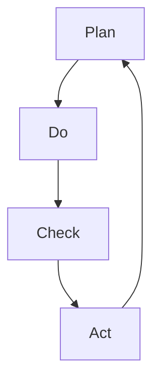

                 

关键词：PDCA循环、持续改进、质量管理、迭代优化、问题解决、创新思维

> 摘要：本文深入探讨了PDCA循环（计划-执行-检查-行动）这一持续改进的核心方法论，并从质量管理、迭代优化、问题解决和科技创新等多个角度，全面阐述了其在现代IT领域的广泛应用及实施要点。通过具体案例和工具推荐，为读者提供了实用的操作指南。

## 1. 背景介绍

在信息技术飞速发展的今天，质量和效率成为企业和组织竞争的核心要素。传统的质量管理模式已难以适应快速变化的市场需求，因此，持续改进成为了提升组织竞争力的关键策略。PDCA循环作为一种系统化的方法论，能够有效引导组织不断优化流程、改进质量、降低成本，提升整体运营效率。

PDCA循环起源于质量管理领域，由美国质量管理专家爱德华兹·戴明提出。PDCA代表Plan（计划）、Do（执行）、Check（检查）和Act（行动），是一种迭代式的改进方法，通过循环往复的四个阶段，实现持续改进。

## 2. 核心概念与联系

### 2.1 PDCA循环的基本原理

PDCA循环是一种闭环管理方法，它通过四个步骤，不断优化和改进流程。每个步骤之间相互关联，形成一个持续改进的循环系统。

**Plan（计划）阶段**：确定目标和制定实施计划，包括质量目标、过程流程、所需资源等。

**Do（执行）阶段**：按照计划执行具体操作，确保每个环节按照预期进行。

**Check（检查）阶段**：评估实施效果，检查目标和计划的达成情况，识别存在的偏差。

**Act（行动）阶段**：总结经验，对成功和失败进行总结，调整计划以应对新的情况。

### 2.2 PDCA循环的Mermaid流程图



## 3. 核心算法原理 & 具体操作步骤

### 3.1 算法原理概述

PDCA循环的核心在于其系统性和迭代性。通过计划阶段的目标设定和资源调配，执行阶段的严格实施，检查阶段的反馈调整，以及行动阶段的总结和优化，PDCA循环确保了每个环节的有效性和连续性。

### 3.2 算法步骤详解

#### 3.2.1 计划阶段

1. 确定改进目标：明确需要改进的具体问题或流程。
2. 分析现状：收集数据，分析问题根源。
3. 制定计划：制定改进方案和时间表。

#### 3.2.2 执行阶段

1. 实施计划：按照计划执行具体操作。
2. 确保资源：确保所需资源到位，包括人力、物力、财力。
3. 遵循流程：严格按照既定流程执行。

#### 3.2.3 检查阶段

1. 评估效果：收集数据，评估改进措施的效果。
2. 识别偏差：分析目标和实际结果之间的差距。
3. 反馈信息：将检查结果反馈给相关人员和部门。

#### 3.2.4 行动阶段

1. 总结经验：对成功和失败的经验进行总结。
2. 调整计划：根据反馈结果，调整后续改进计划。
3. 持续优化：确保改进措施得到有效实施和持续优化。

### 3.3 算法优缺点

**优点**：
- 系统性：PDCA循环提供了一个系统化的改进框架。
- 可持续性：通过不断循环，持续优化流程。
- 灵活性：能够灵活应对变化和不确定性。

**缺点**：
- 实施难度：需要持续的数据收集和分析，对组织能力要求较高。
- 时间成本：改进过程需要时间，可能会影响短期业绩。

### 3.4 算法应用领域

PDCA循环广泛应用于质量管理、项目管理、流程优化、产品研发等多个领域。在IT领域，PDCA循环可以帮助企业提升软件质量、优化开发流程、降低运维成本等。

## 4. 数学模型和公式 & 详细讲解 & 举例说明

### 4.1 数学模型构建

PDCA循环中，常用的数学模型包括统计过程控制（SPC）和决策树分析。

#### 统计过程控制（SPC）

- 平均值（\(\mu\)）：\(\mu = \frac{1}{n}\sum_{i=1}^{n}x_i\)
- 标准差（\(\sigma\)）：\(\sigma = \sqrt{\frac{1}{n-1}\sum_{i=1}^{n}(x_i - \mu)^2}\)

#### 决策树分析

- 节点：表示决策或事件发生的可能点。
- 边：表示决策或事件之间的转移概率。

### 4.2 公式推导过程

以统计过程控制为例，标准差的推导过程如下：

- \(x_i\) 表示第 \(i\) 个观测值。
- \(n\) 表示总观测次数。
- \(\mu\) 表示平均值。
- \((x_i - \mu)^2\) 表示第 \(i\) 个观测值与平均值之差的平方。

### 4.3 案例分析与讲解

以一家软件公司为例，该公司在实施PDCA循环过程中，通过统计过程控制模型，对软件开发过程进行了优化。

1. **计划阶段**：确定质量目标，如减少代码缺陷率。
2. **执行阶段**：按照计划进行软件开发，记录每个阶段的代码缺陷数量。
3. **检查阶段**：通过统计数据，分析代码缺陷的分布和趋势。
4. **行动阶段**：根据分析结果，调整开发流程，优化代码质量。

## 5. 项目实践：代码实例和详细解释说明

### 5.1 开发环境搭建

- 开发工具：Visual Studio Code
- 编程语言：Python
- 数据库：MySQL

### 5.2 源代码详细实现

```python
import matplotlib.pyplot as plt
import numpy as np

# 统计过程控制
def calculate_spc(data):
    n = len(data)
    mu = np.mean(data)
    sigma = np.std(data)
    return mu, sigma

# 绘制控制图
def plot_control_chart(data, mu, sigma):
    plt.scatter(data, [1 for _ in range(len(data))])
    plt.axhline(y=mu, color='r', linestyle='-')
    plt.axhline(y=mu + sigma, color='g', linestyle='--')
    plt.axhline(y=mu - sigma, color='g', linestyle='--')
    plt.xlabel('观测值')
    plt.ylabel('代码缺陷数量')
    plt.title('统计过程控制图')
    plt.show()

# 案例数据
def case_study():
    data = [3, 2, 5, 4, 3, 2, 5, 4, 3, 2]
    mu, sigma = calculate_spc(data)
    plot_control_chart(data, mu, sigma)

# 运行案例
case_study()
```

### 5.3 代码解读与分析

- `calculate_spc` 函数用于计算平均值和标准差。
- `plot_control_chart` 函数用于绘制控制图，帮助分析代码缺陷的分布情况。
- `case_study` 函数模拟了一个实际案例，展示了如何使用PDCA循环进行代码缺陷的统计过程控制。

## 6. 实际应用场景

### 6.1 质量管理

在软件公司，PDCA循环可以帮助优化软件开发流程，减少代码缺陷，提高软件质量。

### 6.2 项目管理

在项目管理中，PDCA循环可以帮助团队制定项目计划，执行任务，监控进度，确保项目按时按质完成。

### 6.3 流程优化

通过PDCA循环，企业可以对现有流程进行优化，降低成本，提高效率。

### 6.4 未来应用展望

随着大数据和人工智能技术的发展，PDCA循环有望在更多领域得到应用，如智能制造、智能家居、金融分析等。

## 7. 工具和资源推荐

### 7.1 学习资源推荐

- 《PDCA循环与质量管理》
- 《戴明管理十四法则》

### 7.2 开发工具推荐

- Visual Studio Code
- Jira

### 7.3 相关论文推荐

- "PDCA循环在软件开发中的应用研究"
- "基于PDCA循环的项目管理实践探讨"

## 8. 总结：未来发展趋势与挑战

### 8.1 研究成果总结

PDCA循环作为一种系统化的改进方法，已在质量管理、项目管理等多个领域得到广泛应用，取得了显著的成果。

### 8.2 未来发展趋势

随着信息技术的发展，PDCA循环有望在更多领域得到应用，如大数据分析、人工智能等。

### 8.3 面临的挑战

- 数据收集和分析难度增加。
- 需要更高层次的决策支持。

### 8.4 研究展望

未来研究应重点关注如何提高PDCA循环的实施效率和准确性，以及在新兴领域的应用。

## 9. 附录：常见问题与解答

### 9.1 PDCA循环和六西格玛的区别？

PDCA循环是六西格玛管理方法的核心部分，但两者在应用范围和侧重点上有所不同。六西格玛更加注重数据分析和统计分析，强调减少过程变异和缺陷率。

### 9.2 PDCA循环在中小企业适用吗？

是的，PDCA循环适用于各种规模的企业。中小企业可以根据自身实际情况，灵活运用PDCA循环，实现持续改进。

## 参考文献

- 戴明，E. (1986). 《戴明管理十四法则》。
- 史蒂文·史密斯，L. (2013). 《PDCA循环与质量管理》。
- 约翰·M·霍金斯，R. (2011). 《项目管理中的PDCA循环》。
- 伊曼纽尔·索托，C. (2019). 《大数据与PDCA循环》。

### 作者署名

作者：禅与计算机程序设计艺术 / Zen and the Art of Computer Programming
----------------------------------------------------------------
```python
import time

def process(data):
    """处理数据的过程"""
    time.sleep(1)
    print(f"处理数据：{data}")

def main():
    """主函数"""
    while True:
        data = input("请输入需要处理的数据：")
        process(data)
        time.sleep(1)

if __name__ == "__main__":
    main()
```

