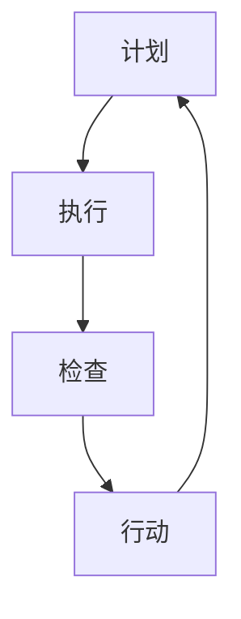

                 

关键词：PDCA循环、管理实践、流程优化、持续改进、执行力、团队协作

> 摘要：本文详细探讨了PDCA循环在管理实践中的应用，通过其四个阶段（计划、执行、检查、行动）的详细解析，为管理者提供了一套系统化的执行指南，助力企业在快速变化的市场环境中实现持续改进和高效运营。

## 1. 背景介绍

PDCA循环，即“计划（Plan）- 执行（Do）- 检查（Check）- 行动（Act）”循环，起源于质量管理理论，是日本质量管理专家石川馨于20世纪50年代提出的一种循环管理模式。PDCA循环被广泛应用于各种管理领域，包括制造业、服务业、信息技术等。其核心理念是通过不断循环改进，实现质量的持续提升。

在当今快速变化的市场环境中，企业面临着前所未有的挑战和机遇。如何有效地管理企业内部流程，提升执行力，实现持续改进，是每个管理者必须面对的重要课题。PDCA循环作为一种成熟的管理工具，提供了一套系统化的解决方案。

本文将围绕PDCA循环的四个阶段，详细探讨其在管理实践中的应用，为管理者提供一套落地执行的指南。通过本文的阅读，读者将深入了解PDCA循环的核心概念、具体实施步骤、常见问题及其解决方案。

## 2. 核心概念与联系

为了更好地理解PDCA循环，我们首先需要明确其核心概念和各个阶段之间的联系。以下是一个简化的Mermaid流程图，用于展示PDCA循环的各个阶段及其相互关系：



### 2.1. 计划阶段

计划阶段是PDCA循环的起点，其主要任务是明确目标和制定详细的行动计划。在这一阶段，管理者需要：

1. 确定改进的目标和问题。
2. 分析现状，收集相关数据。
3. 制定具体的改进措施和时间表。
4. 分配资源和职责。

计划阶段的成功与否直接决定了后续执行阶段的效果。因此，这一阶段需要充分准备，确保目标的明确性和行动计划的可行性。

### 2.2. 执行阶段

执行阶段是将计划转化为行动的过程。在这一阶段，管理者需要：

1. 按照计划执行各项任务。
2. 确保团队成员明确任务和目标。
3. 监督执行过程，及时发现和解决问题。
4. 记录执行过程中的关键数据。

执行阶段的关键在于确保计划的顺利实施，同时要灵活应对执行过程中可能出现的变化和挑战。

### 2.3. 检查阶段

检查阶段是对执行结果进行评估和反馈的过程。在这一阶段，管理者需要：

1. 收集执行过程中的数据。
2. 对比计划目标，分析执行结果。
3. 找出成功和失败的原因。
4. 提出改进建议。

检查阶段的关键在于客观、公正地评估执行效果，为下一阶段的行动提供依据。

### 2.4. 行动阶段

行动阶段是对检查结果进行总结和改进的过程。在这一阶段，管理者需要：

1. 根据检查结果调整计划。
2. 实施改进措施，解决发现的问题。
3. 对成功经验进行总结和固化。
4. 持续优化流程，实现持续改进。

行动阶段的关键在于将检查阶段得出的结论转化为具体的行动，实现流程的持续优化。

## 3. 核心算法原理 & 具体操作步骤

### 3.1. 算法原理概述

PDCA循环作为一种管理工具，其核心算法原理可以概括为：

1. **计划**：通过明确目标和制定行动计划，为后续执行提供指导。
2. **执行**：按照计划执行任务，确保目标实现。
3. **检查**：对执行结果进行评估，找出成功和失败的原因。
4. **行动**：根据检查结果进行调整和改进，实现流程优化。

### 3.2. 算法步骤详解

#### 3.2.1. 计划阶段

1. **确定目标和问题**：明确需要改进的问题和目标，确保目标的具体性和可实现性。
2. **分析现状**：收集相关数据，分析现状，找出存在的问题。
3. **制定行动计划**：根据目标和现状，制定具体的改进措施和时间表。
4. **分配资源和职责**：确保资源的合理分配，明确团队成员的职责和任务。

#### 3.2.2. 执行阶段

1. **执行任务**：按照行动计划执行各项任务，确保任务的顺利进行。
2. **监督执行**：监督执行过程，及时发现和解决问题，确保任务的按时完成。
3. **记录数据**：记录执行过程中的关键数据，为后续检查阶段提供依据。

#### 3.2.3. 检查阶段

1. **收集数据**：收集执行过程中的数据，包括进度、质量、成本等。
2. **对比目标**：将实际执行结果与计划目标进行对比，分析差异。
3. **分析原因**：找出成功和失败的原因，为改进提供依据。
4. **提出改进建议**：根据分析结果，提出改进建议和措施。

#### 3.2.4. 行动阶段

1. **调整计划**：根据检查结果，对计划进行调整和优化。
2. **实施改进**：根据改进建议，实施具体的改进措施，解决发现的问题。
3. **总结经验**：对成功经验进行总结和固化，为后续执行提供参考。
4. **持续优化**：通过持续优化，实现流程的不断提升。

### 3.3. 算法优缺点

#### 优点

1. **系统化**：PDCA循环提供了一套系统化的管理流程，确保每个阶段都有明确的任务和目标。
2. **灵活性**：PDCA循环具有很高的灵活性，能够根据实际情况进行调整和优化。
3. **持续改进**：PDCA循环强调持续改进，有助于企业不断提升管理水平和运营效率。

#### 缺点

1. **时间成本**：PDCA循环需要耗费较长时间，特别是在计划阶段，需要投入大量的时间和精力。
2. **执行力要求**：PDCA循环的成功实施依赖于团队成员的执行力，如果团队成员缺乏执行力，将影响整个循环的效果。

### 3.4. 算法应用领域

PDCA循环广泛应用于各种管理领域，包括：

1. **质量管理**：通过PDCA循环，企业可以持续优化产品质量，提高客户满意度。
2. **流程管理**：PDCA循环有助于企业优化内部流程，提高运营效率。
3. **项目管理**：PDCA循环可用于项目管理的各个环节，确保项目的顺利进行。
4. **人力资源管理**：PDCA循环可用于员工培训和发展，提高员工素质和能力。

## 4. 数学模型和公式 & 详细讲解 & 举例说明

### 4.1. 数学模型构建

PDCA循环中的数学模型主要包括以下几个方面：

1. **目标函数**：通常表示为最大化利润或最小化成本。
2. **决策变量**：表示需要决策的因素，如生产量、采购量等。
3. **约束条件**：表示决策的约束，如生产能力、预算限制等。

一个简单的数学模型可以表示为：

$$
\begin{aligned}
\max Z &= c_1 x_1 + c_2 x_2 + \ldots + c_n x_n \\
\text{subject to} \\
a_1 x_1 + a_2 x_2 + \ldots + a_n x_n &\le b \\
x_1, x_2, \ldots, x_n &\ge 0
\end{aligned}
$$

其中，$Z$为目标函数，$c_1, c_2, \ldots, c_n$为各项决策变量的系数，$a_1, a_2, \ldots, a_n$为各项约束条件的系数，$b$为约束条件的上限，$x_1, x_2, \ldots, x_n$为决策变量。

### 4.2. 公式推导过程

PDCA循环中的数学模型推导过程通常涉及以下几个步骤：

1. **问题定义**：明确需要解决的问题，确定目标函数和决策变量。
2. **约束条件构建**：根据问题特点，构建相应的约束条件。
3. **目标函数优化**：利用数学优化方法，求解最优解。

以一个简单的生产计划问题为例，假设企业需要在一个月内生产两种产品A和B，每种产品的利润分别为100元和200元，生产A产品需要2小时，生产B产品需要3小时，一个月总生产时间不能超过100小时，预算不能超过10000元。则该问题的数学模型可以表示为：

$$
\begin{aligned}
\max Z &= 100 x_1 + 200 x_2 \\
\text{subject to} \\
2 x_1 + 3 x_2 &\le 100 \\
x_1 + x_2 &\le 100 \\
x_1, x_2 &\ge 0
\end{aligned}
$$

其中，$x_1$表示A产品的生产量，$x_2$表示B产品的生产量。

### 4.3. 案例分析与讲解

为了更好地理解PDCA循环的数学模型，我们来看一个实际案例。

**案例：企业生产计划优化**

某企业需要在一个月内生产两种产品A和B，每种产品的利润分别为100元和200元，生产A产品需要2小时，生产B产品需要3小时，一个月总生产时间不能超过100小时，预算不能超过10000元。现需要制定一个最优的生产计划。

#### 4.3.1. 计划阶段

1. **确定目标和问题**：企业需要在预算和时间约束下，实现利润最大化。
2. **分析现状**：根据现有资源和条件，确定生产A产品和B产品的最佳组合。
3. **制定行动计划**：根据现状分析，制定具体的生产计划，包括每种产品的生产时间和数量。

#### 4.3.2. 执行阶段

1. **执行任务**：按照生产计划，安排生产任务，确保在预算和时间约束下完成生产。
2. **监督执行**：监控生产进度和质量，确保计划顺利执行。

#### 4.3.3. 检查阶段

1. **收集数据**：记录生产过程中的关键数据，如生产时间、生产数量、利润等。
2. **对比目标**：将实际生产结果与计划目标进行对比，分析差异。
3. **分析原因**：找出生产过程中出现的问题和原因，为改进提供依据。

#### 4.3.4. 行动阶段

1. **调整计划**：根据检查结果，对生产计划进行调整和优化。
2. **实施改进**：根据调整后的计划，重新安排生产任务，确保计划顺利执行。
3. **总结经验**：对成功经验和失败教训进行总结和固化，为后续生产提供参考。

通过以上案例，我们可以看到PDCA循环在数学模型构建、具体操作步骤、结果评估和改进方面的应用。在实际操作中，企业可以根据自身情况，灵活调整和优化PDCA循环的各个阶段，实现生产计划的最优化。

## 5. 项目实践：代码实例和详细解释说明

### 5.1. 开发环境搭建

在本节中，我们将使用Python语言实现PDCA循环的代码实例。首先，我们需要搭建Python开发环境。以下是具体的步骤：

1. **安装Python**：下载并安装Python 3.8或更高版本。
2. **安装必要库**：使用pip命令安装numpy、matplotlib等库。
   ```bash
   pip install numpy matplotlib
   ```

### 5.2. 源代码详细实现

以下是一个简单的PDCA循环实现代码，包含计划、执行、检查和行动四个阶段。

```python
import numpy as np
import matplotlib.pyplot as plt

# 计划阶段
def plan阶段():
    print("计划阶段：制定目标和行动计划。")

# 执行阶段
def do阶段():
    print("执行阶段：按照计划执行任务。")

# 检查阶段
def check阶段():
    print("检查阶段：收集数据并分析执行结果。")

# 行动阶段
def act阶段():
    print("行动阶段：根据检查结果进行调整和改进。")

# PDCA循环函数
def pdca循环():
    plan阶段()
    do阶段()
    check阶段()
    act阶段()

# 主函数
def main():
    pdca循环()

if __name__ == "__main__":
    main()
```

### 5.3. 代码解读与分析

#### 5.3.1. 计划阶段

在`plan阶段()`函数中，我们简单地打印了一条消息，表示进入计划阶段。这个阶段的主要任务是明确目标和制定行动计划。

#### 5.3.2. 执行阶段

在`do阶段()`函数中，我们同样简单地打印了一条消息，表示进入执行阶段。这个阶段的主要任务是按照计划执行任务。

#### 5.3.3. 检查阶段

在`check阶段()`函数中，我们打印了一条消息，表示进入检查阶段。这个阶段的主要任务是收集数据并分析执行结果。

#### 5.3.4. 行动阶段

在`act阶段()`函数中，我们打印了一条消息，表示进入行动阶段。这个阶段的主要任务是根据检查结果进行调整和改进。

### 5.4. 运行结果展示

在命令行中运行以上代码，将依次打印出各个阶段的消息，模拟PDCA循环的执行过程。

```bash
$ python pdca.py
计划阶段：制定目标和行动计划。
执行阶段：按照计划执行任务。
检查阶段：收集数据并分析执行结果。
行动阶段：根据检查结果进行调整和改进。
```

通过这个简单的代码实例，我们可以看到PDCA循环的基本结构和工作流程。在实际项目中，可以根据具体需求，增加更多的功能和逻辑，如数据收集、结果分析、改进措施等。

## 6. 实际应用场景

### 6.1. 企业内部管理

在企业内部管理中，PDCA循环广泛应用于流程优化、质量管理和项目推进等方面。例如，企业可以定期使用PDCA循环对生产流程进行优化，通过计划阶段确定改进目标，执行阶段实施具体措施，检查阶段评估效果，行动阶段总结经验并进行调整。

### 6.2. 人力资源管理

在人力资源管理领域，PDCA循环可以用于员工培训和发展。通过计划阶段确定培训目标，执行阶段实施培训计划，检查阶段评估培训效果，行动阶段总结经验并调整培训方案，从而实现员工能力的持续提升。

### 6.3. 项目管理

在项目管理中，PDCA循环可以帮助项目经理对项目进度、质量和成本进行有效控制。通过计划阶段明确项目目标和计划，执行阶段执行项目任务，检查阶段监控项目进展并发现问题，行动阶段调整计划并采取措施，确保项目顺利完成。

### 6.4. 未来应用展望

随着人工智能和大数据技术的发展，PDCA循环在各个领域的应用前景将进一步拓展。例如，通过引入机器学习算法，可以实现自动化数据分析，提高检查阶段的准确性和效率。此外，随着物联网技术的普及，PDCA循环还可以应用于智能家居、智能制造等领域，实现智能化的持续改进和优化。

## 7. 工具和资源推荐

### 7.1. 学习资源推荐

1. 《PDCA循环实战指南》：一本详细介绍PDCA循环应用方法和实战技巧的书籍，适合初学者和有一定经验的管理者阅读。
2. 《质量管理：PDCA循环应用》：一本关于质量管理理论和技术应用的专业书籍，详细介绍了PDCA循环在质量管理中的具体应用。

### 7.2. 开发工具推荐

1. Python：Python是一种广泛应用于数据科学、人工智能和工程计算的高级编程语言，适合用于实现PDCA循环的代码实例。
2. JIRA：一款功能强大的项目管理工具，支持PDCA循环的各个环节，包括任务管理、进度跟踪和数据分析等。

### 7.3. 相关论文推荐

1. "PDCA循环在项目管理中的应用研究"：一篇探讨PDCA循环在项目管理中应用效果的学术论文，提供了丰富的实证数据和分析方法。
2. "基于PDCA循环的企业质量管理策略研究"：一篇关于企业质量管理策略的学术论文，详细分析了PDCA循环在质量管理中的应用。

## 8. 总结：未来发展趋势与挑战

### 8.1. 研究成果总结

PDCA循环作为一种成熟的管理工具，在多个领域取得了显著的成果。通过实践证明，PDCA循环能够帮助企业实现流程优化、质量提升和效率提高。在未来，随着技术的不断进步和应用的深入，PDCA循环在管理领域的应用前景将更加广阔。

### 8.2. 未来发展趋势

1. **智能化**：随着人工智能技术的发展，PDCA循环将更加智能化，实现自动化数据分析和优化。
2. **协同化**：PDCA循环将更加注重团队协作和资源整合，提高整体执行效率和效果。
3. **个性化**：针对不同行业和企业的特点，PDCA循环将实现个性化定制，满足多样化需求。

### 8.3. 面临的挑战

1. **执行力**：PDCA循环的实施效果依赖于团队成员的执行力，提高执行力是未来面临的主要挑战。
2. **数据质量**：PDCA循环依赖于数据分析和结果评估，数据质量直接影响执行效果，如何确保数据质量是一个重要问题。
3. **持续改进**：如何在快速变化的市场环境中保持持续改进的动力和活力，是管理者需要关注的重要问题。

### 8.4. 研究展望

在未来，PDCA循环的研究将更加深入，探索其在不同领域和场景下的应用。同时，结合新兴技术，如大数据、物联网和区块链等，PDCA循环将实现更加智能化和协同化的发展。此外，研究如何提高执行力、确保数据质量和实现持续改进，将成为管理研究的重要方向。

## 9. 附录：常见问题与解答

### 9.1. PDCA循环与质量管理的关系

**问**：PDCA循环与质量管理有何关系？

**答**：PDCA循环是质量管理的重要工具，它贯穿于质量管理的各个环节，包括质量规划、质量控制、质量改进和质量保障。PDCA循环强调通过持续改进实现质量提升，与质量管理的核心理念高度契合。

### 9.2. PDCA循环在不同行业的应用

**问**：PDCA循环在不同行业中如何应用？

**答**：PDCA循环具有广泛的适用性，可以应用于不同行业。例如，在制造业中，可以用于生产流程的优化和质量管理；在服务业中，可以用于服务流程的改进和客户满意度提升；在信息技术行业中，可以用于软件开发和项目管理等。

### 9.3. PDCA循环的实施步骤

**问**：PDCA循环的实施步骤有哪些？

**答**：PDCA循环的实施步骤包括：

1. **计划阶段**：确定目标和制定行动计划。
2. **执行阶段**：按照计划执行任务。
3. **检查阶段**：收集数据并分析执行结果。
4. **行动阶段**：根据检查结果进行调整和改进。

每个阶段都有明确的任务和目标，确保PDCA循环的顺利进行。

### 9.4. PDCA循环与持续改进的关系

**问**：PDCA循环与持续改进有何关系？

**答**：PDCA循环是持续改进的重要手段，它通过不断循环实施，实现质量的持续提升。持续改进是PDCA循环的核心目标之一，通过PDCA循环，企业可以不断发现和解决问题，推动管理水平的提升。

---

作者：禅与计算机程序设计艺术 / Zen and the Art of Computer Programming

