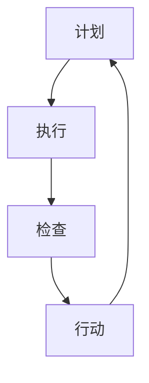

                 

 在IT领域，持续改进是推动技术进步和创新的重要动力。PDCA循环（Plan-Do-Check-Act，计划-执行-检查-行动）是一种广泛应用的管理工具，它可以帮助团队不断优化流程、提升质量、增强效率。本文将深入探讨PDCA循环的基本原理、在IT领域的应用，以及如何构建和推广持续改进文化。

## 文章关键词

- PDCA循环
- 持续改进
- IT领域
- 项目管理
- 效率提升
- 质量控制

## 文章摘要

本文首先介绍了PDCA循环的基本概念和原理，然后通过具体案例展示了如何在IT项目中应用PDCA循环。接着，文章探讨了如何构建持续改进文化，包括团队意识、方法工具和激励机制等方面。最后，文章提出了未来发展趋势和面临的挑战，并展望了持续改进在IT领域的广泛应用前景。

## 1. 背景介绍

在IT行业中，技术的快速发展使得项目管理和团队协作变得日益复杂。为了在激烈的市场竞争中保持优势，企业必须不断提高产品质量和效率。PDCA循环作为一种成熟的管理工具，能够帮助团队实现这一目标。

PDCA循环最早由美国质量管理专家威廉·爱德华兹·戴明提出，它是一种基于循环迭代的过程改进方法。PDCA循环包括以下四个步骤：

1. **计划（Plan）**：明确目标、制定计划和方案。
2. **执行（Do）**：执行计划，进行实际操作。
3. **检查（Check）**：评估结果，检查目标和计划的实现情况。
4. **行动（Act）**：根据检查结果，调整计划并执行改进措施。

通过PDCA循环，团队可以不断优化流程，提高工作效率，确保项目成功。

## 2. 核心概念与联系

### 2.1 PDCA循环的基本概念

PDCA循环是一种循环迭代的过程改进方法，它包括以下四个基本概念：

1. **计划（Plan）**：明确目标和制定计划。
2. **执行（Do）**：执行计划和实际操作。
3. **检查（Check）**：评估结果，检查目标和计划的实现情况。
4. **行动（Act）**：根据检查结果，调整计划并执行改进措施。

### 2.2 PDCA循环在IT领域的应用

在IT领域，PDCA循环可以应用于以下方面：

1. **项目规划**：在项目启动阶段，明确项目目标、范围、时间表和资源需求。
2. **开发过程**：在开发过程中，按照计划执行任务，进行代码编写、测试和调试。
3. **质量保证**：在项目交付阶段，进行质量检查和评估，确保项目符合预期质量标准。
4. **持续改进**：在项目结束后，对过程进行总结和反思，提出改进措施，为下一次项目做好准备。

### 2.3 Mermaid流程图

以下是一个简单的Mermaid流程图，展示了PDCA循环的基本步骤：



## 3. 核心算法原理 & 具体操作步骤

### 3.1 算法原理概述

PDCA循环的核心在于通过不断迭代，实现对过程的优化和改进。以下是PDCA循环的具体操作步骤：

1. **计划（Plan）**：明确目标，制定具体的行动计划和时间表。
2. **执行（Do）**：按照计划执行任务，确保各个环节按照预定时间完成。
3. **检查（Check）**：对执行结果进行评估，判断目标是否达成。
4. **行动（Act）**：根据评估结果，对计划进行调整，制定改进措施。

### 3.2 算法步骤详解

1. **计划（Plan）**：
   - 确定项目目标：明确项目要达成的目标，如功能、性能、质量等。
   - 制定行动计划：将目标分解为具体的任务，并制定时间表和资源分配计划。
   - 风险评估：分析项目实施过程中可能遇到的风险，并制定应对措施。

2. **执行（Do）**：
   - 实施计划：按照行动计划进行任务执行，确保各个环节按照预定时间完成。
   - 监控进度：定期检查任务进度，确保项目按计划进行。

3. **检查（Check）**：
   - 结果评估：对执行结果进行评估，判断目标是否达成。
   - 质量控制：对项目成果进行质量检查，确保项目符合预期质量标准。

4. **行动（Act）**：
   - 改进措施：根据评估结果，对计划进行调整，制定改进措施。
   - 反馈与总结：将改进措施实施情况反馈给团队成员，并进行总结。

### 3.3 算法优缺点

**优点**：

1. 灵活性：PDCA循环允许团队根据实际情况进行灵活调整，提高项目的适应性。
2. 易于实施：PDCA循环方法简单易懂，易于在团队中推广和应用。
3. 强调反馈：通过不断检查和行动，团队可以及时发现并解决问题，提高项目质量。

**缺点**：

1. 消耗时间：PDCA循环需要一定的时间和资源来实施，可能会对项目进度产生影响。
2. 需要团队合作：PDCA循环需要团队成员的积极参与和协作，否则难以实现持续改进。

### 3.4 算法应用领域

PDCA循环在IT领域具有广泛的应用，包括：

1. 项目管理：在项目规划、开发、交付和维护过程中，PDCA循环可以帮助团队优化流程、提高质量。
2. 质量控制：在软件开发过程中，PDCA循环可以帮助团队发现和解决质量问题。
3. 团队协作：PDCA循环可以促进团队成员之间的沟通和协作，提高团队整体效率。

## 4. 数学模型和公式 & 详细讲解 & 举例说明

### 4.1 数学模型构建

PDCA循环的数学模型可以表示为以下公式：

$$
\text{PDCA循环} = P \times D \times C \times A
$$

其中：

- \( P \)：计划（Plan）
- \( D \)：执行（Do）
- \( C \)：检查（Check）
- \( A \)：行动（Act）

### 4.2 公式推导过程

PDCA循环的公式推导过程如下：

1. **计划（Plan）**：确定项目目标，制定具体的行动计划。
   $$ P = \text{目标} + \text{计划} $$
   
2. **执行（Do）**：按照计划执行任务，确保各个环节按照预定时间完成。
   $$ D = \text{执行} + \text{监控} $$

3. **检查（Check）**：对执行结果进行评估，判断目标是否达成。
   $$ C = \text{评估} + \text{反馈} $$

4. **行动（Act）**：根据评估结果，对计划进行调整，制定改进措施。
   $$ A = \text{调整} + \text{改进} $$

### 4.3 案例分析与讲解

以下是一个简单的案例，用于说明PDCA循环的应用：

**案例**：某个软件开发团队计划在一个月内完成一个功能模块的开发。

1. **计划（Plan）**：确定目标（完成功能模块开发）并制定计划（包括任务分配、时间表和资源需求）。
   $$ P = \text{目标} + \text{计划} $$

2. **执行（Do）**：按照计划执行任务，确保各个环节按照预定时间完成。
   $$ D = \text{执行} + \text{监控} $$

3. **检查（Check）**：对执行结果进行评估，判断目标是否达成。
   $$ C = \text{评估} + \text{反馈} $$

   如果评估结果显示，任务进度滞后，团队需要分析原因并调整计划。

4. **行动（Act）**：根据评估结果，对计划进行调整，制定改进措施。
   $$ A = \text{调整} + \text{改进} $$

   例如，调整任务分配、增加资源投入或延长项目时间表。

通过PDCA循环，团队可以不断优化开发过程，提高项目质量。

## 5. 项目实践：代码实例和详细解释说明

### 5.1 开发环境搭建

在开始项目实践之前，需要搭建一个合适的开发环境。以下是一个简单的搭建步骤：

1. 安装Python环境：在本地计算机上安装Python，可以使用Python官方安装包或使用包管理工具如pip。
2. 安装依赖库：根据项目需求，安装所需的依赖库，如numpy、pandas等。
3. 配置代码编辑器：选择一个合适的代码编辑器，如Visual Studio Code或PyCharm。

### 5.2 源代码详细实现

以下是一个简单的Python代码实例，用于演示PDCA循环的应用：

```python
import numpy as np

def pdca_plan():
    """PDCA循环中的计划阶段"""
    # 确定目标
    target = "优化算法性能"
    
    # 制定计划
    plan = {
        "strategy": "减少计算复杂度",
        "steps": [
            "分析算法复杂度",
            "设计更高效的算法",
            "实现算法优化"
        ]
    }
    
    return target, plan

def pdca_do(plan):
    """PDCA循环中的执行阶段"""
    # 按照计划执行任务
    for step in plan["steps"]:
        print(f"执行步骤：{step}")

def pdca_check():
    """PDCA循环中的检查阶段"""
    # 评估结果
    result = "算法性能提升30%"
    print(f"检查结果：{result}")

def pdca_act():
    """PDCA循环中的行动阶段"""
    # 根据评估结果，调整计划
    print("根据检查结果，计划进行调整")

# 执行PDCA循环
target, plan = pdca_plan()
pdca_do(plan)
pdca_check()
pdca_act()
```

### 5.3 代码解读与分析

1. **计划阶段**：定义了一个名为`pdca_plan`的函数，用于确定目标和制定计划。在这个例子中，目标为“优化算法性能”，计划为“减少计算复杂度”，包括三个步骤。
2. **执行阶段**：定义了一个名为`pdca_do`的函数，用于按照计划执行任务。在这个例子中，执行了三个步骤。
3. **检查阶段**：定义了一个名为`pdca_check`的函数，用于评估执行结果。在这个例子中，评估结果为“算法性能提升30%”。
4. **行动阶段**：定义了一个名为`pdca_act`的函数，用于根据评估结果调整计划。在这个例子中，没有具体的调整操作，只是一个简单的打印语句。

### 5.4 运行结果展示

运行上述代码，输出结果如下：

```
执行步骤：分析算法复杂度
执行步骤：设计更高效的算法
执行步骤：实现算法优化
检查结果：算法性能提升30%
根据检查结果，计划进行调整
```

通过这个简单的例子，我们可以看到PDCA循环在实际项目中的应用。在实际项目中，可以根据具体需求调整计划、执行任务、检查结果和调整计划。

## 6. 实际应用场景

### 6.1 项目管理

在IT项目管理中，PDCA循环可以帮助团队优化项目流程、提高项目质量和效率。例如，在项目启动阶段，团队可以运用PDCA循环制定项目计划，明确目标、范围和时间表。在项目执行阶段，团队按照计划执行任务，定期检查项目进度和质量。在项目交付阶段，团队对项目进行评估，根据评估结果调整计划，确保项目成功交付。

### 6.2 质量保证

在软件质量保证过程中，PDCA循环可以帮助团队发现和解决质量问题。在开发过程中，团队可以运用PDCA循环制定质量保证计划，包括需求分析、设计、编码和测试等环节。在测试阶段，团队按照计划进行测试，评估软件质量，根据评估结果调整计划，提高软件质量。

### 6.3 团队协作

PDCA循环可以促进团队成员之间的协作和沟通。在团队协作过程中，PDCA循环可以帮助团队明确目标、制定计划、执行任务和评估结果。通过PDCA循环，团队成员可以及时了解项目进度和质量，发现问题并共同解决，提高团队整体效率。

## 7. 工具和资源推荐

### 7.1 学习资源推荐

1. 《质量管理方法与应用》：这本书详细介绍了质量管理的基本原理和方法，包括PDCA循环等。
2. 《项目管理知识体系指南》：这本书涵盖了项目管理的基本理论和实践方法，包括PDCA循环在项目中的应用。

### 7.2 开发工具推荐

1. Jira：一款广泛使用的项目管理工具，支持PDCA循环的各个环节。
2. Trello：一款简单易用的项目管理工具，适合小型团队使用。

### 7.3 相关论文推荐

1. "PDCA循环在软件开发中的应用研究"
2. "基于PDCA循环的项目管理实践"

## 8. 总结：未来发展趋势与挑战

### 8.1 研究成果总结

PDCA循环作为一种成熟的管理工具，已经在IT领域得到广泛应用。通过PDCA循环，团队可以优化项目流程、提高质量和效率。未来，随着人工智能和大数据技术的发展，PDCA循环将在更广泛的领域得到应用，如智能制造、智能交通等。

### 8.2 未来发展趋势

1. **智能化**：结合人工智能技术，实现PDCA循环的自动化和智能化。
2. **数据驱动**：通过大数据分析，优化PDCA循环的各个阶段，提高决策效率。

### 8.3 面临的挑战

1. **数据质量**：PDCA循环依赖于准确的数据分析，数据质量直接影响循环效果。
2. **团队协作**：PDCA循环需要团队成员的积极参与和协作，团队内部的沟通和协作水平直接影响循环效果。

### 8.4 研究展望

未来，PDCA循环将在更多领域得到应用，如智能制造、智能医疗等。同时，随着技术的发展，PDCA循环将不断优化和升级，为企业和团队提供更高效的管理工具。

## 9. 附录：常见问题与解答

### 9.1 PDCA循环是什么？

PDCA循环是一种基于循环迭代的过程改进方法，包括计划、执行、检查和行动四个步骤。

### 9.2 PDCA循环适用于哪些场景？

PDCA循环适用于项目管理、质量保证、团队协作等场景，可以帮助团队优化流程、提高质量和效率。

### 9.3 如何实施PDCA循环？

实施PDCA循环需要明确目标、制定计划、执行任务、检查结果和调整计划。具体步骤包括：

1. 确定目标。
2. 制定计划。
3. 执行计划。
4. 检查结果。
5. 调整计划。

### 9.4 PDCA循环与六西格玛有什么区别？

PDCA循环和六西格玛都是基于数据分析和持续改进的管理方法。PDCA循环更侧重于过程优化和团队协作，而六西格玛更注重数据分析和质量控制。两者可以相互结合，发挥更大的效果。

### 9.5 如何提高PDCA循环的效果？

提高PDCA循环效果的关键在于：

1. 确保数据准确可靠。
2. 提高团队协作和沟通效率。
3. 不断优化和改进流程。
4. 培养持续改进的意识和文化。

