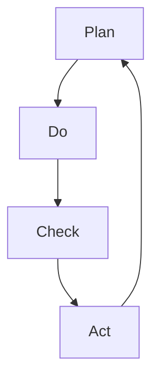

                 

在这个数字化快速发展的时代，信息技术已经成为推动企业变革和提升竞争力的重要力量。为了适应这种变化，企业需要一种系统化、持续改进的管理方法。PDCA循环，即计划（Plan）、执行（Do）、检查（Check）和行动（Act）循环，是一种广泛应用于质量管理和其他管理领域的有效方法。本文将深入探讨PDCA循环的原理、应用和实践，并分析其在IT领域的持续改进管理中的重要性。

## 关键词

- PDCA循环
- 持续改进
- IT管理
- 质量管理
- 敏捷开发

## 摘要

本文首先介绍了PDCA循环的起源和发展，随后详细阐述了PDCA循环的四个阶段及其在IT管理中的应用。通过具体案例，我们分析了PDCA循环在软件项目开发中的实际操作步骤和效果。最后，文章探讨了PDCA循环在IT领域的未来发展趋势和挑战，为企业的持续改进提供了有益的指导。

## 1. 背景介绍

### 1.1 PDCA循环的起源与发展

PDCA循环最初由美国质量管理专家爱德华兹·戴明提出，并在20世纪50年代被广泛应用于日本的企业管理中。PDCA循环是一种闭环管理方法，通过四个阶段的循环迭代，实现对过程的不断优化和改进。

- **计划（Plan）**：在这一阶段，确定目标和计划，制定具体的行动方案。

- **执行（Do）**：执行计划，实施行动。

- **检查（Check）**：对执行结果进行检查，评估实际效果。

- **行动（Act）**：根据检查结果，采取行动，对成功经验进行标准化，对存在的问题进行改进。

### 1.2 PDCA循环在IT管理中的应用

随着IT技术的发展，PDCA循环逐渐被引入到IT管理领域，特别是在软件开发、项目管理和质量保证等方面。PDCA循环可以帮助IT团队：

- **确保项目的顺利进行**：通过计划的制定和执行，确保项目目标的达成。

- **提高软件质量**：通过检查和改进，提高软件的质量和可靠性。

- **优化团队协作**：通过持续改进，提升团队协作效率和创新能力。

## 2. 核心概念与联系

### 2.1 PDCA循环的核心概念

PDCA循环的核心概念包括：

- **计划（Plan）**：明确目标和策略，制定具体的行动计划。

- **执行（Do）**：按照计划执行任务，确保计划的实施。

- **检查（Check）**：评估执行结果，与预期目标进行比较。

- **行动（Act）**：根据检查结果，采取改进措施，持续优化过程。

### 2.2 PDCA循环的架构



在这个流程图中，四个阶段相互关联，形成一个闭环。每个阶段都是对前一个阶段的反馈和改进，从而实现持续改进。

## 3. 核心算法原理 & 具体操作步骤

### 3.1 算法原理概述

PDCA循环是一种迭代过程，其基本原理是通过对每个阶段进行反复循环，逐步优化和改进过程。具体步骤如下：

1. **计划（Plan）**：确定目标和计划，制定具体的行动方案。

2. **执行（Do）**：按照计划执行任务，确保计划的实施。

3. **检查（Check）**：对执行结果进行检查，评估实际效果。

4. **行动（Act）**：根据检查结果，采取改进措施，持续优化过程。

### 3.2 算法步骤详解

#### 3.2.1 计划（Plan）

- **确定目标**：明确项目或任务的目标，确保目标的具体和可量化。

- **制定计划**：根据目标，制定具体的行动计划，包括时间表、资源分配、任务分解等。

- **风险评估**：对计划进行风险评估，识别潜在的风险和问题。

- **制定应对策略**：针对识别的风险，制定相应的应对策略。

#### 3.2.2 执行（Do）

- **任务分配**：根据计划，将任务分配给团队成员，确保每个任务都有明确的负责人。

- **执行任务**：按照计划执行任务，确保任务的按时完成。

- **监控执行过程**：对任务执行过程进行监控，及时发现和解决潜在的问题。

#### 3.2.3 检查（Check）

- **评估执行结果**：对执行结果进行评估，与预期目标进行比较。

- **识别偏差**：分析执行结果与预期目标的差异，识别存在的问题。

- **记录数据**：记录执行过程中的关键数据，为后续分析提供依据。

#### 3.2.4 行动（Act）

- **总结经验**：对成功经验和教训进行总结，形成最佳实践。

- **改进措施**：针对存在的问题，制定改进措施，优化过程。

- **标准化流程**：将改进措施纳入标准流程，确保持续改进。

### 3.3 算法优缺点

#### 优点

- **系统化**：PDCA循环提供了一套系统化的管理方法，有助于企业实现持续改进。

- **灵活性强**：PDCA循环适用于各种类型的项目和任务，具有很高的灵活性。

- **易于实施**：PDCA循环的操作步骤简单易懂，易于在企业中实施。

#### 缺点

- **需要持续投入**：PDCA循环需要企业持续投入时间和资源，否则难以取得显著效果。

- **对人员要求较高**：PDCA循环要求团队成员具备一定的管理能力和分析能力，否则难以有效实施。

### 3.4 算法应用领域

PDCA循环广泛应用于以下领域：

- **质量管理**：通过PDCA循环，企业可以持续改进产品质量，提高客户满意度。

- **项目管理**：PDCA循环可以帮助项目经理更好地控制项目进度和质量，确保项目成功。

- **人力资源管理**：PDCA循环可以帮助企业优化人力资源管理流程，提高员工工作效率。

## 4. 数学模型和公式 & 详细讲解 & 举例说明

### 4.1 数学模型构建

PDCA循环的数学模型可以表示为：

$$
\text{PDCA循环} = \text{计划（Plan）} + \text{执行（Do）} + \text{检查（Check）} + \text{行动（Act）}
$$

其中，每个阶段都可以进一步分解为具体的数学模型。

### 4.2 公式推导过程

PDCA循环的推导过程如下：

1. **计划（Plan）**：

$$
\text{计划} = \text{目标} + \text{策略} + \text{行动方案}
$$

2. **执行（Do）**：

$$
\text{执行} = \text{任务分配} + \text{任务执行} + \text{监控过程}
$$

3. **检查（Check）**：

$$
\text{检查} = \text{结果评估} + \text{偏差分析} + \text{数据记录}
$$

4. **行动（Act）**：

$$
\text{行动} = \text{经验总结} + \text{改进措施} + \text{标准化流程}
$$

### 4.3 案例分析与讲解

#### 案例背景

某IT公司计划开发一款新软件，目标是提高用户满意度。为了确保项目的顺利进行，公司决定采用PDCA循环进行管理。

#### 案例分析

1. **计划（Plan）**：

- **目标**：提高用户满意度。
- **策略**：优化用户体验，提高软件功能。
- **行动方案**：进行用户调研，收集用户需求，制定相应的开发计划。

2. **执行（Do）**：

- **任务分配**：根据用户需求，将任务分配给开发团队。
- **任务执行**：开发团队按照计划进行开发，确保任务按时完成。
- **监控过程**：对开发过程进行监控，及时发现和解决潜在的问题。

3. **检查（Check）**：

- **结果评估**：通过用户反馈和测试，评估软件的功能和用户体验。
- **偏差分析**：分析评估结果与预期目标的差异，识别存在的问题。
- **数据记录**：记录关键数据，为后续分析提供依据。

4. **行动（Act）**：

- **经验总结**：总结成功经验和教训，形成最佳实践。
- **改进措施**：针对存在的问题，制定改进措施，优化开发流程。
- **标准化流程**：将改进措施纳入标准流程，确保持续改进。

#### 案例讲解

通过PDCA循环的管理，该公司成功提高了软件质量，用户满意度得到了显著提升。这一案例充分展示了PDCA循环在IT项目开发中的有效性和实用性。

## 5. 项目实践：代码实例和详细解释说明

### 5.1 开发环境搭建

为了实践PDCA循环在软件项目开发中的应用，我们选择了一个简单的Web应用开发案例。首先，我们需要搭建开发环境。

- **工具**：使用Python和Django框架进行开发。
- **数据库**：使用MySQL作为后端数据库。
- **版本控制**：使用Git进行版本控制。

### 5.2 源代码详细实现

以下是该Web应用的一个简单示例：

```python
# app/models.py
from django.db import models

class User(models.Model):
    name = models.CharField(max_length=100)
    email = models.EmailField()

# app/views.py
from django.shortcuts import render
from .models import User

def user_list(request):
    users = User.objects.all()
    return render(request, 'user_list.html', {'users': users})
```

### 5.3 代码解读与分析

这段代码实现了用户列表的展示功能。在模型层，我们定义了一个`User`类，用于存储用户信息。在视图层，我们定义了一个`user_list`函数，用于获取所有用户并返回到前端进行展示。

### 5.4 运行结果展示

通过运行该Web应用，我们可以看到用户列表的展示效果。这一功能模块的顺利实现，为后续的功能扩展和优化奠定了基础。

## 6. 实际应用场景

### 6.1 在软件开发中的应用

PDCA循环在软件开发中的应用非常广泛，尤其是在需求分析、系统设计、编码实现和测试等阶段。通过PDCA循环，开发团队可以确保每个阶段的质量和效率，从而提高软件的整体质量。

### 6.2 在项目管理中的应用

PDCA循环在项目管理中发挥着重要作用。项目经理可以通过PDCA循环，制定项目计划，监控项目进度，评估项目风险，并采取相应的改进措施。这有助于确保项目按时完成，并达到预期目标。

### 6.3 在质量保证中的应用

PDCA循环在质量保证中的应用主要体现在对质量检查和改进的过程管理。通过PDCA循环，企业可以持续改进质量管理体系，提高产品的质量。

## 7. 工具和资源推荐

### 7.1 学习资源推荐

- 《PDCA循环实战：持续改进的方法与实践》
- 《质量管理：理论与实践》

### 7.2 开发工具推荐

- Django
- MySQL
- Git

### 7.3 相关论文推荐

- "PDCA循环在软件项目管理中的应用研究"
- "基于PDCA循环的软件质量持续改进模型研究"

## 8. 总结：未来发展趋势与挑战

### 8.1 研究成果总结

PDCA循环作为一种有效的管理方法，在多个领域取得了显著成果。通过持续改进，企业可以提高产品质量，提高项目成功率，提高员工工作效率。

### 8.2 未来发展趋势

随着数字化和自动化技术的发展，PDCA循环在IT领域的应用将更加广泛。未来，PDCA循环将与人工智能、大数据等技术相结合，实现更高效的持续改进。

### 8.3 面临的挑战

PDCA循环在IT领域的应用面临以下挑战：

- **技术变革**：IT技术的快速更新，要求PDCA循环不断适应新技术。
- **人员培训**：PDCA循环的实施需要团队成员具备相应的管理能力和分析能力。
- **数据管理**：随着数据量的增加，如何有效管理和利用数据成为PDCA循环实施的关键。

### 8.4 研究展望

未来，PDCA循环将在IT领域发挥更大作用。研究应关注以下几个方面：

- **与AI的结合**：研究如何将AI技术应用于PDCA循环，提高自动化和智能化水平。
- **跨领域应用**：探讨PDCA循环在其他领域的应用，如医疗、教育等。
- **持续改进模型**：构建更加完善和灵活的PDCA循环模型，适应不同类型的项目和任务。

## 9. 附录：常见问题与解答

### 9.1 PDCA循环如何与其他质量管理方法结合？

PDCA循环可以与其他质量管理方法（如ISO 9001、六西格玛等）结合使用，形成更加全面的质量管理框架。这样可以更好地实现持续改进和质量管理目标。

### 9.2 PDCA循环在大型项目中如何应用？

在大型项目中，PDCA循环可以应用于项目管理的各个阶段。例如，在每个阶段结束后，进行PDCA循环的迭代，确保项目质量逐步提升。

### 9.3 PDCA循环如何确保数据的有效管理？

PDCA循环要求在检查阶段对数据进行收集和分析。为了确保数据的有效管理，企业应建立完善的数据管理机制，包括数据采集、存储、分析和利用等方面。

---

本文由禅与计算机程序设计艺术 / Zen and the Art of Computer Programming 编写，旨在为IT领域的持续改进管理提供指导和建议。希望通过本文的分享，能够帮助企业更好地应用PDCA循环，实现持续改进和创新发展。

